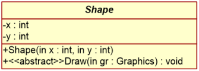

# Az UML osztálydiagram és a kód kapcsolatának elmélete

Utolsó módosítás ideje: 2022.10.15  
Kidolgozta: Benedek Zoltán

A fejezet nem tartalmaz feladatot, a hallgatók számára ismerteti a kapcsoló elméletet.

## Bevezető

A fejezet egy rövid, vázlatos áttekintést ad az UML osztálydiagram és a forráskód közötti leképezés alapjairól, a megelőző félévben Szoftvertechnológia tárgyból már tanultak ismétléseként.

Napjainkban számos szoftverfejlesztési módszertan létezik. Ezek különböző mértékben építenek arra, illetve követelik meg, hogy a szoftver elkészítése során modellezést alkalmazzunk. Az azonban kétségtelen, hogy még a legagilisabb, leginkább „kódcentrikus” szemléletmódok követői is hasznosnak ítélik a szoftver fontosabb/komplexebb komponenseinek és szerkezeti elemeinek vizuális modellezését annak grafikus voltából adódó nagyobb kifejező ereje miatt.

Tegyük fel, hogy feladatunk egy alkalmazás, vagy annak adott moduljának elkészítése. A választott módszertanunkat követve – jó eséllyel több iterációban – a követelmény elemzés, analízis, tervezés, implementáció és tesztelés lépéseit fogjuk érinteni. Koncentráljunk most a tervezési fázisra. Ennek során elkészül a rendszer (legalábbis bizonyos részeinek) részletes terve, mely kimenete a részletes/ implementációs terv, illetve modell. Ezen a szinten a modellben szereplő bizonyos elemek (pl. osztályok) egyértelműen leképezhetők az adott alrendszer implementációjául választott programozási nyelv elemeire. Ha jó a fejlesztő/modellező eszközünk, akkor az le tudja generálni az osztályok vázát (pl. C++, Java, C# osztályok). A feladatunk ezt követően a generált kódban szereplő a metódusok törzsének kitöltése.

### Fogalmak

- Forward engineering: modellből kód generálása. A részletes tervből a modellező eszköz le tudja generálni a programvázat. Előnye, hogy kevesebbet kell kódolni.
- Reverse engineering: kódból modell generálása. A már kész kód megértését segíti.
- Round-trip engineering: az előző kettő együttes alkalmazása. A lényeg: a modell és a kód végig szinkronban van. Ha a kódban változtatunk, a változás megjelenik a modellben, ha a modellben változtatunk, a változás megjelenik a kódban.

Ahhoz, hogy a kódgenerálás előnyeivel élni tudjunk, a következőkkel kell tisztában legyünk: ismernünk kell, hogy az adott modellező eszköz az egyes modell elemeket hogyan képezi le az adott programozási nyelv elemeire. A leképezés függ a nyelvtől és a modellező eszköztől is, nincs rá univerzális szabvány. A leképezések általában maguktól értetődőek, túl nagy eltérés nem szokott lenni.

A következőkben azt tekintjük át, hogy az UML osztálydiagram egyes modellelemei hogyan képződnek le forráskódra, és viszont.

## Osztályok leképezése

Mondhatni triviálisan egyszerű:

- UML osztály -> osztály
- UML attribútum -> tagváltozó
- UML művelet -> művelet/metódus

Egy példa:



, mely a következő kódnak felel meg C# nyelven:

```cs
public abstract class Shape
{
    private int x;
    private int y;
    public Shape(int x, int y) { this.x = x; this.y = y; }
    public abstract void Draw(Graphics gr);
}
```

A láthatóság kapcsán a leképezés:

- +: public
- -: private
- \#: protected

Ennél izgalmasabb kérdéskör, hogy milyen módon történik az osztályok közötti kapcsolatok leképezése, ezt a következő fejezetek ismertetik.

### I. Általánosítás, specializáció kapcsolat


C# leképezés:

```cs
public class Base
{ };
public class Derived : Base
{ };
```

### II. Asszociáció

Ez a kapcsolattípus mindig kommunikációt jelent az osztályok objektumai között. Egy adott osztály igénybe veszi egy másik osztály szolgáltatásait.

#### A) Leképezés 0..1 multiplicitású asszociációs kapcsolat esetén

Ebben az esetben egy pointert vagy referenciát tartalmaz a kliens osztály, melyen keresztül igénybe tudja venni a célosztály szolgáltatásait (meg tudja hívni annak műveleteit).
Példa:


C++ leképezés:

```cpp
class Application
{
   WindowManager* windowManager;
};

class WindowManager
{
};
```

C# leképezés (nincsenek pointerek, csak referenciák):

```cs
class Application
{
   WindowManager windowManager;
};

class WindowManager
{
};
```

Minkét esetben azt látjuk, hogy **a kliens osztályba felveszünk egy pointer vagy referencia tagváltozót, melynek típusa megegyezik az asszociációban hivatkozott célosztály típusával, illetve a tagváltozó neve az asszociációs kapcsolatra a célosztályra megadott szereppel (role)**, mely a példában a `windowManager`.
A leképezés logikus, hiszen a kliens ezen pointeren/referencián keresztül tudja a célobjektumot bármely műveletéből elérni és metódusait meghívni.

Megjegyzés. Előfordulhat, hogy az asszociáció kétirányú, mindkét osztály igénybe veszi a másik szolgáltatásait. Ilyenkor sokszor nem tesszük ki az asszociáció mindkét végére a nyilat, hanem mindkét végéről elhagyjuk azt. Ilyen kétirányú kapcsolat esetén a szerepet (role) a kapcsolat mindkét végén meg kell adni. A leképezés során mindkét osztályba felveszünk egy pointert/referenciát a másikra.

#### B) Leképezés 0..n multiplicitású asszociációs kapcsolat esetén

Ebben az esetben egy kliensoldali objektum több céloldali objektummal van kapcsolatban. Példa:


Egy `WindowManager` objektum több `Window` objektumot menedzsel. **A leképezés során a kliens osztályba a célosztálybeli objektumok valamilyen gyűjteményét vesszük fel.** Ez lehet tömb, lista, stb., ami a célunknak az adott helyzetben leginkább megfelel.

Egy leképzési lehetőség a fenti példára C++ nyelven:

```cpp
class WindowManager
{
  vector<Window*> windows;
};
```

Illetve C# nyelven:

```cs
class WindowManager
{
  List<Window> windows; 
};
```

### III. Aggregáció (tartalmazás, rész-egész viszony)

Általában a leképezése pontosan úgy történik, mint az asszociáció esetében.

### IV. Függőség (dependency)

A leglazább kapcsolatot jelenti osztályok között. Példa:


A jelentése: a `Window` osztály függ a `Graphics` osztálytól. Vagyis, ha a `Graphics` osztály megváltozik, akkor lehet, hogy a Window osztályt is meg kell változtatni.
Ezt a kapcsolattípust akkor szoktuk használni, ha a függőségi kapcsolat elején levő osztály metódusai paraméterlistájában/visszatérési értékében szerepel a kapcsolat végén levő osztály. A példában a Window osztály onDraw művelete paraméterként megkapja a Graphics osztály egy objektumát, így függ tőle, hiszen a metódus törzsében így meg tudja hívni a `Graphics` osztály metódusait. Ha pl. a `Graphics` osztály `FillRect` metódusának nevét megváltoztatjuk, akkor ezt a változást át kell vezetni a hívások helyén, vagyis a Window osztály onDraw metódusának törzsében is.
