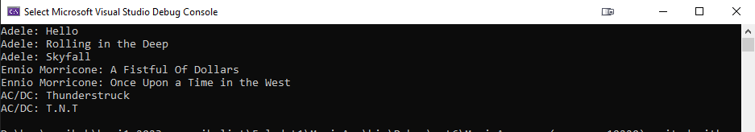
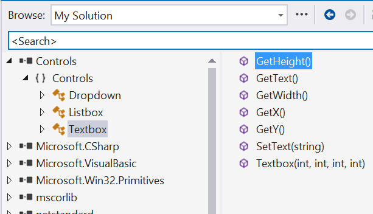

# 1. HF - A modell és a kód kapcsolata

## Bevezetés

A feladathoz nem kapcsolódik előadás.  A feladatok elméleti és gyakorlati hátteréül az  "1. A modell és a kód kapcsolata" vezetett laborgyakorlat szolgál:

- Ezt a laborgyakorlatot a hallgatók a gyakorlatvezető útmutatásával, a gyakorlatvezetővel közösen vezetett módon végzik/végezték el.
- A laborgyakorlathoz útmutató tartozik, mely részletekbe menően bemutatja az elméleti hátteret, valamint lépésenként ismerteti a megoldás elkészítését: [1. A modell és a kód kapcsolata](../../labor/1-model-es-kod-kapcsolata/index.md)

Erre építve jelen önálló gyakorlat feladatai a feladatleírást követő rövidebb iránymutatás segítségével elvégezhetők.

Az önálló gyakorlat célja:

- Egy egyszerű .NET alkalmazás elkészítése, C# alapok gyakorlása
- Az UML és a kód kapcsolatának szemléltetése
- Az interfész és az absztrakt ősosztály alkalmazástechnikájának gyakorlása

A szükséges fejlesztőkörnyezetről [itt](../fejlesztokornyezet/index.md) található leírás.

## A kiindulási keret letöltése, az elkészült megoldás feltöltése

A házi feladat kiindulási környezetének publikálása, valamint a megoldás beadása Git, GitHub és GitHub Classroom segítségével történik. Főbb lépések:

1. GitHub Classroom segítségével hozz létre magadnak egy repository-t. A meghívó URL-t a tárgy AUT honlapján találod.
2. Klónozd le az így elkészült repository-t. Ez tartalmazni fogja a megoldás elvárt szerkezetét.
3. A feladatok elkészítése után commit-old és push-old a megoldásod. 

Ezekhez itt található részletesebb leírás:

- [Git, GitHub, GitHub Classroom](../git-github-github-classroom/index.md)
- [A kiinduló alkalmazáskeret letöltésének és a feladat beadásának részletes lépései](../hf-folyamat/index.md)

## A házi feladat előellenőrzése

### A házi feladat előellenőrzése és hivatalos értékelése

- Minden egyes alkalommal, miután a GitHub-ra push-oltál kódot, a GitHub-on automatikusan lefut a feltöltött kód (elő)ellenőrzése, és meg lehet nézni a kimenetét! Az ellenőrzőt maga a GitHub futtatja. A push-t követően a feladat egy várakozási sorba kerül, majd adott idő után lefutnak az ellenőrző tesztek. Azt nem lehet tudni, mennyi ez az idő, a GitHub-on múlik. Amikor csak egy-két feladat van a sorban a szervezetre (ez nálunk a tárgy), akkor a tapasztalatok alapján az ellenőrzés 1-2 percen belül elindul. De ha a tárgy alatt egyszerre sokan kezdik majd feltölteni a megoldást, akkor ez jó eséllyel belassul. Nem érdemes ezért sem az utolsó pillanatra hagyni a beadást: lehet, hogy ekkor a késleltetések miatt már nem kapsz esetleg időben visszajelzést.
- :exclamation: **Hivatalosan a feladat azon állapota kerül értékelésre, amely a határidő lejártakor GitHub-on fent van.** A hivatalos ellenőrzést szokásos módon, saját, oktatói környezetben végezzük és az eredményt a tárgy honlapján publikáljuk a számonkérésnél. Vagyis a hivatalos eredmény tekintetében teljesen mindegy, hogy a GitHub-on a határidő lejárta lefutott-e már bármiféle (elő)ellenőrzés, vagy hogy az ellenőrzés estleg csak később tudott elindulni. A GitHub általi ellenőrzés csak azt a célt szolgálja, hogy még a határidő lejárta előtt visszajelzést kaphasson mindenki. A hivatalos ellenőrzés tartalmaz még plusz lépéseket a GitHub alapú előellenőrzéshez lépest, az előellenőrzés ilyen értelemben részleges, de azért sok problémát segíthet megfogni!
- :exclamation: **Arra kérünk, hogy ne apránként push-olj, csak a kész, átnézett, forduló megoldást tedd fel!** Ez nem a legszerencsésebb, de a GitHub korlátozott időt biztosít az ellenőrzők futtatására:   ha elfogy a havi keret, akkor már nem fogtok visszajelzést kapni, csak a határidő utáni hivatalos ellenőrzés kimenetét kapja meg mindenki.
- A (fél)automata ellenőrző, most még egy részben kísérleti projekt. Ha valaki az útmutatóban inkonzisztenciát talál, vagy az ellenőrző adott helyzetet nem kezel és indokolatlanul panaszkodik, Benedek Zoltán felelős oktató felé legyen szíves jelezni! Ugyanakkor ezeket nagy tömegben nem fogjuk tudni kezelni. Ha jó a megoldásod, és az ellenőrző indokolatlanul panaszkodik, a hivatalos ellenőrzés során természetesen el fogjuk fogadni.
- Az előellenőrző – különösen az első házi feladat esetében – sokszor eléggé "gépközeli megfogalmazásban" jelzi az esetleges problémákat. Ha semmiképpen nem tudod értelmezni, írj Benedek Zoltánnak Teams-ben, a hibaüzenet megadásával, **illetve egy linkkel a repository-dra**.

### A GitHub által futtatott ellenőrzések megtekintése

1. GitHub-on a navigálás a repository-hoz
2. *Actions* tabfülre váltás
3. Itt megjelenik egy táblázat, minden push által futtatott ellenőrzéshez egy külön sor, a tetején van legfrissebb. A sor elején levő ikon jelzi a státuszt: vár, fut, sikeres, sikertelen lehet. A sor szövege a Git commit neve.
4. Egy sorban a commit nevén kattintva jelenik meg egy átfogó oldal az ellenőrző futásáról, ez sok információt nem tartalmaz. Ezen az oldalon baloldalt kell a *"build"* vagy *"build-and-check"* (vagy hasonló nevű) linken  kattintani, ez átnavigál az ellenőrzés részletes nézetére. Ez egy „élő” nézet, ha fut a teszt, folyamatosan frissül. Ha végzett, a csomópontokat lenyitva lehet megnézni az adott lépés kimenetét.  Ha minden sikerült, egy ehhez hasonló nézet látható:

    

5. Itt a legfontosabb talán a *"Run tests"* lépés.
Ha valamelyik lépés sikertelen, pipa helyett piros x van a csomópont elején, és a csomópontot kibontva a teszt kimenete utal a hiba okára. A "Error Message"-re, ill. az "Assert"-re érdemes szövegesen keresni a kimentben, ennek a környékén szokott lenni hivatkozás a hiba okára.

## Feladat 1 – Egy egyszerű .NET konzol alkalmazás elkészítése

### Kiinduló projekt

A kiindulási környezet a `Feladat1` mappában található, az ebben levő `MusicApp.sln` fájlt nyissuk meg Visual Studioban és ebben a solutionben dolgozzunk.

!!! warning "Figyelem!"
    Új solution és/vagy projektfájl létrehozása, vagy a projekt más/újabb .NET verziókra targetelése tilos.

A `Feladat1\Input` mappában található egy `music.txt` fájl, mely a feladat bemeneteként használandó.

### Feladat

Egy szövegfáljban zeneszerzők/előadók/együttesek számainak címeit tároljuk a következő formátumban.

- Minden szerzőhöz külön sor tartozik.
- Minden sorban először a szerző neve szerepel, majd `;`-t követve `;`-vel elválasztva számok címei.
- A fájl tartalma érvényesnek tekintendő, ha üres, vagy csak whitespace (space, tab) karaktereket tartalmazó sorok is vannak.

A mellékelt music.txt fájl tartalma a következőhöz hasonló:

```csv
Adele; Hello; Rolling in the Deep; Skyfall
Ennio Morricone;	A Fistful Of Dollars; Man with a Harmonica
AC/DC; Thunderstruck; T.N.T
```

Olvassuk be a fájlt `Song` osztálybeli objektumok listájába. Egy `Song` objektum egy dal adatait tárolja (szerző és cím). A beolvasást követően írjuk ki formázott módon az objektumok adatait a szabványos kimenetre az alábbi formában:

```text
szerző1: szerző1_dalcím1
szerző1: szerző1_dalcím2
...
szerző2: szerző2_dalcím1
...
stb.
```

A mintafájlunk esetében a következő (a fájl tartalmának függvényében lehet eltérés) kimenetet szeretnénk látni:



### A megvalósítás lépései

Vegyünk fel egy `Song` nevű osztályt a projektbe (jobb katt a Solution Explorerben a projekten, a menüben *Add / Class*).

Vegyük fel a szükséges tagokat és egy ezekhez passzoló konstruktort:

```csharp
public class Song
{
    public readonly string Artist;
    public readonly string Title;

    public Song(string artist, string title)
    {
        Artist = artist;
        Title = title;
    }
}
```

A tagváltozókat `readonly`-ként vettük fel, mert nem akartuk, hogy utólag ezek a konstruktor lefutását követően megváltoztathatók legyenek.

!!! note "Property"
    A tagváltozókat `readonly`-ként vettük fel, mert nem akartuk, hogy ezek utólag, a konstruktor lefutását követően megváltoztathatók legyenek. Alternatíva lehetne a csak olvasható tulajdonság (property) alkalmazása a readonly tagváltozók helyett (ez későbbi tanagyag).

A következőkben a `Song` osztályunkban definiáljuk felül az implicit `System.Object` ősből örökölt `ToString` műveletet, hogy az az előírt formában adja vissza objektum adatait. A megoldásban sztring interpolációt használjunk (ezt már alkalmaztuk az első labor keretében):

```csharp
public override string ToString()
{
    return $"{Artist}: {Title}";
}
```

Szövegfájl feldolgozására legkényelmesebben a `System.IO` névtérben levő [`StreamReader`](https://learn.microsoft.com/en-us/dotnet/api/system.io.streamreader?redirectedfrom=MSDN&view=net-6.0) osztályt tudjuk használni.

A `Main` függvényünkben olvassuk fel soronként a fájlt, hozzuk létre a `Song` objektumokat, és tegyük be egy `List<Song>` dinamikusan nyújtózkodó tömbbe. Figyeljünk arra, hogy a fájlban a `;`-vel elválasztott elemek előtt/után whitespace karakterek (space, tab) lehetnek, ezektől szabaduljunk meg!

A következő kód egy lehetséges megoldást mutat, a megoldás részleteit a kódkommentek magyarázzák. A félév során ez az első önálló feladat, valamint a hallgatók többségének ez első .NET/C# alkalmazása, így itt még adunk mintamegoldást, de a rutinosabb hallgatók önállóan is próbálkozhatnak.

??? example "Megoldás"

    ```csharp
    namespace MusicApp;

    public class Program
    {
        // A Main függvény a Program osztályon belül található, ezt itt nem jelüljük
        public static void Main(string[] args)
        {
            // Ebben tároljuk a dal objektumokat
            List<Song> songs = new List<Song>();

            // Fájl beolvasása soronként, songs lista feltöltése
            StreamReader sr = null;
            try
            {
                // A @ jelentése a string konstans előtt:
                // kikapcsolja a string escape-elést,
                // így nem kell a '\' helyett '\\'-t írni.
                sr = new StreamReader(@"C:\temp\music.txt");
                string line;
                while ((line = sr.ReadLine()) != null)
                {
                    // Ha üres volt a sor
                    if (string.IsNullOrWhiteSpace(line))
                        continue;

                    // A line változóban benne van az egész sor,
                    // a Split-tel a ;-k mentén feldaraboljuk
                    string[] lineItems = line.Split(';');

                    // Első elem, amiben az szerző nevét várjuk
                    // A Trim eltávolítja a vezető és záró whitespace karaktereket
                    string artist = lineItems[0].Trim();

                    // Menjünk végig a dalokon, és vegyük fel a listába
                    foreach (string lineItem in lineItems)
                    {
                        Song song = new Song(artist, lineItem.Trim());
                        songs.Add(song);
                    }
                }
            }
            catch (Exception e)
            {
                Console.WriteLine("A fájl feldolgozása sikertelen.");
                // Az e.Message csak a kivétel szövegét tartalmazza. 
                // Ha minden kivétel információt ki szeretnénk írni (pl. stack trace), 
                // akkor az e.ToString()-et írjuk ki.
                Console.WriteLine(e.Message);
            }
            finally
            {
                // Lényeges, hogy finally blokkban zárjuk le a fájlt, 
                // hogy egy esetleges kivétel esetén se maradjon mögöttünk lezáratlan állomány.
                // try-finally helyett használhattunk volna using blokkot,
                // azt egyelőre nem kell tudni (a félév derekán tanuljuk).
                if (sr != null)
                    sr.Close();
            }

            // A songs lista elemeinek kiírása a konzolra
            foreach (Song song in songs)
            {
                Console.WriteLine(song.ToString());
            }
        }
    }
    ```

    A `c:\temp` mappába másoljuk ki a `music.txt` fájlt, és futtassuk az alkalmazást. A megvalósítás során az egyszerűségre törekedve mindent beleöntöttünk a `main` függvénybe, „éles” környezetben mindenképp célszerű a kódot egy külön feldolgozó osztályba kiszervezni.

## Feladat 2 - Az UML és a kód kapcsolata, interfész és absztrakt ős alkalmazástechnikája

### Kiinduló környezet

A kiindulási környezet a `Feladat2` mappában található, az ebben levő `Shapes.sln` fájlt nyissuk meg Visual Studioban és ebben a solutionben dolgozzunk.

!!! warning "Figyelem!"
    Új solution és/vagy projektfájl létrehozása, vagy a projekt más/újabb .NET verziókra targetelése tilos.

A `Feladat2\Shapes` mappában található egy `Controls.dll` fájl, ezt a feladat megoldása során kell majd felhasználni.

### Beadandó (a forráskódon túlmenően)

Két-három bekezdésben a Feladat 2 megoldása során hozott tervezői döntések, a megoldás legfontosabb alapelveinek rövid szöveges összefoglalása, indoklása. Ezt a `Feladat2` mappában (és nem a gyökérben!) található `Readme.md` szövegfájlba kell beleírni tetszőleges markdown formátumban, vagy egyszerű nyers szövegként.

### Feladat

Egy síkbeli vektorgrafikus alakzatokat kezelni képes CAD tervezőalkalmazás első változatának kifejlesztésével bíznak meg bennünket. Bővebben:

- Különböző típusú alakzatokat kell tudni kezelni. Kezdetben a `Square` (négyzet), `Circle` (kör) és `TextArea` típusú alakzatokat kell támogatni, de a kód legyen könnyen bővíthető új típusokkal. Az `TextArea` egy szerkeszthető szövegdoboz.

    !!! warning "Elnevezések"
        Az osztályokat mindenképpen a fentieknek megfelelően nevezzük el!

- Az alakzatokhoz tartozó adatok: x és y koordináta, valamint olyan adatok, melyek a megjelenítéshez és az alakzatok területének kiszámításához szükségesek. Pl. négyzet esetében oldalhosszúság, `TextArea` esetében szélesség és magasság, kör esetében a sugár.

- Minden alakzatnak biztosítania kell műveleteket típusának, koordinátái és területének lekérdezéséhez. A típus lekérdező művelet `string`-gel térjen vissza, illetve a beépített `Type` osztály `GetType` művelete nem használható a megvalósítás során.

- Listázni kell tudni a memóriában nyilvántartott alakzatokat a szabványos kimenetre (konzolra). Ennek során a következő adatokat írjuk ki: alakzat típusa (pl. négyzet esetén `Square`, stb.), a két koordináta, alakzat területe. (beépített `Type` osztály `GetType` művelete nem használható a típus kiírás során)

- Az `TextArea` osztálynak osztálynak kötelezően a jelen feladathoz tartozó `Controls.dll` osztálykönyvtár `Textbox` osztályából kell származnia. A `Controls.dll` egy .NET szerelvény, lefordított formában tartalmaz osztályokat.

- A megvalósítás során törekedjen egységbezárásra: pl. az alakzatok menedzselése legyen egy **erre dedikált osztály** feladata.
  
    !!! failure
        Az nem elfogadható, ha a `Main` függvényben egy helyben létrehozott egyszerű listába kerülnek az alakzatok tárolásra! Ezen felül a menedzselésért felelős osztály NE származzon a beépített `List` vagy hasonló osztályból, hanem a tartalmazza azt. Az adatok szabványos kimentre történő listázásáért ez az osztály legyen a felelős.

- A megvalósítás során törekedjen a könnyű bővíthetőségre, karbantarthatóságra, kerülje el a kódduplikációt (tagváltozók, műveletek, konstruktorok esetében egyaránt). A megoldás elfogadásának ezek kiemelt szempontjai!

- A `Main` függvényben mutasson példát az osztályok használatára.

- Legkésőbb a megvalósítás végére készítsen a Visual Studio solutionben egy osztálydiagramot, melyen a solution osztályait jól áttekinthető formában rendezze el. Az asszociációs kapcsolatokat asszociáció formájában jelenítse meg, ne tagváltozóként (*Show as Association* ill. *Show as Collection Association*, lásd [1. gyakorlat útmutatója](../../labor/1-model-es-kod-kapcsolata/index.md)).

    !!! tip "Class Diagram komponens"
        A Visual Studio 2022 nem teszi fel minden esetben a *Class Designer* komponenst a telepítés során. Ha nem lehet Class Diagram-ot felvenni a Visual Studio projektbe (mert a *Class Diagram* nem szerepel a listában az *Add / New Item* parancs során megjelenő ablak listájában), akkor a *Class Diagram* komponenst utólag kell telepíteni. Erről bővebben jelen útmutató [Fejlesztőkörnyezet](../fejlesztokornyezet/index.md) oldalán lehet olvasni.

A megvalósítás során jelentős egyszerűsítéssel élünk:

- Az alakzatok kirajzolását nem valósítjuk meg (az ehhez szükséges ismeretek a félév során később szerepelnek).
- Az alakzatokat csak a memóriában kell nyilvántartani.

### Osztálykönyvtárak használata

A megoldás az [1. gyakorlat - A modell és a kód kapcsolata laborgyakorlat](../../labor/1-model-es-kod-kapcsolata/index.md) mintájára kidolgozható. Jelen feladat egy lényeges részletében különbözik tőle: míg abban csak szóban kötöttük ki, hogy a `DisplayBase` ősosztály forráskódja nem megváltoztató, jelen esetben a `Textbox` ősosztályunk esetében ez adott, hiszen csak egy lefordított dll formájában áll rendelkezésre. A következőkben nézzük meg, milyen lépésekben lehet egy ilyen dll-ben levő osztályokat a kódunkban felhasználni:

1. A Visual Studio Solution Explorer ablakában jobb gombbal kattintsunk a *Dependencies* elemen, és válasszuk az *Add Reference*-t vagy *Add Project Reference*-t (amelyik létezik).
2. A megjelenő ablak bal oldalán válasszuk ki a *Browse* elemet,
   1. Ha az ablak közepén a listában megjelenik a `Controls.dll`, pipáljuk ki az elemet.
   2. Ha nem jelenik meg, akkor kattintsunk az ablakunk jobb alsó részében levő *Browse...* gombon.
        1. A megjelenő fájlböngésző ablakban navigáljunk el a `Controls.dll` fájlhoz, és kattintsunk rajta duplán, ami bezárja az ablakot.
        2. A *Reference Manager* ablakunk középső részén a `Controls.dll` látható kipipálva, az OK gombbal zárjuk be az ablakot.
3. Az OK gombbal zárjuk be az ablakot.

Ezzel a projektünkben felvettünk egy referenciát a `Controls.dll`-re, így a benne levő osztályok használhatók (pl. lehet példányosítani őket, vagy lehet belőlük származtatni). A Solution Explorer-ben a *Dependencies* majd *Assemblies* csomópontot lenyitva a *Controls* megjelenik:


A `Textbox` osztály, melyből az `TextArea` osztályunkat származtatni kell, a `Controls` névtérben található. A `TextBox` osztálynak egy konstruktora van, melynek négy paramétere van, az x és y koordináták, valamint a szélesség és a magasság.
Amennyiben szükség lenne rá, a többi művelet felderítésében az *Object Browser* segít. Az *Object Browser* a *View* menüből az *Object Browser* menü kiválasztásával nyitható meg. Az *Object Browser* egy új tabfülön jelenik meg.
A `Controls` komponenst lenyitogatva az egyes csomópontokat kiválasztva (névtér, osztály) az adott csomópont jellemzői jelennek meg: pl. az osztály nevén állva az osztály tagjait látjuk.



Most már minden információ rendelkezésünkre áll a feladat megvalósításához.

## Beadás

Ellenőrzőlista ismétlésképpen:

--8<-- "docs/hazi/beadas-ellenorzes/index.md:3"

- A 2. feladat során ne felejtsd el a `Readme.md`-ben a megoldásod bemutatni.
