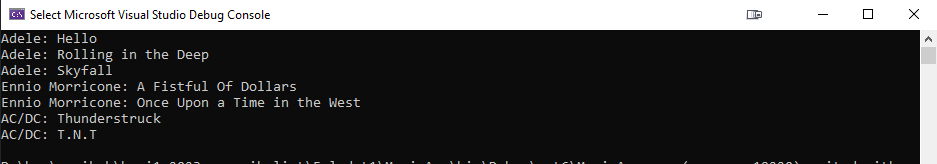
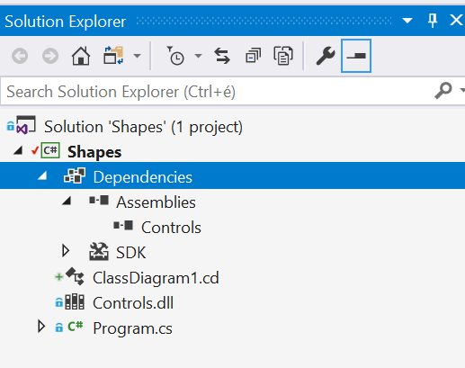
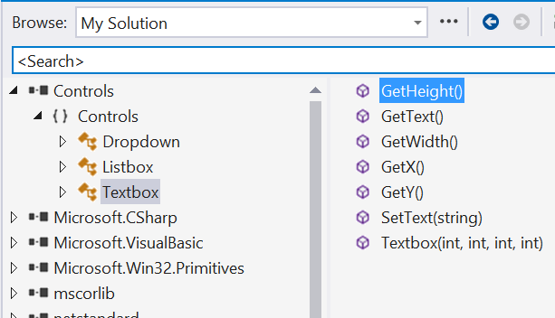

# HA 1 - Beziehung zwischen dem Modell und dem Code

## Einführung

Zu dieser Hausaufgabe gehört keine Vorlesung. Als theoretischer und praktischer Hintergrund für die Hausufgaben dient die Laborübung „1. Beziehung zwischen dem Modell und dem Code“:

- Diese Laborübung wird/wurde von den Studenten unter Anleitung des Übungsleiters gemeinsam durchgeführt.
- Zur Laborübung gehört eine Anleitung, die den theoretischen Hintergrund detailliert darstellt und die Erstellung der Lösung Schritt für Schritt erläutert: [1. Die Beziehung zwischen Modell und Code](../../labor/1-model-es-kod-kapcsolata/index_ger.md)

Darauf aufbauend können die Aufgaben dieser Hausaufgabe mit der Hilfe der kürzeren Leitfäden nach der Aufgabenbeschreibung bearbeitet werden.

Das Ziel der Hausaufgabe:

- Erstellung einer einfachen .NET-Anwendung, Übung der C#-Grundlagen
- Veranschaulichung der Beziehung zwischen UML und Code
- Die Anwendungstechnik von Schnittstellen und abstrakten Basisklassen üben

Die erforderliche Entwicklungsumgebung wird [hier](../fejlesztokornyezet/index_ger.md) beschrieben.

!!! warning "Verwendung von Sprachelementen aus C# 12 (und neuer)"
    Bei der Lösung der Hausaufgabe dürfen Sprachelementen von C# 12 und neuer (z. B. primary constructor) NICHT verwendet werden, da das auf GitHub laufende Prüfsystem diese noch nicht unterstützt.

## Herunterladen des Ausgangsrahmen, Hochladen der fertigen Lösung

Die Veröffentlichung der Ausgangsumgebung der Hausaufgabe sowie die Abgabe der Lösung erfolgen mithilfe von Git, GitHub und GitHub Classroom. Die wichtigsten Schritte:

1. Erstelle mit GitHub Classroom ein eigenes Repository. Die Einladungs-URL findest du in Moodle (bei Hausaufgabe 1.).
2. Klone das so erstellte Repository. Dieses enthält die erwartete Struktur der Lösung.
3. Nach der Fertigstellung der Aufgaben committe und pushe deine Lösung.

Dazu findest du hier eine ausführlichere Beschreibung:

- [Git, GitHub, GitHub Classroom](../git-github-github-classroom/index.md)
- [Hausaufgaben-Workflow und die Verwendung von Git/GitHub](../hf-folyamat/index.md)

## Vorabprüfung und offizielle Bewertung der Hausaufgabe

Jedes Mal, nachdem du Code auf GitHub gepusht hast, wird die (Vorab-)Prüfung des hochgeladenen Codes automatisch auf GitHub ausgeführt, und das Ergebnis kann eingesehen werden! Weitere Informationen dazu findest du hier (unbedingt lesen): [Vorabprüfung und offizielle Bewertung der Hausaufgabe](../eloellenorzes-ertekeles/index.md).

## Aufgabe 1 – Erstellung einer einfachen .NET-Konsolenanwendung

### Ausgangsprojekt

Die Ausgangsumgebung befindet sich im Ordner `Task1`. Öffne die darin enthaltene Datei `MusicApp.sln` in Visual Studio und arbeite in dieser Solution.

!!! warning "Achtung!"
    Das Erstellen einer neuen Solution und/oder Projektdatei sowie das Targeting des Projekts auf andere/neuere .NET-Versionen ist verboten.

Im Ordner `Task1\Input` befindet sich eine Datei `music.txt`, die als Eingabe für die Aufgabe verwendet werden soll.

### Aufgabe

In einer Textdatei werden die Titel von Songs von Komponisten/Darstellern/Bands im folgenden Format gespeichert.

- Zu jedem Autor gehört eine eigene Zeile.
- In jeder Zeile steht zuerst der Name des Autors und `;`, danach – durch `;` getrennt – die Songtitel.
- Der Inhalt der Datei ist als gültig zu betrachten, auch wenn sie leere oder nur Whitespace-Zeilen (Leerzeichen, Tabulatoren) enthält.

Der Inhalt der beigefügten Datei music.txt ähnelt folgendem:

```csv
Adele; Hello; Rolling in the Deep; Skyfall
Ennio Morricone;	A Fistful Of Dollars; Man with a Harmonica
AC/DC; Thunderstruck; T.N.T
```

Lies die Datei in eine Liste von Objekten der Klasse `Song` ein. Ein `Song`-Objekt speichert die Daten eines Liedes (Autor und Titel). Nach dem Einlesen sollen die Daten der Objekte formatiert auf die Standardausgabe geschrieben werden, in der folgenden Form:

```text
autor1: Autor1_Songtitel1
autor1: Autor1_Songtitel2
...
autor2: Autor2_Songtitel1
...
usw.
```

Im Fall unserer Beispieldatei möchten wir die folgende Ausgabe sehen (abhängig vom Inhalt der Datei können Abweichungen auftreten):



### Schritte der Verwirklichung

Füge dem Projekt eine Klasse mit dem Namen `Song` hinzu (Rechtsklick im Solution Explorer auf das Projekt, im Menü *Add / Class*).

Füge die notwendigen Membervariablen sowie einen dazu passenden Konstruktor hinzu:

```csharp
public class Song
{
    public readonly string Artist;
    public readonly string Title;

    public Song(string artist, string title)
    {
        Artist = artist;
        Title = title;
    }
}
```

!!! note "Property"  
    Die Membervariablen wurden als `readonly` deklariert, da wir nicht wollten, dass sie nach der Ausführung des Konstruktors verändert werden können. Eine Alternative wäre die Verwendung von nur lesbaren Eigenschaften (property) anstelle der readonly-Membervariablen (dies wird später behandelt).  

Im Folgenden überschreiben wir in unserer `Song`-Klasse die implizit von `System.Object` geerbte `ToString`-Methode, damit sie die Objektdaten im vorgeschriebenen Format zurückgibt. In der Lösung verwenden wir Stringinterpolation (dies haben wir bereits im ersten Labor angewendet):

```csharp
public override string ToString()
{
    return $"{Artist}: {Title}";
}
```

Für die Verarbeitung von Textdateien können wir am bequemsten die [`StreamReader`](https://learn.microsoft.com/en-us/dotnet/api/system.io.streamreader)-Klasse aus dem `System.IO`-Namespace verwenden.  

In unserer `Main`-Funktion lesen wir die Datei zeilenweise ein, erstellen die `Song`-Objekte und fügen sie in eine dynamisch wachsende `List<Song>` ein. Achten wir darauf, dass vor und nach den mit `;` getrennten Elementen in der Datei Whitespace-Zeichen (Leerzeichen, Tabulatoren) stehen können, die wir entfernen sollten!  

Der folgende Code zeigt eine mögliche Lösung, die Details werden in den Codekommentaren erläutert. Im Verlauf des Semesters ist dies die erste eigenständige Aufgabe, und für die meisten Studenten die erste .NET/C#-Anwendung, daher geben wir hier noch eine Musterlösung, aber die erfahreneren Studierenden steht es jedoch frei, selbstständig zu experimentieren.  

??? example "Lösung"

    ```csharp
    namespace MusicApp;

    public class Program
    {
        
        public static void Main(string[] args)
        {
            // Wir speichern die Song Objekte in dieser Liste
            List<Song> songs = new List<Song>();

            // Datei zeilenweise einlesen, Aufladen der Liste (List<Song>)
            StreamReader sr = null;
            try
            {
                // Bedeutung von @ vor einer String-Konstant:
                // es schaltet das String Escaping aus,
                // also wir können einfach '\' statt '\\' schreiben
                sr = new StreamReader(@"C:\temp\music.txt");
                string line;
                while ((line = sr.ReadLine()) != null)
                {
                    //Wenn die Zeile leer war
                    if (string.IsNullOrWhiteSpace(line))
                        continue;

                    // Die Variable line enthält die ganze Zeile,
                    // wir können sie einfach mit Split entlang ; aufteilen
                    string[] lineItems = line.Split(';');

                    // Erstes Element, in dem wir den Namen des Autors erwarten
                    // Trim entfernt die Leerzeichen (Space, Tab) vor und nach dem String
                    string artist = lineItems[0].Trim();

                    // Wir gehen durch die Lieder und speichern wir sie in die Liste
                    for (int i = 1; i < lineItems.Length; i++)
                    {
                        Song song = new Song(artist, lineItems[i].Trim());
                        songs.Add(song);
                    }
                }
            }
            catch (Exception e)
            {
                Console.WriteLine("A fájl feldolgozása sikertelen.");
                // Die e.Message enhält nur den Text der Ausnahme.
                // Falls wir jede Information, die zu dieser Ausnahme gehört,
                // ausschreiben möchten, dann benutzen wir e.ToString()
                Console.WriteLine(e.Message);
            }
            finally
            {
                // Es ist wichtig, dass die Datai in dem finally Block geschlossen wird 
                // um sicherzustellen, dass wir im Falle einer Ausnahme keine 
                // offene Datei haben.
                // Wir könnten ein using-Block statt try-finally verwenden
                // (wir werden das später lernen, ihr sollt es noch nicht wissen).
                if (sr != null)
                    sr.Close();
            }

            // Ausschreiben der Elementen der Liste songs auf die Konsole
            foreach (Song song in songs)
                Console.WriteLine(song.ToString());
        }
    }
    ```

    Kopiere die Datei `music.txt` in den Ordner `c:\temp` und führe die Anwendung aus. Zur Vereinfachung haben wir alles in die `Main`-Funktion gepackt; in einer „echten“ Umgebung ist es auf jeden Fall ratsam, den Code in eine separate Verarbeitungs-Klasse auszulagern.  

    Im obigen Beispiel werden viele grundlegende .NET/C#-Techniken gezeigt. Es ist auf jeden Fall empfehlenswert, diese anhand der im Code eingefügten Kommentare zu verstehen und zu lernen, da wir im Verlauf des Semesters darauf aufbauen werden.


## Aufgabe 2 - Die Beziehung zwischen UML und Code, Anwendungstechnik der Schnittstelle und der abstrakten Basisklasse

### Ausgangsumgebung

Die Ausgangsumgebung befindet sich im Ordner `Task2`. Öffne die darin enthaltene Datei `Shapes.sln` in Visual Studio und arbeite innerhalb dieser Solution.

!!! warning "Achtung!"
    Das Erstellen einer neuen Solution oder Projektdatei, oder das Targeten des Projekts auf andere/neue .NET-Versionen ist verboten.

Im Ordner `Task2\Shapes` befindet sich eine Datei `Controls.dll`, die während der Lösung dieser Aufgabe verwendet werden muss.

### Es soll eingaben (neben dem Quellcode)

Schreibe eine kurze textuelle Zusammenfassung (zwei bis drei Absätze) über die Entwurfsentscheidungen, die während der Lösung von Aufgabe 2 getroffen wurden, sowie über die wichtigsten Prinzipien der Lösung und deren Begründung. Dies soll in die bereits im `Task2`-Ordner vorhandene Datei `readme.md` geschrieben werden, wahlweise in beliebigem Markdown-Format oder als einfacher Text. Arbeite unbedingt in der Datei im `Task2`-Ordner (auch wenn eventuell eine gleichnamige Datei im Stammverzeichnis existiert).

### Aufgabe

Wir sollen die erste Version einer CAD-Anwendung entwickeln, die zweidimensionale vektorgrafische Formen verarbeiten kann. Details:

- Es sollen verschiedene Typen von Formen unterstützt werden. Anfangs sollen die Typen `Square` (Quadrat), `Circle` (Kreis) und `TextArea` unterstützt werden, der Code soll aber leicht um neue Typen erweiterbar sein. Die `TextArea` ist ein editierbares Textfeld.

    !!! warning "Benennung"
        Die Klassen müssen unbedingt wie oben angegeben benannt werden!

- Daten, die zu den Formen gehören: x- und y-Koordinaten sowie weitere Informationen, die für die Darstellung und die Berechnung der Flächeninhalt der Formen notwendig sind. Z. B. Seitenlänge für ein Quadrat, Breite und Höhe für `TextArea`, Radius für den Kreis.

- Jede Form muss Operationen bereitstellen, um ihren Typ, ihre Koordinaten und ihre Fläche abzufragen. Die Typabfrage soll als `string` zurückgegeben werden und die eingebaute `GetType`-Methode der `Type`-Klasse darf nicht verwendet werden.

- Die in Speicher gehaltenen Formen sollen auf der Standardausgabe (Konsole) gelistet werden. Folgende Daten sollen dabei ausgegeben werden: Formtyp (z. B. `Square`), die beiden Koordinaten, die Fläche der Form. Die eingebaute `GetType`-Methode darf für die Typanzeige nicht verwendet werden.

- Die `TextArea`-Klasse muss zwingend von der `Textbox`-Klasse der `Controls.dll` vererben. Die `Controls.dll` ist eine .NET-Assembly mit vorcompilierten Klassen.

    !!! failure "Standardimplementierung in Interface"
        Ab C# 8 Standardimplementierungen in Schnittstellen unterstützt sind. Es kann oft sehr nützlich sein, aber darf diese Technik in der Lösung nicht angewendet werden. Verwende hier einen "klassischeren" Ansatz.

- Bei der Implementierung soll Verkapselung gewahrt werden: z. B. soll das Verwalten der Formen von einer **dedizierten Klasse** übernommen werden.

    !!! failure
        Es ist nicht akzeptabel, wenn die Formen in der `Main`-Funktion direkt in einer einfachen Liste gespeichert werden. Zudem darf die verwaltende Klasse NICHT von `List` oder ähnlichen Klassen vererben, sondern sie soll diese enthalten. Das Auflisten der Daten auf der Standardausgabe soll ebenfalls von dieser Klasse übernommen werden.

- Die Implementierung soll leicht erweiterbar und wartbar sein, Code-Duplikationen (bei Mitgliedsvariablen, Methoden, Konstruktoren) sollen vermieden werden. Dies sind zentrale Kriterien für die Akzeptanz der Lösung.

- In der `Main`-Funktion soll ein Beispiel für die Nutzung der Klassen gezeigt werden.

- Spätestens am Ende der Implementierung soll in der Visual Studio Solution ein Klassendiagramm erstellt werden, in dem die Klassen der Solution übersichtlich angeordnet sind. Assoziationsbeziehungen sollen in der Form einer Assoziation dargestellt werden, nicht als Membervariablen (*Show as Association* bzw. *Show as Collection Association*, siehe [die Anleitung der Laborübung 1.](../../labor/1-model-es-kod-kapcsolata/index_ger.md)).

    !!! tip "Class Diagram-Komponente"
        Visual Studio 2026 installiert die *Class Designer*-Komponente nicht immer standardmäßig. Falls das Klassendiagramm nicht hinzugefügt werden kann (weil *Class Diagram* nicht in der Liste unter *Add / New Item* angezeigt wird), muss die Komponente nachträglich installiert werden. Weitere Informationen findest du auf der Seite [Entwicklungsumbgebung](../fejlesztokornyezet/index_ger.md).

Bei der Verwirklichung wird eine erhebliche Vereinfachung verwendet:

- Das Zeichnen der Formen wird nicht implementiert (die notwendigen Kenntnisse werden während des Semesters später behandelt).
- Die Formen müssen nur im Speicher gehalten werden. 

### Verwendung von Klassenbibliotheken

Die Lösung kann nach dem Beispiel der Übung [1. Beziehung zwischen dem Modell und dem Code](../../labor/1-model-es-kod-kapcsolata/index_ger.md) erarbeitet werden. Diese Aufgabe unterscheidet sich in einem wichtigen Punkt: Während dort nur mündlich festgelegt wurde, dass der Quellcode der Oberklasse `DisplayBase` nicht verändert werden darf, ist in diesem Fall die Oberklasse `Textbox` vorgegeben, da sie nur in Form einer kompilierten DLL verfügbar ist.

!!! note 
    Über die Entwicklung von Mehrkomponenten-Anwendungen sowie über Assembly- und Projektreferenzen wurde in der ersten Vorlesung gesprochen. Wenn du dich daran nicht erinnerst, ist es sinnvoll, dieses Thema noch einmal zu wiederholen.

Im Folgenden sehen wir uns an, welche Schritte erforderlich sind, um Klassen aus einer solchen DLL in unserem Code zu verwenden:

1. Klicke im Visual Studio Solution Explorer mit der rechten Maustaste auf *Dependencies* und wähle *Add Reference* oder *Add Project Reference* (je nachdem, was verfügbar ist).
2. Wähle im erscheinenden Fenster auf der linken Seite *Browse*:
   1. Wenn `Controls.dll` in der Liste in der Mitte erscheint, setze ein Häkchen.
   2. Falls nicht, klicke unten rechts im Fenster auf *Browse...*:
        1. Navigiere im sich öffnenden Dateibrowser zur `Controls.dll` und doppelklicke darauf, um das Fenster zu schließen.
        2. Im mittleren Bereich des *Reference Manager*-Fensters sollte `Controls.dll` nun markiert sein. Bestätige mit OK.
3. Schließe das Fenster mit OK.

??? "Falls die Fehlermeldung 'Reference is invalid or unsupported' erscheint"
    Sehr selten kann es vorkommen, dass Visual Studio während dieser Schritte die Meldung "Reference is invalid or unsupported" anzeigt. Meist hilft in solchen Fällen eine Neuinstallation von Visual Studio.

Damit haben wir eine Referenz auf `Controls.dll` im Projekt hinzugefügt, so die darin enthaltenen Klassen verwendet werden können (z. B. instanziiert oder davon vererbt). Im Solution Explorer wird unter *Dependencies*, dann *Assemblies* die Referenz *Controls* angezeigt:



Die `Textbox`-Klasse, von der unsere `TextArea`-Klasse vererbt werden muss, befindet sich im Namespace `Controls`. Die `TextBox`-Klasse hat einen Konstruktor mit vier Parametern: die x- und y-Koordinaten sowie Breite und Höhe.  
Falls weitere Informationen benötigt werden, kann der *Object Browser* helfen. Dieser wird über das Menü *View* → *Object Browser* geöffnet und erscheint in einem neuen Tab.

!!! note "Falls die Object Browser-Ansicht leer ist"
    Visual Studio 2026 zeigt im Object Browser nichts an (nur ein Text beginnend mit „No information“ ist sehbar), solange keine Quelldatei geöffnet ist. Öffne in diesem Fall die Datei `Program.cs` im Solution Explorer und wechsel dann zurück zum Object Browser-Tab, um die Komponenten anzuzeigen.

Im Object Browser können durch Öffnen des `Controls`-Komponente und Auswahl einzelner Knoten (Namespace, Klasse) die Eigenschaften der jeweiligen Elemente eingesehen werden: z. B. werden beim Überfahren des Klassennamens die Klassenmitglieder angezeigt.



Nun stehen alle Informationen für die Lösung der Aufgabe zur Verfügung.

## Abgabe

Checkliste zur Wiederholung:

--8<-- "docs/hazi/beadas-ellenorzes/index.md:3"

- Vergiss bei Aufgabe 2 nicht, deine Lösung im `readme.md` dokumentieren.
