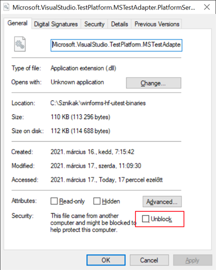

# 3. HF - Felhasználói felület kialakítása

## Bevezetés

Az önálló feladat a 3-5. előadásokon elhangzottakra épít. A feladatok gyakorlati hátteréül a [3. labor – Felhasználói felületek kialakítása](../../labor/3-felhasznaloi-felulet/index.md) laborgyakorlat szolgál.

A fentiekre építve, jelen önálló gyakorlat feladatai a feladatleírást követő rövidebb iránymutatás segítségével elvégezhetők.

Az önálló gyakorlat célja:

- Windows Forms tervező használatának gyakorlása
- Alapvető vezérlők (gomb, szövegdoboz, menük, listák) használatának gyakorlása
- Eseményvezérelt programozás gyakorlása
- Grafikus megjelenítés gyakorlása Windows Forms technológiával

A szükséges fejlesztőkörnyezetről [itt](../fejlesztokornyezet/index.md) található leírás.

## A beadás menete

:exclamation: Bár az alapok hasonlók, vannak lényeges, a folyamatra és követelményekre vonatkozó eltérések a korábbi házi feladatokhoz képest, így mindenképpen figyelmesen olvasd el a következőket.

- Az alapfolyamat megegyezik a korábbiakkal. GitHub Classroom segítségével hozz létre magadnak egy repository-t. A meghívó URL-t Moodle-ben találod (a tárgy nyitóoldalán a "*GitHub classroom hivatkozások a házi feladatokhoz*" hivatkozásra kattintva megjelenő oldalon látható). Fontos, hogy a megfelelő, ezen házi feladathoz tartozó meghívó URL-t használd (minden házi feladathoz más URL tartozik). Klónozd le az így elkészült repository-t. Ez tartalmazni fogja a megoldás elvárt szerkezetét. A feladatok elkészítése után commit-old és push-old a megoldásod.
- A kiklónozott fájlok között a `WinFormExpl.sln`-t megnyitva kell dolgozni.
- :exclamation: Az egyes feladatok leírásánál ==Külön megjelöltük== (olyan stílusban, mint ahogy itt az előző szövegrészt látod) azokat az azonosítókat, szövegeket, melyeknél fontos, hogy a beadott feladatban a megadott érték szerepeljen.
- :exclamation: A feladatok kérik, hogy készíts **képernyőképet** a megoldás egy-egy részéről, mert ezzel bizonyítod, hogy a megoldásod saját magad készítetted. **A képernyőképek elvárt tartalmát a feladat minden esetben pontosan megnevezi.**
A képernyőképeket a megoldás részeként kell beadni, a repository-d gyökérmappájába tedd (a neptun.txt mellé). A képernyőképek így felkerülnek GitHub-ra a git repository tartalmával együtt. Mivel a repository privát, azt az oktatókon kívül más nem látja. Amennyiben olyan tartalom kerül a képernyőképre, amit nem szeretnél feltölteni, kitakarhatod a képről.
- :exclamation: A beadott megoldások mellé külön indoklást, illetve leírást nem várunk el, ugyanakkor az elfogadás feltétele, hogy a beadott kódban a feladat megoldása szempontjából relevánsabb részek kommentekkel legyenek ellátva.
- Ha valakinél az előellenőrző csak az opcionális feladatok esetében jelez hibát, az nem jelent problémát az alapfeladatok vonatkozásában.

## Ellenőrző futtatása

Jelen házi feladathoz kapcsolódó tesztek futtatása időigényes. Sajnos a GitHub limitek nem teszik lehetővé, hogy a szokásos módon automatizáltan nagyon nagy számban, GitHub alapokon futtassuk. A tesztek futtatására elsődlegesen mindenkinek a saját számítógépén van mód a következőknek megfelelően.

### Telepítendő eszközök

1. Töltsd le innen és telepítsd a WinAppDriver alkalmazást: https://github.com/microsoft/WinAppDriver/releases/download/v1.2.1/WindowsApplicationDriver_1.2.1.msi
2. A WinAppDriver csak akkor tud futni, ha a gépeden engedélyezed a Developer mode (magyarul Fejlesztői mód)-ot. Angol Windows-on a Start keresőben be kell gépelni a „developer settings” szöveget és így talál oda, talán magyar Windows alatt is megtalálja ugyanígy (ha nem, akkor: Gépház -> Frissítés és Biztonság -> Fejlesztőknek -> Fejlesztői mód).
   
A beállítástól nem kell tartani, a legtöbb fejlesztői gépen ezt egyébként is be kell/szokás kapcsolni a gyakorlatban.
1. Hozzd létre a c:\Sznikak mappát (ékezet nélküli!).
2. Le kell tölteni a https://github.com/bmeviauab00/winforms-hf-uitest-binaries repó tartalmát a fenti mappába. Két lehetőség pl.:
    - Lehetőség 1. Ez a legegyszerűbb, ha telepítve van a gépedre a parancssori git (ha nem tudod, csak próbáld ki az alábbiakat, legfeljebb nem működik). Parancssorból navigálj be a c:\Sznikák mappába, és add ki a következő parancsot:
    git clone --depth 1 https://github.com/bmeviauab00/winforms-hf-uitest-binaries
    Ekkor létrejön a c:\Sznikak\winforms-hf-uitest-binaries\ mappa és ebbe letöltődnek a teszt specifikus fájlok GitHub-ról.
    - Lehetőség 2. A c:\Sznikak mappában hozz létre egy winforms-hf-uitest-binaries nevű almappát.
    A GitHub felületén fenti link megnyitása, majd a zöld „Code” gomb lenyit és alul „Download zip” kiválaszt. A zip-et csomagold ki valahova és tartalmát másold a 
    c:\Sznikak\winforms-hf-uitest-binaries
    mappába úgy, hogy ebben a mappában közvetlenül legyen a „TestFiles” almappa, az appium-dotnet-driver.dll és a több dll fájl is.
    A Windows alapesetben blokkolja az ebben a mappában található dll-eket, ezt fel kell oldani erre a két fájlra: WinFormExpl-Test.dll és Microsoft.VisualStudio.TestPlatform.MSTest.TestAdapter.dll. Ehhez nyisd meg a két fájlra egyesével a fájl tulajdonságait (pl. Windows Fájl Intézőben), és az oldal alján pipáld be az Unblock (magyar Windows-on ennek értelemszerű fordítása) jelölőnégyzetet majd OK:
    
        

### Futtatás (amikor tesztelni szeretnéd a megoldásod)

1. Indítsd el a WinAppDrivert, alapértelmezett telepítés esetén itt található: c:\Program Files (x86)\Windows Application Driver\WinAppDriver.exe. Ez egy parancssor ablakban indul, és futnia is kell végig, ne zárd be amíg tesztelsz:
   
2. Győződj meg, hogy a solution-öd a legfrissebb formában le van fordítva (pl. VS alatt build) és minden forrásfájlod el van mentve (ctrl+shift+S).
3. Győződj meg, hogy nem fut az alkalmazásod egyetlen példányban sem.
4. Indítsd egy új parancssort (erre ne a fenti WinAppDriveres parancssori ablakot használd, hanem egy másikat indíts), navigálj a megoldásod gyökérmappájába, és az itt található `RunBaseTest.bat`-tal tudod futtatni az alap (nem IMSc) teszteket, a `RunIMScTest.bat`-tal pedig az IMSc teszteket.

A tesztek elindítják az alkalmazást, látni fogod a felületét, a gépelést és a kattintásokat. Amíg fut a teszt, **ne mozgasd az egeret, ne használd a billentyűzetet**, ezek megzavarják a tesztet és sikertelen lesz! Ha meg akarod szakítani a tesztet, akkor zárd be az alkalmazást és a parancssorban nyomj egy Ctrl+C-t.

**Ha változtatsz a forráskódodon, és szeretnéd a módosítások alapján tesztelni**, akkor csak annyi a teendő, hogy újra futtatod a fenti bat fájl valamelyikét a fent előkészített parancssorból (feltéve, hogy a WinAppDriver is fut a háttérben). Tipp: ha csak egy adott feladathoz kapcsolódó teszteket szeretnéd futtatni, akkor ideiglenesen módosíthatod a RunBaseTest.bat tartalmát, hogy csak az adott feladathoz tartozó „dotnet test” kezdetű sor legyen benne, a másik három „dotnet test” sor kitörlésével.

!!! note "Alternatív lehetőség a tesztek futtatására"
    A szokásos GitHub alapú teszt futtatása is elő van készítve. Ha valakinek a fenti lépéseket követve nem sikerül a tesztelés, akkor használhatja az online, GitHub alapú ellenőrzést. Magától ez nem fog futni a push során, manuálisan kell indítani a push-t követően:

    1. GitHubon meg kell nyitni a házi feladatodhoz tartozó repository oldalt.
    2. Az Actions oldalra navigálni (kattintás az "Actions" hivatkozáson).
    3. Baloldalt a Build&Check-OnGitHub kiválasztása.
    4. Jobb oldalon a "Run workflow" gombra kattintva a lenyílt panelon a "Run workflow" zöld gombon kattintás.
    5. Ekkor elindul az ellenőrző, a gomb alatti listában megjelenik a futó példány. Ha ez nem jelenik meg azonnal, akkor várni kell, néha kell pár másodperc, fél-egy perc is, mire elindul. Ha nagyon nem akarna megjeleni, akkor érdemes az oldal frissítésével is próbálkozni.

## Elnevezések

:exclamation: Az alábbiakban, a feladatok leírása során bizonyos elnevezések ==ennek a mintának== megfelelő kiemelt szövegstílussal szerepelnek. Lényeges, hogy ezeknél pontosan kövesd az elnevezést, máskülönben a megoldás nem lesz elfogadható (pl. az ellenőrző máskülönben nem találja meg az adott felületelemet, vagy egyéb ellenőrzési probléma származhat belőle).

## Visual Studio designer hiba

Az alábbiakat csak akkor érdemes kinyitni és megnézni, ha valamiért nem nyílik meg Visual Studioban az űrlap szerkesztőfelülete.

??? "Ha nem nyílik meg az űrlap szerkesztésre"
    A Visual Studio 2022 a Git-ből frissen kiklónozott forrás esetén (amikor még nem létezik egy .csproj.user kiterjesztésű fájl) az űrlapokat  - valószínűsíthetően egy bug miatt – időnként nem hajlandó megnyitni szerkesztő módban (szerencsére ez nagyon ritka). A solution megnyitása után ez esetben ezt látjuk:

    

    A probléma az, hogy a `Form1.cs` előtti ikon (pirossal bekeretezve) nem egy űrlap, hanem egy zöld C# ikon. Ez esetben hiába kattintunk duplán a fájlon, nem az űrlap szerkesztő nyílik meg, hanem csak a forrásfájl. A megoldás ez esetben a következő: a Build menüben válasszuk ki a „Rebuild solution” menüt, majd a Build menüben a „Clean solution” menüt, és várjunk egy kicsit. Ekkor pár másodperc múlva a Solution Explorerben az űrlapunk ikonja megváltozik:
    
    

    Most már meg tudjuk nyitni az űrlapot szerkesztésre, ha duplán kattintunk a Solution Explorerben a fenti csomóponton.

## Feladat 1- Menü

### Bevezető feladat

:exclamation: A főablak fejléce a "==MiniExplorer==" szöveg legyen, hozzáfűzve a saját Neptun kódod: (pl. "ABCDEF" Neptun kód esetén "MiniExplorer - ABCDEF”), fontos, hogy ez legyen a szöveg! Ehhez az űrlapunk `Text` tulajdonságát állítsuk be erre a szövegre.

### Feladat

Vezessünk be egy menüsort a főablakunk (`MainForm`) tetején. A menüben egyetlen elem legyen "File” néven, két almenüvel:

- ==Open==: később adunk neki funkciót
- ==Exit==: kilép az alkalmazásból

:exclamation: Lényeges, hogy a menük szövegei a fent megadottak legyenek!

### Megoldás

1. Húzzunk be a felületre egy `MenuStrip` vezérlőt.
2. A `MenuStrip` vezérlő bal szélén megjelenő szövegdobozba írjuk be, hogy "File”, ezzel létrehoztuk a főmenüt.
3. Az újonnan létrehozott főmenüt kijelölve hozzuk létre a két almenüt.
4. Egyesével kijelölgetve a menüelemeket, töltsük ki a nevüket (`miOpen`, `miExit`).

    :exclamation: A vezérlőknek csak a `Name` tulajdonságát állítsd, az `AccessibleName`-t ne. Ez a későbbi feladatokra is vonatkozik.

5. Valósítsuk meg a kilépés funkciót a kapcsolódó gyakorlathoz hasonlóan.

## Feladat 2 – Dialógusablak

A Windows Forms világban gyakran fordul elő, hogy egyedi vezérlőket, vagy űrlap típusokat akarunk definiálni, továbbá ezek és a programunk többi része között információt akarunk átadni. A következő feladat erre mutat példát.

### Feladat

Készíts egy új űrlap/ablak (`Form`) típust ==InputDialog== néven (a fejléce is legyen ==InputDialog==), mely egy szövegdobozt (`TextBox`), továbbá egy ==Ok== és egy ==Cancel== feliratú gombot tartalmaz. Az űrlap gombokkal történő bezáráshoz állítsd be a `Form` `DialogResult` tulajdonságát `DialogResult.OK`, illetve `DialogResult.Cancel` értékre a gombkattintás eseménykezelőkben. Az űrlap ezen felül tartalmazzon egy publikus, `string` típusú, `Path` nevű tulajdonságot!

Az űrlap tartalma arányosan változzon az átméretezés során:

- `TextBox` szélessége növekedjen (a helye és magassága ne változzon).
- Az űrlap átméretezésekor a gombok a hozzájuk közelebbi sarokhoz képest rögzített pozícióban maradjanak (mind x mind y koordináta tekintetében, az ablak szélességének és magasságának állításakor is). Az *Ok* gomb legyen bal alsó, a *Cancel* pedig jobb alsó sarokhoz rögzítve.

### Megoldás

A feladatot próbáld meg önállóan megoldani, majd a lenti leírás alapján ellenőrizd a megoldásod!

??? success "Megoldás"

    1. Adjunk hozzá a projektünkhöz egy új űrlap típust (projekten jobb klikk, majd *Add / Form (Windows Forms)*, a neve legyen InputDialog.

    2. Adjunk az űrlaphoz egy `TextBox`, egy `Label` és két `Button` vezérlőt. Rendezzük el őket a felületen és állítsuk be a tulajdonságaikat:
        - `TextBox`
            - `Name`: `tPath`
        - `Button`
            - `Name`: `bOk`
            - `Text`: "Ok"
            - `DialogResult`: `OK`
        - `Button`
            - `Name`: `bCancel`
            - `Text`: "Cancel"
            - `DialogResult`: `Cancel`
        - `Label`
            - `Text`: "Path"
        - `InputDialog` (maga a `Form`)
            - `AcceptButton`: `bOk`
            - `CancelButton`: `bCancel`

        A dialógusablak elkészítésekor kihasználjuk azt, hogy egy modális dialógusablakot nem csak a `Close` utasítással lehet bezárni, hanem úgy is, ha értéket adunk a `DialogResult` tulajdonságának. Ezt kódból is megtehettük volna, de mi most a gombok erre szolgáló mechanizmusát használtuk a `Form` `Accept` és `Cancel` button tulajdonságaival.

    3. Az egyes vezérlők `Anchor` tulajdonságainak beállításaival érjük el, hogy az ablak tartalma arányosan változzon az átméretezés során: a `TextBox` szélessége növekedjen, a gombok pedig a hozzájuk közelebbi sarokhoz képest rögzített pozícióban maradjanak (mind x mind y koordináta tekintetében, az ablak szélességének és magasságának állításakor is).

    4. Vegyünk fel egy `Path` nevű tulajdonságot az `InputDialog.cs` fájlba, mely a `TextBox` tartalmát teszi elérhetővé az osztályon kívülről is. (A tervezői nézet és a forrásnézet között az ++f7++ billentyűvel válthatunk.)

        ```csharp
        public string Path
        {
            get { return tPath.Text; }
            set { tPath.Text = value; }
        }
        ```

    5. Kössük be a dialógusablakot a főablakba! Ehhez kattintsunk duplán a *Open* menüelemre és írjuk meg a dialógusablak létrehozásának és megjelenítésének kódját.

        ```csharp
        private void miOpen_Click(object sender, EventArgs e)
        {
            var dlg = new InputDialog();
            if (dlg.ShowDialog() == DialogResult.OK)
            {
                string result = dlg.Path;
                MessageBox.Show(result);
                // TODO: további lépések...
            }
        }
        ```
    
        !!! tip "Elnevezések"
            A WinForms világban rendkívül gyakori, hogy egy adott információ különböző szintű elérésért egy vezérlő és egy tulajdonság is felel (mint esetünkben a `tPath` szövegdoboz és a `Path` tulajdonság). A vezérlők neveinek prefixálásával (amit itt is alkalmaztunk) elkerülhetjük a nem kívánt névütközéseket.

        :exclamation: A `MessageBox.Show(result);` sort kommentezzük is ki, a későbbiekben zavaró lenne.

!!! example "BEADANDÓ"
    :exclamation: Mielőbb továbbmennél a következő feladatra, egy képernyőmentést kell készítened `Feladat2.png` néven az alábbiaknak megfelelően:

    - Indítsd el az alkalmazást. Ha szükséges, méretezd át kisebbre, hogy ne foglaljon sok helyet a képernyőn,
    - a „háttérben” a Visual Studio legyen, a `MainForm.cs` megnyitva,
    - a VS *View / Full Screen* menüjével kapcsolj ideiglenesen *Full Screen* nézetre, hogy a zavaró panelek ne vegyenek el semmi helyet,
    - VS-ben zoomolj úgy, hogy a fájl teljes tartalma, az előtérben pedig az alkalmazásod ablaka legyen látható.
    
    Amiatt ne aggódj, ha a képen a szöveg esetleg nehezen kiolvasható.

## Feladat 3 – Fájlkezelő

### Feladat

A meglévő kódunkból kiindulva valósíts meg egy fájl nézegető alkalmazást.

- Az alkalmazás felületét osszuk két részre (erre `SplitContainer`-t használjunk, a neve maradjon az alapértelmezett ==splitContainer1==).

- Miután a felhasználó az *Open* menüponttal bekért egy mappa útvonalat (pl. `c:\windows`) a korábban elkészített `InputDialog` felhasználásával, a bal oldalon egy `ListView` vezérlő segítségével listázzuk ki az adott mappában található fájlok neveit és méreteit két külön oszlopban (==Name== és ==Size== fejlécű oszlopok). A méret oszlop a fájl méretét jelenítse meg byte-ban, csak a számot, mindenféle mértékegység hozzáfűzése nélkül.

- A form jobb oldalát egy fix magasságú – vagyis az ablak átméretezésekor a magassága ne változzon - `Panel` (a neve legyen: ==detailsPanel==) és egy alatta (és nem rajta!) elhelyezkedő többsoros szövegdoboz (neve ==tContent==) töltse ki. A szövegdoboz akkor is töltse ki a teret, ha az ablakot a felhasználó nagyobbra/kisebbre méretezi át!

- A panelen mindig az aktuálisan kiválasztott fájl nevét és létrehozásának dátumát mutassuk egy ==lName== illetve ==lCreated== nevű `Label` típusú vezérlő segítségével.

    Lényeges, hogy a kiválasztás nem dupla egérkattintást jelent (egy elemet ki lehet választani pl. szimpla egér kattintással, billentyűvel stb.). Az `lName` szövege pontosan a fájl neve legyen, mindenféle prefix (pl. "Name:” és hasonlók) nélkül. Ugyanez igaz az `lCreated` vonatkozásában. A "prefixek”-hez külön `Label` vezérlőt használj a name és a created vonatkozásában is.

- A `ListView` `FullRowSelect` tulajdonságát állítsd `true` ra (enélkül a tesztek nem futnak le jól majd).

- Amennyiben a felhasználó a fájllistából egy fájlon duplán kattint, a többsoros szövegdobozban jelenítsük meg a fájl tartalmát szöveges formátumban. Lényeges, hogy csak a dupla kattintás számít ebben tekintetben, tehát ha a felhasználó simán (duplakattintás nélkül) más fájlt választ ki, a szövegdoboz tartalma nem változhat.

### Megoldás

A feladat megoldásához a kapcsolódó gyakorlatban már alkalmazott, illetve az itt korábban megismert elemeket kell alkalmazni és kombinálni. A megoldás lépéseit csak nagy vonalakban adjuk meg, néhány kiegészítő segítséggel:

- Az ablak területének kettéosztására használjuk ismét a `SplitContainer` vezérlőt (a neve maradjon az alapértelmezett `splitContainer1`)
- A `ListView` oszlopainak felvételekor csak a `Text` tulajdonságot változtasd, a `Name`-et ne. Ugyanitt, az oszlopok szélességét is növeld meg.
- Ha a `ListView` nem mutatja a 2 oszlopot, csak a fájlok neveit, a `View` tulajdonságát állítsd át `Details`-re.
- A `ListView` `FullRowSelect` tulajdonságát állítsd `true` ra (enélkül a tesztek nem futnak le jól majd).
- Az aktuálisan kiválasztott elem adatainak megjelenítését a `ListView` `SelectedIndexChanged` eseményével célszerű megoldani.
- A `detailsPanel` `Dock` tulajdonságát megfelelően be kell állítani.
- Ahhoz, hogy a `TextBox` vezérlő kitölthesse a rendelkezésére álló teret, nem elég a `Dock` tulajdonságát `Fill`-re állítani, szükséges a `Multiline` tulajdonság `true`-ra állítása is.

    !!! tip "Tipp"
        Ha az ablak jobb oldalán a `Textbox` teteje bekerül a panel mögé, annak valószínűleg az oka az, hogy a `SplitContainer` kettes paneljéhez a `detailsPanel` és a `tContent` szövegdoboz nem jó sorrendben kerül hozzáadásra (a jó sorrend a `tContent`, utána `detailsPanel`). A vezérlők hozzáadási sorrendje a *Document Outline* ablakban ellenőrizhető, és a sorrend itt változtatható meg drag&droppal.

- Egy fájl tartalmát egyszerűen betölthetjük egy stringbe a `File` statikus osztály` ReadAllText(filename)` függvényével.
- A `FileInfo` osztály `Name` tulajdonsága megadja egy fájl teljes nevét, a `CreationTime` pedig létrehozásának idejét (melyet a `ToString()` művelettel alakítsunk stringé).
- Ne felejtsük el, hogy a felhasználó többször egymás után is választhat mappát az *Open* menüponttal. Az új mappa tartalmának betöltése előtt az aktuális fájl listát mindig üríteni kell.

    !!! tip "Tipp"
        A `ListView` elemeinek eltávolítására ne a `ListView` osztály `Clear` műveletét, hanem a `ListView` osztály `Items` tulajdonságának `Clear` műveletét használd!

Az elkészült alkalmazás képe:


!!! tip "Túl régi dátum"
    Ha a létrehozási dátumnak nagyon régi (1601-es évhez tartozó) dátumot kapsz, akkor lehet, hogy a `FileInfo` objektumot nem a fájl teljes útvonalával, hanem csak a fájl nevével hozod létre, és ez okozza.

!!! example "BEADANDÓ"
    :exclamation: Mielőbb továbbmennél a következő feladatra, egy képernyőmentést kell készítened, ennek módját az alábbi.

    Készíts egy képernyőmentést `Feladat3.png` néven az alábbiak szerint:

    - Indítsd el az alkalmazást. Ha szükséges, méretezd át kisebbre, hogy ne foglaljon sok helyet a képernyőn,
    - a „háttérben” a Visual Studio legyen, a `MainForm.cs` megnyitva,
    - a VS *View / Full Screen* menüjével kapcsolj ideiglenesen *Full Screen* nézetre, hogy a zavaró panelek ne vegyenek el semmi helyet,
    - görgess le a forrásfájlod legaljára, használj kb. normál zoom értéket, most fontos, hogy ami a képernyődön lesz, legyen jól olvasható (az nem baj, ha nem fér ki minden, nem is fog), az előtérben pedig az alkalmazásod ablaka.

## Feladat 4 – Rajzolás

### Feladat

Amennyiben a felhasználó megnyitott egy fájlt, akkor a megnyitott fájl tartalmát adott időközönként frissítsük. A frissítési időköz ==6== másodperc legyen.
A frissítés jelzésére a kijelölt fájl adatait (név és létrehozás dátuma) tartalmazó panel felső felére (0,0 koordinátából kezdve) rajzoljunk ki ==barna== (==Color.Brown==) színnel egy ==5== pixel magas, kezdetben ==125== pixel széles kitöltött téglalapot.
A téglalap hossza a következő frissítésig hátralevő idővel legyen arányos: ennek megfelelően minden tizedmásodpercben arányosan csökkentsük a hosszát.
Így minden frissítési időköz végén a téglalap hossza nulla lesz.
A frissítési időköz végén (amikor a téglalap hossza elérte a 0-t) a korábban kiválasztott fájl tartalmát töltsük be újból, és kezdjük elejéről a folyamatot.
Az időzítésre `Timer` komponenst használjunk!

:exclamation: A feladat csak akkor elfogadható, ha a fenti, kiemelt szövegstílussal jelölt paraméterekkel dolgozol. Arra figyelj, hogy a kirajzolt téglalap ne lógjon bele vezérlőkbe és ne lógjon túl az űrlapon (ha szükséges, mozgasd kicsit lentebb a vezérlőket, illetve vedd kicsit szélesebbre az űrlap alapértelmezett méretét).

### Megoldás

A feladatot próbáld meg önállóan megoldani, majd a lenti leírás alapján ellenőrizd a megoldásod!

??? success "Megoldás"

    A megoldás alapját egy `Timer` komponens fogja adni. Ez egy olyan vezérlő, mely nem rendelkezik vizuális felülettel, csupán néhány testre szabható tulajdonsággal és egy `Tick` eseménnyel, mely az `Interval` tulajdonságban (milliszekundumban) megadott időközönként automatikusan meghívódik. Első lépésként ezt az ütemezést állítjuk be.

    1. Húzzunk egy `Timer` komponenst (*Toolbox / Componensts*) `MainForm`-ra! Figyeljük meg, hogy a komponens csupán a `Form` alatti szürke területen jelenik meg. Itt tudjuk kijelölni a későbbi lépésekhez.

        

    2. Ellenőrizzük, hogy az `Interval` tulajdonsága 100-ra van állítva. Ez 100 milliszekundumonként, vagyis minden tizedmásodpercben kiváltja a `Tick` eseményt.

    3. Állítsuk a `Name` tulajdonságot `reloadTimer`-re!
    
    4. Vezessünk be néhány új tagváltozót a `MainForm` osztályban:
        - `loadedFile` az utoljára betöltött fájl adatait tartalmazza,
        - `counter` az újratöltésig szükséges tizedmásodpercek számát tartalmazza, a későbbiekben minden tizedmásodpercben eggyel csökkentjük az értékét egy időzítő segítségével, míg el nem éri a nullát,
        - `counterInitialValue` a `counter` számláló kezdőértéke (ahonnan visszaszámol).
        
        A tagváltozókat az osztály elejére szoktuk beszúrni:

        ```csharp hl_lines="3-5"
        public partial class MainForm: Form
        {
            private FileInfo loadedFile = null;
            int counter;
            readonly int counterInitialValue;
            
            // ..
        }
        ```

    5. A konstruktorban állítsuk be a `counterInitialValue` értékét (később ez nem is változik). 

        A `counterInitialValue` értékét a fenti kódban neked kell meghatározni: számítsd ki a frissítési időköz és az `timer` `Interval` alapján!

        ```csharp hl_lines="4"
        public MainForm()
        {
            InitializeComponent();
            counterInitialValue = ; // TODO a frissítési időköznek megfelelő érték
        }
        ```

    6. Egészítsük ki a duplakattintást kezelő eseménykezelőnket, hogy ne csak betöltse a fájlt, hanem:
        1. Indítsa el a `Timer`-t a `reloadTimer.Start()` hívással,
        2. állítsa be `counter` értékét `counterInitialValue`-ra,
        3. állítsa be `loadedFile` értékét a mindenkori kiválasztott fájl leírójára.

        !!! tip "Megjegyzés"
            A megoldás minden egyes új fájl megnyitásakor meghívja a `Timer` osztály `Start` függvényét. Ez nem jelent gondot, mivel ilyenkor a már elindított `Timer` egyszerűen fut tovább és figyelmen kívül hagyja a további `Start` hívásokat.

    7. Iratkozzunk fel a `Timer` komponens `Tick` eseményére. Ehhez a `reloadTimer` kijelölése után a *Property Editor*-ban az *Events* fülön kattintsunk duplán a `Tick` eseményre, ezzel létrejön a kapcsolódó eseménykezelő (`reloadTimer_Tick`). Töltsük ki a kódját:

        ```csharp
        private void reloadTimer_Tick(object sender, EventArgs e)
        {
            counter--;
            
            // Fontos! Ez váltja ki a Paint eseményt
            // és ezzel a téglalap újrarajzolását
            detailsPanel.Invalidate();

            if (counter <= 0)
            {
                counter = counterInitialValue;
                tContent.Text = File.ReadAllText(loadedFile.FullName);
            }
        }
        ```

        A fenti megoldás minden egyes `Tick` eseményre csökkenti a `counter` értékét, egészen addig, amíg el nem éri a 0 értéket, ilyenkor ugyanis visszaállítjuk a kezdőértékre, és újra betöltjük a fájlt.

        A megoldás jól szemlélteti a Windows Forms alkalmazásokban a grafikus megjelenítés tipikus mechanizmusát:

        - Tényleges rajzolást az állapotot megváltoztató műveletben nem végzünk, hanem a form/vezérlő (esetünkben panel) `Invalidate` műveletében váltjuk ki a `Paint` eseményt.
        - A konkrét téglalap (aktuális állapotnak megfelelő) megjelenítéséért/kirajzolásáért az űrlap/vezérlő (esetünkben a panel) `Paint` eseménye felelős.

    8. Iratkozzunk fel a `detailsPanel` komponens `Paint` eseményére. Ehhez a panel kijelölése után a *Property Editor*-ban az *Events* fülön kattintsunk duplán a `Paint` eseményre, ezzel létrejön a kapcsolódó eseménykezelő (`detailsPanel_Paint`). Töltsük ki a kódját:

        ```csharp
        private void detailsPanel_Paint(object sender, PaintEventArgs e)
        {
            if (loadedFile!=null)
            {
                // A téglalap szélessége a téglalap kezdőhosszúságából (adott a feladatkiírásban) számítható,
                // szorozva a számláló aktuális és max értékének arányával
                e.Graphics.FillRectangle(/*TODO paraméterek*/); 
            }
        }
        ```

        A `FillRectangle` pontos paraméterezést a fenti példakód megjegyzésben szereplő segítség alapján tudod meghatározni.

        !!! warning "Lebegőpontos számítások"
            Tipikus probléma szokott lenni, ha egész értékű osztást végzel a szélesség számításakor (ekkor az eredmény jó eséllyel nulla lesz): az osztót vagy osztandót castold előbb lebegőpontos számra és így dolgozz.

    9. Teszteljük a megoldásunkat (az alábbi ábrán a színes téglalap lehet eltér a feladatban elvártaktól):

        

## Opcionális plusz feladat – 3 iMsc pontért

Egészítsük ki az alkalmazásunkat úgy, hogy a fájlok közt "Total Commander"-szerűen tudjunk mozogni, vagyis:

- A listában jelenjenek meg a mappák nevei is. Ezekre duplán kattintva a teljes fájl lista cserélődjön le az aktuális mappa tartalmára. A mappanevek eredeti formájukban jelenjenek meg (pl. ne legyenek körbevéve szögletes vagy egyéb zárójelekkel).
- A lista elejére kerüljön be egy speciális ".." nevű elem, mely mindig az aktuális mappa szülőmappájának tartalmát listázza ki.
- Amikor gyökérelemben vagyunk (pl.: "C:\"), ne jelenjen meg a ".." elem.
