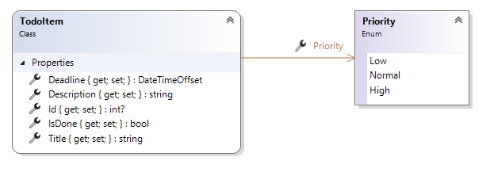
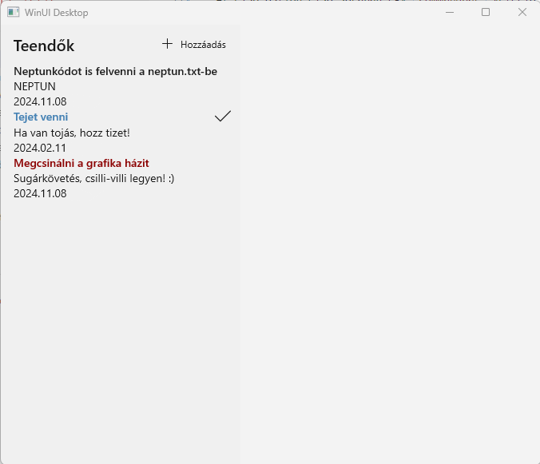
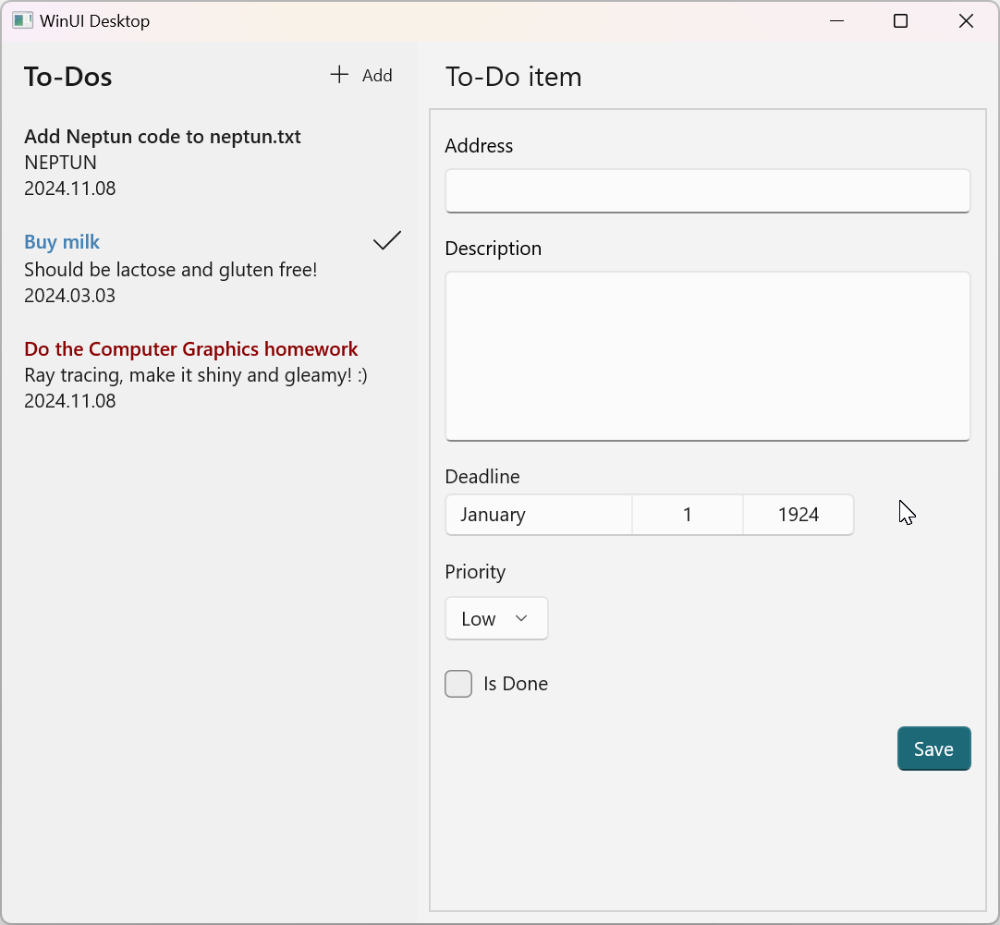
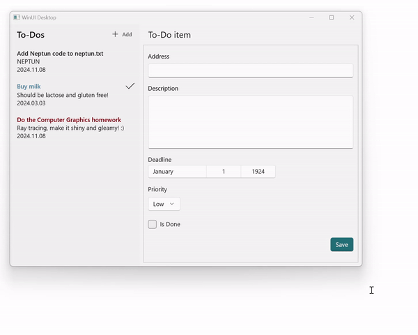
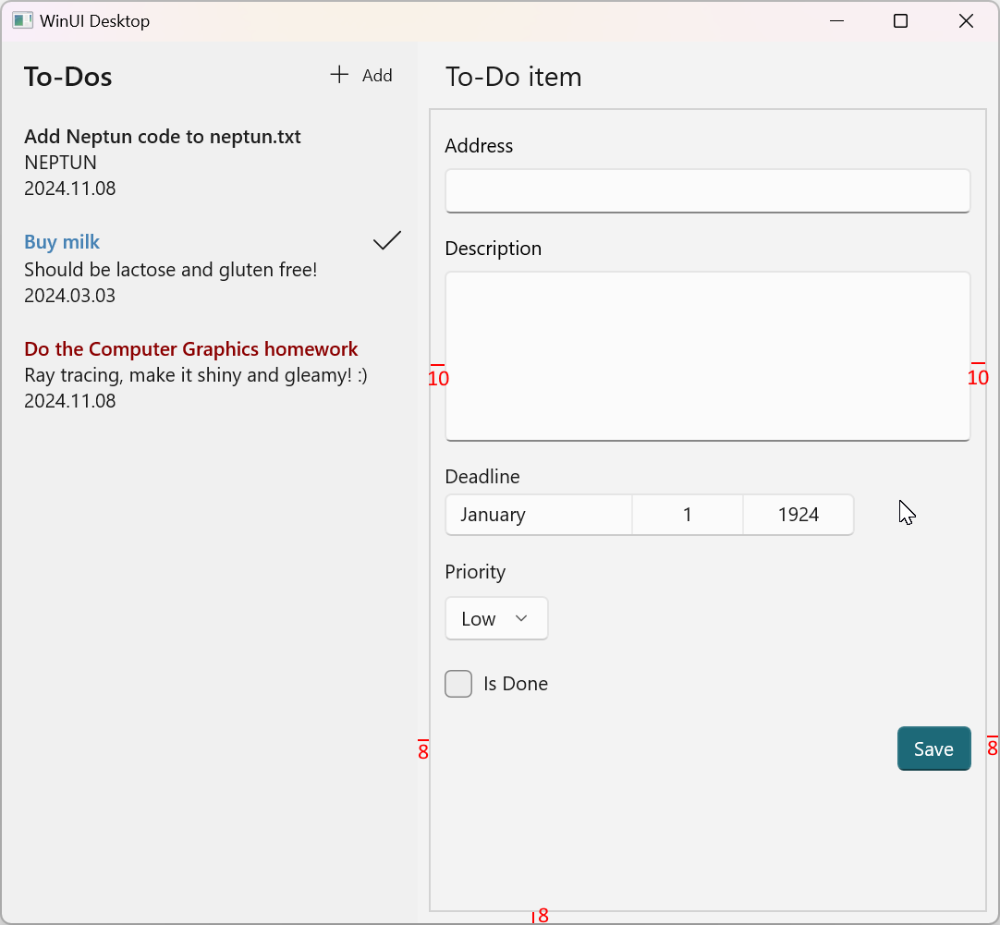
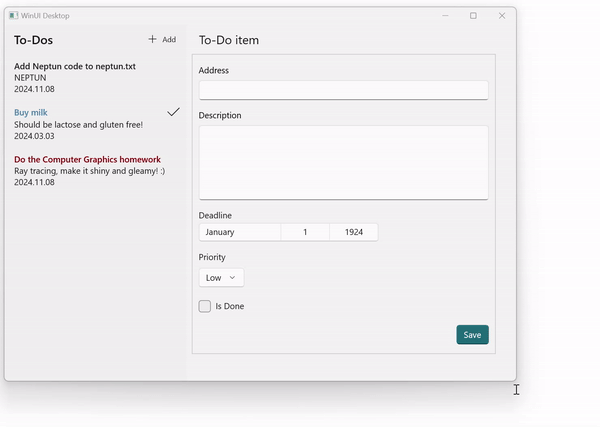

# 3. HA - Entwurf der Benutzeroberfläche

## Einführung

Die kleine Software, die in der Hausaufgabe verwirklicht werden soll, ist eine einfache Anwendung zur Aufgabenverwaltung, mit der Benutzer Aufgaben auflisten, erstellen und ändern können.

Die eigenständige Aufgabe baut auf dem auf, was in den XAML-Vorlesungen vermittelt wurde. Den praktischen Hintergrund für die Aufgaben liefert das [Labor 3 - Entwurf der Benutzeroberfläche](../../labor/3-felhasznaloi-felulet/index_ger.md). 

Darauf aufbauend können die Aufgaben dieser Selbstübung mit Hilfe der kürzeren Leitfäden, die auf die Aufgabenbeschreibung folgen (manchmal standardmäßig eingeklappt), selbständig bearbeitet werden.

Das Ziel der Hausaufgabe:

- Üben der Verwendung der Oberflächenbeschreibungssprache XAML
- Üben der Verwendung grundlegender Steuerelemente (Tabelle, Taste, Textfeld, Listen)
- Ereignisgesteuerte Verwaltung von Oberflächeninteraktionen
- Anzeige von Daten auf der Oberfläche mit Datenbindung

Die erforderliche Entwicklungsumgebung wird [hier](../fejlesztokornyezet/index_ger.md) beschrieben.

!!! warning "Entwicklungsumgebung für WinUI3-Entwicklung"
    Im Vergleich zu den vorherigen Hausaufgaben ist die Installation zusätzlicher Komponenten erforderlich. Die oben genannte Seite erwähnt, dass die Installation der Visual Studio-Workload ".NET desktop development" notwendig ist. Außerdem gibt es am Ende derselben Seite einen Abschnitt "WinUI-Unterstützung", dessen aufgeführte Schritte unbedingt ebenfalls durchgeführt werden müssen!

## Das Verfahren der Eingabe

:exclamation: Obwohl die Grundlagen ähnlich sind, gibt es wesentliche Unterschiede im Ablauf und in den Anforderungen im Vergleich zu den vorherigen Hausaufgaben. Lies die folgenden Punkte daher unbedingt sorgfältig durch.

- Der grundlegende Ablauf ist derselbe wie zuvor. Erstelle mit GitHub Classroom ein eigenes Repository. Die Einladungs-URL findest du in Moodle (bei Hausaufgabe 3.). Klone das so erstellte Repository. Dieses enthält die erwartete Struktur der Lösung. Nach der Fertigstellung der Aufgaben committe und pushe deine Lösung.
- Öffne `TodoXaml.sln` aus den geklonten Dateien und arbeite in diesem.
- :exclamation: Die Aufgaben verlangen, dass du **Screenshots** von bestimmten Teilen deiner Lösung erstellst, um zu belegen, dass du sie selbst angefertigt hast. **Der erwartete Inhalt der Screenshots wird in jeder Aufgabe genau angegeben.** Die Screenshots müssen als Teil der Lösung eingegeben werden. Lege sie im Stammverzeichnis deines Repositorys ab (neben der Datei `neptun.txt`). Dadurch werden die Screenshots zusammen mit dem Inhalt des Git-Repositorys auf GitHub hochgeladen. Da das Repository privat ist, können es außer den Lehrkräfte keine anderen Personen sehen. Falls Inhalte auf den Screenshots erscheinen, die du nicht hochladen möchtest, kannst du diese unkenntlich machen.
- :exclamation: Für diese Aufgabe gibt es keine inhaltliche Vorabprüfung: Nach jedem Push wird zwar eine Prüfung ausgeführt, diese kontrolliert jedoch nur, ob die Datei `neptun.txt` ausgefüllt ist. Die eigentliche Bewertung erfolgt nach Ablauf der Frist durch die Übungsleiter.

## Vorbedingungen

:warning: **MVVM-Modell - nicht benutzen!**  
  Verwenden Sie in dieser Hausaufgabe NICHT das MVVM-Muster (auch nicht in den späteren Teilaufgaben), führen Sie NICHT die Klasse `ViewModel` ein. MVVM wird das Thema einer späteren Hausaufgabe sein.

:warning: **Layout - Einfachheit**  
Wie im Allgemeinen, auch in dieser Hausaufgabe sollte das grundlegende Layout der Seite mit `Grid` gestaltet werden. Bei der Gestaltung der einzelnen internen Abschnitte sollten Sie jedoch darauf achten, dass sie einfach gehalten sind: Wo `StackPanel`verwendet werden kann, sollten Sie nicht `Grid`verwenden.

:warning: **Technische Einschränkungen**  

* Das Hinzufügen neuer externer Bibliotheksreferenzen (NuGet- und Assembly-Referenzen) ist nicht erlaubt.
* Das Einführen neuer Klassen ist nicht erlaubt, über die vom Aufgabenblatt geforderte `TodoItem`-Klasse und eventuell eingeführte Konverter (IValueConverter-Implementierung(en)) hinaus. Hilfsklassen, ViewModels und Basisklassen sind nicht erlaubt.
* Bezüglich Datenbindungen: 
    * Es dürfen nur `x:Bind`-basierte Lösungen verwendet werden; das klassische `Binding` ist nicht erlaubt (letzteres ist nicht typsicher, langsamer und sollte in modernen Anwendungen vermieden werden).
    * Die Verwendung von `Bindings.Update()` sowie die trickreiche Verwendung von PropertyChanged mit einem leeren String-Parameter ist nicht erlaubt. Stattdessen wird eine „korrektere", elegantere Lösung erwartet. 
* Die Verwendung des `Windows.UI`-Namensraums ist nicht erlaubt. Der Grund: Die **direkte** Verwendung von Typen in diesem Namensraum sollte in modernen WinUI-Anwendungen vermieden werden.
* Property-Element-Syntax sollte nur dort verwendet werden, wo sie gerechtfertigt ist. Zum Beispiel ist `<StackPanel.BorderThickness>1</StackPanel.BorderThickness>` unnötig komplex; stattdessen ist die übliche Attribut-Syntax einfacher (`<StackPanel BorderThickness="1">`).
* Die Verwendung unnötiger Steuerelemente/Panels ist nicht akzeptabel: z. B. ein `StackPanel` mit einem einzigen enthaltenen Steuerelement (das keinen Zweck erfüllt).
* Bei `TextBlock`s ist die Verwendung von `Run` nicht erlaubt (es dient keinem Zweck, unnötige Komplexität).

## Aufgabe 1. - Modellentwurf und Testdaten

Erstellen Sie ein neuen Projekt mit Visual Studio (WinUI 3 Projekt, Blank App, Packaged (WinUI 3 in Desktop) type), und addieren Sie einen Ordner namens `Models` zu dem erzeugten Projekt. Erstellen Sie die Klasse und den Enum-Typ, die in der folgenden Abbildung gezeigt werden, im Ordner `Models`. Die Klasse `TodoItem` enthält die Details zu den Aufgaben, für die Priorität wird ein aufgelisteter Typ erstellt.

<figure markdown>

</figure>

Beide Typen sollten öffentlich sein ( `class` und `enum` mit `public` vorangestellt), da Ihr sonst später bei der Übersetzung einen Fehler "Inconsistent accessibility" erhalten würden.

Addieren Sie einen Ordner namens `Views` zu dem Projekt, und eine neue leere Seite namens `MainPage` zu diesem Ordner (Rechtsklick auf `Views`: _Add/New Item/Blank Page (WinUI 3)_). Um diese Seite auf dem Fenster unserer Anwendung anzuzeigen, muss ein `MainPage` Objekt im Hauptfenster `MainWindow.xaml` instanziiert werden (Namensraum `views` soll auch addiert werden):

```xml title="MainWindow.xaml" hl_lines="8 11"
    <Window
        x:Class="HA3.MainWindow"
        xmlns="http://schemas.microsoft.com/winfx/2006/xaml/presentation"
        xmlns:x="http://schemas.microsoft.com/winfx/2006/xaml"
        xmlns:local="using:HA3"
        xmlns:d="http://schemas.microsoft.com/expression/blend/2008"
        xmlns:mc="http://schemas.openxmlformats.org/markup-compatibility/2006" 
        xmlns:views="using:HA3.Views"
        mc:Ignorable="d">

        <views:MainPage />    
    
    </Window> 
```

Auf der Seite `MainPage` wird eine Liste der zu erledigenden Aufgaben angezeigt. Jetzt verwenden Sie speicherinterne Testdaten, die in `MainPage.xaml.cs` erstellt wurden: Hier führen Sie eine Eigenschaft `List<TodoItem>` mit dem Namen `Todos` ein (die später an das Steuerelement `ListView` auf der Benutzeroberfläche gebunden wird). Diese Liste enthält `TodoItem` Objekte.

```csharp title="MainPage.xaml.cs"
public List<TodoItem> Todos { get; set; } = new()
{
    new TodoItem()
    {
        Id = 3,
        Title = "Add Neptun code to neptun.txt",
        Description = "NEPTUN",
        Priority = Priority.Normal,
        IsDone = false,
        Deadline = new DateTime(2024, 11, 08)
    },
    new TodoItem()
    {
        Id = 1,
        Title = "Buy milk",
        Description = "Should be lactose and gluten free!",
        Priority = Priority.Low,
        IsDone = true,
        Deadline = DateTimeOffset.Now + TimeSpan.FromDays(1)
    },
    new TodoItem()
    {
        Id = 2,
        Title = "Do the Computer Graphics homework",
        Description = "Ray tracing, make it shiny and gleamy! :)",
        Priority = Priority.High,
        IsDone = false,
        Deadline = new DateTime(2024, 11, 08)
    },
};
```

??? note "Erklärung des obigen Codes"
    In dem obigen Code sind mehrere moderne C#-Sprachelemente kombiniert:

    * Dies ist eine automatisch implementierte Eigenschaft (siehe Labor 2 "auto-implemented property").
    * Die Eigenschaft hat einen Anfangswert.
    * Der Typ wird nicht nach `new` angegeben, da der Compiler ihn ableiten kann (siehe Labor 2 "Target-typed new expressions").
    * Die Sammlungselemente werden in `{}` aufgelistet (siehe Labor 2 "Collection initializer syntax").

!!! note "`MainPage` Klasse"
    Während der Hausaufgabe werden Sie in der Klasse `MainPage` arbeiten, die aus der eingebauten Klasse `Page` abgeleitet ist. Die Klasse `Page` hilft Ihnen, zwischen den Seiten innerhalb des Fensters zu navigieren. Obwohl sie in dieser Hausaufgabe nicht verwendet wird, lohnt es sich, sich an ihre Verwendung zu gewöhnen. Da unsere Anwendung aus einer einzigen Seite besteht, instanziieren wir einfach ein Objekt `MainPage` im Hauptfenster (Sie können es sich in der Datei `MainWindow.xaml` ansehen).

## Aufgabe 2 - Seitenlayout, Liste anzeigen

### Layout

Unter `MainPage.xaml`erstellen Sie die Oberfläche, auf der die Liste der Aufgaben angezeigt wird.

<figure markdown>

<figurecaption>Die zu erstellende Anwendung mit einer Benutzeroberfläche für Listen</figurecaption>
</figure>

Wie in der obigen Abbildung mit den drei Aufgaben zu sehen ist, werden die Aufgabendetails untereinander angezeigt, die Priorität der Aufgaben wird durch Farben angezeigt, und neben den erledigten Aufgaben werden mit einem Häkchen rechts bezeichnet.

Die Elemente sind in der folgenden Struktur auf der Oberfläche angeordnet:

* Verwenden Sie in `MainPage`eine `Grid`mit zwei Zeilen und zwei Spalten von Elementen. Die erste Spalte sollte eine feste Breite haben (z. B: 300 px) und die zweite nimmt den restlichen Platz ein.
* Die erste Zeile der ersten Spalte sollte ein `CommandBar` Steuerelement mit einer Adresse und einer Taste enthalten. Das folgende Beispiel ist hilfreich:

    ```xml
    <CommandBar VerticalContentAlignment="Center"
                Background="{ThemeResource AppBarBackgroundThemeBrush}"
                DefaultLabelPosition="Right">
        <CommandBar.Content>
            <TextBlock Margin="12,0,0,0"
                       Style="{ThemeResource SubtitleTextBlockStyle}"
                       Text="To-Dos" />
        </CommandBar.Content>

        <AppBarButton Icon="Add"
                      Label="Add" />
    </CommandBar>
    ```

    !!! note "ThemeResource"
        Die `ThemeResource`im Beispiel kann verwendet werden, um die Farben und Stile einzustellen, die je nach Thema der Oberfläche variieren werden. Zum Beispiel hat `AppBarBackgroundThemeBrush` die richtige Hintergrundfarbe je nach dem Thema der Oberfläche (hell/dunkel).

        Einzelheiten finden Sie in der [Dokumentation](https://docs.microsoft.com/en-us/windows/uwp/design/style/color#theme-resources) und die Beispiele in [WinUI 3 Gallery App Colors](winui3gallery://item/Colors).

Wenn Sie Ihre Arbeit richtig gemacht haben, sollte bei der Ausführung der Anwendung `CommandBar`an der richtigen Stelle erscheinen.

### Liste anzeigen

Stellen Sie in der Zelle unter `CommandBar` in einer Liste (`ListView`) die Aufgaben mit folgendem Inhalt untereinander. Die Daten sollen über Datenverbindung in der Benutzeroberfläche angezeigt werden (die Elemente sollen über Datenverbindung aus der zuvor vorgestellten Liste `Todos` angezeigt werden).

* Titel der Aufgabe
    * Fette Schriftart (SemiBold)
    * Gefärbt nach Priorität
        * Hohe Priorität: ein roter Farbton
        * Normale Priorität: eingebaute Vordergrundfarbe
        * Niedrige Priorität: ein blauer Farbton
* Ein Häkchensymbol rechts neben dem Aufgabentitel, wenn die Aufgabe fertig ist (das Steuerelement, das das Häkchen anzeigt, darf überhaupt nicht sichtbar sein, wenn die Aufgabe nicht erledigt ist)
* Beschreibung der Aufgabe
* Abgabetermin im Format `yyyy.MM.dd` 
* Der Hintergrund von `ListView` sollte derselbe sein wie der von `CommandBar`, so dass sie einen durchgehenden Balken auf der linken Seite bilden.
* Bevor Sie mit der Implementierung beginnen, lesen Sie unbedingt die folgenden Einschränkungen!

!!! warning "Wichtige Kriterien"
    Die folgenden Kriterien sind zwingend erforderlich, damit die Hausaufgabe akzeptiert wird:

    * Die **direkte** Verwendung des Typs `Windows.UI.Color` für die Farbbehandlung ist nicht erlaubt. Stattdessen soll `Color` indirekt verwendet werden, z. B. über den Typ `Colors` (z. B. `Colors.Red`) oder `ColorHelper.FromArgb(...)`. Unabhängig von der Wahl können damit Pinsel mit der entsprechenden Farbe erstellt werden. Der Grund für diese Einschränkung: In modernen WinUI-Anwendungen sollte die Verwendung des Namensraums `Windows.UI` möglichst vermieden werden, und der Typ `Color` befindet sich dort.
    * Für den Zugriff auf die eingebaute Vordergrundfarbe ist nur die Lösung `(Brush)App.Current.Resources["ApplicationForegroundThemeBrush"]` akzeptabel (dies ist die „korrekte", zielgerichtete Lösung dafür).

Im Folgenden finden Sie in den aufklappbaren Bereichen Hilfe zur Lösung der einzelnen Teilaufgaben.

??? tip "Elemente in der Liste"
    Überlegen Sie immer, ob Sie Daten an ein Objekt oder an eine Liste binden, und verwenden Sie die entsprechende Technik! Bei dieser Hausaufgabe ist es nicht sicher, dass sie in der Reihenfolge kommen, in der sie im Labor waren!"

??? tip "Bedingte Einfärbung"
    Sie können einen Konverter oder eine Funktionsbindung auf Basis von `x:Bind` verwenden, um die Adresse einzufärben.

    - Beispiel für Funktionsbindung auf der Grundlage von "x:Bind":
            
        ```xml
        Foreground="{x:Bind local:MainPage.GetForeground(Priority)}"
        ```

        Hier ist "GetForeground" eine öffentliche statische Funktion in der Klasse "MainPage", die das Objekt "Brush" mit der entsprechenden Farbe auf der Grundlage des aufgelisteten Typs "Priorität" zurückgibt.
        Normalerweise wäre es nicht wichtig, dass die Funktion statisch ist, aber da wir die Datenverbindung in einem `DataTemplate` verwenden, ist der Kontext von `x:Bind` nicht die Seiteninstanz, sondern das Listenelement.


    - Beispiel für die Verwendung des Konverters:

        Erstellen Sie eine Konverterklasse in einem Ordner `Converters`, die die Schnittstelle `IValueConverter` implementiert.

        ```csharp
        public class PriorityBrushConverter : IValueConverter
        {
            public object Convert(object value, Type targetType, object parameter, string language)
            {
                // TODO Rückgabe einer SolidColorBrush-Instanz
            }

            public object ConvertBack(object value, Type targetType, object parameter, string language)
            {
                throw new NotImplementedException();
            }
        }
        ```

        Instanziierung des Konverters unter den Ressourcen der `MainPage`.

        ```xml
        xmlns:c="using:TodoXaml.Converters"

        <Page.Resources>
            <c:PriorityBrushConverter x:Key="PriorityBrushConverter" />
        </Page.Resources>
        ```

        Verwendung des Konverters als statische Ressource in der Datenverbindung

        ``xml
        Foreground="{x:Bind Priority, Converter={StaticResource PriorityBrushConverter}}"
        ```

    Um die Pinsel (Brush) zu instanziieren, verwenden Sie die Klasse `SolidColorBrush`, oder können Sie auch eingebaute Pinsel aus C#-Code (wie mit `ThemeResource` oben) benutzen.

    ```csharp
    new SolidColorBrush(Colors.Red);

    (Brush)App.Current.Resources["ApplicationForegroundThemeBrush"]
    ```

??? tip "Fette Schriftart"
    Schriftattribute können unter die Eigenschaften namens "Font..." eingestellt werden: `FontFamily` , `FontSize`, `FontStyle`, `FontStretch` und `FontWeight`.

??? tip "Sichtbarkeit des Häkchen-Symbol"
    Für das Häkchen-Symbol verwenden Sie `SymbolIcon`, wobei die Eigenschaft `Symbol` auf `Accept` gesetzt ist.

    Wenn das Häkchen-Symbol angezeigt wird, muss ein Wahr-Falsch-Wert in einen `Sichtbarkeit`-Typ umgewandelt werden. Man könnte dafür einen Konverter verwenden, aber diese Konvertierung ist so üblich, dass in der Datenverbindung `x:Bind` die Konvertierung von `bool` in `Sichtbarkeit` bereits eingebaut ist.

??? tip "Ausrichtung des Häkchen-Symbols"
    Der Titel der Aufgabe und das Häkchen-Symbol müssen ausgerichtet sein (eines nach links und eines nach rechts). Hier ein Tipp: Sie können z. B. eine einzelne Zelle verwenden `Grid`. In `Grid`können Sie mehrere Steuerelemente in einer Zelle "stapeln" und ihre Ausrichtung separat einstellen. Im zweiten Labor haben wir das Problem der Anzeige von Name und Alter in `ListView` `DataTemplate`folgendermaßen gelöst.

??? tip "Datumsformatierung"
    Zur Formatierung des Datums der Abgabefrist können Sie auch einen Konverter oder eine Funktionsbindung auf der Grundlage von `x:Bind` verwenden, wobei Sie die Funktion `DateTime.ToString` mit Parametern binden.

    ```xml
    Text="{x:Bind Deadline.ToString('yyyy.MM.dd', x:Null)}"
    ```

    Das `x:Null` wird benötigt, weil der zweite Parameter der Funktion `ToString` angegeben werden muss, aber in diesem Fall kann er `null` sein.

??? tip "Abstand zwischen den Listenelementen"
    Auf dem Screenshot der Anleitung sehen Sie, dass zwischen den Listenelementen ein vertikaler Abstand besteht, so dass die Listenelemente gut voneinander getrennt sind. Dies ist nicht standardmäßig der Fall. Glücklicherweise erfordert die Lösung, dass DataTemplate für die Anzeige der Elemente verwendet wird, so dass Sie durch eine kleine Anpassung (Tipp: geben Sie einen einzelnen Margin/Padding an) leicht etwas Platz zwischen den Listenelementen für eine bessere Lesbarkeit erreichen können. 

!!! example "Aufgabe 2 - EINGABE"
    Fügen Sie ein Bildschirmfoto der Anwendung ein, in der eine der Aufgaben in der Liste Ihren eigenen (!) Neptun-Code als Namen oder Beschreibung hat (also NICHT den Text "NEPTUN")! Der Dateiname soll `f2.png` sein und im selben Ordner wie neptun.txt abgelegt werden.

## Aufgabe 3 - Eine neue Aufgabe hinzufügen

Der Text "To-Do item" sollte auf der rechten Seite des Grids in Zeile 1 angezeigt werden, mit Schriftgrad 18, horizontal links ausgerichtet und vertikal zentriert, mit 20 Pixel Leerraum auf der linken Seite.

Klicken Sie auf der Oberfläche auf die Taste *Add*, um in der zweiten Zeile ein Formular anzuzeigen, in dem Sie eine neue Aufgabe hinzufügen können.

Das Formular sollte wie das folgende aussehen:

<figure markdown>

<figurecaption>Formular für die Bearbeitung einer Aufgabe</figurecaption>
</figure>

Das Formular sollte die folgenden Elemente enthalten, die untereinander angeordnet sind.

* **Titel**: Texteingabefeld
* **Beschreibung**: höheres Texteingabefeld, akzeptiert auch Zeilenumbruch (Enter) (`AcceptsReturn="True"`)
* **Abgabetermin**: Datumsauswähler (`DatePicker`) (Bemerkung: wir verwenden im Modell `DateTimeOffset` wegen dieses Controllers)
* **Priorität**: Dropdown-Liste (`ComboBox`) mit den Werten des Typs `Priority` 
* **Bereitschaft**: Kontrollkästchen (`CheckBox`)
* **Speichern**: Taste mit eingebautem Stil accent (`Style="{StaticResource AccentButtonStyle}"`)

Das Formular benötigt kein spezielles, benutzerdefiniertes Steuerelement (z. B. `UserControl` ): Verwenden Sie einfach einen der Layout-Paneltypen, die für die Aufgabe geeignet sind.

Bevor Sie mit der Implementierung beginnen, lesen Sie unbedingt auch das Folgende, einschließlich des Abschnitts „Wichtige Kriterien" weiter unten!
Zusätzliche Hinweise zur Umsetzung einiger der Anforderungen finden Sie in den aufklappbaren Bereichen weiter unten.

Zusätzliche funktionale Anforderungen:

* Das Formular sollte nur sichtbar sein, wenn die Taste *Add* angeklickt wird, und verschwinden, wenn die Aufgabe gespeichert wird.
* Klicken Sie auf *Save* (die Beschriftung soll „Save" sein), um die Daten zur Liste hinzuzufügen, und das Formular wird ausgeblendet.
* Mit dem Klicken auf die Taste *Add* soll die Auswahl der aktuellen Element in der Liste entfernt werden (`SelectedItem`). (Nur die Auswahl, nicht das Element sich selbst.)
* Optionale Aufgabe: Das Formular sollte scrollbar sein, wenn sein Inhalt nicht auf den Bildschirm passt (verwenden Sie`ScrollViewer` ).
  
Layout des Formulars

*  Die Steuerelemente `TextBox`, `ComboBox` und `DatePicker` haben eine Eigenschaft `Header`, in der der Überschrifttext über dem Steuerelement angegeben werden kann. Verwenden Sie dies, um Kopftexte anzugeben, nicht eine separate `TextBlock`!
* Auf dem Formular sollten die Elemente nicht zu dicht nebeneinander liegen, mit etwa 15 Pixeln zusätzlichem Abstand zwischen ihnen (die Eigenschaft `StackPanel` `Spacing` ist eine gute Möglichkeit, dies zu erreichen).
* Legen Sie einen sichtbaren Rahmen für das Formular fest. Wir tun dies nicht, um unsere Benutzeroberfläche hübscher zu machen, sondern um besser erkennen zu können, wo genau sich unser Formular befindet (eine Alternative wäre, die Hintergrundfarbe zu ändern). Dieser "Trick" wird temporär auch währen der Gestaltung der Oberfläche eingesetzt, wenn nicht klar ist, wo genau sich etwas auf der Oberfläche befindet. Setzen Sie dazu die Eigenschaft `BorderThickness` des Formular-Containers auf 1 und die Rahmenfarbe (Eigenschaft`BorderBrush` ) auf eine sichtbare Farbe (z.B. `LightGray`).
* Verwenden Sie links, rechts und unten im Formular einen Rand von 8 und oben einen Rand von 0 (dies ist der Abstand zwischen dem Rand des Formulars und seinem Inhalt, unabhängig davon, wie groß der Benutzer das Fenster zur Laufzeit skaliert). 
* Zwischen dem Rahmen des Formulars und dem Rand der Steuerelemente sollten oben und unten jeweils 15 Pixel und links und rechts jeweils 10 Pixel Platz sein. Um dies zu tun, setzen Sie nicht die Ränder der Steuerelemente im Formular einzeln, sondern setzen Sie eine entsprechende Eigenschaft des Formular-Containers (die steuert, wie viel Platz zwischen den Rändern des Containers und seinem inneren Inhalt vorhanden ist)!
* Die beiden vorangegangenen Punkte bedeuten auch, dass das Formular und die darin enthaltenen Textfelder automatisch mit dem Fenster skaliert werden sollten, wie in den Bildern unter dem Dropdown-Bereich dargestellt.
    
    ??? note "Illustration des Formularverhaltens und der erwarteten Größe"
        
        

Bevor Sie mit der Implementierung beginnen, lesen Sie unbedingt die folgenden Einschränkungen!

!!! warning "Wichtige Kriterien"
    Die folgenden Kriterien sind zwingend erforderlich, damit die Hausaufgabe akzeptiert wird:

    * Sowohl bei den Listen- als auch bei den Formularelementen muss Datenbindung verwendet werden. Eine Lösung, die die Datenbindung umgeht, ist nicht akzeptabel. Beispielsweise darf die Code-Behind-Datei (`MainPage.xaml.cs`) keinen Code enthalten, der die Eigenschaften von Formularsteuerelementen (z. B. `TextBox.Text`) direkt liest oder setzt.
    * Zwei Ausnahmen von dieser Regel: 
        * Die Eigenschaft `ListView.SelectedItem` soll direkt gesetzt werden.
        * Die Steuerung der Formularsichtbarkeit ohne Datenbindung ist akzeptabel, aber nur, wenn `TodoItem` das Interface `INotifyPropertyChanged` implementiert.
    * Die Formularsteuerelemente müssen an die Eigenschaften eines einzelnen `TodoItem`-Objekts gebunden werden (z. B. EditedTodo.Title, EditedTodo.Description) und nicht an separate Eigenschaften von `MainPage`.
    * Wenn eine neue Aufgabe nach einer vorherigen Aufgabe hinzugefügt wird, dürfen die Daten der vorherigen Aufgabe NICHT in den Formularsteuerelementen verbleiben.
    * Für die Priorität-`ComboBox` ist nur eine `SelectedItem`-basierte Lösung akzeptabel (z. B. ist eine `SelectedIndex`-basierte Lösung nicht akzeptabel, da sie zu einer weniger robusten Lösung führen würde).
    * Beim Hinzufügen eines neuen Elements ist es verboten, immer eine neue Liste zu erstellen; das Element muss der bestehenden Sammlung hinzugefügt werden (überlegen Sie, welcher Sammlungstyp für eine Liste geeignet ist, die von der Benutzeroberfläche dynamisch aktualisiert werden muss).

Im Folgenden finden Sie in den aufklappbaren Bereichen Hilfe zur Lösung der einzelnen Teilaufgaben.

??? success "Schritte zur Implementierung des Speicherns und der Kontrolle der Formularsichtbarkeit"

    1. Die Daten im Formular werden in einem neuen "ToDoItem"-Objekt gesammelt, dessen Eigenschaften (bidirektional!) zu der Oberfläche gebunden werden. Erstellen Sie eine Eigenschaft mit dem Namen `EditedTodo` (der Anfangswert sollte null sein).
    2. Klicken Sie auf die Taste _Add_, um `EditedTodo` zu kopieren. 
    3. Fügen Sie beim Speichern das zu bearbeitende Objekt in die Liste "ToDos" ein. Denken Sie daran, dass die Datenverbindungen in der Oberfläche aktualisiert werden müssen, wenn sich der Inhalt der Liste ändert (dies erfordert Änderungen an der Art und Weise, wie wir unsere Daten speichern).
    4. Während des Speicherns wird die Eigenschaft "EditedTodo" gelöscht, auf "null" gesetzt.
    5. Wenn Sie das oben beschriebene getan haben, sollte das Formular genau dann sichtbar sein, wenn `EditedTodo` nicht null ist (stellen Sie sicher, dass es so ist). Darauf aufbauend können Sie mehrere Lösungen entwickeln. Am einfachsten ist es, die klassische, auf Eigenschaften basierende Datenverbindung "x:Bind" zu verwenden:
        1. Führen Sie eine neue Eigenschaft in unsere Klasse `Page` ein (z.B. `IsFormVisible`, mit dem Typ bool).
        2. Dies sollte genau dann wahr sein, wenn `EditedTodo` nicht null ist. Sie sind dafür verantwortlich, dies zu pflegen, z.B. im Setter `EditedTodo`.
        3. Diese Eigenschaft kann mit der Sichtbarkeit des Containers, der unser Formular darstellt, verknüpft werden (Eigenschaft "Visibility"). Sie sind zwar nicht vom selben Typ, aber unter WinUI gibt es eine automatische Konvertierung zwischen den Typen `bool` und `Visibility`.
        4. Beachten Sie auch, dass bei einer Änderung der Quelleigenschaft (`IsFormVisible`) die damit verbundene Zieleigenschaft (Sichtbarkeit des Steuerelements) immer aktualisiert werden muss. Was wird benötigt? (Hinweis: in der Klasse, die **direkt die Eigenschaft** enthält - überlegen Sie, um welche Klasse es in unserem Fall ist - muss eine geeignete Schnittstelle implementiert werden usw.)
        
    ??? "Alternative Möglichkeiten für die Lösung"
        
        Andere Alternativen sind ebenfalls möglich (nur interessehalber, aber verwenden Sie sie nicht diese in der Lösung):
        
        5. Implementieren einer funktionsbasierte Datenverbindung, aber in unserem Fall wäre dies komplizierter.
            * Bei einer auf der Grundlage von "x:Bind" gebundenen Funktion wird der Wert "null" oder ein anderer Wert als "null" der Eigenschaft "EditedTodo" zum Anzeigen und Ausblenden in "Sichtbarkeit" umgewandelt.
            * Wenn wir Daten binden, müssen wir auch `FallbackValue='Collapsed'` verwenden, denn leider ruft `x:Bind` die Funktion standardmäßig nicht auf, wenn der Wert `null` ist.
            * Die gebundene Funktion muss einen Parameter haben, der die Eigenschaft angibt, deren Änderung die Aktualisierung der Datenverbindung bewirkt, und auch die Änderungsmeldung für die Eigenschaft muss hier implementiert werden.
        6. Anwendung des Konverters.

??? tip "Liste der Prioritäten"
    Zeigen Sie in `ComboBox`die Werte des aufgelisteten Typs `Priority` an. Zu diesem Zweck können Sie die Funktion `Enum.GetValues` verwenden und eine Eigenschaft in `MainPage.xaml.cs`erstellen.

    ```csharp
    public List<Priority> Priorities { get; } = Enum.GetValues(typeof(Priority)).Cast<Priority>().ToList();
    ```

    Binden Sie die Liste "Priorities" an die Eigenschaft "ItemsSource" der "ComboBox".

    ```xml
    <ComboBox ItemsSource="{x:Bind Priorities}" />
    ```

    Im obigen Beispiel gibt `ItemsSource` nur an, welche Elemente in der Liste der `ComboBox` erscheinen sollen. Aber das sagt nichts darüber aus, woran das ausgewählte Element in der "ComboBox" gebunden sein soll. Dies erfordert eine weitere Datenverbindung. Dies wurde in der Übung nicht erwähnt, aber es lohnt sich im Vorlesungsmaterial zum Beispiel `SelectedItem` suchen (alle Vorkommen lohnt es sich anzuschauen).

??? tip "Einige wichtige Controller-Eigenschaften"
    * Die Eigenschaft `IsChecked` (und nicht `Checked`!) von`CheckBox`  
    * Die Eigenschaft `Date` von `DatePicker`  

!!! example "Aufgabe 3 - EINGABE"
    Fügen Sie ein Bildschirmfoto der Anwendung ein, auf dem das Hinzufügen der neuen Aufgabe vor dem Speichern sehbar ist! (`f3.1.png`)

    Fügen Sie ein Bildschirmfoto der Anwendung ein, auf dem die Aufgabe im vorherigen Bild der Liste hinzugefügt wurde und das Formular verschwunden ist (`f3.2.png`)

Optionale Übungsaufgaben

??? tip "Optionale Übungsaufgabe 1 - Ein Formular scrollbar machen"
    Alles, was Sie tun müssen, ist, das Formular in ein `ScrollViewer` Steuerelement einzuschließen (und denken Sie daran, dass dies das äußerste Element in der Gridzelle sein wird, so dass Sie die Position innerhalb dem Grid dafür angeben müssen). Wenn Sie dies implementieren, kann es in Ihre eingereichte Lösung aufgenommen werden.

??? tip "Optionale Übungsaufgabe 2 - Formular mit fester Breite"
    In unserer Lösung wird das Formular automatisch mit dem Fenster skaliert. Eine gute Möglichkeit ist zu üben, dies so zu ändern, dass das Formular eine feste Breite (z. B. 500 Pixel) und eine Höhe hat, die der Gesamthöhe der darin enthaltenen Elemente entspricht. Wenn Sie für das Formular mit StackPanel gearbeitet haben, müssen Sie nur drei Attribute hinzufügen oder ändern. Dieses Verhalten wird in der nachstehenden animierten Abbildung veranschaulicht. Es ist wichtig, dass Sie die vorherige Lösung eingaben soll und nicht das in dieser optionalen Übung beschriebene Verhalten!
    

## 4. Optionale Aufgabe für 3 IMSc-Punkte - Bearbeiten einer Aufgabe (ToDo)

Machen Sie es möglich, die Aufgaben wie folgt zu bearbeiten:

* Wenn Sie auf der Benutzeroberfläche auf ein Element in der Aufgabenliste klicken, werden die Daten für diese Aufgabe in der Bearbeitungsoberfläche angezeigt (das in der vorherigen Aufgabe vorgestellte Formular), wo sie bearbeitet und gespeichert werden kann.
* Beim Speichern sollte die bearbeitete Aufgabenliste aktualisiert werden und das Formular verschwinden.
* Einschränkung: Es darf keine neue Datenbindung (z. B. auf ListView.SelectedItem) eingeführt werden.

??? success "Tipps zur Lösung"
    * Es lohnt sich, die eindeutige ID der Aufgaben während des Einfügens beizubehalten, damit Sie während dem Speichern, zwischen Bearbeiten und Einfügen unterscheiden können. Im Falle einer Einfügung können Sie beispielsweise den Wert -1 verwenden, den wir durch eine Zahl ersetzen, die um eins größer ist als die zuvor verwendete. Aber nehmen wir an, dass -1 auch ein Wert ist, den ein gültiges Aufgabenobjekt haben kann. Was kann getan werden? Ändern Sie in der Klasse `TodoItem` den Typ von `Id` in `int?`. Bei `?`können die Wertetypen (`int`, `bool`, `char`, `enum`, `struct` usw.) auch den Wert `null` annehmen. Diese werden als nullable Werttypen (nullable value types) bezeichnet. Sie werden während der Kompilierung auf die Struktur `Nullable<T>`.NET abgebildet, die die ursprüngliche Variable und ein Flag enthält, das angibt, ob der Wert gefüllt ist oder nicht. Lesen Sie mehr über sie [hier](https://learn.microsoft.com/en-us/dotnet/csharp/language-reference/builtin-types/nullable-value-types) und [hier](https://learn.microsoft.com/en-us/dotnet/api/system.nullable-1).  Wenden Sie dies in der Lösung an.
    * Um auf das Listenelement zu klicken, empfiehlt es sich, das Ereignis `ListView` `ItemClick` zu verwenden, nachdem die Eigenschaft `IsItemClickEnabled` auf `ListView`aktiviert wurde. Informationen über das neu ausgewählte Listenelement werden im Parameter `ItemClickEventArgs` des Ereignishandlers angegeben. 
    * Es gibt mehrere Möglichkeiten, die zu bearbeitenden Daten zu behandeln, eine davon ist: 
        * Setzen Sie die Eigenschaft `EditedTodo` auf die bearbeitete Aufgabe, wenn Sie darauf klicken.
        * Wenn Sie auf die Taste "Save" klicken, wird die bearbeitete Aufgabe in der Liste `Todos` durch den Wert `EditedTodo` ersetzt. Im Endeffekt ersetzen wir das gleiche Element durch sich selbst, aber `ListView` wird aktualisiert.

!!! example "Aufgave 4. iMSc - EINGABE"
    Fügen Sie ein Bildschirmfoto der Anwendung ein, bei der ein Klick auf einen vorhandenen Eintrag das Formular ausfüllt (`f4.imsc.1.png`)

    Fügen Sie ein Bildschirmfoto der Anwendung ein, auf dem die im vorherigen Screenshot ausgewählte Aufgabe in der Liste als Ergebnis der Speicheraktion aktualisiert wird! (`f4.imsc.2.png`)

## Eingabe

Checkliste für Wiederholungen:

- Es ist wichtig, dass nur die Aufgaben akzeptiert werden, die Sie vollständig gemacht haben und die die Anforderungen in jeder Hinsicht erfüllen. 
- Sie müssen natürlich Ihre eigene Arbeit eingeben (da sie bewertet wird).
- Nicht nur das Quellcode, sondern auch die erwartete Bildschirmfotos sollen eingegeben werden.