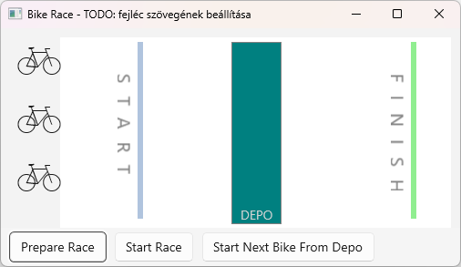
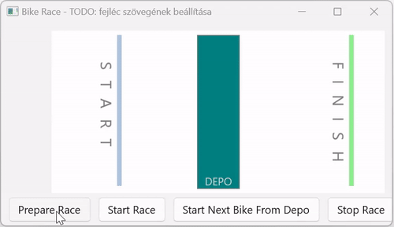

# 4. HF - Többszálú alkalmazások fejlesztése

## Bevezetés

Az önálló feladat a konkurens/többszálú alkalmazások fejlesztése előadásokon elhangzottakra épít. A feladatok gyakorlati hátteréül a [4. labor – Többszálú alkalmazások fejlesztése](../../labor/4-tobbszalu/index.md) laborgyakorlat szolgál.

A fentiekre építve, jelen önálló gyakorlat feladatai a feladatleírást követő rövidebb iránymutatás segítségével elvégezhetők.
Az önálló gyakorlat a következő ismeretek elmélyítését célozza:

- Szálak indítása és leállítása, szálfüggvény
- Jelzés és jelzésre várakozás (`ManualResetEvent`, `AutoResetEvent`)
- Kölcsönös kizárás megvalósítása (`lock` használata)
- WinUI felületelemekhez hozzáférés munkaszálakból
- Delegate-ek használatának gyakorlása (`Action<T>`)
- Felhasználói felület kialakításának gyakorlása: időzítő használata, felületelemek manipulálása code behind fájlból (ez nem kapcsolódik a szálkezeléshez)

A szükséges fejlesztőkörnyezet a szokásos, [itt](../fejlesztokornyezet/index.md) található leírás (a leírásban szereplő Windows App SDK-ra is szükség van).

!!! warning "Ellenőrző futtatása"
    Ehhez a feladathoz érdemi előellenőrző nem tartozik: minden push után lefut ugyan, de csak a neptun.txt kitöltöttségét ellenőrzi és azt, van-e fordítási hiba. Az érdemi ellenőrzést a határidő lejárta után a laborvezetők teszik majd meg.

## A beadás menete

- Az alapfolyamat megegyezik a korábbiakkal. GitHub Classroom segítségével hozz létre magadnak egy repository-t. A meghívó URL-t Moodle-ben találod (a tárgy nyitóoldalán a "*GitHub classroom hivatkozások a házi feladatokhoz*" hivatkozásra kattintva megjelenő oldalon látható). Fontos, hogy a megfelelő, ezen házi feladathoz tartozó meghívó URL-t használd (minden házi feladathoz más URL tartozik). Klónozd le az így elkészült repository-t. Ez tartalmazni fogja a megoldás elvárt szerkezetét. A feladatok elkészítése után commit-old és push-old a megoldásod.
- A neptun.txt fájlba írd bele a Neptun kódod!
- A kiklónozott fájlok között a `MultiThreadedApp.sln`-t megnyitva kell dolgozni.
- :exclamation: A feladatok kérik, hogy készíts **képernyőképet** a megoldás egy-egy részéről, mert ezzel bizonyítod, hogy a megoldásod saját magad készítetted. **A képernyőképek elvárt tartalmát a feladat minden esetben pontosan megnevezi.** A képernyőképeket a megoldás részeként kell beadni, a repository-d gyökérmappájába tedd (a neptun.txt mellé). A képernyőképek így felkerülnek GitHub-ra git repository tartalmával együtt. Mivel a repository privát, azt az oktatókon kívül más nem látja. Amennyiben olyan tartalom kerül a képernyőképre, amit nem szeretnél feltölteni, kitakarhatod a képről.

## Feladat 0 – A feladat áttekintése, ismerkedés a kiinduló kerettel

A feladat egy bicikliversenyt szimuláló alkalmazás elkészítése. A megvalósítás alappillére **az alkalmazáslogika és a megjelenítés különválasztása**: az alkalmazáslogika semmilyen szinten nem függhet a megjelenítéstől, a megjelenítés pedig függ az alkalmazáslogikától (értelemszerűen, hiszen annak aktuális állapotát jeleníti meg).

A kiinduló keret már tartalmaz némi alkalmazás és megjelenítéshez kapcsolódó logikát. Futtassuk az alkalmazást, és tekintsük át a felületét:



- Az ablak felső részén található a versenypálya. Bal oldalon sorakoznak a biciklik, majd látható a startvonal, a pálya közepe felé egy köztes megálló (depó), ill. a célvonal.
- Az ablak alsó részén a verseny vezérlésére szolgáló gombok találhatók. Még nem kapcsolódik hozzájuk logika, a következő viselkedést fogjuk a későbbiekben megvalósítani:
    - `Prepare Race`: A verseny előkészítése (biciklik létrehozása és felsorakoztatása a startvonalhoz).
    - `Start Race`: A verseny indítása, mely hatására a biciklik egymással versenyezve elérnek a depóba, és ott várakoznak.
    - `Start Next Bike From Depo`: A depóban várakozó biciklik közül elindít egyet (mely bicikli egészen a célvonalig halad). A gombon többször is lehet kattintani, minden alkalommal egy biciklit enged tovább.

Az alábbi animált képen azt illusztrálja, hogy a megoldás során hova szeretnénk eljutni:



A játék/szimuláció alapelvelve a következő (még nincs megvalósítva):

- Minden egyes biciklihez egy külön szál tartozik.
- A játék/szimuláció iterációkra bontott: minden iterációban a biciklihez tartozó szál (amennyiben az éppen nem várakozik a verseny indítására vagy a depóban) egy véletlenszerű számértékkel lép előre a pályán, egészen addig, amíg el nem éri a célvonalat.

Egy extra megvalósított funkció (ez már működik): a világos és sötét téma közötti váltásra lehetőség van a ++ctrl+t++ billentyűkombinációval.

### Alkalmazáslogika

A kiinduló keretben az **alkalmazáslogika** osztályai csak kezdetleges állapotban vannak megvalósítva. Az osztályok az `AppLogic` mappában/névtérben találhatók, nézzük meg ezek kódját:

- `Bike`: Egy biciklit reprezentál, melyhez hozzátartozik a bicikli rajtszáma, pozíciója és azon információ, hogy az adott bicikli nyerte-e meg a versenyt. A `Step` művelete a bicikli véletlenszerű léptékkel történő léptetésére szolgál a verseny közben.
- `Game`: A játék vezérlésének logikája (ezt tovább lehetne darabolni, de az egyszerűség kedvéért alapvetően ebbe az osztályba fogunk dolgozni).
    - Definiálja az egyes versenypálya elemek, úgymint startvonal, köztes megálló (depó) és célvonal pozícióit: `StartLinePosition`, `DepoPosition` és `FinishLinePosition` konstansok.
    - Tárolja a versenyző bicikliket (`Bikes` tagváltozó).
    - `PrepareRace` művelet: Előkészíti a versenyt. Egyelőre a `CreateBike` segédfüggvény felhasználásával létrehoz három biciklit. A feladata lesz még a biciklik felsorakoztatása a startvonalhoz.
    - `StartBikes` művelet: Verseny indítása (mely hatására a biciklik egymással versenyezve elérnek a depóba, és ott várakoznak). Nincs megvalósítva.
    - `StartNextBikeFromDepo` művelet: A depóban várakozó biciklik közül elindít egyet (de csak egyet). Nincs megvalósítva.

### Megjelenítés

A kiinduló keretben a **megjelenítés** viszonylag jól elő van készítve, de ezen is fogunk még dolgozni.

A felület kialakítása a `MainWindow.xaml`-ben található, a következő alapelvek szerint:

- Az ablak alapelrendezésének kialakítására "szokásosan" egy `Grid`-et használtunk, mely két sorból áll. Az első sorában található a versenypálya a biciklikkel (`*` sormagasság), az alsó részben pedig egy `StackPanel` a gombokkal (`Auto` sormagasság).
- A pálya kialakítására `Rectangle` objektumokat (háttér, startvonal, depo, célegyenes), a szövegelemek elrendezésére pedig (részben elforgatott) `TextBlock` objektumokat használtunk.
- Az egyes bicikliket egy vertikális `StackPanel`-en helyeztük el. A bicikliket egy-egy `TextBlock` objektummal jelenítjük meg (`Webdings` betűtípus, `b` betű). Használhattunk volna `FontIcon`-t is, a `TextBlock`-ra csak azért esett a választásunk, mert ezzel már korábban megismerkedtünk.
- A pálya valamennyi elemét és a bicikliket tartalmazó `StackPanel`-t is a `Grid` első (technikailag 0-dik) sorában helyeztük el. Ezek a definiálásuk sorrendjében rajzolódnak ki, az igazítások és margók által meghatározott helyen. A biciklik `TextBlock`-jának pozícionálására is a margót használjuk majd. Egy alternatíva megoldás lett volna, ha minden felületelemet egy `Canvas`-re helyeztünk volna el, és azon állítottuk volna be az elemek abszolút pozícióját és méretét (Left, Top, Width, Height) a margók alkalmazása helyett.

Az ablakhoz tartozó `MainWindow.xaml.cs` code behind fájlt is nézzük meg, főbb elemei a következők:

- `game` tagváltozó: Maga a `Game` játékobjektum, melynek állapotát a főablak megjeleníti.
- `bikeTextBlocks` tagváltozó: Ebben a listában tároljuk majd a bicikliket megjelenítő `TextBlock` objektumokat. Egyelőre üres, a karbantartását nekünk kell majd megvalósítani.
- Konstruktor: Beállítja a startvonal, depó és célvonal felületelemek x koordinátáját a `Game` által meghatározott konstans értékek alapján. Az x koordináta beállítása a baloldali margó (`Margin`) megfelelő beállításával történik (mivel ezek az elemek balra igazítottak a konténerükben!). Ezen felül a `AddKeyboardAcceleratorToChangeTheme` segédfüggvény segítségével beregisztrálja a ++ctrl+t++ gyorsítóbillentyűt a világos/sötét téma közötti váltásra.
- `PrepareRaceButton_Click`, `StartRaceButton_Click`, `StartNextFromDepoButton_Click`: a három gomb eseménykezelője.
- `UpdateUI` művelet: Kulcsfontosságú logikát tartalmaz. A játék állapotának megfelelően frissíti a felületet. Végig iterál a játék összes biciklijén, és a biciklikhez tartozó `TextBlock`-ok x pozícióját beállítja a bicikli pozíciója alapján (a baloldali margó megfelelő beállításával). Az `UpdateUI` művelet egyelőre soha nem hívódik, így a felület nem frissül.


## Feladat 1 – A felület frissítése

Jelen pillanatban hiába módosítanánk futás közben a játék állapotát: a felületbe be van égetve a három bicikli fix pozícióban, ezen felül a felületet frissítő `UpdateUI` művelet egyelőre soha nem hívódik. Mielőtt belevágnánk a játéklogika megvalósításába, módosítsuk a felülethez tartozó logikát, hogy az képes legyen folyamatosan a játék friss állapotát megjeleníteni.

### A biciklik dinamikus kezelése

Az első probléma: a `MainWindow.xaml`-be be van égetve a három, biciklit megjelenítő `TextBlock`. Így a felületünk csak olyan játék megjelenítésére lenne képes, melyben pontosan három versenyző szerepel. Készítsük elő a megjelenítést tetszőleges számú bicikli kezelésére.
Első lépésben távolítsuk el a `MainWindow.xaml`-ből a három biciklihez tartozó "beégetett" `TextBlock` definíciót (kommentezzük ki a három sort). Ezt követően, a code behind fájlban, a `PrepareRaceButton_Click` eseménykezelőben a verseny előkészítése (`game.PrepareRace()` hívás) után:

1. Dinamikusan hozzunk létre minden, a `game` objektumban szereplő biciklihez (`game.Bikes` tulajdonság!) egy megfelelő `TextBlock` objektumot . A létrehozott `TextBlock` tulajdonságai pontosan feleljenek meg annak, mint amit a xaml fájlban kiiktattunk (`FontFamily`, `FontSize`, `Margin`, `Text`)
2. A létrehozott `TextBlock` objektumokat fel kell venni a `bikesPanel` nevű `StackPanel` gyerekei közé (a xaml fájlban kikommentezett `TextBlock`-ok is ennek gyerekei voltak, ezt nézzük meg!), mégpedig a `bikesPanel.Children.Add` hívásával.
3. A létrehozott `TextBlock` objektumokat vegyük fel a `bikeTextBlocks` listába is. Ez azért fontos - nézzük is meg a kódban - mert az `UpdateUI` felületfrissítő függvény a biciklikhez tartozó `TextBlock`-okat a `bikeTextBlocks` listában keresi (tömbindex alapján párosítja a bicikliket és a `TextBlock`-okat).

Annyiban megváltozik az alkalmazás működése (de ez szándékos), hogy induláskor nem jelennek meg biciklik, hanem csak a `Prepare Race` gombon kattintáskor.

Próbáljuk a megoldást magunktól megvalósítani a fenti pontokat követve, majd ellenőrizzük, hogy alapvetően megfelel-e az alábbi megoldásnak.

??? tip "Megoldás"

    ```csharp
    foreach (var bike in game.Bikes)
    {
        var bikeTextBlock = new TextBlock()
        {
            Text = "b",
            FontFamily = new FontFamily("Webdings"),
            FontSize = 64,
            Margin = new Thickness(10, 0, 0, 0)
        };

        bikesPanel.Children.Add(bikeTextBlock);
        bikeTextBlocks.Add(bikeTextBlock);
    }
    ```

### A felületfrissítés megvalósítása

Most már pontosan annyi `TextBlock`-unk lesz, ahány bicikli van a `game` objektumban. Sőt, az `UpdateUI` művelettel tudjuk is a felületet bármikor frissíteni (a `game` aktuális állapotának megfelelően). A következő kardinális kérdés: mikor hívjuk ezt a függvényt, vagyis mikor frissítsük a felületet. Több megoldás közül választhatunk:

- a) Mindig, amikor a `Game` állapota megváltozik.
- b) Adott időközönként (pl. 100 ms-ként) "folyamatosan", egy időzítő segítségével.

Általánosságában mindkét megoldásnak lehetnek előnyei és hátrányai. A b) bizonyos tekintetben egyszerűbb (nem kell tudni, mikor változik a `Game` állapota), ugyanakkor felesleges frissítés is történhet (ha nem változott az állapot két frissítés között). De hatékonyabb is lehet, ha az állapot nagyon gyakran változik, és nem akarjuk minden változáskor a felületet frissíteni, elég adott időközönként egyszer (pl. a szemünk úgysem tudja lekövetni).
Esetünkben - elsősorban egyszerűsége miatt - a "b)", vagyis időzítő alapú megoldást választjuk.

WinUI 3 környezetben periodikus események kezelésére a `DispatchTimer` osztály alkalmazása javasolt (különösen, ha a felületelemekhez is hozzá kívánunk férni az időzített műveletben).

A `MainWindow` osztályban vezessünk be egy tagváltozót:
 
```csharp
    private DispatcherTimer timer;
```

Ezt követően a konstruktorban példányosítsuk a timert, rendeljünk a `Tick` eseményéhez egy eseménykezelő függvényt (ez hívódik adott időközönként), állítsuk be az időközt 100 ms-ra (`Interval` tulajdonság), és indítsuk el a timert:

```csharp
public MainWindow()
{
    ...

    timer = new DispatcherTimer();
    timer.Tick += Timer_Tick;
    timer.Interval = TimeSpan.FromMilliseconds(100);
    timer.Start();
}

private void Timer_Tick(object sender, object e)
{
    UpdateUI();
}
```

 Mint látható, az időzítő eseménykezelőben az `UpdateUI` hívásával frissítjük a felületet.

Kérdés, hogyan tudjuk a megoldásunkat tesztelni, vagyis azt ellenőrizni, hogy a `Timer_Tick` eseménykezelő valóban meghívódik-e 100 ms-ként. Ehhez Trace-eljük ki ideiglenesen a Visual Studio Output ablakába az aktuális időt megfelelően formázva az eseménykezelőben:

```csharp
private void Timer_Tick(object sender, object e)
{
    System.Diagnostics.Trace.WriteLine($"Time: {DateTime.Now.ToString("hh:mm:ss.fff")}");

    UpdateUI();
}
```

A `Trace.WriteLine` művelet a Visual Studio Output ablakába ír egy sort, a `DateTime.Now`-val pedig az aktuális időt lehet lekérdeni. Ezt alakítjuk a `ToString` hívással megfelelő formátumú szöveggé.
Futtassuk az alkalmazást (lényeges, hogy debuggolva, vagyis az ++f5++ billentyűvel) és ellenőrizzük a Visual Studio Output ablakát, hogy valóban megjelenik egy új sor 100 ms-ként. Ha minden jól működik, a Trace-elő sort kommentezzük ki.

!!! note "A DispatcherTimer pontossága"
    Azt megfigyelhetjük, hogy a `DispatcherTimer` nem különösebben pontos, de céljainknak tökéletesen megfelel. Ugyanakkor számunkra fontos tulajdonsága, hogy a UI szálon hívódik (a `Tick` eseménye ezen sül el), így a kezelőfüggvényünkből (`Timer_Tick`) hozzá tudunk férni a felületelemekhez.

### Főablak fejléce

:exclamation: A főablak fejléce a "Tour de France" szöveg legyen, hozzáfűzve a saját Neptun kódod: (pl. "ABCDEF" Neptun kód esetén "Tour de France - ABCDEF"), fontos, hogy ez legyen a szöveg! Ehhez a főablakunk `Title` tulajdonságát állítsuk be erre a szövegre a `MainWindow.xaml` fájlban.

## Feladat 2 – A verseny előkészítése

A fentiek során el is készültünk a megjelenítési logikával, a fókuszunkat most már az alkalmazáslogikára, és az ahhoz kapcsolódó szálkezelési témakörre helyezzük át. Ennek megfelelően mostantól elsődlegesen a `Game` osztályban fogunk dolgozni.

Emlékeztetőként, a megoldásunk alapelve a következő lesz:

- Minden egyes biciklihez egy külön szálat indítunk.
- A játék/szimuláció iterációkra bontott: minden iterációban a biciklihez tartozó szál (amennyiben az éppen nem várakozik a verseny indítására vagy a depóban) egy véletlenszerű számértékkel lép előre a pályán, egészen addig, amíg el nem éri a célvonalat.

A következő lépéseknek megfelelően alakítsuk ki a kereteket:

1. A `Game` osztály `CreateBike` függvényének a végén indítsunk el egy a kerékpárhoz tartozó szálat.
2. A szálfüggvény a `Game` osztályban legyen.
3. A szálfüggvénynek a `CreateBike` adja át paraméterként a bicikli objektumot, melyet az adott szál mozgatni fog.
4. A futó szálak ne blokkolják az alkalmazás bezárását (vagyis, amikor bezárjuk a főablakot, de van még futó szál, a process azonnal szűnjön meg, ne várja be ezeket a szálakat)
5. A szálfüggvény megvalósítása első körben a következőkre terjedjen ki.
   
    Egy ciklusban minden iterációban:
       
       - véletlenszerű lépéssel (Bike osztály `Step` függvényének hívása) léptesse a biciklit,
       - majd altassa a szálat 100 ms-ig.
    
    Mindez a mozgatás addig tartson, míg a bicikli el nem éri a startvonalat (a pozíciója el nem éri a `StartLinePosition` tagváltozó által meghatározott értéket).

Próbáld a fentieket önállóan megvalósítani az előadáson és a laboron tanultak alapján. A megoldásod debuggolással tudod tesztelni, illetve mivel a felület logikát korábban megvalósítottuk, az alkalmazást futtatva a `Prepare Race` gombra kattintva is: ekkor a biciklik el kell gördüljenek fokozatosan haladva egészen a startvonalig.

Ezekhez a lépésekhez még adunk megoldást (de sokkal többet tanulsz belőle, ha magad próbálkozol, csak ellenőrzésképen használd a megoldást):

??? tip "Megoldás"
    A `Game` osztályban a szálfüggvény:

    ```csharp
    void BikeThreadFunction(object bikeAsObject)
    {
        Bike bike = (Bike)bikeAsObject;
        while (bike.Position < StartLinePosition)
        {
            bike.Step();

            Thread.Sleep(100);
        }
    }
    ```

    Mint látható, szálfüggvénynél nem a paraméter nélküli, hanem az object paraméterű lehetőséget választottuk, hiszen a szálfüggvénynek át kell adni az általa mozgatott biciklit.

    A szál indítása a `CreateBike` függvény végén:

    ```csharp
    private void CreateBike()
    {
        ...

        var thread = new Thread(BikeThreadFunction);
        thread.IsBackground = true; // Ne blokkolja a szál a processz megszűnését
        thread.Start(bike); // itt adjuk át paraméterben a szálfüggvénynek a biciklit
    }
    ```

!!! example "BEADANDÓ"
    Mielőtt továbbmennél a következő feladatra, egy képernyőmentést kell készítened.

    Készíts egy képernyőmentést `Feladat1.png` néven az alábbiak szerint:

    - Indítsd el az alkalmazást. Ha szükséges, méretezd át kisebbre, hogy ne foglaljon sok helyet a képernyőn,
    - a „háttérben” a Visual Studio legyen, a `Game.cs` megnyitva,
    - VS-ben zoomolj úgy, hogy a `Game` osztály `CreateBike` és `BikeThreadFunction` függvénye látható legyen, az előtérben pedig az alkalmazásod ablaka.

## Feladat 2 – A verseny indítása

Valósítsd meg a verseny indítását a rajtvonalról és futtatását mindaddig, amíg a biciklik meg nem érkeznek a depóba, a következő irányelveknek megfelelően:

- A versenyt a `Start Race` gombkattintás során már hívott `Game` osztálybeli `StartBikes` függvény indítsa.
- Fontos, hogy a `StartBikes` műveletben ne új szálakat indítsunk, hanem meg kell oldani, hogy meglévő szálak várakozzanak, majd a `StartBikes` függvény hívásának "hatására" folytassák futásukat.
- Ha a felhasználó azelőtt nyomja meg a `Start Race` gombot, hogy a biciklik elérnék a startvonalat, akkor a bicikliknek már nem kell megállni a startvonalon (de az is teljesen jó megoldás, ha ilyen esetben a gomb lenyomását még figyelmen kívül hagyja az alkalmazás).
- A biciklik egészen a depóig haladjanak el (míg pozíciójuk el nem éri a `DepoPosition` tagváltozó által meghatározott értéket).
- A `Game` osztályban dolgozz.

!!! tip "Tipp a megoldáshoz"
    Mivel a várakozást követően a versenyzőknek egyszerre kell indulniuk, a várakozás és indítás megvalósítására egy `ManualResetEvent` objektumot célszerű használni.


!!! example "BEADANDÓ"
    Mielőtt továbbmennél a következő feladatra, egy képernyőmentést kell készítened.

    Készíts egy képernyőmentést `Feladat2.png` néven az alábbiak szerint:

    - Indítsd el az alkalmazást. Ha szükséges, méretezd át kisebbre, hogy ne foglaljon sok helyet a képernyőn,
    - a „háttérben” a Visual Studio legyen, a `Game.cs` megnyitva,
    - VS-ben zoomolj úgy, hogy a `Game` osztály `BikeThreadFunction` függvénye látható legyen, az előtérben pedig az alkalmazásod ablaka.

## Feladat 3 – A versenyzők indítása a depóból

Valósítsd meg a versenyzők indítását a depóból és futtatását mindaddig, amíg a biciklik meg nem érkeznek a célba, a következő irányelveknek megfelelően:

- Az egyes versenyzőket a `Start Next Bike From Depo` gombkattintás során már hívott `Game` osztálybeli `StartNextBikeFromDepo` függvény indítsa a depóból.
- Minden gombkattintásra csak egyetlen versenyző indulhat el a depóból.
- Fontos, hogy a `StartNextBikeFromDepo` műveletben ne új szálakat indítsunk, hanem meg kell oldani, hogy meglévő szálak várakozzanak, majd a `StartNextBikeFromDepo` függvény hívásának "hatására" folytassák futásukat.
- Ha a felhasználó azelőtt nyomja meg a `Start Next Bike From Depo` gombot, hogy a biciklik elérnék a depót, akkor egy bicikli már továbbmehet a depóból, amikor megérkezik oda (de az is teljesen jó megoldás, ha ilyen esetben a gomb lenyomását még figyelmen kívül hagyja az alkalmazás).
- A biciklik egészen a célegyenesig haladjanak el (míg pozíciójuk el nem éri a `FinishLinePosition` tagváltozó által meghatározott értéket). Amikor egy bicikli eléri a célvonalat, a biciklihez tartozó szál fejezze be a futását.
- A `Game` osztályban dolgozz.

!!! tip "Tipp a megoldáshoz"
    A feladat megoldása analóg az előzőével, ám ezúttal a `ManualResetEvent` helyett egy más típusú, de hasonló objektumot kell használni...

!!! example "BEADANDÓ"
    Mielőtt továbbmennél a következő feladatra, egy képernyőmentést kell készítened.

    Készíts egy képernyőmentést `Feladat3.png` néven az alábbiak szerint:

    - Indítsd el az alkalmazást. Ha szükséges, méretezd át kisebbre, hogy ne foglaljon sok helyet a képernyőn,
    - a „háttérben” a Visual Studio legyen, a `Game.cs` megnyitva,
    - VS-ben zoomolj úgy, hogy a `Game` osztály `BikeThreadFunction` függvénye látható legyen, az előtérben pedig az alkalmazásod ablaka.

## Feladat 4 – Győztes bicikli megvalósítása

Valósítsd meg a győztes bicikli meghatározásának és megjelenítésének logikáját, a következő irányelveknek megfelelően:

- A biciklik közül az a győztes, mely először éri ez a célvonalat (a pozíciója először éri el a `FinishLinePosition` tagváltozó által meghatározott értéket).
- A megoldás során használd fel, hogy a `Bike` osztályban már van egy `isWinner` változó, mely értéke kezdetben hamis, és a `SetAsWinner` művelettel igazzá tehető, illetve az értéke az `IsWinner` tulajdonsággal lekérdezhető.
- Annak eldöntése, hogy az adott bicikli lett-e a győztes, a `Game` osztályban biciklihez tartozó szálfüggvény feladata, ide tedd a döntési logikát.
- :exclamation: Kulcsfontosságú, hogy pontosan egy győztes lehet. Ha egynél több bicikli kerül győztesnek megjelölésre (vagyis a `Bike` osztály `SetAsWinner` művelete több biciklire is meghívásra kerül), az nagyon súlyos hiba!
- A `Game` osztályban dolgozz.

A logika megvalósítása előtt egy kicsit finomítunk a megjelenítésen, annak érdekében, hogy a győztes bicikli megkülönböztethető legyen a többitől a felületen. Ehhez a `MainWindow` osztály `UpdateUI` függvényébe tegyünk be egy kis plusz logikát: ha az adott bicikli győztes lett, akkor a megjelenítését változtassuk át egy serlegre. Ehhez a biciklihez tartozó `TextBlock` szövegét kell "%"-ra változtatni:

```csharp
private void UpdateUI()
{
    for (int i = 0; i < game.Bikes.Count;i++)
    {
        ...

        if (bike.IsWinner)
            tbBike.Text = "%";
    }
}
```

A logikát ezt követően önállóan valósítsd meg, az alábbi irányleveknek és tippeknek megfelelően.

!!! tip "Irányelvek és tippek a megoldáshoz"

    - Annak eldöntésére, hogy volt-e már győztes, a `Game` osztályban vezess be egy `bool hasWinner` segédváltozót (ez azt jelezze, volt-e már győztes hirdetve).
    - Előadáson egy nagyon hasonló példa szerepelt a "A lock használata" témakörben, részletes magyarázattal.
    - A megoldásnak akkor is jól kell működnie (egy győztes lehet és nem több), ha a `hasWinner` feltételvizsgálat és a `hasWinner` igazba állítása közé egy hosszabb mesterséges késleltetés kerül, azt szimulálva, hogy a szál "pechesen" itt veszti el a futási jogát, és a depóból a biciklik "azonnal" tovább vannak engedve (vagyis közel egyszerre érnek a célba). 
    - A tesztelés idejére tegyél ide (a feltételvizsgálat és `hasWinner` állítása közé) egy `Thread.Sleep(2000)` sort, melyet tesztelés után kommentezz ki. Természetesen úgy tesztelj, hogy a bicikliket a depóból minél inkább egyszerre engedd tovább a gombkattintásokkal, hogy a biciklik kb. egyszerre érjenek a célba. Ha több győztes is lenne (mert nem jó a megoldásod), akkor a célban több bicikli is serleggé válik!

!!! example "BEADANDÓ"
    Mielőtt továbbmennél a következő feladatra, egy képernyőmentést kell készítened.

    Készíts egy képernyőmentést `Feladat4.png` néven az alábbiak szerint:

    - Indítsd el az alkalmazást. Ha szükséges, méretezd át kisebbre, hogy ne foglaljon sok helyet a képernyőn,
    - a „háttérben” a Visual Studio legyen, a `Game.cs` megnyitva,
    - VS-ben zoomolj úgy, hogy a `Game` osztály `BikeThreadFunction` függvénye látható legyen, az előtérben pedig az alkalmazásod ablaka.

## Feladat 5 – Kölcsönös kizárás, valamint volatile

Az előző feladatban láttuk, hogy a hasWinner lekérdezését és beállítását "oszthatatlanná", "atomivá" kellett tegyük, vagyis ennek során meg kellett valósítsuk a kölcsönös kizárást. Kérdés, van-e esetleg már olyan más logika is az alkalmazásban, ahol ezt meg kellet volna tenni a konzisztencia garantálásának érdekében. Ehhez azt kell megvizsgáljuk, melyek azok a változók, melyeket több szálból is írunk (vagy egyikből írunk és másikból olvasunk). A következők érintettek:

- `Bike` osztály `position` tagja. Ezt a biciklik szálfüggvénye módosítja a `+=` operátorral, a főszál pedig olvassa a `Position` property segítségével a megjelenítés során. Kérdés, lehet-e ebből bármiféle inkonzisztencia (mert ha igen, akkor meg kellene valósítani a kölcsönös kizárást, pl. a `lock` utasítás segítségével). Ez mélyebb átgondolást igényel. Az `int` típusú változók olvasása és írása (sima `=` operátor) atomi, így ez rendben is volna. Csakhogy itt módosításra nem az `=`, hanem `+=` operátort használjuk. A `+=` operátor nem atomi, több lépésből áll: változó kiolvasása, növelése, majd visszaírása (ha nem tiszta, pontosan miért és milyen probléma léphet fel, mindenképpen nézd át a kapcsolódó előadás diát). Így, ha több szál is használja "egyszerre" a `+=` operátort ugyanazon a változón, akkor abból inkonzisztencia lehet. De ne kapkodjunk, gondoljunk bele jobban: a mi esetünkben egyszerre egy szál hív `+=`-t, a másik szálunk csak olvassa a `position` értékét. Ebből nem lehet inkonzisztencia, mert egyszerűen csak arról van szó, hogy az olvasás előtt vagy a növelés előtti értéket, vagy az utáni értéket kapja meg az olvasó szál (ha szinte pont egyszerre olvas a += operátor-t végrehajtó másik szállal). Így kijelenthetjük, ennek kapcsán nincs szükség kölcsönös kizárás megvalósítására.
- `Bike` osztály `isWinner` tagja. Ezt a biciklik szálfüggvénye módosítja a `SetAsWinner` hívásával, a főszál pedig olvassa az `IsWinner` property segítségével a megjelenítés során. Típusa `bool`, melynek írása és olvasása atomi, így nincs szükség kölcsönös kizárás megvalósítására.
- `Game` osztály `hasWinner` tagja. Típusa bool, melynek írása és olvasása atomi, így amiatt nincs szükség kölcsönös kizárás megvalósítására. De volt egy plusz feltételünk: csak egy győztes lehet versenyben, emiatt mégis szükség volt kölcsönös kizárás megvalósítására (ezt az előző feladatban meg is tettük).

Azt is mondhatnánk, hogy a fenti három változó tekintetében akkor minden rendben is van, de ez nincs így. **Amikor a változók értékét az egyik szál módosítja, előfordulhat, hogy a változók értékét a rendszer cache-eli (pl. regiszterben), így a másik szál a változtatás után is a korábbi értéket látja**. Ennek megakadályozására ezeket a változókat volatile-nak kell definiálni a `volatile` kulcsszóval, mely a változó megváltoztatása után garantálja, hogy annak kiírása megtörténik a memóriába, és a másik szál friss értéket olvas (a `volatile` működése ennél valamivel összetettebb, előadáson bővebben kifejtésre kerül).
Fontos megjegyzés: a `volatile` alkalmazására nincs szükség, ha az adott változót `lock` blokkból írjuk és olvassuk, vagy az `Interlocked` osztály segítségével módosítjuk. Amiatt csak a `position` és az `isWinner` esetében vezessük be:

```csharp
class Bike
{
    private volatile int position = 65;
    private volatile bool isWinner;
```

## Feladat 5 – Lépések naplózása (nem szálbiztos .NET osztályok)

Valósítsd meg a verseny során a biciklik által megtett minden egyes lépés naplózását a `Game` osztályban egy (minden biciklire közös) `List<int>` típusú változóba. A naplózott értékekkel nem kell semmit csinálni (pl. megjeleníteni sem). A megoldás során ki kell használni, hogy a `Bike` osztály `Step` művelete visszaadja a megtett lépést egy `int` változó formájában, ezt kell naplózni (csak bele kell tenni a listába).

??? tip "Tipp a megoldáshoz"
    Mivel a `List<T>` osztály nem szálbiztos (nem thread safe), és több szálból is írunk bele, meg kell valósítani a hozzáférés során a kölcsönös kizárást a `lock` utasítás segítségével.

!!! Note "System.Collections.Concurrent névtér gyűjteményosztályai"
    Ha a `List<T>` helyett egy a célnak megfelelő, `System.Collections.Concurrent` névtérbeli osztály objektumába naplóznánk (pl. `ConcurrentQueue`), akkor nem lenne szükség a kölcsönös kizárás megvalósítására, mert ebben a névtérben szálbiztos (thread safe) gyűjteményosztályok találhatók.

## Feladat 6 – Felület frissítése minden változás esetén (felhasználói felületelemek elérése munkaszálakból)

Aktuális megoldásunkban a felület frissítését periodikusan, adott időközönként valósítjuk meg egy időzítő segítségével. Ezt a megoldást most lecseréljük. Alakítsd át a megoldást úgy, hogy a felület frissítése minden esetben azonnal megtörténjen, amikor a `Game` állapota megváltozik (az időzített frissítést pedig már ne használd).

A következő fejezetben a lehetséges megoldások röviden áttekintésre kerülnek, és választunk is egyet közülük, de előbb próbáld magadtól átgondolni, milyen megoldást célszerű ehhez választani. Kulcsfontosságú, hogy csak olyan megoldás fogadható el, mely nem vezet be az alkalmazáslogikában (`Game` osztály) függőséget a felülettől. Emlékezzünk vissza, az alapelvünk az volt, hogy az alkalmazáslogika nem függhet semmilyen szinten a felület logikától!

### A felület értesítésének megvalósítása

Alternatívák:

1. Alkalmazhatjuk az Observer tervezési mintát. Erről a félév során később fogunk tanulni, bár érdemes megjegyezni, hogy a C# események is az Observer minta alapkoncepcióira épülnek.
2. Kézenfekvő megoldás lehet egy C# esemény bevezetése (pl. `BikeStateChanged` néven), melyet a `Game` osztály akkor süt el, amikor egy bicikli állapota megváltozott, paraméterként átadva a bicikli objektumot. Ez egy kerek, általános megoldás lenne: bármikor, bármely osztály feliratkozhatna az eseményre. Ehhez - ha követni szeretnénk a Microsoft ajánlásokat - be kellene vezetni egy `EventArgs` leszármazott osztályt (esemény paraméter), és be kellene vezetni egy új delegate típust (vagy használhatnánk a beépített `EventHandler<TEventArgs>` generikus delegate típust).
3. Az előző pontban említett C# esemény alapú megoldás teljesen "korrekt" lenne, ugyanakkor nekünk nem feltétlen célunk, hogy bármikor bármely osztály feliratkozhasson az állapotváltozás eseményre. Emiatt átgondolhatunk egy "célirányosabb" megoldást (és ezt is fogjuk alkalmazni). Ez, bár delegate-et használ, nem vezet be `event` eseményt, és alapvetően csak egyetlen objektum számára biztosít értesítést/visszahívást (a `MainWindow`-nak, hiszen ő kell frissítse a felületét, amikor változik egy bicikli állapota). Ezen megközelítés elemei a következők:
  
    - `Game` osztály, mint "értesítő":
        - Azt a függvényt (delegate objektumot), melyet `Game` osztály a biciklik állapotának változásakor meghív (értesítés/visszahívás), a `PrepareRace` művelet paramétereként kapja meg a `Game` osztály, melyet egy tagváltozóban el is tárol.
        - Ennek a paraméternek és tagváltozónak a típusa legyen `Action<Bike>` (az `Action` és `Action<T>` típusokról már korábban tanultunk).
        - Amikor megváltozik egy bicikli állapota (helye vagy "nyertes" állapota a szálfüggvényben), akkor a `Game` osztály hívja meg ezt a tagváltozóban tárolt függvényt (de csak ha nem null, vagyis ez a függvény már be lett állítva, ill. a `?.Invoke` is használható), paraméterként átadva neki a megváltozott bicikli objektumot. Ezáltal értesíti az előfizetőt.
    - `MainWindow`, mint "előfizető":
        - A `MainWindow` osztályban be kell vezetni egy `UpdateBikeUI(Bike bike)` függvényt, és a `Game.PrepareRace` hívásakor ezt kell átadni paraméterként (delegate objektumként). Ebben az `UpdateBikeUI` függvényben kell gondoskodni arról, hogy a paraméterként kapott bicikli objektumhoz tartozó felületelem (`TextBlock`) frissüljön.
        - Az előző pontban válik egyértelművé, miért `Action<Bike>` típusú delegate-et használtunk, és miért nem pl. `Action`-t: a `Game` az értesítés/visszahívás során így meg tudja adni, mely bicikli változott, és a visszahívott/beregisztrált függvény (esetünkben `MainWindow.UpdateBikeUI`) így megkapja ezt paraméterben, és így tudja a megjelenését frissíteni (kapott bicikli állapota alapján).
    - Az időzítő indítását (`MainWindow` konstruktorban `timer.Start()` hívás) kommentezd ki (hiszen a felület frissítését már a fenti `Action<Bike>`) alapú értesítés/visszahívás segítségével oldjuk meg.

Valósítsd meg a fenti 3. pontban vázolt értesítést! A `MainWindow.UpdateBikeUI` implementációját megadjuk segítségképpen (a lényege az, hogy a paraméterben kapott `Bike` alapján frissíti a biciklit megjelenítő `TextBlock`-ot):

```csharp
private void UpdateBikeUI(Bike bike)
{
    // Előfordulhat, hogy az UpdateBikeUI olyan korán hívódik, hogy a
    // bikeTextBlocks még nincs feltöltve, ilyenkor még nem tudjuk frissíteni
    // a felületet, térjünk vissza.
    if (bikeTextBlocks.Count != game.Bikes.Count)
        return;

    int marginAdjustmentForWheel = 8;

    // Biciklihez tartozó TextBlock kikeresése (azonos tömbindex alapján).
    var tbBike = bikeTextBlocks[game.Bikes.IndexOf(bike)];
    
    // Akkor még ne állítsuk a bicikli pozícióját, amikor a mérete a layout során nem
    // került meghatározásra (különben ugrálna a bicikli, hiszen alább, a margó beállításakor
    // "érvénytelen" 0 szélességértékkel számolnánk.
    if (tbBike.ActualWidth == 0)
        return;

    // Az ablak 0,0 pontja az origó, ehhez képest nézzük a start/depó/finish vonalat.
    // A gomb jobb szélén van a kerék, de ezt a gomb bal oldalára kell mozgatni: ActualWidth-et ki kell vonni.
    tbBike.Margin = new Thickness(bike.Position - tbBike.ActualWidth + marginAdjustmentForWheel, 0, 0, 0);

    if (bike.IsWinner)
        tbBike.Text = "%"; // display a cup
}
```

!!! danger "Fontos"
    A fenti lépések/elvek megfelelő követése esetén is fennáll, hogy megoldás még nem működőképes. Ha elindítjuk a versenyt, az alábbi kivétel dobódik az `UpdateBikeUI` függvényben a biciklihez tartozó `TextBlock` hozzáférés során: `System.Runtime.InteropServices.COMException: 'The application called an interface that was marshalled for a different thread. (0x8001010E (RPC_E_WRONG_THREAD))`

Mi ennek a hibának az oka? Mielőtt az alábbi emlékeztetőt kinyitod, próbálj magadtól rájönni az előadáson/laboron tanultak alapján.

??? tip "Emlékeztető"
    **Egy WinUI felületelemhez/vezérlőhöz csak abból a szálból lehet hozzáférni, mely az adott felületelemet létrehozta, ugyanis ezek a felületelemek nem szálbiztosak, és kivétel dobásával jelzik, ha mégis „rosszul” próbáljuk őket használni.**

A megoldást a következő részfeladatban dolgozzuk ki.

### A DispatcherQueue alkalmazása

Esetünkben a konkrét problémát az okozza, hogy amikor a `Game` állapota megváltozik, akkor a `Game` osztályban a változásértesítő delegate hívása a biciklikhez tartozó munkaszálakon történik, így a beregisztrált `MainWindow.UpdateBikeUI` kezelőfüggvény is ezekről a szálakról hívódik. Az `UpdateBikeUI` függvényben hozzáférünk a felületelemekhez (biciklihez tartozó `TextBlock`- hoz). De ezeket a felületelemeket a főszálból hoztuk létre: így csak a fő szálból szabad(na) hozzájuk férni.

:exclamation: A problémára a `DispatcherQueue` alkalmazása jelent megoldást, mellyel **a munkaszálakból a hívást "át tudjuk játszani" a főszálba, melyből már hozzá tudunk férni a vezérlőkhöz**. A `DispatcherQueue` alkalmazása előadáson és a kapcsolódó laboron is részletesen ismertetésre került.

Feladat: módosítsd úgy a `MainWindow.UpdateBikeUI` függvényt, hogy a `DispatcherQueue` alkalmazásával a megfelelő szálból történjen a felületelemekhez történő hozzáférés (és így a mostani kivételt el tudd kerülni).

!!! example "BEADANDÓ"
    Mielőtt továbbmennél a következő feladatra, egy képernyőmentést kell készítened.

    Készíts egy képernyőmentést `Feladat6.png` néven az alábbiak szerint:

    - Indítsd el az alkalmazást. Ha szükséges, méretezd át kisebbre, hogy ne foglaljon sok helyet a képernyőn,
    - a „háttérben” a Visual Studio legyen, a `MainWindow.xaml.cs` megnyitva,
    - VS-ben zoomolj úgy, hogy a `MainWindow` osztály `UpdateBikeUI` függvénye látható legyen, az előtérben pedig az alkalmazásod ablaka.

!!! warning "Hasonló játék megvalósítása a gyakorlatban"
    Lényeges, hogy egy hasonló "játék" megvalósítására nem szoktunk szálakat indítani: a biciklik léptetésére egy timer sokkal praktikusabb lenne, mert az egész játék egyszálú maradhatna, és elkerülhetnénk számos, a többszálúságból adódó nehézséget (jelen feladat keretében a célunk értelemszerűen pont a többszálúság témakörének gyakorlása volt).

## Opcionális feladat – 2 IMSc pontért

### Feladat

Tedd lehetővé a biciklik gombkattintásra történő megállítását:

- Helyezz el egy gombot jobbra a többitől, *Stop Race* felirattal.
- A *Stop Race* gombra kattintás állítsa meg az összes biciklit, és állítsa le a bicikliket futtató szálakat is. Ehhez vezess be egy `StopRace` publikus függvényt a `Game` osztályba.
- A verseny akár az elindítása előtt is leállítható legyen.
- A `StopRace` művelet szálak leállítása után várja meg, míg valamennyi szál valóban be is fejezi a futását.
- A verseny leállítása után (*Stop Race* kattintás) semelyik gombra ne lehessen kattintani (minden gomb legyen letiltva, `IsEnabled` tulajdonságukat állítsuk hamisba).

### Megoldás

A következőkben megadjuk a feladat megoldásának néhány fontos elemét:

- Tegyél fel egy *Stop Race* gombot a felületre, készíts hozzá kezelőfüggvényt, és ebből meg kell hívni az újonnan bevezetendő `Game.StopRace` függvényt.
- A megállításhoz szükség lesz egy jelzésre a bicikliket futtató szál felé. Ez legyen egy `bool` típusú változó, amelyet a bicikliket futtató szál ciklusa figyel. Vedd fel ezt `raceEnded` néven, és módosítsd a szálfüggvényt, hogy ha ennek értéke igaz lesz, a szál fejezze be a futását (térjen vissza).
- Az előbb bevezetett bool változó önmagában nem lesz elég. Hiszen, amikor a bicikli a startvonalnál vagy a depóban vár, akkor a szála blokkolt állapotban van (esemény jelzésre vár), ekkor nem tudja a `raceEnded`bool változót vizsgálni. Emiatt be kell vezetni fel egy új `ManualResetEvent` típusú változót, amely a leállítás eseményt fogja jelezni (és várakozni is lehet rá).
- Ezt az eseményt a `bool` változóval együtt a *Stop Race* gombra való kattintás során kell jelzettbe állítani (a `Game.StopRace`-ben).
- A bicikliket mozgató szálfüggvényben kommentezd ki (ne töröld!) az eddigi várakozást megvalósító kódrészeket, és készíts egy új megoldást az előbb felvett leállítást jelző `ManualResetEvent` segítségével. A várakozásokra továbbra is szükség lesz, azonban a várakozó állapotból akkor is ki kell lépni, ha a leállítást jelző `ManualResetEvent` esemény lesz jelzett.
- Ha leállítás történt, a szál futását be kell fejezni (a szálfüggvényből ki kell lépni, pl. egy `return` utasítással).
- A `Game.StopRace` műveletében a szálaknak történő jelzés után meg kell várni, míg a szálak valóban ki is lépnek. Ehhez az egyes biciklikhez tartozó szál objektumokra kell sorban `Join()`-t hívni. Ahhoz, hogy ez megtehető legyen, a szálak indításakor a szál objektumokat el kell tárolni egy tagváltozóban (pl. egy `List<Thread>` -ben)

Megjegyzés: szálak kiléptetésére alternatív megoldás lett volna a bool és `ManualResetEvent` bevezetése helyett a szálakra `Interrupt` művelet hívása, és a szálfüggvényekben az ennek hatására kiváltódó `ThreadInterruptedException` elkapása. Ez a témakör előadáson került ismertetésre.

!!! example "BEADANDÓ"
    Készíts egy képernyőmentést `Feladat_IMSc.png` néven az alábbiak szerint:

    - Indítsd el az alkalmazást. Ha szükséges, méretezd át kisebbre, hogy ne foglaljon sok helyet a képernyőn,
    - a „háttérben” a Visual Studio legyen, a `Game.cs` megnyitva,
    - VS-ben zoomolj úgy, hogy a `Game` osztály szálfüggvénye függvénye látható legyen, az előtérben pedig az alkalmazásod ablaka.
