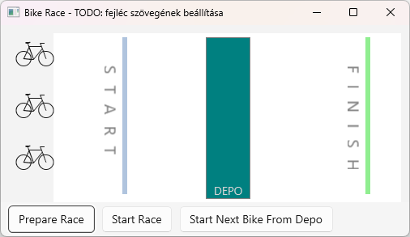
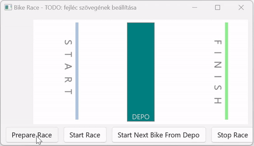

---
search:
  exclude: true
authors: BenceKovari,bzolka
---

# 4. HA - Entwicklung von mehrfädigen Anwendungen 

## Einführung

Die Hausaufgabe baut auf den Vorlesungen der Entwicklung von mehrfädigen Anwendungen auf. Den praktischen Hintergrund für die Aufgaben liefert das [Labor 4 - Erstellung von mehrfädigen Anwendungen](../../labor/4-tobbszalu/index_ger.md). 

Darauf aufbauend können die Aufgaben dieser Hausaufgabe mit Hilfe der kürzeren Leitfäden, die auf die Aufgabenbeschreibung folgen, durchgeführt werden.
Die Hausaufgabe zielt darauf ab, die folgenden Kenntnisse zu vertiefen:

- Starten und Stoppen von Threads, Thread-Funktion
- Signalisieren und Warten auf ein Signal (`ManualResetEvent`, `AutoResetEvent`)
- Implementierung des gegenseitigen Ausschlusses (mit `lock`)
- Zugriff auf WinUI-Oberflächenelemente von Arbeits-Threads aus
- Übung mit Delegaten (`Action<T>`)
- Übung der Gestaltung von Benutzeroberflächen: Verwendung eines Zeitgebers, Manipulation von Oberflächenelementen aus einem Code hinter der Datei (nicht im Zusammenhang mit Threading)

Die erforderliche Entwicklungsumgebung ist die übliche, [hier](../fejlesztokornyezet/index_ger.md) beschriebene (das in der Beschreibung enthaltene Windows App SDK ist ebenfalls erforderlich).

!!! warning "Laufen der Vorabprüfung"
    Für diese Aufgabe gibt es keine inhaltliche Vorabprüfung: Nach jedem Push wird zwar eine Prüfung ausgeführt, diese kontrolliert jedoch nur, ob die Datei `neptun.txt` ausgefüllt ist. Die eigentliche Bewertung erfolgt nach Ablauf der Frist durch die Übungsleiter.

## Das Verfahren der Eingabe

- Der grundlegende Ablauf ist derselbe wie zuvor. Erstelle mit GitHub Classroom ein eigenes Repository. Die Einladungs-URL findest du in Moodle (bei Hausaufgabe 4.). Klone das so erstellte Repository. Dieses enthält die erwartete Struktur der Lösung. Nach der Fertigstellung der Aufgaben committe und pushe deine Lösung.
- Schreibe deinen Neptun-Code in die Datei „neptun.txt“!
- Öffne `MultiThreadedApp.sln` aus den geklonten Dateien und arbeite in diesem.
- :exclamation: Die Aufgaben verlangen, dass du **Screenshots** von bestimmten Teilen deiner Lösung erstellst, um zu belegen, dass du sie selbst angefertigt hast. **Der erwartete Inhalt der Screenshots wird in jeder Aufgabe genau angegeben.** Die Screenshots müssen als Teil der Lösung eingegeben werden. Lege sie im Stammverzeichnis deines Repositorys ab (neben der Datei `neptun.txt`). Dadurch werden die Screenshots zusammen mit dem Inhalt des Git-Repositorys auf GitHub hochgeladen. Da das Repository privat ist, können es außer den Lehrkräfte keine anderen Personen sehen. Falls Inhalte auf den Screenshots erscheinen, die du nicht hochladen möchtest, kannst du diese unkenntlich machen.

## Aufgabe 0 - Überblick über die Aufgabe, Kennenlernen des Ausgangsrahmens

Die Aufgabe besteht darin, eine Anwendung zu erstellen, die ein Fahrradrennen simuliert. Der Grundstein der Implementierung ist die **Trennung von Anwendungslogik und Darstellung**: Die Anwendungslogik darf in keiner Weise von der Darstellung abhängen, und die Darstellung hängt von der Anwendungslogik ab (was auch sinnvoll ist, da sie ihren aktuellen Zustand anzeigt).

Der ursprüngliche Rahmen enthält bereits einige Anwendungs- und Visualisierungslogik. Starten wir die Anwendung und sehen wir uns die Benutzeroberfläche an:



- Oben im Fenster befindet sich die Rennstrecke. Auf der linken Seite sind die Fahrräder aufgereiht, dann sieht man die Startlinie, eine Zwischenstation (Depot) in der Mitte der Strecke und die Ziellinie.
- Am unteren Rand des Fensters befinden sich Tasten zur Steuerung des Rennens. Es ist noch keine Logik mit ihnen verbunden, das folgende Verhalten wird später implementiert:
    - `Prepare Race`: Vorbereitungen für das Rennen (Erstellen und Aufstellung der Fahrräder an der Startlinie).
    - `Start Race`: Der Start des Rennens, bei dem die Fahrräder zum Depot wettlaufen und dort warten.
    - `Start Next Bike From Depo`: Sie startet eines der im Depot wartenden Fahrräder (das bis zur Ziellinie fährt). Die Taste kann mehrmals gedrückt werden, wobei jedes Mal ein Fahrrad freigegeben wird.

Das nachstehende animierte Bild veranschaulicht, was wir mit dieser Lösung erreichen möchten:



Das Grundprinzip des Spieles/der Simulation sieht wie folgt aus (aber es ist noch nicht implementiert):

- Jedes Fahrrad hat ein eigener Thread.
- Das Spiel/die Simulation ist in Iterationen unterteilt: In jeder Iteration bewegt sich der mit dem Fahrrad verbundene Faden (sofern er nicht auf den Start des Rennens wartet oder sich im Depot befindet) mit einem zufälligen Zahlenwert entlang der Strecke vorwärts, bis er die Ziellinie erreicht.

Eine zusätzliche Funktion wurde implementiert (die funktioniert bereits): Man kann zwischen hellen und dunklen Themes wechseln, falls man die Tastenkombination ++ctrl+t++ drückt.

### Anwendungslogik

Im ursprünglichen Rahmen sind die Klassen der **Anwendungslogik** in einem unvollständigen Zustand implementiert. Die Klassen befinden sich im Ordner/Namensberiech `AppLogic`, sehen wir uns ihren Code an:

- `Bike`: Es stellt ein Fahrrad dar, mit dem Startnummer des Fahrrads, der Position und der Information, ob das Fahrrad das Rennen gewonnen hat. Die Funktion `Step` wird verwendet, um das Fahrrad während des Rennens in zufälligen Schritten zu bewegen.
- `Game`: Die Logik der Spielsteuerung (dies könnte noch weiter aufgeteilt werden, aber wegen der Einfachheit werden wir grundsätzlich in dieser Klasse arbeiten).
    - Definiert die Positionen der einzelnen Streckenelemente, wie Startlinie, Zwischenstopp (Depot) und Ziellinie: die Konstanten `StartLinePosition`, `DepoPosition` und `FinishLinePosition`.
    - Speichert die konkurrierenden Fahrräder (`Bikes` Membervariable).
    - `PrepareRace`-Methode: Vorbereitung auf den Wettbewerb. Zunächst werden drei Fahrräder unter Verwendung der Hilfsfunktion `CreateBike` erstellt. Sie werden auch für die Aufstellung der Fahrräder an der Startlinie verantwortlich sein.
    - `StartBikes`-Methode: Starten des Rennens (wobei die Fahrräder gegeneinander zum Depot wettlaufen und dort warten). Nicht implementiert.
    - `StartNextBikeFromDepo`-Methode: Startet eines der Fahrräder, die im Depot stehen (aber nur eines). Nicht implementiert.

### Darstellung

Im Ausgangsrahmen ist die **Darstellung** relativ gut vorbereitet, aber wir werden daran noch arbeiten.

Die Gestaltung der Oberfläche ist in der Datei `MainWindow.xaml` und basiert auf den folgenden Grundsätzen:

- Für das Grundlayout des Fensters haben wir "konventionell" ein aus zwei Zeilen bestehendes `Grid` verwendet. In der ersten Reihe ist die Rennstrecke mit den Fahrrädern (`*` Zeilenhöhe), und im unteren Teil ist eine `StackPanel` mit den Tasten (`Auto` Zeilenhöhe).
- Für das Streckendesign verwendeten wir `Rectangle` Objekte (Hintergrund, Startlinie, Depot, Ziellinie) und für das Layout der Textelemente (teilweise gedreht) `TextBlock` Objekte.
- Jedes Fahrrad wurde auf eine vertikale `StackPanel` gestellt. Die Fahrräder werden durch ein Objekt `TextBlock` (Schriftart `Webdings`, Buchstabe `b`) dargestellt. Wir hätten auch `FontIcon` verwenden können, aber wir haben uns nur für `TextBlock` entschieden, weil wir es schon einmal gesehen hatten.
- Alle Elemente der Strecke und die `StackPanel`, die die Fahrräder enthalten, wurden in der ersten (technisch gesehen 0.) Zeile von `Grid` platziert. Sie werden in der Reihenfolge gezeichnet, in der sie definiert sind, und an der durch die Ausrichtungen und Ränder festgelegten Position. Wir werden den Rand auch verwenden, um den `TextBlock` der Fahrräder zu positionieren. Eine alternative Lösung wäre gewesen, alle Oberflächenelemente auf einer `Canvas` zu platzieren und die absolute Position und Größe (Left, Top, Width, Height) der Elemente auf dieser Seite festzulegen, anstatt die Ränder zu verwenden.

Werfen wir auch einen Blick auf den `MainWindow.xaml.cs` Code behind-Datei, die mit dem Fenster geliefert wird, seine Hauptelemente sind wie folgt:

- `game` Mitgliedsvariable: Das Spielobjekt `Game` selbst, dessen Status im Hauptfenster angezeigt wird.
- `bikeTextBlocks` Mitgliedsvariable: In dieser Liste werden wir die `TextBlock` Objekte speichern, die die Fahrräder anzeigen. Momentan ist sie leer und wir müssen ihre Wartung behandeln.
- Konstruktor: Setzt die x-Koordinate der Oberflächenelementen Startlinie, Depot und Ziellinie auf der Grundlage der durch `Game` definierten konstanten Werte. Die x-Koordinate wird festgelegt, indem der linke Rand (`Margin`) entsprechend angepasst wird (da diese Elemente in unserem Container linksbündig sind!). Darüber hinaus registriert, mit der Hilfsfunktion `AddKeyboardAcceleratorToChangeTheme`, die Tastenkombination ++ctrl+t++ zum Umschalten zwischen hellen und dunklen Themen.
- `PrepareRaceButton_Click`, `StartRaceButton_Click`, `StartNextFromDepoButton_Click`: Ereignishändler für die drei Tasten.
- `UpdateUI`-Methode: Sie enthält eine Schlüssellogik. Aktualisiert die Benutzeroberfläche entsprechend dem Zustand des Spiels. Es durchläuft alle Fahrräder im Spiel und stellt die x-Position der `TextBlock`, die mit den einzelnen Fahrrädern verbunden sind, basierend auf der Position des Fahrrads ein (indem es den linken Rand entsprechend anpasst). Die Operation `UpdateUI` wird zurzeit nie aufgerufen, so dass die Oberfläche nicht aktualisiert wird.

## Aufgabe 1 - Aktualisierung der Benutzeroberfläche

In diesem Moment wäre es sinnlos, den Zustand des Spiels zu ändern, während es läuft: die drei Fahrräder sind an festen Positionen in die Oberfläche eingebrannt, und die Aktion `UpdateUI` zur Aktualisierung der Oberfläche wird nie aufgerufen. Bevor wir mit der Implementierung der Spiellogik beginnen, müssen wir die Oberflächenlogik so ändern, dass sie den aktuellen Zustand des Spiels kontinuierlich anzeigt.

### Dynamische Verwaltung von Fahrrädern

Das erste Problem: In `MainWindow.xaml` sind die drei `TextBlock` Elementen, die die Fahrräder darstellen, eingebrannt. Unsere Oberfläche wäre also nur fähig, ein Spiel mit genau drei Spielern anzuzeigen. Bereiten wir die Anzeige für eine beliebige Anzahl von Fahrrädern vor.
Entfernen wir zuerst die "eingebrannte" `TextBlock` Definitionen für die drei Fahrräder aus `MainWindow.xaml` (kommentieren wir die drei Zeilen aus). Danach, in der Code-Behind-Datei, im Ereignishandler `PrepareRaceButton_Click`, nach der Vorbereitung des Rennens (Aufruf von `game.PrepareRace()`):

1. Dynamische Erstellung eines entsprechenden `TextBlock`-Objekts für jedes Fahrrad im `game` -Objekt (`game.Bikes` Eigenschaft!). Die Eigenschaften der erstellten `TextBlock` sollten genau die gleichen sein wie die, die wir in der XAML-Datei deaktiviert haben (`FontFamily`, `FontSize`, `Margin`, `Text`)
2. Die erstellten `TextBlock`-Objekte müssen zu den Kindern von `StackPanel` namens `bikesPanel` hinzugefügt werden (die in der XAML-Datei auskommentierten `TextBlock`-Objekte waren Kinder von diesen auch, sehen wir uns das an!), nämlich durch den Aufruf von `bikesPanel.Children.Add`.
3. Nehmen wir die erstellten `TextBlock`-Objekte in die `bikeTextBlocks` Liste auf. Dies ist wichtig - und wir sollten es uns im Code ansehen - weil die Aktualisierungsfunktion der Oberfläche `UpdateUI` nach den zu den Fahrrädern gehörigen `TextBlock`s in der Liste `bikeTextBlocks` sucht (sie paart Fahrräder und `TextBlock`anhand des Array-Index).

Die Änderung in der Funktionsweise der App (aber das ist geplant) besteht darin, dass die Fahrräder nicht beim Start angezeigt werden, sondern erst, wenn es auf die Taste `Prepare Race` geklickt wird.

Versuche die Lösung anhand der oben genannten Punkte selbst zu implementieren, und überprüfe dann, ob sie im Wesentlichen der nachstehenden Lösung entspricht.

??? tip "Lösung"
    
    ```csharp
    foreach (var bike in game.Bikes)
    {
        var bikeTextBlock = new TextBlock()
        {
            Text = "b",
            FontFamily = new FontFamily("Webdings"),
            FontSize = 64,
            Margin = new Thickness(10, 0, 0, 0)
        };

        bikesPanel.Children.Add(bikeTextBlock);
        bikeTextBlocks.Add(bikeTextBlock);
    }
    ```

### Implementierung der Aktualisierung der Oberfläche

Jetzt haben wir genau so viele `TextBlock`, wie es Fahrräder im Objekt `game` gibt. Sogar, können wir die Oberfläche jederzeit (entsprechend dem aktuellen Zustand von `game`) mit `UpdateUI` aktualisieren. Die nächste Kardinalfrage lautet: Wann soll diese Funktion aufgerufen werden, d. h. wann soll die Oberfläche aktualisiert werden? Es stehen mehrere Lösungen zur Auswahl:

- a) Immer, wann sich der Zustand von `Game` ändert.
- b) In bestimmten Intervallen (z. B. alle 100 ms) "kontinuierlich", unter Verwendung eines Zeitgebers.

Im Allgemeinen können beide Lösungen Vor- und Nachteile haben. Option b) ist in mancher Hinsicht einfacher (man muss nicht wissen, wann sich der Zustand von `Game` ändert), aber sie kann auch redundant sein (wenn sich der Zustand zwischen zwei Aktualisierungen nicht geändert hat). Es kann aber auch effizienter sein, wenn sich der Zustand sehr oft ändert und man die Oberfläche nicht bei jeder Änderung aktualisieren möchte, sondern nur einmal in einem bestimmten Intervall (z. B. wenn die Augen es sowieso nicht verfolgen können).
In unserem Fall haben wir uns für die "b)", also die zeitgesteuerte Lösung entschieden, hauptsächlich wegen der Einfachheit.

In einer WinUI 3-Umgebung wird für die Verwaltung periodischer Ereignisse die Verwendung der Klasse `DispatcherTimer` empfohlen (insbesondere, wenn man im Rahmen der zeitgesteuerten Aktion auch auf UI-Elemente zugreifen möchte).

Führen wir in der Klasse `MainWindow` eine Mitgliedsvariable ein:
 
```csharp
    private DispatcherTimer timer;
```

Dann instanziieren wir im Konstruktor den Timer, weisen dem Ereignis `Tick` eine Ereignisbehandlungsfunktion zu (sie wird in einem bestimmten Intervall aufgerufen), setzen das Intervall auf 100 ms (Eigenschaft `Interval`) und starten den Timer:

```csharp
public MainWindow()
{
    ...

    timer = new DispatcherTimer();
    timer.Tick += Timer_Tick;
    timer.Interval = TimeSpan.FromMilliseconds(100);
    timer.Start();
}

private void Timer_Tick(object sender, object e)
{
    UpdateUI();
}
```

 Wie man sehen kann, wird die Oberfläche im Ereignishandler der Timer durch den Aufruf von `UpdateUI` aktualisiert.

Die Frage ist, wie wir unsere Lösung testen können, d.h. wie wir überprüfen können, dass der `Timer_Tick` Ereignishandler tatsächlich alle 100 ms aufgerufen wird. Dazu verfolgen wir vorübergehend die aktuelle Zeit im Ausgabefenster von Visual Studio, die im Ereignishandler entsprechend formatiert wird:

```csharp
private void Timer_Tick(object sender, object e)
{
    System.Diagnostics.Trace.WriteLine($"Time: {DateTime.Now.ToString("hh:mm:ss.fff")}");

    UpdateUI();
}
```

Die Operation `Trace.WriteLine` schreibt eine Zeile in das Visual Studio-Ausgabefenster, und `DateTime.Now` wird verwendet, um die aktuelle Zeit abzurufen. Diese wird durch den Aufruf von `ToString` in das entsprechende Format umgewandelt. Führen wir die Anwendung aus (wichtig: im Debug-Modus, d.h. mit ++f5++ ) und überprüfen wir im Visual Studio-Ausgabefenster, ob tatsächlich alle 100 ms eine neue Zeile angezeigt wird. Wenn alles gut funktioniert, kommentieren wir die Trace-Zeile aus.

!!! note "Genauigkeit von DispatcherTimer"
    Wir können feststellen, dass `DispatcherTimer` nicht besonders genau ist, aber für unsere Zwecke vollkommen ausreicht. Für uns ist es jedoch wichtig, dass sie im UI-Thread aufgerufen wird (das `Tick`-Ereignis wird von diesem Thread ausgelöst), damit wir von unserer Ereignishandler aus auf die UI-Elemente zugreifen können (`Timer_Tick`) .

### Kopfzeile des Hauptfensters

:exclamation: In der Kopfzeile des Hauptfensters sollte "Tour de France" stehen, gefolgt von deinem Neptun-Code: (z.B. falls "ABCDEF" das Neptun-Codes ist, dann "Tour de France - ABCDEF"), ist es wichtig, dass dies der Text ist! Setze dazu die Eigenschaft `Title` des Hauptfensters auf diesen Text in der Datei `MainWindow.xaml`.

## Aufgabe 2 - Vorbereitung des Rennens

Nachdem wir uns mit der Visualisierungslogik befasst haben, wenden wir uns nun der Anwendungslogik und den damit verbundenen Fadenbehanglungsproblemen zu. Dementsprechend werden wir nun hauptsächlich in der Klasse `Game` arbeiten.

Zur Erinnerung: Das Prinzip unserer Lösung wird:

- Für jedes Fahrrad wird ein eigener Thread erstellt.
- Das Spiel/die Simulation ist in Iterationen unterteilt: In jeder Iteration bewegt sich der mit dem Fahrrad verbundene Faden (sofern er nicht auf den Start des Rennens wartet oder sich im Depot befindet) mit einem zufälligen Zahlenwert entlang der Strecke vorwärts, bis er die Ziellinie erreicht.

Erstellen wir die Rahmen anhand der folgenden Schritte::

1. Am Ende der Funktion `CreateBike` der Klasse `Game` starten wir einen Thread für das Fahrrad.
2. Die Thread-Funktion sollte sich in der Klasse `Game` befinden.
3. Die Thread-Funktion bekommt das Fahrradobjekt als Parameter von `CreateBike`, das von dem angegebenen Thread bewegt werden soll.
4. Laufende Threads sollten das Schließen der Anwendung nicht blockieren (d. h., wenn das Hauptfenster geschlossen wird, aber noch laufende Threads vorhanden sind, sollte der Prozess sofort beendet werden, ohne auf diese Threads zu warten)
5. Die Implementierung der Thread-Funktion sollte zunächst folgende Punkte abdecken.
   
    In einem Zyklus, in jeder Iteration:
       
       - das Fahrrad mit einem zufälligen Schritt treten (Aufruf der Funktion `Step` der Klasse `Bike`),
       - dann soll den Faden für 100 ms schlafen lassen.
    
    All diese Bewegungen sollten fortgesetzt werden, bis das Fahrrad die Startlinie erreicht (seine Position erreicht den Wert, der durch die Mitgliedsvariable `StartLinePosition` definiert ist).

Versuche die oben genannten Aufgaben auf der Grundlage des in der Vorlesung und im Labor Gelernten selbständig zu lösen. Du kannst deine Lösung durch Debugging testen, oder, da die Oberflächenlogik bereits implementiert wurde, durh das Ausführen der Anwendung und Klicken auf `Prepare Race`: Die Fahrräder sollten dann stufenweise zur Startlinie rollen.

Zu diesen Schritten geben wir noch eine Lösung an (aber du lernst jedoch viel mehr, wenn du es selbst versuchst zu lösen und benutzt die Lösung daher nur zur Überprüfung):

??? tip "Lösung"
    In der Klasse `Game` ist die Thread-Funktion:

    ```csharp
    void BikeThreadFunction(object bikeAsObject)
    {
        Bike bike = (Bike)bikeAsObject;
        while (bike.Position <= StartLinePosition)
        {
            bike.Step();

            Thread.Sleep(100);
        }
    }
    ```

    Wie man sehen kann, haben wir uns bei den Thread-Funktionen für die Option mit "Objektparameter" anstelle der Option "ohne Parameter" entschieden, da der Thread-Funktion das Fahrrad, das sie bewegt, übergeben werden muss.

    Starten des Threads am Ende der Funktion `CreateBike`:

    ```csharp
    private void CreateBike()
    {
        ...

        var thread = new Thread(BikeThreadFunction);
        thread.IsBackground = true; // Der Thread darf das Beenden des Prozesses nicht blockieren
        thread.Start(bike); // Übergabe des Fahrrads als Parameter an die Thread-Funktion
    }
    ```

!!! example "EINGABE"
    Bevor du mit der nächsten Aufgabe fortfährst, musst du einen Screenshot machen.

    Erstelle einen Screenshot mit dem Namen `Task2.png` entsprechend den Folgenden:

    - Starte die Anwendung. Verkleinere sie gegebenenfalls, damit sie nicht zu viel Platz auf dem Bildschirm einnimmt,
    - im "Hintergrund" sollte Visual Studio mit `Game.cs` geöffnet sein,
    - Zoome in VS so hinein, dass die Funktionen `CreateBike` und `BikeThreadFunction` der Klasse `Game` sichtbar sind, wobei das Fenster deiner Anwendung im Vordergrund ist.
    - Stelle den Ausschnitt so ein, dass der Screenshot nur die relevanten Bereiche enthält (z. B. NICHT: VS Solution Explorer, die unteren und seitlichen Panels für Debugging oder die Windows-Taskleiste).

## Aufgabe 3 - Start des Rennens

Verwirkliche den Start des Rennens an der Startlinie und die Durchführung des Rennens bis zur Ankunft der Fahrräder im Depot entsprechend den folgenden Richtlinien:

- Das Rennen sollte durch die Funktion `StartBikes` in der Klasse `Game` gestartet werden, die bereits beim Anklicken der Taste `Start Race` aufgerufen wurde.
- Es ist wichtig, dass in der `StartBikes`-Methode keine neuen Threads gestartet werden, sondern dass die vorhandenen Threads warten können und dann weiterlaufen, wenn die Funktion `StartBikes` aufgerufen wird.
- Wenn der Benutzer die Taste `Start Race` drückt, bevor die Fahrräder die Startlinie erreichen, müssen die Fahrräder nicht an der Startlinie anhalten (es ist jedoch völlig in Ordnung, wenn die Taste in solchen Fällen von der Anwendung ignoriert wird).
- Die Fahrräder sollten sich bis zum Depot bewegen (bis ihre Position den durch die Membervariable `DepoPosition` definierten Wert erreicht).
- Arbeite in der Klasse `Game`.

!!! tip "Tipp für die Lösung"
    Da die Teilnehmer nach dem Warten gleichzeitig starten müssen, empfiehlt es sich, ein Objekt `ManualResetEvent` zu verwenden, um das Warten und Starten zu implementieren.


!!! example "EINGABE"
    Bevor du mit der nächsten Aufgabe fortfährst, musst du einen Screenshot machen.

    Erstelle einen Screenshot mit dem Namen `Task3.png` entsprechend den Folgenden:

    - Starte die Anwendung. Verkleinere sie gegebenenfalls, damit sie nicht zu viel Platz auf dem Bildschirm einnimmt,
    - im "Hintergrund" sollte Visual Studio mit `Game.cs` geöffnet sein,
    - Zoome in VS so hinein, dass die Funktion `BikeThreadFunction` der Klasse `Game` sichtbar sind, wobei das Fenster deiner Anwendung im Vordergrund ist.
    - Stelle den Ausschnitt so ein, dass der Screenshot nur die relevanten Bereiche enthält (z. B. NICHT: VS Solution Explorer, die unteren und seitlichen Panels für Debugging oder die Windows-Taskleiste).


## Aufgabe 4 - Starten der Fahrräder vom Depot

Verwirkliche das Starten der Rennfahrer aus der Depot und das Rennen, bis die Fahrräder das Ziel erreichen, entsprechend den folgenden Richtlinien:

- Jeder Teilnehmer wird vom Depot aus durch die Funktion `StartNextBikeFromDepo` der Klasse `Game` gestartet, die bereits beim Anklicken der Taste `Start Next Bike From Depo` aufgerufen wurde.
- Bei jedem Tastendruck darf nur ein Fahrer das Depot verlassen.
- Es ist wichtig, dass in der `StartNextBikeFromDepo`-Methode keine neuen Threads gestartet werden, sondern dass die vorhandenen Threads warten können und dann weiterlaufen, wenn die Funktion `StartNextBikeFromDepo` aufgerufen wird.
- Wenn der Benutzer die Taste `Start Next Bike From Depo` drückt, bevor die Fahrräder das Depot erreichen, kann ein Fahrrad das Depot verlassen, wenn es ankommt (es ist aber auch völlig in Ordnung, wenn die Anwendung in diesem Fall das Drücken der Taste ignoriert).
- Die Fahrräder sollten bis zur Ziellinie fahren (bis ihre Position den durch die Mitgliedsvariable `FinishLinePosition` definierten Wert erreicht). Wenn ein Fahrrad die Ziellinie erreicht, sollte der mit dem Fahrrad verbundene Faden sein Laufen beenden.
- Arbeite in der Klasse `Game`.

!!! tip "Hinweis zur Lösung"
    Die Lösung ist analog zur vorherigen, aber dieses Mal muss man anstelle von `ManualResetEvent` ein anderes, aber ähnliches Objekt verwenden...

!!! example "EINGABE"
    Bevor du mit der nächsten Aufgabe fortfährst, musst du einen Screenshot machen.

    Erstelle einen Screenshot mit dem Namen `Task4.png` entsprechend den Folgenden:

    - Starte die Anwendung. Verkleinere sie gegebenenfalls, damit sie nicht zu viel Platz auf dem Bildschirm einnimmt,
    - im "Hintergrund" sollte Visual Studio mit `Game.cs` geöffnet sein,
    - Zoome in VS so hinein, dass die Funktion `BikeThreadFunction` der Klasse `Game` sichtbar sind, wobei das Fenster deiner Anwendung im Vordergrund ist.
    - Stelle den Ausschnitt so ein, dass der Screenshot nur die relevanten Bereiche enthält (z. B. NICHT: VS Solution Explorer, die unteren und seitlichen Panels für Debugging oder die Windows-Taskleiste).


## Aufgabe 5 - Verwirklichen des Gewinnerfahrrads

Implementiere die Logik zur Bestimmung und Darstellung des Gewinnerfahrrads entsprechend den folgenden Richtlinien:

- Der Gewinner ist der Fahrrad, der als Erster die Ziellinie erreicht (der Erste, dessen Position den durch die Mitgliedsvariable `FinishLinePosition` definierten Wert erreicht).
- Nutze in der Lösung die Tatsache, dass die Klasse `Bike` bereits über eine Variable `isWinner` verfügt, deren Wert zunächst falsch ist und mit `SetAsWinner` auf true gesetzt werden kann und deren Wert mit der Eigenschaft `IsWinner` abgefragt werden kann.
- Die Entscheidung, ob das gegebene Fahrrad der Gewinner ist, ist die Aufgabe der Thread-Funktion für das Fahrrad in der Klasse `Game`, lege die Entscheidungslogik hier.
- :exclamation: Es ist sehr wichtig, dass genau ein Gewinner sein kann. Wenn mehr als ein Fahrrad als Gewinner markiert wird (d.h. die Funktion `SetAsWinner` der Klasse `Bike` wird für mehr als ein Fahrrad aufgerufen), ist dies ein sehr schwerer Fehler!
- Arbeite in der Klasse `Game`.

Bevor wir die Logik implementieren, werden wir die Anzeige ein wenig optimieren, um das Gewinnerfahrrad von den anderen auf der Benutzeroberfläche zu unterscheiden. Füge dazu eine kleine zusätzliche Logik in die Funktion `UpdateUI` der Klasse `MainWindow` ein: Wenn das angegebene Fahrrad ein Gewinner ist, ändern wir seine Anzeige in eine Trophäe. Dazu soll der Text des zu dem Fahrrad gehörenden `TextBlock`s Text auf "%" gesetzt werden:

```csharp
private void UpdateUI()
{
    for (int i = 0; i < game.Bikes.Count;i++)
    {
        ...

        if (bike.IsWinner)
            tbBike.Text = "%";
    }
}
```

Verwirkclihe die Logik danach selbständig gemäß den folgenden Richtlinien und Tipps.

!!! tip "Richtlinien und Tipps für die Lösung"

    - Um festzustellen, ob es einen Gewinner gibt, führe in der Klasse `Game` eine Hilfsvariable `bool hasWinner` ein (um anzuzeigen, ob schon ein Gewinner ermittelt wurde).
    - Die Vorlesung enthielt ein sehr ähnliches Beispiel zum Thema "Verwendung von lock" mit einer ausführlichen Erklärung.
    - Die Lösung sollte auch gut funktionieren (es kann nur einen Gewinner geben), wenn man zwischen der `hasWinner`-Bedingungsprüfung und der `hasWinner`-Wahrheitsaussage eine längere künstliche Verzögerung einfügt, die simuliert, dass der Thread hier "unglücklicherweise" sein Ausführungsrecht verliert, und die Fahrräder "sofort" aus dem Depot freigegeben werden (d.h. sie kommen fast gleichzeitig im Ziel an). 
    - Für die Dauer des Tests füge hier (zwischen der Bedingungsprüfung und Einstellung von `hasWinner`) eine Zeile `Thread.Sleep(2000)` ein, die du nach dem Test auskommentierst. Teste das natürlich so, dass du die Fahrräder mit den Tastenklicks möglichst gleichzeitig aus dem Depot weiterfahren lässt, damit sie ungefähr gleichzeitig das Ziel erreichen. Wenn es mehr als einen Gewinner gibt, (weil deine Lösung fehlerhaft ist) werden mehrere Fahrräder im Ziel zu Trophäen!

!!! example "EINGABE"
    Bevor du mit der nächsten Aufgabe fortfährst, musst du einen Screenshot machen.

    Erstelle einen Screenshot mit dem Namen `Task5.png` entsprechend den Folgenden:

    - Starte die Anwendung. Verkleinere sie gegebenenfalls, damit sie nicht zu viel Platz auf dem Bildschirm einnimmt,
    - im "Hintergrund" sollte Visual Studio mit `Game.cs` geöffnet sein,
    - Zoome in VS so hinein, dass die Funktion `BikeThreadFunction` der Klasse `Game` sichtbar sind, wobei das Fenster deiner Anwendung im Vordergrund ist.
    - Stelle den Ausschnitt so ein, dass der Screenshot nur die relevanten Bereiche enthält (z. B. NICHT: VS Solution Explorer, die unteren und seitlichen Panels für Debugging oder die Windows-Taskleiste).

## Aufgabe 6 - Gegenseitiger Ausschluss und volatile

In der vorigen Aufgabe haben wir gesehen, dass wir die Abfrage und Einstellung von `hasWinner` "unteilbar", "atomar" machen mussten, d.h. wir mussten den gegenseitigen Ausschluss implementieren. Es stellt sich die Frage, ob es bereits eine andere Logik in der Anwendung gibt, in der dies zur Gewährleistung der Konsistenz hätte getan werden müssen. Dazu müssen wir uns ansehen, welche Variablen von mehreren Threads geschrieben werden (oder von einem geschrieben und von einem anderen gelesen werden). Betroffen sind die Folgenden:

- Die Mitgliedsvariable `position` der Klasse `Bike`. Diese wird von den Fadenfunktionen der Fahrräder mit dem Operator `+=` geändert und vom Hauptthread mit der Eigenschaft `Position` während der Anzeige gelesen. Es stellt sich die Frage, ob es zu Inkonsistenzen führen kann (denn wenn ja, sollte der gegenseitige Ausschluss implementiert werden, z. B. mit Hilfe von `lock` ). Dies erfordert ein tieferes Nachdenken. Das Lesen und Schreiben von Variablen des Typs `int` (einfacher `=`-Operator) ist atomar, also wäre das in Ordnung. Nur dass wir hier `+=` für die Änderung verwenden, nicht `=`.  Der Operator `+=` ist nicht atomar, sondern besteht aus mehreren Schritten: Lesen einer Variablen, Inkrementieren und anschließendes Neuschreiben (wenn es nicht ganz klar ist, warum und welches Problem dabei auftreten könnte, schau dir auf jeden Fall die entsprechende Vorlesungsfolie an). Wenn also mehrere Threads den `+=` Operator "gleichzeitig" auf dieselbe Variable verwenden, kann es zu einer Inkonsistenz kommen. Aber seien wir nicht voreilig, denken wir darüber nach: In unserem Fall ruft jeweils ein Thread `+=` auf, der andere Thread liest nur `position`.  Dies kann keine Inkonsistenz sein, da es einfach darum geht, dass der lesende Thread entweder den Pre-Increment-Wert vor dem Lesen oder den Post-Increment-Wert nach dem Lesen erhält (wenn er fast genau zur gleichen Zeit liest wie der andere Thread, der den `+=` Operator ausführt). Wir können also sagen, dass es in diesem Zusammenhang keine Notwendigkeit gibt, den gegenseitigen Ausschluss zu implementieren.
- Die Mitgliedsvariable `isWinner` der Klasse `Bike`. Diese wird von der Fadenfunktion der Fahrräder durch den Aufruf von `SetAsWinner` geändert, und vom Hauptthread über die Eigenschaft `IsWinner` während der Anzeige gelesen. Ihr Typ ist `bool`, dessen Lesen und Schreiben atomar sind, so dass kein gegenseitiger Ausschluss implementiert werden muss.
- Die Mitgliedsvariable `hasWinner` der Klasse `Game`. Sie ist vom Typ bool, dessen Lesen und Schreiben atomar ist, so dass ein gegenseitiger Ausschluss nicht erforderlich ist. Aber wir hatten eine zusätzliche Bedingung: Es konnte nur ein Gewinner der Wettbewerb sein, also mussten wir den gegenseitigen Ausschluss noch implementieren (was wir in der vorherigen Aufgabe getan haben).

Man könnte sagen, dass für die drei oben genannten Variablen alles in Ordnung ist, aber das ist nicht der Fall. **Wenn der Wert einer Variablen von einem Thread geändert wird, kann der Wert der Variablen vom System zwischengespeichert werden (z. B. in einem Register), so dass der andere Thread auch nach der Änderung den vorherigen Wert sieht**. Um dies zu verhindern, sollten diese Variablen mit dem Schlüsselwort `volatile` als flüchtig definiert werden, was garantiert, dass die Variable nach einer Änderung in den Speicher geschrieben wird und der andere Thread einen neuen Wert liest (die Funktionsweise von `volatile` ist etwas komplexer und wird in der Vorlesung genauer erklärt). Wichtiger Hinweis: `volatile` muss nicht verwendet werden, wenn die Variable aus dem Block `lock` geschrieben und gelesen oder mit der Klasse `Interlocked` geändert wird. Aus diesem Grund sollte sie nur für `position` und `isWinner` eingeführt werden:

```csharp
class Bike
{
    private volatile int position = 65;
    private volatile bool isWinner;
```

## Aufgabe 7 - Loggen von Schritten (nicht fadensichere .NET-Klassen)

Implementiere das Loggen jeder Schritt, den die Fahrräder während des Rennens gemacht haben, in der Klasse `Game` in einer Variablen des Typs `List<int>` (gemeinsam für alle Fahrräder). Mit den geloggten Werten muss nichts weiter geschehen (z. B. müssen sie nicht angezeigt werden). Die Lösung sollte sich die Tatsache ausnutzen, dass die Operation `Step` der Klasse `Bike` den gemachten Schritt in Form einer Variablen `int` zurückgibt, die geloggt werden sollte (einfach in die Liste einfügen).

??? tip "Tipp für die Lösung"
    Da die Klasse `List<T>` nicht fadensicher ist und wir von mehreren Threads aus auf sie schreiben, müssen wir den gegenseitigen Ausschluss während des Zugriffs mit der Anweisung `lock` implementieren.

!!! Note "Sammlungsklassen des Namensraums System.Collections.Concurrent"
    Wenn wir statt `List<T>` in ein Objekt einer Klasse der Namensraum `System.Collections.Concurrent`, der den Zweck entspricht, (z. B. `ConcurrentQueue`) geloggt würden, wäre es nicht erforderlich, den gegenseitigen Ausschluss zu implementieren, da dieser Namensraum fadensichere Sammlungsklassen enthält.

## Aufgabe 8 - Aktualisierung der Oberfläche für jede Änderung (Zugriff auf Elemente der Benutzeroberfläche aus den Arbeitsfäden)

Bei unserer derzeitigen Lösung wird die Oberfläche in bestimmten Zeitabständen mit Hilfe eines Zeitgebers aktualisiert. Diese Lösung wird jetzt ersetzt. Verändere die Lösung so, dass die Oberfläche  in jedem Fall sofort aktualisiert wird, wenn sich der Zustand von `Game` ändert (und verwende die zeitgesteuerte Aktualisierung nicht mehr).

Im nächsten Kapitel werden die möglichen Lösungen kurz vorgestellt, und wir werden eine davon auswählen, aber versuche zuerst selbst zu überdenken, welche Lösung dafür sinnvoll ist. Es ist entscheidend, dass nur eine Lösung akzeptiert werden kann, die keine Abhängigkeit der Anwendungslogik (Klasse `Game`) von der Benutzeroberfläche mit sich bringt. Erinnern wir uns an unser Grundprinzip, dass die Anwendungslogik auf keiner Ebene von der Oberflächenlogik abhängen sollte!

### Implementierung der Oberflächenmeldung

Alternativen:

1. Wir können das Observer-Entwurfsmuster anwenden. Wir werden später im Semester mehr darüber erfahren, obwohl es erwähnenswert ist, dass C#-Ereignisse auch auf den grundlegenden Konzepten des Observer-Musters basieren.
2. Eine offensichtliche Lösung wäre die Einführung eines C#-Ereignisses (z. B. `BikeStateChanged`), das von der Klasse `Game` ausgelöst wird, wenn sich der Zustand eines Fahrrads ändert, wobei das Fahrradobjekt als Parameter übergeben wird. Das wäre eine umfassende, allgemeine Lösung: Jede Klasse könnte sich jederzeit für das Ereignis anmelden. Dazu müssten wir – wenn wir den Empfehlungen von Microsoft folgen wollen – eine von `EventArgs` abgeleitete Klasse (Ereignisparameter) einführen und einen neuen Delegatentyp einführen (oder wir könnten den eingebauten generischen Delegatentyp `EventHandler<TEventArgs>` verwenden).
3. Die im vorigen Abschnitt erwähnte C#-Ereignis-basierte Lösung wäre völlig "korrekt", aber wir wollen nicht unbedingt zulassen, dass jede Klasse auf das Zustandsänderungsereignis zu jeder Zeit abonnieren kann. Aus diesem Grund können (und werden) wir eine "gezieltere" Lösung in Betracht nehmen. Diese Methode verwendet zwar einen Delegaten, führt aber kein `event`-Ereignis ein und bietet im Grunde eine Benachrichtigung/einen Rückruf nur für ein Objekt (für `MainWindow`, da es seine Oberfläche aktualisieren muss, wenn sich der Zustand eines Fahrrads ändert). Die Elemente dieses Ansatzes sind:
  
    - Klasse `Game` als "Anmelder":
        - Die Funktion (Delegatenobjekt), die von der Klasse `Game` aufgerufen wird, wenn sich der Zustand der Fahrräder ändert (Benachrichtigung/Rückruf), wird von der Klasse `Game` als Parameter der Operation `PrepareRace` empfangen und in einer Mitgliedsvariablen gespeichert.
        - Der Typ dieses Parameters und der Mitgliedsvariablen sollte `Action<Bike>` sein (wir haben bereits die Typen `Action` und `Action<T>` kennengelernt).
        - Wenn sich der Zustand eines Fahrrads (seine Position oder sein "Gewinner"-Zustand in der Thread-Funktion) ändert, ruft die Klasse `Game` diese in der Membervariable gespeicherte Funktion auf (aber nur, wenn sie nicht null ist, d. h. diese Funktion bereits gesetzt wurde, oder `?.Invoke` kann auch verwendet werden) und übergibt das geänderte Fahrradobjekt als Parameter. Dabei wird der Abonnent benachrichtigt.
    - `MainWindow` als "Abonnent":
        - In der Klasse `MainWindow` muss eine Funktion `UpdateBikeUI(Bike bike)` eingeführt und beim Aufruf von `Game.PrepareRace` als Parameter (Delegatenobjekt) übergeben werden. In dieser Funktion `UpdateBikeUI` muss sichergestellt werden, dass das zum als Parameter übergebenen Fahrrad-Objekt gehörende Oberflächenelement (`TextBlock`) aktualisiert wird.
        - Im vorangegangenen Abschnitt wurde deutlich, warum wir einen Delegaten des Typs `Action<Bike>` und nicht `Action` verwendet haben: `Game` kann so während der Benachrichtigung/des Rückrufs angeben, welches Fahrrad sich geändert hat, und die zurückgerufene/registrierte Funktion (in unserem Fall `MainWindow.UpdateBikeUI`) wird dies als Parameter erhalten und kann ihre Darstellung aktualisieren (basierend auf dem Zustand des empfangenen Fahrrads).
    - Kommentiere das Starten des Timers (im Konstruktor von `MainWindow` die Aufruf `timer.Start()`) aus, da die Oberflächenaktualisierung bereits durch die obige `Action<Bike>` basierte Benachrichtigung/Rückruf behandelt wird.

Verwirkliche die in Punkt 3 oben beschriebene Benachrichtigung! Die Implementierung von `MainWindow.UpdateBikeUI` wird als Hinweis gegeben (die Idee ist, dass `TextBlock` auf der Grundlage des im Parameter angegebenen `Bike` aktualisiert wird):

```csharp
private void UpdateBikeUI(Bike bike)
{
    // UpdateBikeUI kann so früh aufgerufen werden, dass die bikeTextBlocks noch nicht geladen ist.  
    // In diesem Fall können wir die Oberfläche nicht aktualisieren, also bitte zurückkehren.
    if (bikeTextBlocks.Count != game.Bikes.Count)
        return;

    int marginAdjustmentForWheel = 8;

    // Suche nach dem zu dem Fahrrad gehörenden TextBlock (basierend auf demselben Blockindex).
    var tbBike = bikeTextBlocks[game.Bikes.IndexOf(bike)];
    
    // Legen wir die Position des Fahrrads noch nicht fest, wenn seine Größe während des Layouts nicht 
    // festgelegt wurde (sonst würde das Fahrrad springen, weil unten bei der Einstellung des Randes 
    // mit einem "ungültigen" Breitenwert von 0 rechnen würde.
    if (tbBike.ActualWidth == 0)
        return;

    // Der Punkt 0,0 des Fensters ist der Ursprung, und die Start-/Depot-/Ziellinie wird im Vergleich zu dieser Ursprung gesehen.
    // Am rechten Rand der Taste befindet sich das Rad, aber es muss auf die linke Seite der Taste verschoben werden: 
    // ActualWidth muss subtrahiert werden.
    tbBike.Margin = new Thickness(bike.Position - tbBike.ActualWidth + marginAdjustmentForWheel, 0, 0, 0);

    if (bike.IsWinner)
        tbBike.Text = "%"; // display a cup
}
```

!!! danger "Wichtig"
    Auch wenn die oben genannten Schritte/Grundsätze korrekt befolgt werden, ist es möglich, dass eine Lösung noch nicht betriebsbereit ist. Wenn wir das Rennen starten, wird in der Funktion `UpdateBikeUI` beim Zugriff auf `TextBlock` für das Fahrrad die folgende Ausnahme ausgelöst: `System.Runtime.InteropServices.COMException: 'The application called an interface that was marshalled for a different thread. (0x8001010E (RPC_E_WRONG_THREAD))`

Was ist der Grund für diesen Fehler? Bevor du die folgende Erinnerung öffnest, versuche selbst herauszufinden, basierend auf dem, was du in der Vorlesung/im Labor gelernt hast.

??? tip "Erinnerung"
    **Auf eine WinUI-Oberflächenelement/einen WinUI-Controller kann nur von dem Thread aus zugegriffen werden, der das Oberflächenelement erstellt hat, da diese Oberflächenelement nicht fadensicher sind und eine Ausnahme auslösen, wenn wir versuchen, sie "falsch" zu verwenden**.

Die Lösung wird in der nächsten Teilaufgabe ausgearbeitet.

### Verwendung von DispatcherQueue

In unserem Fall besteht das Problem darin, dass bei einer Änderung des Zustands von `Game`, wird der Delegat für die Änderungsbenachrichtigung in der Klasse `Game` in den mit den Fahrräder verbundenen Arbeitsthreads aufgerufen. So die registrierte Handlerfunktion `MainWindow.UpdateBikeUI` wird auch in diesen Threads aufgerufen. Die Funktion `UpdateBikeUI` wird für den Zugriff auf die Oberflächenelemente verwendet (`TextBlock` für Fahrrad). Diese Oberflächenelemente werden jedoch vom Hauptfaden aus erstellt: Sie sind also nur vom Hauptfaden aus erreichbar.

:exclamation: Die Lösung für dieses Problem ist die Verwendung von `DispatcherQueue`, die es uns **ermöglicht, den Aufruf von den Arbeitsthreads auf den Hauptthread "umzuleiten", von dem aus wir auf die Steuerelemente zugreifen können**. Die Verwendung von `DispacherQueue` wurde in der Vorlesung und im dazugehörigen Labor auch ausführlich erläutert.

Aufgabe: Ändere die Funktion `MainWindow.UpdateBikeUI` so, dass `DispacherQueue` verwendet wird, um auf die Oberflächenelemente vom richtigen Thread aus zuzugreifen (und somit die aktuelle Ausnahme zu vermeiden).

!!! example "EINGABE"
    Bevor du mit der nächsten Aufgabe fortfährst, musst du einen Screenshot machen.

    Erstelle einen Screenshot mit dem Namen `Task8.png` entsprechend den Folgenden:

    - Starte die Anwendung. Verkleinere sie gegebenenfalls, damit sie nicht zu viel Platz auf dem Bildschirm einnimmt,
    - im "Hintergrund" sollte Visual Studio mit `MainWindow.xaml.cs` geöffnet sein,
    - Zoome in VS so hinein, dass die Funktion `UpdateBikeUI` der Klasse `MainWindow` sichtbar sind, wobei das Fenster deiner Anwendung im Vordergrund ist.
    - Stelle den Ausschnitt so ein, dass der Screenshot nur die relevanten Bereiche enthält (z. B. NICHT: VS Solution Explorer, die unteren und seitlichen Panels für Debugging oder die Windows-Taskleiste).


!!! warning "Verwirklichung eines ähnlichen Spiels in der Praxis"
    Es ist wichtig zu bemerken, dass wir normalerweise keine Threads starten, um ein ähnliches "Spiel" zu implementieren: ein Timer für das Steppen der Fahrräder wäre praktischer, weil das ganze Spiel einfadig bleiben könnte und wir viele der Schwierigkeiten vermeiden könnten, die durch Mehrfädigkeit entstehen (im Rahmen dieser Hausaufgabe war unser Ziel natürlich, Mehrfädigkeit zu üben).

## Optionale Aufgabe - für 2 IMSc-Punkte

### Aufgabe

Ermögliche das Anhalten von Fahrrädern mit einem Mausklick:

- Platziere eine Taste mit der Aufschrift *Stop Race* rechts neben den anderen.
- Das Klicken auf die Taste *Stop Race* soll alle Fahrräder anhalten und auch die Threads stoppen, die die Fahrräder steuern. Füge dazu der Klasse `Game` eine öffentliche Funktion `StopRace` hinzu.
- Das Rennen kann gestoppt werden, noch bevor es beginnt.
- Die Funktion `StopRace` soll warten, bis alle Threads tatsächlich beendet sind, nachdem die Threads angehalten wurden.
- Nachdem das Rennen gestoppt wurde (Klick auf *Stop Race*), konnte keine der Tasten angeklickt werden (alle Tasten sollten deaktiviert sein, die Eigenschaft `IsEnabled` sollte auf false gesetzt werden).

### Lösung

Hier sind einige wichtige Elemente der Lösung des Problems:

- Lege eine Taste *Stop Race* auf die Oberfläche, erstelle eine Handler-Funktion dafür, und rufe von dieser aus die neu einzuführende Funktion `Game.StopRace` auf.
- Zum Anhalten ist ein Signal an den Thread erforderlich, der die Fahrräder laufen lässt. Dies sollte eine Variable vom Typ `bool` sein, die von der Schleife des Threads, der die Fahrräder ausführt, überwacht wird. Nehme dies als `raceEnded` auf und ändere die Thread-Funktion so, dass der Thread aufhört zu laufen (zurückkehrt), wenn dies wahr ist.
- Die soeben eingeführte bool-Variable allein wird nicht ausreichen. Denn wenn das Fahrrad an der Startlinie oder im Depot wartet, ist sein Thread blockiert (er wartet auf ein Ereignissignal) und kann die bool-Variable `raceEnded` nicht überprüfen. Aus diesem Grund muss eine neue Variable vom Typ `ManualResetEvent` eingeführt werden, die das Ereignis des Herunterfahrens anzeigt (und auf die gewartet werden kann).
- Dieses Ereignis muss beim Klicken auf die Taste *Stop Race* (in `Game.StopRace`) zusammen mit der Variablen `bool` auf "markiert" gesetzt werden.
- Kommentiere (nicht löschen!) in der Thread-Funktion, die die Fahrräder bewegt, die Codefragmente aus, die das bisherige Warten implementieren, und erstelle eine neue Lösung unter Verwendung von `ManualResetEvent`, um den soeben aufgezeichneten Halt anzuzeigen. Der Wartezustand muss jedoch auch dann verlassen werden, wenn das Ereignis `ManualResetEvent`, das das Herunterfahren anzeigt, ausgelöst wird.
- Wenn ein Stop aufgetreten ist, muss der Thread beendet werden (Beenden der Thread-Funktion, z.B. mit einer `return`-Anweisung).
- Bei der Operation `Game.StopRace` muss nach der Signalisierung der Threads solange gewartet werden, bis die Threads tatsächlich beendet werden. Dazu soll `Join()` für die mit jedem Fahrrad verbundenen Thread-Objekte aufgerufen werden. Dazu müssen die Thread-Objekte in einer Membervariablen (z.B. `List<Thread>`) gespeichert werden, wenn der Thread gestartet wird.

Hinweis: Eine alternative Möglichkeit, Threads zu beenden, wäre gewesen, `Interrupt` für die Threads aufzurufen, anstatt bool und `ManualResetEvent` einzuführen, und die daraus resultierenden `ThreadInterruptedException` in den Thread-Funktionen abzufangen. Dieses Thema wurde in einer Vorlesung vorgestellt.

!!! example "EINGABE"
    Erstelle einen Screenshot mit dem Namen `Task_IMSc.png` entsprechend den Folgenden:

    - Starte die Anwendung. Verkleinere sie gegebenenfalls, damit sie nicht zu viel Platz auf dem Bildschirm einnimmt,
    - im "Hintergrund" sollte Visual Studio mit `Game.cs` geöffnet sein,
    - Zoome in VS so hinein, dass die Fadenfunktion der Klasse `Game` sichtbar sind, wobei das Fenster deiner Anwendung im Vordergrund ist.
    - Stelle den Ausschnitt so ein, dass der Screenshot nur die relevanten Bereiche enthält (z. B. NICHT: VS Solution Explorer, die unteren und seitlichen Panels für Debugging oder die Windows-Taskleiste).
