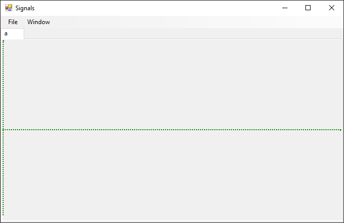
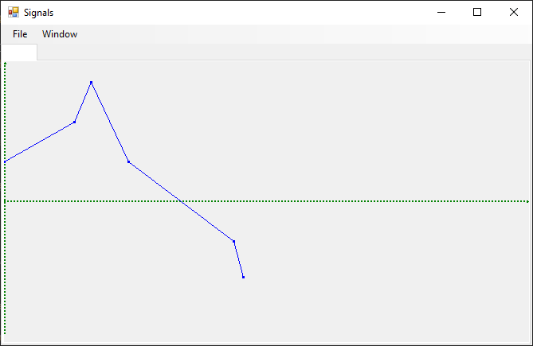

---
search:
  exclude: true
authors: bzolka
---

# 5. HF - Document-View architektúra

## Bevezetés

A feladat megértése szempontjából kulcsfontosságú a document-view architektúra részletekbe menő ismerete, pl. az előadásanyag alapján.

Kapcsolódó előadások:

- Document-View architektúra elméleti ismerete (09-10 Architektúrák előadás része) és alkalmazása egyszerű környezetben
- C# property, delegate, event alkalmazástechnikája
- Windows Forms alkalmazások fejlesztésének alapjai (`Form`, vezérlőelemek, eseménykezelés)
- Grafikus megjelenítés Windows Forms alkalmazásokban
- `UserControl` és használata

Kapcsolódó laborgyakorlatok:

- [3. Felhasználói felület kialakítása](../../labor/3-felhasznaloi-felulet/index.md) laborgyakorlat
- [6. Document-View architektúra](../../labor/6-doc-view/index.md) laborgyakorlat

Az önálló gyakorlat célja:

- UML alapú tervezés és néhány tervezési minta alkalmazása
- A Document-View architektúra alkalmazása a gyakorlatban
- A `UserControl` szerepének bemutatása Window Forms alkalmazásokban, Document-View architektúra esetén
- A grafikus megjelenítés elveinek gyakorlása Window Forms alkalmazásokban (`Paint` esemény, `Invalidate`, `Graphics` használata)

A szükséges fejlesztőkörnyezet a szokásos, [itt](../fejlesztokornyezet/index.md) található leírás.

!!! warning "Ellenőrző futtatása"
    Ehhez a feladathoz érdemi előellenőrző nem tartozik: minden push után lefut ugyan, de csak a Neptun.txt kitöltöttségét ellenőrzi és azt, van-e fordítási hiba. Az érdemi ellenőrzést a határidő lejárta után a laborvezetők teszik majd meg.

A feladat publikálásának és beadásának alapelvei megegyeznek az előző feladatéval, pár kiemelt követelmény:

- A munkamenet megegyezik az előző házi feladatéval: a fenti hivatkozással mindenkinek születik egy privát repója, abban kell dolgozni és a határidőig a feladatot beadni.
- A kiklónozott fájlok között a `Signals.sln`-t megnyitva kell dolgozni.
- :exclamation: A feladatok kérik, hogy készíts **képernyőképet** a megoldás egy-egy részéről, mert ezzel bizonyítod, hogy a megoldásod saját magad készítetted. **A képernyőképek elvárt tartalmát a feladat minden esetben pontosan megnevezi.** A képernyőképeket a megoldás részeként kell beadni, a repository-d gyökérmappájába tedd (a Neptun.txt mellé). A képernyőképek így felkerülnek GitHub-ra git repository tartalmával együtt. Mivel a repository privát, azt az oktatókon kívül más nem látja. Amennyiben olyan tartalom kerül a képernyőképre, amit nem szeretnél feltölteni, kitakarhatod a képről.
- :exclamation: A beadott megoldások mellé külön indoklást, illetve leírást nem várunk el, ugyanakkor az elfogadás feltétele, hogy a beadott kódban a **Feladat 3 – Jelek grafikus megjelenítése, saját nézet osztály**”** fejezet feladatainak a megoldását **kommentekkel kell ellátni**. A többi fejezet feladatainak megoldását NEM kell kommentezni.

TODO Az alábbi közös részek snippetként legyenek inkább:

A következők is fontosak (ugyanazok, mint az 1. házi feladat esetében voltak):

1. :exclamation: A kiinduló projektben van egy `.github/workflows` mappa, ennek tartalmát tilos megváltoztatni, törölni stb.
2. :exclamation: A munka során a kiindulási repóban levő solutionben/projektben kell dolgozni: új solution és/vagy projektfájl létrehozása, vagy a projekt más/újabb .NET verziókra targetelése tilos.
3. :exclamation: A repository gyökérmappájában található neptun.txt fájlba írd bele a Neptun kódod, csupa nagybetűvel. A fájlban csak ez a hat karakter legyen, semmi más.
4. Oldd meg a feladatot. Pushold a határidőig. Akárhány commitod lehet, a legutolsó állapotot fogjuk nézni.
5. A megoldást a tanszéki portálra nem kell feltölteni, de az eredményt itt fogjuk meghirdetni a kapcsolódó számonkérés alatt.
6. A házi feladatot külön explicit beadni nem kell, csak legyen fent GitHub-on határidőre a megoldás.
7. Amikor a házi feladatod beadottnak tekinted, célszerű ellenőrizni a GitHub webes felületén a repository-ban a fájlokra való rápillantással, hogy valóban minden változtatást push-oltál-e.
8. Szokásosan az előellenőrző pozitív kimenetele nem jelenti a feladat automatikus elfogadását, a végső oktatói ellenőrzés plusz szempontokat is figyelembe vesz.

## Feladatok áttekintése

### Feladatleírás

- Egy olyan vastagkliens (Windows Forms) alkalmazást kell elkészíteni, amely képes fájlban időbélyeggel tárolt mérési értékek grafikus megjelenítésére. Az alkalmazásnak a Document-View architektúrát kell követnie.
- Egyszerre több dokumentum is meg lehet nyitva, illetve egy dokumentumnak több nézete is lehet. A főablak egy `TabControl`-t tartalmaz, melyen minden nézet egy külön tabfülön jelenik meg.
- Egy dokumentum létrehozásakor/megnyitásakor egy nézet (tabfül) jön létre hozzá, de utólag a _Window / New View_ menüelem kiválasztásával új nézet/tabfül is létrehozható. Egy dokumentumhoz azért van értelme több nézetet megjeleníteni, mert az egyes nézetek eltérő nagyításban képesek az adott dokumentum jeleit megjeleníteni.
- A jelek kirajzolása mellett meg kell jeleníteni a koordináta tengelyeket is.

### Irányelvek

- A megvalósítás során használjunk beszédes változóneveket, pl. `pixelPerSec`.
- Amennyiben a programozási feladatok megvalósítása során „inconsistent visibility”-re vagy „inconsistent accessibility”-re panaszkodó fordítási hibaüzenetekkel találkozunk, ellenőrizzük, hogy valamennyi típusunk (osztályunk, interfészünk) láthatósága publikus-e, a class/interface kulcsszó előtt adjuk meg a `public` módosítót. Pl.:

```csharp
public class MyClass
{ … }
```

## Feladat 1 - A kiindulási környezet megismerése

### Bevezető feladatok

1. :exclamation: A főablak fejléce a "Signals" szöveg legyen, hozzáfűzve a saját Neptun kódod: (pl. "ABCDEF" Neptun kód esetén "Signals - ABCDEF"), fontos, hogy ez legyen a szöveg! Ehhez az űrlapunk `Text` tulajdonságát állítsuk be erre a szövegre.
2. :exclamation: Az űrlapunk neve jelenleg "Form1", ami szintén elég semmitmondó. Nevezzük át Neptun kódunknak megfelelően (pl. "ABCDEF" Neptun kód esetén "MainForm_ABCDEF"-re.

### Kiinduló alkalmazás működése

A solutionünk egy Document-View keretet tartalmaz. Futtatva teszteljük a kiindulási alkalmazást:

- A _File/New_ menü egy új dokumentumot hoz létre. Első lépésben bekéri a dokumentum nevét, majd létrehozza a dokumentumot és a nézetet a hozzá tartozó tabfüllel.
- A _File/Open_ és _File/Save_ menüelemekhez lényegi implementáció egyelőre nem tartozik.
- A _File/Close_ bezárja az aktuális dokumentumot/tabfület.
- A _Window/New View_ egy új nézetet/tabfület hoz létre az aktuális dokumentumhoz. Amennyiben egy dokumentumhoz több nézet is tartozik, a 2. nézettel kezdve a tabfülön a nézet sorszáma is megjelenik.

A főablakunk a következőképpen néz ki, ha két dokumentumot hoztunk létre, és a másodikhoz két nézetet:


### Kiinduló projekt

A megjegyzésekkel ellátott forráskódot nézve ismerkedjünk meg a keret architektúrájával, működésével.

A fontosabb osztályok a következők:

- `MainForm` osztály: Az alkalmazás főablaka. Egy `TabControl`-t tartalmaz, ahol megjelennek az egyes dokumentumok nézetei. Kezeli a `MenuStrip` eseményeit, a többségük kezelőfüggvényében egyszerűen továbbhív az `App` osztályba (vagyis a logika nem a form osztályban van megírva).
- `App` osztály: Az alkalmazást reprezentálja. Egy példányt kell létrehozni belőle az `Initialize` hívásával, ez lesz az alkalmazásunk „root” objektuma. Ez bármely osztály számára hozzáférhető az `App.Instance` statikus property-n keresztül (erre több példát is látunk a főablak menü eseménykezelőiben). Tárolja a dokumentumok listáját. Legfontosabb tagjai a következők:
    - `documents`: Valamennyi megnyitott dokumentumot tartalmazó lista.
    - `activeView`: Az aktív nézetet adja vissza. Ezt az aktív `TabPage` határozza meg. Tabváltáskor mindig frissítésre kerül. A `TabPage`-ek a `Tag` property-jükben tárolják azt a nézet objektumot, melyet megjelenítenek.
    - `ActiveDocument`: Az aktív dokumentumot adja vissza. Az aktív `TabPage` meghatározza, melyik az aktív nézet, a nézet pedig referenciával rendelkezik a dokumentumra, melyhez tartozik.
    - `NewDocument`: Létrehoz egy új dokumentumot, a hozzá tartozó nézettel. Alaposan tanulmányozzuk át az implementációt, az általa hívott függvényeket is beleértve!
    - `CreateViewForActiveDocument`: Egy új nézetet hoz létre az aktív dokumentumhoz. A _Window/New View_ menüelem kiválasztásának hatására hívódik meg.
    - `CloseActiveView`: Bezárja az aktív nézetet.
- `Document` osztály: Az egyes dokumentum típusok ősosztálya. Bár esetünkben csak egy dokumentum típus létezik, a későbbi bővíthetőség miatt célszerű külön választani. Tartalmazza a nézetek listáját, melyek a dokumentumot megjelenítik. Az `UpdateAllViews` művelete valamennyi nézetet értesít annak érdekében, hogy frissítsék magukat. A `LoadDocument` és `SaveDocument` üres virtuális függvények, melyek a dokumentum betöltésekor és mentésekor kerülnek meghívásra. A `Document` leszármazott osztályunkban kell felüldefiniálni és értelemszerűen megvalósítani őket.
- `IView`: Az egyes nézetek közös interfésze. Azért nem osztály, mert a nézetek tipikusan a `UserControl`-ból származnak le, és egy osztálynak nem lehet több ősosztálya .NET környezetben.
- `DemoView`: Egy demo nézet implementáció nézetre. Mintaként szolgálhat saját nézet létrehozásához. A `UserControl` osztályból származik, és implementálja az `IView` interfészt.

Az osztályok közötti kapcsolatok jobb megértését segíti a solutionben található `ClassDiagram1.cd` UML osztálydiagram.

## Feladat 2 – Mérési értékek kezelése (dokumentum logikák)

### Mérési értékek reprezentálása

Vezessünk be egy osztályt a jelértékek reprezentálására.

Legyen az osztály neve `SignalValue`, és egy `Value` (`double`) mezőben tárolja a mért értéket, az időbélyeget pedig egy `TimeStamp` (`DateTime`) mezőben. Mivel ezeket nem akarjuk a kezdeti inicializálás után megváltoztatni, definiáljuk őket csak olvashatónak (`readonly` kulcsszó).

Az osztálynak legyen olyan kétparaméteres konstruktora, mely paraméterben megkapja jelértéket és az időbélyeget, és ez alapján inicializálja a tagváltozókat.
Írjuk felül az `object`-ből örökölt `ToString` műveletet, hogy formázottan jelenítse meg az objektum tagváltozóit. Segítség:

```csharp
public override string ToString()
{
    return $"Value: {Value}, TimeStamp: {TimeStamp}";
}
```

### Saját dokumentum osztály

Vezessünk be egy saját dokumentum osztályt a dokumentumhoz tartozó jelértékek tárolására.

Legyen az osztály neve `SignalDocument`, származzon a `Document` osztályból, és egy `signals` nevű `List<SignalValue>` típusú tagban tárolja a jeleket.

!!! tip "Document konstruktor"
    Az ős `Document` nem rendelkezik default konstruktorral, ezért kell írjunk a leszármazottunkban megfelelő konstruktort:

    ```csharp hl_lines="2"
    public SignalDocument(string name)
        : base(name)
    { 
    }
    ```

Módosítsuk az `App.NewDocument` függvényt, hogy a leszármazott `SignalDocument`-et példányosítsa.

### Adatok mentése

Gondoskodjunk a dokumentum által tárolt adatok elmentéséről.

A tesztelést segítendő inicializáljuk a `SignalDocument`-ben tárolt jelérték listát úgy, hogy mindig legyen benne néhány elem. Célszerű ezeket egy külön tagváltozóban felvenni. Az alábbi kód arra is példát mutat, hogyan lehet C# nyelven a tömb elemeit az inicializás során egyszerűen megadni (collection initializer).

!!! warning "Figyelem"
    A megvalósítás során NE az alábbi példában szereplő értékeket használd:

```csharp
public class SignalDocument : Document
{ 
    // ...

    private List<SignalValue> signals = new List<SignalValue>();
    
    private SignalValue[] testValues = new SignalValue[]
    {
        new SignalValue(10, new DateTime(2023, 1, 1, 0, 0, 0, 111)),
        new SignalValue(20, new DateTime(2023, 1, 1, 0, 0, 1, 876)),
        new SignalValue(30, new DateTime(2023, 1, 1, 0, 0, 2, 300)),
        new SignalValue(10, new DateTime(2023, 1, 1, 0, 0, 3, 232)),
        new SignalValue(-10, new DateTime(2023, 1, 1, 0, 0, 5, 885)),
        new SignalValue(-19, new DateTime(2023, 1, 1, 0, 0, 6, 125)),
    };
    
    public SignalDocument(string name)
        : base(name)
    {
        // Kezdetben dolgozzunk úgy, hogy a signals
        // jelérték listát a testValues alapján inicializáljuk.
        signals.AddRange(testValues);
    }

    // ...
}
```

Következő lépésben írja meg az `App.SaveActiveDocument` függvényt a forráskódban található megjegyzéseknek megfelelően. A `SaveFileDialog` használatára a dokumentációban [itt](https://learn.microsoft.com/en-us/dotnet/desktop/winforms/controls/how-to-save-files-using-the-savefiledialog-component?view=netframeworkdesktop-4.8&viewFallbackFrom=netdesktop-6.0) vagy [itt](https://learn.microsoft.com/en-us/dotnet/api/system.windows.forms.savefiledialog?redirectedfrom=MSDN&view=windowsdesktop-7.0) talál példát. Az előbb linkelt  példa megtévesztő lehet, mert a dialógus meg is nyitja a fájlt. Esetünkben erre semmi szükség, csak egy fájl útvonalat szeretnénk szerezni, hiszen a fájl megnyitása a dokumentum osztályunk feladata.

??? tip "Segítség a megoldáshoz"

    ```csharp
    /// <summary>
    /// Elmenti az aktív dokumentum tartalmát.
    /// </summary>
    public void SaveActiveDocument()
    {
        if (ActiveDocument == null)
            return;
            
        // Útvonal bekérése a felhasználótól a SaveFileDialog segítségével.
        var saveFileDialog = new SaveFileDialog()
        {
            // Megjelenítés előtt paramlterezzük fel a dialógus ablakot
            Filter = "txt files (*.txt)|*.txt|All files (*.*)|*.*",
            saveFileDialog.FilterIndex = 0,
            saveFileDialog.RestoreDirectory = true,
        };
        
        // Modálisan megjelenítjük a dialógusablakot.
        // Ha a felhasználó nem az OK gommbal zárta be az ablakot, 
        // nem csinálunk semmit (visszatérünk)
        if(saveFileDialog.ShowDialog() != DialogResult.OK)
            return;
        
        // A dokumentum adatainak elmentése.
        // A saveFileDialog.FileName tartalmazza a teljes útvonalat.
        ActiveDocument.SaveDocument(saveFileDialog.FileName);
    }
    ```

A következő lépésben definiáljuk felül a `SignalDocument` osztályban az örökölt `SaveDocument` függvényt, melyben írjuk ki a tárolt jelértékeket, időbélyeggel együtt. A mentés során arra törekszünk, hogy tömör, mégis olvasható formátumot kapjunk. Ennek megfelelően a bináris formátum nem javasolt. Kövessük a következő minta által meghatározott szöveges formátumot:

```text
10  2022-12-31T23:00:00.1110000Z
20  2022-12-31T23:00:01.8760000Z
30  2022-12-31T23:00:02.3000000Z
10  2022-12-31T23:00:03.2320000Z
```

Az első oszlopban a jelérték, a másodikban az időpont található, az oszlopok tabulátor karakterrel szeparáltak (`\t`). Az időpont legyen UTC idő annak érdekében, hogy ha a fájlt más időzónában töltik be, akkor is a helyes helyi időt mutassa. Az megfelelő `string` konverzió a következő:

```csharp
var dt = myDateTime.ToUniversalTime().ToString("o");
```

Szöveges adatok fájlba írására a `StreamWriter` osztályt használjuk.

!!! warning "Figyelem"
    A megoldásunkban garantáljuk, hogy kivétel esetén is lezáródjon a fájlunk: használjunk `try-finally` blokkot, vagy alkalmazzunk `using` blokkot:

    ```csharp
    using (StreamWriter sw = new StreamWriter(filePath))
    {
        
    }
    ```


Az alkalmazást futtatva teszteljük a mentés funkciót. Ennek során ellenőrizzük, hogy a fájlban valóban az elvárásoknak megfelelő formátumban kerülnek-e kiírásra az adatok. Ehhez indítsuk el az alkalmazást, hozzunk létre egy új dokumentumot, majd a _File/Save_ menü kiválasztásával mentsük el.

!!! example "BEADANDÓ"
    Készíts egy képernyőmentést `Feladat2-3.png` néven az alábbiak szerint:

    - Indítsd el az alkalmazást. Ha szükséges, méretezd át kisebbre, hogy ne foglaljon sok helyet a képernyőn,
    - a „háttérben” a Visual Studio legyen, az `App.cs` megnyitva, úgy görgetve, hogy függőlegesen a `public void SaveActiveDocument()` legyen az oldal közepén (vagyis látszódjon az előző függvény vége és a `SaveActiveDocument` eleje),
    - a VS _View/Full Screen_ menüjével kapcsolj ideiglenesen _Full Screen_ nézetre, hogy a zavaró panelek ne vegyenek el semmi helyet,
    - az előtérben pedig az alkalmazásod ablaka.

### Adatok betöltése

Biztosítsunk lehetőséget dokumentum fájlból betöltésére.

Írjuk meg az `App.OpenDocument` függvényt a benne szereplő megjegyzéseknek megfelelően, kövessük az ott megadott lépéseket.

A következő lépésben definiáljuk felül a `SignalDocument` osztályban az örökölt `LoadDocument` függvényt, melyben töltsük fel a tárolt jelérték listát a fájl tartalma alapján. Szöveges adatok fájlból beolvasására a `StreamReader` osztályt használjuk, a mentéshez hasonlóan `try/finally` vagy `using` blokkban.

??? tip "Segítségképpen"

    - Amennyiben van egy `sr` nevű `StreamReader` objektumunk, a fájl soronkénti beolvasása a következőképpen lehetséges:
    
        ```csharp
        while ((line = sr.ReadLine()) != null)
        {
            // A line változóban benne van az aktuális sor 
            // ,,,
        }
        ```

    - Az üres, vagy csak whitespace karaktereket tartalmazó sorokat át kell ugrani. A `string.Trim` használható a whitespace karakterek kiszűrésére, pl.:

        ```csharp
        s = s.Trim();
        ```

    - Az oszlopok tab karakterrel szeparáltak. Egy sztring adott karakter szerinti vágására kényelmesen használható a `string` osztály `Split` művelete, pl.: 

        ```csharp
        string[] columns = line.Split(’\t’);
        ```

    - Sztringből `double`-t, illetve `DateTime` objektumot a `<típusnév>.Parse(str)` függvénnyel lehet pl. kinyerni:

        ```csharp
        double d = double.Parse(strValue);
        DateTime dt = DateTime.Parse(strValue);
        ```

    - A fájlban UTC időbélyegek szerepelnek, ezt a dokumentum osztályban tárolás előtt konvertáljuk lokális időre:
    
        ```csharp
        DateTime localDt = utcDt.ToLocalTime();
        ```

    - Miután beolvastuk az adott sort, hozzunk létre egy új `SignalValue` objektumot a beolvasott értékekkel inicializálva, és vegyük fel a `signals` listába.

  A `LoadDocument` függvény elején a `signals` feltöltése előtt töröljük ki a `Clear` művelettel a benne levő elemeket. Enélkül ugyanis a konstruktorban hozzáadott teszt jelértékek benne maradnának.

!!! example "BEADANDÓ"
    Készíts egy képernyőmentést `Feladat2-4.png` néven az alábbiak szerint:

    - Indítsd el az alkalmazást. Ha szükséges, méretezd át kisebbre, hogy ne foglaljon sok helyet a képernyőn,
    - „háttérben” a Visual Studio legyen, az App.cs megnyitva, úgy görgetve, hogy az `OpenDocument` függvény törzséből minél több látszódjon.
    - a VS _View/Full Screen_ menüjével kapcsolj ideiglenesen _Full Screen_ nézetre, hogy a zavaró panelek ne vegyenek el semmi helyet,
    - az előtérben pedig az alkalmazásod ablaka.

### Betöltés ellenőrzése

A betöltést követően ellenőrizzük a betöltés sikerességét.

Mivel grafikus megjelenítéssel még nem rendelkezik az alkalmazás, más megoldást kell választani. Nyomkövetésre, diagnosztikára a `System.Diagnostics` névtér osztályai használhatók. A `Trace` osztály „Debug” build esetén a `Write`/`WriteLine` utasítással kiírt adatokat trace-eli: az alapértelmezésben azt jelenti, hogy megjeleníti a Visual Studio _Output_ ablakában. Írjunk egy `TraceValues` segédfüggvényt a `SignalDocument` osztályba, mely trace-eli a tárolt jeleket:

```csharp
private void TraceValues()
{
    foreach (var signal in signals)
        Trace.WriteLine(signal.ToString());
}
```

Hívjuk meg a `TraceValues`-t a betöltő függvényünk (`LoadDocument`) végén, és ellenőrizzük a működést: az ++f5++ billentyű lenyomásával debug módban indítsuk el az alkalmazást, a _File/Open_ kiválasztásával töltsünk be egy korábban elmentett fájlt. A művelet végén ellenőrizzük, hogy a Visual Studio _Output_ ablakában (_View/Output_ menüvel jeleníthető meg) kiíródnak-e a fájlból betöltött jelek adatai.

!!! example "BEADANDÓ"
    Készíts egy képernyőmentést `Feladat2-5.png` néven az alábbiak szerint:

    - Indítsd el az alkalmazást. Ha szükséges, méretezd át kisebbre, hogy ne foglaljon sok helyet a képernyőn,
    - a „háttérben” a Visual Studio legyen, az `SignalDocument.cs` megnyitva, melyben látszik a `TraceValues` implementációja, valamint az _Output_ ablakban a trace-elt jelértékek,
    - a VS _View/Full Screen_ menüjével kapcsolj ideiglenesen _Full Screen_ nézetre, hogy a zavaró panelek ne vegyenek el semmi helyet,
    - az előtérben pedig az alkalmazásod ablaka.

## Feladat 3 – Jelek grafikus megjelenítése, saját nézet osztály

!!! warning "Lényeges"
    Ezen főfejezet feladatainak megoldását kommentekkel kell ellátni!

### Új nézet osztály

Vezessünk be egy új nézet osztályt `UserControl` formájában.

A nézetet `UserControl`-ként valósítjuk meg. A téma elméleti háttere az előadásanyagban megtalálható. Következzen pár fontosabb gondolat ismétlésképpen. A `UserControl` alapú megközelítéssel olyan saját vezérlőt készíthetünk, melyek az űrlapokhoz (`Form`) hasonlóan más vezérlőket tartalmazhatnak.

Számos pontban nagyon hasonlítanak az űrlapokhoz, pl.:

- Két forrásfájl tartozik hozzájuk. Egy, amiben mi dolgozunk, és egy `designer.cs` végződésű, melybe a Visual Studio generál kódot. A fejlesztők számára dedikált forrásfájlt többféleképpen lehet megnyitni:
    - A Solution Explorer összevontan jeleníti meg a forrásfájlokat: ezen jobb gombbal kattintva a _View Code_ elemet válasszuk a menüben.
    - Amennyiben duplakattal megnyitottuk a `UserControl`-t szerkesztésre, a szerkesztőfelületen jobb gombbal kattintva válasszuk a _View Code_ menüt.
    - ++f7++ billentyű használatával.
- Amikor saját űrlapot készítünk, a beépített `Form` osztályból kell egy saját osztályt leszármaztatni. Saját `UserControl` esetében a beépített `UserControl` osztályból kell származtatni. Ezt ritkán szoktuk manuálisan megtenni, általában a Visual Studio-ra bízzuk (pl. _Project/Add UserControl_ menü).
- Hasonlóan a Solution Explorerben duplán kattintva rajtuk tudjuk megnyitni a felületüket szerkesztésre, a _Toolbox_-ból tudunk más vezérlőket elhelyezni a felületükön, melyekből a `UserControl` osztályunkban tagváltozók lesznek.
- Hasonló módon tudunk eseménykezelőket készíteni (magához a `UserControl`-hoz, vagy a rajta levő vezérlőkhöz).
- Ugyanúgy tudunk felületére rajzolni. Vagy a `Paint` eseményhez rendelünk eseménykezelőt, vagy felüldefiniáljuk az `OnPaint` virtuális függvényt.

Abban természetesen különbözik az űrlapoktól, hogy míg az űrlapok, mint önálló ablakok a `Show` vagy `ShowDialog` műveletekkel megjeleníthetők, a `UserControl`-ok vezérlők, melyeket űrlapokon vagy más vezérlőkön kell elhelyezni.

Visszetérve a feladatra a megvalósítás főbb lépései a következők:

- Az új nézet a fentieknek megfelelően egy `UserControl` legyen. Saját `UserControl`-t felvenni pl. a _Project/Add UserControl_ menüvel lehet. Legyen a neve `GraphicsSignalView` (jelezve, hogy ez egy grafikus nézet, és nem karakteresen jeleníti meg a jeleket).
- Bővítsük az osztályt a `DemoView` mintájára (többek között implementálja az `IView` interfészt). A `DemoView` a dokumentumra ős `Document` típusként hivatkozik, lásd `Document document;` tagváltozó. A `GraphicsSignalView`-ban célszerű a specifikusabb, `SignalDocument` típusúnak definiálni a tagváltozót!
- Módosítsuk az `App.CreateView()`-t, hogy `DemoView` helyett `GraphicsSignalView`-t hozzon létre. Hogy ez működhessen, a `GraphicsSignalView`-ba fel kell venni egy konstruktort a következőnek megfelelően (hagyjuk meg a default konstruktort és hívjuk is meg):

    ```csharp
    public GraphicsSignalView(SignalDocument document)
        : this()
    {
        this.document = document;
    }
    ```

    Az `App.CreateView` módosításának van még egy trükkje. Mivel a `doc` referenciánk típusa `Document`, a `GraphicsSignalView` pedig a leszármazottját várja, a konstruktor hívásakor exlicit le kell castoljuk `SignalDocument`-re:

    ```csharp
    var view = new GraphicsSignalView((SignalDocument)doc);
    ```

### A koordináta tengelyek kirajzolása

Rajzoljuk ki a koordináta tengelyeket. Legyen az alapelv a következő:

- A rajzolófelületünk (vagyis a `GrapicsSignalView` `UserControl`) kliens területének szélességét a `ClientSize.Width`, a magasságát a `ClientSize.Height` lekérdezésével kaphatjuk meg. Vonalat rajzolni a `Graphics` osztály `DrawLine` műveletével lehet.
- Az Y tengelyt a nulla y pixelpozícióba rajzoljuk.
- Az X tengelyt mindig a rajzolófelületünk közepére igazítva rajzoljuk, akárhogy méretezi is a felhasználó az ablakot (segítségképpen: a teljes aktuális magasságot a `ClientSize.Height` adja meg számunkra).
- :exclamation: **A koordináta tengelyek színe legyen kék, és legyenek 2 pixel vastagok. A tengelyeket pontozott vonallal rajzoljuk, és a végükön legyen egy kisméretű nyíl.** Erre a beépített `Pen` támogatást nyújt:

    ```csharp
    var pen = new Pen(Color.Blue, 2)
    {
        DashStyle = DashStyle.Dot,
        EndCap = LineCap.ArrowAnchor,
    };
    ```

- A függőleges tengelyt nem a 0, hanem a 2 koordinátába érdemes rajzolni (különben csak 1 pixel vastagnak fog látszódni).

A munkánk eredményeképpen valami hasonlót kell lássunk futás közben (a szín és minta nem biztos, hogy egyezik), persze csak ha megnyitunk egy létező vagy létrehozunk egy új dokumentumot, máskülönben nincs is nézetünk:



!!! example "BEADANDÓ"
    Készíts egy képernyőmentést `Feladat3-2.png` néven az alábbiak szerint:

    - Indítsd el az alkalmazást. Nyiss meg vagy hozz létre egy dokumentumot, hogy látszódjanak a koordináta tengelyek. Ha szükséges, méretezd át kisebbre, hogy ne foglaljon sok helyet a képernyőn,
    - a „háttérben” a Visual Studio legyen, az `GrapicsSignalView.cs` megnyitva, melyben látszik a koordináta tengelyek kirajzolása,
    - a VS _View/Full Screen_ menüjével kapcsolj ideiglenesen _Full Screen_ nézetre, hogy a zavaró panelek ne vegyenek el semmi helyet,
    - az előtérben pedig az alkalmazásod ablaka.

### Jelek megjelenítése

Valósítsuk meg a jelek megjelenítését!

Az `GraphicsSignalView`-ban az `OnPaint`-t felüldefiniálva valósítsuk meg a jelek kirajzolását. Először 3*3 pixeles „pontokat” rajzoljunk (pl. `Graphics`.`FillRectangle`-lel), majd a pontokat kössük össze vonalakkal (`Graphics.DrawLine`).

??? tip "Segítségképpen"

    A megvalósításban segíthet a következő:

    - Az `OnPaint` művelet a megjelenítés során el kell érje a `SignalDocument`-ben tárolt `SignalValue` objektumokat. Ehhez a `SignalDocument` osztályban vezessünk be egy publikus property-t (a `SignalDocument`-ben a `signals` tag privát, és ez maradjon is így):

        ```csharp
        public IReadOnlyList<SignalValue> Signals
        {
            get { return signals; }
        }
        ```

        Figyeljük meg, hogy az objektumokat nem `List<SignalValue>`-ként, hanem `IReadOnlyList<SignalValue>` formában adjuk vissza: így a hívó nem tudja módosítani az eredeti listát, nem tudja véletlenül se elrontani a tartalmát.

    - Két `DateTime` érték különbsége egy `TimeSpan` (időtartam) típusú objektumot eredményez.
    - Egy `DateTime` objektum a `Ticks` property-jében adja vissza legjobb felbontással az általa tárolt időértéket (1 tick = 100 nsec felbontás).
    - A rajzolófelületünk (vagyis a `GrapicsSignalView` `UserControl`) nulla x koordinátájában jelenítsük meg a listánkban levő első jelet.
    - A megjelenítés során semmiféle követelmény nincs arra vonatkozóan, hogy a jeleket olyan skálatényezőkkel jelenítsük meg, hogy pont kiférjenek a rajzolás során. Helyette a nézet osztályunkban vezessünk be és használjunk olyan `pixelPerSec` és `pixelPerValue` skálatényezőket, melyek érzésre, vagy pár próbálkozás után úgy jelenítsék meg a jeleket, hogy a nézetbe beférjenek, de ne is legyen a rajz túl kicsi.
    - Amennyiben a rajzunk „nem akar” megjelenni, tegyünk töréspontot az `OnPaint` műveletbe, és a kódunkat lépésenként végrehajva a változók értékét tooltipben vagy a _Watch_ ablakban megjelenítve nyomozzuk, hol csúszik félre a számításunk.

Ha jól dolgoztunk, a következőhöz hasonló kimenetet kapunk:



### Nagyítás, kicsinyítés

Biztosítsunk lehetőséget a nézet nagyításra és kicsinyítésére. Ehhez helyezzünk el egy kisméretű, "+" és "–" szöveget tartalmazó nyomógombot a nézeten.

Lépések:

- Nyissuk meg a `GraphicsSignalView` `UserControl`-t szerkesztésre.
- A _Toolbox_-ról drag&drop-pal helyezzünk el rajta két gombot (`Button`).
- Nevezzük el a gombokat megfelelően és állítsuk be a szövegüket (`Text` property).
- Rendeljünk eseménykezelőt a gombok `Click` eseményéhez (ehhez csak duplán kell a gombokon kattintani a szerkesztőben).
- Vezessünk be a nézetben egy `double` típusú skálatényezőt, melynek kezdőértéke legyen 1. Nagyításkor ezt növeljük (pl. 1,2-szeresére), kicsinyítéskor csökkentsük (pl. osszuk 1,2-vel). Az `OnPaint` műveleteben, mikor az y és x pixelkoordinátákat számoljuk, a végső eredmény számításakor a koordinátákat szorozzuk be az aktuális skálatényezővel. A skálatényező változtatása után ne felejtsük el meghívni az `Invalidate` műveletet!

A következőhöz hasonló kimenetet a cél (némi nagyítást követően):


Az alkalmazást futtatva a _Window_ menüből ugyanahhoz a dokumentumhoz hozzunk létre egy új nézetet, és a nagyítás/kicsinyítés gombokat használva, valamint a nézetek között váltogatva ellenőrizzük, hogy a nézetek ugyanazokat az adatokat jelenítik meg, de eltérő nagyításban.

!!! example "BEADANDÓ"
    Készíts egy képernyőmentést `Feladat3-4.png` néven az alábbiak szerint:

    - Indítsd el az alkalmazást. Nyiss meg vagy hozz létre egy dokumentumot, hogy látszódjanak a koordináta tengelyek és a kirajzolt jelek. Ha szükséges, méretezd át kisebbre, hogy ne foglaljon sok helyet a képernyőn,
    - a „háttérben” a Visual Studio legyen, az `GrapicsSignalView.cs` megnyitva, melyben látszik a jelek kirajzolása,
    - a VS _View/Full Screen_ menüjével kapcsolj ideiglenesen _Full Screen_ nézetre, hogy a zavaró panelek ne vegyenek el semmi helyet,
    - az előtérben pedig az alkalmazásod ablaka.

## Opcionális iMSc feladatok

Az egyes feladatok egymástól függetlenül is megoldhatók!

### `IView` kódduplikációja (1 iMSc pont)

Az `IView` egy interfész, ezért a `GetDocument`/`Update`, stb. kódját nem lehet implementálni benne. Helyette minden nézetben „copy-paste”-tel duplikálni kell a megfelelő kódot. Szüntessük meg ezt a kódduplikációt az alkalmazásban! A megoldást előbb mindenképpen magad próbáld kitalálni, csak ha elakadsz, akkor fordulj az alábbi kinyitható segítséghez:
??? tip "Segítség"
    Egy `ViewBase` nevű osztályt kell írni, mely a `UserControl`-ból származik, és implementálja az `IView` interfészt. A nézeteinket a `UserControl` helyett a `ViewBase` osztályból kell származtatni.

!!! example "BEADANDÓ"
    Készíts egy képernyőmentést `FeladatIMSc-1.png` néven az alábbiak szerint:

    - A képernyőmentés a Visual Studioról legyen, mely valamilyen módon mutatja, hogy az átalakítást elvégezted.

### Grafikon görgetése (1 iMSc pont)

Biztosítsunk lehetőséget a grafikon görgetésére!

A megvalósításban használhatunk egyedi scrollbar-t is, de ennél egyszerűbb a `UserControl` autoscroll támogatását felhasználni (`UserControl.AutoScroll` és `UserControl.AutoScrollMinSize`).

A kirajzolás során a rajzot az aktuális scroll pozíciónak megfelelően el kell tolni. Erre a legegyszerűbb megoldás, ha egy, a scroll pozíciónak megfelelő eltolást eredményező transzformációs mátrixot állítunk be a `Graphics` objektumra a kirajzolás előtt (`g.Transform` beállítása egy `new Matrix(1, 0, 0, 1, AutoScrollPosition.X, AutoScrollPosition.Y)` objektumra).

A megközelítés előnye a viszonylagos egyszerűsége. Hátránya, hogy ha nagyon sok jelünk van, de annak csak egy kis szelete látható egy adott pillanatban, attól még a `Paint` függvényünkben a nem látható jeleket is kirajzoljuk. Egy optimalizált megoldásban csak a látható tartományt célszerű megjeleníteni.

!!! example "BEADANDÓ"
    Készíts egy képernyőmentést `FeladatIMSc-2.png` néven az alábbiak szerint:

    - Indítsd el az alkalmazást. Nyiss meg vagy hozz létre egy dokumentumot, hogy látszódjanak a koordináta tengelyek és a kirajzolt jelek, valamint a görgetősáv (scrollbar). Ha szükséges, méretezd át kisebbre, hogy ne foglaljon sok helyet a képernyőn,
    - a „háttérben” a Visual Studio legyen, az `GrapicsSignalView.cs` releváns releváns része megnyitva,
    - a VS _View/Full Screen_ menüjével kapcsolj ideiglenesen _Full Screen_ nézetre, hogy a zavaró panelek ne vegyenek el semmi helyet,
    - az előtérben pedig az alkalmazásod ablaka.

### Jelek élő generálása (3 iMSc pont)

Biztosítsunk lehetőséget jelek élő generálására és megjelenítésére.

Az átalakítást olyan módon kell végrehajtani, hogy a korábbi feladatok megoldása működőképes maradjon az alapértelmezett, nem élő módban.

Vezessünk be egy _Data_ menüelem alatti _Change To Live Data Source Mode_ menüelemet. Amikor a felhasználó erre kattint, indítsunk egy szálat, mely véletlenszerű jelértékeket generál (azt szimulálva, hogy valamilyen adatforrásból, pl. soros port, hálózat, stb. adatok érkeznek) a következőknek megfelelően:

- A _Change To Live Data Source Mode_ az aktuális dokumentumra vonatkozik. Vagyis minden dokumentum egymástól függetlenül élő adatforrás módba kapcsolható. Ennek megfelelően a jelek generálását dokumentum szinten célszerű megvalósítani (dokumentumonként külön szál).
- Másodpercenként nagyságrendileg 4 jelérték érkezzen véletlen időközönként (pl. szál altatása véletlen időközig, 500 ms max értékkel), melyek időbélyege legyen az aktuális idő (`DateTime.Now`).
- A generált értékek kerüljenek bele az aktuális dokumentum jelérték halmazába (fűzze a végére).
- A megjelenítés során nem kell azzal foglalkozni, hogy a nézet automatikusan úgy nagyítsa/kicsinyítse/görgesse a felületet, hogy az érkező adatok láthatóak legyenek. Vagyis semmiféle automatizmust nem kell megvalósítani, ha az érkező adatok a megjelenítési tartományon kívül esnek: a felhasználó feladata, hogy úgy nagyítsa/kicsinyítse/görgesse a felületet, hogy azok láthatók legyenek.
- A megjelenítés során nem kell optimalizációval foglalkozni. Vagyis nem kell gondoskodni arról, hogy mindig csak az újonnan érkező adatok kerüljenek kirajzolásra, vagy, hogy ne villogjon a felület az újrarajzolás során.
- Egy élő adatforrás módban levő dokumentum esetén nem elvárás, hogy ha új érték születik, a dokumentum nézetei azt mielőbb megjelenítsék. Vagyis teljesen elfogadható - sőt, célszerű - megoldás, ha egy élő módban levő dokumentum nézetei másodpercenként néhányszor (pl. ötször) ellenőrzik, érkezett-e új adat, és szükség esetén frissítik magukat (pull modell). Azt, hogy érkezett-e új adat, egy nézet pl. úgy tudja eldönteni, ha eltárolja az utoljára megjelenített jelek számát, és összehasonlítja az aktuális jelszámmal.

!!! example "BEADANDÓ"
    Készíts egy képernyőmentést `FeladatIMSc-3.png` néven az alábbiak szerint:

    - Indítsd el az alkalmazást. Nyiss meg vagy hozz létre egy dokumentumot és válts élő módba, hogy látszódjanak a random generált értékek is.
    - a „háttérben” a Visual Studio legyen, az `SignalDocument.cs` releváns releváns része megnyitva,
    - a VS _View/Full Screen_ menüjével kapcsolj ideiglenesen _Full Screen_ nézetre, hogy a zavaró panelek ne vegyenek el semmi helyet,
    - az előtérben pedig az alkalmazásod ablaka.