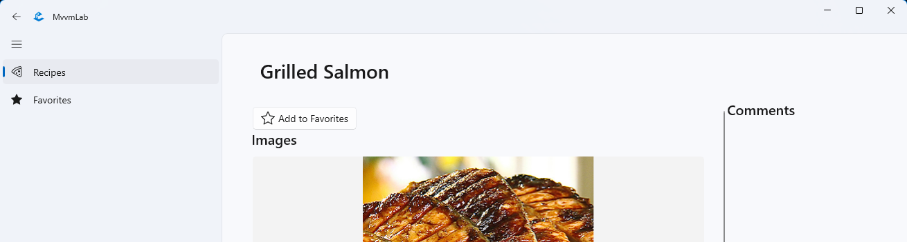

# 5. HF - Anwendungen auf der Grundlage des MVVM-Modells

## Einführung

Als Hausaufgabe werden wir die in der Übung begonnene Rezeptanwendung mit Hilfe der MVVM-Vorlage erweitern.

Die eigenständige Übung baut auf dem auf, was in den MVVM-Vorlesungen gesagt wurde. Den praktischen Hintergrund für die Übungen liefert die [Laborübung 5 - MVVM-Laborübung](../../labor/5-mvvm/index.md). 

Darauf aufbauend können die Aufgaben dieser Selbstübung mit Hilfe der kürzeren Leitfäden, die auf die Aufgabenbeschreibung folgen (manchmal standardmäßig eingeklappt), selbständig bearbeitet werden.

Das Ziel der unabhängigen Übung:

- Üben mit dem MVVM-Beispiel
- Anzeige von Daten und Verwaltung von Interaktionen auf der Schnittstelle mit Datenbindung
- Anwendung des Dependency Injection-Musters
- Datenverwaltung auf der Dienstebene über HTTP-Anfragen oder ein lokales Repository

Die erforderliche Entwicklungsumgebung wird [hier](../fejlesztokornyezet/index_ger.md) beschrieben.

!!! warning "Entwicklungsumgebung für WinUI3-Entwicklung"
    Wie in den vorherigen Übungen müssen zusätzliche Komponenten installiert werden. Auf der [obigen](../fejlesztokornyezet/index_ger.md) Seite wird erwähnt, dass Sie Visual Studio Workload für die ".NET-Desktop-Entwicklung" installieren müssen, und es gibt einen Abschnitt "WinUI-Unterstützung" am unteren Ende der Seite, Sie sollten den Schritten dort folgen!

## Das Verfahren für die Einreichung

- Der grundlegende Prozess ist derselbe wie zuvor. Erstellen Sie mit GitHub Classroom ein Repository für sich selbst. Sie finden die Einladungs-URL in Moodle (Sie können sie sehen, indem Sie auf den Link*"GitHub classroom links for homework*" auf der Startseite des Fachs klicken). Es ist wichtig, dass Sie die richtige Einladungs-URL für diese Hausaufgabe verwenden (jede Hausaufgabe hat eine andere URL). Klonen Sie das resultierende Repository. Dazu gehört auch die erwartete Struktur der Lösung. Nachdem Sie die Aufgaben erledigt haben, übergeben Sie Ihre Lösung alt und drücken Sie sie alt.
- Um mit den geklonten Dateien zu arbeiten, öffnen Sie `MvvmLab.sln`.
- :exclamation: In den Übungen werden Sie aufgefordert, **einen Screenshot von** einem Teil Ihrer Lösung zu machen, da dies beweist, dass Sie Ihre Lösung selbst erstellt haben. **Der erwartete Inhalt der Screenshots wird immer in der Aufgabe angegeben.** Screenshots sollten als Teil der Lösung eingereicht werden, legen Sie sie in den Stammordner Ihres Repositorys (neben neptun.txt). Die Screenshots werden dann zusammen mit dem Inhalt des Git-Repositorys auf GitHub hochgeladen. Da das Repository privat ist, ist es für niemanden außer den Lehrkräften sichtbar. Wenn Sie Inhalte auf dem Screenshot haben, die Sie nicht hochladen möchten, können Sie diese aus dem Screenshot herausschneiden.
- :exclamation: Diese Aufgabe enthält keinen sinnvollen Pre-Checker: Sie wird nach jedem Push ausgeführt, prüft aber nur, ob neptun.txt gefüllt ist. Die inhaltliche Überprüfung wird von den Laborleitern nach Ablauf der Frist durchgeführt.

## Verbindungen

:warning: **Obligatorische Verwendung des MVVM-Beispiels!**  
  In dieser Hausaufgabe üben wir das MVVM-Pattern, daher ist das MVVM-Pattern für die Lösung der Aufgaben zwingend erforderlich. Andernfalls wird die Bewertung der Aufgaben verweigert.

## Ausgangszustand

Der Ausgangszustand baut auf dem Endzustand von Labor 5 auf, allerdings mit einer wichtigen Änderung.

Wenn die Anwendung gestartet wird, wird eine Seite des Typs `ShellPage` erstellt, die sich im Ordner `Views` des Projekts befindet. Es enthält eine `NavigationView`(aka. Hamburger Menü), das in unserem Fall die Navigation übernimmt. Sie kann `NavigationViewItem`enthalten, die Menüpunkte darstellen und in der Anwendung immer verfügbar sind. Wenn Sie auf die Menüpunkte innerhalb von `Frame`klicken, wird die entsprechende Seite mit Hilfe der Hilfsklassen im Projekt aufgerufen, die auch die Navigation zurück zur vorherigen Seite unterstützt.

## 1. Aufgabe - Rezepte als Favoriten verwalten

Die funktionalen Anforderungen an unsere Aufgabe sind:

- Rezepte als Favoriten speichern
    - Auf der Detailseite des Rezepts (z. B. oben in der linken Spalte) sollte eine Schaltfläche mit einem nicht ausgefüllten Sternsymbol zu finden sein, die angeklickt werden kann, um das Rezept als Favorit zu speichern.
    - Das Symbol der Favoriten-Schaltfläche sollte sich in einen vollen Stern und der Text in *"Aus den Favoriten entfernen"* ändern, wenn das Rezept als Favorit markiert wurde.
    - Ein zuvor als Favorit gekennzeichnetes Rezept kann durch Klicken auf dieselbe Schaltfläche aus den Favoriten entfernt werden: Das Symbol der Schaltfläche wird dann wieder zu einem leeren Stern und der Text ändert sich in *"Zu Favoriten hinzufügen"*.
    - Ihre Liste der Lieblingsrezepte wird lokal gespeichert, damit sie nicht verloren geht, wenn Sie die App schließen.

        === "Zu Favoriten hinzufügen" 

        === "Aus Favoriten entfernen" 

        !!! tip "Zwei Schaltflächenstatus anzeigen"
            Klicken Sie oberhalb der Abbildung auf "Zu Favoriten hinzufügen" und "Aus Favoriten entfernen", um zwischen den beiden Status der Bilder zu wechseln.

- Zeigen Sie die Liste der Favoriten auf einer separaten Seite an.
    - Die Favoritenliste kann über das Hamburger-Menü aufgerufen werden
    - Die Einträge in der Liste sollten ähnlich aussehen wie die Einträge in der Rezeptliste
    - Die Liste sollte nicht gruppiert werden
    - Klicken Sie auf ein Rezept in der Favoritenliste, um die detaillierte Rezeptseite zu öffnen (genau wie auf der Seite Rezepte)

        

### 1.1 Verwaltung von Favoriten in der Dienstebene

In einer Bottom-up-Implementierungsreihenfolge erstellen wir zunächst die Funktionen, die für die Verwaltung der Favoriten in der Dienstschicht erforderlich sind.

Favoriten werden vom Online-Dienst nicht unterstützt. Das Grundprinzip der Lösung lautet also:

* **Die Kennungen der** als Favoriten markierten Rezepte werden lokal gespeichert (damit diese Informationen bei einem Neustart des Programms erhalten bleiben).
* Die Angaben zu den als Favoriten gekennzeichneten Rezepten (Adresse, Bild) werden vom Online-Dienst angefordert (auf der Grundlage ihrer Kennungen).

Für die lokale persistente Datenspeicherung wird die Schnittstelle `ILocalSettingsService` (und eine Implementierung) im ursprünglichen Projekt vorbereitet. Darauf aufbauend können wir nach JSON sortierte Schlüssel-Wert-Paare lokal in der Anwendung speichern.

```csharp
public interface ILocalSettingsService
{
    Task<T> ReadSettingAsync<T>(string key);
    Task SaveSettingAsync<T>(string key, T value);
}
```

Bei der Verwendung ist zu beachten, dass die Funktionen generisch sind, so dass die Typen beim Aufruf explizit angegeben werden müssen.

Mit Hilfe der obigen `ILocalSettingsService` speichern wir eine Liste der bevorzugten Rezept-IDs unter einem bestimmten Schlüssel.

Wichtig ist auch, dass die Funktionen `Task`zurückgeben, also asynchron sind. Sie müssen also mit dem Schlüsselwort `await` aufgerufen werden, und die aufrufende Funktion muss ebenfalls asynchron sein (für einen detaillierteren Satz von Regeln siehe den zugehörigen Abschnitt "5. MVVM" Laborbeschreibung).

Die Verwaltung der Favoriten sollte in der Verantwortung der Schnittstelle `IRecipeService` und der Klasse `RecipeService` liegen, die sie implementiert. 

Der erste Schritt besteht darin, `RecipeService` ein Objekt zur Verfügung zu stellen, das die Schnittstelle `ILocalSettingsService` implementiert, die es in seiner Implementierung verwenden kann, um seine bevorzugten Rezeptbezeichnungen zu speichern und abzurufen. Unser Ziel ist es, dieses Implementierungsobjekt in `RecipeService`als Schnittstelle zu `ILocalSettingsService` **zu erhalten** und zu **speichern**, wir wollen hier keine Abhängigkeiten von der spezifischen Implementierung einführen. Dazu wird der bereits im Labor verwendete DI-Behälter verwendet.

!!! tip
    Bei der Umsetzung sollten wir `ILocalSettingsService`in `RecipeService`genauso behandeln, wie wir `IRecipeService`in `MainPageViewModel`im Labor behandelt haben.


Nachdem Sie die obigen Vorbereitungen getroffen haben, implementieren Sie die notwendige Funktionalität in der Klasse `RecipeService`!  Hier finden Sie einige Hinweise dazu.


??? success erfolg "RezeptService vase"

    Der `RecipeService` (und die Schnittstelle) sollten die folgenden neuen Eigenschaften haben:

    1. Ändern Sie den Status des Rezeptfavoriten basierend auf id (int) mit dem neuen Status (bool). (Rezeptdetailseite, die beim Anklicken der Schaltfläche angezeigt wird)
         1. Abfrage von `ILocalSettingsService` nach einer Liste von Favoriten-IDs. 
         2. Ändern Sie die Liste anhand der erhaltenen ID und des neuen Favoritenstatus.
             1. Wenn Sie es als Favorit markieren, wird es hinzugefügt, andernfalls wird es gelöscht.
             2. Wenn die Liste die ID bereits enthält, fügen Sie sie nicht erneut hinzu. (Anstelle einer Liste können Sie auch eine spezielle Sammlung mit Mengeneigenschaften verwenden, `HashSet<T>`, die ein Element nur einmal enthält)
    
    2. Fragen Sie Ihre Lieblingsrezepte ab. (Wird für die Auflistung auf der Seite Favoriten verwendet.)
         1. Abfrage von `ILocalSettingsService` nach der Liste der IDs Ihrer Lieblingsrezepte.
         2. Auf der Grundlage der empfangenen IDs rufen wir die Rezepte einzeln von der REST-API ab, und zwar über den Endpunkt "GET /api/Recipes/{id}/Header". Dies ist ein neuer Endpunkt in Bezug auf das Labor und gibt die Rezeptdaten mit der angegebenen ID zurück, sortiert nach dem `RecipeHeader`. Für diesen Endpunkt lohnt es sich auch, eine neue Hilfsfunktion zu erstellen. Wir können ein "Muster" von Operationen mit `HttpClient` in `RecipeService` erarbeiten, das bereits im Labor implementiert wurde.
         3. Rückgabe mit einer Liste der abgerufenen `RecipeHeader`-Objekte.
    
    3. Abfrage des Favoritenstatus eines Rezepts anhand der ID. (Dient zum Einstellen des Schaltflächenstatus beim Laden einer Rezeptdetailseite)
         1. Rückgabe mit einem true/false-Wert, je nachdem, ob die Kennung in der Liste der Lieblingsrezepte enthalten ist.

    !!! warning "Erster Anruf"
        Sie sollten auch bedenken, wenn Sie die Abfragefunktion zum ersten Mal aufrufen und keine ID-Liste der Lieblingsrezepte gespeichert haben (`null` wird zurückgegeben, wenn `ILocalSettingsService.ReadSettingAsync` für das angegebene Schlüsselelement aufgerufen wird).

### 1.2 Auf der Detailseite als Favorit markieren

Auf der Rezeptseite (unter `RecipeDetailPage`) sollten Sie eine Schaltfläche mit zwei Zuständen sehen:

1. Wenn das Rezept nicht als Favorit markiert ist, erscheint ein leeres Sternsymbol auf der Schaltfläche und die Schaltfläche ist mit *"Zu Favoriten hinzufügen"* beschriftet.
2. Wenn das Rezept als Favorit markiert ist, erscheint ein ausgefülltes Sternsymbol auf der Schaltfläche und die Schaltfläche ist mit *"Aus Favoriten entfernen"* beschriftet.

=== "Zu Favoriten hinzufügen" 

=== "Aus Favoriten entfernen" 

Dieser true/false-Zustand und die ändernde Aktion sollten in `RecipeDetailPageViewModel`gespeichert/implementiert werden (da dies per Definition die Aufgabe des ViewModels ist) und dann mit dem Zustand der Schaltfläche und dem Befehl der Aktion datengebunden werden. Achten Sie darauf, das MVVM-Modell zu befolgen!

??? success "RecipeDetailPageViewModel modification"

    Das `RecipeDetailViewModel` sollte wie folgt geändert werden:

    1. Favoritenstatus speichern
        1. Der Zustand wird in einer Eigenschaft vom Typ `bool` gespeichert (verwenden Sie unbedingt das Attribut `[ObservableProperty]` und wiederholen Sie dessen Funktion und Bedeutung).
        2. Der Status wird initialisiert, indem er beim Aufrufen der Seite von "IRecipeService" abgerufen wird.
    2. Erstellen Sie eine neue Befehlsfunktion, die 
        1. Speichert den neuen Favoritenstatus unter Verwendung von `IRecipeService`.
        2. Kümmert sich um die Pflege der in unserer ViewModel-Klasse gespeicherten Eigenschaft "bool".
   
        ??? tip "Tipp für die Lösung"
            Das Prinzip ist ähnlich wie bei der Befehlsfunktion SendComment, aber hier müssen wir uns nicht mit CanExecute befassen, da unser neuer Befehl immer ausführbar ist.

    !!! note "Speichern eines Zustands im Modell"
        Der Status der Favoriten könnte im Modell "RecipeHeader" gespeichert werden, aber das würde zu zwei weiteren Problemen führen: Das Modell müsste die Schnittstelle "INotifyPropertyChanged" implementieren, um eine Statusänderung anzuzeigen.  Darüber hinaus sollte der Wert der neuen Eigenschaft in einer anderen Schicht (ViewModel oder Service) gefüllt werden, da diese Information nur lokal verfügbar ist und der "RecipeHeader" im Grunde nur noch ein DTO (Data Transfer Object) in der Modellschicht ist.

??? success "RecipeDetailPage (d.h. die Ansicht) ändern"

    Auf der "RecipeDetailPage" sollte folgendes geändert werden:

    1. Fügen Sie oben auf der Seite eine neue Schaltfläche hinzu, mit einem "SymbolSymbol" und einem "Textblock" nebeneinander.
          1. Für die Eigenschaft `SymbolIcon` von `Symbol` sind die Enum-Werte `Symbol.SolidStar` und `Symbol.OutlineStar` für die Sternsymbole zu verwenden.
    2. Der Schaltflächenbefehl muss mit dem Befehl im ViewModel datengebunden sein.

    Der im ViewModel gespeicherte "bool"-Wert muss auf irgendeine Weise in ein "Symbol"-Enum (Schaltflächensymbol) und einen "String" (tatsächlicher Schaltflächentext) umgewandelt werden, so dass die Schaltfläche in beiden Zuständen auf der Oberfläche erscheint. Es gibt mehrere mögliche Lösungen:

    - verwenden Sie "x:Bind", wobei Sie keine Eigenschaft binden, sondern eine Hilfsfunktion in xaml.cs, die die Umwandlung vornimmt. Das heißt, dass wir anstelle der Eigenschaftsbindung eine Funktions-/Funktionsbindung verwenden. In den Vorlesungsunterlagen sollten Sie nach "Binding Property to Functions" und in Hausaufgabe 3 nach "Function Binding Example" suchen.
    - Implementierung und Verwendung der Schnittstelle "IValueConverter" bei der Datenbindung.
    - Im "RecipeDetailPageViewModel" werden die für die Ansicht erforderlichen Daten gespeichert, indem neue Ergebniseigenschaften eingeführt werden (die für die Ansicht erforderlichen Eigenschaftstypen sind "Symbol" und "String") und die Daten an sie gebunden werden.
        - Dies ist wahrscheinlich die einfachste Lösung, wenn Sie keinen separaten Konverter schreiben oder die Datenbindungen "verkomplizieren" wollen, aber es ist auch die am wenigsten wartbare, da die ViewModel-Ansicht ansichtsspezifische Daten enthält, die separat gepflegt werden müssen, wenn sich die bool-Eigenschaft ändert.

!!! example "Aufgabe 1.2. einzureichen"
    Fügen Sie einen Screenshot des Antrags ein, auf dem Sie eine Schaltfläche zum Markieren als Favorit auf der Detailseite sehen (`f1.2.1.png`)

    Fügen Sie einen Screenshot der App ein, auf der die Schaltfläche "Aus Favoriten entfernen" auf der Detailseite eines bereits als Favorit markierten Rezepts erscheint (`f1.2.2.png`)

### 1.3 Navigation der Favoritenseite

Um zur Favoritenseite zu navigieren, sind mehrere Schritte erforderlich, die für das ursprüngliche Projekt spezifisch sind, aber wir werden sie hier im Detail erläutern (die Implementierung der Navigation ist nicht Teil des Tutorials).

1. Erstellen Sie `FavoritesPage`im Ordner `Views` (Add/New Item/Blank Page (WinUI3))

    !!! warning "Übersetzungsfehler"
        Wenn Sie aus irgendeinem Grund exotische Fehler erhalten, nachdem Sie eine neue Seite hinzugefügt haben, löschen Sie die folgenden Zeilen in der Projektdatei:

        ```xml
        <ItemGroup>
            <Keine Remove="ViewsFavoritesPage.xaml" />
        </EinzelteilGruppe>
        ```

        ```xml
        <Seite Update="ViewsFavoritesPage.xaml">
            <Generator>MSBuild:Compile</Generator>
        </Seite>
        ```

2. Erstellen Sie die Klasse `FavoritesPageViewModel` im Ordner `ViewModels` 
    1. Achten Sie darauf, dass es aus der richtigen Klasse kommt!
    2. Konfigurieren Sie die Schnittstelle `INavigationAware` so, dass sie die Navigation unterstützt (vorerst mit einer leeren Funktionstaste).
3. Registrieren Sie den neuen View und das neue ViewModel im Dependency Injection Container in `App.xaml.cs`:

    ```csharp
    services.AddTransient<FavoritesPage>();
    services.AddTransient<FavoritesPageViewModel>();
    ```

4. Fügen Sie in der Klasse `Pages` (`PageService.cs`) einen neuen Schlüssel für die Favoritenseite hinzu und konfigurieren Sie die Navigation zu diesem Schlüssel:

    ```csharp title="Pages"
    public static string Favorites { get; } = "Favorites";
    ```

    ```csharp title="PageService konstruktor"
    Configure<FavoritesPageViewModel, FavoritesPage>(Pages.Favorites);
    ```

5. Fügen Sie unter `ShellPage`eine neue `NavigationViewItem`bis `NavigationView`für die Favoritenseite hinzu:

    ```xml
    <NavigationViewItem helpers:NavigationHelper.NavigateTo="Favorites" Content="Favorites">
        <NavigationViewItem.Icon>
            <SymbolIcon Symbol="SolidStar" />
        </NavigationViewItem.Icon>
    </NavigationViewItem>
    ```

    !!! note "Navigation"
        Die Navigation erfolgt über die angehängte Eigenschaft `helpers:NavigationHelper.NavigateTo="Favorites"`, in der Sie den Schlüssel angeben können, um zu der Seite mit dem Schlüssel zu navigieren, zu dem Sie navigieren möchten.

### 1.4 Logik der Favoritenseite

Die Favoritenseite (`FavoritesPage`) sollte nach dem Vorbild von `MainPage` gestaltet werden und die Liste der Rezepte ohne Gruppierung (!) in einem `AdaptiveGridView` Steuerelement anzeigen.


Erstellen Sie ein ViewModel (`FavoritesPageViewModel`) basierend auf `MainPageViewModel` und rufen Sie die Liste der Lieblingsrezepte ( `IRecipeService`) während der Navigation (`GetFavoriteRecipesAsync`) von ab und speichern Sie sie in einer geeigneten Eigenschaft, z.B. generated. Da wir die Rezepte hier nicht gruppieren, müssen Sie mit `RecipeHeader`statt mit `RecipeGroup`arbeiten.

!!! example "1.4. exercise REQUIRED"
    Einfügen eines Screenshots der Anwendung mit einer Liste von Favoriten (`f1.4.png`)

## Vorlegen bei

Checkliste für Wiederholungen:

- Es ist wichtig, dass nur die Aufgaben akzeptiert werden, die Sie vollständig gemacht haben und die die Anforderungen in jeder Hinsicht erfüllen. 
- Sie müssen natürlich Ihre eigene Arbeit eingeben (da sie bewertet wird).
- Nicht nur das Quellcode, sondern auch die erwartete Bildschirmfotos sollen eingegeben werden.