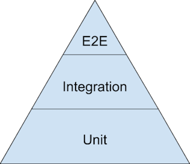
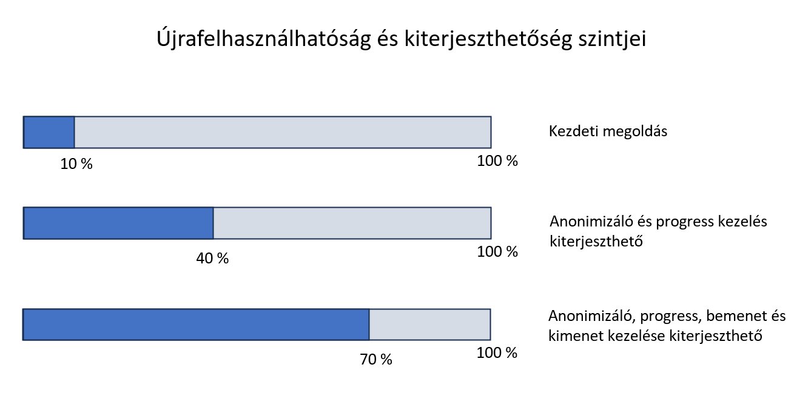

# 6. HA - Entwurfsmuster (Erweiterbarkeit) 

In dieser Hausaufgabe werden wir die im zugehörigen Labor ([Labor 6 – Entwurfsmuster (Erweiterbarkeit)](../../labor/6-tervezesi-mintak/index.md)) begonnene Datenverarbeitungs-/Anonymisierungsanwendung weiterentwickeln.

Die Hausaufgabe basiert auf dem Inhalt der Vorlesungen zu den Entwurfsmustern:
- Vorlesung 08 – Entwurfsmuster 1: Kapitel „Grundlegende Entwurfsmuster zur Erweiterbarkeit“ – Einführung, Template Method, Strategy, Open/Closed-Prinzip, SRP-Prinzip, weitere Techniken (Methodenreferenz/Lambda)
- Vorlesung 09 – Entwurfsmuster 1: Dependency Injection-Muster

Den praktischen Hintergrund für die Aufgaben bildet das [Labor 6 – Entwurfsmuster (Erweiterbarkeit)](../../labor/6-tervezesi-mintak/index.md).

Ziele der Hausaufgabe:

- Anwendung der relevanten Entwurfsmuster und weiterer Erweiterungstechniken
- Einübung von Konzepten zu Integrations- und Unit-Tests

Eine Beschreibung der benötigten Entwicklungsumgebung ist [hier](../fejlesztokornyezet/index_ger.md) zu finden. Für diese Hausaufgabe ist keine WinUI erforderlich (die Arbeit erfolgt im Kontext einer Konsolenanwendung), sodass sie z. B. auch unter Linux/MacOS durchgeführt werden kann.

## Das Verfahren für die Abgabe

Auf Moodle soll ein ZIP-Archiv hochgeladen werden, das den folgenden Anforderungen entspricht:

- Die Aufgaben bauen aufeinander auf, deshalb genügt es, den resultierenden Quellcode am Ende der letzten Aufgabe hochzuladen (Visual Studio Solution Verzeichnis). Der Name des Verzeichnisses soll "Entwurfsmuster_NEPTUN" sein (wobei NEPTUN Ihr Neptun-Code ist).
- Wir erwarten keine schriftliche Begründung oder Beschreibung, aber die komplexen Codeteile sollen mit Kommentaren versehen werden.
- Das ZIP-Archiv darf die Ausgabedateien (.exe) und die temporären Dateien nicht enthalten. Um diese zu löschen, soll Visual Studio geöffnet werden und im Solution Explorer mit Rechtsklick das „Clean Solution”-Menüelement gewählt werden. Das manuelle Löschen der Verzeichnisse "obj" und "bin" kann ebenfalls nötig sein.
- :exclamation: In den Aufgaben werden Sie aufgefordert, einen **Screenshot** von einem Teil Ihrer Lösung zu machen, da dies beweist, dass Sie Ihre Lösung selbst erstellt haben. **Der erwartete Inhalt der Screenshots ist immer in der Aufgabe angegeben.** Die Screenshots sollten als Teil der Lösung abgegeben, also innerhalb des ZIP-Archivs auf Moodle hochgeladen werden.
Wenn Sie Inhalte im Screenshot haben, die Sie nicht hochladen möchten, können Sie diese aus dem Screenshot ausblenden.

## Aufgabe 1

Die Grundlage zur Lösung dieser Hausaufgabe ist Folgendes:

- Kenntnisse des Strategy- und des zugehörigen Dependency Injection (DI)-Entwurfsmusters
- Genaues Verständnis der Anwendung dieser Muster im Kontext der Laboraufgabe (Anonymisierer)

Der Ausgangszustand der Hausaufgabe entspricht dem Endzustand des 6. Labors: Im Solution-Ordner der Hausaufgabe ist dies das Projekt „Strategy-DI“. Zum Ausführen/Debuggen muss dieses als Startprojekt eingestellt werden (Rechtsklick, "*Set as Startup Project*"). Der Quellcode sollte sorgfältig durchgelesen und verstanden werden.

- In der Datei `Program.cs` befinden sich drei `Anonymizer`-Instanzen, die mit unterschiedlichen Strategy-Implementierungen parametrisiert sind. Zum Einstieg empfiehlt es sich, diese nacheinander auszuführen und zu überprüfen, ob die Anonymisierung und Fortschrittsanzeige tatsächlich entsprechend der gewählten Strategy-Implementierungen erfolgen (Erinnerung aus dem Labor: Die Eingabedatei des Anonymisierers befindet sich im Ordner „bin\Debug\net8.0“ unter dem Namen „us-500.csv“, die Ausgabe in „us-500.processed.txt“ im selben Verzeichnis).
- Es ist ebenfalls sinnvoll, ausgehend von `Program.cs` Haltepunkte zu setzen und den Code Schritt für Schritt durchzugehen (dies hilft beim Wiederholen und vollständigen Verständnis).

!!! note "Dependency Injection (manuell) vs. Dependency Injection Container"
    Im Labor sowie in dieser Hausaufgabe verwenden wir die einfache, manuelle Variante der Dependency Injection (auch in der Vorlesung behandelt). In diesem Fall werden die Abhängigkeiten einer Klasse manuell instanziiert und über den Konstruktor übergeben. In komplexeren Anwendungen wird häufig ein Dependency Injection Container verwendet, in den registriert werden kann, welche Implementierung für einen bestimmten Interface-Typ verwendet werden soll. Der Einsatz solcher DI-Container ist nicht Teil der Lehrveranstaltung. Die manuelle Variante hingegen schon – und sie ist besonders wichtig, da ohne sie der Einsatz des Strategy-Musters keinen Sinn ergibt.

:warning: Beantworte in eigenen Worten kurz die folgenden Fragen in der Datei `readme.md` *Feladatok*:

- Was ermöglicht das Strategy-Muster in Kombination mit Dependency Injection im Rahmen des Laborbeispiels, und was sind die Vorteile ihrer gemeinsamen Verwendung?
- Was bedeutet es, dass durch die Anwendung des Strategy-Musters das Open/Closed-Prinzip in der Lösung umgesetzt wird? (Hinweise zum Open/Closed-Prinzip findest du in der Vorlesung und im Labor-Material.)

## Aufgabe 2 – Null Strategy

Wenn wir die Konstruktorparameter von `Anonymizer` betrachten, sehen wir, dass als Progress-Strategie auch `null` übergeben werden kann. Das ist logisch, denn es ist möglich, dass der Benutzer von `Anonymizer` keine Fortschrittsinformationen benötigt. Dieser Ansatz hat jedoch auch einen Nachteil: In diesem Fall ist die `_progress`-Instanzvariable innerhalb der Klasse `null`, und beim Verwenden muss eine Nullprüfung vorgenommen werden. Wir prüfen, ob beim Zugriff auf `_progress` tatsächlich eine Nullprüfung mit dem `?.`-Operator durchgeführt wird. Dies ist jedoch gefährlich, denn bei komplexeren Anwendungsfällen reicht eine einzige vergessene Nullprüfung, und zur Laufzeit tritt eine `NullReferenceException` auf. Solche Nullverweis-Fehler gehören zu den häufigsten Fehlerquellen.

Aufgabe:
Entwickle eine Lösung, die das oben beschriebene Fehlerpotenzial ausschließt. Tipp: Es wird eine Lösung benötigt, bei der `_progress` niemals `null` sein kann. Versuche zuerst selbstständig auf die Lösung zu kommen.

??? tip "Grundidee der Lösung"
    Der „Trick“ der Lösung besteht darin, eine `IProgress`-Strategie-Implementierung zu erstellen (z. B. mit dem Namen `NullProgress`), die dann verwendet wird, wenn keine Fortschrittsinformationen benötigt werden. Diese Implementierung tut bei der Fortschrittsverarbeitung nichts – der Funktionskörper bleibt leer. Wenn im Konstruktor von `Anonymizer` `null` als Progress-Parameter übergeben wird, erstellen wir dort ein `NullProgress`-Objekt und weisen dieses `_progress` zu. So kann `_progress` nie `null` sein, und alle Nullprüfungen können aus dem Code entfernt werden.

    Diese Technik hat auch einen Namen – sie wird als **Null Object** bezeichnet.

## Aufgabe 3 – Testbarkeit

Wir erkennen, dass das Verhalten der `Anonymizer`-Klasse noch viele Aspekte enthält, die durch eine unserer Lösungen erweiterbar gemacht werden könnten. Dazu gehören unter anderem:

* **Eingabeverarbeitung**: Aktuell wird nur dateibasiert im CSV-Format unterstützt.
* **Ausgabeverarbeitung**: Aktuell wird nur dateibasiert im CSV-Format unterstützt.

Aus Gründen des SRP-Prinzips sollte man diese Verantwortlichkeiten von der Klasse abtrennen und in eigene Klassen auslagern (wiederhole, was das SRP-Prinzip bedeutet). Die Abtrennung muss jedoch nicht unbedingt in erweiterbarer Weise erfolgen, da kein Bedarf besteht, mit unterschiedlichen Ein- und Ausgaben arbeiten zu können. Daher würden wir bei dieser Abtrennung kein Strategy-Muster anwenden.

Es gibt jedoch noch einen kritischen Aspekt, den wir bisher nicht besprochen haben (und der in älterer klassischer Literatur zu Entwurfsmuster oft nicht erwähnt wird). Das ist die **Einheitstestbarkeit**.

Im Moment können wir für unsere `Anonymizer`-Klasse automatische **Integrationstests** schreiben, aber keine automatischen **Unit-Tests**:

* Integrationstests prüfen die gesamte Funktionalität als Ganzes: Dazu gehört die Eingabeverarbeitung, die Datenverarbeitung und die Erstellung der Ausgabe. In unserem Beispiel ist das einfach: Wir erzeugen bestimmte Eingabe-CSV-Dateien und überprüfen, ob die erwarteten Ausgabedateien erzeugt werden.
* Integrationstests können sehr langsam sein: Häufig werden die Eingaben aus Dateien, Datenbanken oder Cloud-Diensten gelesen, und auch die Ausgaben erfolgen dorthin. Bei einem größeren Produkt – mit tausenden Tests – kann diese Langsamkeit ein limitierender Faktor sein: Wir können die Tests seltener ausführen und/oder keine gute Testabdeckung erreichen.

Aus diesem Grund erreichen wir oft eine höhere Codeabdeckung nicht mit den langsameren Integrations-, sondern mit sehr schnell laufenden **Unit-Tests**. Diese testen **einzelne logische Einheiten im Code völlig ohne langsamen Datei-/Datenbank-/Netzwerk-/Cloudzugriff** – und das blitzschnell. So können viele Tests in kurzer Zeit ausgeführt werden, mit guter Testabdeckung.

!!! note "Testpyramide"
    Dies wird oft mit einer Testpyramide veranschaulicht, von der es verschiedene Varianten in der Literatur gibt. Eine einfache Version sieht folgendermaßen aus:

    

    Je weiter oben wir uns in den Schichten der Pyramide befinden, desto umfassender sind zwar die Tests, aber desto langsamer und teurer sind sie auch in der Ausführung. Daher erstellen wir von diesen in der Regel weniger (was auch zu einer geringeren Codeabdeckung führt). An der Spitze der Pyramide befinden sich automatische E2E- (End-to-End) oder GUI-Tests. Darunter befinden sich Integrations-Tests, die mehrere Einheiten/Module zusammen testen. Die Basis der Pyramide bilden die Unit-Tests – von diesen erstellen wir am meisten (die Basis der Pyramide ist am breitesten).

    Fun Fact: Wenn während der Produktentwicklung über längere Zeit keine Unit-Tests erstellt werden, wird es – da die Code-Struktur dies nicht unterstützt – im Nachhinein sehr schwierig, Unit-Tests zu schreiben. Es gibt dann nur sehr wenige davon, ergänzt durch einige Integrationstests und eine große Anzahl von End-to-End-/GUI-Tests, die oft von Testteams erstellt werden (damit lässt sich aber bei komplexen Produkten oft keine gute Testabdeckung erzielen). Im Gegensatz zur Pyramide hat das die Form eines Eisbechers – man muss sich nur ein paar Kugeln oben vorstellen. Dies wird auch scherzhaft das „Eiscreme-Muster“ genannt (und das ist nicht die Sorte Eis, die wir mögen). Man sollte aber bedenken: Alles muss im richtigen Kontext gesehen werden – es gibt Ausnahmen (z. B. Anwendungen, in denen einzelne Teile kaum Logik enthalten und die Integration sehr einfacher Komponenten im Vordergrund steht – dort sind Integrationstests natürlich dominanter).

Die Klassen sind im Normalfall oft nicht unit-testbar. In ihrer aktuellen Form ist auch der `Anonymizer` so aufgebaut. Er ist fest darauf ausgelegt, nur mit langsamen dateibasierten Eingaben zu arbeiten. Aber wenn wir z. B. die Logik der Methode `Run` unit-testen möchten, ist es völlig egal, ob die Daten langsam aus einer Datei kommen oder wir einfach im Code mit dem `new`-Operator ein paar `Person`-Objekte zur Testzwecken erstellen (um Größenordnungen schneller).

Die Lösung – um unseren Code unit-testbar zu machen – ist einfach:

- :warning:
  *Durch Anwendung des Strategy-(+DI)-Musters (oder Delegates) trennen wir die testbehindernden oder -verlangsamenden Logiken (z. B. Ein-/Ausgabeverarbeitung) von der zu testenden Klasse ab. Dafür erstellen wir Implementierungen für die reale Logik sowie sogenannte Mock-Implementierungen zur Unterstützung des Testens.*

- :warning:
  *Dementsprechend verwenden wir das Strategy-Muster oft nicht, weil unterschiedliche Kundenanforderungen verschiedene Verhaltensweisen erfordern, sondern damit unser Code unit-testbar ist.*

Dementsprechend erstellen wir eine für Unit-Tests vorbereitete Version unserer Lösung, bei der die Ein- und Ausgabe mittels des Strategy-Musters vom Hauptprozess getrennt wird.

Aufgabe: Passe die Lösung im Projekt "Strategy-DI" so an, dass die Klasse mittels des Strategy-Musters unit-testbar ist. Im Detail:

- Erstelle einen Ordner `InputReaders` und definiere darin ein Strategy-Interface für die Eingabeverarbeitung namens `IInputReader` (mit einer einzigen Methode `List<Person> Read()`), und lagere die Eingabeverarbeitung entsprechend dem Strategy-Muster aus der `Anonymizer`-Klasse in eine Strategy-Implementierung namens `CsvInputReader` aus. Diese Klasse erhält im Konstruktor den Pfad zur Datei, aus der die Eingabe gelesen wird.
- Erstelle einen Ordner `ResultWriters` und definiere darin ein Strategy-Interface für die Ausgabe namens `IResultWriter` (mit einer einzigen Methode `void Write(List<Person> persons)`), und lagere die Ausgabeverarbeitung entsprechend dem Strategy-Muster aus der `Anonymizer`-Klasse in eine Strategy-Implementierung namens `CsvResultWriter` aus. Diese Klasse erhält im Konstruktor den Pfad zur Datei, in die geschrieben werden soll.
- Erweitere die `Anonymizer`-Klasse inklusive ihres Konstruktors (Strategy + DI-Muster), sodass sie mit beliebigen Implementierungen von `IInputReader` und `IResultWriter` verwendet werden kann.
- Passe die Nutzung der `Anonymizer`-Klasse in der Datei `Program.cs` so an, dass die neu eingeführten Klassen `CsvInputReader` und `CsvResultWriter` als Parameter übergeben werden.

Der nächste Schritt wäre die Erstellung von Unit-Tests für die `Anonymizer`-Klasse. Dazu müssen sogenannte Mock-Strategieimplementierungen eingeführt werden, die nicht nur Testdaten liefern (schnell, ohne Dateizugriff), sondern auch Prüfungen vornehmen (ob eine bestimmte logische Einheit korrekt funktioniert). Das klingt jetzt kompliziert, aber zum Glück bieten die meisten modernen Frameworks Bibliotheken zur Unterstützung an (in .NET z.B. [moq](https://github.com/devlooped/moq)). Die Anwendung solcher Tools geht jedoch über den Rahmen dieses Kurses hinaus, deshalb beenden wir hier den Abschnitt zur Unit-Testbarkeit.

Am Ende der Aufgabe solltest du durch Überprüfung der Ausgabedatei sicherstellen, dass die Anonymisierung tatsächlich durchgeführt wurde!

!!! example "Aufgabe 3 - ABGABE"
    - Füge einen Screenshot ein, auf dem der Konstruktor der `Anonymizer`-Klasse sowie die Implementierung der Methode `Run` zu sehen sind (`f3.1.png`).

## Aufgabe 4 – Verwendung von Delegates

Heutzutage verbreiten sich in ehemals streng objektorientierten Sprachen zunehmend Werkzeuge, die funktionale Programmierung unterstützen, und Anwendungsentwickler nutzen diese auch immer lieber (denn damit lässt sich oft mit deutlich kürzerem Code und weniger „Zeremonie“ dasselbe erreichen). Ein solches Werkzeug in C# ist der delegate und damit verbunden der Lambda-Ausdruck.

Wie wir im Laufe des Semesters gesehen haben, ermöglichen Delegates das Schreiben von Code, bei dem bestimmte Logiken/Verhaltensweisen nicht fest einprogrammiert sind, sondern „von außen“ übergeben werden. Zum Beispiel kann man einer Sortierfunktion als Delegate übergeben, wie zwei Elemente zu vergleichen sind oder nach welchem Feld/Eigenschaft der Vergleich erfolgen soll (wodurch letztlich die gewünschte Sortierreihenfolge bestimmt wird).

Dementsprechend ist die Verwendung von Delegates eine weitere Alternative (neben Template Method und Strategy), um Code wiederverwendbar/erweiterbar zu machen und Erweiterungspunkte einzuführen.

Im nächsten Schritt wandeln wir die zuvor mit dem Strategy-Muster umgesetzte Fortschrittsanzeige in eine delegate-basierte Lösung um (wir führen keine neue Funktionalität ein – es handelt sich lediglich um eine „technische“ Umstrukturierung).

Aufgabe: Passe die Lösung im Projekt *Strategy-DI* so an, dass die Fortschrittsverarbeitung statt mit Strategy- nun mit Delegate-Ansatz umgesetzt ist. Im Detail:

- Definiere keinen eigenen Delegatetyp – verwende den von .NET bereitgestellten `Action`-Typ.
- Die bestehenden Klassen `SimpleProgress` und `PercentProgress` sollen in deiner Lösung nicht verwendet werden (aber auch nicht gelöscht werden!).
- Der Benutzer von `Anonymizer` soll weiterhin `null` an den Konstruktor übergeben können, wenn keine Fortschrittsanzeige gewünscht ist.
- Kommentiere die bisherige Verwendung von `Anonymizer` in der Datei `Program.cs` aus. Implementiere stattdessen ein neues Beispiel für die Verwendung von `Anonymizer`, bei der die Fortschrittsanzeige als Lambda-Ausdruck übergeben wird, welcher genau der früheren Logik von „Simple Progress“ entspricht. Für „Percent Progress“ ist keine entsprechende Implementierung nötig (darauf kommen wir in der nächsten Aufgabe zurück).

!!! tip "Tipps"
    - Der Delegate-Ansatz ist im Prinzip sehr ähnlich zum Strategy-Muster – nur dass die Klasse statt Strategieobjekten (über Schnittstellenverweise) Delegates erhält und speichert, und dann die referenzierten Funktionen an den Erweiterungspunkten aufruft.
    - Etwas Ähnliches hast du übrigens schon bei der zweiten Hausaufgabe im Teil *ReportPrinter* gemacht ;).

!!! example "Aufgabe 4 – ABGABE"
    - Füge einen Screenshot ein, auf dem der Konstruktor der `Anonymizer`-Klasse sowie die Implementierung der `Run`-Methode zu sehen sind (`f4.1.png`).
    - Füge einen Screenshot ein, auf dem der Inhalt der Datei `Program.cs` (insbesondere die neuen Teile) zu sehen ist (`f4.2.png`).

## Aufgabe 5 – Verwendung von Delegates mit wiederverwendbarer Logik

In der vorherigen Aufgabe sind wir davon ausgegangen, dass die Logik von „Simple Progress“ und „Percent Progress“ jeweils nur einmal verwendet wird, daher mussten wir sie nicht wiederverwendbar machen. Entsprechend wurde z. B. die Logik für „Simple Progress“ in der einfachstmöglichen Form, als Lambda-Ausdruck, übergeben (es war nicht notwendig, dafür eine separate Methode zu definieren). Wenn wir dem Konstruktor von `Anonymizer` jedes Mal eine andere Delegate-Implementierung übergeben, ist diese Lambda-basierte Lösung perfekt geeignet.

Aber was passiert, wenn wir z. B. die „Simple Progress“-Logik an mehreren Stellen und für mehrere `Anonymizer`-Objekte wiederverwenden möchten? Ein Kopieren des Lambda-Ausdrucks mittels Copy-Paste wäre ein schwerer Fehler – es würde zu Code-Duplikation führen (was dem Prinzip „**Do Not Repeat Yourself**“, kurz **DRY**, widerspricht).

Frage: Gibt es eine Möglichkeit, auch bei Delegates wiederverwendbaren Code zu definieren? Natürlich, denn bei Delegates ist man nicht auf Lambda-Ausdrücke beschränkt: Man kann auch ganz normale Methoden (ob statisch oder nicht) verwenden – wie wir es bereits im Verlauf des Semesters mehrfach getan haben.

Wenn wir also die Logik(en) für „Simple Progress“ und/oder „Percent Progress“ bei Verwendung von Delegates wiederverwendbar machen möchten, sollten wir diese in separate Methoden in eine geeignete Klasse auslagern, und genau solche Methoden dann als Parameter an den `Anonymizer`-Konstruktor übergeben.

Aufgabe: Erweitere die bisherige Lösung so, dass die Logiken für „Simple Progress“ und „Percent Progress“ wiederverwendbar sind. Im Detail:

- Implementiere die Logiken für „Simple Progress“ und „Percent Progress“ jeweils in einer statischen Methode der neu eingeführten statischen Klasse `AllProgresses` (diese Klasse soll im Projekt-Hauptverzeichnis angelegt werden).
- Ergänze in der Datei `Program.cs` zwei neue `Anonymizer`-Verwendungen zusätzlich zu den bestehenden, welche je eine Methode der Klasse `AllProgresses` verwenden (hier bitte keine Lambda-Ausdrücke verwenden).
- Das bestehende `IProgress`-Interface sowie dessen Implementierungen könnten nun gelöscht werden (da sie nicht mehr verwendet werden). Aber: **Lösche sie nicht**, damit auch die Progress-Logik deiner vorherigen Lösung weiterhin überprüfbar bleibt.

Wir sind fertig, prüfen wir die Lösung:

- Es lässt sich feststellen, dass die delegate-basierte Lösung mit weniger „Zeremonie“ auskommt als das Strategy-Muster: Es war nicht notwendig, eigene Schnittstellen und Implementierungsklassen zu erstellen (wir konnten die eingebauten generischen Delegatetypen `Action` und `Func` verwenden).
- Für völlig situationsabhängige Logik ist die Übergabe per Lambda-Ausdruck am einfachsten. Für wiederverwendbare Logik sollten wir hingegen klassische, wiederverwendbare Methoden definieren.

!!! example "Aufgabe 5 – ABGABE"
    - Füge einen Screenshot ein, auf dem der Inhalt der Datei `AllProgresses.cs` zu sehen ist (`f5.1.png`).
    - Füge einen Screenshot ein, auf dem der Inhalt der Datei `Program.cs` (insbesondere die neuen Teile) zu sehen ist (`f5.2.png`).

## Begriff der Refaktorisierung (Refactoring)

Während der Laborübung und der Hausaufgabe haben wir den Code mehrmals so umgestaltet, dass sich das äußere Verhalten der Anwendung nicht verändert hat, sondern nur der interne Aufbau. Ziel war es, den Code aus irgendeinem Blickwinkel qualitativ zu verbessern. Dies nennt man `Refaktorisierung` (englisch: `refactoring`). Dies ist ein sehr wichtiger Begriff und wird im Arbeitsalltag häufig angewendet. Es gibt eine eigene Fachliteratur dazu, und mit den wichtigsten Techniken sollte man sich später vertraut machen. Fortgeschrittene Entwicklungsumgebungen unterstützen einige Refaktorisierungsschritte direkt: Visual Studio gehört hierbei nicht zu den stärksten Tools, unterstützt aber einige grundlegende Operationen (z. B. Extract Method, Extract Base Class usw.). Wir haben Refaktorisierung manuell geübt – es wird keine eigene Aufgabe mehr dazu geben, aber den Begriff Refaktorisierung muss man kennen.

## Optionale Aufgabe 6 – Erstellung eines Integrationstests

Für die Lösung dieser Aufgabe kannst du +1 IMSc-Punkt erhalten.

In der früheren Aufgabe 3 haben wir das Konzept des Integrationstests besprochen. Ziel dieser optionalen Aufgabe ist es, dieses Konzept an einem einfachen Beispiel zu üben und besser zu verstehen.

Erstelle einen Integrationstest für die Klasse `Anonymizer` wie folgt:

1. Arbeite im Projekt `IntegrationTest`, das sich im Ordner `Test` innerhalb der Solution befindet. Es handelt sich dabei um ein NUnit-Testprojekt.
2. In diesem Projekt wurde bereits eine Projektverknüpfung zum `Strategy-DI`-Projekt eingerichtet. Dadurch sind die (öffentlichen) Klassen aus dem `Strategy-DI`-Projekt sichtbar. Dies ist selbstverständlich Voraussetzung dafür, dass wir sie testen können. Überprüfe im Solution Explorer unter Dependencies/Projects, ob die Referenz vorhanden ist.
3. In der Klasse `AnonymizerIntegrationTest` ist bereits eine Methode mit dem Namen `Anonymize_CleanInput_MaskNames_Test` vorhanden, die als Test vorbereitet ist (Testmethoden werden mit dem Attribut `[Test]` versehen – das ist hier bereits geschehen). Der Methodenkörper ist noch leer, dort sollen die folgenden Schritte gemacht werden:
    1. Erstelle ein `Anonymizer`-Objekt, das
        * die Eingabedatei `@"TestFiles\us-500-01-clean.input.csv"` verwendet (diese befindet sich im Ordner *TestFiles* des Projekts – schau dir den Inhalt an),
        * die Ausgabedatei `@"us-500-01-maskedname.processed.txt"` schreibt,
        * den Algorithmus `NameMaskingAnonymizerAlgorithm` mit dem Parameter `"***"` verwendet.
    2. Führe den Anonymizer aus, indem du die Methode `Run` aufrufst, sodass die Ausgabedatei erstellt wird.
    3. Verwende `Assert.AreEqual`, um zu prüfen, ob der Inhalt der erstellten Ausgabedatei mit dem erwarteten Inhalt übereinstimmt. Die erwartete Ausgabe ist in der Datei `@"TestFiles\us-500-01-maskedname.processed-expected.txt"` enthalten (ebenfalls im Ordner `TestFiles` – schau sie dir an).
       Tipp: Der Inhalt einer Datei kann z. B. mit der statischen Methode `File.ReadAllBytes` in einem Schritt gelesen werden.
4. Überprüfe, ob der Integrationstest fehlerfrei ausgeführt wird:
    1. Baue das Projekt (Build)
    2. Öffne den Test Explorer (Menü Test > Test Explorer)
    3. Führe den Test über die Schaltflächen in der Symbolleiste oben im Test Explorer aus. Alternativ kannst du den Test auch debuggen: Rechtsklick auf den Test > „Debug“ – das ist sehr hilfreich, wenn der Test fehlschlägt und du mit Haltepunkten Schritt für Schritt den Code durchgehen und Variablenwerte überprüfen möchtest.
    4. Wenn der Test fehlerfrei durchläuft, wird das zugehörige Symbol grün angezeigt. Bei Fehlern wird es rot, und im unteren Bereich des Test Explorers erhältst du weitere Informationen zur Fehlermeldung.

## Optionale Aufgabe 7 – Erstellung eines Unit-Tests

Mit der Lösung dieser Aufgabe können +2 IMSc-Punkte erzielt werden.

Im Rahmen der vorherigen Aufgabe 3 wurde das Konzept des Unit-Tests vorgestellt. Ziel dieser optionalen Aufgabe ist es, dieses Konzept zu üben und besser zu verstehen – anhand einer konkreten Aufgabe.

Vorbereitung:

1. Füge der Solution ein neues Projekt vom Typ „NUnit Test Project“ mit dem Namen „UnitTest“ hinzu (Rechtsklick auf die Solution im Solution Explorer/Add/New Project).
2. Füge in diesem neuen Projekt eine Projektreferenz zum Projekt `Strategy-DI` hinzu, damit die im Projekt `Strategy-DI` definierten Typen verfügbar sind (Rechtsklick auf den Knoten „Dependencies“ im UnitTest-Projekt/Add Project Reference, Häkchen bei `Strategy-DI` in dem angezeigten Fenster, dann „OK“).
3. In dem Projekt wird eine Datei `UnitTest1.cs` mit einer `Test`-Klasse erstellt. Es ist empfehlenswert, diese in `AnonymizerTest` umzubenennen.

Erstelle einen Unit-Test für die Klasse `Anonymizer`, der überprüft, ob die Methode `Run` den Anonymisierungsalgorithmus genau mit denjenigen Personendaten in der richtigen Reihenfolge aufruft, die vom `Anonymizer` aus dem Eingabestrom eingelesen wurden (sofern keine Städtenamen zu kürzen sind).

- Der Name der Testmethode soll `RunShouldCallAlgorithmForEachInput` sein.
- :exclamation: Es ist entscheidend, dass ein sehr schneller Unit-Test geschrieben wird, kein Integrationstest: Wir wollen ausschließlich die Logik der Methode `Run` testen ohne jegliche Dateiverarbeitung. Die Lösung darf keine Dateiverarbeitung haben!
- Tipp: Erstelle 2–3 `Person`-Objekte im Speicher und verwende diese als Eingabe.
- Tipp: Verwende Personendaten, auf die die Funktion `TrimCityNames` keinen Einfluss hat (d. h. ohne zu entfernende Inhalte), um den Test zu vereinfachen.
- Tipp: Erstelle eigene Implementierungen von `IInputReader` und `IAnonymizerAlgorithm` (und verwende den `Anonymizer` damit), **die passende Testdaten liefern und/oder zur Laufzeit Daten sammeln, damit nach dem Ausführen überprüft werden kann, ob die Bedingungen erfüllt wurden**. Diese Strategy-Implementierungen sollen ausschließlich im Testprojekt erstellt werden, da sie nur für Testzwecke gedacht sind.

Zur weiteren Übung kannst du auch einen weiteren Unit-Test erstellen, der überprüft, ob alle Eingabedaten auch in der Ausgabe enthalten sind.

## Zusammenfassung

Es wird keine weiteren Aufgaben geben 😊. Aber wenn du zum Beispiel neugierig bist, wie perfekt oder unvollständig die aktuelle Lösung ist, oder wann es sinnvoll ist, mit der Template Method, der Strategy oder eher mit Delegaten zu arbeiten, dann solltest du das Folgende lesen, in dem wir die im Labor begonnene und im Rahmen der Hausaufgabe abgeschlossene Lösung bewerten.

### Überblick über unseren Arbeitsprozess

* Bei den sich verändernden Anforderungen sind Entwurfsmuster organisch aufgetaucht, und wir haben während der Refaktorisierungen andere Techniken eingeführt. Das ist völlig natürlich, und in der Praxis arbeiten wir oft so.
* Bei einer komplexeren Aufgabe beginnen wir normalerweise – besonders wenn wir noch nicht viel Erfahrung haben – mit einer einfacheren Implementierung (die wir zunächst verstehen) und passen sie so an, dass sie die gewünschten Erweiterbarkeit-/Wiederverwendbarkeitseigenschaften im gegebenen Kontext erfüllt.

### Wiederverwendbarkeit und Erweiterbarkeit der einzelnen Lösungen

Wir können versuchen, grafisch darzustellen, wie sich unsere Lösung mit den einzelnen Iterationen immer mehr in Richtung Wiederverwendbarkeit und Erweiterbarkeit entwickelt hat:

Natürlich sollte man die % Werte nicht zu ernst nehmen. Jedenfalls ist die Entwicklung gut erkennbar.

??? note "Warum ist der endgültige Wert „nur“ 70%?"
    Eine Frage, die aufkommen könnte: Warum geben wir der Lösung nur etwa 70%? Unter anderem:

    * In der `Anonymizer`-Klasse ist die Art der Datenbereinigung fest eingebaut (Trimmen einer bestimmten Spalte auf eine bestimmte Weise).
    * Wir haben ein sehr wichtiges allgemeines Prinzip nicht befolgt: Die Trennung von UI und Logik. Unser Code schreibt an mehreren Stellen in die Konsole, sodass er zum Beispiel nicht mit einer grafischen Oberfläche verwendet werden kann!
    * Einige unserer Anonymisierungsalgorithmen sind sehr spezifisch. Es könnten allgemeinere Algorithmen entwickelt werden, die beliebige Felder mit Sternchen versehen (nicht nur den Namen fest eingebaut), oder beliebige Felder maskieren (nicht nur das Alter).
    * Die derzeitige Lösung funktioniert nur mit `Person`-Objekten.
    * Es ist nicht möglich, verschiedene Anonymisierungsalgorithmen gleichzeitig zu kombinieren.

### Überblick über Erweiterungstechniken

* **Template Method**: In einfachen Fällen, wenn nicht viele Kreuzkombinationen der Verhaltensaspekte unterstützt werden müssen, bietet dies eine sehr bequeme und einfache Lösung, insbesondere wenn wir die Vererbung ohnehin verwenden müssen. Es führt jedoch zu einer Basisklasse, die schwer oder gar nicht einheitlich testbar ist.
* **Strategy**: Bietet eine sehr flexible Lösung und führt nicht zu einer kombinatorischen Explosion, wenn die Klasse in mehreren Aspekten erweitert werden muss und wir diese in verschiedenen Kreuzkombinationen verwenden wollen. Oft wenden wir es nur an, um die Abhängigkeiten unserer Klasse durch Schnittstellen abzukoppeln und so die Testbarkeit unserer Klasse zu gewährleisten.
* **Delegate/Lambda**: Dieser Ansatz ist weniger "feierlich" als die Anwendung der Strategy, da keine Schnittstellen und Implementierungsklassen eingeführt werden müssen. Daher verbreitet sich die Verwendung zunehmend (rasch) auch in modernen objektorientierten Sprachen. Besonders vorteilhaft wird er, wenn wir Verhaltensweisen nicht wiederverwendbar machen wollen (denn dann definieren wir diese einfach mit einem Lambda-Ausdruck, ohne neue Klassen oder zusätzliche Funktionen einzuführen).

Es lohnt sich, zu sammeln, wann Strategy einen Vorteil gegenüber Delegaten hat:

* Wenn mehrere (je mehr desto besser) Operationen zu einem Aspekt der erweiterten Klasse gehören. In diesem Fall fasst das Strategy-Interface diese "automatisch" gut zusammen und gruppiert sie (wie in unserem Beispiel das `IAnonymizerAlgorithm`-Interface mit den Operationen `Anonymize` und `GetAnonymizerDescription`). Diese erscheinen entsprechend auch zusammen in den Implementierungen der Schnittstelle (bei Delegaten gibt es diese Gruppierung nicht). Dies kann die Lösung transparenter machen und bei vielen Operationen eindeutigere Ergebnisse liefern.
* Wenn die betreffende Sprache rein objektorientiert ist und die Anwendung von Delegaten/Lambdas nicht unterstützt wird. Aber glücklicherweise unterstützen heute fast alle modernen OO-Sprachen dies in irgendeiner Form (auch Java und C++).
* Die Strategy-Implementierungen können in ihren Instanzvariablen auch Zustände speichern, die bei ihrer Erstellung übergeben werden. Dies haben wir auch genutzt (im Fall von `NameMaskingAnonymizerAlgorithm` war dies die `_mask`, bei `AgeAnonymizerAlgorithm` die `_rangeSize`). Das bedeutet nicht, dass wir in diesen Fällen keine Delegaten verwenden können, denn:
    * Diese Daten könnten auch als neue Parameter in den Funktionsaufrufen der einzelnen Delegaten übergeben werden,
    * oder bei der Verwendung von Lambdas können die Lambda-Funktionen durch den Mechanismus der „variable capture“ den Zustand aus ihrer Umgebung übernehmen.

    Diese Lösungen sind jedoch nicht immer anwendbar oder zumindest könnte ihre Anwendung umständlich sein.

Es muss auf jeden Fall erwähnt werden, dass nicht nur die hier angesprochenen Muster die Erweiterbarkeit und Wiederverwendbarkeit fördern, sondern praktisch alle. Wir haben einige hervorgehoben, die (zusammen mit z.B. der Observer/Iterator/Adapter) vielleicht am häufigsten und breitesten angewendet werden und auch in Frameworks auftauchen.

Wenn du bis hierhin gelesen hast, verdient es auf jeden Fall ein extra Daumen hoch 👍!