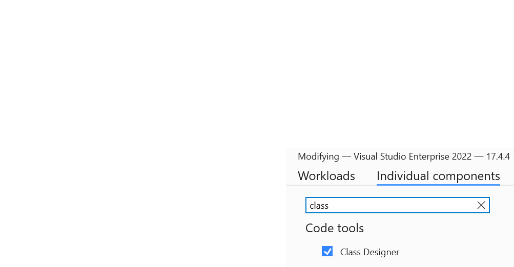

# Fejlesztőkörnyezet házi feladatokhoz

## Bevezetés

A félév során a házi feladatok megoldásához a **Visual Studio 2022** fejlesztőkörnyezetet kell használni (a Visual Studio for Mac nem alkalmas). Ennek futtatásához Windows operációs rendszerre van szükség.  Ha telepítve van már a gépünkre a Visual Studio 2022, akkor a Start menüből indítsuk el a „Visual Studio Installer”-t. Ez induláskor ellenőrzi, érhető-e el Visual Studio-ból újabb változat online, és ha igen, az Update gombra kattintva indítsuk is el a legfrissebb verzió telepítését.

??? note  "Miért is van szükség Visual Studiora és Windowsra?"
    VS Code, illetve a Visual Studio for Mac a következők miatt nem használhatók:
    
    - Nem támogatják az UML (szerű) modellezést, melyre az első házi feladatnál szükség van.
    - Érdemben nem támogatják a *WinUI3* felhasználói felülettel rendelkező .NET alkalmazások fejlesztését (erre a 3. házi feladattól kezdődően építenek bizonyos házi feladatok).

### Visual Studio edition-ök

A Visual Studionak több kiadása létezik:

- A tárgy teljesítéséhez megfelel a Microsoft honlapjáról letölthető és ingyenesen használható *Community* edition.
- Természetesen a *Professional* és *Enterprise* változatok is használhatók, a tárgy vonatkozásában ugyanakkor ezek érdemi pluszt nem adnak. Ezek az egyébként fizetős változatok az egyetem hallgatói számára ingyenesen elérhetők (a https://azureforeducation.microsoft.com/devtools honlapon, az Azure Dev Tools for Teaching program keretében).

### Telepítendő komponensek

A tárgy első előadása röviden kitér a .NET különböző változataira (.NET Framework, .NET Core, .NET 5-8 és  stb.). A feladatok megoldásához a .NET 8-et használjuk a félév során. A Visual Studio ezt telepíti, de szükség van a ".NET desktop development" Visual Studio Workload telepítésére:

1. Visual Studio telepítő indítása (pl. a Windows Start menüben a „Visual Studio Installer” begépelésével).
2. Modify gombra kattintás
3. A megjelenő ablakban ellenőrizzük, hogy a **".NET desktop development"** kártya ki van-e pipálva.
4. Ha nincs, pipáljuk ki, majd a jobb alsó sarokban a *Modify* gombra kattintva telepítsük.

#### Class diagram támogatás

Bizonyos házi feladatok esetén (már az elsőnél is) szükség van Visual Studio Class Diagram támogatásra. Ezt a következőképpen tudjuk utólag telepíteni a Visual Studio alá:

1. Visual Studio telepítő indítása (pl. a Windows Start menüben a „Visual Studio Installer” begépelésével).
2. Modify gombra kattintás
3. A megjelenő ablakban "Individual components" fül kiválasztása
4. A keresőmezőbe "class designer" begépelése, majd győződjünk meg, hogy a szűrt listában a "Class Designer" elem ki van pipálva.
5. Ha nincs, pipáljuk ki, majd a jobb alsó sarokban a *Modify* gombra kattintva telepítsük.

    

#### WinUI támogatás

XAML/WinUI technológiákhoz kapcsolódó feladatok esetén (3. házi feladattól kezdődően) szükség van Windows App SDK előzetes telepítésére és bizonyos speciális gépi szintű beállítások módosítására.

1. A számítógépen engedélyezni kell a "Developer mode" ("Fejlesztői mód")-ot. A Windows Start menüben a "Developer settings"/"Fejlesztői funkciók"-ra érdemes keresni (annak függvényében hogy angol vagy magyar Windowst használunk).

2. A Visual Studio telepítőben győződjünk meg, hogy a ".NET Desktop Development" workload telepítve van (ha nincs, pipáljuk és telepítsük)

3. "Windows App SDK C# templates" Visual Studio komponens telepítése.
    
    A Visual Studio telepítőben válasszuk ki a ".NET Desktop Development" workload-ot, jobb oldalt az "Installation details" panelen alul pipáljuk a "Windows App SDK C# Templates" komponenst, majd jobb alsó sarokban "Modify" gomb. 

4. Windows App SDK telepítése
    
    A félév során laborokon és a házikban az "1.6.4 (1.6.250108002)" verziót használjuk, érdemes ezt telepíteni akkor is, ha újabb verzió jönne ki, mely innen érhető el: https://learn.microsoft.com/en-us/windows/apps/windows-app-sdk/downloads. Régebbi verziók itt elérhetőek, ha az újabbak között korábban nem szereplne: https://learn.microsoft.com/en-us/windows/apps/windows-app-sdk/older-downloads. Egy modern gépre az x64-es verziót kell telepíteni.

5. Ha a fentiek telepítése után Windows 11-en nem akarna működni, akkor fel kell tenni a Visual Studio telepítőben a Windows 10 SDK-ból a 10.0.19041-et, vagy újabbat (az Idividual Comopnents alatt található)

### MacBook és Linux használók számára információk

A tárgy felelős oktatójától (Benedek Zoltán) BME Cloud hozzáférés igénylelhető e-mailben.