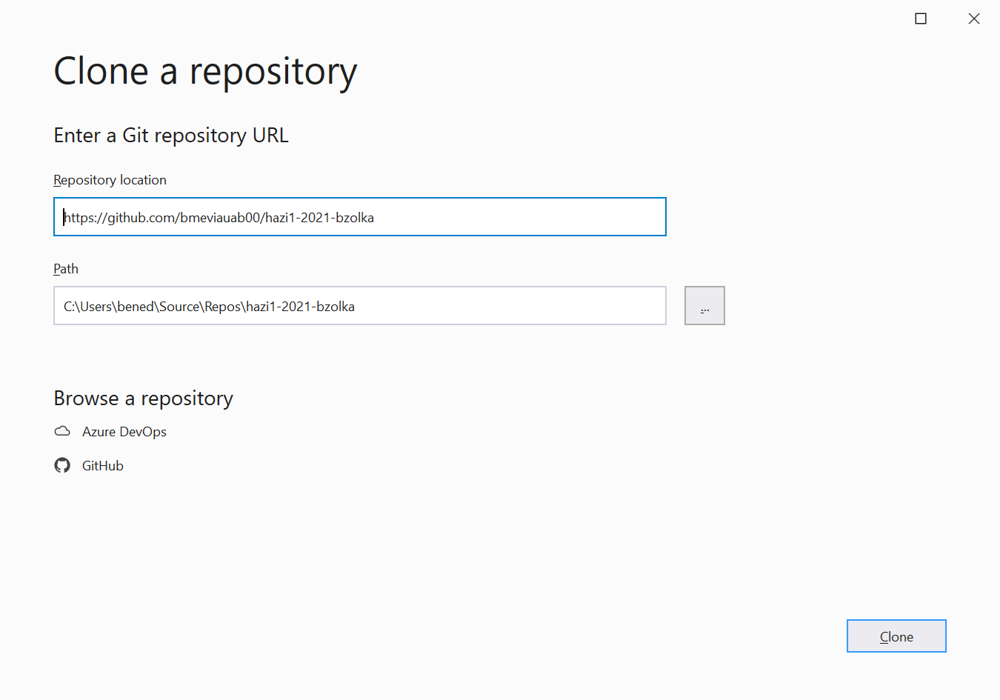
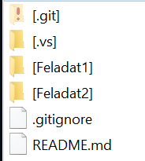
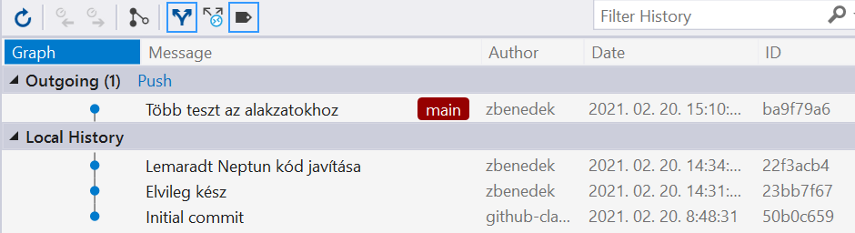

# A kiinduló alkalmazáskeret letöltésének és a feladat beadásának lépései

## Lépések

Az egyes házi feladatok kiinduló keretét  GitHub segítségével publikáljuk (a további házi feladatok vonatkozásában később hozunk döntést). A GitHub-on publikált házi feladatok kiinduló környezet letöltésének és a megoldás beadásának lépései a következők:

1. :exclamation: Az elindulással ne várd meg a határidő közeledtét, legalább a saját repó létrehozásáig juss el mielőbb. Így, ha bármi elakadás lenne, még időben tudunk segíteni.
2. Regisztrálj egy GitHub accountot (<https://github.com/>), ha még nem regisztráltál és lépj be vele GitHub-ra.
3. A feladathoz tartozó linket nyisd meg. Ez minden feladathoz más lesz, a tárgy AUT honlapján kerülnek meghirdetésre fokozatosan a félév folyamán. A formátuma a következőhöz hasonló: <https://classroom.github.com/abcdefgh>. Ha a hivatkozásra kattintva hibát kapsz ("There was a problem authenticating with GitHub, please try again."), copy-paste-tel másold be közvetlenül a böngésző címsorába a címet.
4. Ha kéri, adj engedélyt a GitHub Classroom alkalmazásnak, hogy használja az account adataidat.
5. Látni fogsz egy oldalt, ahol elfogadhatod a feladatot ("Accept this assignment"). Kattints a gombra.
6. Várd meg, amíg elkészül a repository. A GitHub nem mindig frissíti az oldalt magától, célszerű az oldal időnkénti kézi frissítésével próbálkozni (pl. F5 billentyű). Ha elkészült a repository, az oldal kiírja az új repository url-jét, amin kattintva a repository-ra lehet navigálni (ehhez hasonló: <https://github.com/bmeviauab00/hazi1-2023-username>).  De nem is feltétlen szükséges az url elmentése, a GitHub nyitóoldalán (https://github.com/) baloldalt a saját repository-k közt bármikor meg lehet később is találni.
7. Klónozd le a repository-t (ennek mikéntjére rövidesen visszatérünk). Ebben találni fogsz egy keretet, vagy kiinduló kódot. Ezen dolgozz, ezt változtasd.
8. :exclamation: A kiinduló projektben van egy .github/workflows mappa, ennek tartalmát tilos megváltoztatni, törölni stb.
9. :exclamation: A munka során a kiindulási repóban levő solutionben/projektben kell dolgozni, új projektet/solutiont ne hozz létre.
10. :exclamation: A repository gyökérmappájában található neptun.txt fájlba írd bele a Neptun kódod, csupa nagybetűvel. A fájlban csak ez a hat karakter legyen, semmi más.
11. Oldd meg a feladatot. Pushold a határidőig. Akárhány commitod lehet, a legutolsó állapotot fogjuk nézni.
12. Az eredményt a tárgy tanszéki portálján fogjuk meghirdetni a kapcsolódó számonkérés alatt az adott feladatra vonatkozó határidőt követő pár napon belül.
13. A házi feladatot külön explicit beadni nem kell, csak legyen fent GitHub-on határidőre a megoldás.
14.	:exclamation: Amikor a házi feladatod beadottnak tekinted,  célszerű ellenőrizni a böngészőben a GitHub webes felületén a repository-ban a fájlokra való rápillantással, hogy valóban minden változtatást push-oltál-e, és hogy a neptun.txt valóban ki van-e töltve.

A fenti lépések kapcsán két kérdés fogalmazódat meg bennünk:
• Hogyan klónozzuk (clone) a repónkat (mely a házi feladat kiinduló keretét tartalmazza)?
• Hogyan commit-áljunk és push-oljunk a Visual Studio segítségével GitHub-ra?
Az alábbiakban ezekre is kitérünk.

## GitHub repository klónozása

Két lehetőséget nézünk meg alább:

* Clone a GitHub webes felületéről indulva Visual Studioban
* Clone parancssorból

### Clone a GitHub webes felületéről indulva Visual Studioban

Egy (házi feladathoz tartozó) repository klónozásra számos mód van, egy lehetőség a következő. Nyissuk meg az elkészült repository online oldalát, melyre több módon eljuthatunk. Lehetőségek pl.:

* A repo létrehozásakor megjelenik a GitHub felületen az url, csak kattintani kell rajta.
* A GitHub nyitóoldalon (<https://github.com>) - ha be vagyunk lépve - listázódnak baloldalt azon repository-k, melyekhez van hozzáférésünk, csak kattintsunk a megfelelőn.
* Amikor elkészül a repónk (a GitHub classroom feladat elfogadása során), e-mail értesítést is kapunk róla, ebben is megtalálható a link.

Az oldal képe nagyjából megfelel a következőnek (az mindenképpen különbség, hogy a repó url végén mindenkinél a saját felhasználóneve szerepel):


Kattintsunk a zöld színű *Code* gombon, majd a lenyíló menüben az *"Open in Visual Studio"* linkre:


A böngészőnk ekkor jó eséllyel feldob egy ablakot (pl. a Chrome/Edge esetében a címsor alatt) melyben egy külön gombkattintással (*Open…*) tudjuk indítani a Visual Studio-t. A felkínált lehetőségnek lehet, kissé fura a neve, ha *"Microsoft Visual Studio Web Protocol Handler Selector"* néven hivatkozik rá, válasszuk ki bátran.
Ha minden jól megy, a Visual Studio elindul, és indulás után feldob egy ablakot, melyben a "Repository location" ki is van töltve a repository-nk URL-jével. A Path alatt adjuk meg, hogy hova szeretnénk a háttértárunkon clone-ozni, majd kattintsunk a *Clone* gombra:



Megjegyzés: ha nem működik a böngészőablakban az *"Open in Visual Studio"* vagy *"Microsoft Visual Studio Web Protocol Handler Selector"* hivatkozás, akkor indulhatunk egyből a Visual Studio-ból is. Csak indítsuk el a Visual Studio-t, és a startup ablakban válasszuk jobboldalt a *"Clone Repository"* gombot (vagy a startup ablakot átugorva válasszuk ki a *"Git/Clone Repository menüt"* a VS főablakában), melynek hatására a fenti ablak jelenik meg, a Repository URL-be pedig írjuk be a repónk URL-jét. A *Clone*-ra kattintva néhány másodperc alatt leklónozódik a repository a megadott célmappába. Pl. Windows Explorer-ben meg tudjuk tekinteni a létrehozott mappákat és fájlokat:



Ebből jól látható, hogy egy Git repository nem más, mint mappák és fájlok gyűjteménye, valamint egy a gyökérben található .git mappa, mely (némi egyszerűsítéssel élve) az egyes fájlok verziótörténetét tartalmazza.
Az első házi feladat kivételesen két fő részből áll, melyekhez eltérő solution tartozik. Az elsőhöz a Feladat1 mappában található MusicApp.sln fájlt, a másodikhoz a Feladat2-ben található Shapes.sln-t kell megnyitni. A megnyitást megtehetjük Explorerből, az adott .sln fájlon duplán kattintva. Ugyanakkor van erre más mód is: amennyiben Visual Studio-ban a Git gyökérmappát nyitottuk meg (a *Clone*-t követően is ez a helyzet állt elő) a Solution Explorer nézet fejlécében *"Switch View"* gombot lenyomva a Solution Explorer listázza a Git gyökérmappa alatti solution-öket, és ezek bármelyikén duplán kattintva az adott solution megnyílik:


### Clone parancssorból

Parancssorban navigáljunk abba a mappába, ahová a forráskódot ki szeretnénk clone-ozni, és itt adjuk ki a következő parancsot:
`git clone <repo url>`
, ahol a `<repo url>` a repositorynk címe (pl. böngésző címsávjából bemásolva, ehhez hasonló: https://github.com/bmeviauab00/hazi1-2022-bzolka).

!!! note "Parancssori git"
    Ne féljünk a parancssori git-et használni, egy repository clone-ozásának tulajdonképpen ez a legegyszerűbb módja.
    
    Amennyiben a parancs futtatása során azt tapasztaljuk, hogy a git parancsot nem ismeri fel a környezet, annak oka valószínűleg az, hogy nem telepítettünk még a parancssori gitet a gépünkre. Erről bővebben [itt](../git-github-github-classroom/index.md#git-telepitese).

# Napi Git munka Visual Studio segítségével (commit, push)

Miután leklónoztuk az adott házi feladathoz tartozó GitHub repository-t a számítógépünkre, és ennek során létrejött a lokális Git repository-nk, a benne levő .sln fájlokat Visual Studioban megnyitva pont úgy dolgozunk – veszünk fel új fájlokat, módosítunk/törlünk meglévőket – mintha a fájlok nem is tartoznának semmiféle Git repóhoz. Ugyanakkor, legkésőbb a feladat beadásakor a változtatásainkat commit-olni kell, majd push-olni GitHub-ra. A munka során akárhányszor commit-álhatjuk/push-olhatjuk az előző commit óta eszközölt módosításainkat: a házi feladat ellenőrzésekor a határidő pillanatában a GitHub-on található állapot kerül elbírálásra, teljesen mindegy, hány commit tartozik hozzá.
A commit és push műveletek végrehajtásához a Visual Studio "Git" menüjében levő parancsokat használjuk.

## Commit

Az előző commit óta eszközölt változtatások megtekintéséhez válasszuk ki a "View\Git Changes" menüt. Ennek hatására megjelenik a „Git Changes” nézet a változások listájával:
 


A változtatások commit-álásához írjunk a fenti szövegmezőbe egy a változtatásokra jellemző egy-két soros leírást (pl. "Végső megoldás", "Az xyz hiba javítása", stb.). A lehetőségeink ezt követően a következők:

*  **"Commit All"** gomb: Csak helyben commit-olja a változtatásokat (a központi Git repóban mindaddig nem jelenik meg a commit, amíg egy külön Push paranccsal fel nem "toljuk".
* **"Commit All and Push"**, mely a "Commit All" gomb melletti nyíl lenyitásával érhető el. Hatása: commit, majd utána push. Ha a változtatásainkat egyből publikálni is szeretnénk a GitHub-on levő központi repóba, akkor használjuk bátran parancsot. **A házi feladatok tekintetében célszerű is ezt használni, mert ekkor nincs szükség a commit-ot követően külön push műveletre.**
Megjegyzés: ha a parancs az "Unable to push to the remote repository because your local branch is behind the remote branch" hibával zárul, előbb pull-oljuk, majd ismételjük meg a push-t. Erre még alább visszatérünk.
* **"Commit All and Sync"**, mely a "Commit All" gomb melletti nyíl lenyitásával érhető el. Hatása: commit után pull (leszedi a saját helyi repónkba mások esetleges változtatásait a központi repóból), majd push. Így a központi repóban levő esetleges változásokat lehozza a helyi repónkba, a ezt követően a változtatásainkat egyből publikálja is ide.

!!! note
    A git commit-ot mindig meg kell előzze egy ún. **stage** lépés, mely során kiválasztjuk azokat a helyi változtatásokat, melyeket a következő commit-ba be kívánunk tenni. Ez az ún. **staging area** területre teszi az általunk kiválasztott változásokat (a féjlrendszerben nem mozgat semmiféle fájlt, ez csak a git a belső nyilvántartásában jelenik meg). Ez azért jó, mert plusz rugalmasságot biztosít, hiszen nem biztos, mindig minden változtatást bele kívánunk tenni a következő commit-ba. A fenti "Commit all" stb. parancsok nevében nem véletlen van benne az "all": ezek a színfalak mögött a commit előtt egy megfelelő git paranccsal valamennyi változást a git staging area-ra tesznek, így ezt nekünk nem kell külön megtennünk.

## Push, Pull, Git history

A commit művelet csak a helyi repository-ban "érvényesíti" a változtatásokat. Ezt követően a változtatásokat a GitHub központi repository-nkba fel kell tölteni a push művelettel. Erre a lépésre csak akkor van szükség, ha a commit során nem használtuk a *"Commit All and Push"* vagy *"Commit All and Sync"* parancsokat. A push művelet VS-ben a *"Git/Push"* menü segítésével indítható. 
Ha többen dolgozunk, a központi repository-ban lehetnek mások által pusholt, hozzánk még le nem töltött commitok (vagy akár olyanok, melyeket mi magunk push-oltunk egy másik lokális clone-ból, vagy ha a GitHub online felületén eszközöltünk a kódon változásokat). Ezeket a pull művelettel tudjuk a helyi repónkba merge-elni (Git/Pull menü). A házi feladat vonatkozásában ezt nem használjuk, hiszen mindenki saját dedikált központi repositoryval rendelkezik, melyben egyedül dolgozik (kivéve, ha esetleg valaki a GitHub felületének segítségével változtatott a kódon, akkor ezt egy pull-lal tudja a helyi repójába lehozni).

!!! note
    A push csak akkor hajtható végre, ha a központi repóban nincs olyan változás, melyet még a pull paranccsal nem hoztunk le és merge-eltünk a saját lokális repónkba. Ha ez nincs így, egy ehhez hasonló hibaüzenet kapunk: "Unable to push to the remote repository because your local branch is behind the remote branch". Ekkor pull-oljunk, utána ismételjük meg a pusht.

!!! note
    A pull művelet csak akkor hajtható végre, ha nincs olyan változtatásunk helyben, melyeket még nem commitáltunk. Ha van ilyen, akkor azokat vagy commitáljuk, vagy ha ezt nem akarjuk megtenni még, akkor stash-eljük a pull idejére.

!!! tip
     A Pull és Push parancsok a „Git Changes” (View/Git Changes menü jeleníti meg) nézet tetején elérhető le és fel nyilakkal is elérhetők:

    

!!! tip "Commit előtt pull"
    A amennyiben a jövőben egy Git repository-n többen dolgozunk, a változtatásaink commitolása előtt célszerű kiadni egy Pull parancsot (Git/Pull menü). Ez lehozza a központi Git repositoryból a többi fejlesztő változtatásait és összemerge-eli a saját változtatásainkkal (a helyi repónkban). Így, ha valaki netán pont azokon a fájlokon dolgozott az előző pullunk óta, melyeken mi is változtattunk, ezek hatása megjelenik a kódunkban, az esetleges ütközéseket már idejekorán fel tudjuk oldani, és a tisztázott, minden változást egyben és konzisztensen tartalmazó kódot tudjuk commitolni.

## Git history

A Git egy változáskövető rendszer. A változás egysége a commit (melyben testszőleges számú fájlt érintő változás lehet), a Git historyban a commitok egymásutániságát láthatjuk. Minden fájlokat érintő változásokon túlmenően minden commithoz tartozik egy egyedi azonosító (commit hash), időbélyeg, illetve egy szerző (a felhasználó, aki a változásokat commitolta). Visual Studioban a historyt a View/Git Repository menüvel tudjuk megjeleníteni, de a history természetesen a GitHubon is megjeleníthető.
A Visual Studioban a *"Git Repository"* nézetet a View/Git Repository menüvel tudjuk megjeleníteni.

* Outgoing commits: Megmutatja, hogy milyen  a lokális repository-nkba már létező, de a központi repóba még nem push-olt commitok vannak. Ezeket a Push művelettel tudjuk feltölteni.
* Incoming commits: Megmutatja, hogy a központi repository-ban milyen mások által pusholt, hozzánk még le nem töltött commitok vannak. Ezek akkor jelennek meg, ha a Fetch paranccsal lehozzuk a helyi repóba (ez még nem merge-el). Ezeket a Pull művelettel tudjuk a helyi repónkba merge-elni. A fetch parancsot ritkán használjuk: általában a pullt használjuk magában, ami egy fecth + merge (változások merge-elése a helyi repóba) kombinációja.

Példa:



!!! tip
    Amíg nem vagyunk rutinosak a Visual Studio Git szolgáltatásainak használatában, a push-t követően (legkésőbb akkor, amikor a házi feladatot beadottnak tekintjük) célszerű ellenőrizni a GitHub webes felületén a repository-ban a fájlokra való rápillantással, hogy valóban minden változtatást feltöltöttünk-e.

## Egyéb irányelvek

A Git commit és push során megfigyelhetjük, hogy a solution-jeink köztes és kimeneti állományai (.dll, .exe, stb. fájlok) nem kerülnek bele a commitba és így nem kerülnek fel GitHubra sem. Ez így is van jól, ezen állományok bármikor reprodukálhatók, a verziókezelő rendszernek nem feladata ezek tárolása, csak felesleges és zavaró helyfoglalók lennének. Felmerül a kérdés, honnan tudja a Git, hogy mely állományokat szükséges figyelmen kívül hagyni a commit során. Erre szolgál a repository-ban (tipikusan annak gyökérmappájában) található **.gitignore** fájl, mely felsorolja azon mappákat, fájlkiterjesztéseket, illetve egyedi fájlokat, melyeket a commit során figyelmen kívül szeretnénk hagyni. A .gitignore fájl tartalma teljes egészében a kezünk alá tartozik, szabadon szerkeszthető/commitálható/pusholható.
A tárgy keretében minden kiinduló repónak része egy .gitignore fájl, ne változtassuk a tartalmát! Így a commit/push során a kimeneti állományok a házi feladatok esetében sem kerülnek fel GitHub-ra, és egy így is van rendjén.

A félévben a feladatok megoldása során az egyes osztályok, interfészek, stb. forráskódját külön fájlba kell tenni, vagyis egy C# forrásfájlban egy osztály/interfész/stb. definíciója legyen.

## Git használata parancssorból

Bár sokan ódzkodnak a git parancssori alkalmazásától, az egyszerűbb műveleteket gyakran gyorsabban végre tudjuk hajtani parancssorból, mint a felületeken történő kattintgatásokkal. Az alábbiakban egy egyszerű lépéssorozattal illusztráljuk ezt. Ezeket a tárgy keretében nem kell tudni, de hosszabb távon mindenképpen hasznos (és az iparágban elvárás is) az ismeretük.

1. Repository clone (ezt csak egyszer)

    `git clone https://github.com/bmeviauab00/hazi1-2022-bzolka`

2. Változtatások végrehajtása a helyi repóban (fájlrendszerben, fejlesztőeszközben).

3. Változtatások megtekintése, mutatja melyek az új/törölt/módosult fájlok (nem kötelező, csak ha kíváncsiak vagyunk rá)*

    `git status`

4. Minden változtatás feltétele a staging area-ra

    `git add -A`

    Ha ezt követően ismét kiadjuk `git status` parancsot (nem kötelező), látjuk, hogy minden változás stage-elve van.

5. Commit

    `git commit -m "megjegyzés a commithoz"`

6. Push

    `git push`

Megjegyzések:

* Ha többen is dolgozunk az adott git ágon, akkor 3. lépés előtt, de legkésőbb a 6. push előtt szükség lehet/van egy `git pull`-ra, hogy mások változtatásai jelenjenek meg a mi helyi repónkban (enélkül nem fogunk tudni push-olni). A pull-nak célszerű lehet megadni egy `--rebase` opciót is, hogy ne szülessen a merge-hez egy plusz merge commit, ennek magyarázatára itt nem térünk ki.
* Mint korábban említettük, a commit során az commithoz hozzárendelődik egy felhasználónév és e-mail cím. Ha ezek nincsenek a git számára bekonfigurálva, akkor a git a commit során ezt hibaüzenetben jelzi. Ekkor az alábbi parancsokkal - értelemszerűen a saját usernevünket és e-mail címünket megadva - tudjuk ezeket a git globális konfigurációjában beállítani (ezt csak egyszer kell megtenni):

    ```
    git config --global user.email "you@example.com"
    git config --global user.name "cameronmcnz"
    ```
    
* Windows parancssorban összevonhatunk több parancsot is egy sorba, pl. egy lépésben stage/commit/push:
  
    `git add -A & git commit -m "All tests run" & git push`

    Powershell használatakor a `&` helyett `;`-t kell szeparátorként használni.
