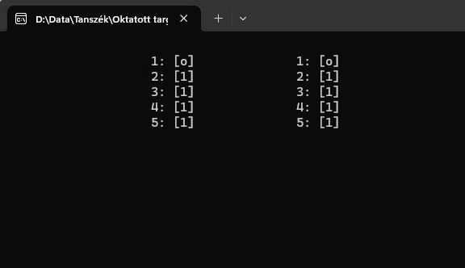
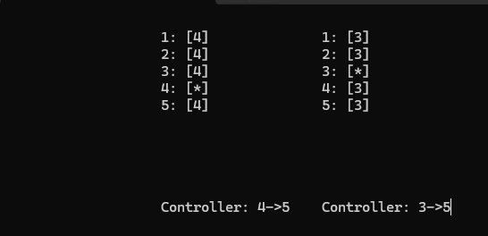

# IMSc. HF - Liftrendszer

## Bevezetés

A házi feladatban egy konzol alapú alkalmazást kell elkészíteni, mely egy liftrendszert szimulál, az Observer tervezési mintára építve.

A megvalósításért 7 IMSc pont szerezhető.

Az házi feladat az Observer és Adapter tervezési minta ismeretére épít (lásd kapcsolódó tervezési minták előadásanyag). 

A szükséges fejlesztőkörnyezetről [itt](../fejlesztokornyezet/index.md) található leírás. Ez egy konzolos alkalmazás, akár Linux/Mac környezetben is megvalósítható.

## A beadás menete

- Az alapfolyamat megegyezik a korábbiakkal. GitHub Classroom segítségével hozz létre magadnak egy repository-t. A meghívó URL-t Moodle-ben találod (a tárgy nyitóoldalán a "*GitHub classroom hivatkozások a házi feladatokhoz*" hivatkozásra kattintva megjelenő oldalon látható). Fontos, hogy a megfelelő, ezen házi feladathoz tartozó meghívó URL-t használd (minden házi feladathoz más URL tartozik). Klónozd le az így elkészült repository-t. Ez tartalmazni fogja a megoldás elvárt szerkezetét. A feladatok elkészítése után commit-old és push-old a megoldásod.
- :exclamation: Ehhez a feladathoz érdemi előellenőrző nem tartozik: minden push után lefut ugyan, de csak a neptun.txt kitöltöttségét ellenőrzi. Az érdemi ellenőrzést a határidő lejárta után a laborvezetők teszik majd meg.

## 1. feladat - Liftrendszer alapok

Készíts egy `Lift` osztályt, mely egy emeletes ház felvonóját reprezentálja! A következő tagokkal rendelkezzen:

* `Floor` tulajdonság: Aktuális emelet. Egész érték.
* `TargetFloor` tulajdonság: Cél emelet. Egész érték.
* `Stairway` tulajdonság: Lépcsőház száma, melyben a lift található. Egész érték. Egy lépcsőházban egy lift lehet (ezt nem kell validálni az alkalmazásban, de mindig így használjuk).
* `Call` művelet: A lift hívására szolgál, beállítja a célemeletet a paraméterben magadott értékre.
* `Step` művelet: A lift egy emelettel történő léptetésére szolgál (amennyiben az aktuális és célemelet nem egyezik: ha egyezik, nem csinál semmit). Véletlenszerű esetben - átlagosan kb. minden 5. lépés során - a lift ideiglenesen beragad: ez azt jelenti, hogy az adott lépés során nem vált emeletet a célemelet irányába.

Készíts egy `LiftDoor` osztályt, mely egy liftajtót reprezentál:

* Konstruktor paraméterben lehessen megadni a lift objektumot, melyhez a lift tartozik, valamint azt, hogy az ajtó melyik emeleten helyezkedik el.
* A liftajtó kijelzője mindig a liftjének aktuális emeletét mutatja, kivéve, amikor a lift az adott liftajtó szintjére érkezik. Ekkor, ha ez volt a célállomás, egy 'o' jelenik meg a kijelzőn (jelezve, hogy nyílik az ajtó), egyébként egy '*'. 
* A kijelzőhöz nem kell külön osztályt készíteni, a megjelenítésért a `LiftDoor` osztály felel.
* Egy adott lifthez tartozó ajtók adatai egy oszlopban, egymás alatt (emelet sorrendjében) jelenjenek meg. Az 1. oszlopban az 1. lépcsőház, 2. oszlopban a 2. lépcsőház stb. lift/liftajtó adatok jelenjenek meg. Az oszlopok 20-as karakterszélességűek, így az 1. oszlop a 20-as, a 2. oszlop a 40-es stb. karakterpozícióban kezdődik. Az alábbi ábra illusztrálja az elrendezést két lift esetére (1. lift az első lépcsőházban, 2. lift a 2. lépcsőházban található):
  
    

    Az ábra azt is illusztrálja, hogy a liftajtóknak milyen formában kell a kimenetet megjeleníteni (emelet után kettőspont, majd [ ] között a kijelző értéke).

* A konzolra írás során a `Console.SetCursorPosition` műveletet érdemes használni az írási pozíció beállítására.
* Egyszerűsítés: a `Lift` osztálynak nem kell tudnia, hogy hány szint tartozik hozzá, így nem szükséges erre vonatkozó validációkat sem megvalósítani.
* :exclamation: Kulcsfontosságú, hogy a `Lift` osztály nem tudhatja, milyen más osztályok építenek az állapotára. Pl. esetünkben egyelőre a `LiftDoor` ilyen (később lesz más is). Vagyis a rendszernek könnyen bővíthetőnek kell lenni más osztályokkal, melyek a `Lift` működésétől/állapotától függenek, új ilyen osztály bevezetésekor a `Lift` osztályt nem szabad a későbbiekben módosítani. Ennek megfelelően a `Lift` - `LiftDoor` viszonyát az Observer mintára kell építeni. 
* A jövőben a továbbfejlesztés során lehetnek más `Subject` osztályok is, ezért be kell vezetni egy `Subject` ősosztályt a kódduplikáció elkerülésére (de a házi feladatban csak egy subject lesz).
* :exclamation: A megoldás NEM építhet .NET event-ekre (ugyanezen osztályokkal/interfészekkel pl. Java nyelven is megvalósíthatónak kell lennie).


A liftrendszer konfiguráció összeállításért és a szimuláció futtatásáért egy `LiftSystemModel` osztály legyen a felelős. Ennek forráskódját alább megadjuk, ebből kell egy példányt a `Main` függvényben létrehozni, és a `Run` függvényét meghívni:

```csharp
class LiftSystemModel
{
    int iterationCount = 0;

    Lift lift1 = new() { Stairway = 1 };
    Lift lift2 = new() { Stairway = 2 };

    public LiftSystemModel()
    {
        var a1 = new LiftDoor(1, lift1);
        var a2 = new LiftDoor(2, lift1);
        var a3 = new LiftDoor(3, lift1);
        var a4 = new LiftDoor(4, lift1);
        var a5 = new LiftDoor(5, lift1);

        var b1 = new LiftDoor(1, lift2);
        var b2 = new LiftDoor(2, lift2);
        var b3 = new LiftDoor(3, lift2);
        var b4 = new LiftDoor(4, lift2);
        var b5 = new LiftDoor(5, lift2);
    }

    public void Run()
    {
        while (true)
        {
            Step();
            Thread.Sleep(1000);
            iterationCount++;
        }
    }

    private void Step()
    {
        lift1.Step();
        lift2.Step();

        if (iterationCount == 0)
            lift1.Call(5);
        if (iterationCount == 2)
            lift2.Call(5);

        if (iterationCount == 6)
            lift1.Call(1);
        if (iterationCount == 9)
            lift2.Call(1);
    }

}
```

A fenti kód rövid magyarázata:

* A modell két liftet tartalmaz, az egyik az 1., a másik a 2. lépcsőházban található.
* A konstruktorban létrehozzuk a két lifthez az egyes emeleteken található ajtókat (mindkét lépcsőház 5 emeletes).
* A `Run` egy végtelen ciklusban futtatja a szimulációt. A `Step` műveletben léptet, vár egy másodpercet, majd megnöveli az aktuális iterációszámot.
* A `Step` hívódik minden iterációban. Ebben léptetjük mindkét liftet, és bizonyos iterációkban hívjuk a két liftet az 5. illetve 1. emeletre.

A következő mozgókép illusztrálja a működést:
 

## 2. Feladat - LiftController osztály bevezetése

Készíts el egy `LiftController` osztályt, mely egy adott liftre vonatkozóan folyamatosan meg tudja jeleníteni, mely szinten van és mely szintre hívták utoljára (ez a központi vezérlőterem számára hasznos).

* Konstruktor paraméterben lehessen a lift objektumot megadni, melyhez a `LiftController` tartozik.
* `LiftSystemModel` konstruktorában mindkét lifthez vegyünk fel egy-egy `LiftController` példányt.
* :exclamation: Kulcsfontosságú, hogy a bevezetése során NE kelljen a `Lift` osztályt módosítani (az Observer mintának köszönhetően).
* `LiftController`-ek a hozzájuk tartozó lift oszlopában a liftajtók alatt jelenítsék meg egy "->" előtt az aktuális, utána pedig a cél emeletet. 
  
A megoldás illusztrálása:



## 3. feladat - Meglévő LiftMonitor osztály beillesztése

A feladat a liftek működési státuszáról információ megjelenítése. Emlékezzünk: a liftek véletlenszerű időközönként elakadnak, mint ahogy a korábbi leírásban szerepelt! Minden időpillanatban tudni szeretnénk, hogy egy lift működik (státusza "OK"), vagy el van akadva (státusza "stuck").  Ehhez rendelkezésre is áll az alábbi osztály:

```csharp
class LiftMonitor
{
    int prevFloor;
    bool isPrevFloorInitialized;

    public void CheckLift(Lift lift)
    {
        Console.SetCursorPosition(lift.Stairway * 20, 13);
        if (lift.Floor == prevFloor && isPrevFloorInitialized)
        {
            Console.Write($"LiftMonitor: stuck!");
        }
        else
            Console.Write($"LiftMonitor: OK    ");

        prevFloor = lift.Floor;
        isPrevFloorInitialized = true;
    }
}
```

Vegyük fel a fenti osztályt!

:exclamation: Ettől a pillanattól feltesszük, hogy a fenti osztályt egy könyvtár formájában kaptuk meg, így forráskódja nem módosítható!

Illesszük be az Adapter minta segítségével a fenti osztályt a megoldásunkba:

* A `LiftMonitor` osztály nem módosítható!
* :exclamation: Kulcsfontosságú, hogy a beillesztése során NE kelljen a `Lift` osztályt módosítani (az Observer mintának köszönhetően). Tipp: a `Lift` akkor is kell értesítse a megfigyelőit, ha beragadás miatt nem váltott szintet, máskülönben a `LiftMonitor` nem tudja detektálni a beragadást.
* `LiftSystemModel` konstruktorában mindkét lifthez vegyünk fel egy-egy monitorozást megvalósító objektumot.
* Csak Object Adapter alapú megoldás fogadható el (Class Adapter nem).

A megoldás működésének illusztrálása:

