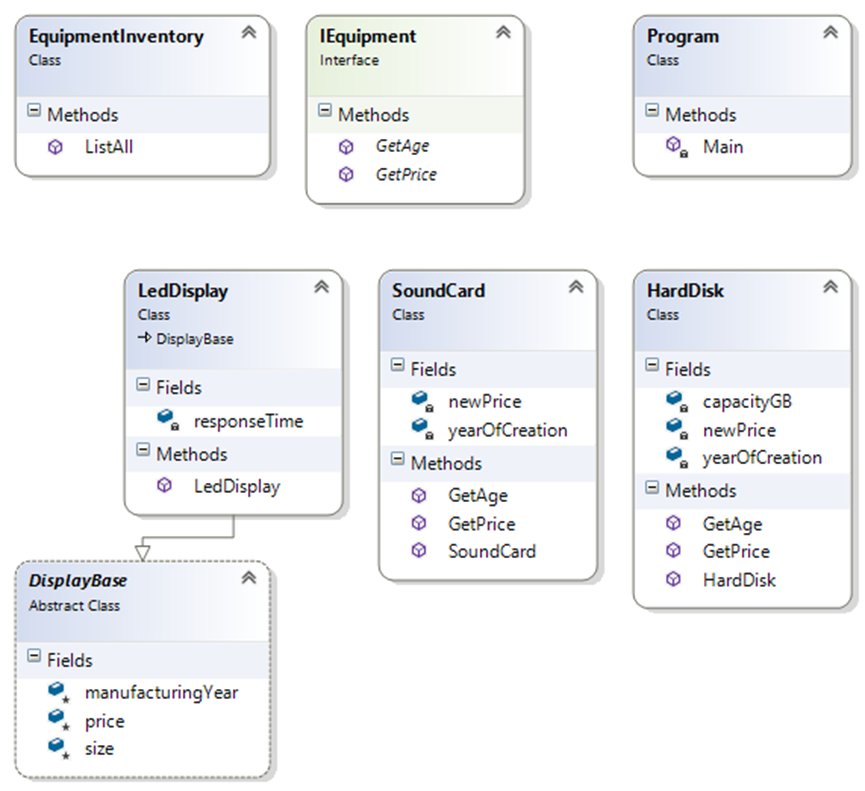
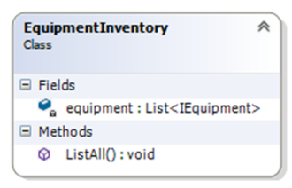
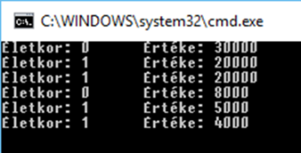
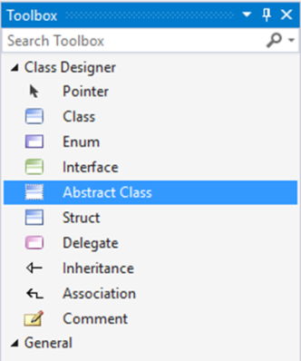
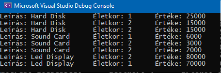

# 1. A modell és a kód kapcsolata

## A gyakorlat célja

A gyakorlat célja:

- Ismerkedés a hallgatókkal/gyakorlatvezetővel
- A gyakorlatokra vonatkozó követelmények pontosítása
- Elindulás Visual Studio-val és .NET alkalmazások fejlesztésével.
- Egy egyszerű Hello World .NET alkalmazás elkészítése, C# alapok
- Az UML és a kód kapcsolatának szemléltetése
- Az interfész és az absztrakt ősosztály alkalmazástechnikája

??? note "Gyakorlatvezetőknek"
    A hallgatók korábbi tanulmányaik során C++ gyakorlaton már használták a Visual Studio környezet, így a cél jelen esetben az ismeretek felelevenítése és életünk első C# alkalmazásának elkészítése. Ugyanakkor előfordulhat, hogy a hallgatók nem emlékeznek pontosan a Visual Studio használatára, így a feladatok megoldása során ezeket folyamatosan elevenítsük fel (pl. Solution Explorer, F5-futtatás, breakpoint használat, stb.)

## Előfeltételek

A gyakorlat elvégzéséhez szükséges eszközök:

- Visual Studio 2022

Visual Studio-ból a legfrissebb verziót célszerű feltenni. A Community Edition, Professional és az Enterprise verzió is megfelel. A Community Edition ingyenes, letölthető a Microsoft honlapjáról. A Professional fizetős, de az egyetem hallgatói számára ez is ingyenesen elérhető (<https://azureforeducation.microsoft.com/devtools> honlapon, az Azure Dev Tools for Teaching program keretében).

!!! note  "Visual Studio Class Diagram támogatás"
        Jelen gyakorlat bizonyos feladatainál (és az első házi feladat esetében is) a Visual Studio Class Designer támogatását használjuk. A Visual Studio nem teszi fel minden esetben a Class Designer komponenst a telepítés során. Ha nem lehet Class Diagram-ot felvenni a Visual Studio projektbe (mert a Class Diagram nem szerepel a listában az Add New Item parancs során megjelenő ablak listájában – erről a jelen útmutató későbbi fejezetében bővebben), akkor a Class Diagram komponenst utólag kell telepíteni:

    1. Visual Studio telepítő indítása (pl. a Windows Start menüben a „Visual Studio Installer” begépelésével).
    2. A megjelenő ablakban „Individual components” fül kiválasztása
    3. A keresőmezőbe „class designer” begépelése, majd győződjünk meg, hogy a szűrt listában a „Class Designer” elem ki van pipálva.
        
        

Amit érdemes átnézned:

- A gyakorlathoz nem kapcsolódik a tárgyból előadás. Ugyanakkor a gyakorlat épít az UML alapismeretekre, illetve az UML osztálydiagram és a kód egymásra történő leképezésének alapjaira.

## Gyakorlat menete

A gyakorlatvezető a gyakorlat elején összefoglalja a gyakorlatokra vonatkozó követelményeket:

- A tárgyi adatlapon ezek többsége megtalálható
- Az otthoni feladatokról információ a tárgy honlapján található.

Visual Studio fejlesztőeszközzel, .NET alkalmazásokat fogunk készíteni C# nyelven. A C#  hasonlít a Java-hoz, fokozatosan ismerjük meg a különbségeket.
A gyakorlat vezetett, gyakorlatvezető instrukciói alapján együtt kerülnek elvégzésre a feladatok.

## Megoldás

??? "A kész megoldás letöltése"
    :exclamation: Lényeges, hogy a labor során a laborvezetőt követve kell dolgozni, tilos (és értelmetlen) a kész megoldás letöltése. Ugyanakkor az utólagos önálló gyakorlás során hasznos lehet a kész megoldás áttekintése, így ezt elérhetővé tesszük.

    A megoldás GitHubon érhető el [itt](https://github.com/bmeviauab00/lab-modellkod-kiindulo/tree/megoldas). A legegyszerűbb mód a letöltésére, ha parancssorból a `git clone` utasítással leklónozzuk a gépünkre:

    ```git clone https://github.com/bmeviauab00/lab-modellkod-kiindulo -b megoldas```

    Ehhez telepítve kell legyen a gépre a parancssori git, bővebb információ [itt](../hazi/git-github-github-classroom/#git-telepitese).

## 1. Feladat - „Hello world” .NET konzol alkalmazás elkészítése

A feladat egy olyan C# nyelvű konzol alkalmazás elkészítése, amely a konzolra kiírja a „Hello world!” szöveget.

Az alkalmazást C# nyelven készítjük el. A lefordított alkalmazás futtatását a .NET runtime végzi. A fordítás/futtatás elméleti hátterét, valamint a .NET alapjait az első előadás ismerteti.

A solution és azon belüli projekt létrehozásának lépései Visual Studio 2022 esetén:

1. Új projekt varázsló elindítása, melyre két mód is van
    - Indítóablak segítségével
        1. Indítsuk el a Visual Studio-t
        2. A megjelenő indítóablak jobb oldali sávjában *Create new project*
    - Már futó Visual Studio-ban
        1. File / New-Project
2. A Create new project varázslóban a *Console app* (és **NEM** a *Console app (.NET Framework)* sablont válasszuk ki, ebből is a C#-osat. Azt, hogy C#-os, a sablon ikonjának bal felső sarka jelzi. Ha nem látjuk a listában, rá kell keresni/szűrni. Rákereshetünk a felső keresősávban a „console” beírásával. Vagy az alatta levő lenyíló mezők segítségével: az elsőben (nyelvkiválasztó) „C#”, a harmadikban (projekttípus kiválasztó) „Console”.

    

3. Next gomb az varázslóablak alján, a következő varázslóoldalon:
    1. Project name: **Hello World**
    2. Location: a laborokban a **c:\work\<sajátnév>** mappába dolgozzunk, ehhez van írási jogunk.
    3. Solution name: **Hello World** (elvileg ez be is lesz írva, mire ideérünk)
    4. Place solution and project in the same directory: nincs pipa (de nincs különösebb jelentősége).

4. Next gomb az varázslóablak alján, a következő varázslóoldalon:
    1. Framework: **.NET 6 (Long-term support)**.
    2. A "Do not use top level statements" jelölőnégyzetet pipáljuk be (ennek magyarázatára mindjárt visszatérünk).

A projekttel egy új solution is létrejön, mely struktúrája a Visual Studio *Solution Explorer* ablakában tekinthető át. Egy solution több projectből állhat, egy project pedig több fájlból. A solution a teljes munkakörnyezetet fogja össze (egy `.sln` kiterjesztésű fájl tartozik hozzá), míg egy projekt kimenete egy `.exe` vagy `.dll` fájl jellemzően, vagyis egy összetett alkalmazás/rendszer egy komponensét állítja elő. A projektfájlok kiterjesztése C# alkalmazások esetén `.csproj`.

A `Program.cs` fájlunk tartalma a következő:

```cs title="Program.cs"
namespace HelloWorld
{
    internal class Program
    {
        static void Main(string[] args)
        {
            Console.WriteLine("Hello World!");
        }
    }
}
```

Vegyünk fel egy `Console.ReadKey()` sort:

```cs hl_lines="8"
namespace HelloWorld
{
    internal class Program
    {
        static void Main(string[] args)
        {
            Console.WriteLine("Hello World!");
            Console.ReadKey();
        }
    }
}
```

1. Futtassuk az alkalmazást (pl. az **F5** billentyű használatával).

    A kód felépítése nagyon hasonlít a Java-hoz, illetve a C++-hoz. Az osztályaink névterekbe szervezettek. Névteret definiálni a `namespace` kulcsszóval tudunk. Névtereket hatókörbe „hozni” a `using` kulcsszóval tudjuk.  pl.:

    ```cs
    using System.Collections.Generic;
    ```

2. Egy konzolos C# alkalmazásban az alkalmazásunk belépési pontját egy statikus `Main` nevű függvény megírásával adjuk meg. Az osztályunk neve bármi lehet, a VS egy `Program` nevű osztályt generált esetünkben. A `Main` függvény paraméterlistája kötött: vagy ne adjunk meg paramétereket, vagy egy `string[]`-öt adjunk meg, amiben futás közben megkapjuk az parancssori argumentumokat.
3. .NET-ben a standard ki és bemenet kezelésére a `System` névtér `Console` osztálya használandó. A `WriteLine` statikus műveletével egy sort tudunk kiírni, a `ReadKey` művelettel egy billentyű lenyomására várakozhatunk.

!!! tip  "Top level statements, Implicit és static usings és névterek"
    A projekt létrehozásakor korábban bepipáltuk a "Do not use top level statements" jelölőnégyzetet. Ha ezt nem tettük volna meg, akkor a `Program.cs` fájlunkban mindössze egyetlen érdemi sort találtunk volna:

    ```cs
    // See https://aka.ms/new-console-template for more information
    Console.WriteLine("Hello World!");
    ```

    Ez  működésében ekvivalens a fenti `Program` osztályt és ebben `Main` függvényt tartalmazó kóddal. Nézzük, mik teszik ezt lehetővé (ezekről pl. itt <https://docs.microsoft.com/en-us/dotnet/csharp/whats-new/tutorials/top-level-statements> olvashatunk bővebben, mindkettő C# 10 újdonság):

    - **Top level statements**. Ennek az a lényege, hogy mindenféle osztály/`Main` és egyéb  függvénydefiníció nélkül a projektben egyetlen forrásfájlban közvetlenül is írhatunk kódot. Ez esetben ezt a színfalak mögött a fordító berakja egy általunk nem látható osztály statikus `Main` függvényébe. A bevezetésének a motivációja az volt, hogy a nagyon egyszerű, „script” szerű alkalmazások esetén kevesebb legyen a boilerplate kód.
    - **Implicit global usings**. Annak függvényében, hogy pontosan milyen projekttípust hoztunk létre, bizonyos alapnévterek a színfalak mögött automatikusan using-olva lesznek minden forrásfájlban (ehhez a compiler a *global using* utasítást használja). A lényeg: a fejlesztőknek így bizonyos, gyakran használt névtereket (pl. `System.IO`, `System.Collections.Generic` stb.) nem kell a forrásfájlonként using-olni.
    - **Static using**. Lehetőségünk van C#-ban névterek helyett statikus osztályokat is usingolni, így azokat a használatuk során nem fontos kiírni. Gyakori eset erre a `Console` vagy a `Math` osztály usingolása.

        ```cs hl_lines="1 9"
        using static System.Console;

        namespace ConsoleApp12
        {
            internal class Program
            {
                static void Main(string[] args)
                {
                    WriteLine("Hello, World!");
                }
            }
        }
        ```

    - **Fájl szintű névterek**. C# 10-ben szintén egy egyszerűsítést kapunk a névterek deklarálása során, mert már nem kötelező a kapcsos zárójeleket kitenni, így az adott namespace a teljes fájlra érvényes lesz pl.:

        ```cs hl_lines="1"
        namespace HelloWorld;

        internal class Program
        {
            // ...
        }
        ```

!!! warning "Inconsistent visibility vagy inconsistent accessibility hiba"
    A félév során a programozási feladatok megvalósítása során találkozhatunk *inconsistent visibility*-re vagy *inconsistent accessibility*-re panaszkodó fordítási hibaüzenetekkel. A jelenség hátterében az áll, hogy .NET környezetben lehetőség van az egyes típusok (osztály, interfész, stb.) láthatóságának szabályozására:

    - `internal` vagy nem adjuk meg a láthatóságot: a típus csak az adott szerelvényen (.exe, .dll)/projekten,  belül látható
    - `public`: a típus más szerelvények/projektek számára is látható
    
    A hiba legegyszerűbben úgy hárítható el, ha minden típusunkat publikusnak definiáljuk, pl.:

    ```cs
    public class HardDisk
    {
        // ...
    }
    ```

## Elméleti áttekintés

Az alfejezetek nem tartalmaznak feladatot, a hallgatók számára ismertetik a kapcsolódó elméleti témaköröket, példákkal illusztrálva.

### A) Az UML osztálydiagram és a kód kapcsolatának elmélete [hallgató]*

Az anyag itt elérhető: [Az UML osztálydiagram és a kód kapcsolata](../../egyeb/uml-kod-kapcsolata/index.md). Ez a témakör korábbi félévben a Szoftvertechnológia tárgy keretében került ismertetésre.

### B) Interfész és absztrakt (ős)osztály [hallgató]*

Az anyag itt elérhető: [Interfész és absztrakt (ős)osztály](../../egyeb/interfesz-es-absztrakt-os/index.md).

Témakörök:

- Absztrakt osztály fogalma és definiálása C# nyelven
- Interfész fogalma és definiálása C# nyelven
- Absztrakt ős és interfész összehasonlítása

## 2. Feladat - Az UML és a kód kapcsolatának szemléltetése

### Feladat leírása - Equipment inventory

Feladat: Egy számítógépalkatrész nyilvántartó alkalmazás kifejlesztésével bíztak meg bennünket. Bővebben:

- Különböző típusú alkatrészeket kell tudni kezelni. Kezdetben a `HardDisk`, `SoundCard` és `LedDisplay` típusokat kell támogatni, de a rendszer legyen könnyen bővíthető új típusokkal.
- Az alkatrészekhez tartozó adatok: beszerzés éve, életkora (számított), beszerzési ára és aktuális ára (számított), de ezeken felül típusfüggő adatokat is tartalmazhatnak (pl. a `HardDisk` esetében a kapacitás).
- Az aktuális ár függ az alkatrész típusától, a beszerzési ártól és az alkatrész gyártási évétől. Pl. minél öregebb egy alkatrész, annál nagyobb kedvezményt adunk rá, de a kedvezmény mértéke függ az alkatrész típustól is.
- Listázni kell tudni a készleten levő alkatrészeket.
- A `LedDisplay` osztálynak kötelezően egy `DisplayBase` osztályból kell származnia, és a `DisplayBase` osztály forráskódja nem megváltoztatható. Jelen példában ennek nincs sok értelme, a gyakorlatban azonban gyakran találkozunk hasonló helyzettel, amikor is az általunk használt keretrendszer/platform előírja, hogy adott esetben egy-egy beépített osztályból kell származtassunk. Tipikusan ez a helyzet, amikor ablakokkal, űrlapokkal, saját vezérlőtípusokkal dolgozunk: ezeket a keretrendszer beépített osztályaiból kell származtatnunk, és a keretrendszer  - pl. Java, .NET - forráskódja nem áll rendelkezésünkre (de legalábbis biztosan nem akarjuk megváltoztatni). A példánkban a `DisplayBase`-ből való származtatás előírásával ezt a helyzetet szimuláljuk.

A megvalósítás során jelentős egyszerűsítéssel élünk: az alkatrészeket csak memóriában tarjuk nyilván, a listázás is a lehető legegyszerűbb, egyszerűen csak kiírjuk a nyilvántartott alkatrészek adatait a konzolra.

A kezdeti egyeztetések során a megrendelőnktől a következő információt kapjuk: egy belső munkatársuk már elindult a fejlesztéssel, de idő hiányában csak félkész megoldásig jutott. A feladatunk részét képezi a félkész megoldás megismerése, illetve ebből kiindulva kell a feladatot megvalósítani.

### Class Diagram

Nyissuk meg a megrendelőnktől kapott [forráskód](https://github.com/bmeviauab00/lab-modellkod-kiindulo) solution-jét, melyet a következő lépéseket követve tudunk megtenni.

Ehhez klónozzuk le a kiinduló projekt online GitHub rendszerben elérhető Git repositoryját a `C:\Work` mappán belül egy új saját mappába: pl.: `C:\Work\NEPTUN\lab1`. Ebben az új mappában nyissunk meg egy command line-t vagy powershellt és futtassuk az alábbi git parancsot:

```cmd
git clone https://github.com/bmeviauab00/lab-modellkod-kiindulo.git
```

!!! note Git és GitHub
    A Git-ről, mint forráskódkezelő rendszerről, az első házi feladat kontextusában olvashatunk majd bővebben.

Nyissuk meg a leklónozott mappában található src/EquipmentInventory.sln Visual Studio solutiont.

A Solution Explorerben szemmel fussuk át a fájlokat. Az megértést segítené, ha egy osztálydiagramon megjelenítenénk az osztályok közötti kapcsolatokat. Vegyünk is fel egy osztálydiagramot a projektünkbe. A Solution Explorerben a **projekten** (és nem a solution-ön!) jobb gombbal kattintva a felugró menüben az *Add/New Item* elemet választva, majd a megjelenő ablakban a Class Diagram elemet válasszuk ki, az ablak alján a diagram nevének a Main.cd-t adjuk meg, és OK-zuk le az ablakot.

!!! warning "Class Diagram hiányzó sablon"
    Ha a *Class Diagram* elem nem jelenik meg a listában, akkor nincs telepítve a VS megfelelő komponense. Erről jelen dokumentum [Előfeltételek](#elofeltetelek) fejezetében olvashatsz bővebben.

Ekkor a Solution Explorerben megjelenik a `Main.cd` diagramfájl, duplakattintással nyissuk meg. A diagramunk jelenleg üres. A Solution Explorerből drag&drop-pal dobjuk rá a .cs forrásfájlokat a diagramra. Ekkor a VS megnézi, milyen osztályok vannak ezekben a forrásfájlokban, és visszafejti őket UML osztályokká. Alakítsuk ki a következő ábrának megfelelő elrendezést (az osztályok tagjainak megjelenítését a téglalapuk jobb felső sarkában levő duplanyílra kattintással érhetjük el):



Az osztályokhoz tartozó forráskódot is megnézhetjük, akár a diagramon a megfelelő osztályra duplán kattintva, akár a Solution Explorerből a .cs fájlokat megnyitva.
A következőket tapasztaljuk:

- A `SoundCard`, `HardDisk` és `LedDisplay` osztályok viszonylag jól kidolgozottak, rendelkeznek a szükséges attribútumokkal és lekérdező függvényekkel.
- Az `LedDisplay` a követelményeknek megfelelően a `DisplayBase` osztályból származik.
- Az `EquipmentInventory` felelős ugyan a készleten levő alkatrészek nyilvántartásáért, de gyakorlatilag semmi nincs ebből megvalósítva.
- Találunk egy `IEquipment` interfészt, `GetAge` és `GetPrice` műveletekkel

### EquipmentInventory

Álljunk neki a megoldás kidolgozásának. Először is az alapkoncepciókat fektessük le. Az `EquipmentInventory` osztályban egy heterogén kollekcióban tároljuk a különböző alkatrész típusokat. Ez a kulcsa az alkatrészek egységes kezelésének, vagyis annak, hogy a megoldásunk új alkatrésztípusokkal könnyen bővíthető legyen.

Mint korábban taglaltuk, az egységes kezelést vagy közös ősosztály, vagy közös interfész bevezetésével lehet megoldani. Esetünkben a közös ősosztály (pl. `EquipmentBase`) úgy tűnik, kiesik, mert ennek bevezetésével az `LedDisplay` osztálynak két ősosztálya is lenne: a kötelezőnek kikötött `DisplayBase`, és az általunk az egységes kezelésre bevezetett `EquipmentBase`. Ez nem lehetséges, .NET környezetben egy osztálynak csak egy őse lehet. Az a megoldás pedig, hogy a `DisplayBase`-t úgy módosítjuk, hogy ő is az `EquipmentBase`-ből származik, a követelményünknek megfelelően nem lehetséges (kikötés volt, hogy a forráskódja nem módosítható). Marad tehát az interfész alapú megközelítés. Minden bizonnyal az alkalmazás korábbi fejlesztője is erre a következtetésre jutott, ezért is vezette be az `IEquipment` interfészt.

Vegyünk fel egy `IEquipment` típusú elemekből álló generikus listát (ne property-t hanem field-et!) az `EquipmentInventory` osztályba. A láthatósága – az egységbezárásra törekedve – legyen `private`. A neve legyen `equipment` (ne legyen „s” a végén, angolban az equipment többes száma is equipment). A tagváltozó felvételéhez a Visual Studio *Class Details* ablakát használjuk. Ha az ablak nem látható, a *View / Other Windows / Class Details* menü kiválasztásával jeleníthető meg.


A tagváltozó típusa tehát `List<IEquipment>`. A .NET `List` típusa egy dinamikusan nyújtózkodó generikus tömb (mint Java-ban az `ArrayList`).
A diagramon az `EquipmentInventory` osztályra pillantva azt látjuk, hogy csak a tagváltozó neve jelenik meg, a típusa nem. A diagram hátterén jobb gombbal kattintva a *Change Members Format* menüből a *Display Full Signature*-t válasszuk ki. Ezt követően a diagramon láthatóvá válik a tagváltozók típusa, valamint a műveletek teljes szignatúrája.



Az `EquipmentInventory` osztályon duplán kattintva elnavigálhatunk a forráskódba, és mint látható, valóban egy lista típusú tagváltozóként jelenik meg a kódban:

```cs hl_lines="3"
class EquipmentInventory
{
    private List<IEquipment> equipment;
```

Ennek egyrészt örülünk, mert a Visual Studio támogatja a round-trip engineering technikát: **a modellt érintő változásokat azonnal átvezeti a kódba, és viszont**. Másrészt a korábbiakban azt taglaltuk, hogy ha egy osztályban egy gyűjtemény tag van egy másik osztály elemeiből, akkor annak az UML modellben egy 1-több típusú asszociációs kapcsolatként „illik” megjelennie a két osztály között. A modellünkben egyelőre nem ezt tapasztaljuk. Szerencsére a VS modellező felülete rávehető, hogy ilyen formában jelenítse meg ezt a kapcsolattípust. Ehhez kattintsunk a diagramon jobb gombbal az equipment tagváltozón, és a menüből válasszuk ki a *Show as Collection Association* elemet. Az `IEquipment` interfészt ezt követően mozgassuk ki jobbra, hogy kellő hely legyen a diagramon az asszociációs kapcsolat és a kapcsolaton levő szerep (role) adatainak megjelenítésére:


A dupla nyíl végződés a „többes” oldalon nem szabványos UML, de ne szomorodjunk el tőle különösebben, nincs semmi jelentősége. Annak mindenképpen örülünk, hogy  a kapcsolatot reprezentáló nyíl az `IEquipment` végén a szerepben a tagváltozó neve (sőt, még a pontos típusa is) fel van tüntetve.

Navigáljunk el az `EquipmentInventory` forráskódjához, és írjuk meg a konstruktorát, ami inicializálja az `equipment` gyűjteményt!

```cs
public EquipmentInventory()
{
    equipment = new List<IEquipment>();
}
```

Ezután írjuk meg a `ListAll` metódust, ami kiírja az elemek életkorát, és az aktuális értéküket:

```cs
public void ListAll()
{
    foreach (IEquipment eq in equipment)
    {
        Console.WriteLine($"Életkor: {eq.GetAge()}\tÉrtéke: {eq.GetPrice()}");
    }
}
```

Az elemeken a `foreach` utasítással iterálunk végig. A `foreach` utasítás használata során az `in` kulcsszó után egy gyűjteménynek kell állnia, az `in` előtt pedig egy változó deklarációnak (esetünkben `IEquipment eq`), ahol a típus a gyűjtemény elemtípusa. Minden iterációban ez a változó a gyűjtemény iterációbeli értékét veszi fel.

A `Console.WriteLine` műveletnek vagy egy egyszerű stringet adunk meg, vagy, mint esetünkben, egy formázási stringet. A behelyettesítéseket string interpolációval oldottuk meg: a behelyettesítendő értékeket `{}` között kell megadni. Ha string interpolációt használunk, a stringnek `$` jellel kell kezdődnie.

Írjunk meg egy `AddEquipment` nevű függvényt, ami felvesz egy új eszközt a készletbe:

```cs
public void AddEquipment(IEquipment eq)
{
     equipment.Add(eq);
}
```

### IEquipment megvalósítók

Korábbi döntésünk értelmében az `IEquipment` interfészt használjuk az különböző alkatrész típusok egységes kezelésére. Estünkben mind a `SoundCard`, mind a `HardDisk` osztály rendelkezik `GetAge()` és `GetPrice()` metódussal, mégsem tudjuk őket egységesen kezelni (pl. közös listában tárolni). Ahhoz, hogy ezt meg tudjuk tenni, el kell érnünk, hogy mindkét osztály megvalósítsa az `IEquipment` interfészt. Módosítsuk a forrásukat:

```cs
public class SoundCard : IEquipment
```

```cs
public class HardDisk : IEquipment
```

Ezt követően a `SoundCard` és `HardDisk` osztályban implementálnunk kell az `IEquipment` interfészben levő metódusokat. Azt tapasztaljuk, hogy ezzel nincs most teendők, a `GetPrice` és `GetAge` függvények már meg vannak írva mindkét helyen.

Próbaképpen a `Program.cs` fájlban található `Main` függvényünkben hozzunk létre egy `EquipmentInventory` objektumot, töltsük fel `HardDisk` és `SoundCard` objektumokkal, majd listázzuk a késztelet a konzolra. Ammennyiben nem 2021 az aktuális év, az alábbi soroknál a 2021-es évet írjuk át az aktuális évre, a 2020-at pedig ennél eggyel kisebb számra!

```cs
static void Main( string[] args )
{
    EquipmentInventory ei = new EquipmentInventory();

    ei.AddEquipment(new HardDisk(2021, 30000, 80));
    ei.AddEquipment(new HardDisk(2020, 25000, 120));
    ei.AddEquipment(new HardDisk(2020, 25000, 250));

    ei.AddEquipment(new SoundCard(2021, 8000));
    ei.AddEquipment(new SoundCard(2020, 7000));
    ei.AddEquipment(new SoundCard(2020, 6000));

    ei.ListAll();
}
```

Az alkalmazást futtatva azt tapasztaljuk, hogy bár megoldásunk kezdetleges, de működik:



Folytassuk a munkát a `LedDisplay` osztállyal. A `DisplayBase` ős forráskódját a követelmények miatt nem módosíthatjuk. De ez semmiféle problémát nem okoz, a `LedDisplay` osztályunk fogja az `IEquipment` interfészt implementálni, módosítsuk a kódot ennek megfelelően:

```cs
public class LedDisplay : DisplayBase, IEquipment
```

A `LedDisplay` osztályban már meg kell írni az interfészben szereplő függvényeket:

```cs
public double GetPrice()
{
    return this.price;
}

public int GetAge()
{
    return DateTime.Today.Year - this.manufacturingYear;
}
```

Bővítsük a `Main` függvényünket is, vegyünk fel két `LedDisplay` objektumot a készletünkbe (itt is él, hogy ammennyiben nem 2021 az aktuális év, az alábbi soroknál a 2021-es évet írjuk át az aktuális évre, a 2020-at pedig ennél eggyel kisebb számra!

```cs hl_lines="1 2"
ei.AddEquipment( new LedDisplay( 2020, 80000, 17, 16) );
ei.AddEquipment( new LedDisplay ( 2021, 70000, 17, 12) );
        
ei.ListAll();
Console.ReadKey();
```

Tesztelésképpen futtassuk az alkalmazást.

## 3. Feladat - Az interfész és az absztrakt ősosztály alkalmazástechnikája

### Interfész problematikája

Értékeljük a jelenlegi, interfész alapú megoldásunkat.

Az egyik fő probléma, hogy kódunk tele van a karbantarthatóságot és bővíthetőséget romboló kódduplikációval:

- A `yearOfCreation` és `newPrice` tagok minden alkatrész típusban (kivéve a speciális `LedDisplay`-t) közösek, ezeket új típus bevezetésekor is copy-paste technikával át kell venni.
- A `GetAge` függvény implementációja szinten minden alkatrész típusban (kivéve a speciális `LedDisplay`-t) azonos, szintén copy-paste-tel „szaporítandó”.
- A konstruktorok `yearOfCreation` és `newPrice` tagokat inicializáló sorai szintén duplikáltak az egyes osztályokban.

Bár ez a kódduplikáció egyelőre nem tűnik jelentősnek, új alkatrész típusok bevezetésével egyre inkább elmérgesedik a helyzet, jobb időben elejét venni a jövőbeli fájdalmaknak.

A másik probléma abból adódik, hogy az alkatrész adatok listázása jelenleg fájdalmasan hiányos, nem jelenik meg az alkatrész típusa (csak a kora és az ára). A típus megjelenítéséhez az IEquipment interfészt bővíteni kell, pl. egy `GetDescription` nevű művelet bevezetésével.  Vegyünk is fel egy `GetDescription` függvényt az interfészbe!

```cs hl_lines="5"
public interface IEquipment
{
    double GetPrice();
    int GetAge();
    string GetDescription();
}
```

Ekkor minden `IEquipment` interfészt implementáló osztályban meg kellene valósítani ezt a metódust is, ami sok osztály esetén sok munka (valamint egy többkomponensű, vagyis több DLL-ből álló alkalmazás esetében, amikor ezek nem egy fejlesztő cég kezében vannak, sokszor nem is megoldható). A *Build* parancs futtatásával ellenőrizzük, hogy a `GetDescription` felvétele után három helyen is fordítási hibát kapunk.

!!! tip "Interfészben alapértelmezett implementáció megadása"
    Érdemes tudni, hogy C# 8-tól (illetve .NET vagy .NET Core runtime is kell hozzá, .NET Framework alatt nem támogatott) kezdve **interfész műveleteknek is lehet alapértelmezett implementációt adni (default interface methods), így a fenti probléma megoldásához nincs szükség absztrakt osztályra, de interfésznek továbbiakban sem lehet tagváltozója**. Bővebben információ itt:  [default interface methods](https://docs.microsoft.com/en-us/dotnet/csharp/language-reference/proposals/csharp-8.0/default-interface-methods).

    ```cs hl_lines="5"
    public interface IEquipment
    {
        double GetPrice();
        int GetAge();
        string GetDescription() { return "EquipmentBase"; }
    }
    ```

### Absztrakt osztály

Mindkét problémára megoldást jelent egy közös absztrakt ős bevezetése (kivéve az `LedDiplay` osztályt, amire még visszatérünk). Ebbe fel tudjuk költöztetni a leszármazottakra közös kódot, valamint az újonnan bevezetett `GetDescription` művelethez egy alapértelmezett implementációt tudunk megadni. Legyen az új absztrakt ősosztályunk neve `EquipmentBase`. Kérdés, szükség van-e a továbbiakban az `IEquipment` interfészre, vagy az teljesen kiváltható az új `EquipmentBase` osztállyal. Az `IEquipment` interfészt meg kell tartsuk, mert a LedDisplay osztályunkat nem tudjuk az `EquipmentBase`-ből származtatni: már van egy kötelezően előírt ősosztálya, a `DisplayBase`: emiatt az EquipmentInventory a továbbfejlesztett megoldásunkban is `IEquipment` interfészként hivatkozik az különböző alkatrészekre.

Álljunk is neki az átalakításnak. Legyen az osztálydiagramunk az aktív tabfül. A *Toolbox*-ból drag&drop-pal dobjunk fel egy *Abstract Class* elemet a diagramra, a neve legyen `EquipmentBase`.



A következőkben azt kell elérjük, hogy a `SoundCard` és a `HardDisk` osztályok származzanak az `EquipmentBase`-ből (a `LedDisplay`-nek már van másik őse, így ott ezt nem tudjuk megtenni). Ehhez válasszuk ki az *Inheritance* kapcsolatot a *Toolbox*-ban, majd húzzunk egy-egy vonalat a gyermekosztályból kiindulva az ősosztályba a `SoundCard` és `HardDisk` esetében egyaránt.

A következő lépésben alakítsuk át úgy a kódot, hogy ne a `HardDisk` és `SoundCard` valósítsák meg külön-külön az `IEquipment` interfészt, hanem a közös ősük, az `EquipmentBase` egyszer. Ehhez módosítsuk az EquipmentBase osztályt úgy, hogy valósítsa meg az interfészt (akár a diagramon húzzunk be egy inheritance kapcsolatot az `EquipmentBase`-ből az `IEquipment`-be, vagy az `EquipmentBase` forráskódját módosítsuk). A `HardDisk` és `SoundCard` osztályokból töröljük az `IEquipment` megvalósítását (az ős már implementálja).

A diagramunk és a forráskódunk vonatkozó részei ezt követően így néznek ki:


```cs
public abstract class EquipmentBase : IEquipment
```

```cs
public class HardDisk : EquipmentBase
```

```cs
public class SoundCard : EquipmentBase
```

A kódunk még nem fordul, ennek több oka is van. Az `EquipmentBase` implementálja az `IEquipment` interfészt, de még nincsenek benne implementálva az interfész műveletei. Vagy generáltassuk le a metódusokat a smart tag használatával, vagy gépeljük be a következő elveknek megfelelően:

- A `newPrice` és `yearOfCreation` duplikálva vannak a `HardDisk` és `SoundCard` osztályokban: mozgassuk (és ne másoljuk!) át ezeket a közös `EquipmentBase` ősbe, és `protected` láthatóságot adjunk meg.
- A `GetAge` művelet duplikálva van a `HardDisk` és `SoundCard` osztályokban, ezekből töröljük ki az implementációt és vigyük át az `EquipmentBase` osztályba.
- A `GetPrice` műveletet absztrakt műveletként vegyük fel az ősbe. Ez szándékos tervezői döntés, így rákényszerítjük a leszármazott osztályokat, hogy mindenképpen definiálják felül ezt a műveletet.
- A `GetDescription` esetében viszont pont fordítottja a helyzet: ezt virtuálisnak definiáljuk (és nem absztraktnak), vagyis már az ősben is adunk meg implementációt. Így a leszármazottak nincsenek rákényszerítve a művelet felüldefiniálására.

A fentieknek megfelelő kód a következő:

```cs
public abstract class EquipmentBase : IEquipment
{
    protected int yearOfCreation;
    protected int newPrice;

    public int GetAge()
    {
        return DateTime.Today.Year - yearOfCreation;
    }

    public abstract double GetPrice();

    public virtual string GetDescription()
    {
        return "EquipmentBase";
    }
}
```

!!! tip "Néhány kiegészítő gondolat a kódrészletre vonatkozóan:"

    - Az absztrakt osztályok esetében az `abstract` kulcsszót ki kell írni a `class` szó elé.
    - Az absztrakt műveletek esetében az `abstract` kulcsszót kell megadni
    - .NET környezetben lehetőségünk van szabályozni, hogy egy művelet virtuális-e vagy sem. Ebből a szempontból a C++ nyelvhez hasonlít. Amennyiben egy műveletet virtuálissá szeretnénk tenni, a `virtual` kulcsszót kell a műveletre megadni. Emlékeztető: akkor definiáljunk egy műveletet virtuálisnak, ha a leszármazottak azt felüldefiniál(hat)ják. Csak ekkor garantált, hogy egy ősreferencián meghívva az adott műveletet a leszármazottbeli verzió hívódik meg.

### Leszármazottak

A következő lépésben térjünk át az `EquipmentBase` leszármazottakra. C# nyelven az absztrakt és virtuális műveletek felüldefiniálásakor a leszármazottban meg kell adni az `override` kulcsszót. Első lépésben a `GetPrice` műveletet definiáljuk felül:

```cs title="HardDisk.cs"
public override double GetPrice()
{
    return yearOfCreation < (DateTime.Today.Year - 4)
        ? 0
        : newPrice - (DateTime.Today.Year - yearOfCreation) * 5000;
}
```

```cs title="SoundCard.cs"
public override double GetPrice()
{
    return yearOfCreation < (DateTime.Today.Year - 4)
        ? 0 
        : newPrice - (DateTime.Today.Year - yearOfCreation) * 2000;
}
```

A következőkben lépésben a `GetDescription` műveletet írjuk meg a `HardDisk` és `SoundCard` osztályokban. Mivel itt az ősbeli virtuális függvényt definiáljuk felül, szintén meg kell adni az `override` kulcsszót:

```cs title="HardDisk.cs"
public override string GetDescription()
{
    return "Hard Disk";
}
```

```cs title="SoundCard.cs"
public override string GetDescription()
{
    return "Sound Card";
}
```

Felmerülhet bennünk a kérdés, miért döntöttek úgy a C# nyelv tervezői, hogy a műveletek felüldefiniálásakor egy extra kulcsszót kelljen megadni, hasonlóra pl. a C++ nyelv esetében nem volt szükség. Az ok egyszerű: a kód így kifejezőbb. A leszármazottak kódját nézve az `override` szó azonnal egyértelművé teszi, hogy valamelyik ősben ez a művelet absztrakt vagy virtuális, nem kell valamennyi ős kódját ehhez áttekinteni.

### LedDisplay őse

A `LedDisplay` osztályunk őse meg van kötve, annak kódja nem módosítható, így nem tudjuk az `EquipmentBase`-ből származtatni. A `GetAge` műveletet így nem tudjuk törölni, ez a kódduplikáció itt megmarad (de csak a `LedDisplay` esetében, ami csak egy osztály a sok közül!).

!!! note
    Valójában egy kis plusz munkával ettől a duplikációtól is meg tudnánk szabadulni. Ehhez valamelyik osztályban (pl. `EquipmentBase`) fel kellene venni egy statikus segédfüggvényt, mely paraméterben megkapná a gyártási évet, és visszaadná az életkort. Az `EquipmentBase.GetAge` és a `LedDisplay.GetAge` ezt a segédfüggvényt használná kimenete előállítására.

    A `LedDisplay` osztályunkban adósak vagyunk még a `GetDescription` megírásával:

```cs title="LedDisplay.cs"
public string GetDescription()
{
    return "Led Display";
}
```

Figyeljük meg, hogy itt NEM adtuk meg az `override` kulcsszót. Mikor egy interfész függvényt implementálunk, az `override`-ot nem kell/szabad kiírni.

### GetDescription használata

Módosítsuk az `EquipmentInventory.ListAll` műveletét, hogy az elemek leírását is írja ki a kimenetre:

```cs title="EquipmentInventory.cs"
public void ListAll()
{
    foreach (IEquipment eq in equipment)
    {
        Console.WriteLine($"Leírás: {eq.GetDescription()}\t" +
            $"Életkor: {eq.GetAge()}\tÉrtéke: {eq.GetPrice()}");
    }
}
```

Így már sokkal informatívabb kimetet kapunk az alkalmazás futtatásakor:



### Konstruktor kódduplikáció

A kódunkat áttekintve még egy helyen találunk kódduplikációt. Valamennyi `EquipmentBase` leszármazott (`HardDisk`, `SoundCard`) konstruktorában ott van ez a két sor:

```cs
 this.yearOfCreation = yearOfCreation;
 this.newPrice = newPrice;
```

Ha belegondolunk, ezek a `yearOfCreatio` és `newPrice` tagok az ősben vannak definiálva, így egyébként is az ő felelőssége kellene legyen ezek inicializálása. Vegyünk is fel egy megfelelő konstruktort az `EquipmentBase`-ben:

```cs title="EquipmentBase.cs"
public EquipmentBase(int yearOfCreation, int newPrice)
{
    this.yearOfCreation = yearOfCreation;
    this.newPrice = newPrice;
}
```

A `HardDisk` és `SoundCard` leszármazottak konstruktorának törzséből vegyük ki a két tag inicializálását, helyette a `base` kulcsszóval hivatkozva hívjuk meg az ős konstruktorát:

```cs title="HardDisk.cs"
public HardDisk(int yearOfCreation, int newPrice, int capacityGB)
    : base(yearOfCreation, newPrice)
{
    this.capacityGB = capacityGB;
}
```

```cs title="SoundCard.cs"
public SoundCard(int yearOfCreation, int newPrice)
    : base(yearOfCreation, newPrice)
{
}
```

### Értékelés

Az interfész és absztrakt ős együttes használatával sikerült a legkevesebb kompromisszummal járó megoldást kidolgoznunk:

- `IEquipment` interfészként hivatkozva egységesen tudjuk kezelni az alkatrészek valamennyi típusát, még azokat is, melyeknél az ősosztály meg volt kötve (pusztán absztrakt ős használatával ezt nem tudtuk volna elérni).
- Az `EquipmentBase` absztrakt ős bevezetésével egy kivételtől eltekintve a különböző alkatrésztípusokra közös kódot fel tudtuk vinni egy közös ősbe, így el tudtuk kerülni a kódduplikációt.
- Az `EquipmentBase` absztrakt ős bevezetésével alapértelmezett implementációt tudunk megadni az újonnan bevezetett `IEquipment` műveletek esetében (pl. `GetDescripton`), így nem vagyunk rákényszerítve, hogy minden `IEquipment` implementációs osztályban meg kelljen azt adni.

Zárásképpen vessünk egy pillantást megoldásunk UML (szerű) osztálydiagramjára:


!!! note "Statikus interfészek"
    A C# 11 legújabb újdonsága a statikus interfész tagok definiálása, amivel olyan tagokat követelhetünk meg az implementáló osztálytól, amelyek nem az objektum példányra vonatkoznak, hanem az osztálynak kell egy adott statikus taggal rendelkeznie. [Bővebben](https://learn.microsoft.com/en-us/dotnet/csharp/whats-new/tutorials/static-virtual-interface-members)

### Megjegyzés - opcionális házi gyakorló feladat

Jelen megoldásunk nem támogatja az alkatrészspecifikus adatok (pl. `HardDisk` esetében a kapacitás) megjelenítését a listázás során. Ahhoz, hogy ezt meg tudjuk tenni, az alkatrész adatok formázott stringbe írását az `EqipmentInventory` osztályból az alkatrész osztályokba kellene vinni, a következő elveknek megfelelően:

- Bevezethetünk ehhez az `IEquipment` interfészbe egy `GetFormattedString` műveletet, mely egy `string` típusú objektummal tér vissza. Alternatív megoldás lehet, ha a `System.Object ToString()` műveletét definiáljuk felül. .NET-ben ugyanis minden típus implicit módon a `System.Object`-ből származik, aminek van egy virtuális `ToString()` művelete.
- Az `EquipmentBase`-ben megírjuk a közös tagok (leírás, ár, kor) stringbe formázását.
- Amennyiben egy alkatrész típusspecifikus adattal is rendelkezik, akkor osztályában override-oljuk a stringbe formázó függvényt: ennek a függvénynek egyrészt meg kell hívnia az ős változatát (a `base` kulcsszó használatával), majd ehhez hozzá kell fűzni a saját formázott adatait, és ezzel a stringgel kell visszatérnie.
