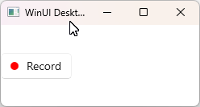
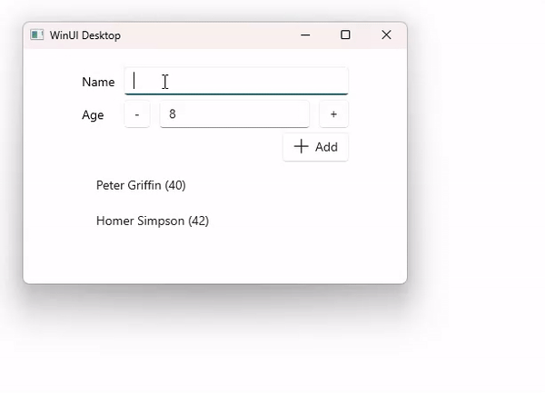

# 3. A felhasználói felület kialakítása

## A gyakorlat célja

A gyakorlat célja megismerkedni a vastagkliens alkalmazások fejlesztésének alapjaival a deklaratív XAML felületleíró technológián keresztül. Az itt tanult alapok az összes XAML dialektusra (WinUI, WPF, UWP, Xamarin.Forms, MAUI) igazak lesznek, vagy nagyon hasonlóan lehet őket alkalmazni, mi viszont a mai órán specifikusan a WinAppSDK / WinUI 3 keretrendszeren keresztül fogjuk használni a XAML-t.

## Előfeltételek

A labor elvégzéséhez szükséges eszközök:

* Windows 10 vagy Windows 11 operációs rendszer (Linux és macOS nem alkalmas)
* Visual Studio 2022
  * Windows Desktop Development Workload

    

## Megoldás

??? success "A kész megoldás letöltése"
    :exclamation: Lényeges, hogy a labor során a laborvezetőt követve kell dolgozni, tilos (és értelmetlen) a kész megoldás letöltése. Ugyanakkor az utólagos önálló gyakorlás során hasznos lehet a kész megoldás áttekintése, így ezt elérhetővé tesszük.

    A megoldás [GitHubon érhető el](https://github.com/bmeviauab00/lab-XAML-kiindulo) a `megoldas` ágon. A legegyszerűbb mód a letöltésére, ha parancssorból a `git clone` utasítással leklónozzuk a gépünkre a `megoldas` ágat:

    `git clone https://github.com/bmeviauab00/lab-xaml-kiindulo -b megoldas`

    Ehhez telepítve kell legyen a gépre a parancssori git, bővebb információ [itt](../../hazi/git-github-github-classroom/index.md#git-telepitese).

## Kiinduló projekt

Az első feladatban kialakítjuk a környezetet, amelyben a továbbiakban a XAML nyelv és a WinUI keretrendszer működését vizsgáljuk. A kiinduló projektet a Visual Studióval is legenerálhatnánk (WinUI 3 projekt, _Blank App, Packaged (WinUI 3 in Desktop)_ típus), de az óra gördülékenysége érdekében az előre elkészített projektet fogjuk használni.

A projektet a következő parancs kiadásával tudjuk leklónozni a gépünkre:

```cmd
git clone https://github.com/bmeviauab00/lab-xaml-kiindulo.git
```

Nyissuk meg a `HelloXaml.sln`-t.

Tekintsük át milyen fájlokat tartalmaz a projekt:

* App
    * Két fájl `App.xaml` és `App.xaml.cs`(később tisztázzuk két fájl tartozik hozzá)
    * Alkalmazás belépési pontja: `OnLaunched` felüldefiniált metódus az `App.xaml.cs`-ben
    * Esetünkben itt inicializáljuk az alkalmazás egyetlen ablakát a `MainWindow`-t
* MainWindow
    * Alkalmazásunk főablakához tartozó .xaml és .xaml.cs fájlok.

??? Note "További solution elemek"
    A kiinduló VS solution a következő elemeket tartalmazza még:

    * Dependencies
        * Frameworks
            * `Microsoft.AspNetCore.App`: .NET SDK metapackage (Microsoft .NET és SDK alapcsomagokat hivatkozza be)
            * Windows specifikus .NET SDK
        * Packages
            * Windows SDK Build Tools
            * WindowsAppSDK
    * Assets
        * Alkalmazás logói
    * app.manifest, Package.appxmanifest
        * Az alkalmazás metaadatait tartalmazó XML állomány, melyben többek között megadhatjuk a logókat, vagy pl. Androidhoz hasonlóan itt kell jogot kérjünk a biztonságkritikus rendszererőforrásokhoz.

**Futtassuk az alkalmazást!**

## XAML bevezetés

A felület leírását egy XML alapú leíró nyelvben, XAML-ben (ejtsd: zemöl) fogjuk megadni.

!!! tip "Grafikus designer felület"
    Bizonyos XAML dialektusok esetében (pl.: WPF) rendelkezésünkre áll grafikus designer eszköz is a felület kialakításához, de az általában kevésbé hatékony XAML leírást szokott generálni. Ráadásul már a Visual Studio is támogatja a Hot Reload működést XAML esetben, így nem szükséges leállítani az alkalmazást a XAML szerkesztése közben, a változtatásokat pedig azonnal láthatjuk a futó alkalmazásban. Ezért WinUI esetében már nem is kapunk designer támogatást a Visual Studioban. A tapasztalatok alapján vannak limitációi, "nagyobb" léptékű változtatások esetén szükség van az alkalmazás újraindítására.

### XAML nyelvi alapok

A XAML nyelv:

* Objektumpéldányosító nyelv
* Szabványos XML
* XML elemek/tagek: objektumokat példányosítanak, melyek osztályai szabványos .NET osztályok
* XML attribútumok: tulajdonságokat (dependency property-ket) állítanak be
* Deklaratív

Nézzük meg, milyen XAML-t generált a projekt sablon (`MainWindow.xaml`).
Láthatjuk, hogy a XAML-ben minden vezérlőhöz létrehozott egy XML elemet/taget.
A vezérlők tagjein pedig be vannak állítva a vezérlő tulajdonságai. Pl. `HorizontalAlignment`: igazítás a konténeren (esetünkben ablakon) belül.
Vezérlők tartalmazhatnak más vezérlőket, így vezérlőkből álló fa jön létre.

Nézzük meg részletesebben a `MainWindow.xaml`-t:

* Gyökér tagen névterek: meghatározzák, hogy az XML-ben milyen tageket és attribútumokat használhatunk
    * Alapértelmezett névtér: XAML elemek/vezérlők (pl. `Button`, `TextBox` stb.) névtere
    * `x` névtér: XAML parser névtere (pl.: `x:Class`, `x:Name`)
    * Egyéb tetszőleges névterek hivatkozhatók
* `Window` gyökér tag
    * Az ablakunk/oldalunk alapján egy .NET osztály jön létre, mely a `Window` osztályból származik.
    * A leszármaztatott osztályunk nevét az `x:Class` attribútum határozza meg: az `x:Class="HelloXaml.MainWindow"` alapján egy `HelloXaml` névtérben egy `MainWindow` nevű osztály lesz.
    * Ez egy partial class, az osztály "másik fele" az ablakhoz/oldalhoz tartozó ún. a code-behind fájlban (`MainWindow.xaml.cs`) található. Lásd következő pont.
* Code-behind fájl (`MainWindow.xaml.cs`):
    * A partial classunk másik "fele": ellenőrizzük, hogy itt az osztály neve és névtere megegyezik a .xaml fájlban megadottal (partial class!).
    * Eseménykezelő és segédfüggvényeket tesszük ide (többek között).
    * `this.InitializeComponent();`: a konstruktorban mindig meg kell hívni, ez olvassa majd be futás közben a XAML-t, ez példányosítja, inicializálja az ablak/oldal tartalmát (vagyis a XAML-fájlban megadott vezérlőket az ott meghatározott tulajdonságokkal).

Töröljük ki a `Window` tartalmát és a code-behind fájlból az eseménykezelőt (`myButton_Click` függvény).
Most kézzel fogunk XAML-t írni és ezzel a felületet kialakítani. Vegyünk fel egy `Grid`-et a `Window`-ba, mellyel a későbbiekben egy táblázatos elrendezést (layout) fogunk tudunk kialakítani:

```xml hl_lines="11 13"
<?xml version="1.0" encoding="utf-8"?>
<Window
    x:Class="HelloXaml.MainWindow"
    xmlns="http://schemas.microsoft.com/winfx/2006/xaml/presentation"
    xmlns:x="http://schemas.microsoft.com/winfx/2006/xaml"
    xmlns:local="using:HelloXaml"
    xmlns:d="http://schemas.microsoft.com/expression/blend/2008"
    xmlns:mc="http://schemas.openxmlformats.org/markup-compatibility/2006"
    mc:Ignorable="d">

    <Grid>
        
    </Grid>
</Window>
```

Futtassuk az alkalmazást (pl. az ++f5++ billentyűvel). A `Grid` most kitölti a teljes ablakot, a színe megegyezik az ablak háttérszínével, ezért szemmel nem tudjuk megkülönböztetni.

A következő feladatok során hagyjuk futni az alkalmazást, hogy azonnal láthassuk a felületen eszközölt módosításainkat.

!!! Warning "Hot Reload limitációk"
    Tartsuk szem előtt a Hot Reload limitációit: ha egy változásunk nem akar a futó alkalmazás felületén megjelenni, akkor indítsuk majd újra az alkalmazást!

### Objektum példányok és tulajdonságaik

Most azt nézzük meg, hogyan tudunk XAML alapokon objektumokat példányosítani és ezen objektumok tulajdonságait beállítani.

Vegyünk fel a `Grid` belsejébe egy `Button`-t. A `Content` tulajdonsággal adhatjuk meg a gomb szövegét, pontosabban a tartalmát.

```xml
<Button Content="Hello WinUI App!"/>
```

Ez azon a helyen, ahol deklaráltuk, futás közben létrehoz egy `Button` objektumot, és a `Content` tulajdonságát a "Hello WinUI App!" szövegre állítja. Ezt megtehettük volna a code-behind fájlban C# nyelven is következőképpen (de ez kevésbé olvasható kódot eredményezne):

```csharp
// Pl. a konstruktor végére beírva:

Button b = new Button();
b.Content = "Hello WinUI App!";
rootGrid.Children.Add(b); 
// Az előző a sorhoz XAML fájlban a Gridnek meg kellene adni az x:Name="rootGrid" 
// attribútumot, hogy rootGrid néven elérhető legyen a code-behind fájlban
```

:exclamation: Ez a példa nagyon jól szemlélteti, hogy a XAML alapvetően egy objektumpéldányosító nyelv, és támogatja objektumok tulajdonságainak beállítását.

A `Content` tulajdonság különleges, nem csak XML attribútumban lehet megadni, hanem tagen (XML elemen) belül is.

```xml
<Button>Hello WinUI App!</Button>
```

Sőt! A gombra nem csak feliratot rakhatunk, hanem tetszőleges más elemet. Pl. rakjunk bele egy piros kört. A kör 10 pixel széles, 10 pixel magas, a szín (`Fill`) pedig piros.

```xml
<Button>
    <Ellipse Width="10" Height="10" Fill="Red" />
</Button>
```

Ezt korábbi .NET UI technológiák esetében (pl. Windows Forms) nem lett volna ilyen egyszerű megvalósítani.

Legyen most a piros kör mellett a _Record_ felirat (hogy értelme is legyen a piros körös gombnak). A gombnak csak egy gyereke lehet, ezért egy layout vezérlőbe (pl. egy `StackPanel`-be) kell beraknunk a kört és a szöveget (`TextBlock`). Adjunk egy bal oldali margót is a `TextBlock`-nak, hogy ne érjenek össze.

```xml
<Button>
    <StackPanel Orientation="Horizontal">
        <Ellipse Width="10" Height="10" Fill="Red" />
        <TextBlock Text="Record" Margin="10,0,0,0" />
    </StackPanel>
</Button>
```

A `StackPanel` egy egyszerű, vezérlők elrendezésére szolgáló layout panel:  a tartalmazott vezérlőket `Horizental` `Orientation` megadása esetén egymás mellé, `Vertical` `Orientation` esetén egymás alá helyezi el. Így a példánkban egyszerűen egymás mellé teszi a két vezérlőt.

Az eredmény a következő:



!!! note "XAML vektorgrafikus vezérlők"
    Lényeges, hogy a XAML vezérlők nagy része vektorgrafikus. Ez a gomb ugyanolyan élesen fog kinézni (nem tapasztalunk "pixelesedést") bármilyen bármilyen DPI  ill. nagyítás mellett nézzük.

A XAML-ben példányosított vezérlők tulajdonságainak megadására három lehetőség van (ezeket részben használtuk is már):

* Property ATTRIBUTE syntax
* Property ELEMENT syntax
* Property CONTENT syntax

Tekintsük át most részletesebben ezeket a lehetőségeket:

1. **Property ATTRIBUTE syntax**.  Már alkalmaztuk, mégpedig a legelső példánkban:

    ```xml
    <Button Content="Hello WinUI App!"/>
    ```

    Az elnevezés onnan ered, hogy a tulajdonságot XML **attribútum** formájában adjuk meg. Segítségével - mivel XML attribútum csak string lehet! - csak sztring formában megadott egyszerű szám/sztring/stb. érték, ill. code-behind fájlban definiált tagváltozó, eseménykezelő érhető el. De típuskonverterek segítségével "összetett" objektumok is megadhatók. Erről sok szó nem lesz, de a beépített típuskonvertereket sokszor használjuk, gyakorlatilag "ösztönösen". Példa:

    Vegyünk fel a `Grid`-re egy háttérszínt:

    ```xml
    <Grid Background="Azure">
    ```

    Vagy megadhatjuk hexában is:

    ```xml
    <Grid Background="#FFF0FFFF">
    ```

    A margó (`Margin`) is egy összetett érték, a hozzá tartozó típuskonveter **vesszővel (vagy szóközzel) elválasztva várja a négy oldalra vonatkozó értékeket (bal, fent, jobb, lent)**. Már használtuk is a `Record` feliratú TextBlockunk esetében. Megjegyzés: margónak egyetlen szám is megadható, akkor mind a négy oldalra ugyanazt fogja alkalmazni.

1. **Property ELEMENT syntax**. Segítségével egy tulajdonságot típuskonverterek nélkül tudjuk egy összetett módon példányosított/felparaméterezett objektumra állítani. Nézzük egy példán keresztül.
    * A fenti példában `Background` tulajdonság beállításakor az `Azure` valójában egy `SolidColorBrush`-t hoz létre, melynek a színét világoskékre állítja. Ezt típuskonverter alkalmazása nélkül az alábbi módon lehet megadni:
    
    ```xml
    <Grid>
        <Grid.Background>
            <SolidColorBrush Color="Azure" />
        </Grid.Background>
        ...
    ```

    Ez a `Grid` `Background` tulajdonságát állítja be a megadott `SolidColorBrush`-ra. Ez az ún. "property element syntax" alapú tulajdonságmegadás.
      
      * A név onnan ered, hogy a tulajdonságot egy XML elem (és pl. nem XML attribútum) formájában adjuk meg.
      * :exclamation: Itt a `<Grid.Background>` elem nem objektumpéldányt hoz létre, hanem az adott (esetünkben `Background`) property értékét állítja be a megfelelő objektum példányára (esetünkben egy `SolidColorBrush`-ra). Ezt az XML elem nevében levő pont alapján lehet tudni.
      * Ez "terjengősebb" forma tulajdonság megadására, de teljes rugalmasságot biztosít. 
      
    Cseréljük le a `SolidColorBrush`-t egy színátmenetes `Brush`-ra (`LinearGradientBrush`):
    
    ```xml
    <Grid>
        <Grid.Background>
            <LinearGradientBrush>
                <LinearGradientBrush.GradientStops>
                    <GradientStop Color="Black" Offset="0" />
                    <GradientStop Color="White" Offset="1" />
                </LinearGradientBrush.GradientStops>
            </LinearGradientBrush>
        </Grid.Background>
        ...
    ```

    `LinearGradientBrush`-ra nincs típuskonverter, ezt csak az element syntax segítségével tudtuk megadni!

     Kérdés, hogyan lehetséges az, hogy a `Grid` vezérlő `Background` tulajdonságának `SolidColorBrush` és `LinearGradientBrush` típusú ecsetet is meg tudtunk adni? A válasz nagyon egyszerű, a polimorfizmus teszi ezt lehetővé:

     *  A `SolidColorBrush` és `LinearGradientBrush` osztályok a beépített `Brush` osztály leszármazottai.
     *  A `Background` tulajdonság egy `Brush` típusú property, így a polimorfizmus miatt bármely leszármazottját lehet használni.

    ??? note Megjegyzések
        * A fenti példákban a `Color` (szín) megadásánál pl. a `Color="Azure"` esetben az `Azure` szóból is típuskonverter készít kék `Color` példányt. Így nézne a korábbi, `SolidColorBrush` alapú példánk teljesen kifejtve:
        ```xml
        <Grid>
            <Grid.Background>
                <SolidColorBrush>
                    <SolidColorBrush.Color>
                        <Color>#FFF0FFFF</Color>
                    </SolidColorBrush.Color>
                </SolidColorBrush>
            </Grid.Background>
            ...
        ```
        * Ahol támogatott, érdemes kihasználni a típuskonvertereket, és attribute syntaxot használni, hogy ne legyen terjengős a XAML leírásunk.
        * Értéktípusoknál (`struct`), mint amilyen a `Color` is, már az objektum példányosításakor ("konstruktor időben") kell megadni az értéket, ezért itt nem lehet a propertyket külön állítgatni, muszáj típuskonverterre bízni magunkat.

2. **Property CONTENT syntax**. Annak érdekében, hogy jobban megértsük, nézzük meg, milyen háromféle módon tudjuk beállítani egy gomb `Content` tulajdonságát valamilyen szövegre (ezt laboron nem kell megtenni, elég, ha jelen útmutatóban nézzük közösen):
   
      * Property **attribute** syntax (már használtuk):
        ```xml
        <Button Content="Hello WinUI App!"/>
        ```
      * Állítsuk be az előző pontban tanult property **element** syntax alapján:
       ```xml
       <Button>
           <Button.Content>
           Hello WinUI App!
           </Button.Content>
       </Button>
       ```
       * Minden vezérlő meghatározhat magáról egy kitüntetett "Content" tulajdonságot, melynél nem kell kiírni a nyitó és csukó tag-eket. Vagyis az előző példában alkalmazott `<Button.Content>` nyitó és záró tag-ek ennél az egy tulajdonságnál elhagyhatók:
       ```xml
       <Button>
           Hello WinUI App!
       </Button>
       ```
       Vagy egy sorba írva:
       ```xml
       <Button>Hello WinUI App!</Button>
       ```
       Ez ismerős, láttuk a bevezető példánkban: ez az ún. **Property CONTENT syntax** alapú tulajdonságmegadás. Az elnevezés is sugallja, hogy ezt az egy tulajdonságot a vezérlő "tartalmi" részében, contentjében is megadhatjuk. Nem minden vezérlő esetében `Content` ezen kitüntetett tulajdonság neve:  `StackPanel`-nél és `Grid`-nél `Children` a neve. Emlékezzünk vissza, ill. nézzük meg a kódot: ezeket már használtuk is:  ugyanakkor, nem írtuk ki a `StackPanel.Children`, ill. `Grid.Children` XML elemeket a `StackPanel`, ill. `Grid` belsejének megadásakor (de megtehettük volna!)

Írjuk vissza a `Grid` hátterét valami szimpatikusan egyszerűre, vagy töröljük ki a háttérszín megadását.

### Eseménykezelés

A XAML applikációk eseményvezérelt alkalmazások. Minden felhasználói interakcióról események segítségével értesülünk, ezek hatására frissíthetjük a felületet.

Most kezeljük le a gombon történő kattintást.

Előkészítő lépésként adjunk nevet a `TextBlock` vezérlőnknek, hogy a code-behind fájlból hivatkozni tudjunk majd rá a későbbiekben:

```xml
<TextBlock x:Name="recordTextBlock" Text="Record" Margin="10,0,0,0" />
```

Az `x:Name` a XAML parsernek szól, és ezen a néven fog létrehozni egy tagváltozót az osztályunkban, mely az adott vezérlő referenciáját tartalmazza. :exclamation: Gondoljuk át: mivel tagváltozó lesz, a code-behind fájlban el tudjuk érni, hiszen az egy "partial része" ugyanazon osztálynak!

!!! tip "Elnevezett vezérlők"
    Ne adjunk nevet azoknak a vezérlőknek, melyekre nem akarunk hivatkozni. (Szoktassuk magunkat arra, hogy csak arra hivatkozunk közvetlenül, amire nagyon muszáj. Ebben az adatkötés is segít majd.)

    Kivétel: Ha nagyon bonyolult a vezérlőhierarchiánk, segíthetnek a nevek a kód átláthatóbbá tételében, mivel a _Live Visual Tree_ ablakban megjelennek, illetve a generált eseménykezelő-nevek is ehhez igazodnak.

Kezeljük le a gomb `Click` eseményét, majd próbáljuk ki a kódot.

```xml title="MainWindow.xaml-be"
<Button Click="RecordButton_Click">
```

```csharp title="MainWindow.xaml.cs-be"
private void RecordButton_Click(object sender, RoutedEventArgs e)
{
    recordTextBlock.Text = "Recording...";
}
```

!!! tip "Eseménykezelők létrehozása"
    Ha az eseménykezelőknél nem a _New Event Handler_-t választjuk, hanem beírjuk kézzel a kívánt nevet, majd ++f12++-t nyomunk, vagy a jobb gomb / Go to Definition-t választjuk, az eseménykezelő legenerálásra kerül a code-behind fájlban.

Az eseménykezelőnek két paramétere van: a küldő objektum (`object sender`) és az esemény paramétereit/körülményeit tartalmazó paraméter (`EventArgs e`). Nézzük ezeket részletesebben:

* `object sender`: Az esemény kiváltója. Esetünkben ez maga a gomb, `Button`-ra kasztolva használhatnánk is. Ritkán használjuk ez a paramétert.
* A második paraméter mindig `EventArgs` típusú, vagy annak leszármazottja (ez az esemény típusától függ), melyben az esemény paramétereit kapjuk meg. A `Click` esemény esetében ez `RoutedEventArgs` típusú.
  
!!! Note "Eseményargumentumok"
    Néhány eseményargumentum típus:

      * `RoutedEventArgs`: pl. a `Click` esemény estében használandó, ahogy a példánkban is volt. Az `OriginalSource` tulajdonságban megkapjuk azt a vezérlőt, melynél először kiváltódott az esemény.
          * Megjegyzés: a fenti esetben ez maga a gomb, de ha pl. egy egérlenyomás eseményt (nem a `Click`, hanem `PointerPressed`) kezelnénk pl. a `StackPanel`-en, akkor lehet, hogy az egyik gyerekelemét kapnánk meg, ha arra kattintottak.
      * `KeyRoutedEventArgs`: pl. `KeyDown` (billentyű lenyomása) esemény esetében megkapjuk benne a lenyomott billentyűt.
      * `PointerRoutedEventArgs`: pl. `PointerPressed` (egér/toll lenyomása) esemény esetében használjuk, rajta keresztül lekérdezhetők - többek között - a kattintás koordinátái.
  
A XAML eseménykezelők teljes egészében a C# nyelv eseményeire épülnek (`event` kulcsszó, lásd [előző gyakorlat](../2-nyelvi-eszkozok/index.md#3-feladat-esemeny-event)):

Pl. a

```xml
<Button Click="RecordButton_Click">
```

erre képződik le:

```csharp
Button b = new Button();
b.Click += RecordButton_Click;
```


## Layout, elrendezés

A vezérlők elrendezését két dolog határozza meg:

1. Layout (panel) vezérlők és kapcsolható tulajdonságaik (attached property)
2. Szülő vezérlőn belüli általános pozíció tulajdonságok (pl. margó, igazítás függőlegesen vagy vízszintesen)

Beépített layout vezérlők például:

* `StackPanel`: elemek egymás alatt vagy mellett
* `Grid`: definiálhatunk egy rácsot, melyhez igazodnak az elemek
* `Canvas`: explicit pozícionálhatók az elemek az X és Y koordinátájuk megadásával
* `RelativePanel`: elemek egymáshoz képesti viszonyát határozhatjuk meg kényszerekkel

A `Grid`-et fogjuk kipróbálni (általában ezt használjuk az ablakunk/oldalunk alapelrendezésének kialakítására). Egy olyan felületet készítünk el, melyen személyeket lehet egy listába felvenni, nevük és életkoruk megadásával. A következő elrendezés kialakítása a végső célunk:



Pár lényeges viselkedésbeli megkötés:

* Az ablak átméretezésekor az űrlap fix szélességű legyen, és maradjon középre igazítva.
* Az Age sorban a + gombbal növelhető, a - gombbal csökkenthető az életkor.
* Az Add gombbal a fent meghatározott adatokkal felveszi a személyt az alsó listába (az ábrán az alsó listában két személy adatai láthatók).

Definiáljunk a gyökér `Grid`-en 4 sort és 2 oszlopot. Az első oszlopába kerüljenek a címkék, a második oszlopba pedig a beviteli mezők. A meglévő gombunkat is rakjuk a 3. sorba, és írjuk át a tartalmát _Add_-ra, a kör helyett pedig vegyünk fel egy `SymbolIcon`-t. A 4. sorban pedig listát helyezzünk el, ami 2 oszlopot is foglaljon el.

```xml
<Grid x:Name="rootGrid">
    <Grid.RowDefinitions>
        <RowDefinition Height="Auto" />
        <RowDefinition Height="Auto" />
        <RowDefinition Height="Auto" />
        <RowDefinition Height="*" />
    </Grid.RowDefinitions>
    <Grid.ColumnDefinitions>
        <ColumnDefinition Width="Auto" />
        <ColumnDefinition Width="*" />
    </Grid.ColumnDefinitions>

    <TextBlock Grid.Row="0" Grid.Column="0" Text="Name"/>
    <TextBox Grid.Row="0" Grid.Column="1" />
    <TextBlock Grid.Row="1" Grid.Column="0" Text="Age"/>
    <TextBox Grid.Row="1" Grid.Column="1" />

    <Button Grid.Row="2" Grid.Column="1">
        <StackPanel Orientation="Horizontal">
            <SymbolIcon Symbol="Add" />
            <TextBlock Text="Add" Margin="5,0,0,0"/>
        </StackPanel>
    </Button>
    
    <ListView Grid.Row="3" Grid.Column="0" Grid.ColumnSpan="2"/>
</Grid>
```

A sor- és oszlopdefiníciók esetében megadhatjuk, hogy az adott sor vegye fel a tartalmának a méretét (`Auto`), vagy töltse ki a maradék helyet (`*`), de akár fix szélességet is megadhatnánk pixelben (`Width` tulajdonság).
Ha több `*` is szerepel a definíciókban, akkor azok arányosíthatóak pl.: `*` és `*` 1:1-es arányt jelent, míg a `*` és `3*` 1:3-at.

A `Grid.Row`, `Grid.Column` úgynevezett **Attached Property**-k (csatolt tulajdonságok). Ez azt jelenti, hogy a vezérlő, melynél alkalmazzuk, nem rendelkezik ilyen tulajdonsággal, és ezt az információt csak „hozzácsatoljuk”. Ez az információ esetünkben a `Grid`-nek lesz fontos, hogy el tudja helyezni a gyerekeit. A `Grid.Row` és `Grid.Column` alapértelmezett értéke a 0, tehát ezt ki sem kéne írnunk.

!!! note "Imperatív UI leírás"
    Más UI keretrendszerekben, ahol imperatív a felület összeállítása, ezt egyszerűen megoldják függvényparaméterekkel – pl.: `myPanel.Add(new TextBox(), 0, 1)`.

Még magyarázatra szorulhat a `ListView`-nál megadott `Grid.ColumnSpan="2"` csatolt tulajdonság: a `ColumnSpan` és `RowSpan` azt határozzák meg, hány oszlopon illetve soron "átívelően" helyezkedjen el a vezérlő. A példánkban a `ListView` mindkét oszlopot kitölti.

Próbáljuk ki az alkalmazást (ha nem fordul a kód, akkor töröljük a code behind fájlban a `RecordButton_Click` eseménykezelőt).

Jelen állapotában a `Grid` kitölti a teljes teret vízszintesen és függőlegesen is. Mi ennek az oka? A vezérlők elrendezésének egyik alapilére a `HorizontalAlignment` és `VerticalAlignment`  tulajdonságuk. **Ezek azt határozzák meg, hogy vízszintesen és függőlegesen hol helyezkedjen el az adott vezérlő az őt tartalmazó konténerben (vagyis a szülő vezérlőben)**. A lehetséges értékek:

* `HorizontalAlignment`: `Top`, `Center`, `Bottom`, `Stretch` (felülre, középre, alulra igazítva, vagy tér kitöltése függőlegesen)
* `VerticalAlignment`: `Left`, `Center`, `Right`, `Stretch` (balra, középre, jobbra igazítva, vagy tér kitöltése vízszintesen)

(Megjegyzés: a Stretch esetében szükséges, hogy ne legyen a `Height` ill. `Width` tujadonság megadva a vezérlőre.)

A `Grid`-ünknek nem adtunk meg `HorizontalAlignment` és `VerticalAlignment` tulajdonságot, így annak értéke a Grid esetében alapértelmezett `Stretch`, emiatt a `Grid` mindkét irányban kitölti a teret a szülő konténerében, vagyis az ablakban.

A felületünk még nem úgy néz ki, mint amit szeretnénk, finomítsunk kicsit a kinézetén. Az eszközlendő változások:

* Ne töltse ki az egész képernyőt a táblázat, hanem legyen vízszintesen középen
    * `HorizontalAlignment="Center"`
* Legyen 300px széles
    * `Width="300"`
* Legyen a sorok között 10px, az oszlopok között 5px távolság és tartsunk 20px távolságot a konténer szélétől
    * `RowSpacing="5" ColumnSpacing="10" Margin="20"`
* Igazítsuk a címkéket (`TexBlock`) függőlegesen középre
    * `VerticalAlignment="Center"`
* Igazítsuk a gombot jobbra
    * `HorizontalAlignment="Right"`
* Tegyük beazonosíthatóvá a listát
    * `BorderThickness="1"` és `BorderBrush="DarkGray"`

```xml hl_lines="2-6 18 20 23 33-34"
<Grid x:Name="rootGrid"
      Width="300"
      HorizontalAlignment="Center"
      Margin="20"
      RowSpacing="5"
      ColumnSpacing="10">
    <Grid.RowDefinitions>
        <RowDefinition Height="Auto" />
        <RowDefinition Height="Auto" />
        <RowDefinition Height="Auto" />
        <RowDefinition Height="*" />
    </Grid.RowDefinitions>
    <Grid.ColumnDefinitions>
        <ColumnDefinition Width="Auto" />
        <ColumnDefinition Width="*" />
    </Grid.ColumnDefinitions>

    <TextBlock Grid.Row="0" Grid.Column="0" Text="Name" VerticalAlignment="Center"/>
    <TextBox Grid.Row="0" Grid.Column="1" x:Name="tbName" />
    <TextBlock Grid.Row="1" Grid.Column="0" Text="Age" VerticalAlignment="Center"/>
    <TextBox Grid.Row="1" Grid.Column="1" x:Name="tbAge"/>

    <Button Grid.Row="2" Grid.Column="1" HorizontalAlignment="Right">
        <StackPanel Orientation="Horizontal">
            <SymbolIcon Symbol="Add"/>
            <TextBlock Text="Add" Margin="5,0,0,0" />
        </StackPanel>
    </Button>

    <ListView Grid.Row="3"
              Grid.Column="0"
              Grid.ColumnSpan="2"
              BorderThickness="1"
              BorderBrush="DarkGray"/>
</Grid>
```

Bővítsük ki még két gombbal az űrlapunkat (+/- gombok az életkorhoz, lásd korábbi animált képernyőkép):

* ’-’: a `TextBox` bal oldalán
* ’+’ a`TextBox` jobb oldalán
  
Ehhez vegyünk fel a

```xml
<TextBox Grid.Row="1" Grid.Column="1" x:Name="tbAge"/>
```

sor helyére (azt kitörölve) egy 1 soros, 3 oszloppal rendelkező `Grid`-et:

```xml
<Grid Grid.Row="1" Grid.Column="1" ColumnSpacing="5">
    <Grid.ColumnDefinitions>
        <ColumnDefinition Width="Auto" />
        <ColumnDefinition Width="*" />
        <ColumnDefinition Width="Auto" />
    </Grid.ColumnDefinitions>

    <Button Grid.Row="0" Grid.Column="0" Content="-" />
    <TextBox Grid.Row="0" Grid.Column="1" x:Name="tbAge" />
    <Button Grid.Row="0" Grid.Column="2" Content="+" />
</Grid>
```

!!! tip "Több layout vezérlő egymásba ágyazása"
    Feltehetjük a kérdést, hogy miért nem a külső `Grid`-ben vettünk fel plusz oszlopokat és sorokat (a `ColumnSpan` megfelelő alkalmazásával a meglévő vezérlőkre).
    Helyette egységbezárás elvét követtük: az újonnan bevezetett vezérlők alapvetően egybe tartozó elemek, így átláthatóbb megoldást kaptunk azáltal, hogy külön `Grid` vezérlőbe tettük őket.
    A külső `Grid` bővítése akkor lenne indokolt, ha spórolni akarnánk a vezérlők létrehozásával, teljesítményokok miatt. Esetünkben ez nem indokolt.

Készen is vagyunk az egyszerű űrlapunk kinézetének kialakításával.

## Adatkötés

### Binding

A következő lépésben azt oldjuk meg, hogy az előbb elkészített kis űrlapon egy személy adatait lehessen megadni, módosítani.
Ehhez először készítsünk egy adatosztályt `Person` néven a project egy újonnan létrehozott `Models` mappájába.

```csharp
public class Person
{
    public string Name { get; set; }
    public int Age { get; set; }
}
```

Azt itt lévő két tulajdonságot akarjuk a `TextBox` vezérlőkhöz kötni, ehhez adatkötést fogunk alkalmazni.
Az ablakunk code-behind fájljában vezessünk be egy propertyt, mely egy `Person` objektumra hivatkozik, és adjunk ennek kezdőértéket a konstruktorban:

```csharp
public Person NewPerson { get; set; }

public MainWindow()
{
    InitializeComponent();

    NewPerson = new Person()
    {
        Name = "Eric Cartman",
        Age = 8
    };
}
```

A következő lépésben a fenti `NewPerson` objektum

* `Name` tulajdonságát kössük hozzá a `tbName` `Textbox` `Text` tulajdonságához
* `Age` tulajdonságát kössük hozzá a `tbAge` `Textbox` `Text` tulajdonságához
, mégpedig adatkötéssel (data binding):

```xml
Text="{x:Bind NewPerson.Name}"
Text="{x:Bind NewPerson.Age}"
```
(a `tbName` ill. `tbAge` `TextBox`-ok soraiba vegyük fel a fenti 1-1 tulajdonság beállítást)

!!! danger "Fontos"
    Az adatkötésnek az a lényege, hogy nem kézzel, a code-behind fájlból állítgatjuk a felületen megjelenő vezérlők tulajdonságait (esetünkben a szövegét), hanem összerendeljük/ összekötjük a tulajdonságokat a platform adatkötés mechanizmusával. Így azt is elérhetjük, hogyha az egyik tulajdonság megváltozik, akkor a másik is automatikusan változzon meg!

A `Text="{x:Bind}"` szintaktika az úgynevezett markup extension: ez speciális jelentéssel rendelkezik a XAML feldolgozó számára. Elsősorban emiatt használunk XAML és nem sima XML-t.
Lehetőségünk van akár saját Markup Extension-t is készíteni, de ez nem tananyag.

Futtassuk! Látható, hogy az adatkötés miatt automatikusan bekerült a két `TextBox` `Text` tulajdonságába a `NewPerson` objektum (mint adatforrás) `Name` és `Age` tulajdonságaiban megadott név és életkor.

### Változásértesítés

Implementáljuk a +/- gombok `Click` eseménykezelőit.

```xml
<Button Grid.Row="1" Grid.Column="0" Content="-" Click="DecreaseButton_Click"/>
<!-- ... -->
<Button Grid.Row="1" Grid.Column="2" Content="+" Click="IncreaseButton_Click"/>
```

```csharp
private void DecreaseButton_Click(object sender, RoutedEventArgs e)
{
    NewPerson.Age--;
}

private void IncreaseButton_Click(object sender, RoutedEventArgs e)
{
    NewPerson.Age++;
}
```

A korábbi pontban bevezetett adatkötés miatt azt várnánk, hogy ha a `NewPerson` adatforrás `Age` tulajdonságát változtatjuk a fenti eseménykezelőkben, akkor a felületünkön a `tbAge` `Textbox` vezérlőnk ezt leköveti. Próbáljuk ki! Ez még egyelőre nem működik, ugyanis ehhez **szükség van még az `INotifyPropertyChanged` interfész megvalósítására** is.

1. Implementáljuk az `INotifyPropertyChanged` interfészt a `Person` osztályunkban. Ha adatkötünk ehhez az osztályhoz, akkor a rendszer a `PropertyChanged` eseményre fog feliratkozni, ennek az eseménynek a elsütésével tudjuk értesíteni a bindingot, ha egy property megváltozott.

    ```csharp
    public class Person : INotifyPropertyChanged
    {
        public event PropertyChangedEventHandler PropertyChanged;

        private string name;
        public string Name
        {
            get { return name; }
            set
            {
                if (name != value)
                {
                    name = value;
                    PropertyChanged?.Invoke(this, new PropertyChangedEventArgs(nameof(Name)));
                }
            }
        }

        private int age;
        public int Age
        {
            get { return age; }
            set
            {
                if (age != value)
                {
                    age = value;
                    PropertyChanged?.Invoke(this, new PropertyChangedEventArgs(nameof(Age)));
                }
            }
        }
    }
    ```

    !!! tip "Terjengős a kód?"
        A későbbiekben ezt a logikát ki is szervezhetnénk egy ősosztályba, de ez már az MVVM mintát vezetné elő, mely egy későbbi tematikához kapcsolódik. Tehát ne ijedjünk meg ettől a kissé csúnyányka kódtól.

2. Az adatkötésen kapcsoljuk be a változásértesítést a `Mode` `OneWay`-re történő módosításával, mivel az `x:Bind` alapértelmezett módja a `OneTime`, mely csak egyszeri adatkötést jelent.

    ```xml
    Text="{x:Bind NewPerson.Age, Mode=OneWay}"
    ```

Próbáljuk ki! Az eseménykezelők változtatják az adatforrást (`NewPerson`), ennek hatására most már változik a felület is a megfelelően előkészített adatkötés miatt.

## Vissza (vezérlőből adatforrásba) irányú adatkötés

Az Age mintájára, a Name tulajdonságra vonatkozó adatkötést is állítsuk egyirányúra:

```xml
Text="{x:Bind NewPerson.Name, Mode=OneWay}"
```

Indítsuk ez az alkalmazást, majd ezt követően tegyünk egy töréspontot a `Person` osztály `Name` tulajdonságának setterébe (`if (name != value)` sor) , és próbáljuk, hogy vissza irányba is működik-e az adatkötés: ha megváltoztatjuk az egyik `TextBox` értékét, megváltozik-e a `NewPerson` objektum `Name` tulajdonsága? Gépeljünk valamit a Name-hez tartozó szövegdobozba, majd kattintsunk át egy másik mezőbe: ekkor a Textbox tartalma "véglegesítődik", tartalma vissza kellene íródjon az adatforrásba, de mégsem történik meg, nem fut rá a kód a töréspontunkra.

Ez azért van így, mert fentebb `OneWay` adatkötést használtunk, mely csak az adatforrásból a felületre irányú adatkötést jelent. **A vissza irányhoz `TwoWay`-re kell állítsuk az adatkötés módját.**

```xml
Text="{x:Bind Name, Mode=TwoWay}"
Text="{x:Bind Age, Mode=TwoWay}"
```

Próbáljuk ki! Így már működik a vissza irányú adatkötés is: a vezérlő adott tulajdonsága (esetünkben szövege) és az adatforrás bármely irányú változás esetén szinkronban marad.

## Listák

A következőkben a listás adatkötés alkalmazását fogjuk gyakorolni.
Vegyük fel a `Person`-ök listáját a nézetünk code-behind fájljába, a konstruktor elején pedig adjunk neki kezdőértéket.

```csharp hl_lines="1 13-17"
public List<Person> People { get; set; }

public MainWindow()
{
    InitializeComponent();

    NewPerson = new Person()
    {
        Name = "Eric Cartman",
        Age = 8
    };

    People = new List<Person>()
    {
      new Person() { Name = "Peter Griffin", Age = 40 },
      new Person() { Name = "Homer Simpson", Age = 42 },
    };
}
```

Adatkötéssel állítsuk be a `ListView` vezérlő `ItemsSource` tulajdonságán keresztül, milyen adatforrásból dolgozzon.

```xml
<ListView Grid.Row="3" Grid.ColumnSpan="2" ItemsSource="{x:Bind People}"/>
```

Próbáljuk ki!

Látjuk, hogy megjelent két elem a listában. Persze nem az van kiírva, amit mi szeretnénk, de ezen könnyen segíthetünk.
Alapértelmezetten ugyanis a `ListView` a `ToString()`-et hív a listaelemeken, ami ha nem definiáljuk felül, akkor az osztály típusának `FullName` tulajdonsága (vagyis a típus neve).

Állítsunk be a `ListView`-nk **`ItemTemplate` tulajdonságát** (a már jól ismert property element syntax-szal), mely a listaelem megjelenését adja meg egy sablon segítségével: esetünkben legyen ez egycellás `Grid`, ahol a `TextBlock`-ok a `Person` tulajdonságait jelenítik meg, a nevet balra, az életkort jobbra igazítva.

```xml
<ListView Grid.Row="3" Grid.ColumnSpan="2" ItemsSource="{x:Bind People}">
    <ListView.ItemTemplate>
        <DataTemplate x:DataType="model:Person">
            <Grid>
                <TextBlock Text="{x:Bind Name}" />
                <TextBlock Text="{x:Bind Age}" HorizontalAlignment="Right" />
            </Grid>
        </DataTemplate>
    </ListView.ItemTemplate>
</ListView>
```

**A `DataTemplate` egy olyan felületsablon, melyet a `ListView` (he megadjuk az `ItemTemplate` tulajdonságának) minden elemére alkalmazni fog a megjelenítés során.**

Mivel az `x:Bind` fordítás idejű adatkötés, ezért az adatok típusát is meg kell adnunk az adatsablonban az `x:DataType` attribútummal. A fenti példában a `model:Person`-t adtuk meg, vagyis azt szeretnénk, hogy a `model` **prefix** a kódunk `HelloXaml.Models` névterére képződjön le (hiszen ebben van a `Person` osztály). Ehhez a XAML fájlunk elején a `Window` tag attribútumaihoz fel kell vegyük a következő **névtér deklarációt** is:
`xmlns:model="using:HelloXaml.Models"` (ezt követően a `model` prefix használható lesz). Ezt megtehetjük kézzel, vagy a Visual Studio segítségével is: csak kattintsunk bele az aláhúzott (hibásnak megjelölt) `model:Person`szövegbe, majd kattintsuk a sor elején megjelenő lámpácskán (vagy `Ctrl` + `.` billentyűkombináció), és válasszuk ki a megjelenő *"Add xmlns using:HelloXaml.Models"* elemet.


Próbáljuk ki! Most már jól jelennek meg a listában az elemek.

Az _Add_ gomb hatására rakjuk bele a listába az űrlapon található személy adataival egy új `Person` másolatát, majd töröljük ki az űrlap adatait a `NewPerson` objektumunkban.

Ehhez vezessünk be egy `Click` eseménykezelőt az _Add_ gombunkra:

```xml
<Button ... Click="AddButton_Click">
```

```csharp hl_lines="3"
private void AddButton_Click(object sender, RoutedEventArgs e)
{
    People.Add(new Person()
    { 
        Name = NewPerson.Name,
        Age = NewPerson.Age,
    });

    NewPerson.Name = string.Empty;
    NewPerson.Age = 0;
}
```

Nem jelenik meg a listában az új elem, mert a `ListView` nem értesül arról, hogy új elem került a listába. Ezt könnyen orvosolhatjuk: a `List<Persont>`-t cseréljük le `ObservableCollection<Person>`-re:

```csharp
public ObservableCollection<Person> People { get; set; }
```

!!! tip "`ObservableCollection<T>`"
    Fontos, hogy itt nem maga a `People` tulajdonság értéke változott, hanem a `List<Person>` objektum tartalma, ezért nem az `INotifyPropertyChanged` interfész a megoldás, hanem az `INotifyCollectionChanged` interfész, melyet az `ObservableCollection` implementál.

    Tehát már két változáskezelést támogató interfészt ismerünk és használunk, melyek az adatkötést támogatják: `INotifyPropertyChanged` és `INotifyCollectionChanged`.

## Kitekintés: Klasszikus Binding

Az adatkötésnek a klasszikus formáját a `Binding` markup extension jelenti.

A legfontosabb különbségek az `x:Bind`-hoz képest:

* A `Binding` alapértelmezett módja a `OneWay` és nem a `OneTime`: tehát figyeli a változásokat alapértelmezetten, míg az `x:Bind`-nél ezt explicit meg kell adni.
* A `Binding` alapértelmezetten a `DataContext`-ből dolgozik, de lehetőség van állítani az adatkötés forrását. Míg az `x:Bind` alapértelmezetten a nézetünk osztályából (xaml.cs) köt.
* A `Binding` futásidőben dolgozik reflection segítségével, így egyrészt nem kapunk fordítás idejű hibákat, ha valamit elírtunk volna, másrészt pedig sok adatkötés (1000-es nagyságrend) jelentésen lassíthatja az alkalmazásunkat.
* Az `x:Bind` fordítás idejű, így a fordító ellenőrzi, hogy a megadott tulajdonságok léteznek-e. Adatsablonokban nyilatkozni kell a `DataTemplate` megadása során, hogy az milyen adatokon fog dolgozni az `x:DataType` attribútummal.
* Az `x:Bind` esetében lehetőség van metódusokat is kötni, míg a `Binding`-nél csak konvertereket lehet használni. Függvények kötése esetén a változásértesítés a paraméterek változására is működik.

!!! tip "Ajánlás"
    Ökölszabályként elmondható, hogy próbáljunk preferáltan `x:Bind`-ot használni, mert gyorsabb, és fordítás idejű hibákat kapunk, viszont ha valamiért problémába ütköznénk az `x:Bind`-dal, akkor `Binding`-ra érdemes áttérni.
