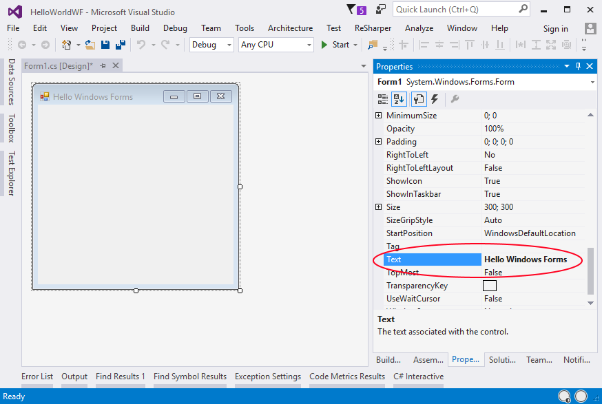
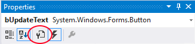
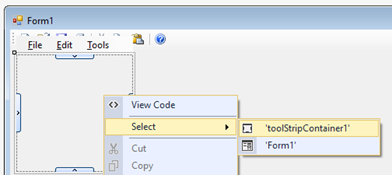
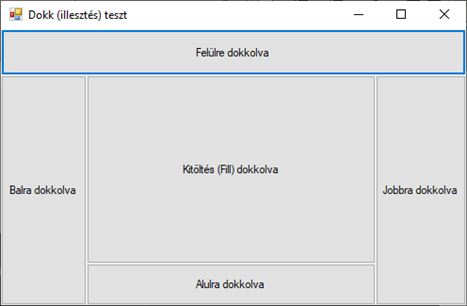
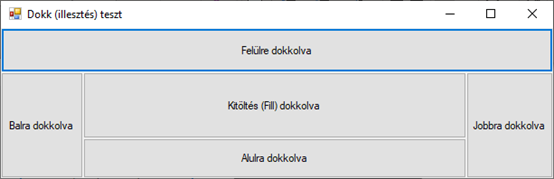
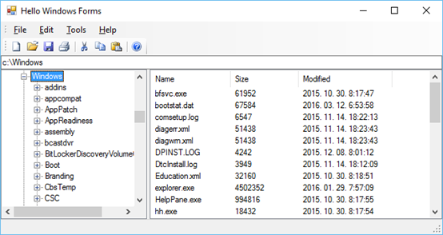
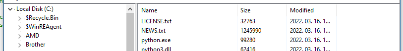

# 3. A felhasználói felület kialakítása

## A gyakorlat célja

A gyakorlat célja egy látványos, gyors alkalmazásfejlesztés bemutatása, mely egyben megteremti a lehetőséget a Windows Forms fejlesztés alapjainak elsajátítására. Érintett témakörök (többek között):

- Windows Forms alkalmazásfejlesztés alapok
- Menük
- Dokkolás és horgonyzás
- SplitView
- TreeView
- ListView  

Kapcsolódó előadások: 3-4. előadás – Vastagkliens alkalmazások fejlesztése.

## Előfeltételek

A gyakorlat elvégzéséhez szükséges eszközök:

- Visual Studio 2022
- Windows 10 vagy Windows 11 operációs rendszer (Linux és macOS nem alkalmas)

## Bevezető

A Rapid Application Development (RAD) elve a fejlesztési idő lerövidítését célozza meg azáltal, hogy a fejlesztés során kész komponensekkel dolgozik, integrált fejlesztő környezetet (pl. Visual Studio) és sok automatizmust alkalmaz. Fontos ugyanakkor, hogy az automatizmusok ne szűkítsék be túlzottan a fejlesztő lehetőségeit és kellő rugalmasságot adjanak neki a rendszerek testre szabásában. A következő példákban látni fogjuk, miként alkalmas mindezekre a Windows Forms környezet.

A Window Forms alkalmazások legfontosabb koncepcióit a tárgy 3.-4. előadása ismerteti. Egy Windows Forms alkalmazásban az alkalmazásunk minden ablakának egy saját osztályt kell létrehozni, mely a beépített Form osztályból származik. Erre – tipikusan a Visual Studio designerével - vezérlőket helyezünk fel, melyek a Form osztályunk tagváltozói lesznek.

!!! tip "IntelliSense"
    A következő példákban számos generált (és emiatt hosszú) elnevezéssel fogunk találkozni. Programjaink megvalósításakor használjuk ki az automatikus kódkiegészítés (IntelliSense) nyújtotta lehetőségeket és ne kézzel gépeljük be az egyes elnevezéseket.

## 1. Feladat – „Hello world” Windows Forms technológiával

A feladat során egy olyan Windows Forms alkalmazást készítünk el, amely egy egyszerű ablakban kiírja a „Hello world!” szöveget.

1. Indítsuk el a Visual Studio 2022-t

2. Hozzunk létre egy C# nyelvű, *Windows Forms* típusú alkalmazást, mégpedig **.NET 6** platformra.
    1. Ehhez a VS indítóablakában jobb oldalt a *Create new project* gombon kell kattintani, majd a projekt létrehozó varázslóban a *Windows Forms App* sablont kell kiválasztani. Lényeges, hogy **NE** a *Windows Forms App (.NETFramework)* legyen! A sablon kikereséséhez használjuk az ablak kereső/szűrőmezőit, amennyiben szükséges. Kattintsunk a Next gombra.
    2. A megjelenő oldalon
        1. A *Projekt name* és *Solution name* legyen `HelloWorldWF`
        2. Az útvonal a laborgépeken: `C:\Work\` alatt egy mappa, mely a saját nevünk vagy Neptun kódunk szerint van nevezve.
        3. Next gombbal következő oldalra váltás
    3. A Framework mezőben válasszuk ki a *.NET 6.0 (Long term support)*-ot.

    Futtassuk a kiinduló projektet, hogy lássuk, mit biztosít a kiinduló alkalmazáskeret (nem sokat, van egy egyszerű ablak). Állítsuk le a futó alkalmazást.

3. Kattintsunk duplán a `Form1.cs` fájlra! Ezt követően a felületen megjelenik egy szürke ablak. Amennyiben a Solution Explorerben a `Form1.cs` fájl elemet kibontjuk, látni fogjuk, hogy egy `Form1.designer.cs` nevű fájl is tartozik hozzá.

    A fenti egyszerű program felépítését könnyen végig követhetjük korábbi ismereteink alapján. A program belépési pontja itt is a `Program.cs` fájlban található `Main` függvény. A függvény létrehoz egy példányt a `Form1` osztályból, majd az `Application.Run` függvény segítségével elindítja az üzenetkezelő ciklust és megjeleníti az ablakot (a Windows Forms világában „Form”-nak hívjuk az ablakokat).

    A `Form1` osztály kódja két fájlban van definiálva (ezt a C# `partial` kulcsszava teszi lehetővé). A `Form1.cs` a felhasználó által kezelt kódrészleteket, míg a `Form1.designer.cs` a grafikus *Form designer* által generált kódot tartalmazza. Ez utóbbi mindig teljes szinkronban van a design nézettel, közvetlen módosítására ugyan van lehetőség, de a speciális hibaelhárítási eseteket leszámítva felesleges és kerülendő. Figyeljük meg, hogy a két fájl között már a generált kód alapján is kapcsolat van, hiszen a `Form1` konstruktora áthív a másik fájlban definiált `InitializeComponent()` függvénybe.

    !!! tip "Designer nézet és kód között váltás"
        Amennyiben a `Form1.cs` fájlra duplán kattintunk, alapértelmezésben nem a forráskód, hanem a tervező nézet (Form designer) jelenik meg. Innen a forráskód nézetre a felületen jobb kattintva, a *View Code* menüponttal, vagy az F7 billentyű megnyomásával juthatunk.

    Elképzelhető, hogy megjelenik egy további, `Form1.resx` nevű fájl is. Ez az ablakhoz tartozó erőforrásokat (tipikusan képek, szövegek) tartalmazhatja, de a mi esetünkben most nincs jelentősége.

4. Kattintsunk duplán a `Form1.cs` fájlra! Ez alapértelmezésben a tervező nézetet nyitja meg.

5. Kattintsunk az űrlap hátterén, hogy az űrlap legyen kiválasztva. A Visual Studio *Properties* ablakában láthatjuk az űrlapunk aktuális tulajdonságait. Amennyiben a Properties ablak nem látható, az F4 billentyűvel tudjuk előcsalni (vagy View menü / Properties). A Properties ablakban keressük meg a `Text` tulajdonságot, és írjuk át „Hello World” -re. Ez az űrlapunk fejlécének a szövegét állítja be.

    

    Mint látható, az űrlapunk számos tulajdonsággal rendelkezik, ezek mindegyikét a Properties ablakban be tudjuk állítani az aktuális igényeknek megfelelően.

6. Nyissuk ki a Toolbox-ot (*View menü / Toolbox*).

7. Húzzunk rá a formra egy `TextBox` és egy `Button` (gomb) vezérlőt tetszőleges helyre! (Ezeket a vezérlőket a Toolbox *Common Windows Forms* csoportjában találjuk).

8. Kattintsunk egyszer a gomb vezérlőn, hogy biztosan az legyen kiválasztva a designerben. Ekkor a Properties ablakban a gombunk tulajdonságai jelennek meg. Állítsuk be a `Text` tulajdonságát „Beállít”-ra, ez a gombunk szövegét fogja ennek megfelelően beállítani.

9. Ugyanitt a Properties ablakban állítsuk be gombunk **referenciáját tartalmazó osztályváltozó** nevét, vagyis a `Name` tulajdonságát `button1`-ről `bUpdateText`-re. Lényeges, hogy a vezérlőinket a funkciójuknak megfelelő nevekkel lássuk el, ez nagyban segíti a kódunk olvashatóságát. A `b` prefix a vezérlő `Button` típusára utal.

    !!! note "Hungarian Notation"
        A fenti prefixelt elnevezési konvenciót [Hungarian Notation](https://en.wikipedia.org/wiki/Hungarian_notation)nek hívják, mert Charles Simonyi (Simonyi Károly fia) találta ki, amikor az Excel csapatban dolgozott a Micorosftnál.

        A koncepció elsősorban C++-hoz készült, olyan időkben, amikor még nem voltak gazdag funkcionalitású fejelsztőkörnyezetek, és egy egyszerű szövegszerkesztővel is ránézésre meg kellett tudni mondani, hogy a változó milyen típusú. Ez manapság már nem releváns, mert a Visual Studio is pl. az egérkurzor segítségével visszajelzést ad a változó típusáról.

10. Az előző lépés mintájára nevezzük át a `TextBox` vezérlőnket `tbDemoText`-re. A `tb` prefix a vezérlő `TextBox` típusára utal.

11. Az űrlapunk neve jelenleg `Form1`, mely szintén elég semmitmondó. Nevezzük át `MainForm`-ra, az alábbi lépéseket követve. Az átnevezést a Solution Explorerben tudjuk megtenni, itt több technikát is használhatunk.

    - Válasszuk ki a `Form1` elemet, majd még egyszer kattintsunk rajta bal gombbal: ekkor a név szerkeszthetővé válik (pont úgy dolgozunk, ahogy egy fájlt is átnevezünk Windows Fájlkezelőben/File Explorerben).

    - Vagy egyszerűen csak megnyomjuk az F2 billentyűt az átnevezés elindításához.

    - Vagy akár használhatjuk a jobb gombos menü *Rename* funkcióját. Akárhogy is indultunk, írjuk be új névnek a `MainForm.cs`-t, majd nyomjuk meg az Enter billentyűt.

    Ekkor a Visual Studio rákérdez egy felugró ablakban, hogy minden kapcsolódó elemet nevezzen-e át ennek megfelelően: itt mindenképpen **Yes**-t válasszunk:

    

    !!! warning "Hiba átnevezés után"
        Ekkor a VS2022 hajlamos egy hibaüzenetet megjeleníteni az űrlapunk helyén, amennyiben meg volt nyitva a designerben. Ne ijedjünk meg tőle, zárjuk be az űrlap tabfülét (vagy valamennyi megnyitott fájl tabfülét), és nyissuk meg újra a Solution Explorerben az űrlapot: ekkor a hiba eltűnik.

12. A következő lépésben a gombkattintás eseményt fogjuk lekezelni: ennek hatására a `tbDemoText` `TextBox` vezérlőbe beírjuk a „Hello” szöveget. Egy űrlap/vezérlő eseményeinek megjelenítésére is a Properties ablak szolgál, csak át kell váltsunk az eseménymegjelenítő nézetére. Ehhez a Properties ablak felső részén található villám ikonon kell kattintanunk:

    

    !!! note "Tulajdonságok"
        A tulajdonságok megjelenítésére úgy tudunk a későbbiekben majd visszaváltani, ha a villám ikontól balra elhelyezkedő villáskulcs ikonra kattintunk (ezt egyelőre ne tegyük meg).

        

    Az eseménylistában látható, hogy a `Button` osztálynak számos eseménye van. Számunkra most a `Click` esemény az érdekes. Erre kétféleképpen tudunk feliratkozni:

    - Az eseménylistában a `Click` elemen duplán kattintunk.
    - A designer felületen a gombon duplán kattintva. A designer felületen a duplán kattintás mindig a vezérlő - a vezérlő típusától függő - alapértelmezett eseményére iratkozik fel. Mivel a `Click` esemény a `Button` osztály alapértelemezett eseménye, ez nekünk most pont meg is felel.

    Válasszuk most a második lehetőséget, kattintsunk duplán a gomb vezérlőn. Ez létrehoz egy eseménykezelő függvényt, mely akkor kivódik futás közben, amikor a felhasználó kattint a gombon (akár egérrel, akár a Tab billentyűvel ránavigálva a Space billentyű lenyomásával). A függvény törzsében a `tbDemoText` objektum `Text` tulajdonságát állítsuk be "Helló"-ra.

    ```csharp
    private void bUpdateText_Click(object sender, EventArgs e)
    {
        tbDemoText.Text = "Hello";
    }
    ```

    !!! tip "Eseménykezelők fejléce"
        Ha nem tetszik a dupla klikkes generált név (a hungarian notation miatt kisbetűvel kezdődik, ami nem túl C#-os), akkor egyszerűen kezdjük el begépelni a Properties ablak kívánt eseményéhez a függvény nevét, majd nyomjunk Entert.

        Az eseménykezelőket tipikusan úgy szoktuk elnevezni, hogy utaljon a vezérlőre (alapértelmezetten a neve) majd alulvonás után az esemény neve következik.

        A Windows Forms vezérlőinek eseménykezelőiben szinte mindig két paramétert kapunk:
        
        - `object sender`: A kiváltó objektum (sajnos nem erősen típusosan)
        - `EventArgs e`: Az eseményhez tartozó paramétereket tartalmazza. Típusa `EventArgs`, vagy annak leszármazottja. Az `EventArgs` itt egy üres paramétert reprezentál, mert a gombkattintáshoz nem tartozik semmi extra adat. `EventArgs` leszármazott olyan események esetén használt, melyekhez valamilyen plusz adat is tartozik (pl. billentyű lenyomásnál a lenyomott billentyű kódja).

13. Futtassuk az alkalmazást (F5)! Nyomjuk meg a gombot!

14. Nézzünk bele újra a `MainForm.Designer.cs`-be. Megtaláljuk az újonnan generált kódot: az űrlapon elhelyezett vezérlőkből tagváltozók lesznek, melyek az `InitializeComponent` függvényben kerülnek inicializálásra, itt találjuk a tulajdonságaik beállítását, valamint az eseményekre való feliratkozást.

    Figyeljük meg azt is, hogy a gomb lenyomására tulajdonképpen egy C# eseménykezelő függvényt regisztráltunk be a már ismert `+=` operátor alkalmazásával.

    Láthatjuk, hogy a designer csak olyan kódot generál, melyet akár mi is meg tudnánk írni, de persze így egyszerűbb azt elkészíteni.

## Néhány alapfogalom áttekintése

### Form - felülettervezés

A `Form` osztály az ablakot reprezentálja, és egyben a konténer-vezérlő kapcsolatban a legfelső szintű konténer (tartalmazó).

A felület kialakítása szempontjából az alkalmazásunk lehet:

- Dialógus alapú: Kizárólag vezérlőket helyezünk el az űrlapon, mintha egy dialógus ablak lenne. Ha szükséges, új ablakot nyitunk az egyes funkcióknak. Pl. sokszor ilyenek az üzleti/vállalati alkalmazások.
- SDI, vagy MDI: Dokumentum alapú alkalmazás, mely esetben az űrlap a dokumentum megjelenítője és esetleg szerkesztője. Az egyéb vezérlőket/funkciókat a menübe és a toolbarra (eszközsáv) tesszük. Az SDI (Single Document Interface) egy dokumentumot kezel egy időben, az MDI (Multiple Document Interface) pedig többet. Pl. ilyenek szövegszerkesztők, vagy maga a Visual Studio is.
- Vegyes: Az ilyen jellegű alkalmazásokban a dokumentum szerkesztése a cél csakúgy, mint az SDI/MDI változatokban, azonban az ablak egy része fenn van tartva vezérlők számára, ahol könnyen elérhetjük a funkciókat. Pl. ilyenek a CAD alkalmazások.

### Konténer-vezérlő tartalmazási hierarchia

Egy ablak/űrlap hierarchikus (fa) felépítésű, amelyben a gyökérobjektum maga a `Form`. **Lényeges, hogy itt nem származtatási, hanem tartalmazási hierarchiáról van szó**. Alatta újabb konténerek lehetnek egymásba ágyazva, vagy csak egymás mellett.  A hierarchia alján vannak az egyszerű vezérlők, de lehetnek vezérlő nélküli konténerek is.

Az egymásba ágyazás azért szükséges, hogy egységként lehessen kezelni a konténereket és a gyerekeiket, így például odébb húzva a konténert vele mozognak az általa tartalmazott vezérlők is. A másik fontos ok a tulajdonságöröklés, amely lehetővé teszi, hogy ha megváltoztatjuk valamelyik konténer örökölhető tulajdonságát (pl. `Font`), akkor azt a gyerekei is megörököljék. Ez nem a szokásos objektum-orientált öröklés, de a szülő-gyermek viszony azonos elvre épül.

### Üzenetkezelés

A Windows Forms alapú alkalmazások üzenetkezelésre épülnek, amelynek a hátterében az operációs rendszer üzenetkezelő mechanizmusa áll. Az üzenetkezelő ciklus a `Main` függvényben van (`Application.Run`), amely csak akkor lép ki, ha bezárjuk az alkalmazásunkat.

### Visual Studio Designer

A designer a felhasználói felület szerkesztője, amelyben lehetőségünk van új elemeket felvenni, illetve a meglévőket módosítani és törölni. A designer fontosabb elemei/kellékei:

- **Toolbox**: Erről lehet a konténereket és vezérlőket ráhúzni az űrlapra.
- **Properties ablak/Property Editor**: A kijelölt vezérlő tulajdonságait és eseményeit mutatja, illetve itt lehet ezeket módosítani is. Az F4 billentyűvel is elérhető.
- **Smart tag**: A legtöbb vezérlő típus esetén támogatott. A vezérlőt kiválasztva annak jobb felső sarkában megjelenik egy kis nyíl, amelyre kattintva megjelenik. Ebben néhány kiemelt tulajdonság és kényelmi funkció érhető el.
- **Document outline ablak**: A konténer-vezérlő hierarchiát mutatja. Itt ki lehet jelölni az egyes vezérlőket, illetve mozgatni is lehet őket a hierarchiában, mely érvényesül az űrlapon is.

## 2. Feladat - Menük, Horgonyzás, Dokkolás

### Menük

A felülettervezés következő feladata a menük megszerkesztése. Ehhez végezzük el a következő lépéssorozatot.

1. A Toolboxról húzzunk rá a `Form`-ra egy `MenuStrip`-et (*Menus & Toolbars* kategóriában van).
2. A `MenuStrip` smart tag-jét kinyitva (kicsi nyíl a jobb felső sarkában) kattintsunk az *Insert Standard Items*-re.
3. Ismételjük az első két lépést a `ToolStrip` vezérlővel is.
4. Majd helyezzünk fel alulra egy `StatusStrip` vezérlőt is.

Teszteljük az alkalmazást, vegyük észre, hogy a `ToolStrip`-nek van kis fogantyúja, azonban azt hiába fogjuk meg, nem mozog. Ekkor jön segítségünkre a `ToolStripContainer`. A `ToolStripContainer` egy olyan konténer vezérlő, mely öt panelt tartalmaz: egy Top, Bottom, Left, Right és egy középen elhelyezkedő Content panelt.

1. A menü smart tag-ében válasszuk ki az *Embed In ToolStripContainer* parancsot, amely feltesz egy `ToolStripContainer`-t, és a menüt áthelyezi ennek felső paneljébe. Az űrlapunk megjelenése kaotikussá válik, mivel a többi strip egyelőre nem került a `ToolStripContainer`-be.

2. A `ToolStripContainer` smart tag-jén válasszuk a *Dock Fill in Form* funkciót. Akkor látszólag minden a helyére kerül, leszámítva, hogy a menü és a toolbar fel vannak cserélve.

    !!! tip "Kiválasztás a designerben"
        A `ToolStripContainer` kijelölése kicsit trükkös a takarási viszonyok miatt. Ehhez használjuk a Document Outline ablakot, vagy használjuk a context menü *Select* menüpontját.

        

3. Rendezzük a konténer-vezérlő hierarchiát! Nyissuk meg a *Document Outline* ablakot (*View / Other Windows / Document Outline*) és korrigáljuk a hierarchiát:

    - Húzzuk át a `ToolStrip`-et és a `StatusStrip`-et a `ToolStripContainer` felső, illetve alsó paneljébe, továbbá a `TextBox` és `Button` vezérlőket `ContentPanel`-re. A végeredmény így néz ki:

        

    - A `MenuStrip` smart tag-jében állítsuk át a *Grip Style*-t *Visible*-re, ekkor már a menü is mozgatható.

    Próbáljuk ki az alkalmazást, a `ToolStrip` és a `MenuStrip` mozgatható lett (oldalra és alulra is).

4. Példaként adjunk eseménykezelőt a File/Exit menüelemhez: duplán klikkeljünk a menüelemen, majd a kódban adjuk ki a `Close()` parancsot, mely bezárja az ablakot és ezzel leállítja az alkalmazást.

    ```csharp
    private void exitToolStripMenuItem_Click(object sender, EventArgs e)
    {
        Close();
    }
    ```

5. Futtassuk és teszteljük az alkalmazást.

### Horgonyzás (anchor)

!!! example "Horgonyzás, dokkolás demók"
    A horgonyzáshoz és dokkoláshoz GitHub-on a tárgy alatt található szemléletes demó.

    - [Forráskód](https://github.com/bmeviauab00/AnchorAndDockDemo) a következő utasítással parancssorból egyszerűen letölthető: 

        ```cmd
        git clone https://github.com/bmeviauab00/AnchorAndDockDemo 
        ```

    - [Futtatható verzió](https://github.com/bmeviauab00/AnchorAndDockDemo/releases/latest/download/AnchorAndDockDemo.exe) a download gombbal tölthető le.

**Anchor**: A horgonyzás segítségével elérhető, hogy a vezérlő adott oldala állandó távolságot tartson a szülő konténer ugyanazon oldalától. Egy vezérlőre egymástól függetlenül beállítható a felülre, alulra, balra és jobbra horgonyzás. Ha pl. a jobbra horgonyzás be van állítva egy vezérlőre, akkor a jobb oldala fix távolságot tart a konténerének jobb oldalától. Ez a konténer átméretezésekor válik láthatóvá: amikor a konténer jobb oldala futás közben az átméretezés során elmozdul, akkor a tartalmazott vezérlő jobb oldala ezt automatikusan leköveti, a távolság a kettő között állandó marad. Ugyanez áll fent a jobbra, felülre és alulra horgonyzás esetén is (értelemszerűen a jobb, felső és alsó oldalakra vonatkoztatva). Alapértelmezésben a vezérlők bal oldala és teteje van lehorgonyozva. Ha két ellentétes oldal is le van horgonyozva (például a bal és a jobb oldal), akkor a szülő vízszintes átméretezésekor a vezérlő nőni vagy zsugorodni fog, hogy a két széle megtartsa a távolságot a szülő széleitől.

Térjünk vissza az alkalmazásunkhoz:

1. Húzzuk be az első feladatban létrehozott gombot a form közepére (de egy újat is feldobhatunk).

2. A *Property Editor*-ban keressük ki és nyissuk le az `Anchor` tulajdonságot.

   A tulajdonság értéke valójában egyszerű enum, melyhez a Visual Studio az egyszerűség kedvéért egy grafikus nézetet ad. Figyeljük meg, hogy jelenleg a vezérlő bal oldala és teteje van a szülőjéhez kötve.

3. Az `Anchor` szerkesztőjében kattintsunk a jobb oldali horgonyra is. Így már három oldalát rögzítettük a gombnak.

4. Teszteljük a változtatás hatását!

    Mivel a horgonyok már tervezési időben is működnek, ehhez az alkalmazást sem kell elindítani. Elég a tervezési nézetben átméretezni a formot. Figyeljük meg, hogy immár a gomb jobb oldala együtt mozog a form jobb szélével!

5. Módosítsuk a horgonyt úgy, hogy a jobb és az alsó oldala legyen rögzítve a gombnak, a teteje és a bal oldala nem. Teszteljük a megoldást!

    Utóbbi megoldás használható például arra, hogy egy dialógusablak bezáró gombját mindig a jobb alsó sarokban tartsuk.

6. A gombra a továbbiakban nem lesz szükségünk, töröljük a felületről.

### Dokkolás (dock)

**Dock**: A dokkolás (szokás még csatolásnak vagy ragasztásnak is nevezni) segítségével egy vezérlő hozzácsatolható az őt tartalmazó konténer valamelyik széléhez, vagy beállítható, hogy töltse ki a rendelkezésre álló helyet. Lehetséges értékei: `None`, `Top`, `Left`, `Right`, `Bottom` és `Fill`. Egy felülre vagy alulra dokkolt vezérlő a szülő átméretezésekor megtartja a magasságát, a szélességváltozást pedig leköveti (pl. egy menü vagy státuszsáv tipikusan így viselkedik). Ahhoz, hogy egy vezérlő kitöltse a teljes maradó teret, a dokkolást `Fill`-re kell állítani.

Itt is érdemes a GitHub demót futtatva, az űrlapot átméretezve kipróbálni, íme a kép az űrlap átméretezése előtt és után:



Átméretezés után (szélesebbre és alacsonyabbra méretezve az ablakot):



## 3. Feladat - MiniExplorer

### MiniExplorer layout

A feladat során egy Windows Forms alapú fájlrendszer böngésző (MiniExplorer) alkalmazást kell elkészíteni. A program kinézetét a következő ábra szemlélteti. 
 


Az ablak három részből álljon:

- címsor az ablak tetején (`TextBox`)
- `TreeView` a címsor alatt bal oldalon
- `ListView` a címsor alatt jobb oldalon

A címsorban mindig az aktuálisan kiválasztott mappa teljes elérési útvonalát láthatjuk. Kezdetben legyenek a csomópontok összecsukott állapotban („+” ikon mellettük a fában), lenyitva őket jelenjenek meg a gyerek csomópontok, ha van mappa az adott mappán belül. Elfogadható, hogy először minden csomópont lenyitható, és csak akkor tűnik el a lenyitásra/összecsukásra szolgáló ikon, ha a felhasználó megpróbálta lenyitni és nincs benne mappa. Ha a felhasználó kiválaszt egy mappát a `TreeView`-ban (itt nem a lenyit/összecsuk műveletre kell gondolni), akkor a `ListView`-ban jelenjenek meg a mappában található fájlok. A `ListView` három oszlopban jelenítse meg a fájlok nevét, méretét és az utolsó módosítás dátumát.

1. Válasszuk ki a formon lévő `TextBox`-ot (melyet az első példában raktunk ki), és állítsuk a `Dock` tulajdonságát `Top`-ra. Ezzel a címsort az ablak tetejéhez igazítottuk.
2. Tegyünk a formra egy `SplitContainer`-t (ToolBox / Containers).

    !!! note "SplitContainer"
        **SplitContainer**: Figyeljük meg, hogy ez egy speciális vezérlő, mely két egymás mellé rendezett panelből áll és lehetőséget ad a panelok közti arány változtatására. Ez egy olyan konténer típusú vezérlő, mely az őt tartalmazó konténert két panelre osztja függőleges vagy vízszintes irányban. A két panel közé egy splittert helyez el, mellyel akár futásidőben is átméretezhető a két panel. A splitter mozgatása letiltható, és a két panel közül az egyikre beállítható, hogy a szülő konténer méretezésekor a megadott panel mérete ne változzon. (Fixed nevű tulajdonságoknál érdemes keresni.)

3. A SplitContainer elvileg már `Fill` Dock módon került fel az előző lépésben (kitölti a teret). Ha mégsem így lenne: válasszuk ki a *Dock in parent container* opciót a SplitPanel smart tag-jében!
4. A bal oldali panel-re rakjunk rá egy `TreeView` vezérlőt. A smart tag-jében válasszuk a *Dock in parent container* funkciót.
5. A jobb oldali panelre rakjunk egy `ListView` vezérlőt. A smart tag-jében válasszuk itt is a *Dock in parent container* funkciót.

Ezzel el is készült a MiniExplorer, legalábbis a felülete.

### MiniExplorer logika

Mivel készen van a felület, a következő feladat azt kitölteni.

1. Duplán klikkeljünk a form fejlécén, ezzel tudjuk implementálni a `Form.Load` eseményét. Itt fogjuk inicializálni a fát:

    ```csharp
    private void MainForm_Load(object sender, EventArgs e)
    {
        var root = treeView1.Nodes.Add("Local Disk (C:)");
        root.Tag = new DirectoryInfo(@"C:\");
        root.Nodes.Add("");
    }
    ```

    A `TreeView` vezérlő `TreeNode` objektumokat tud megjeleníteni (ezek a fa csomópontjait jelképezik). A tényleges információt (vagyis, hogy melyik könyvtár tartozik hozzá) a `TreeNode` `Tag` tulajdonságban tároljuk el. Ez egy `object` típusú tulajdonság, amivel a legtöbb vezérlő rendelkezik, és pont azt a célt szolgálja, hogy a fejlesztők tetszőleges, számukra releváns és az adott vezérlőhöz kötődő információt tároljanak benne. A megoldásunkban a csomóponthoz tartozó könyvtár információt tároljuk el benne egy `DirectoryInfo` objektum formájában. Rövidesen meglátjuk, miért van erre szükség.

    A függvény utolsó sorában létrehozunk egy „üres” gyerek csomópontot. Ennek köszönhetően a szülő mellett meg fog jelenni a kibontás jele (+).

2. A következő lépésben a csomópontok kibontását valósítjuk meg: amikor a felhasználó kibont (expand) egy csomópontot, le kell kérdezzük a csomópont által reprezentált könyvtárban található alkönyvtárakat, és a lenyitott `TreeNode` csomóponthoz tartozó könyvtár minden alkönyvtárhoz egy gyerek `TreeNode` csomópontot kell felvegyünk. Egy csomópont kibontásáról a `TreeView` vezérlő a `BeforeExpand` és `AfterExpand` eseményekben értesít. Számunkra most a `BeforeExpand` a megfelelő választás. Azt, hogy melyik csomópont került kibontásra, az eseménykezelő paraméterében kapjuk meg. Azt pedig, hogy melyik könyvtár tartozik egy csomóponthoz, a `TreeNode` `Tag` tulajdonságában mi magunk tároljuk el!

    Menjünk vissza a designer-be, válasszuk ki a `TreeView`-t, majd a *Properties* ablakban váltsunk esemény nézetre (villám ikon). Duplán klikkeljünk a `BeforeExpand` eseményen, hogy implementálhassuk:

    ```csharp
    private void treeView1_BeforeExpand(object sender, TreeViewCancelEventArgs e)
    {
        var parentDI = e.Node?.Tag as DirectoryInfo;
        if (parentDI == null)
            return;

        e.Node?.Nodes.Clear();
        try
        {
            foreach (var di in parentDI.GetDirectories())
            {
                var node = new TreeNode(di.Name);
                node.Tag = di;
                node.Nodes.Add("");
                e.Node?.Nodes.Add(node);
            }
        }
        catch
        {
            // lenyeljük a hibát, így úgy fog tűnni, mintha üres lenne a mappa
        }
    }
    ```

    !!! note "A `?.` operátor"
        A `?.`, vagyis a null-conditional operátor működése hasonló a klasszikus `.`, vagyis taghozzáférés operátorhoz, de a taghozzáférés csak akkor történik meg, ha a kifejezés bal oldala nem null (egyébként pedig a kifejezés értéke null lesz). Tulajdonképpen ezt használtuk korábban a C# események feltételes elsütésekor az `<esemény>?.Invoke()` során is.

3. Teszteljük az alkalmazást.

4. Következő lépésben térjünk át a jobboldali panel megvalósítására.

    Itt akkor kell a tartalmat frissíteni, amikor (pontosabban miután) a baloldali `TreeView`-ban a felhasználó kiválasztott egy csomópontot. Erről a `TreeView` az `AfterSelect` eseményében küld értesítést. A korábbihoz hasonlóan a kiválasztott `TreeNode` csomópontot az eseménykezelő paraméterében kapjuk meg.

    ```csharp
    private void treeView1_AfterSelect(object sender, TreeViewEventArgs e)
    {
        var parentDI = e.Node?.Tag as DirectoryInfo;
        if (parentDI == null)
            return;

        listView1.Items.Clear();
        try
        {
            foreach (FileInfo fi in parentDI.GetFiles())
            {
                listView1.Items.Add(fi.Name);
            }
        }
        catch
        {
            // lenyeljük a hibát, így úgy fog tűnni, mintha üres lenne a mappa
        }
    }
    ```

    !!! warning "Hibakezelés"
        Vegyük észre, hogy a fenti két függvényben mindkét esetben egy try-catch blokkot használtunk. Ez azért van, mert a laborgépeken átlagos felhasználóként sokszor nincs jogunk egyes mappák/fájlok elérésére, ami a listázó függvények esetében kivételt vált ki. Egy valós alkalmazásban semmiképpen nem hagynánk üresen a `catch` blokkot, mindenképpen naplóznánk, vagy a felhasználó tudomására hoznánk a hibát.

        A legegyszerűbb `MessageBox` alapú megoldás ez lenne:

        ```csharp
        catch (UnatuhorizedAccessExceotion ex)
        {
            MessageBox.Show(ex.Message, "Error", MessageBoxButtons.OK, MessageBoxIcon.Error))
        }
        ```

5. Ugyanitt ki tudjuk tölteni az Address részt is:

    ```csharp
    tbDemoText.Text = parentDI.FullName;
    ```

6. Következő lépésben valósítsuk meg a többoszlopos nézetet a jobboldali panelen. A kódot módosítsuk úgy, hogy ne csak a nevét adja meg a fájlnak, hanem egyéb paramétereit is. Az `Add` függvényt paraméterezzük így:

    ```csharp
    listView1.Items.Add(
        new ListViewItem(new string[]
        {
            fi.Name,
            fi.Length.ToString(),
            fi.LastWriteTime.ToString(),
            fi.FullName
        }));
    ```

7. Az adatok tehát már megvannak, de még nem jelennek meg. Ehhez a `ListView`-t módosítani kell a designer-ben, hogy mutassa a részleteket is. Hozzuk elő a smart tag-jét, és állítsuk át rajta a *View*-t *Details*-re.

8. Az oszlopokat nekünk kell létrehoznunk, amihez a smart tag-jében válasszuk az *Edit Columns* funkciót, majd a megjelenő listát töltsük fel 3 új elemmel, amelyeknek a `Text` tulajdonsága legyen: `Name`, `Size`, `Modified`.

    Rendezzük el szépen az oszlopok szélességét olyan módon, hogy minden kiférjen majd a feltöltés után is. Ezekben az oszlopokban az adatok pont olyan sorrendben fognak megjelenni, mint ahogy a 6. pontban a listaelemhez hozzárendeltük azokat.

!!! note "ListView oszlopok"
    Sajnos a `ListView` beépítetten elég törékeny megoldást nyújt csak az oszlopok és azok értékeinek összerendelésére. A modernebb UI keretrendszerek (pl.: WPF, WinUI, .NET MAUI) az adatkötés mechanizmusán keresztül egy kényelmesebb, deklaratívabb és robusztusabb megoldást nyújtanak erre.

### Futtatás

Utolsó érdekességként megoldhatjuk, hogy a jobb oldali nézetben egy fájlon duplán kattintva a rendszer megnyissa/végrehajtsa azt. Ehhez iratkozzunk fel a `ListView` `DoubleClick` eseményére és valósítsuk meg a következőképpen:

```csharp
private void listView1_DoubleClick(object sender, EventArgs e)
{
    if (listView1.SelectedItems.Count != 1)
        return;

    var fullName = listView1.SelectedItems[0].SubItems[3].Text;
    if (fullName != null)
    {
        Process.Start(new ProcessStartInfo(fullName) { UseShellExecute = true });
    }
}
```

### Windows stílusok (nem tanagyag)

Ha zavar minket, hogy nem a rendszer stílusát használják a `TreeView` és a `ListView` vezérlők, akkor a `SetWindowTheme` Win32 API függvényt meghívva ki tudjuk kényszeríteni, hogy a *File Explorer/Fájlkezelő* alkalmazásban megszokott stílusban jelenjenek meg.

```csharp hl_lines="1-2 10-11 13-14"
[DllImport("uxtheme.dll", ExactSpelling = true, CharSet = CharSet.Unicode)]
private static extern int SetWindowTheme(IntPtr hwnd, string pszSubAppName, string? pszSubIdList);

private void MainForm_Load(object sender, EventArgs e)
{
    var root = treeView1.Nodes.Add("Local Disk (C:)");
    root.Tag = new DirectoryInfo(@"C:\");
    root.Nodes.Add("");

    SetWindowTheme(treeView1.Handle, "explorer", null);
    SetWindowTheme(listView1.Handle, "explorer", null);

    // Eltünteti a csomópontokat összekötő vonalakat
    treeView1.ShowLines = false;
}
```

A megoldásunkban a .NET platform ún. P/Invoke (Platform Invoke) mechanizmusát vetjük be. Ez lehetővé teszi, hogy a `DllImport` attribútummal natív DLL-ekből függvényeket hivatkozzunk be, megfelelő paraméterezésű statikus C# függvénydeklarációkhoz rendeljük, majd ezek segítségével a natív függvényeket meghívjuk. A `SetWindowTheme` függvény első paramétereként a vezérlő `Handle`-jét kell átadni, második paramétereként pedig a process nevét, amelyről másolni akarjuk a stílusokat. A fenti kód utolsó sorában a `treeView1.ShowLines` `false`-ra állításával kikapcsoljuk a fastruktúrában az összekötő vonalak alkalmazását. Íme a végeredmény:


