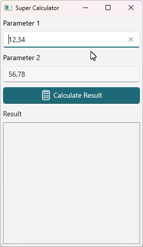
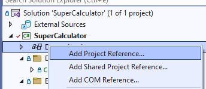
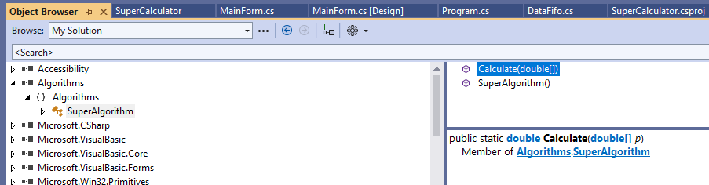

# 4. Többszálú alkalmazások készítése

## A gyakorlat célja

A gyakorlat célja, hogy megismertesse a hallgatókat a többszálas programozás során követendő alapelvekkel. Érintett témakörök (többek között):

- Szálak indítása (`Thread`)
- Szálak leállítása
- Szálbiztos (thread safe) osztályok készítése a `lock` kulcsszó alkalmazásával
- `ThreadPool` használata
- Jelzés és jelzésre várakozás szál szinkronizáció `ManualResetEvent` segítségével (`WaitHandle`)
- Windows Forms szálkezelési sajátosságok (`Invoke`)

Természetesen, mivel a témakör hatalmas, csak alapszintű tudást fogunk szerezni, de e tudás birtokában már képesek leszünk önállóan is elindulni a bonyolultabb feladatok megvalósításában.

A kapcsolódó előadások: Konkurens (többszálú) alkalmazások fejlesztése.

## Előfeltételek

A gyakorlat elvégzéséhez szükséges eszközök:

- Visual Studio 2022
- Windows 10 vagy Windows 11 operációs rendszer (Linux és macOS nem alkalmas)

## Megoldás

??? "A kész megoldás letöltése"
    :exclamation: Lényeges, hogy a labor során a laborvezetőt követve kell dolgozni, tilos (és értelmetlen) a kész megoldás letöltése. Ugyanakkor az utólagos önálló gyakorlás során hasznos lehet a kész megoldás áttekintése, így ezt elérhetővé tesszük.

    A megoldás GitHubon érhető el [itt](https://github.com/bmeviauab00/lab-tobbszalu-kiindulo/tree/megoldas). A legegyszerűbb mód a letöltésére, ha parancssorból a `git clone` utasítással leklónozzuk a gépünkre:

    ```git clone https://github.com/bmeviauab00/lab-tobbszalu-kiindulo -b megoldas```

    Ehhez telepítve kell legyen a gépre a parancssori git, bővebb információ [itt](../hazi/git-github-github-classroom/#git-telepitese).

## Bevezető

A párhuzamosan futó szálak kezelése kiemelt fontosságú terület, melyet miden szoftverfejlesztőnek legalább alapszinten ismernie kell. A gyakorlat során alapszintű, de kiemelt fontosságú problémákat oldunk meg, ezért törekednünk kell arra, hogy ne csak a végeredményt, hanem az elvégzett módosítások értelmét és indokait is megértsük.

A feladat során egyszerű Windows Forms alkalmazást fogunk felruházni többszálas képességekkel, egyre komplexebb feladatokat megoldva. Az alapprobléma a következő: van egy függvényünk, mely hosszú ideig fut, s mint látni fogjuk, ennek „direktben” történő hívása a felületről kellemetlen következményekkel jár. A megoldás során egy meglévő alkalmazást fogunk kiegészíteni saját kódrészletekkel. Az újonnan beszúrandó sorokat az útmutatóban kiemelt háttér jelzi.

## 0. Feladat - Ismerkedés a kiinduló alkalmazással, előkészítés

Klónozzuk le a 4. gyakorlathoz tartozó kiinduló alkalmazást [repositoryját](https://github.com/bmeviauab00/lab-tobbszalu-kiindulo).

- Nyissunk egy command prompt-ot
- Navigáljunk el egy tetszőleges mappába, például c:\work\NEPTUN
- Adjuk ki a következő parancsot: `git clone https://github.com/bmeviauab00/lab-tobbszalu-kiindulo.git`
- Nyissuk meg _SuperCalculator.sln_ solutiont Visual Studio-ban.

A feladatunk az, hogy egy bináris formában megkapott algoritmus futtatásához Windows Forms technológiával felhasználói felületet készítsünk. A bináris forma .NET esetében egy _.dll_ kiterjesztésű fájlt jelent, ami programozói szemmel egy osztálykönyvtár.  A fájl neve esetünkben _Algorithms.dll_, megtalálható a leklónozott Git repositoryban.

A kiinduló alkalmazásban a felhasználói felület elő is van készítve. Futtassuk az alkalmazást:



Az alkalmazás felületén meg tudjuk adni az algoritmus bemenő paramétereit (`double` számok tömbje): a példánkban mindig két `double` szám paraméterrel hívjuk az algoritmust, ezt a két felső szövegmezőben lehet megadni.
A feladatunk az, hogy a _Calculate Result_ gombra kattintás során futtassuk az algoritmust a megadott paraméterekkel, majd, ha végzett, akkor a _Result_ alatti listázó mező új sorában jelenítsük meg a kapott eredményt a bemenő paraméterekkel együtt.

Következő lépésben ismerkedjünk meg a letöltött Visual Studio solutionnel:

1. Nézzük végig a `MainForm` osztályt.
   - Az látjuk, hogy a felület alapvetően kész, csak az algoritmus futtatása hiányzik. 
   - Az eredmény és a paraméterei naplózásához is találunk egy `ShowResult` nevű segédfüggvényt.
2. A `DataFifo` osztályt egyelőre hagyjuk ki, csak a gyakorlat második felében fogjuk használni, majd később megismerkedünk vele.

### A DLL-ben levő kód felhasználása

A kiinduló projektben megtaláljuk a _Algorithm.dll_-t. Ebben lefordított formában egy `Algorithms` névtérben levő `SuperAlgorithm` nevű osztály található, melynek egy `Calculate` nevű statikus művelete van. Ahhoz, hogy egy projektben fel tudjuk használni a DLL-ben levő osztályokat, a DLL-re a projektünkben egy ún. referenciát kell felvegyünk.

1. Solution Explorerben a projektünk _Dependencies_ node-jára jobbklikkelve válasszuk az _Add Project reference_ opciót!

    

    !!! note "Külső referenciák"

        Itt valójában nem egy másik Visual Studio projektre adunk referenciát, de így a legegyszerűbb előhozni ezt az ablakot.

        Megemlítendő még, hogy külső osztálykönyvtárak esetében már nem DLL-eket szoktunk referálni egy rendes projektben, hanem a .NET csomagkezelő rendeszeréből a NuGet-ről szokás a külső csomagokat beszerezni. Most az _Algorithm.dll_ esetünkben nincs NuGet-en publikálva, ezért kell kézzel felvegyük azt.

2. Az előugró ablak jobb alsó sarokban található _Browse_ gomb segítségével keressük meg és válasszuk ki projekt _External_ almappájában található _Algorithms.dll_ fájlt, majd hagyjuk jóvá a hozzáadást az OK gombbal!

A Solution Explorerben egy projekt alatti _Dependencies_ csomópontot lenyitva láthatjuk a hivatkozott külső függőségeket. Itt most már megjelenik az Assemblyk között előbb felvett Algorithms referencia is. A Frameworks kategóriában a .NET keretrendszer csomagjait találjuk. Az Analyzerek pedig statikus kódelemző eszközök fordítás időben. Illetve itt lennének még a projekt vagy a NuGet referenciák is.


Kattintsunk Algorithms referencián jobb gombbal és válasszuk a _View in Object Browser_ funkciót. Ekkor megnyílik az Object Browser tabfül, ahol megtekinthetjük, hogy az adott DLL-ben milyen névterek, osztályok találhatók, illetve ezeknek milyen tagjaik (tagváltozó, tagfüggvény, property, event) vannak. Ezeket a Visual Studio a DLL metaadataiból az ún. reflection mechanizmus segítségével olvassa ki (ilyen kódot akár mi is írhatunk).

Az alábbi ábrának megfelelően az Object Browserben baloldalt keressük ki az Algorithms csomópontot, nyissuk le, és láthatóvá válik, hogy egy `Algorithms` névtér van benne, abban pedig egy `SuperAlgorithm` osztály. Ezt kiválasztva középen megjelennek az osztály függvényei, itt egy függvényt kiválasztva pedig az adott függvény pontos szignatúrája:



## 1. Feladat – Művelet futtatása a főszálon

Most már rátérhetünk az algoritmus futtatására. Első lépésben ezt az alkalmazásunk fő szálán tesszük meg.

1. A főablakon lévő gomb `Click` eseménykezelőjében hívjuk meg a számoló függvényünket. Ehhez kattintsunk a Solution Explorerben duplán a `MainForm.cs` fájlra, majd a megjelenő Form Designer-ben a _Calculate Result_ gombra. Egészítsük ki a kódot az újonnan behivatkozott algoritmus meghívásával.

    ```cs hl_lines="7-8"
    private void buttonCalcResult_Click(object sender, EventArgs e)
    {
        if (double.TryParse(textBoxParam1.Text, out var p1) && double.TryParse(textBoxParam2.Text, out var p2))
        {
            var parameters = new double[] { p1, p2 };

            var result = Algorithms.SuperAlgorithm.Calculate(parameters);
            ShowResult(parameters, result);
        }
        else
        {
            MessageBox.Show(this, "Invalid parameter!", "Error");
        }
    }
    ```

2. Próbáljuk ki az alkalmazást, és vegyük észre, hogy az ablak a számolás ideje alatt nem reagál a mozgatásra, átméretezésre, a felület gyakorlatilag befagy.

Az alkalmazásunk eseményvezérelt, mint minden Windows alkalmazás. Az operációs rendszer a különböző interakciókról (pl. mozgatás, átméretezés) üzenetekben értesíti az alkalmazásunkat. Mivel a gombnyomást követően az alkalmazásunk egyetlen szála a kalkulációval van elfoglalva, nem tudja azonnal feldolgozni a további felhasználói utasításokat. Amint a számítás lefutott (és az eredmények megjelennek a listában) a korábban kapott parancsok is végrehajtásra kerülnek.

## 2. Feladat – Végezzük a számítást külön szálban

Következő lépésben a számítás elvégzésére egy külön szálat fogunk indítani, hogy az ne blokkolja a felhasználói felületet.

1. Készítsünk egy új függvényt a `MainForm` osztályban, mely a feldolgozó szál belépési pontja lesz.

    ```cs
    private void CalculatorThread(object arg)
    {
        var parameters = (double[])arg;
        var result = Algorithms.SuperAlgorithm.Calculate(parameters);
        ShowResult(parameters, result);
    }
    ```

2. Indítsuk el a szálat a gomb `Click` eseménykezelőjében. Ehhez cseréljük le a korábban hozzáadott kódot:

    ```cs hl_lines="7-8"
    private void buttonCalcResult_Click(object sender, EventArgs e)
    {
        if (double.TryParse(textBoxParam1.Text, out var p1) && double.TryParse(textBoxParam2.Text, out var p2))
        {
            var parameters = new double[] { p1, p2 };

            var th = new Thread(CalculatorThread);
            th.Start(parameters);
        }
        else
        {
            MessageBox.Show(this, "Invalid parameter!", "Error");
        }
    }
    ```

    A Thread objektum `Start` műveletében átadott paramétert kapja meg a `CalculatorThread` szálfüggvényünk.

3. Futtassuk az alkalmazást F5-tel (most fontos, hogy így, a debuggerben futtassuk)! _InvalidOperationException, Cross-thread operation not valid_ hibaüzenetet kapunk a `ShowResult` metódusban, ugyanis nem abból a szálból próbálunk hozzáférni a UI elemhez / vezérlőhöz, amelyik létrehozta (a vezérlőt). A következő feladatban ezt a problémát analizáljuk és oldjuk meg.

## 3. Feladat – az `Invoke` és `InvokeRequired` használata

Az előző pontban a problémát a következő okozza. Windows Forms alkalmazásoknál él az alábbi szabály: az űrlapok/vezérlőelemek alapvetően nem szálvédett objektumok, így **egy űrlaphoz/vezérlőhöz csak abból a szálból szabad hozzáférni (pl. propertyjét olvasni, állítani, műveletét meghívni), amelyik szál az adott űrlapot/vezérlőt létrehozta**, máskülönben kivételt kapunk.
Alkalmazásunkban azért kaptunk kivételt, mert a `listViewResult` vezérlőt a fő szálban hoztuk létre, a `ShowResult` metódusban az eredmény megjelenítésekor viszont egy másik szálból férünk hozzá (`listViewResult.Items.Add`).

A fenti szabály alól van pár kivétel: ilyen pl. a `Control` osztályban definiált `InvokeRequired` property és `Invoke` metódus, melyek bármely szálból biztonságosan elérhetők. Ezek pont abban nyújtanak segítséget, hogy a vezérlőkhöz mindig a megfelelő szálból férjünk hozzá:

- Ha az `InvokeRequired` tulajdonság értéke igaz, akkor a szál (mely az `InvokeRequired`-et hívja) a hívás helyén nem egyezik a vezérlőt létrehozó szállal, és ilyenkor csak az `Invoke` művelet segítségével "kerülő úton" férhetünk vezérlőnkhöz. Vagyis egy vezérlőhöz való hozzáférés során ezzel tudjuk eldönteni, közvetlenül hozzáférhetünk-e egy adott helyen a szálunkból, vagy csak az `Invoke` segítségével.
- Az `Invoke` metódus a vezérlőelemet létrehozó szálon futtatja le a számára paraméterként megadott metódust (melyből már közvetlenül hozzáférhetünk a vezérlőhöz).

Az `InvokeRequired` és az `Invoke` felhasználásával el tudjuk kerülni korábbi kivételünket (a vezérlőhöz, esetünkben a listViewResult-hoz való hozzáférést a megfelelő szálra tudjuk "irányítani"). Ezt fogjuk a következőkben megtenni.

!!! warning "Csak debuggerben futtatva jön az `InvalidOperationException`?"
    Ha kipróbálnánk, hogy debugger nélkül indítjuk el az alkalmazást (VS-ben Start without debugging vagy magát az exe-t), akkor azt tapasztalnánk, hogy nem jön a fenti kivétel. Ennek az az oka, hogy, fejlesztés időben, debuggerrel vizsgálva az alkalmazást, sokkal szigorúbban figyeli a keretrendszer a UI szál sértést, hogy már fejlesztés időben előjöjjenek olyan potenciális hibák, melyek amúgy még nem jelentenék az alkalmazás összeomlását.

    A fenti esetben a `ListView` `Invoke` nélküli manipulálását jó eséllyel az esetek többségében még túlélné az app, de a keretrendszer a debuggeren keresztül futtatás során jelzi a hibás gyakorlatot.


Módosítanunk kell a `ShowResult` metódust annak érdekében, hogy mellékszálból történő hívás esetén se dobjon kivételt.

```cs hl_lines="3-8 12"
private void ShowResult(double[] parameters, double result)
{
    if (InvokeRequired)
    {
        Invoke(ShowResult, new object[] { parameters, result });
    }
    else if (!IsDisposed)
    {
        var lvi = listViewResult.Items.Add($"{parameters[0]} #  {parameters[1]} = {result}");
        listViewResult.EnsureVisible(lvi.Index);
        listViewResult.AutoResizeColumns(ColumnHeaderAutoResizeStyle.ColumnContent);
    }
}
```

Próbáljuk ki!

Ez a megoldás már működőképes. A `Form` osztály `InvokeRequired` metódusa igazat ad vissza, amennyiben nem az őt létrehozó szálból hívjuk meg. Ilyen esetekben a `Form`ot az `Invoke` metódusán keresztül tudjuk megkérni, hogy egy adott műveletet a saját szálán (amelyik a `Form`ot létrehozta, ez a legtöbb alkalmazásban a fő szál) hajtson végre. A fenti példában tulajdonképpen a `ShowResult` függvény önmagát hívja meg még egyszer, csak második esetben már a `Form` saját szálán. Ez egy bevett minta a redundáns kódok elkerülésére.

Tegyünk töréspontot a `ShowResult` művelet első sorára, és az alkalmazást futtatva győződjünk meg, hogy a `ShowResult` művelet – különösen az `Invoke` tekintetében – a fentiekben ismertetetteknek megfelelően működik.

Vegyük ki a töréspontot, így futtassuk az alkalmazást: vegyük észre, hogy amíg egy számítás fut, újabbakat is indíthatunk, hiszen a felületünk végig reszponzív maradt.

## 4. feladat – Művelet végzése Threadpool szálon

Az előző megoldás egy jellemzője, hogy mindig új szálat hoz létre a művelethez. Esetünkben ennek nincs különösebb jelentősége, de ez a megközelítés egy olyan kiszolgáló alkalmazás esetében, amely nagyszámú kérést szolgál ki úgy, hogy minden kéréshez külön szálat indít, már problémás lehet. Két okból is:

- Ha a szálfüggvény gyorsan lefut (egy kliens kiszolgálása gyors), akkor a CPU nagy részét arra pazaroljuk, hogy szálakat indítsunk és állítsunk le, ezek ugyanis önmagukban is erőforrásigényesek.
- Túl nagy számú szál is létrejöhet, ennyit kell ütemeznie az operációs rendszernek, ami feleslegesen pazarolja az erőforrásokat.
- 
Egy másik probléma jelen megoldásunkkal: mivel a számítás ún. **előtérszálon** fut (az újonnan létrehozott szálak alapértelmezésben előtérszálak), hiába zárjuk be az alkalmazást, a program tovább fut a háttérben mindaddig, amíg végre nem hajtódik az utoljára indított számolás is: egy processz futása ugyanis csak akkor fejeződik csak be, ha már nincs futó előtérszála.

Módosítsuk a gomb eseménykezelőjét, hogy új szál indítása helyett **threadpool** szálon futtassa a számítást. Ehhez csak a gombnyomás eseménykezelőjét kell ismét átírni.

```cs hl_lines="7"
private void buttonCalcResult_Click(object sender, EventArgs e)
{
    if (double.TryParse(textBoxParam1.Text, out var p1) && double.TryParse(textBoxParam2.Text, out var p2))
    {
        var parameters = new double[] { p1, p2 };

        ThreadPool.QueueUserWorkItem(CalculatorThread, parameters);
    }
    else
    {
        MessageBox.Show(this, "Invalid parameter!", "Error");
    }
}
```

Próbáljuk ki az alkalmazást, és vegyük észre, hogy az alkalmazás az ablak bezárásakor azonnal leáll, nem foglalkozik az esetlegesen még futó szálakkal (mert a threadpool szálak háttér szálak).

## 5. Feladat – Termelő-fogyasztó alapú megoldás

Az előző feladatok megoldása során önmagában egy jól működő komplett megoldását kaptuk az eredeti problémának, mely lehetővé teszi, hogy akár több munkaszál is párhuzamosan dolgozzon a háttérben a számításon, ha a gombot sokszor egymás után megnyomjuk. A következőkben úgy fogjuk módosítani az alkalmazásunkat, hogy a gombnyomásra ne mindig keletkezzen új szál, hanem a feladatok bekerüljenek egy feladatsorba, ahonnan több, a háttérben folyamatosan futó szál egymás után fogja kivenni őket és végrehajtani. Ez a feladat a klasszikus termelő-fogyasztó probléma, mely a gyakorlatban is sokszor előfordul, a működését az alábbi ábra szemlélteti.


!!! tip "Termelő fogyasztó vs `ThreadPool`"
    Ha belegondolunk, a `ThreadPool` is egy speciális, a .NET által számunkra biztosított termelő-fogyasztó és ütemező mechanizmus. A következőkben egy más jellegű termelő-fogyasztó megoldást dolgozunk ki annak érdekében, hogy bizonyos szálkezeléssel kapcsolatos konkurencia problémákkal találkozhassunk.

A főszálunk a termelő, a _Calculate result_ gombra kattintva hoz létre egy új feladatot. Fogyasztó/feldolgozó/munkaszálból azért indítunk majd többet, mert így több CPU magot is ki tudunk használni, valamint a feladatok végrehajtását párhuzamosítani tudjuk.

A feladatok ideiglenes tárolására a kiinduló projektünkben már némiképpen előkészített `DataFifo` osztályt tudjuk használni. Nézzük meg a forráskódját. Egy egyszerű FIFO sort valósít meg, melyben `double[]` elemeket tárol. A `Put` metódus hozzáfűzi a belső lista végéhez az új párokat, míg a `TryGet` metódus visszaadja (és eltávolítja) a belső lista első elemét. Amennyiben a lista üres, a függvény nem tud visszaadni elemet. Ilyenkor a `false` visszatérési értékkel jelzi ezt.

1. Módosítsuk a gomb eseménykezelőjét, hogy ne `ThreadPool`ba dolgozzon, hanem a FIFO-ba:

    ```cs hl_lines="7"
    private void buttonCalcResult_Click(object sender, EventArgs e)
    {
        if (double.TryParse(textBoxParam1.Text, out var p1) && double.TryParse(textBoxParam2.Text, out var p2))
        {
            var parameters = new double[] { p1, p2 };

            _fifo.Put(parameters);
        }
        else
        {
            MessageBox.Show(this, "Invalid parameter!", "Error");
        }
    }
    ```

2. Készítsük el az új szálkezelő függvény naív implementációját az űrlap osztályunkban:

    ```cs
    private void WorkerThread()
    {
        while (true)
        {
            if (_fifo.TryGet(out var data))
            {
                double result = Algorithms.SuperAlgorithm.Calculate(data);
                ShowResult(data, result);
            }

            Thread.Sleep(500);
        }
    }
    ```

    A `Thread.Sleep` bevezetésére azért van szükség, mert e nélkül a munkaszálak üres FIFO esetén folyamatosan feleslegesen pörögnének, semmi hasznos műveletet nem végezve is 100%-ban kiterhelnének egy-egy CPU magot. Megoldásunk nem ideális, később továbbfejlesztjük.

3. Hozzuk létre, és indítsuk el a feldolgozó szálakat a konstruktorban:

    ```cs
    new Thread(WorkerThread) { Name = "Szal1" }.Start();
    new Thread(WorkerThread) { Name = "Szal2" }.Start();
    new Thread(WorkerThread) { Name = "Szal3" }.Start();
    ```

4. Indítsuk el az alkalmazást, majd zárjuk is be azonnal anélkül, hogy a Calculate Result gombra kattintanánk. Az tapasztaljuk, hogy az ablakunk bezáródik ugyan, de a processzünk tovább fut, az alkalmazás bezárására csak a Visual Studioból, vagy a Task Managerből van lehetőség:

    

    A feldolgozó szálak előtérszálak, kilépéskor megakadályozzák a processz megszűnését. Az egyik megoldás az lehetne, ha a szálak `IsBackground` tulajdonságát `true`-ra állítanánk a létrehozásukat követően. A másik megoldás, hogy kilépéskor gondoskodunk a feldolgozó szálak kiléptetéséről. Egyelőre tegyük félre ezt a problémát, később visszatérünk rá.

5. Indítsuk el az alkalmazást azt tapasztaljuk, hogy miután kattintunk a _Calculate Result_ gombon (csak egyszer kattintsunk rajta) nagy valószínűséggel kivételt fogunk kapni. A probléma az, hogy a `DataFifo` nem szálbiztos, inkonzisztensé vált. Két eredő ok is húzódik a háttérben:

### Probléma 1

Nézzük a következő forgatókönyvet:

1. A sor üres. A feldolgozó szálak egy `while` ciklusban folyamatosan pollozzák a FIFO-t, vagyis hívják a `TryGet` metódusát.
2. A felhasználó egy feladatot tesz a sorba.
3. Az egyik feldolgozó szál a `TryGet` metódusban azt látja, van adat a sorban, vagyis `if ( _innerList.Count > 0 )` kódsor feltétele teljesül, és rálép a következő kódsorra. Tegyük fel, hogy ez a szál ebben a pillanatban elveszti a futási jogát, már nincs ideje kivenni az adatot a sorból.
4. Egy másik feldolgozó szál is éppen ekkor ejti meg az `if ( _innerList.Count > 0 )` vizsgálatot, nála is teljesül a feltétel, és ez a szál ki is veszi az adatot a sorból.
5. Az első szálunk újra ütemezésre kerül, felébred, ő is megpróbálja kivenni az adatot a sorból: a sor viszont már üres, a másik szálunk kivette az egyetlen adatot a sorból az orra előtt. Így az `_innerList[0]` hozzáférés kivételt eredményez.

Ezt a problémát csak úgy tudjuk elkerülni, ha a sor ürességének a vizsgálatát és az elem kivételét oszthatatlanná tesszük.

!!! note "Thread.Sleep(500)"
    Az ürességvizsgálatot figyelő kódsort követő `Thread.Sleep(500);` kódsornak csak az a szerepe a példakódunkban, hogy a fenti peches forgatókönyv bekövetkezésének a valószínűségét megnövelje, s így a példát szemléletesebbé tegye (mivel ilyenkor szinte biztos, hogy átütemeződik a szál). A későbbiekben ezt ki is fogjuk venni, egyelőre hagyjuk benne.

### Probléma 2

A `DataFifo` osztály egyidőben több szálból is hozzáférhet a `List<double[]>` típusú `_innerList` tagváltozóhoz. Ugyanakkor, ha megnézzük a `List<T>` dokumentációját, azt találjuk, hogy az osztály nem szálbiztos (not thread safe). Ez esetben viszont ez nem tehetjük meg, nekünk kell zárakkal biztosítanunk, hogy a kódunk egyidőben csak egy metódusához / tulajdonságához / tagváltozójához fér hozzá (pontosabban inkonzisztencia csak egyidejű írás, illetve egyidejű írás és olvasás esetén léphet fel, de az írókat és az olvasókat a legtöbb esetben nem szoktuk megkülönböztetni, itt sem tesszük).

A következő lépésben a `DataFifo` osztályunkat szálbiztossá tesszük, amivel megakadályozzuk, hogy a fenti két probléma bekövetkezhessen.

## 6. feladat – Tegyük szábiztossá a DataFifo osztályt

A `DataFifo` osztály szálbiztossá tételéhez szükségünk van egy objektumra (ez bármilyen referencia típusú objektum lehet), melyet kulcsként használhatunk a zárolásnál. Ezt követően a `lock` kulcsszó segítségével el tudjuk érni, hogy egyszerre mindig csak egy szál tartózkodjon az adott kulccsal védett blokkokban.

1.	Vegyünk fel egy `object` típusú mezőt `_syncRoot` néven a `DataFifo` osztályba.

    ```cs
    private object _syncRoot = new object();
    ```

2. Egészítsük ki a `Put` és a `TryGet` függvényeket a zárolással.

    ```cs hl_lines="3-4 6"
    public void Put(double[] data)
    {
        lock (_syncRoot)
        {
            _innerList.Add(data); 
        }
    }
    ```

    ```cs hl_lines="3-4 16"
    public bool TryGet(out double[] data)
    {
        lock (_syncRoot)
        {
            if (_innerList.Count > 0)
            {
                Thread.Sleep(500);

                data = _innerList[0];
                _innerList.RemoveAt(0);
                return true;
            }

            data = null;
            return false;
        }
    }
    ```

    !!! tip "Surround with"
        Használjuk a Visual Studio _Surround with_ funkcióját a CTRL + K, CTRL + S billentyű kombinációjával a körülvenni kívánt kijelölt kódrészleten.


Most már nem szabad kivételt kapnunk.

Ki is vehetjük a `TryGet` metódusból a mesterséges késleltetést (`Thread.Sleep(500);` sor).

!!! error "Lockolás `this`-en"
    Felmerülhet a kérdés, hogy miért vezettünk be egy külön `_syncRoot` tagváltozót és használtuk ezt zárolásra a `lock` paramétereként, amikor a `this`-t is használhattuk volna helyette (a `DataFifo` referencia típus, így ennek nem lenne akadálya). A `this` alkalmazása azonban **sértené az osztályunk egységbezárását**! Ne feledjük: a `this` egy referencia az objektumunkra, de más osztályoknak is van ugyanerre az objektumra referenciájuk (pl. esetünkben a `MainForm`-nak van referenciája a `DataFifo`-ra), és ha ezek a külső osztályok zárat tesznek a `lock` segítségével az objektumra, akkor az "interferál" az általunk az osztályon belük használt zárolással (mivel `this` alkalmazása miatt a külső és belső `lock`-ok paramétere ugyanaz lesz). Így pl. egy külső zárral teljesen meg lehet "bénítani" a `TryGet` és `Put` művelet működését. Ezzel szemben az általunk választott megoldásban a `lock` paramétere, a `_syncRoot` változó privát, ehhez már külső osztályok nem férhetnek hozzá, így nem is zavarhatják meg az osztályunk belső működését.

## 7. feladat – Hatékony jelzés megvalósítása

### ManualResetEvent használata

A `WorkerThread`-ben folyamatosan futó `while` ciklus ún. aktív várakozást valósít meg, ami mindig kerülendő. Ha a `Thread.Sleep`-et nem tettük volna a ciklusmagba, akkor ezzel maximumra ki is terhelné a processzort. A `Thread.Sleep` megoldja ugyan a processzor terhelés problémát, de bevezet egy másikat: ha mindhárom munkaszálunk éppen alvó állapotba lépett, mikor beérkezik egy új adat, akkor feleslegesen várunk 500 ms-ot az adat feldolgozásának megkezdéséig.

A következőkben úgy fogjuk módosítani az alkalmazást, hogy blokkolva várakozzon, amíg adat nem kerül a FIFO-ba (amikor viszont adat kerül bele, azonnal kezdje meg a feldolgozást). Annak jelzésére, hogy van-e adat a sorban egy `ManualResetEvent`-et fogunk használni.

1. Adjunk hozzá egy `MaunalResetEvent` példányt a `DataFifo` osztályunkhoz `_hasData` néven.

    ```cs
    // A false konstruktor paraméter eredményeképpen kezdetben az esemény nem jelzett (kapu csukva)
    private ManualResetEvent _hasData = new ManualResetEvent(false);
    ```

2. A `_hasData` alkalmazásunkban kapuként viselkedik. Amikor adat kerül a listába „kinyitjuk”, míg amikor kiürül a lista „bezárjuk”.

    !!! tip "Az esemény szemantikája és elnevezése"
        Lényeges, hogy jó válasszuk meg az eseményünk szemantikáját és ezt a változónk nevével pontosan ki is fejezzük. A példánkban a `_hasData` név jól kifejezi, hogy pontosan akkor és csak akkor jelzett az eseményünk (nyitott a kapu), amikor van feldolgozandó adat. Most már "csak" az a dolgunk, hogy ezt a szemantikát megvalósítsuk: jelzettbe tegyük az eseményt, mikor adat kerül a FIFO-ba, és jelzetlenbe, amikor kiürül a FIFO.

    ```cs hl_lines="6"
    public void Put(double[] data)
    {
        lock (_syncRoot)
        {
            _innerList.Add(data);
            _hasData.Set();
        }
    }
    ```

    ```cs hl_lines="9-12"
    public bool TryGet(out double[] data)
    {
        lock (_syncRoot)
        {
            if (_innerList.Count > 0)
            {
                data = _innerList[0];
                _innerList.RemoveAt(0);
                if (_innerList.Count == 0)
                {
                    _hasData.Reset();
                }

                return true;
            }

            data = null;
            return false;
        }
    }
    ```

### Jelzésre várakozás (blokkoló a Get)

Az előző pontban megoldottuk a jelzést, ám ez önmagában nem sokat ér, hiszen nem várakoznak rá. Ennek megvalósítása jön most.

1. Módosítsuk a metódust az alábbiak szerint: kidobjuk az üresség vizsgálatot és az eseményre való várakozással pótoljuk.

    ```cs hl_lines="5"
    public bool TryGet(out double[] data)
    {
        lock (_syncRoot)
        {
            if (_hasData.WaitOne())
            {
                // ...
    ```
   
    !!! note "A WaitOne művelet visszatérési értékének vizsgálata"
        A `WaitOne` művelet egy `bool` értékkel tér vissza, mely igaz, ha a `WaitOne` paraméterében megadott időkorlát előtt jelzett állapotba kerül az esemény (ill. ennek megfelelően hamis, ha lejárt az időkorlát). A példánkban nem adtunk meg időkorlátot paraméterben, mely végtelen időkorlát alkalmazását jelenti. Ennek megfelelően felesleges is az `if` feltételvizsgálat, hiszen esetünkben a `WaitOne()` mindig igaz értékkel tér vissza. Ez egyetlen ok, amiért mégis éltünk feltételvizsgálattal: így a követketkező és egy későbbi feladatnál kisebb átalakításra lesz majd szükség.

2. Ezzel a `Thread.Sleep` a `WorkerThread`-ben feleslegessé vált, kommentezzük ki!

    A fenti megoldás futtatásakor azt tapasztaljuk, hogy az alkalmazásunk felülete az első gombnyomást követően befagy. Az előző megoldásunkban ugyanis egy amatőr hibát követtünk el. A lock-olt kódrészleten belül várakozunk a `_hasData` jelzésére, így a főszálnak lehetősége sincs arra, hogy a `Put` műveletben (egy szintén `lock`-kal védett részen belül) jelzést küldjön `_hasData`-val. **Gyakorlatilag egy holtpont (deadlock) helyzet alakult ki.**

    Gyors hibajavításként megadhatunk egy időkorlátot (ms) a várakozásnál:

    ```cs
    if (_hasData.WaitOne(100))
    ```

    Teszteljük az alkalmazást! A megoldás ugyan fut, de az elegáns és követendő minta az, hogy lock-on belül kerüljük a blokkolva várakozást.

    Valódi javításként cseréljük meg a `lock`-ot és a `WaitOne`-t, illetve a `WaitOne` paraméter eltávolításával szüntessük meg a várakozási időkorlátot:

    ```cs hl_lines="3-6"
    public bool TryGet(out double[] data)
    {
        if (_hasData.WaitOne())
        {
            lock (_syncRoot)
            {
                data = _innerList[0];
                _innerList.RemoveAt(0);
                if (_innerList.Count == 0)
                {
                    _hasData.Reset();
                }

                return true; 
            }
        }

        data = null;
        return false;
    }
    ```

    Próbáljuk ki az alkalmazást. Az első gombnyomás hatására kivételt kapunk. Így elkerüljük ugyan a deadlockot, **azonban a szálbiztosság sérült**, hiszen mire a `lock`-on belülre jutunk, nem biztos, hogy maradt elem a listában. Ugyanis lehet, több szál is várakozik a `_hasData.WaitOne()` műveletnél arra, hogy elem kerüljön a sorba. Mikor ez bekövetkezik, a `ManualResetEvent` objektumunk mind átengedi (hacsak éppen gyorsan le nem csukja egy szál, de ez nem garantált).

    !!! note "A konkurens, többszálú környezetben való programozás nehézségei"
        Jól illusztrálja a feladat, hogy milyen alapos átgondolást igényel a konkurens, többszálú környezetben való programozás. Tulajdonképpen még szerencsénk is volt az előzőekben, mert jól reprodukálhatóan előjött a hiba. A gyakorlatban azonban ez ritkán van így. Sajnos sokkal gyakoribb, hogy a konkurenciahibák időnkénti, nem reprodukálható problémákat okoznak. Az ilyen jellegű feladatok megoldását mindig nagyon át kell gondolni, nem lehet az "addig-próbálkozom-míg-jó-nem-lesz-a-kézi-teszt-során" elv mentén leprogramozni.


3. Javításként tegyük vissza a `lock`-on belüli üresség-vizsgálatot.

    ```cs hl_lines="7-8 17"
    public bool TryGet(out double[] data)
    {
        if (_hasData.WaitOne())
        {
            lock (_syncRoot)
            {
                if (_innerList.Count > 0)
                {
                    data = _innerList[0];
                    _innerList.RemoveAt(0);
                    if (_innerList.Count == 0)
                    {
                        _hasData.Reset();
                    }

                    return true;  
                }
            }
        }

        data = null;
        return false;
    }
    ```

    Ez már jól működik. Előfordulhat ugyan, hogy feleslegesen fordulunk a listához, de ezzel így most megelégszünk.

    Teszteljük az alkalmazást!

!!! note "System.Collections.Concurrent"
    A .NET keretrendszerben több beépített szálbiztosságra felkészített osztály is található a `System.Collections.Concurrent` névtérben. A fenti példában a `DataFifo` osztályt a `System.Collections.Concurrent.ConcurrentQueue` osztállyal kiválthattuk volna.

## 8. feladat – Kulturált leállás

Korábban félretettük azt a problémát, hogy az ablakunk bezárásakor a processzünk „beragad”, ugyanis a feldolgozó munkaszálak előtérszálak, kiléptetésüket eddig nem oldottuk meg. Célunk, hogy a végtelen `while` ciklust kiváltva a munkaszálaink az alkalmazás bezárásakor kulturált módon álljanak le.

1. Egy `ManualResetEvent` segítségével jelezzük a leállítást a FIFO-ban a `TryGet`-ben történő várakozás során. A FIFO-ban vegyünk fel egy új `ManualResetEvent`-et, és vezessünk be egy `Release` műveletet, amellyel a várakozásainkat zárhatjuk rövidre (új eseményünk jelzett állapotba állítható).

    ```cs
    private ManualResetEvent _releaseTryGet = new ManualResetEvent(false);

    public void Release()
    {
        _releaseTryGet.Set();
    }
    ```

2.	A `TryGet`-ben erre az eseményre is várakozzunk. A `WaitAny` metódus akkor engedi tovább a futtatást, ha a paraméterként megadott `WaitHandle` típusú objektumok közül valamelyik jelzett állapotba kerül, és visszaadja annak tömbbéli indexét. Tényleges adatfeldolgozást pedig csak akkor szeretnénk, ha a `_hasData` jelzett (amikor is a `WaitAny` 0-val tér vissza).

    ```cs hl_lines="3"
    public bool TryGet(out double[] data)
    {
        if (WaitHandle.WaitAny(new[] { _hasData, _releaseTryGet }) == 0)
        {
            lock (_syncRoot)
            {
    ```

3. `MainForm.cs`-ban vegyünk fel egy flag tagváltozót a bezárás jelzésére:

    ```cs
    private bool _isClosed = false;
    ```

4. A form bezárásakor állítsuk jelzettre az új eseményt és billentsünk be be a flag-et is. (A `Form` osztály `OnClosed` metódusa mindig meghívódik bezáráskor, a `Dispose`-zal ellentétben.)

    ```cs
    protected override void OnClosed(EventArgs e)
    {
        base.OnClosed(e);
        _isClosed = true;
        _fifo.Release();
    }
    ```

5. Írjuk át a while ciklust az előző pontban felvett flag figyelésére.

    ```cs hl_lines="3"
    private void WorkerThread()
    {
        while (!_isClosed)
        {
    ```

6. Végül biztosítsuk, hogy a már bezáródó ablak esetében ne próbáljunk üzeneteket kiírni

    ```cs hl_lines="3-4"
    private void ShowResult(double[] parameters, double result)
    {
        if (_isClosed)
		    return;
    ```

7. Futtassuk az alkalmazást, és ellenőrizzük, kilépéskor az processzünk valóban befejezi-e a futását.

!!! note "Hol hívjunk Release-t? (kitekintés - nem kötelező anyag)"
    Az `OnClosed` vagy `OnClosing` életciklus függvényei a Formnak jó választások, mert azokról biztosan tudjuk, hogy helyesen hívódnak meg minden esetben. Cserében egy plusz flag-et kell karbantartanunk. 

    Egyik alternatíva lehetne még az életciklus események helyett a `Dispose` metúdusba rakni ezt a logikát, és akkor az `IsDisposed` beépített flag-et is használhatnánk. Ezt két okból is érdemes kerülni Formok esetében:

    1. A `Dispose` metódus már létezik a `MainForm.Designer.cs` fájlban, és a `Designer.cs` fájlokat alapvetően nem szokás szerkeszteni, bár ezt a metódust a designer már nem piszkálja, ha már létrejött a form, így ezt akár nyugodtan át is helyezhetnénk a `MainForm.cs`-be.
    2. A `Dispose` meghívása nem mindig determinisztikus Windows Forms esetében, mert előfordulhat, hogy nem a keretrendszer nyitotta a formot, hanem a fejlesztő programozottan, és elfelejtette `Dispose`-t hívni rajta, aminek a hatására, majd csak a GC fogja meghívni a `Dispose` függvényt.

    A `Release` művelet helyett még egy másik alternatíva lehetne, hogy az `IDisposable` mintát megvalósítjuk a `DataFifo`-ba, de ilyenkor is kézzel kellene `Dispose`-t hívni, mivel nem függvény szintű az életciklusa a FIFO objektumnak, így nem tudnánk `using` blokkban használni.

    Egy összetett alkalmazásban egyénként gyakran nem kézzel kezeljük egy-egy osztálynak a függőségeit és az életciklusát. Helyette a [Dependency Injection tervezési mintát](https://learn.microsoft.com/en-us/dotnet/core/extensions/dependency-injection) érdemes alkalmazni, ahol egy külön komponensbe szervezzük ki az objektumok példányosítását és életciklusának kezelését.

## Kitekintés: Task, async, await

A tárgynak nem anyaga, de .NET alkalmazások (és más modern nyelvű alkalmazások (Swift, Kotlin, TypeScript, stb.)) esetében megkerülhetetlen az aszinkron programozás koncepciója. A C# (és más modern nyelvek) nyelvi szintre emelték az szinkron események bevárásának kezelését az `async`/`await` kulcsszavakkal ([Lásd bővebben](https://learn.microsoft.com/en-us/dotnet/csharp/programming-guide/concepts/async/))

Mégis ehhez az anyaghoz lazán úgy kapcsolódhat ez a téma, hogy a `Task` osztály olyan aszinkron műveletet is reprezentálhat, ami akár külön szálon is futhat (de nem kötelezően futnak ezek külön szálon!), és bevárható ennek az eredménye aszinkron módon. A `Task.Run` statikus függvény pedig egyenesen a `ThreadPool`-on ütemez egy műveletet, ami így aszinkron bevárható.
