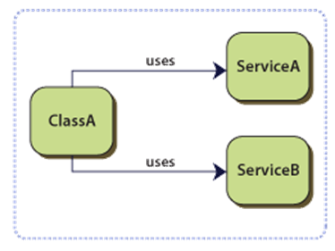

# 5. MVVM

## A gyakorlat célja

A labor során egy recept böngésző alkalmazást fogunk készíteni, amelyben alkalmazzuk az MVVM tervezési mintát.

## Előfeltételek

A labor elvégzéséhez szükséges eszközök:

* Windows 10 vagy Windows 11 operációs rendszer (Linux és macOS nem alkalmas)
* Visual Studio 2022
    * Windows Desktop Development Workload

## Kiinduló projekt

Klónozzuk le a kiinduló projektet az alábbi paranccsal:

```cmd
git clone https://github.com/bmeviauab00/lab-mvvm-kiindulo
```

??? success "A kész megoldás letöltése"
    :exclamation: Lényeges, hogy a labor során a laborvezetőt követve kell dolgozni, tilos (és értelmetlen) a kész megoldás letöltése. Ugyanakkor az utólagos önálló gyakorlás során hasznos lehet a kész megoldás áttekintése, így ezt elérhetővé tesszük.

    A megoldás [GitHubon érhető el](https://github.com/bmeviauab00/lab-mvvm-kiindulo) a `megoldas` ágon. A legegyszerűbb mód a letöltésére, ha parancssorból a `git clone` utasítással leklónozzuk a gépünkre a `megoldas` ágat:

    ```git clone https://github.com/bmeviauab00/lab-xaml-kiindulo -b megoldas```

## Az MVVM mintáról

Az MVVM (Model-View-ViewModel) egy architekturális tervezési minta, amelyet a XAML alkalmazások fejlesztése során használhatunk, de gyakran más kliens oldali technológiák esetében is megjelenik. Az MVVM minta célja, hogy a felhasználói felületet és a mögötte lévő üzleti logikát szétválassza, és ezzel egy lazább csatolású alkalmazást hozzon létre, ami növeli a tesztelhetőséget, a karbantarthatóságot, és az újrafelhasználhatóságot.

Az MVVM minta három fő részből áll:

* **Model**: Az alkalmazás üzleti logikáját tartalmazza, amelyet a ViewModel-ek használnak.
* **View**: A felhasználói felület leírását tartalmazza, és a tisztán a nézetekhez kapcsolódó logikát (pl.: animációk kezelését).
* **ViewModel**: A nézet **absztrakciója**, ami tartalmazza a nézet állapotát és a végrehajtható műveleteket, **nézet függetlenül**. A lazán csatolást a ViewModel és a nézet közötti adatkötés biztosítja.

<figure markdown>

</figure>

## 0. Feladat - Projekt felépítése

Az alkalmazás váza már elő van készítve. Tekintsük át a projekt felépítését.

Az `MvvmLab` a futtatható projekt, amely WinUI keretrendszer használ a megjelenítési rétegében a már tanult XAML nyelvvel. Az `MvvmLab.Core` projekt a teljesen nézet független üzleti logikákat tartalmazza.

Ami számunkra fontos a kiinduló projektben:

* `App.xaml.cs`: Az alkalmazás belépési pontja, amely használja a modern .NET alkalmazásokban alkalmazott Host Builder és Dependency Injection mintákat. A félévnek ez nem az anyaga, de a függőség injektálásról még a labor során lesz szó.
* `Views` mappa: Az alkalmazás nézeteit tartalmazza, jelenleg a `MainPage`-et
* `ViewModels` mappa: Az alkalmazás ViewModel-jeit tartalmazza, jelenleg a `MainViewModel`-t
* `INagivationSerive`: oldalak közötti navigációhoz használt szolgáltatás

TODO többi felesleges részt kukázni a kiinduló projektből

!!! tip "MVVM és Boilerplate könyvtárak"
    MVVM mintát ritkán szoktunk kizárólag a .NET keretrendszerre támaszkodva implementálni. Érdemes használni valamilyen MVVM könyvtárat, amelyek segítségével a kódunk tömörebb, átláthatóbb, és kevesebb boilerplate kódot fog tartalmazni. A könyvtárak közül a legelterjedtebbek a következők:

    * [MVVM Toolkit](https://learn.microsoft.com/en-us/dotnet/communitytoolkit/mvvm/): Microsoft által gondozott MVVM könyvtár
    * [Prism](https://prismlibrary.com/): Régen Microsoft gondozásában állt és nagyon elterjedt volt, de már külső fejlesztők tartják karban és fizetős lett idő közben.
    * [ReactiveUI](https://reactiveui.net/): A Reactive Extensions (Rx) könyvtárakat használja a ViewModel állapotának kezelésére, és a nézet és ViewModel közötti adatkötésre. Ez a könyvtár nyújtja a legtöbb szolgáltatást, de a legnehezebben tanulható is.
    * [Uno.Extensions](https://platform.uno/uno-extensions/): MVVM Toolkitre épül, de több olyan szolgáltatást is tartalmaz, amelyek a WinUI keretrendszer hiányosságait pótolják.

    A labor során a Microsoft által gondozott MVVM Toolkitet fogjuk használni.

    A kiinduló projekt pedig a [Windows Template Studio](https://marketplace.visualstudio.com/items?itemName=TemplateStudio.TemplateStudioForWinUICs) Visual Studio kiegészítő segítségével készült.

## 1. Feladat - Receptek főoldal

A megoldás során "alulról", az adatok felől fogunk építkezni és fokozatosan fogunk eljutni a nézetig. Ugyan a való életben egy top-bottom fejlesztés gyakran hasznosabb, de a labor során az idő rövidsége miatt az alulról építkezés gyorsabb és egyszerűbb, mert így nem kell az adatokat mockolni.

### 1.1 Adatelérési szolgáltatás

Kezdjük az adatelérési réteggel, amit most tekinthetünk az MVVM mintában a modell rétegnek is.

Az alkalmazásunk adatait egy webszerverről, REST API-n, HTTP-n keresztül éri el. Ez ehhez hasonló kliens-szerver architektúrájú alkalmazások egy kifejezetten gyakori megoldás a modern alkalmazások fejlesztése során. Erről bővebben a Mobil és Webes szoftverek, illetve az Adatvezérelt alkalmazások tárgyakban lesz szó. Most elég annyit tudni, hogy a kliens alkalmazásunk HTTP kéréseket fog küldeni a szervernek, amelyekre a szerver válaszolni fog JSON formátumban.

<figure markdown>

<figurecation>Kliens-szerver architektúra<figurecaption>
</figure>

A távoli szolgáltatás a következő címen érhető el: TODO <https://bmecookbook.azurewebsites.net>. A szolgáltatáshoz pedig tartozik egy OpenApi alapú dokumentáció a <https://bmecookbook.azurewebsites.net/swagger> címen. Tanulmányozzuk ezt át.
Az első feladathoz a `/api/Recipes/Groups` végpontot fogjuk használni, amely a receptek csoportosítását adja vissza.

Vegyünk fel az `MvvmLab.Core` projekt `Models` mappájába egy új osztályt `RecipeGroup` néven.

Az OpenApi dokumentációból rakjunk a vágólapra egy `RecipeGroup`-nyi JSON adatot, majd a Visual Studio-ban az `Edit` menü `Paste Special` menüpontjában a `Paste JSON as Classes` menüpontot választva illesszük be a vágólap tartalmát.


A kapott osztályokat átnevezhetjük, hogy a C# kódolási konvencióknak megfeleljenek. A `Rootobject` osztályt nevezzük át `RecipeGroup`-ra, a `Recipe` osztályt pedig `RecipeHeader`-re. Használjunk tömbök helyett `List<T>`-t.

```csharp
public class RecipeGroup
{
    public string Id { get; set; }
    public string Title { get; set; }
    public List<RecipeHeader> Recipes { get; set; }
}

public class RecipeHeader
{
    public int Id { get; set; }
    public string Title { get; set; }
    public string BackgroundImage { get; set; }
    public string TileImage { get; set; }
}
```

Készítsünk egy `IRecipeService` interfészt az `MvvmLab.Core.Services` névtérbe, amelyen keresztül el fogjuk érni a szolgáltatást. Az interfészben egy `GetRecipeGroupsAsync` metódust hozzunk létre, amely a recept csoportokat adja vissza.

```csharp
public interface IRecipeService
{
    public Task<List<RecipeGroup>> GetRecipeGroupsAsync();
}
```

!!! tip "Task visszatérési érték"
    Az interfészben szükséges a tényleges visszatérési értéket `List<RecipeGroup>` becsomagolni egy `Task<T>` objektumba, mivel a hálózati műveleteket aszinkron célszerű implementálni, így ennek a függvénynem is aszinkronnak kell lennie.

Az interfész implementációját a `MvvmLab.Core.Services` névtérben hozzuk létre `RecipeService` néven.
A szolgáltatásunk a `HttpClient` beépített .NET osztályt fogja használni a REST API hívásokhoz.
A `GetFromJsonAsync` indít egy HTTP GET aszinkron kérést a megadott címre, és a választ JSON formátumból deszerializálja a megadott típusra.

```csharp
public class RecipeService : IRecipeService
{
    private readonly string _baseUrl = "https://bmecookbook.azurewebsites.net/api";

    public async Task<List<RecipeGroup>> GetRecipeGroupsAsync()
    {
        using var client = new HttpClient();
        return await client.GetFromJsonAsync<List<RecipeGroup>>($"{_baseUrl}/Recipes/Groups");
    }
}
```

!!! tip "async-await"
    Az `async` és `await` kulcsszavak a legtöbb modern nyelvben az aszinkron függvényhívás nyelvi szintű kezelésére szolgálnak. A működéséről még a félév végén lesz szó, de most a használathoz az alábbiakat érdemes tudni:

    * Az `await` kulcsszóval tudunk bevárni aszinkron végrehajtású műveletet, anélkül, hogy blokkolnánk a hívót.
    * Az `await` kulcsszót, csak `async` kulcsszóval ellátott függvényekben használhatjuk.
    * Az `async` függvényeknek csak `Task` vagy `Task<T>` vagy `void` visszatérési értékük lehet. (Illetve "Task szerű", de ezt nem itt vesszük.)
        * Ha egy `async` függvényt kívülről be szeretnénk várni, akkor az voiddal nem tudjuk megtenni, mindenképpen `Task` vagy `Task<T>` visszatérési értékkel kell rendelkeznie.
        * az `async` függvényekben a `return` utasítás szintaktikája megváltozik: nem a Task objektummal kell visszatérjünk, hanem az általa tartalmazott adattal (`Task` esetében `void`, `Task<T>` esetében `T`).

### 1.2 Főoldal ViewModel

Következő lépésben a főoldal ViewModeljét fogjuk elkészíteni, amely az előbb elkészített szolgáltatást fogja használni a recept csoportok lekérdezéséhez, és állapotként tárolja azokat a nézet számára.

#### Dependency Injection

Nyissuk meg a `MainViewModel` osztályt az `MvvmLab.ViewModels` mappából.
A ViewModelünknek szüksége lesz egy `IRecipeService` interfészt implementáló osztályra, amelyen keresztül le tudja kérdezni a recept csoportokat.
A `MainViewModel` konstruktorában függőség injektáláson keresztül szerezzük be a szükséges függőséget.
Esetünkben ez annyit tesz, hogy várunk egy `IRecipeService` típusú paramétert, amelyet majd a ViewModel példányosításkor fog megkapni, a paramétert pedig elmentjük egy privát változóba.

```csharp
private readonly IRecipeService _recipeService;

public MainViewModel(IRecipeService recipeService)
{
    _recipeService = recipeService;
}
```

??? tip "Függőség Injektálás - Dependency Injection - DI"
    A függőség injektálás (dependency injection (DI)), egy modern alkalmazásokban elkerülhetetlen tervezési minta, ami az objektumok életciklusát szabályozza. 

    Alapesetben az osztályok szoros csatolást alakítanak ki a függőségeikkel (referencia, példányosítás). Ez a szoros csatolás nehezíti a tesztelhetőséget, a karbantarthatóságot, és az újrafelhasználhatóságot.
    
    <figure markdown>
    
    <figurecaption>Erős csatolás DI nélkül</figurecaption>
    </figure>


    A DI segítségével a függőségek életciklusát egy kitüntetett komponens kezeli, a DI konténer. A DI konténer (ábrán Builder, néhol IoC konténer) felelős az osztályok példányosításáért, és a függőségek beinjektálásáért rekurzívan.
    Ahhoz, hogy a példányosítás során a függőségi gráfot bejárva beinjektálja a megfelelő implementációkat a konténert, A DI konténerben regisztrálni kell az osztályokat.

    <figure markdown>
    
    <figurecaption>DI osztálydiagramm</figurecaption>
    </figure>

Ahhoz, hogy a Dependency Injection működjön, szükséges a `MainViewModel` osztályt regisztrálni az `App.xaml.cs` fájlban a `ConfigureServices` metódusban.

```csharp
services.AddTransient<IRecipeService, RecipeService>();
```

Jelenleg ezt a szolgáltatást **Tranziens** élettartamúként regisztráltuk, ami azt jelenti, hogy minden egyes `IRecipeService` függőség igényt egy új `RecipeService` példány fog kielégíteni.

#### ViewModel állapot

Következő lépésben a ViewModel állapotának feltöltését implementáljuk.

A `MainViewModel`-ben hozzunk létre egy `_recipeGroups` nevű `List<RecipeGroup>` **változót**, amelyben tárolni fogjuk a recept csoportokat.
A változót attributáljuk fel a `ObservableProperty` attribútummal, ami alapján az MVVM Toolkit automatikusan generálni fog egy `RecipeGroups` nevű property-t az osztály másik generált partial felében.
Ez a generált property kihasználja az `INotifyPropertyChanged` interfészt, így a `RecipeGroups` property értékének megváltozásakor a `PropertyChanged` eseményt kiváltva értesíti a nézetet, az adatkötések mentén.

```csharp
[ObservableProperty]
private List<RecipeGroup>? _recipeGroups = new();
```

A `MainViewModel` implementálja az előkészített `INavigationAware` interfészt, amelynek segítségével a nézetek közötti navigációs életciklus eseményt tudjuk lekezelni, és akár adatokat is tudunk átadni a ViewModel-ek között.
A `OnNavigatedTo` metódusban kérdezzük le a recept csoportokat az `IRecipeService`-en keresztül, majd tároljuk el a `RecipeGroups` változóban.

```csharp hl_lines="7"
public partial class MainViewModel : ObservableRecipient, INavigationAware
{
    // ...

    public async void OnNavigatedTo(object parameter)
    {
        RecipeGroups = await _recipeService.GetRecipeGroupsAsync();
    }

    public void OnNavigatedFrom()
    {
    }
}
```

### 1.3 Főoldal nézet

A `MainPage`-en készítsük el a nézetet, amelyen megjelenítjük a recept csoportokat.

Ahhoz, hogy a csoportosítást kezelni tudja a `GridView`, szükségünk van egy olyan listára, ami elvégzi a csoportosítást.
Ezt a `CollectionViewSource` osztály segítségével tudjuk megvalósítani, ami bizonyos szempontból UI specifikus burkoló feladatokat lát el.
A `CollectionViewSource`-nak meg kell adnunk a csoportosítandó elemeket, valamint azt, hogy a csoportokat milyen property alapján hozza létre.
Továbbá meg kell adnunk azt is, hogy a csoportokon belül milyen property alapján jelenítse meg az elemeket.

Hozzuk létre az oldal erőforrásai között a `CollectionViewSource` példányt.

```xml
<Page.Resources>
    <CollectionViewSource x:Name="RecipeGroupsCollectionSource"
                            IsSourceGrouped="True"
                            ItemsPath="Recipes"
                            Source="{x:Bind ViewModel.RecipeGroups, Mode=OneWay}" />
</Page.Resources>
```

!!! note
    Vegyük észre, hogy az adatkötés során a `ViewModel` tulajdonsághoz kötünk, ami a `MainPage.xaml.cs`-ben található, és egyszerűem csak átkaszolja a DataContext property-t a ViewModel-re.

    ```csharp
    public MainViewModel ViewModel => DataContext as MainViewModel;
    ```

    Az, hogy a vezérlők (oldalak) `DataContext` tulajdonságában a ViewModel-t tároljuk tipikus az MVVM mintában. Esetünkben ezt a generált projekt `NavigationService` osztálya teszi meg nekünk.

??? tip "Erőforrások"
    XAML környezetben minden vezérlő (fenti példában Page) és az `Application` osztály is, rendelkezik egy `Resources` property-vel, ami egy kulcs érték tároló (`Dictionary<string, object>`), alap esetben. Ebbe tudunk többször felhasználható objektumokat rakni, akár alkalmazás szinten is. Ehhez az erőforrások példányosításakor megadjuk az `x:Key` attribútumot, akkor az erőforrásokat a kulcs alapján tudjuk lekérdezni pl.: a `{StaticResource Key}` markup extensionnel.

    Mi viszont itt kifejezetten `x:Key` helyett `x:Name`-et adtunk meg, mert az `x:Bind`-ban név szerint tudunk hivatkozni változókra.

A receptek listázásához, most egy speciális GridView leszármazott vezérlőt használjunk az `AdaptiveGridView`-t a [CommunityToolkit](https://learn.microsoft.com/en-us/windows/communitytoolkit/) csomagból, amely a nézet méretének megfelelően változtatja a megjelenített elemek számát és méretét, illetve támogatja a Command-okat az elem kattintás esetében. A külső vezérlők hivatkozásához vegyük fel az oldalra a következő névteret:

```xml
xmlns:controls="using:CommunityToolkit.WinUI.UI.Controls"
```

Készítsük el a GridView-t, amelynek a `ItemsSource` property-jét a fenti erőforrásban lévő `RecipeGroupsCollectionSource.View`-ra kötjük.

A `GridView`-en belül a megszokott módon az `ItemTemplate` property-n keresztül tudjuk megadni, hogy az egyes elemeket hogyan kell megjeleníteni.
Esetünkben egy képet és egy szöveget rakunk ki a recpetek címe alapján egy "kártya" szerű layoutra.

A `GroupStyle` property-n keresztül pedig meg tudjuk adni, hogy a csoportokat hogyan kell megjeleníteni. Esetünkben a fejlécet akarjuk testreszabni.

```xml
<Grid x:Name="ContentArea">
    <Grid.RowDefinitions>
        <RowDefinition Height="48" />
        <RowDefinition Height="*" />
    </Grid.RowDefinitions>

    <TextBlock Text="Recipes"
               Grid.Row="0"
               Style="{StaticResource PageTitleStyle}" />

    <controls:AdaptiveGridView Grid.Row="1"
                               DesiredWidth="180"
                               IsItemClickEnabled="True"
                               ItemHeight="160"
                               ItemsSource="{x:Bind RecipeGroupsCollectionSource.View, Mode=OneWay}"
                               SelectionMode="None"
                               StretchContentForSingleRow="False">
        <GridView.ItemTemplate>
            <DataTemplate x:DataType="models:RecipeHeader">
                <Grid MaxWidth="300">
                    <Image Source="{x:Bind BackgroundImage}" />
                    <Border Height="40"
                            Padding="10,0,0,0"
                            VerticalAlignment="Bottom"
                            Background="#88000000">
                        <TextBlock VerticalAlignment="Center"
                                   Foreground="White"
                                   Text="{x:Bind Title}" />
                    </Border>
                </Grid>
            </DataTemplate>
        </GridView.ItemTemplate>
        <GridView.GroupStyle>
            <GroupStyle>
                <GroupStyle.HeaderTemplate>
                    <DataTemplate x:DataType="models:RecipeGroup">
                        <TextBlock Margin="0"
                                   Style="{ThemeResource TitleTextBlockStyle}"
                                   Text="{x:Bind Title}" />
                    </DataTemplate>
                </GroupStyle.HeaderTemplate>
            </GroupStyle>
        </GridView.GroupStyle>
    </controls:AdaptiveGridView>
</Grid>
```

**Próbáljuk ki az alkalmazást!** Győződjünk meg róla, hogy a recept csoportok megjelennek a főoldalon.

## 2. Feladat - Recept részletes oldal

A receptek részletes oldalának elkészítése a következő lépésekből fog állni:

1. Kiegészítjük az `IRecipeService` interfészt egy `GetRecipeAsync` metódussal és létrehozzuk a szükséges osztályokat
1. Létrehozzuk a `RecipeDetailViewModel` ViewModel-t, amiben lekérdezzük a recept adatait a `RecipeDetailViewModel`-ben az `IRecipeService`-en keresztül (a VM az azonosítót kapja meg a navigáció során)
1. Létrehozzuk a `RecipeDetailPage` nézetet, építve a ViewModel adataira
1. Regisztráljuk a ViewModel-t és a nézetet a Dependency Injection konfigurációhoz és a navigációhoz
1. Navigálunk a `RecipeDetailPage`-re a `MainViewModel`-ből a receptre történő kattintésra az `INavigationService` segítségével, és átadjuk a kiválasztott recept azonosítóját a részletes oldalnak

### 2.1 Recept lekérdezése

Hozzuk létre a  `Recipe` osztályt a `MvvmLab.Core.Model` névtérbe, és generáljuk le a tartalmát a `/api/recipes/{id}` végpont által visszaadott példa JSON adatokból, a fent megismert módszerrel (copy, paste special).

```csharp
public class Recipe
{
    public List<string> ExtraImages { get; set; }
    public List<string> Ingredients { get; set; }
    public string Directions { get; set; }
    public string Video { get; set; }
    public List<Comment> Comments { get; set; }
    public List<StoresNearby> StoresNearby { get; set; }
    public int Id { get; set; }
    public string Title { get; set; }
    public string BackgroundImage { get; set; }
    public string TileImage { get; set; }
}

public class Comment
{
    public string Name { get; set; }
    public string PictureUrl { get; set; }
    public string Text { get; set; }
}

public class StoresNearby
{
    public string Name { get; set; }
    public string Url { get; set; }
    public float Longitude { get; set; }
    public float Latitude { get; set; }
}
```

A `IRecipeService` interfészt és implementációját egészítsük ki egy `GetRecipeAsync` metódussal, ami egy receptet ad vissza az azonosítója alapján.

```csharp title="IRecipeService"
public Task<Recipe> GetRecipeAsync(int id);
```

```csharp title="RecipeService"
public async Task<Recipe> GetRecipeAsync(int id)
{
    using var client = new HttpClient();
    return await client.GetFromJsonAsync<Recipe>($"{_baseUrl}/Recipes/{id}");
}
```

### 2.2 Recept részletes ViewModel

A ViewModel készítése a főoldalhoz képest már ujjgyakorlat. Hozzuk létre a `RecipeDetailViewModel` osztályt az `MvvmLab.ViewModels` mappában.

A ViewModel-nek szüksége lesz egy `IRecipeService` interfészt implementáló osztályra, amelyen keresztül le tudja kérdezni a receptet. A `RecipeDetailViewModel` konstruktorában DI segítségével szerezzük be a szükséges függőséget.

```csharp
private readonly IRecipeService _recipeService;

public RecipeDetailViewModel(IRecipeService recipeService)
{
    _recipeService = recipeService;
}
```

A `RecipeDetailViewModel`-ben hozzunk létre egy `_recipe` nevű `Recipe` típusú változót, amelyben tárolni fogjuk a receptet.
A változót attributáljuk fel a `ObservableProperty` attribútummal, ami alapján az MVVM Toolkit automatikusan generálni fogja a `Recipe` nevű property-t az osztály másik generált partial felében.
Ehhez szükséges, hogy az osztály az `ObservableObject` osztályból származzon, és `partial` kulcsszóval legyen ellátva.

```csharp
public partial class RecipeDetailViewModel : ObservableObject
{
    // ...

    [ObservableProperty]
    private Recipe? _recipe = new();
```

Implementáljuk a `RecipeDetailViewModel`-ben az előkészített `INavigationAware` interfészt.
Arra készülünk, hogy a navigációs paraméterként a recept azonosítóját fogjuk megkapni.
A `OnNavigatedTo` metódusban kérdezzük le a receptet a `RecipeService`-en keresztül, majd tároljuk el a `Recipe` tulajdonságban.

```csharp
public partial class RecipeDetailViewModel : ObservableRecipient, INavigationAware
{
    // ...

    public async void OnNavigatedTo(object parameter)
    {
        Recipe = await _recipeService.GetRecipeAsync((int)parameter);
    }

    public void OnNavigatedFrom()
    {
    }
}
```

### 2.3 Recept részletes oldal, navigáció

Hozzunk létre egy új oldalt `RecipeDetailPage` néven a `Views` mappába (_Views mappán jobb gomb / Add New Item / Blank Page (WinUI 3)_), amelyen megjelenítjük a receptet. Első körben csak a recept címét jelenítsük meg egy `TextBlock`-ban.

```xml
<Grid x:Name="ContentArea">
    <Grid.RowDefinitions>
        <RowDefinition Height="48" />
        <RowDefinition Height="*" />
    </Grid.RowDefinitions>

    <TextBlock Grid.Row="0"
               Style="{StaticResource PageTitleStyle}"
               Text="{x:Bind ViewModel.Recipe.Title, Mode=OneWay}" />
</Grid>
```

Az adatkötéshez vegyük fel a `RecipeDetailPage.xaml.cs`-ben a `ViewModel` property-t a főoldal mintájára.

```csharp
public RecipeDetailViewModel ViewModel => (RecipeDetailViewModel)DataContext;
```

!!! warning "Fordítási hibák"
    Ha valamiért egzotikus hibákat kapnánk az új oldal felvétele után töröljük ki a projekt fájlból az alábbi sorokat:

    ```xml
    <ItemGroup>
        <None Remove="Views\RecipeDetailPage.xaml" />
    </ItemGroup>
    ```
    
    ```xml
    <Page Update="Views\RecipeDetailPage.xaml">
        <Generator>MSBuild:Compile</Generator>
    </Page>
    ```

A navigáció támogatásához a `Services` mappában lévő `PageService`-ben regisztráljuk be a `RecipeDetailPage`-et az alábbi 3 lépésben:

1. Vegyük fel a nézet kulcsát a `Pages` osztályba.

    ```csharp hl_lines="4"
    public static class Pages
    {
        public static string Main { get; } = "Main";
        public static string Detail { get; } = "Detail";
    }
    ```

2. Regisztráljuk a nézetet és ViewModel kapcsolatot a `PageService`-ben.

    ```csharp hl_lines="4"
    public PageService()
    {
        Configure<MainViewModel, MainPage>(Pages.Main);
        Configure<RecipeDetailViewModel, RecipeDetailPage>(Pages.Detail);
    }
    ```


3. Az `App.xaml.cs` fájlban a `ConfigureServices` metódusban regisztráljuk be a ViewModel-t és a nézetet a Dependency Injection konténerbe.

    ```csharp
    services.AddTransient<RecipeDetailPage>();
    services.AddTransient<RecipeDetailViewModel>();
    ```

Ezekre azért van szükség, mert a projekt sablonban lévő `INavigationService` alapvetően egy kulccsal azonosítja a nézeteket, hogy a ViewModel-ben ne legyen szükség a nézet típusának ismeretére.
A kulcs alapján pedig ki tudja keresni, hogy pontosan melyik Viewt kell megjeleníteni, és melyik ViewModel-t kell példányosítani a nézet `DataContext`-jébe a DI konténerből.

A `MainViewModel`-ben injektáljuk be az `INavigationService`-t, amelyen keresztül navigálni fogunk a `RecipeDetailPage`-re.

```csharp
private readonly INavigationService _navigationService;

public MainViewModel(IRecipeService recipeService, INavigationService navigationService)
{
    _recipeService = recipeService;
    _navigationService = navigationService;
}
```

#### Command

A ViewModel a végrehajtható műveleteket az MVVM mintában tipikusan `ICommand` interfészt megvalósító objektumokon keresztül publikálja a végrehajtható műveleteket, amelyek a konkrét művelet végrehajtásán túl kezelheti a művelet végrehajtásának feltételeit is.

A `MainViewModel`-ben készítsünk egy Commandot, ami a receptre kattintva fog lefutni. A Command paraméterként megkapja a kiválasztott recept fejlécet, és átnavigál a `RecipeDetailPage`-re, ahol átadásra kerül a kiválasztott recept azonosítóját.

Az MvvmToolkit segítségével szintén egy attribútummal (`[RelayCommand]`) egyszerűen tudunk generálni `ICommand` típusú tulajdonságot egy metódusból.

```csharp
[RelayCommand]
private void RecipeSelected(RecipeHeader recipe)
{
    _navigationService.NavigateTo(Pages.Detail, recipe.Id);
}
```

A `MainPage`-en kössük a `AdaptiveGridView` `ItemClickCommand` eseményét a `RecipeSelectedCommand`-ra.

```xml
ItemClickCommand="{x:Bind ViewModel.RecipeSelectedCommand}"
```

**Próbáljuk ki az alkalmazást!** Győződjünk meg róla, hogy a receptekre kattintva megjelenik a recept részletes oldala.

??? tip "Kitekintés: Ha nincs a használni kívánt eseményre Command?"

    Ha a vezérlő bizonyos eseményekre biztosít Commandot, akkor viszonylag egyszerű dolgunk van, amire fentebb láthattunk egy példát.
    Azonban ha a vezérlő nem biztosít Commandot (pl.: a beépített `GridView.ItemClicked`), akkor több lehetőségünk is van:

    1. **Code-Behind "ragasztó kód":** A vezérlő eseményét kezeljük le, és a code-behindban (xaml.cs) ViewModel-ben hívjuk meg a megfelelő metódust/commadot.

        ```xml
        <controls:AdaptiveGridView x:Name="gridView"
                                    ItemsSource="{x:Bind RecipeGroupsCollectionSource.View, Mode=OneWay}"
                                    IsItemClickEnabled="True"
                                    ItemClick="GridView_ItemClick">
        ```

        ```csharp
        private void GridView_ItemClick(object sender, ItemClickEventArgs e)
        {
            ViewModel.RecipeSelectedCommand.Execute((RecipeHeader)e.ClickedItem);
        }
        ```

    2. **x:Bind metódus kötés**: használjuk az `x:Bind` metódus kötési lehetőségét, amelynek segítségével a vezérlő eseményét tudjuk kötni a ViewModel-ben lévő **metódusra**.
       A metódusnak viszont ilyenkor vagy paraméter nélkülinek kell lennie, vagy olyan paramétereket kell fogadnia, amely az esemény szignatúrájára illeszkedik.

        ```xml
        <controls:AdaptiveGridView x:Name="gridView"
                                    ItemsSource="{x:Bind RecipeGroupsCollectionSource.View, Mode=OneWay}"
                                    IsItemClickEnabled="True"
                                    ItemClickCommand="{x:Bind ViewModel.RecipeSelected}">
        </controls:AdaptiveGridView>
        ```

        Ennek a módszernek a hátránya, hogy a esemény paramétereivel a ViewModel-be a nézet keretrendszer függőségeit is beviszi (eseménykezelő paraméter típusok), pedig az alap gondolatunk az volt, hogy a ViewModel független legyen a nézettől. Természetesen ez a módszer is jól tud működni, ha részben feladjuk az MVVM minta szigorú betartását.

    3. A Behavior-ök segítségével, azon belül is az `EventTriggerBehavior` és `InvokeCommandAction` osztályokkal tudunk Commandot kötni tetszőleges vezérlő eseményre.

        ```xml
        <controls:AdaptiveGridView x:Name="gridView"
                                    ItemsSource="{x:Bind RecipeGroupsCollectionSource.View, Mode=OneWay}"
                                    IsItemClickEnabled="True">
            <i:Interaction.Behaviors>
                <c:EventTriggerBehavior EventName="ItemClick">
                    <c:InvokeCommandAction Command="{x:Bind ViewModel.RecipeSelectedCommand}" 
                                           InputConverter="{StaticResource ItemClickedInputConverter}" />
                </c:EventTriggerBehavior>
            </i:Interaction.Behaviors>
        ```

        Ezzel szinte teljesen deklaratívvá tudjuk tenni hagyni a nézetet, de még így is készítenünk kell egy `ItemClickedInputConverter` osztályt, amely az esemény paramétereit átalakítja a megfelelő típusra az `IValueConverter` interfész segítségével.

        ```csharp
        public class ItemClickedInputConverter : IValueConverter
        {
            public object Convert(object value, Type targetType, object parameter, string language)
            {
                return (RecipeHeader)((value as ItemClickEventArgs)?.ClickedItem);
            }

            public object ConvertBack(object value, Type targetType, object parameter, string language)
            {
                throw new NotImplementedException();
            }
        }
        ```
        
        A behavior-ök egyébként egy teljesen általános mechanizmus a XAML világban, amelyek segítségével a nézetekhez tudunk újrafelhasználható viselkedést hozzáadni. TODO link 

### 2.4 Recept részletes nézet

A recept részletes adataihoz egy `Grid`-et használjunk, amelynek két oszlopa van.
Az első oszlopban egy `ScrollViewer`-t helyezzünk el, amelyen belül egy `StackPanel` kerül.
A `StackPanel`-ben helyezzünk el egy `FlipView`-et, amelyben a recept képeit fogjuk megjeleníteni.
A `FlipView` egy listaként működik, de az elemeit egy lapozható felületen jeleníti meg.

A `FlipView` alatt lesz található el egy `ItemsControl`-t (lista, ami nem támogat görgetést, kiválasztás kattintást stb.), amelyben a recept hozzávalóit fogjuk megjeleníteni.

Ez alá kerül egy `TextBlock`, amelyben a recept elkészítésének lépéseit kerülnek.

A második oszlopba helyezzünk el egy `Grid`-et, amelybe a kommentek listája és beviteli mezői fognak kerülni.

Az alábbi kódot a labor során nyugodtan másolhatjuk, újdonság ebben a kódban nincs az eddigiekhez képest.

```xml
<?xml version="1.0" encoding="utf-8" ?>
<Page x:Class="MvvmLab.Views.RecipeDetailPage"
      xmlns="http://schemas.microsoft.com/winfx/2006/xaml/presentation"
      xmlns:x="http://schemas.microsoft.com/winfx/2006/xaml"
      xmlns:d="http://schemas.microsoft.com/expression/blend/2008"
      xmlns:local="using:MvvmLab.Views"
      xmlns:mc="http://schemas.openxmlformats.org/markup-compatibility/2006"
      xmlns:models="using:MvvmLab.Core.Models"
      Background="{ThemeResource ApplicationPageBackgroundThemeBrush}"
      mc:Ignorable="d">

    <Grid x:Name="ContentArea">
        <Grid.RowDefinitions>
            <RowDefinition Height="48" />
            <RowDefinition Height="*" />
        </Grid.RowDefinitions>

        <TextBlock Grid.Row="0"
                   Style="{StaticResource TitleTextBlockStyle}"
                   Text="{x:Bind ViewModel.Recipe.Title, Mode=OneWay}" />

        <Grid Grid.Row="1">
            <Grid.ColumnDefinitions>
                <ColumnDefinition Width="*" />
                <ColumnDefinition Width="Auto" />
            </Grid.ColumnDefinitions>

            <ScrollViewer Grid.Column="0">
                <StackPanel Orientation="Vertical">
                    <StackPanel x:Name="images"
                                Margin="0,0,24,0"
                                Orientation="Vertical">
                        <TextBlock Margin="0,0,0,12"
                                   Style="{StaticResource SubtitleTextBlockStyle}"
                                   Text="Images" />
                        <FlipView x:Name="flipView"
                                  MaxHeight="250"
                                  VerticalAlignment="Top"
                                  ItemsSource="{x:Bind ViewModel.Recipe.ExtraImages, Mode=OneWay}">
                            <FlipView.ItemTemplate>
                                <DataTemplate>
                                    <Image Source="{Binding}" Stretch="Uniform" />
                                </DataTemplate>
                            </FlipView.ItemTemplate>
                        </FlipView>
                    </StackPanel>

                    <StackPanel x:Name="ingredients"
                                Margin="0,0,24,0"
                                Orientation="Vertical">
                        <TextBlock Margin="0,0,0,12"
                                   Style="{StaticResource SubtitleTextBlockStyle}"
                                   Text="Ingredients" />
                        <ItemsControl HorizontalAlignment="Left" ItemsSource="{x:Bind ViewModel.Recipe.Ingredients, Mode=OneWay}">
                            <ItemsControl.ItemTemplate>
                                <DataTemplate>
                                    <TextBlock Margin="0,0,0,10"
                                               Text="{Binding}"
                                               TextWrapping="Wrap" />
                                </DataTemplate>
                            </ItemsControl.ItemTemplate>
                        </ItemsControl>
                    </StackPanel>

                    <StackPanel x:Name="directions"
                                Margin="0,0,24,0"
                                Orientation="Vertical"
                                RelativePanel.RightOf="ingredients">
                        <TextBlock Margin="0,0,0,12"
                                   Style="{StaticResource SubtitleTextBlockStyle}"
                                   Text="Directions" />
                        <TextBlock HorizontalAlignment="Left"
                                   Text="{x:Bind ViewModel.Recipe.Directions, Mode=OneWay}"
                                   TextWrapping="Wrap" />
                    </StackPanel>
                </StackPanel>
            </ScrollViewer>

            <Grid Grid.Column="1" RowSpacing="12">
                <Grid.RowDefinitions>
                    <RowDefinition Height="Auto" />
                    <RowDefinition Height="*" />
                    <RowDefinition Height="Auto" />
                </Grid.RowDefinitions>

                <TextBlock Grid.Row="0"
                           Style="{StaticResource SubtitleTextBlockStyle}"
                           Text="Comments" />

                <ListView Grid.Row="1" ItemsSource="{x:Bind ViewModel.Recipe.Comments, Mode=OneWay}">
                    <ListView.ItemTemplate>
                        <DataTemplate x:DataType="models:Comment">
                            <StackPanel Orientation="Vertical">
                                <TextBlock FontWeight="Bold" Text="{x:Bind Name}" />
                                <TextBlock Text="{x:Bind Text}" />
                            </StackPanel>
                        </DataTemplate>
                    </ListView.ItemTemplate>
                </ListView>

                <StackPanel x:Name="comments"
                            Grid.Row="2"
                            Margin="24,0,24,0"
                            Orientation="Vertical">
                    <!-- TODO kommentek beviteli mezői -->
                </StackPanel>
            </Grid>
        </Grid>
    </Grid>
</Page>
```

**Próbáljuk ki az alkalmazást!**

## 3. Feladat - Kommentek hozzáadása

Ha jól állunk idővel készítsünk funkciót a kommentek hozzáadásához a recept részletes oldalra.

### Webszolgáltatás

Hozzunk létre egy `NewComment` osztályt a `MvvmLab.Core.Models` névtérbe, ami a kérés törzsében szereplő adatokat fogja tartalmazni.

```csharp
public class NewComment
{
    public string Email { get; set; }
    public string Text { get; set; }
}
```

Az `IRecipeService` interfészt és implementációt egészítsük ki egy `SendCommentAsync` metódussal, ami egy kommentet küld a szervernek a `POST /Recipes/{recipeId}/Comments` végpontra.

```csharp title="IRecipeService"
public Task SendCommentAsync(int recipeId, NewComment comment);
```

```csharp title="RecipeService"
public async Task SendCommentAsync(int recipeId, NewComment comment)
{
    using var client = new HttpClient();
    await client.PostAsJsonAsync($"{_baseUrl}/Recipes/{recipeId}/Comments", comment);
}
```

### ViewModel

A `RecipeDetailViewModel`-ben hozzunk létre egy `NewCommentText` nevű `string` típusú tulajdonságot és egy `NewCommentName` `string` tulajdonságot, amelyben tárolni fogjuk a felhasználó által megadott komment adatait. Szintén használjuk ki az `ObservableProperty` attribútumot.

```csharp
[ObservableProperty]
private string _newCommentName = string.Empty;

[ObservableProperty]
private string _newCommentText = string.Empty;
```

A `RecipeDetailViewModel`-ben hozzunk létre egy `SendComment` nevű függvényt, amelyen keresztül a felhasználó által megadott kommentet tudjuk elküldeni a szervernek.
A függvényből generáltassunk egy Commandot az MVVM Toolkit segítségével (`[RelayCommand]`).

Az implementáció egyszerű: elküldjük a kommentet a szervernek, majd frissítjük a receptet.

```csharp
[RelayCommand]
private async Task SendComment()
{
    await _recipeService.SendCommentAsync(Recipe!.Id, new NewComment
    {
        Email = NewCommentName,
        Text = NewCommentText
    });

    NewCommentName = string.Empty;
    NewCommentText = string.Empty;

    Recipe = await _recipeService.GetRecipeAsync(Recipe.Id);
}
```

A nézeten a következő elemeket helyezzük el a kommentek hozzáadásához:

```xml
<StackPanel x:Name="comments"
            Grid.Row="2"
            Margin="24,0,24,0"
            Orientation="Vertical">
    <TextBox Margin="0,0,0,16"
             Header="Name"
             Text="{x:Bind ViewModel.NewCommentName, Mode=TwoWay}" />
    <TextBox Margin="0,0,0,16"
             Header="Comment"
             Text="{x:Bind ViewModel.NewCommentText, Mode=TwoWay}" />
    <Button Margin="0,0,0,16"
            HorizontalAlignment="Right"
            Command="{x:Bind ViewModel.SendCommentCommand}"
            Content="Send" />
</StackPanel>
```

Vegyük észre, hogy a `TextBox`-ok `Text` property-jét kétirányú kötéssel kötöttük a ViewModel-ben lévő `NewCommentName` és `NewCommentText` tulajdonságokhoz, és a gomb Command-ját is a ViewModel-ben lévő `SendCommentCommand` tulajdonsághoz kötöttük.

## Kitekintés: Commandok végrehajtásának feltételei

A `SendCommentCommand` Command végrehajtásának feltétele, hogy a `NewCommentName` és a `NewCommentText` tulajdonságok ne legyenek üresek.
A Commandok lehetőséget adnak arra, hogy a végrehajtásukat feltételekhez kössük, amelyeket a `CanExecute` metódusban tudunk megadni.
Esetünkben egy `bool`-lal visszatérő metódus/property nevet kell megadnunk a Command generátor attribútumnak.

```csharp
private bool CanExecuteSendComment => !string.IsNullOrEmpty(NewCommentName) && !string.IsNullOrEmpty(NewCommentText);

[RelayCommand(CanExecute = nameof(CanExecuteSendComment))]
private async Task SendComment()
```

**Próbáljuk ki.** Azt tapasztaljuk, hogy a gomb nem lesz engedélyezve, viszont a `TextBox`-ok módosítása után sem változik a gomb állapota.

A `CanExecute` metódus akkor hívódik meg, amikor a Command elsüti a `CanExecuteChanged` eseményt.
Esetünkben ezt az eseményt a `NewCommentName` és a `NewCommentText` tulajdonságok `PropertyChanged` eseményének kiváltásakor kell kiváltani.
Erre az MVVM Toolkit egy külön attribútumot biztosít (`[NotifyCanExecuteChangedFor]`), amelyet a `NewCommentName` és a `NewCommentText` tulajdonságokra kell rárakni.

Tehát, ha a `NewCommentName` vagy a `NewCommentText` tulajdonság értéke megváltozik, akkor a `SendCommentCommand` Command `CanExecuteChanged` eseményét is kiváltjuk, ami miatt a `CanExecute` metódus újra lefut, és a gomb állapota is frissül.

```csharp
[ObservableProperty]
[NotifyCanExecuteChangedFor(nameof(SendCommentCommand))]
private string _newCommentName = string.Empty;

[ObservableProperty]
[NotifyCanExecuteChangedFor(nameof(SendCommentCommand))]
private string _newCommentText = string.Empty;
```

**Próbáljuk ki.**

Már csak egy dolog van hátra: jelenleg a `TextBox` állapota csak akkor változik, ha a felhasználó elhagyja a `TextBox`-ot.
Ezt a viselkedést az adatkötés `UpdateSourceTrigger` tulajdonságán keresztül tudjuk módosítani.

```xml
Text="{x:Bind ViewModel.NewCommentName, Mode=TwoWay, UpdateSourceTrigger=PropertyChanged}"

Text="{x:Bind ViewModel.NewCommentText, Mode=TwoWay, UpdateSourceTrigger=PropertyChanged}"
```

**Próbáljuk ki.**

## Kitekintés: Vissza a főoldalra

TBD
