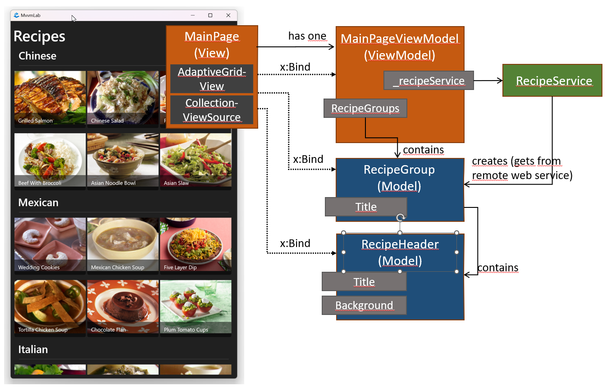

# 5. MVVM

## Das Ziel der Übung

In dieser Übung werden wir eine Rezept-Browser-Anwendung unter Verwendung des MVVM-Entwurfsmusters erstellen.

## Voraussetzungen

Die für die Durchführung des Labors benötigten Werkzeuge:

* Betriebssystem Windows 10 oder Windows 11 (Linux und macOS nicht geeignet)
* Visual Studio 2022
    * Windows Desktop Entwicklung Workload

## Ursprüngliches Projekt

Klonen Sie das ursprüngliche Projekt mit dem folgenden Befehl:

```cmd
git clone https://github.com/bmeviauab00/lab-mvvm-kiindulo
```

??? success "Laden Sie die fertige Lösung herunter"
    :exclamation: Es ist wichtig, dass Sie sich während des Praktikums an die Anleitung halten. Es ist verboten (und sinnlos), die fertige Lösung herunterzuladen. Allerdings kann es bei der anschließenden Selbsteinübung nützlich sein, die fertige Lösung zu überprüfen, daher stellen wir sie zur Verfügung.

    Die Lösung ist [auf GitHub] (https://github.com/bmeviauab00/lab-mvvm-kiindulo) im `solve`-Zweig verfügbar. Der einfachste Weg, es herunterzuladen, ist, den `git clone`-Zweig von der Kommandozeile aus zu klonen:

    `git clone https://github.com/bmeviauab00/lab-mvvm-kiindulo -b solved`

## Über das MVVM-Beispiel

Das MVVM (Model-View-ViewModel) ist ein architektonisches Entwurfsmuster, das bei der Entwicklung von XAML-Anwendungen eingesetzt werden kann, aber auch häufig in anderen Client-seitigen Technologien verwendet wird. Das MVVM-Muster wurde entwickelt, um die Benutzeroberfläche und die zugrunde liegende Logik zu entkoppeln und so eine lose gekoppelte Anwendung zu schaffen, die die Testbarkeit, Wartbarkeit und Wiederverwendbarkeit erhöht.

Das MVVM-Beispiel besteht aus drei (+1) Hauptteilen:

* **Modell**: Enthält das Geschäftsmodell der Anwendung, das ViewModels zum Speichern von Daten verwenden können.
* **Ansicht**: Sie enthält eine Beschreibung der Benutzeroberfläche und der rein auf die Ansichten bezogenen Logik (z.B.: Umgang mit Animationen).
* **ViewModel**: Eine **Abstraktion der** Ansicht, die den Zustand der Ansicht und die Operationen enthält, die **unabhängig von der** Ansicht mit der Ansicht durchgeführt werden können. Die lose Kopplung zwischen dem ViewModel und dem View wird durch die Datenbindung gewährleistet.
* **Dienstleistungen** (Services): Klassen, die die Geschäftslogik der Anwendung enthalten und von ViewModels verwendet werden. Wäre die gesamte Geschäftslogik in ViewModels enthalten, wären diese zu komplex und undurchsichtig. Dies ist nicht Teil des MVVM-Musters, aber wir erwähnen es hier, weil wir die Anwendungsarchitektur auf diese Weise nutzen werden.

Neu:

* **Modell**: Erfasst domänenspezifische Daten, die ViewModels zum Speichern von Daten verwenden können. Z.B. die Klasse Rezept/Produkt/Bestellung, die die Daten eines Rezepts/Produkts/Bestellung kombiniert.
* **Ansicht**: Sie enthält eine Beschreibung der Benutzeroberfläche (und der rein auf die Ansichten bezogenen Logik, z. B. die Handhabung von Animationen). Typischerweise eine von Window, Page, UserControl abgeleitete Klasse, mit einer deklarativen Beschreibung in XAML, der Code-Behind ist oft leer (weil die Logik im ViewModel ist).
* **ViewModel**: Sie enthält die Logik für die Ansicht: Sie enthält den Zustand der Ansicht und die Operationen, die mit der Ansicht durchgeführt werden können. **Unabhängig von der** Ansicht wird eine lose Kopplung zwischen dem ViewModel und der Ansicht durch Datenbindung erreicht (die Steuerelemente der Ansicht binden an die Eigenschaften des ViewModels). Einheitlich testbar!
* **Dienstleistungen** (Services): Klassen, die die Geschäfts-/Anwendungslogik der Anwendung enthalten und von ViewModels verwendet werden. Wäre die gesamte Geschäftslogik in ViewModels enthalten, wären diese zu komplex und undurchsichtig. Dies ist nicht Teil des MVVM-Musters, aber wir erwähnen es hier, weil wir auf diese Weise die Architektur der Anwendung aufbauen werden.

<figure markdown>

</figure>

:exclamation: Wozu erstellen wir ViewModel-Klassen?

* Wir erstellen immer eine ViewModel-Klasse für jede **Ansicht** (z.B. Window, Page, Dialog, UserControl) und erzeugen daraus ein Objekt für eine Ansicht.  Z.B. MainPage für MainPageViewModel, DancerDialog für DancerDialogViewModel. Wir wenden dies in der Praxis an.
* Für jede **Modellklasse** (z. B. Rezept, Produkt, Tänzer usw.) können Sie optional Wrapper-ViewModel-Klassen erstellen (z. B. RecipeViewModel, ProductViewModel, DancerViewModel), aber wir werden sie in dieser Übung **nicht** erstellen. Das liegt daran, dass wir nicht dem Strict MVVM-Muster folgen, sondern dem Relaxed MVVM-Muster (siehe Präsentation).

## 0. Aufgabe - Projektstruktur

Der Anwendungsrahmen ist bereits vorbereitet. Schauen wir uns die Projektstruktur an.

 `MvvmLab` ist ein Projekt für eine ausführbare Anwendung, die das WinUI-Framework in seiner Anzeigeschicht mit der bereits erlernten XAML-Sprache verwendet. Das Projekt `MvvmLab.Core` (Klassenbibliothek) enthält die vollständig ansichtsunabhängige Geschäftslogik.

Was ist für uns in der Anfangsphase des Projekts wichtig?

* `App.xaml.cs`: Ein Anwendungseinstiegspunkt, der die in modernen .NET-Anwendungen verwendeten Muster Host Builder und Dependency Injection verwendet. Dies ist nicht das Thema dieses Semesters, aber die Injektion von Sucht wird im Labor behandelt werden.
* `Views` ordner: Enthält Ansichten der Anwendung, derzeit `MainPage`
* `ViewModels` ordner: Enthält die ViewModels der Anwendung, derzeit `MainPageViewModel`
* `INagivationService` ( im Ordner`Services` ): Dienst für die Navigation zwischen Seiten

!!! tip "MVVM und Boilerplate-Bibliotheken"
    MVVM-Patterns werden selten allein auf der Grundlage des .NET-Frameworks implementiert. Es lohnt sich, einige MVVM-Bibliotheken zu verwenden, die Ihren Code prägnanter und transparenter machen und weniger Boilerplate-Code enthalten. Die gebräuchlichsten Bibliotheken sind:

    * [MVVM Toolkit](https://learn.microsoft.com/en-us/dotnet/communitytoolkit/mvvm/): MVVM-Bibliothek, die von Microsoft gepflegt wird
    * [Prisma] (https://prismlibrary.com/): Früher wurde es von Microsoft gewartet und war sehr weit verbreitet, aber jetzt wird es von externen Entwicklern gewartet und ist mit der Zeit kostenpflichtig geworden.
    * [ReactiveUI](https://reactiveui.net/): Es verwendet die Reactive Extensions (Rx)-Bibliotheken, um den Zustand des ViewModels zu verwalten und Daten zwischen der Ansicht und dem ViewModel zu binden. Diese Bibliothek bietet die meisten Dienste, ist aber auch am schwierigsten zu erlernen.
    * [Uno.Extensions](https://platform.uno/uno-extensions/): Es basiert auf dem MVVM-Toolkit, enthält aber auch mehrere Funktionen, die Lücken im WinUI-Framework schließen.

    Während des Praktikums werden wir das MVVM-Toolkit von Microsoft verwenden.

    Das ursprüngliche Projekt wurde mit dem Visual Studio Add-on [Windows Template Studio] (https://marketplace.visualstudio.com/items?itemName=TemplateStudio.TemplateStudioForWinUICs) erstellt.

## 1. Aufgabe - Rezepte Home

In der Lösung bauen wir von unten nach oben auf, von den Daten ausgehend, und arbeiten uns schrittweise bis zur Ansicht vor. Die Entwicklung von oben nach unten ist zwar in der Praxis oft nützlicher, aber aufgrund der zeitlichen Beschränkungen im Labor ist die Entwicklung von unten nach oben schneller und einfacher, weil man die Daten nicht nachbilden muss. Die folgende Abbildung gibt einen Überblick über die wichtigsten Klassen, die mit der Hauptseite verbunden sind.

<figure markdown>

<figurecation>MMVM-basierte Implementierung der Homepage<figurecaption>
</figure>

Schlüsselelemente:

* `MainPage`: Diese Ansicht, ein Nachkomme der Seite, ist eine XAML-basierte Beschreibung der Schnittstelle.
* `MainPageViewModel`: das ViewModel für die Hauptseite (`MainPage`) . Eine (generierte) `RecipeGroups` Eigenschaft enthält Rezeptgruppen, Rezeptgruppen enthalten Rezepte. Diese Ansicht zeigt den Kopf der Rezeptgruppen sowie den Kopf und die Bilder der Rezepte in den Gruppen mit Datenbindung.
* `RecipeGroup` und `Recipe`: Modellklassen für Rezeptgruppen und Rezepte.
* `RecipeService` anwendungslogik/Datenzugriff zur Verwaltung von Rezepten (kommuniziert mit einem entfernten Dienst) unter Verwendung von ViewModel.

### 1.1 Datenzugangsdienst

Beginnen wir mit der Datenzugriffsschicht, die nun als Modellschicht im MVVM-Beispiel betrachtet werden kann.

Unsere Anwendung ruft Daten von einem Webserver ab (über die sogenannte REST-API, HTTP). Client-Server-Architekturen wie diese sind eine sehr verbreitete Lösung in der modernen Anwendungsentwicklung. Dies wird im nächsten Semester in Mobile und Web Software und Data Driven Applications ausführlicher behandelt. Für den Moment genügt es zu wissen, dass unsere Client-Anwendung HTTP-Anfragen an den Server sendet, der mit der Rückgabe von Daten im JSON-Format antwortet.

<figure markdown>

<figurecation>Client-Server-Architektur<figurecaption>
</figure>

Der Ferndienst ist verfügbar unter: <https://bmecookbook2.azurewebsites.net/api>. Der Dienst umfasst eine OpenApi-basierte Dokumentation über die <https://bmecookbook2.azurewebsites.net/swagger> am. Studieren Sie dies, oder probieren Sie die Endpunkte auch über die Swagger-Schnittstelle aus (indem Sie die URL mit der Endung "swagger" in die Adresszeile eines Browsers eingeben). Für die erste Übung werden wir den Endpunkt `/api/Recipes/Groups` verwenden, der die Gruppierung von Rezepten zurückgibt.

Fügen Sie eine neue Klasse namens `RecipeGroup` in den Ordner `Models` des Projekts `MvvmLab.Core` ein.

Rufen Sie mit Swagger den Endpunkt "api/Recipes/Groups" auf (genauer gesagt, senden Sie eine http-GET-Anfrage)

* Öffnen Sie in der Swagger-Schnittstelle die Endpunktbeschreibung "Get api/Recipes/Groups"
* Klicken Sie auf die Schaltfläche Execute
* Die vom Dienst gesendete JSON-Antwort wird unter "Antwortkörper" angezeigt: Hier sehen wir, dass die Antwort Rezeptgruppen enthält. Jede Gruppe hat einen "Titel" (z.B. Chinesisch, Mexikanisch, Italienisch), und unter jeder Gruppe finden Sie `[]` (JSON-Array) die Daten der Rezepte in der Gruppe. 
* Kopieren Sie die JSON-Daten von `RecipeGroup`in die Zwischenablage. Sie können auch die Ausgabe unter "Beispielwert" verwenden, wenn Sie sie in die Zwischenablage kopieren (kopieren Sie jedoch nicht die öffnenden [ und schließenden ] Karat). Wenn Sie aus irgendeinem Grund nicht weiterkommen, können Sie den Inhalt auch über das Dropdown-Menü in die Zwischenablage kopieren:
 
    ??? "In die Zwischenablage zu kopieren"
        ```json
        {
            "Title": "string",
            "Recipes": [
                {
                    "Id": 0,
                    "Title": "string",
                    "BackgroundImage": "string"
                }
            ]
        }
        ```
  
In Visual Studio fügen Sie den Inhalt der Zwischenablage ein, indem Sie `Paste JSON as Classes` aus dem Menü `Paste Special` im Menü `Edit` wählen. VS generiert dann Klassen, die der Struktur des von Ihnen eingefügten JSON entsprechen.


Die resultierenden Klassen können umbenannt werden, um den C#-Codierungskonventionen zu entsprechen. Benennen Sie die Klasse `Rootobject` in `RecipeGroup`und die Klasse `Recipe` in `RecipeHeader`um.

```csharp
public class RecipeGroup
{
    public string Title { get; set; }
    public RecipeHeader[] Recipes { get; set; }
}

public class RecipeHeader
{
    public int Id { get; set; }
    public string Title { get; set; }
    public string BackgroundImage { get; set; }
}
```

!!! tip " Verwenden Sie`List<T>` "
    In unserem Fall war es nicht notwendig (weil wir nicht erweitern Rezept Sammlungen), aber wenn es bequemer für uns ist, fühlen sich frei, um die Blöcke in den generierten Code zu `List<T>`umschreiben.

Erstellen Sie eine Schnittstelle `IRecipeService` zum Namespace `MvvmLab.Core.Services`, über die auf den Remote-Dienst zugegriffen werden soll. In der Schnittstelle erstellen wir eine Methode `GetRecipeGroupsAsync`, die die Rezeptgruppen abfragt und zurückgibt.

```csharp
public interface IRecipeService
{
    public Task<RecipeGroup[]> GetRecipeGroupsAsync();
}
```

!!! tip "Task-Rückgabewert"
    In der Schnittstelle ist der eigentliche Rückgabewert (`RecipeGroup[]`) in ein Objekt `Task<T>` verpackt, da es vorzuziehen ist, Netzwerkoperationen asynchron zu implementieren. in .NET ist die modernste und einfachste Art, Asynchronität zu implementieren, die Verwendung von `Task`s. Und die Asynchronität sorgt dafür, dass die Benutzeroberfläche nicht einfriert, wenn die Netzwerkanforderung lange dauert (und das alles, ohne separate Threads zu starten).

Die Implementierung der Schnittstelle wird im Namespace `MvvmLab.Core.Services` unter `RecipeService` erstellt. Unser Dienst wird die integrierte .NET-Klasse `HttpClient` für REST-API-Aufrufe verwenden.  `GetFromJsonAsync` stellt eine asynchrone HTTP GET-Anfrage an die angegebene Adresse und deserialisiert die Antwort von JSON in den angegebenen Typ.

```csharp
public class RecipeService : IRecipeService
{
    private readonly string _baseUrl = "https://bmecookbook2.azurewebsites.net/api";

    public async Task<RecipeGroup[]> GetRecipeGroupsAsync()
    {
        using var client = new HttpClient();
        return await client.GetFromJsonAsync<RecipeGroup[]>($"{_baseUrl}/Recipes/Groups");
    }
}
```

Die Operation `GetFromJsonAsync` ist asynchron, sie gibt also `Task`zurück, wir können dies nicht blockierend erwarten und mit dem Schlüsselwort `await` auf das Ergebnis zugreifen.

!!! tip "async-await"
    Die Schlüsselwörter `async` und `await` werden in den meisten modernen Sprachen verwendet, um asynchrone Funktionsaufrufe auf Sprachebene zu behandeln. Wir werden am Ende des Semesters mehr darüber sprechen, wie es funktioniert, aber bis dahin müssen Sie Folgendes wissen, um es zu nutzen:

    * Mit dem Schlüsselwort `await` können wir auf eine asynchrone Ausführung warten, ohne den Aufrufer zu blockieren.
    * Das Schlüsselwort "await" kann nur in Funktionen mit dem Schlüsselwort "async" verwendet werden.
    * Async"-Funktionen können nur den Rückgabewert `Task` oder `Task<T>` oder `void` haben. (Oder "aufgabenähnlich", aber das nehmen wir hier nicht.)
        * Wenn Sie eine "async"-Funktion von außen aufrufen wollen, können Sie das nicht mit "void" tun, sondern sie muss einen Rückgabewert von "Task" oder "Task<T>" haben.
        * in `async`-Funktionen wird die Syntax der `return`-Anweisung geändert: es muss nicht das Task-Objekt zurückgegeben werden, sondern die darin enthaltenen Daten (`void` für `Task`, `Task<T>` für `T`).

### 1.2 Startseite ViewModel

Im nächsten Schritt erstellen wir das ViewModel der Hauptseite, das den soeben erstellten Dienst verwendet, um die Rezeptgruppen abzurufen und sie als Status für die Ansicht zu speichern.

#### Injektion von Abhängigkeiten

Öffnen Sie die Klasse `MainPageViewModel` aus dem Ordner `MvvmLab.ViewModels`.  Unser ViewModel benötigt eine Klasse, die die Schnittstelle `IRecipeService` implementiert, über die es die Rezeptgruppen abfragen kann. Im `MainPageViewModel` Konstruktor erhalten wir die erforderliche Abhängigkeit über Dependency Injection. In unserem Fall bedeutet dies, dass wir einen Parameter vom Typ `IRecipeService` erwarten, der vom ViewModel empfangen wird, wenn es instanziiert wird, und der Parameter wird in einer privaten Variablen gespeichert.

```csharp
private readonly IRecipeService _recipeService;

public MainPageViewModel(IRecipeService recipeService)
{
    _recipeService = recipeService;
}
```

??? tip "Dependency Injection - DI"
    Standardmäßig sind Klassen eng mit ihren Abhängigkeiten gekoppelt (Referenz, Instanziierung). 
    
    <figure markdown>
    
    <figurecaption>Starke Befestigung ohne DI</figurecaption>
    </figure>

    Diese enge Kopplung erschwert die Prüfung, Wartung und Wiederverwendung. Dies wird durch den Einsatz von Dependency Injection (und Strategy) unterstützt. In diesem Kurs lernen wir das Dependency Injection (DI) Design Pattern kennen, das immer in Verbindung mit dem Strategy Pattern verwendet wird. Die Idee ist, dass eine Klasse ihre Abhängigkeiten (die Klassen, von denen sie abhängt und die sie verwendet) nicht selbst erzeugt, sondern sie von außen erhält, z. B. in einem Konstruktorparameter. Das Muster der Strategie impliziert, dass sie nur als "Schnittstelle" von ihnen abhängt. 
    
    Die meisten Plattformen bieten heute auch einen zusätzlichen Dienst, einen so genannten DI- (auch IoC-) **Container**, für ein bequemes Abhängigkeitsmanagement. 
    Der Lebenszyklus von Abhängigkeiten wird dann von einer speziellen Komponente, dem DI-Container, verwaltet. Der DI-Container (dargestellt als Builder) ist für die Instanziierung von Klassen und die rekursive Injektion von Abhängigkeiten zuständig.
    
    <figure markdown>
    
    <figurecaption>DI-Klassendiagramm</figurecaption>
    </figure>

Um die entsprechenden Implementierungen in den Container zu injizieren, indem der Abhängigkeitsgraph während der Instanziierung durchlaufen wird, müssen die **Abhängigkeitszuordnungen** im DI-Container registriert werden. In unserer Anwendung tun wir dies in der Datei `App.xaml.cs` in der Methode `ConfigureServices`.  Fügen Sie die folgende Zeile hinzu, z. B. unter dem Abschnitt `// Core Services`: 

```csharp
services.AddTransient<IRecipeService, RecipeService>();
```

Dies sagt uns, dass das DI-Framework eine `RecipeService` -Implementierung injiziert, wenn eine Klasse eine `IRecipeService` -Abhängigkeit erwartet (z. B. den Konstruktor von `MainPageViewModel` ). Da wir sie hier als **Transient** Lifetime registriert haben, wird jede `IRecipeService` -Abhängigkeitsanforderung durch eine neue `RecipeService` -Instanz erfüllt).

Damit Dependency Injection in unserer Anwendung funktioniert, muss die Klasse `MainPageViewModel` auch im Container registriert sein, der ebenfalls unter `ConfigureServices` zu finden ist.

!!! note "Über DI-Container im Detail"
    Die Verwendung und Funktionsweise von DI-Containern wird später im Kurs Datengesteuerte Systeme ausführlich behandelt.

#### ViewModel-Status

Im nächsten Schritt werden wir das Hochladen des ViewModel-Status implementieren.

Unser Ziel ist es

*  `MainPageViewModel`sollte eine Eigenschaft namens `RecipeGroups`mit Rezeptgruppen haben (wir wollen diese an die Schnittstelle binden),
* änderungen an `RecipeGroups` sollten von der Schnittstelle verfolgt werden, was die Implementierung von `INotifyPropertyChanged` und das korrekte Auslösen von `PropertyChanged` erfordert (wie wir bereits in der vorherigen Übung/Hausaufgabe gesehen haben).

Dies würde relativ viel" Arbeit erfordern, aber das MVVM-Toolkit vereinfacht unser Leben, denn wir müssen nur noch etwas tun:

* Erstellen Sie in `MainPageViewModel`eine `RecipeGroup[]` **Member-Variable** (keine Eigenschaft) mit dem Namen `_recipeGroups`. 
* Die Variable wird mit dem Attribut `ObservableProperty` versehen. 

```csharp
[ObservableProperty]
private RecipeGroup[] _recipeGroups = Array.Empty<RecipeGroup>();
```
  
Hier sind wir nun. Aber was passiert dann?

* Auf dieser Grundlage erzeugt MVVM Toolkit automatisch eine Eigenschaft namens `RecipeGroups` in der generierten (partiellen) Hälfte der Klasse.
* Diese generierte Eigenschaft nutzt die Vorteile der Schnittstelle `INotifyPropertyChanged`. Wenn sich der Wert der Eigenschaft `RecipeGroups` ändert, wird das Ereignis `PropertyChanged` ausgelöst, um die Ansicht entlang der Datenbindungen zu benachrichtigen.
* Unser `MainPageViewModel`implementiert bereits die Schnittstelle `INotifyPropertyChanged`, da es von der Klasse `ObservableObject` des MVVM-Toolkits stammt.

In `MainPageViewModel`implementieren wir die vorbereitete Schnittstelle `INavigationAware`, die es uns ermöglicht, das Navigations-Lebenszyklus-Ereignis zwischen Ansichten zu handhaben und sogar Daten zwischen ViewModels zu übergeben. In der Methode `OnNavigatedTo` werden die Rezeptgruppen über `IRecipeService`abgefragt und in der Variablen `RecipeGroups` gespeichert.

```csharp hl_lines="7"
public partial class MainPageViewModel : ObservableObject, INavigationAware
{
    // ...

    public async void OnNavigatedTo(object parameter)
    {
        RecipeGroups = await _recipeService.GetRecipeGroupsAsync();
    }

    public void OnNavigatedFrom()
    {
    }
}
```

### 1.3 Ansicht der Startseite

Erstellen Sie auf `MainPage`die Ansicht, in der die Rezeptgruppen angezeigt werden.

Damit `GridView` die Gruppierung vornehmen kann, brauchen wir eine Liste, die die Gruppierung vornimmt. Wir können dies mit der Klasse `CollectionViewSource` tun, die in gewisser Weise UI-spezifische Wrapping-Aufgaben für Sammlungen übernimmt.  `CollectionViewSource`muss die zu gruppierenden Elemente und die Eigenschaft, auf der die Gruppen basieren, angegeben werden. Wir müssen auch die Eigenschaft angeben, auf der die Elemente innerhalb der Gruppen angezeigt werden sollen.

Erstellen Sie die Instanz `CollectionViewSource` in den Ressourcen der Seite (fügen Sie den Code unten in `MainPage.xaml`ein, oberhalb des Rasters, auf der gleichen Ebene wie dieses).

```xml
<Page.Resources>
    <CollectionViewSource x:Name="RecipeGroupsCollectionSource"
                            IsSourceGrouped="True"
                            ItemsPath="Recipes"
                            Source="{x:Bind ViewModel.RecipeGroups, Mode=OneWay}" />
</Page.Resources>
```

!!! note
    Beachten Sie, dass wir in der Datenbindung an die Eigenschaft `ViewModel` binden, die sich in `MainPage.xaml.cs`befindet, und einfach die Eigenschaft `DataContext` an unseren ViewModel-Typ übergeben.

    ```csharp
    public MainPageViewModel ViewModel => DataContext as MainPageViewModel;
    ```

    Die Speicherung des ViewModels in der Eigenschaft `DataContext` der Steuerelemente (Seiten) ist typisch für das MVVM-Muster. In unserem Fall übernimmt die Klasse "NavigationService" des generierten Projekts diese Aufgabe für uns.

??? tip "Ressourcen"
    In der XAML-Umgebung hat jedes Steuerelement (im obigen Beispiel die Seite) und die Klasse `Application` standardmäßig eine Eigenschaft `Resources`, die ein Schlüsselwertspeicher ist (`Dictionary<string, object>`). Sie können wiederverwendbare Objekte einfügen, sogar auf der Anwendungsebene. Wenn Sie bei der Instanziierung von Ressourcen das Attribut `x:Key` angeben, können Sie Ressourcen nach Schlüsseln abfragen, z. B. mit der Markup-Erweiterung `{StaticResource Key}`. 

    Aber hier haben wir explizit `x:Name` anstelle von `x:Key` angegeben, weil wir uns in `x:Bind` auf den Namen beziehen wollen (zur Erinnerung: das Attribut `x:Name` wird verwendet, um eine Mitgliedsvariable in unserer Klasse mit diesem Namen zu erzeugen, so dass wir sie aus dem Code hinter der Datei oder wenn x:Bind Daten mit diesem Namen bindet, abrufen können).

Für die Auflistung der Rezepte verwenden wir nun ein spezielles, von `GridView` abgeleitetes Steuerelement, nämlich `AdaptiveGridView`aus dem [CommunityToolkit-Paket](https://learn.microsoft.com/en-us/windows/communitytoolkit/), das die Anzahl und Größe der angezeigten Elemente in Abhängigkeit von der Größe der Ansicht ändert und Befehle für Elementklicks unterstützt. Um auf externe Steuerelemente zu verweisen, fügen Sie der Seite den folgenden Namespace hinzu:

```xml
xmlns:controls="using:CommunityToolkit.WinUI.UI.Controls"
```

Erstellen Sie die GridView mit der Eigenschaft `ItemsSource`, die in der obigen Ressource an `RecipeGroupsCollectionSource.View`gebunden ist.

Innerhalb von `GridView`können wir wie gewohnt über die Eigenschaft `ItemTemplate` festlegen, wie jedes Element angezeigt werden soll. In unserem Fall haben wir ein Bild und einen Text, der auf dem Titel des Rezepts basiert, in ein "kartenähnliches" Layout gesetzt.

Und über die Eigenschaft `GroupStyle` können wir festlegen, wie die Gruppen angezeigt werden sollen. In diesem Fall wollen wir die Kopfzeile anpassen.

Ersetzen Sie in `MainPage.xaml`das Gitter `<Grid x:Name="ContentArea"> ...` durch das folgende:

```xml
<Grid x:Name="ContentArea" Padding="10">
    <Grid.RowDefinitions>
        <RowDefinition Height="Auto" />
        <RowDefinition Height="*" />
    </Grid.RowDefinitions>

    <TextBlock Text="Recipes"
               Grid.Row="0"
               Style="{StaticResource TitleLargeTextBlockStyle}" />

    <controls:AdaptiveGridView Grid.Row="1"
                               DesiredWidth="180"
                               IsItemClickEnabled="True"
                               ItemHeight="160"
                               ItemsSource="{x:Bind RecipeGroupsCollectionSource.View, Mode=OneWay}"
                               SelectionMode="None"
                               StretchContentForSingleRow="False">
        <GridView.ItemTemplate>
            <DataTemplate x:DataType="models:RecipeHeader">
                <Grid MaxWidth="300">
                    <Image Source="{x:Bind BackgroundImage}" />
                    <Border Height="40"
                            Padding="10,0,0,0"
                            VerticalAlignment="Bottom"
                            Background="#88000000">
                        <TextBlock VerticalAlignment="Center"
                                   Foreground="White"
                                   Text="{x:Bind Title}" />
                    </Border>
                </Grid>
            </DataTemplate>
        </GridView.ItemTemplate>
        <GridView.GroupStyle>
            <GroupStyle>
                <GroupStyle.HeaderTemplate>
                    <DataTemplate x:DataType="models:RecipeGroup">
                        <TextBlock Margin="0"
                                   Style="{ThemeResource TitleTextBlockStyle}"
                                   Text="{x:Bind Title}" />
                    </DataTemplate>
                </GroupStyle.HeaderTemplate>
            </GroupStyle>
        </GridView.GroupStyle>
    </controls:AdaptiveGridView>
</Grid>
```

Nehmen Sie den folgenden Namespace (hier befinden sich unsere Modellklassen):

```xml
`xmlns:models="using:MvvmLab.Core.Models"`
```

**Probieren wir die App aus!** Achten Sie darauf, dass die Rezeptgruppen auf der Hauptseite erscheinen.

## 2. Aufgabe - Rezept-Detailseite

Die Erstellung der detaillierten Rezeptseite erfolgt in folgenden Schritten:

1. Fügen Sie der Schnittstelle `IRecipeService` eine Methode `GetRecipeAsync` hinzu und erstellen Sie die erforderlichen Klassen
1. Wir erstellen ein ViewModel `RecipeDetailPageViewModel`, in dem wir die Rezeptdaten in `RecipeDetailPageViewModel`über `IRecipeService`abfragen (die VM erhält die ID bei der Navigation)
1. Erstellen Sie die Ansicht `RecipeDetailPage`, die auf den Daten des ViewModel aufbaut
1. Registrieren von ViewModel und View für Dependency Injection Konfiguration und Navigation
1. Navigieren Sie von `MainPageViewModel`zu `RecipeDetailPage`, um das Rezept mit `INavigationService` anzuklicken und die ID des ausgewählten Rezepts an die Detailseite zu übergeben

### 2.1 Abfrage eines Rezepts

Erstellen Sie die Klasse  `Recipe` im Namensraum `MvvmLab.Core.Model` und generieren Sie ihren Inhalt aus den JSON-Beispieldaten, die vom Endpunkt `/api/recipes/{id}` zurückgegeben werden, unter Verwendung der oben beschriebenen Methode (Paste special).

```csharp
public class Recipe
{
    public int Id { get; set; }
    public string BackgroundImage { get; set; }
    public string Title { get; set; }
    public string[] ExtraImages { get; set; }
    public string[] Ingredients { get; set; }
    public string Directions { get; set; }
    public Comment[] Comments { get; set; }
}

public class Comment
{
    public string Name { get; set; }
    public string Text { get; set; }
}
```

!!! warning
    Während des "Paste Special" ist es wichtig, ein Rezept in die Zwischenablage zu legen, das einen Kommentar enthält (andernfalls wird die Klasse `Comment` nicht erzeugt, und die Klasse `Recipe` erzeugt den Typ `object[]` des Typs `Comments` ). Es lohnt sich, das Beispiel aus dem Feld "Beispielwert" in der Swagger-Beschreibung in die Zwischenablage zu kopieren!

Die Schnittstelle `IRecipeService` und ihre Implementierung werden um eine Methode `GetRecipeAsync` erweitert, die ein Rezept auf der Grundlage seiner Kennung zurückgibt.

```csharp title="IRecipeService"
public Task<Recipe> GetRecipeAsync(int id);
```

```csharp title="RecipeService"
public async Task<Recipe> GetRecipeAsync(int id)
{
    using var client = new HttpClient();
    return await client.GetFromJsonAsync<Recipe>($"{_baseUrl}/Recipes/{id}");
}
```

### 2.2 Rezept detailliertes ViewModel

Die Erstellung eines ViewModels ist im Vergleich zur Hauptseite eine Fingerübung (Sie können im Grunde genommen an der Vorlage arbeiten). Erstellen Sie die Klasse `RecipeDetailPageViewModel` im Ordner `MvvmLab.ViewModels`. 

Das ViewModel benötigt eine Klasse, die die Schnittstelle `IRecipeService` implementiert, über die es das Rezept abfragen kann. Im `RecipeDetailPageViewModel` Konstruktor wird DI verwendet, um die notwendige Abhängigkeit zu erhalten.

```csharp
private readonly IRecipeService _recipeService;

public RecipeDetailPageViewModel(IRecipeService recipeService)
{
    _recipeService = recipeService;
}
```

Erstellen Sie in `RecipeDetailPageViewModel`eine Variable des Typs `Recipe` mit dem Namen `_recipe`, in der das Rezept gespeichert werden soll. Die Variable wird mit dem Attribut `ObservableProperty` versehen, wodurch MVVM Toolkit automatisch die Eigenschaft `Recipe` in der anderen generierten partiellen Hälfte der Klasse erzeugen kann. Dies setzt voraus, dass die Klasse von der Klasse `ObservableObject` abgeleitet ist, öffentlich ist und das Schlüsselwort `partial` enthält.

```csharp
public partial class RecipeDetailPageViewModel : ObservableObject
{
    // ...

    [ObservableProperty]
    private Recipe _recipe = new();
```

Implementieren Sie die vorbereitete Schnittstelle `INavigationAware` in `RecipeDetailPageViewModel`. Wir bereiten uns darauf vor, die ID des Rezepts, das wir anzeigen wollen, als Navigationsparameter zu erhalten. In der Methode `OnNavigatedTo` rufen Sie das Rezept über `RecipeService`ab und speichern es in der Eigenschaft `Recipe`. 

```csharp
public partial class RecipeDetailPageViewModel : ObservableObject, INavigationAware
{
    // ...

    public async void OnNavigatedTo(object parameter)
    {
        Recipe = await _recipeService.GetRecipeAsync((int)parameter);
    }

    public void OnNavigatedFrom()
    {
    }
}
```

!!! note
    In der Kopfzeile der Aktion `OnNavigatedTo` mussten wir das Schlüsselwort `async` verwenden, weil wir `await`in der Wurzel verwendet haben.


### 2.3 Rezeptdetailseite, Navigation

Erstellen Sie eine neue Seite mit dem Namen `RecipeDetailPage` im Ordner `Views` *(Rechtsklick auf den Ordner Ansichten / Neues Element hinzufügen / Leere Seite (WinUI 3)*), auf der Sie das Rezept anzeigen können. Zeigen Sie zunächst nur den Titel des Rezepts in einer `TextBlock`an.

```xml
<Grid x:Name="ContentArea">
    <Grid.RowDefinitions>
        <RowDefinition Height="48" />
        <RowDefinition Height="*" />
    </Grid.RowDefinitions>

    <TextBlock Grid.Row="0"
               Style="{StaticResource PageTitleStyle}"
               Text="{x:Bind ViewModel.Recipe.Title, Mode=OneWay}" />
</Grid>
```

Um die Daten zu binden, fügen Sie die Eigenschaft `ViewModel` in `RecipeDetailPage.xaml.cs`zur Hauptseite hinzu.

```csharp
public RecipeDetailPageViewModel ViewModel => (RecipeDetailPageViewModel)DataContext;
```

!!! warning "Übersetzungsfehler"
    Wenn Sie aus irgendeinem Grund exotische Fehler erhalten, nachdem Sie eine neue Seite hinzugefügt haben, löschen Sie die folgenden Zeilen in der Projektdatei:

    ```xml
    <ItemGroup>
        <None Remove="ViewsRecipeDetailPage.xaml" />
    </ItemGroup>
    ```
    
    ```xml
    <Page Update="ViewsRecipeDetailPage.xaml">
        <Generator>MSBuild:Compile</Generator>
    </Page>
    ```

Um die Navigation zu unterstützen, registrieren Sie `RecipeDetailPage`in `PageService`im Ordner `Services` in den folgenden 3 Schritten:

1. Nehmen Sie den Ansichtsschlüssel in die Klasse `Pages` auf.

    ```csharp hl_lines="4"
    public static class Pages
    {
        public static string Main { get; } = "Main";
        public static string Detail { get; } = "Detail";
    }
    ```

2. Wir registrieren die View- und ViewModel-Verbindung in `PageService`.

    ```csharp hl_lines="4"
    public PageService()
    {
        Configure<MainPageViewModel, MainPage>(Pages.Main);
        Configure<RecipeDetailPageViewModel, RecipeDetailPage>(Pages.Detail);
    }
    ```


3. In der Datei `App.xaml.cs` registrieren Sie das ViewModel und den View im Dependency Injection Container in der Methode `ConfigureServices`. 

    ```csharp
    services.AddTransient<RecipeDetailPage>();
    services.AddTransient<RecipeDetailPageViewModel>();
    ```

Diese werden benötigt, weil die `INavigationService` in der Projektvorlage die Ansichten grundsätzlich mit einem Schlüssel identifiziert, so dass das ViewModel den Ansichtstyp nicht kennen muss. Und anhand des Schlüssels kann man genau herausfinden, welche View angezeigt und welches ViewModel in der View `DataContext`aus dem DI-Container instanziiert werden soll.

Geben Sie in `MainPageViewModel` `INavigationService`ein, über das Sie zu `RecipeDetailPage`navigieren werden.

```csharp
private readonly INavigationService _navigationService;

public MainPageViewModel(IRecipeService recipeService, INavigationService navigationService)
{
    _recipeService = recipeService;
    _navigationService = navigationService;
}
```

#### Command

Bisher haben wir uns mit einem Aspekt des MVVM-Patterns beschäftigt: wie die View auf die Daten im ViewModel zugreift und diese anzeigt, indem sie Daten bindet. Gleichzeitig besteht in der Regel eine weitere Beziehung zwischen View und ViewModel: Hier geht es darum, wie sich Ereignisse in der View (z.B. Klicks) auf das ViewModel auswirken. Damit werden wir uns jetzt befassen.

In unserem Fall müssen wir zum Beispiel dafür sorgen, dass ein Klick auf ein Rezept in der Hauptseitenansicht zu `MainPageViewModel`führt und dann zur Detailansicht dieses Rezepts navigiert.

Das ViewModel veröffentlicht die ausführbaren Operationen im MVVM-Muster durch Objekte, die typischerweise die Schnittstelle `ICommand` implementieren (die neben der Ausführung der spezifischen Operation auch die Bedingungen für die Ausführung der Operation verwalten können).

Erstellen Sie unter `MainPageViewModel`einen Befehl, der ausgeführt wird, wenn Sie auf das Rezept klicken. Der Befehl erhält die Kopfzeile des ausgewählten Rezepts als Parameter und wird an `RecipeDetailPage`weitergeleitet, wo die ID des ausgewählten Rezepts übergeben wird.

Jetzt sollten wir eine Klasse erstellen, die die Schnittstelle `ICommand` implementiert, und dann eine Instanz (Eigenschaft) davon in das ViewModel aufnehmen. Diese beiden Schritte werden durch das MVVM-Toolkit vereinfacht, wir müssen nur eine Funktion mit dem Attribut `[RelayCommand]` zum ViewModel hinzufügen:

```csharp
[RelayCommand]
private void RecipeSelected(RecipeHeader recipe)
{
    _navigationService.NavigateTo(Pages.Detail, recipe.Id);
}
```

Dies veranlasst den Compiler, die Befehlsklasse und die Eigenschaft im ViewModel als `RecipeSelectedCommand` zu generieren.

:exclamation: Der Befehl und das ViewModel sind vorbereitet, aber die View weiß noch nichts über den Befehl. Unser Befehl im ViewModel muss mit den üblichen Techniken an das entsprechende Ereignis in der View gebunden werden. Verwenden Sie für MVVM immer das Befehlsmuster wie dieses! Das Schöne an diesem Ansatz ist, dass er vollständig mit der standardmäßigen direktionalen Datenbindung von View->ViewModel durchgeführt wird (die wir bereits mehrfach verwendet haben).

Binden Sie daher auf `MainPage`die Eigenschaft `AdaptiveGridView` `ItemClickCommand` an `RecipeSelectedCommand`.

```xml
ItemClickCommand="{x:Bind ViewModel.RecipeSelectedCommand}"
```

**Probieren wir die App aus!** Klicken Sie auf die Rezepte, um die Rezeptdetailseite zu sehen.

??? tip "Ausblick: Wenn es keinen Befehl für das Ereignis gibt, das Sie verwenden möchten?"

    Wenn der Controller einen Befehl für bestimmte Ereignisse bereitstellt, ist dies relativ einfach zu bewerkstelligen, wie im obigen Beispiel gezeigt.
    Wenn das Steuerelement jedoch keinen Befehl bereitstellt (z. B. das eingebaute `GridView.ItemClicked`), haben wir mehrere Möglichkeiten:

    1. **Code-Behind "Glue Code":** Behandeln Sie das Ereignis des Controllers und rufen Sie die entsprechende Methode/Befehl im ViewModel des Code-Behind (xaml.cs) auf.

        ```xml
        <controls:AdaptiveGridView x:Name="gridView"
                                    ItemsSource="{x:Bind RecipeGroupsCollectionSource.View, Mode=OneWay}"
                                    IsItemClickEnabled="True"
                                    ItemClick="GridView_ItemClick">
        ```

        ```csharp
        private void GridView_ItemClick(object sender, ItemClickEventArgs e)
        {
            ViewModel.RecipeSelectedCommand.Execute((RecipeHeader)e.ClickedItem);
        }
        ```

    2. **x:Bind-Ereignisbindung**: Verwenden Sie die Bindungsoption der Methode `x:Bind`, um das Ereignis des Steuerelements an die **Methode** im ViewModel zu binden.
       Die Methode muss dann entweder parameterlos sein oder einen Parameter annehmen, der der Signatur des Ereignisses entspricht.

        ```xml title="View - MainPage.xaml"
        <controls:AdaptiveGridView x:Name="gridView"
                                    ItemsSource="{x:Bind RecipeGroupsCollectionSource.View, Mode=OneWay}"
                                    IsItemClickEnabled="True"
                                    ItemClick="{x:Bind ViewModel.RecipeSelected">
        </controls:AdaptiveGridView>
        ```

        ```csharp title="ViewModel - MainPageViewModel"
        public void RecipeSelected(object sender, ItemClickEventArgs e)
        {
           ...
        }
        ```

        Der Nachteil dieser Methode ist, dass sie die Abhängigkeiten des View-Frameworks (Event-Handler-Parametertypen) mit den Ereignisparametern in das ViewModel einführt, obwohl die Idee war, das ViewModel unabhängig von der View zu machen. Natürlich kann diese Methode auch gut funktionieren, wenn wir die strikte Einhaltung des MVVM-Musters teilweise aufgeben.

    3. Mit Hilfe von Verhaltensklassen, einschließlich `EventTriggerBehavior` und `InvokeCommandAction`, können Sie einen Befehl an ein beliebiges Steuerereignis binden.

        ```xml
        <controls:AdaptiveGridView x:Name="gridView"
                                    ItemsSource="{x:Bind RecipeGroupsCollectionSource.View, Mode=OneWay}"
                                    IsItemClickEnabled="True">
            <i:Interaction.Behaviors>
                <c:EventTriggerBehavior EventName="ItemClick">
                    <c:InvokeCommandAction Command="{x:Bind ViewModel.RecipeSelectedCommand}" 
                                           InputConverter="{StaticResource ItemClickedInputConverter}" />
                </c:EventTriggerBehavior>
            </i:Interaction.Behaviors>
        ```

        Dies ermöglicht es uns, die Ansicht fast vollständig deklarativ zu gestalten, aber wir müssen immer noch eine Klasse "ItemClickedInputConverter" erstellen, die die Ereignisparameter mithilfe der Schnittstelle "IValueConverter" in den entsprechenden Typ umwandelt.

        ```csharp
        public class ItemClickedInputConverter : IValueConverter
        {
            public object Convert(object value, Type targetType, object parameter, string language)
            {
                return (RecipeHeader)((value as ItemClickEventArgs)?.ClickedItem);
            }

            public object ConvertBack(object value, Type targetType, object parameter, string language)
            {
                throw new NotImplementedException();
            }
        }
        ```
        
        Behaviors sind ein in der XAML-Welt weit verbreiteter Mechanismus, um wiederverwendbare Verhaltensweisen zu Views hinzuzufügen (weitere Informationen [hier](https://github.com/Microsoft/XamlBehaviors)).

### 2.4 Rezept-Detailansicht

Um die Details des Rezepts anzuzeigen, verwenden Sie eine `Grid`mit zwei Spalten. Legen Sie in die erste Spalte ein `ScrollViewer`, in das ein `StackPanel` eingefügt wird. Platzieren Sie auf `StackPanel`eine `FlipView`an der Stelle, an der die Bilder des Rezepts angezeigt werden sollen.  `FlipView` funktioniert wie eine Liste, zeigt aber ihre Elemente in einer blätterbaren Oberfläche an.

Unter `FlipView` finden Sie `ItemsControl` (eine einfache Liste, die kein Scrollen, Auswählen, Anklicken usw. unterstützt), in der die Zutaten des Rezepts angezeigt werden.

Darunter befindet sich eine `TextBlock`, die die Schritte zur Zubereitung des Rezepts enthält.

In der zweiten Spalte platzieren Sie ein `Grid`, wo die Liste der Kommentare und ihre Eingabefelder platziert werden.

Sie können den folgenden Code während des Praktikums auf `RecipeDetailPage.xaml` kopieren. Dieser Code ist im Vergleich zu den vorherigen nicht neu.

```xml
<?xml version="1.0" encoding="utf-8" ?>
<Page x:Class="MvvmLab.Views.RecipeDetailPage"
      xmlns="http://schemas.microsoft.com/winfx/2006/xaml/presentation"
      xmlns:x="http://schemas.microsoft.com/winfx/2006/xaml"
      xmlns:d="http://schemas.microsoft.com/expression/blend/2008"
      xmlns:local="using:MvvmLab.Views"
      xmlns:mc="http://schemas.openxmlformats.org/markup-compatibility/2006"
      xmlns:models="using:MvvmLab.Core.Models"
      Background="{ThemeResource ApplicationPageBackgroundThemeBrush}"
      mc:Ignorable="d">

    <Grid x:Name="ContentArea">
        <Grid.RowDefinitions>
            <RowDefinition Height="Auto" />
            <RowDefinition Height="*" />
        </Grid.RowDefinitions>

        <TextBlock Grid.Row="0" Padding="10"
                   Style="{StaticResource TitleTextBlockStyle}"
                   Text="{x:Bind ViewModel.Recipe.Title, Mode=OneWay}" />

        <Grid Grid.Row="1">
            <Grid.ColumnDefinitions>
                <ColumnDefinition Width="3*" />
                <ColumnDefinition Width="*" />
            </Grid.ColumnDefinitions>

            <ScrollViewer Grid.Column="0" Padding="20 10 0 20">
                <StackPanel Orientation="Vertical">
                    <StackPanel x:Name="images"
                                Margin="0,0,24,0"
                                Orientation="Vertical">
                        <TextBlock Margin="0,0,0,12"
                                   Style="{StaticResource SubtitleTextBlockStyle}"
                                   Text="Images" />
                        <FlipView x:Name="flipView"
                                  MaxHeight="250"
                                  VerticalAlignment="Top"
                                  ItemsSource="{x:Bind ViewModel.Recipe.ExtraImages, Mode=OneWay}">
                            <FlipView.ItemTemplate>
                                <DataTemplate>
                                    <Image Source="{Binding}" Stretch="Uniform" />
                                </DataTemplate>
                            </FlipView.ItemTemplate>
                        </FlipView>
                    </StackPanel>

                    <StackPanel x:Name="ingredients"
                                Margin="0,0,24,0"
                                Orientation="Vertical">
                        <TextBlock Margin="0,0,0,12"
                                   Style="{StaticResource SubtitleTextBlockStyle}"
                                   Text="Ingredients" />
                        <ItemsControl HorizontalAlignment="Left" ItemsSource="{x:Bind ViewModel.Recipe.Ingredients, Mode=OneWay}">
                            <ItemsControl.ItemTemplate>
                                <DataTemplate>
                                    <TextBlock Margin="0,0,0,10"
                                               Text="{Binding}"
                                               TextWrapping="Wrap" />
                                </DataTemplate>
                            </ItemsControl.ItemTemplate>
                        </ItemsControl>
                    </StackPanel>

                    <StackPanel x:Name="directions"
                                Margin="0,0,24,0"
                                Orientation="Vertical"
                                RelativePanel.RightOf="ingredients">
                        <TextBlock Margin="0,0,0,12"
                                   Style="{StaticResource SubtitleTextBlockStyle}"
                                   Text="Directions" />
                        <TextBlock HorizontalAlignment="Left"
                                   Text="{x:Bind ViewModel.Recipe.Directions, Mode=OneWay}"
                                   TextWrapping="Wrap" />
                    </StackPanel>
                </StackPanel>
            </ScrollViewer>

            <Grid Grid.Column="1" RowSpacing="12">
                <Grid.RowDefinitions>
                    <RowDefinition Height="Auto" />
                    <RowDefinition Height="*" />
                    <RowDefinition Height="Auto" />
                </Grid.RowDefinitions>

                <TextBlock Grid.Row="0"
                           Style="{StaticResource SubtitleTextBlockStyle}"
                           Text="Comments" />

                <ListView Grid.Row="1" ItemsSource="{x:Bind ViewModel.Recipe.Comments, Mode=OneWay}">
                    <ListView.ItemTemplate>
                        <DataTemplate x:DataType="models:Comment">
                            <StackPanel Orientation="Vertical" Padding="0 5 0 5">
                                <TextBlock FontWeight="Bold" Text="{x:Bind Name}" />
                                <TextBlock Text="{x:Bind Text}" />
                            </StackPanel>
                        </DataTemplate>
                    </ListView.ItemTemplate>
                </ListView>

                <StackPanel x:Name="comments"
                            Grid.Row="2"
                            Margin="24,0,24,0"
                            Orientation="Vertical">
                    <!-- TODO input fields for comments -->
                </StackPanel>
            </Grid>
        </Grid>
    </Grid>
</Page>
```

**Probieren wir die App aus!**

## 3. Aufgabe - Kommentare hinzufügen

Wenn wir einen engen Zeitplan haben, können wir eine Funktion zum Hinzufügen von Kommentaren auf der Rezeptdetailseite erstellen.

### Webdienst

Fügen Sie der Schnittstelle `IRecipeService` und der Implementierung eine Methode `SendCommentAsync` hinzu, die einen Kommentar an den Server unter dem Endpunkt `POST /Recipes/{recipeId}/Comments` sendet.

```csharp title="IRecipeService"
public Task SendCommentAsync(int recipeId, Comment comment);
```

```csharp title="RecipeService"
public async Task SendCommentAsync(int recipeId, Comment comment)
{
    using var client = new HttpClient();
    await client.PostAsJsonAsync($"{_baseUrl}/Recipes/{recipeId}/Comments", comment);
}
```

### ViewModel

Erstellen Sie in `RecipeDetailPageViewModel`eine Eigenschaft `string` mit dem Namen `NewCommentText` und eine Eigenschaft `NewCommentName` `string` mit dem Namen , in denen die vom Benutzer bereitgestellten Kommentarinformationen gespeichert werden sollen. Verwenden Sie das Attribut `ObservableProperty`! 

```csharp
[ObservableProperty]
private string _newCommentName = string.Empty;

[ObservableProperty]
private string _newCommentText = string.Empty;
```

Erstellen Sie in `RecipeDetailPageViewModel`eine Funktion namens `SendComment`, mit der der Kommentar des Benutzers an den Server gesendet werden kann. Generieren Sie einen Befehl aus der Funktion mit dem MVVM Toolkit (`[RelayCommand]`).

Die Umsetzung ist einfach: Wir senden den Kommentar an den Server und aktualisieren dann das Rezept.

```csharp
[RelayCommand]
private async Task SendComment()
{
    await _recipeService.SendCommentAsync(Recipe.Id, new Comment
    {
        Name = NewCommentName,
        Text = NewCommentText
    });

    NewCommentName = string.Empty;
    NewCommentText = string.Empty;

    Recipe = await _recipeService.GetRecipeAsync(Recipe.Id);
}
```

Die folgenden Elemente werden in der Ansicht platziert, um Kommentare hinzuzufügen:

```xml
<StackPanel x:Name="comments"
            Grid.Row="2"
            Margin="24,0,24,0"
            Orientation="Vertical">
    <TextBox Margin="0,0,0,16"
             Header="Name"
             Text="{x:Bind ViewModel.NewCommentName, Mode=TwoWay}" />
    <TextBox Margin="0,0,0,16"
             Header="Comment"
             Text="{x:Bind ViewModel.NewCommentText, Mode=TwoWay}" />
    <Button Margin="0,0,0,16"
            HorizontalAlignment="Right"
            Command="{x:Bind ViewModel.SendCommentCommand}"
            Content="Send" />
</StackPanel>
```

Beachten Sie, dass die Eigenschaft `Text` von `TextBox`an die Eigenschaften `NewCommentName` und `NewCommentText` im ViewModel mit einer bidirektionalen Bindung gebunden ist, und dass die Eigenschaft Command der Schaltfläche an die Eigenschaft `SendCommentCommand` im ViewModel gebunden ist.

## Ausblick: Bedingungen für die Ausführung von Befehlen

Der Befehl `SendCommentCommand` erfordert, dass die Eigenschaften `NewCommentName` und `NewCommentText` nicht leer sind. Befehle bieten die Möglichkeit, ihre Ausführung an Bedingungen zu knüpfen, die in der Methode `CanExecute` angegeben werden können. In unserem Fall müssen wir dem Attribut Command generator einen Methoden-/Eigenschaftsnamen geben, der `bool`zurückgibt.

```csharp title="RecipeDetailPageViewModel-ben:"
private bool CanExecuteSendComment => !string.IsNullOrEmpty(NewCommentName) && !string.IsNullOrEmpty(NewCommentText);

[RelayCommand(CanExecute = nameof(CanExecuteSendComment))]
private async Task SendComment()
```

**Probieren wir es aus.** Wir stellen fest, dass die Schaltfläche nicht aktiviert wird, aber nach der Änderung von `TextBox`ändert sich der Zustand der Schaltfläche nicht.

Die Methode `CanExecute` wird aufgerufen (von den Steuerelementen), wenn Command das Ereignis `CanExecuteChanged` auslöst. In unserem Fall soll dieses Ereignis ausgelöst werden, wenn das Ereignis `PropertyChanged` der Eigenschaften `NewCommentName` und `NewCommentText` ausgelöst wird. Zu diesem Zweck bietet das MVVM Toolkit ein eigenes Attribut (`[NotifyCanExecuteChangedFor]`), das zu den Eigenschaften `NewCommentName` und `NewCommentText` hinzugefügt werden muss.

Wenn sich also der Wert der Eigenschaft `NewCommentName` oder `NewCommentText` ändert, wird auch das Ereignis `SendCommentCommand` Befehl `CanExecuteChanged` ausgelöst, wodurch die Methode `CanExecute` erneut ausgeführt und der Zustand der Schaltfläche aktualisiert wird.

```csharp
[ObservableProperty]
[NotifyCanExecuteChangedFor(nameof(SendCommentCommand))]
private string _newCommentName = string.Empty;

[ObservableProperty]
[NotifyCanExecuteChangedFor(nameof(SendCommentCommand))]
private string _newCommentText = string.Empty;
```

**Probieren wir es aus.**

Es gibt nur noch eine Sache: Derzeit ändert sich der Zustand von `TextBox` nur, wenn der Benutzer `TextBox`verlässt. Dieses Verhalten kann über die Eigenschaft `UpdateSourceTrigger` der Datenbindung geändert werden.

```xml
Text="{x:Bind ViewModel.NewCommentName, Mode=TwoWay, UpdateSourceTrigger=PropertyChanged}"

Text="{x:Bind ViewModel.NewCommentText, Mode=TwoWay, UpdateSourceTrigger=PropertyChanged}"
```

**Probieren wir es aus.**