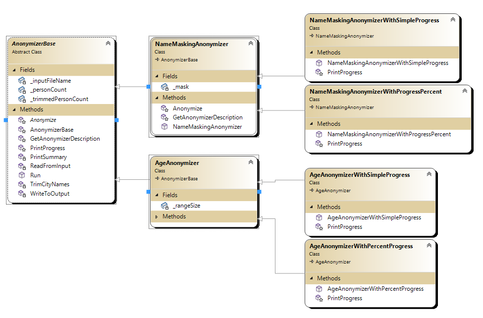

# 6. Tervezési minták (kiterjeszthetőség)

## A gyakorlat célja

A gyakorlat céljai (egy összetettebb, életszerű példa alapján):

- Kiterjeszthetőséget, újrafelhasználhatóságot, kód átláthatóságot és karbantarthatóságot segítő néhány tervezési alapelv gyakorlása: SRP, OPEN-CLOSED, DRY, KISS stb.
- Néhány, a kiterjeszthetőséghez leginkább kapcsolódó tervezési minta alkalmazása (Template Method, Strategy, Dependency Injection).
- Kiterjeszthetőséget és újrafelhasználhatóságot támogató további technikák (pl. delegate/lambda kifejezés) gyakorlása és kombinálása tervezési mintákkal.
- Kód refaktorálás gyakorlása.
- Egységteszt (unit test) fogalmának pontosítása, egységtesztelhető kód kialakítása.

Kapcsolódó előadások:

- Tervezési minták: kiterjeszthetőséghez kapcsolódó minták (bevezető, Template Method, Strategy), valamint a Dependency Injection "minta".

## Előfeltételek

A gyakorlat elvégzéséhez szükséges eszközök:

- Visual Studio 2022

!!! tip "Gyakorlat Linuxon vagy macOS alatt"
    A gyakorlat anyag alapvetően Windowsra és Visual Studiora készült, de az elvégezhető más operációs rendszereken is más fejlesztőeszközökkel (pl. VS Code, Rider, Visual Studio for Mac), vagy akár egy szövegszerkesztővel és CLI (parancssori) eszközökkel. Ezt az teszi lehetővé, hogy a példák egy egyszerű Console alkalmazás kontextusában kerülnek ismertetésre (nincsenek Windows specifikus elemek), a .NET 8 SDK pedig támogatott Linuxon és macOS alatt. [Hello World Linuxon](https://learn.microsoft.com/en-us/dotnet/core/tutorials/with-visual-studio-code).

### Elméleti háttér, szemléletmód *

A komplexebb alkalmazások fejlesztése során számos tervezői döntést kell meghoznunk, melyek során több lehetőség közül is választhatunk. Amennyiben ezen pontokban nem tartjuk szem előtt az alkalmazásunk könnyű karbantarthatóságát, illetve egyszerűen megvalósítható továbbfejlesztési lehetőségét, könnyen hamar rémálommá válhat a fejlesztés. A megrendelői változtatási és bővítési igények a kód nagymértékű folyamatos átírását/módosítását igénylik: ennek során új hibák születnek, illetve jelentős munkát kell fektetni a kód nagy léptékű újratesztelésébe is!

Ehelyett a célunk az, hogy az ilyen változtatási és bővítési igényeket a kód pár jól meghatározott pontjában történő bővítésével - a meglévő kód érdemi módosítása nélkül - meg tudjuk valósítani. A kulcsszó: **módosítással** szemben **bővítés**. Ehhez kapcsolódóan: amennyiben bizonyos logikáink kiterjeszthetők, így általánosabbak is leszek, könnyebben, több kontextusban is fel tudjuk ezeket használni. Így hosszabb távon gyorsabban haladunk, rövidebb a kód, elkerüljük a kódduplikációt (ezáltal könnyebben karbantartható is a kód).

A **tervezési minták** jól bevált megoldásokat mutatnak bizonyos gyakran előforduló tervezési problémákra: ezen megoldások abban segítenek, hogy kódunk könnyebben bővíthető, karbantartható és minél nagyobb mértékben újrafelhasználható legyen. Jelen gyakorlat keretében azon mintákra, tervezési elvekre és néhány programozói eszközre fókuszálunk, melyek a fenti problémákon segítenek.
Ugyanakkor ne essünk át a ló túloldalára: csak akkor érdemes egy adott tervezési mintát bevetni, ha adott esetben valós előnyt jelent az alkalmazása. Ellenkező esetben csak a megvalósítás komplexitását növeli feleslegesen.
Ennek tükrében nem is célunk (és sokszor nincs is rá lehetőségünk), hogy minden jövőbeli kiterjeszthetőségi igény előre megérezzünk, illetve nagyon előre átgondoljunk. A lényeg az, hogy akár egy egyszerű megoldásból kiindulva, az egyes problémákat felismerve, a kódunkat folyamatosan refaktoráljuk úgy, hogy az aktuális (funkcionális és nemfunkcionális) követelményeknek és előrelátásunknak szerint a megfelelő pontokban tegyük kódunkat könnyebben kiterjeszthetővé és újrafelhasználhatóvá.

Zárásképpen megvizsgáljuk, hogyan segítenek bizonyos tervezési minták és nyelvi eszközök a kódunk **egységtesztelhetővé** tételében: sok cégnél egy szoftvertermék fejlesztése esetén (jogos) alapelvárás a fejlesztőktől, hogy nagy kódlefedettségű egységteszteket (unit test) készítsenek. Ennek kivitelezése viszont gyakorlatilag lehetetlen, ha a kódunk egyes egységei/osztályai túl szoros csatolásban vannak egymással.

## 0. Feladat - Ismerkedés a feladattal és a kiinduló alkalmazással

Klónozzuk le a 6. gyakorlathoz tartozó kiinduló alkalmazás [repositoryját](https://github.com/bmeviauab00/lab-designpatterns-kiindulo):

- Nyissunk egy command prompt-ot
- Navigáljunk el egy tetszőleges mappába, például c:\work\NEPTUN
- Adjuk ki a következő parancsot: `git clone https://github.com/bmeviauab00/lab-designpatterns-kiindulo.git`
- Nyissuk meg a _Lab-Extensibility.sln_ solutiont Visual Studio-ban.

### A feladat ismertetése

A gyakorlat során egy konzol alapú, adatfeldolgozó (pontosabban anonimizáló) alkalmazást fogunk a folyamatosan alakuló igényeknek megfelelően - különböző pontok mentén és különböző technikákat alkalmazva - kiterjeszthetővé tenni. Az első feladat keretében az anonimizálás fogalmával is megismerkedünk.

Az alkalmazás bemenete egy CSV szövegfájl, mely minden sora egy adott személyre vonatkozóan tartalmaz adatokat. A fájlrendszerben nyissuk meg a *Data* mappában levő us-500.csv fájlt (duplakattal, vagy akár a Jegyzettömb/Notepad alkalmazásban). Az látjuk, hogy "" között, vesszővel elválasztva találhatók az egyes személyekre vonatkozó adatok (ezek nem valósak). Nézzük az első sort:
  
```
"James","Butt","Benton, John B Jr","6649 N Blue Gum St","New Orleans ","Orleans","LA","70116","504-621-8927","504-845-1427","30","65","Heart-related","jbutt@gmail.com"
```

Az első sorban levő személyt James Buttnak nevezik, a "Benton, John B Jr" cégnél dolgozik, majd néhány címre vonatkozó mező található, 30 éves, 65 kg a testsúlya. Az ezt követő mező azt mondja meg, milyen súlyosabb betegsége van (a fenti sorba ez "Heart-related"). Az utolsó oszlop pedig a személy e-mail címét tartalmazza.

??? Note "Adatok forrása és pontos formátuma *"
    Az adatok forrása: https://www.briandunning.com/sample-data/, pár oszloppal (kor, súly, betegség) kiegészítve. A mezők sorrendje: First Name, Last Name, Company, Address, City, County (where applicable), State/Province (where applicable), ZIP/Postal Code, Phone 1, Phone 2, Age, Weight, Illness, Email

Az alkalmazás alapfeladata, hogy ezeket az adatokat az aktuális igényeknek megfelelően anonimizálja, majd egy kimeneti CSV szövegfájlba kiírja. Az anonimizálás feladata, hogy az adatokat olyan formába alakítsa, hogy agy adathalmazban levő személyeket beazonosíthatatlanná tegye, de olyan módon, hogy az adatokból mégis lehessen kimutatásokat készíteni. Az anonimizálás egy különálló, nagyon komoly, és sok kihívást rejtő adatfeldolgozási szakterület. A gyakorlat keretében nem célunk, hogy valós környezetben is használható, vagy akár minden tekintetben értelmes megoldásokat dolgozzunk ki. Számunkra tulajdonképpen csak egy valamilyen adatfeldolgozó algoritmus "bevetése" a fontos a minták bemutatásához, és ez talán kicsit "izgalmasabb" keretet ad, mint egy egyszerű adatszűrés/sorrendezés/stb. alapú adatfeldolgozás (melyeket ráadásul a .NET már eleve beépítve támogat).

!!! Note "Pár gondolat az anonimizálásról"

    Azt gondolhatnánk, hogy az anonimizálás egy egyszerű problémakör. Pl. csak el kell távolítani, vagy ki kell "csillagozni" a személyek neveit, lakcíméből az utca-házszámot, telefonszámokat, e-mail címet, és meg is vagyunk. Például a bemenetünk első sorára ez lenne a kimenet:

    ```
    "***","***","Benton, John B Jr","***","New Orleans ","Orleans","LA","70116","***","***","30","65","Heart-related","***"
    ```

    De ez koránt sincs így, különösen, ha igazán sok adatról van szó. Gondoljunk arra, hogy van egy kisebb falu, ahol nem laknak sokan. Tegyük fel, hogy az egyik fenti módon anonimizált személy életkora 14 év, de rendkívül túlsúlyos, 95 kg. Ez egy ritka "kombináció", más személy jó eséllyel nem él ilyen paraméterekkel a faluban. Ha az ő osztálytársai közül (nyolcadikos, hiszen 14 éves) valaki megnézi az "anonimizált" adatokat, tudni fogja ki ő (nincs más ennyire túlsúlyos nyolcadikos az iskolában), beazonosítja a személyt, és így pl. tudni fogja, milyen betegsége van. Tanulság: az adatok összefüggésben árulkodók lehetnek.
    
    Mi a megoldás? A várost, az életkort és a testtömeget nem törölhetjük/csillagozhatjuk, mert ezekre vonatkozóan kell kimutatást készíteni. Egy tipikus megoldás: nem pontos életkort/testsúlyt adunk meg az anonimizálást követően, hanem sávokat (vagyis általánosítjuk az adatokat): pl. a fenti személy esetében az életkora 10..20 év, testsúlya 80..100 kg, és ezt adjuk meg erre a személyre vonatkozóan a kimeneti fájlban. Így már nem lehet beazonosítani. Ezt a technikát mi is fogjuk később alkalmazni.

### Kiinduló követelmények

Az alkalmazással szemben támasztott kiinduló követelmények:

1. Egy adott ügyféltől kapott fájlokat (mindnek ugyanaz a formátuma) kell ugyanazzal az anonimizáló algoritmussal, ugyanabba a kimeneti formátumba konvertálni. Az anonimizálás egyszerűen a keresztnév és vezetéknév "kicsillagozásából" álljon.
2. Szükség van némi adattisztításra. A bemeneti adatokban a várost tartalmazó oszlop elején/végén lehetnek felesleges `_` és `#` karakterek, ezeket el kell távolítani (trim művelet).
3. Ki kell írni minden sor feldolgozása után a konzolra, hogy a sor feldolgozása megtörtént, ill. a minden adat feldolgozás után némi összesítő információt (Summary): hány sort dolgoztunk fel, és mennynél kellett a városnevet trimmelni.
4. **Lényeges szempont**: az alkalmazásra csak rövid időre lesz szükség, nem a kívánjuk későbbiekben bővíteni.

Megjegyzés: hogy a kódban kevesebb mezővel kelljen dolgozni, és a kimenet is átláthatóbb legyen, elhagyunk még néhány mezőt a feldolgozás során.

Példaként a bemeneti fájlunk első sorára a várt kimenet:

```
***; ***; LA; New Orleans; 30; 65; Heart-related
```

## 1. Megoldás - minden egyben (1-Start/Start)

A Visual Studio Solution Explorerében mappákat látunk, 1-től 6-ig számmal kezdve. Ezek az egyes munkaiterációkhoz tartozó megoldásokat tartalmazzák. Az első körös megoldás az "1-Start" mappában, "Start" projektnév alatt található. Nézzük meg a projektben található fájlokat:

* `Person.cs` - Egy személy számunkra érdekes adatai tartalmazza, ennek objektumaiba olvassuk be egy-egy személy adatait.
* `Program.cs` - Ennek Main függvényében van megvalósítva minden logika, kódmegjegyzésekkel "elválasztva". Amennyiben kicsit is bonyolultabbá válik a logika, már két nap mi is csak nehezen fogjuk áttekinteni és megérteni a saját kódunkat. Ezt a megoldást ne is nézzük.

Összegészében minden nagyon egyszerű. Összegészében nem gondolkodtunk rosszul, hiszen a kódnak nem jósolunk hosszú jövőt. De az egy függvénybe öntött "szkriptszerű", "minden egybe" megoldás ekkor sem jó irány, nagyon nehézzé teszi a kód átlátását, megértését. Ne is nézzük ezt tovább.

## 2. Megoldás (2-OrganizedToFunctions/OrganizedToFunctions-1)

Térjünk át Visual Studioban a "2-OrganizedToFunctions" mappában található "OrganizedToFunctions-1" projektben található megoldásra. Ez már sokkal szimpatikusabb, mert függvényekre bontottuk a logikát. Tekintsük át a kódot röviden:

`Anonymizer.cs`

  * A `Run` függvény a "gerince", ez tartalmazza a vezérlési logikát, ez hívja az egyes lépésekért felelős függvényeket.
  * `ReadFromInput` művelet: beolvassa a forrásfájlt, minden sorhoz készít egy `Person` objektumot, és visszatér a beolvasott `Person` objektumok listájával.
  * `TrimCityNames`: Az adattisztítást végzi (városnevek trimmelése).
  * `Anonymize`: Minden egyes beolvasott `Person` objektummal meghívásra kerül, és feladata, hogy visszaadjon egy új `Person` objektumot, mely már az anonimizált adatokat tartalmazza.
  * `WriteToOutput`: már anonimizált `Person` objektumokat kiírja a kimeneti fájlba.
  * `PrintSummary`: kiírja az összesítést a feldolgozás végén a konzolra.

`Program.cs`

  * Létrehoz egy `Anonymizer`-t és a `Run` hívásával futtatja. Látható, hogy az anonimizálás során maszkolásra használt stringet konstruktor paraméterben kell megadni.

Próbáljuk ki, futtassuk! Ehhez a "OrganizedToFunctions-1" legyen Visual Studioban a startup projekt (Jobb katt rajta, és *Set as Startup Project*), majd futtassuk:


A kimeneti fájt fájlkezelőben tudjuk megnézni, a "OrganizedToFunctions-1\bin\Debug\net8.0\" vagy hasonló nevű mappában találjuk, "us-500.processed.txt" néven. Nyissuk meg, és vessünk egy pillantást az adatokra.

### A megoldás értékelése

* A megoldás alapvetően jól strukturált, könnyen megérthető.
* Követi a **==KISS (Keep It Stupid Simple)==** elvet, nem használ felesleges bonyolításokat. Ez így jó, hiszen nem merültek fel potenciális jövőbeli továbbfejlesztési igények, nem kell különböző formátumokat, logikákat stb. támogatni.
* A megoldásunk nem követi az egyik legalapvetőbb és leghíresebb tervezési elvet, mely **==Single Responsibility Principle (röviden SRP)==** néven közismert. Ez (némi egyszerűsítéssel élve) azt várja el, hogy egy osztálynak egy felelőssége legyen (alapvetően egy dologgal foglalkozzon).
  
    * Kétségtelen, hogy az `Anonymizer` osztályunknak számos felelőssége van: bemenet feldolgozása, adattisztítás, anonimizálás, kimenet előállítása stb.
    * Ez a probléma nálunk azért nem feltűnő, illetve azért nem okoz gondot, mert mindegyik felelősség megvalósítása egyszerű, "belefért" egy-egy rövidebb függvénybe. De ha bármelyik is összetettebb lenne, több függvényben lennének megvalósítva, akkor mindenképpen külön osztályba illene szervezni.

    ??? Note "Miért probléma, ha egy osztálynak több felelőssége van? *"

        * Nehezebb megérteni a működését, mert nem egy dologra fókuszál.
        * Ha bármelyik felelősség mentén is jön be változási igény, egy nagy, sok mindennel foglalkozó osztályt kell változtatni és újra tesztelni.
  
* A megoldáshoz lehet írni automatizált integrációs (input-output) teszteket, de "igazi" egységteszteket nem. Arra  majd később térünk vissza, hogyan kell ezt értelmezni.

## 3. Megoldás (OrganizedToFunctions-2-TwoAlgorithms)

A korábbi "tervekkel" ellentétben új felhasználói igények merültek fel. Az ügyfelünk meggondolta magát, egy másik adathalmaznál másféle anonimizáló algoritmus megvalósítását kéri: a személyek életkorát kell sávosan menteni, nem derülhet ki a személyek pontos életkora. Az egyszerűség érdekében ez esetben a személyek nevét nem fogjuk anonimizálni, így tekintsük ezt egyfajta "pszeudo" anonimizálásnak (ettől még lehet értelme, csak nem teljesen korrekt ezt anonimizálásnak nevezni).

A megoldásunkat - mely egyaránt támogatja a régi és az új algoritmust (egyszerre csak az egyiket) - a VS solution *OrganizedToFunctions-2-TwoAlgorithms* nevű projektjében találjuk. Nézzünk rá az `Anonymizer` osztályra, a megoldás alapelve (ezeket tekintsük át a kódban):

* Bevezettünk egy `AnonymizerMode` enum típust, mely meghatározza, hogy melyik üzemmódban (algoritmussal) használjuk az `Anonymizer` osztályt.
* Az `Anonymizer` osztálynak két anonimizáló művelete van: `Anonymize_MaskName`, `Anonymize_AgeRange`
* Az `Anonymizer` osztály a `_anonymizerMode` tagjában tárolja, melyik algoritmust kell használni: a két üzemmódhoz két külön konstruktort vezettünk be, ezek állítják be az `_anonymizerMode` értékét.
* Az `Anonymizer` osztály több helyen is megvizsgálja (pl. `Run`, `GetAnonymizerDescription` műveletek), hogy mi az `_anonymizerMode` értéke, és ennek függvényében elágazik.
  * A `GetAnonymizerDescription`-ben azért kell ezt megtenni, mert ennek a műveletnek a feladata az anonimizáló algoritmusról egy egysoros leírás előállítása, melyet a feldolgozás végén a "summary"-ben megjelenít. Nézzünk rá a `PintSummary` kódjára, ez a művelet hívja.

### A megoldás értékelése

Összegészében megoldásunk kódminőség tekintetében a korábbinál rosszabb lett.
Korábban nem volt probléma, hogy anonimizáló algoritmusok tekintetében nem volt kiterjeszthető (hiszen nem volt rá igény), de ha már egyszer felmerült az igény új algoritmus bevezetésére, akkor hiba ebben a tekintetben nem kiterjeszthetővé tenni: ettől kezdve sokkal inkább számítunk arra, hogy újabb algoritmusokat kell bevezetni a jövőben.

Miért állítjuk azt, hogy a kódunk nem kiterjeszthető, amikor "csak" egy új enum értéket, és egy-egy plusz `if`/`switch` ágat kell a kód néhány pontjára bevezetni, amikor új algoritmust kell majd bevezetni?

<div class="grid cards" markdown>

- :warning: __Open/Closed principle__  
  *Kulcsfontosságú, hogy egy kódot (osztályt) akkor tekintünk kiterjeszthetőnek, ha annak **módosítása nélkül**, pusztán a kód **bővítésével** lehet új viselkedést (esetünkben új algoritmust) bevezetni. Vagyis esetünkben az `Anonymizer` kódjához nem szabadna hozzányúlni, ami egyértelműen nem teljesül. Ez a híres **Open/Closed principle/elv**: the class should be Open for Extension, Closed for Modification. A kód módosítása azért probléma, mert annak során jó eséllyel új bugokat vezetünk be, ill. a módosított kódot mindig újra kell tesztelni, ez pedig jelentős idő/költségráfordítási igényt jelenthet.*

</div>

Mi is a pontos cél, és hogyan értjük ezt el? Vannak olyan részek az osztályunkban, melyeket nem szeretnénk beégetni:

* Ezek nem adatok, hanem **==viselkedések (kód, logika)==**.
* Nem `if`/`switch` utasításokkal oldjuk meg: "kiterjesztési pontokat" vezetünk be, és valamilyen módon megoldjuk, hogy ezekben "tetszőleges" kód lefuthasson.
* Ezek változó/esetfüggő részek kódját **más osztályokba** tesszük (az osztályunk szempontjából "lecserélhető" módon)!

!!! Note
    Ne gondoljunk semmiféle varázslatra, a már ismert eszközöket fogjuk erre használni: öröklést absztrakt/virtuális függvényekkel, vagy interfészeket, vagy delegate-eket.

Keressük meg azokat a részeket, melyek esetfüggő, változó logikák, így nem jó beégetni az `Anonymizer` osztályba:

* Az egyik maga az anonimizálási logika: `Anonymize_MaskName`/`Anonymize_AgeRange`
* A másik a `GetAnonymizerDescription`

Ezeket kell leválasztani az osztályról, ezekben a pontokban kell kiterjeszthetővé tenni az osztályt. Az alábbi ábra illusztrálja a célt általánosságában *:

??? Note "Az általános megoldási elv illusztrálása"

    

A labor keretében három konkrét tervezési mintát, ill. technikát nézünk meg a fentiek megvalósítására:

* Template Method tervezési minta
* Strategy tervezési minta
* Delegate (opcionálisan Lambda kifejezéssel)

Valójában mind használtuk már a tanulmányaink során, de most mélyebben megismerkedünk velük, és átfogóbban be fogjuk gyakorolni ezek alkalmazását.

## 4. Megoldás (3-TemplateMethod/TemplateMethod-1)

Ebben a lépésben a **Template Method** tervezési minta alkalmazásával fogjuk a megoldásunkat a szükséges pontokban kiterjeszthetővé tenni.

!!! Note
    A minta neve "megtévesztő": semmi köze nincs a C++-ban tanult sablonmetódusokhoz!

??? info "Template Method alapú megoldás osztálydiagram"
    Az alábbi UML osztálydiagram illusztrálja a Template Method alapú megoldást, a lényegre fókuszálva:

    

A mintában a következő elvek mentén valósul meg a "változatlan" és "változó" részek különválasztása (érdemes a fenti osztálydiagram alapján - a példánkra vetítve - ezeket megérteni):

* A "közös/változatlan" részeket egy ősosztályba tesszük.
* Ebben a kiterjesztési pontokat absztrakt/virtuális függvények bevezetése jelenti, ezeket hívjuk a kiterjesztési pontokban.
* Ezek esetfüggő megvalósítása a leszármazott osztályokba kerül.

A jól ismert "trükk" a dologban az, hogy amikor az ős meghívja az absztrakt/virtuális függvényeket, akkor a leszármazottbéli, esetfüggő kód hívódik meg.

Alakítsuk át a korábbi `if`/`switch` alapú megoldást **Template Method** alapúra. Egy ősosztályt és két, algoritmusfüggő leszármazottat vezetünk be.

Alakítsuk át a kódunkat ennek megfelelően. A VS solution-ben a "3-TemplateMethod" mappában a "TemplateMethod-0-Begin" projekt tartalmazza a korábbi megoldásunk kódját (annak "másolatát"), ebben a projektben dolgozzunk:

1. Nevezzük át az `Anonymizer` osztályt `AnonymizerBase`-re (pl. az osztály nevére állva a forrásfájlban és ++f2++-t nyomva).
2. Vegyünk fel az projektbe egy `NameMaskingAnonymizer` és egy `AgeAnonymizer` osztályt (projekten jobb katt, *Add*/*Class*).
3. Származtassuk az `AnonymizerBase`-ből őket
4. Az `AnonymizerBase`-ből mozgassuk át a `NameMaskingAnonymizer`-be az ide tartozó részeket:
      1. A `_mask` tagváltozót.
      2. A `string inputFileName, string mask` paraméterezésű konstruktort, átnevezve `NameMaskingAnonymizer`-re,
         1. `_anonymizerMode = AnonymizerMode.Name;` sort törölve,
         2. a `this` konstruktorhívás helyett `base` konstruktorhívással.
5. Az `AnonymizerBase`-ből mozgassuk át az `AgeAnonymizer`-be az ide tartozó részeket:
   1. A `_rangeSize` tagváltozót.
   2. A `string inputFileName, string rangeSize` paraméterezésű konstruktort, átnevezve `AgeAnonymizer`-re,
      1. `_anonymizerMode = AnonymizerMode.Name;` sort törölve,
      2. a `this` konstruktorhívás helyett `base` konstruktorhívással.
6. Az `AnonymizerBase`-ben:
      1. Töröljük az `AnonymizerMode` enum típust.
      2. Töröljük a `_anonymizerMode` tagot.

Keressük meg azokat a részeket, melyek esetfüggő, változó logikák, így nem akarjuk beégetni az újrafelhasználhatónak szánt `AnonymizerBase` osztályba:

* Az egyik az `Anonymize_MaskName`/`Anonymize_AgeRange`,
* a másik a `GetAnonymizerDescription`.

A mintát követve ezekre az ősben absztrakt (vagy esetleg virtuális) függvényeket vezetünk be, és ezeket hívjuk, az esetfüggő implementációikat pedig a leszármazott osztályokba tesszük (override):

1. Tegyük az `AnonymizerBase` osztály absztrakttá (a `class` elé `abstract` kulcsszó)
2. Vezessünk be az `AnonymizerBase`-ben egy

    ``` csharp
    protected abstract Person Anonymize(Person person);
    ```

    műveletet.

3. Az `Anonymize_MaskName` műveletet mozgassuk át a `NameMaskingAnonymizer` osztályba, és alakítsuk át a szignatúráját úgy, hogy override-olja az ősbeli `Anonymize` absztrakt függvényt:

    ``` csharp
    protected override Person Anonymize(Person person)
    {
        return new Person(_mask, _mask, person.CompanyName,
            person.Address, person.City, person.State, person.Age, person.Weight, person.Decease);
    }
    ```

    A függvény törzsét csak annyiban kell átírni, hogy ne a megszüntetett `mask` paramétert, hanem a `_mask` tagváltozót használja.

4. Az előző lépéssel teljesen analóg módon az `Anonymize_AgeRange` műveletet mozgassuk át a `AgeAnonymizer` osztályba, és alakítsuk át a szignatúráját úgy, hogy override-olja az ősbeli `Anonymize` absztrakt függvényt:

    ``` csharp
    protected override Person Anonymize(Person person)
    {
        ...
    }
    ```

    A függvény törzsét csak annyiban kell átírni, hogy ne a megszüntetett `rangeSize` paramétert, hanem a `_rangeSize` tagváltozót használja.

5. A `AnonymizerBase` osztály `Run` függvényében az `if`/`else` kifejezésben található `Anonymize` hívásokat most már le tudjuk cserélni egy egyszerű absztrakt függvény hívásra:

    {--

    ``` csharp
    Person person;
    if (_anonymizerMode == AnonymizerMode.Name)
        person = Anonymize_MaskName(persons[i], _mask);
    else if (_anonymizerMode == AnonymizerMode.Age)
        person = Anonymize_AgeRange(persons[i], _rangeSize);
    else
        throw new NotSupportedException("The requested anonymization mode is not supported.");
    ```

    --}

    helyett:

    ``` csharp
    var person = Anonymize(persons[i]);
    ```

Az egyik kiterjesztési pontunkkal el is készültünk. De maradt még egy, a `GetAnonymizerDescription`, mely kezelése szintén esetfüggő. Ennek átalakítása nagyon hasonló az előző lépéssorozathoz. Idő hiányában ezt az átalakítást gyakorlaton nem tesszük meg (lehet otthoni gyakorló feladat), hanem a kész megoldásra ugrunk: ezt a "TemplateMethod-1" nevű projektben találjuk. Fussuk át a megoldás alapelemeit:

1. Az `AnonymizerBase`-ben a `GetAnonymizerDescription` nem absztrakt, hanem virtuális függvényként került bevezetésre, hiszen itt tudtunk értelmes alapértelmezett viselkedést biztosítani: egyszerűen visszaadjuk az osztály nevét (mely pl. a `NameMaskingAnonymizer` osztály esetében "NameMaskingAnonymizer"). Mindenesetre a rugalmatlan `switch` szerkezettől megszabadultunk.
2. A leszármazottakban felülírjuk ezt a virtuális függvényt, belefűzzük a leírásba az osztályspecifikus adatokat (pl.`NameMaskingAnonymizer` esetében a `_mask` értékét).

A "TemplateMethod-0-Begin" projektünk most nem forduló kódot tartalmaz, ezt célszerű eltávolítani a solution-ből, hogy a későbbi futtatások során ne legyen zavaró: jobb katt a projekten és `Remove` menü (ez fizikailag nem törli, csak kiveszi a solution-ből, később visszatehető).

El is készültünk. Ha sok időnk van, ki is próbálhatjuk, hogy jobban "érezzük", valóban működnek az kiterjesztési pontok (de ez különösebben nem fontos, hasonlót már korábbi félévekben C++/Java nyelvek kontextusában is csináltunk):

* Legyen a "TemplateMethod-1" projekt a startup projekt.
* Tegyünk egy töréspontot az `AnonymizerBase` osztály `var person = Anonymize(persons[i]);` sorára.
* Amikor futás közben itt megáll a debugger, ++f11++-gyel lépjünk bele.
* Az tapasztaljuk, hogy a  leszármazott `AgeAnonymizer` művelete hívódik.

Vethetünk egy pillantást a megoldás osztálydiagramjára:

??? "Template Method alapú megoldás osztálydiagram *"
    

??? "Miért Template Method a minta neve *"
    A minta azért kapta a Template Method nevet, mert - esetünket példaként használva - a `Run` és a `PrintSummary` olyan "sablon metódusok", melyek meghatároznak egy sablonszerű logikát, vázat, melyben bizonyos lépések nincsenek megkötve (ezek "kódját" absztrakt/virtuális függvényekre bízzuk, és a leszármazott osztályok határozzák meg a megvalósításukat).

### A megoldás értékelése

Ellenőrizzük a megoldást, megvalósítja-e a céljainkat:

* Az `AnonymizerBase` egy újrafelhasználható(bb) osztály lett.
* Ha új anonimizáló logikára van szükség a jövőben, csak származtatunk belőle. Ez nem módosítás, hanem bővítés.
* Ennek megfelelően teljesül az OPEN/CLOSED elv, vagyis a kódjának módosítása nélkül tudjuk az ősben megadott két pontban a logikát testre szabni, kiterjeszteni.

!!! Note "Legyen minden pontban kiterjeszthető az osztályunk?"
    Figyeljük meg, hogy nem tettünk az `AnonymizerBase` minden műveletét virtuálissá (így sok pontban kiterjeszthetővé az osztályt). Csak ott tettük meg, ahol azt gondoljuk, hogy a jövőben szükség lehet a logika kiterjesztésére.

## 5. Megoldás (3-TemplateMethod/TemplateMethod-2-Progress)

T.f.h új - viszonylag egyszerű - igény merül fel:

* A `NameMaskinAnonimizer` esetén marad ugyan a korábbi progress kijelzés (minden sor után kiírjuk, hányadiknál tartottunk),
* de az `AgeAnonymizer` esetén a progress kijelzés más kell legyen: azt kell kiírni - minden sor után frissítve -, hogy hány százaléknál tart a feldolgozás.

    ??? note "Százalékos progress illusztrálása"
        
        (Mivel jelenleg kevés az adat, ezt a megoldásunk végén nem így látjuk majd, pillanatok alatt 100%-ra ugrik)

A megoldás nagyon egyszerű: a `Run` műveletben szélesebb körben alkalmazva a Template Method mintát, a progress kiíráskor is egy kiterjesztési pontot vezetünk be, egy virtuális függvényre bízzuk a megvalósítást.

Ugorjunk egyből a kész megoldásra (*TemplateMethod-2-Progress* projekt):

* `AnonymizerBase` osztályban új `PrintProgress` virtuális függvény (alapértelmezésben nem ír ki semmit)
* `Run`-ban ennek hívása
* `NameMaskingAnonymizer`-ben és `NameMaskingAnonymizer`-ben megfelelő megvalósítás (override)
  
Ennek egyelőre különösebb tanulsága nincs, de a következő lépésben már lesz.

## 6. Megoldás (3-TemplateMethod/TemplateMethod-3-ProgressMultiple)

Új - és teljesen logikus - igény merült fel: a jövőben bármely anonimizáló algoritmust bármely progress megjelenítéssel lehessen használni. Ez jelen pillanatban négy keresztkombinációt jelent:

| Anonimizáló         | Progress          |
| ------------------- | ----------------- |
| Név anonimizáló     | Egyszerű progress |
| Név anonimizáló     | Százalék progress |
| Kor anonimizáló     | Egyszerű progress |
| Kor anonimizáló     | Százalék progress |

Ugorjunk a kész megoldásra (TemplateMethod-3-ProgressMultiple projekt). Kód helyett érdemes a `Main.cd` osztálydiagramot megnyitni, és a megoldást az alapján áttekinteni.

??? "Template Method alapú megoldás (két aspektus) osztálydiagram"
    

Érezhető, hogy valami "baj van", minden keresztkombinációnak külön leszármazottat kellett létrehozni. Sőt, a kódduplikáció csökkentésére még plusz, köztes osztályok is vannak a hierarchiában. Ráadásul:

* Ha a jövőben új anonimizáló algoritmust vezetünk be, annyi új osztályt kell írni (legalább), ahány progress típust támogatunk.
* Ha a jövőben új progress típust vezetünk be, annyi új osztályt kell írni (legalább), ahány anonimizáló típust támogatunk.

Mi okozta a problémát? Az, hogy **az osztályunk viselkedését több aspektus/dimenzió mentén (példánkban az anonimizálás és progress) kell kiterjeszthetővé tenni, és ezeket sok keresztkombinációban kell támogatni**. Ha újabb aspektusok mentén kellene ezt megtenni (pl. beolvasás módja, kimenet generálása), akkor a probléma exponenciálisan tovább "robbanna". Ilyen esetekben a Template Method tervezési minta nem alkalmazható.

## 7. Megoldás (4-Strategy/Strategy-1)

Ebben a lépésben a **Strategy** tervezési minta alkalmazásával fogjuk a kezdeti megoldásunkat a szükséges pontokban kiterjeszthetővé tenni. A mintában a következő elvek mentén valósul meg a "változatlan/újrafelhasználható" és "változó" részek különválasztása:

* A "közös/változatlan" részeket egy adott osztályba tesszük (de ez most nem egy "ősosztály" lesz).
* A Template Methoddal szemben nem öröklést, hanem kompozíciót (tartalmazást) alkalmazunk: interfészként tartalmazott más objektumokra bízzuk a viselkedés megvalósítását a kiterjesztési pontokban (és nem absztrakt/virtuális függvényekre).
* Mindezt az osztály viselkedésének minden olyan aspektusára/dimenziójára, melyet lecserélhetővé/bővíthetővé szeretnénk tenni, egymástól függetlenül megtesszük. Ezzel az előző fejezetben tapasztalt kombinatorikus robbanás elkerülhető.

Ez sokkal egyszerűbb a gyakorlatban, mint amilyennel leírva érződik (már használtuk is párszor korábbi tanulmányaink során), értsük meg a példánkra vetítve.

A következőkben tekintsük át a Strategy alapú megoldást illusztráló osztálydiagramot, a diagramot követő magyarázatra építve.

??? info "Strategy alapú megoldás osztálydiagram"
    Az alábbi UML osztálydiagram illusztrálja a Strategy alapú megoldást, a lényegre fókuszálva:

    

A Strategy minta alkalmazásának első lépése, hogy meghatározzuk, **az osztály viselkedésének hány különböző aspektusa van**, melyet kiterjeszthetővé szeretnénk tenni. A példánkban ebből - egyelőre legalábbis - kettő van:

* Anonimizáláshoz kötődő viselkedés, melyhez két művelet tartozik:
    * Anonimizáló logika
    * Anonimizáló logika leírásának meghatározása (description)
* Progress kezelés, melyhez egy művelet tartozik:
    * Progress megjelenítése

A nehezével meg is vagyunk, ettől kezdve alapvetően mechanikusan lehet dolgozni a Strategy mintát követve:

1. A fenti aspektusok mindegyikéhez egy-egy strategy interfészt kell bevezetni, a fent meghatározott műveletekkel, és ezekhez el kell készíteni a megfelelő implementációkat.
2. Az Anonymizer osztályba be kell vezetni egy-egy strategy interfész tagváltozót, és a kiterjesztési pontokban ezen tagváltozókon keresztül használni az aktuálisan beállított strategy implementációs objektumokat.

A fenti osztálydiagramon meg is jelennek ezek az elemek. Most térjünk át a kódra. Kiinduló környezetünk a "4-Strategy" mappában a "Strategy-0-Begin" projektben található, ebben dolgozzunk. Ez ugyanaz, az enum-ot használó megoldás, mint amelyet a Template Method minta esetében is kiindulásként használtunk. 

Az **anonimizálási stratégia/aspektus** kezelésével kezdünk: vezessük be az ehhez tartozó interfészt és implementációkat:

1. Hozzunk létre a projektben egy `AnonymizerAlgorithms` nevű mappát (jobb katt a "Strategy-0-Begin" projekten, majd *Add/New Folder* menü). A következő lépésekben minden interfészt és osztályt egy külön, a nevének megfelelő forrásfájlba tegyünk a szokásos módon!
2. Vegyünk fel ebben a mappában egy `IAnonymizerAlgorithm` interfészt az alábbi kóddal:

    ``` csharp title="IAnonymizerAlgorithm.cs"
    public interface IAnonymizerAlgorithm
    {
        Person Anonymize(Person person);
        string GetAnonymizerDescription() => GetType().Name;
    }
    ```

    Azt is megfigyelhetjük a `GetAnonymizerDescription` művelet esetében, hogy a modern C# nyelven, amennyiben akarunk, tudunk az egyes interfész műveleteknek alapértelmezett implementációt adni!

3. Vegyük fel ennek az interfésznek az név anonimizáláshoz tartozó megvalósítását ugyanebbe a mappába (csak másoljuk be az alábbi kódot és értelmezzük azt):

    ??? example "Megoldás"

        ``` csharp title="NameMaskingAnonymizerAlgorithm.cs"
        public class NameMaskingAnonymizerAlgorithm: IAnonymizerAlgorithm
        {
            private readonly string _mask;

            public NameMaskingAnonymizerAlgorithm(string mask)
            {
                _mask = mask;
            }

            public Person Anonymize(Person person)
            {
                return new Person(_mask, _mask, person.CompanyName,
                    person.Address, person.City, person.State, person.Age, person.Weight, person.Decease);
            }

            public string GetAnonymizerDescription()
            {
                return $"NameMasking anonymizer with mask {_mask}";
            }
        }
        ```

4. Vegyük fel ennek az interfésznek az életkor anonimizáláshoz tartozó megvalósítását ugyanebbe a mappába (csak másoljuk be az alábbi kódot és értelmezzük azt):

    ??? example "Megoldás"

        ``` csharp title="AgeAnonymizerAlgorithm.cs"
        public class AgeAnonymizerAlgorithm: IAnonymizerAlgorithm
        {
            private readonly int _rangeSize;

            public AgeAnonymizerAlgorithm(int rangeSize)
            {
                _rangeSize = rangeSize;
            }

            public Person Anonymize(Person person)
            {
                // This is whole number integer arithmetics, e.g for 55 / 20 we get 2
                int rangeIndex = int.Parse(person.Age) / _rangeSize;
                string newAge = $"{rangeIndex * _rangeSize}..{(rangeIndex + 1) * _rangeSize}";

                return new Person(person.FirstName, person.LastName, person.CompanyName,
                    person.Address, person.City, person.State, newAge,
                    person.Weight, person.Decease);
            }

            public string GetAnonymizerDescription()
            {
                return $"Age anonymizer with range size {_rangeSize}";
            }
        }
        ```

5. Fontos gondolat

    !!! warning
        Mindenképpen figyeljük meg, hogy az interfész és a megvalósításai kizárólag az anonimizálással foglalkoznak, semmiféle más logika (pl. progress kezelés) nincs itt!

**Második** lépésben vezessük be a **progress kezeléshez** tartozó interfészt és implementációkat:

1. Hozzunk létre a projektben egy `Progresses` nevű mappát. A következő lépésekben minden interfészt és osztály egy külön, a nevének megfelelő forrásfájlba tegyünk a szokásos módon.
2. Vegyünk fel ebben a mappában egy `IProgress` interfészt az alábbi kóddal:

    ??? example "Megoldás"
        ``` csharp title="IProgress.cs"
        public interface IProgress
        {
            void Report(int count, int index);
        }
        ```

3. Vegyük fel ennek az interfésznek az egyszerű progresshez tartozó megvalósítását ugyanebbe a mappába:

    ??? example "Megoldás"

        ``` csharp title="IProgress.cs"
        public class SimpleProgress: IProgress
        {
            public void Report(int count, int index)
            {
                Console.WriteLine($"{index + 1}. person processed");
            }
        }
        ```

4. Vegyük fel ennek az interfésznek az százalékos progresshez tartozó megvalósítását ugyanebbe a mappába:

    ??? example "Megoldás"

        ``` csharp title="IProgress.cs"
        public class PercentProgress: IProgress
        {
            public void Report(int count, int index)
            {
                int percentage = (int)((double)(index+1) / count * 100);

                var pos = Console.GetCursorPosition();
                Console.SetCursorPosition(0, pos.Top);

                Console.Write($"Processing: {percentage} %");

                if (index == count - 1)
                    Console.WriteLine();
            }
        }
        ```

5. Fontos gondolat

    !!! warning "Fontos"
        Mindenképpen figyeljük meg, hogy az interfész és a megvalósításai kizárólag a progress kezeléssel foglalkoznak, semmiféle más logika (pl. anonimizálás) nincs itt!

A következő fontos lépés az anonimizáló alaposztály újrafelhasználhatóvá és kiterjeszthetővé tétele a fent bevezetett strategy-k segítségével. Az `Anonymizer.cs` fájlban:

1. Töröljük a következőket:
      * `AnonymizerMode` enum típus
      * `_anonymizerMode`, `_mask` és `_rangeSize` tagok
2. Vezessünk be egy-egy strategy interfész típusú tagot:

    ``` csharp
    private readonly IProgress _progress;
    private readonly IAnonymizerAlgorithm _anonymizerAlgorithm;
    ```

3. A fájl elejére szúrjunk be a megfelelő usingokat:

    ``` csharp
    using Lab_Extensibility.AnonymizerAlgorithms;
    using Lab_Extensibility.Progresses;
    ```

4. Az előző pontban bevezetett `_progress` és `_anonymizerAlgorithm` kezdőértéke null, a konstruktorban állítsuk ezeket a referenciákat az igényeinknek megfelelő implementációra. Pl.:

    ``` csharp hl_lines="3-4 9-10"
    public Anonymizer(string inputFileName, string mask) : this(inputFileName)
    {
        _progress = new PercentProgress();
        _anonymizerAlgorithm = new NameMaskingAnonymizerAlgorithm(mask);
    }

    public Anonymizer(string inputFileName, int rangeSize) : this(inputFileName)
    {
        _progress = new PercentProgress();
        _anonymizerAlgorithm = new AgeAnonymizerAlgorithm(rangeSize);
    }
    ```

Az `Anonymizer` osztályban a jelenleg beégetett, de **anonimizálás függő** logikákat bízzuk a `_anonymizerAlgorithm` tagváltozó által hivatkozott strategy implementációra:

1. Az osztály `Run` függvényében az `if`/`else` kifejezésben található `Anonymize` hívásokat most már le delegáljuk a `_anonymizerAlgorithm` objektumnak:

    {--

    ``` csharp
    Person person;
    if (_anonymizerMode == AnonymizerMode.Name)
        person = Anonymize_MaskName(persons[i], _mask);
    else if (_anonymizerMode == AnonymizerMode.Age)
        person = Anonymize_AgeRange(persons[i], _rangeSize);
    else
        throw new NotSupportedException("The requested anonymization mode is not supported.");
    ```

    --}

    helyett:

    ``` csharp
    Person person = _anonymizerAlgorithm.Anonymize(persons[i]);
    ```

2. Töröljük a `Anonymize_MaskName` és `Anonymize_AgeRange` függvényeket, hiszen ezek kódja már a strategy implementációkba került, az osztályról leválasztva.

4. A `PrintSummary` függvényünk a rugalmatlan, `switch` alapokon működő `GetAnonymizerDescription`-t hívja. Ezt a `GetAnonymizerDescription` hívást cseréljük le, delegáljuk a `_anonymizerAlgorithm` objektumnak. A `PrintSummary` függvényben (csak a lényeget kiemelve):

    ``` csharp
        ... GetAnonymizerDescription() ...
    ```

    helyett:

    ``` csharp
        ... _anonymizerAlgorithm.GetAnonymizerDescription() ...
    ```

    Pár sorral lejjebb a `GetAnonymizerDescription` függvényt töröljük is az osztályból (ennek kódja megfelelő strategy implementációkba bekült).

Az utolsó lépés az `Anonymizer` osztályba beégetett **progress kezelés** lecserélése:

1. Itt is delegáljuk a kérést, mégpedig a korábban bevezetett `_progress` objektumunknak. A `Run` függvényben egy sort kell ehhez lecserélni:

    {--

    ``` csharp
    PrintProgress(i);
    ```

    --}

    helyett:

    ``` csharp
    _progress.Report(persons.Count, i);
    ```

2. Töröljük a `PrintProgress` függvényt, hiszen ennek kódja már egy megfelelő strategy implementációba került, az osztályról leválasztva.

Elkészültünk, a kész megoldás a "Strategy-1" projektben meg is található (ha valahol elakadtunk, vagy nem fordul a kód, ezzel össze lehet nézni).

### A megoldás értékelése

A strategy minta bevezetésével elkészültünk. Jelen formájában ugyanakkor szinte soha nem használjuk. Ellenőrizzük a megoldásunkat: valóban újrafelhasználható, és az `Anomymizer` osztály módosítása nélkül lehetőség van-e az anonimizáló algoritmus, illetve a progress kezelés megváltoztatására? Ehhez azt kell megnézni, bárhol az osztályban van-e olyan kód, mely implementáció függő.

Sajnos találunk ilyet. A konstruktorba be van égetve, milyen algoritmus implementációt és progress implementációt hozunk létre. Ezt mindenképpen nézzük meg a kódban! Ha algoritmus vagy progress módot akarunk változtatni, ezekben a sorokban át kell írni a `new` operátor utáni típust, mely így az osztály módosításával jár.

Sokan - teljesen jogosan - ezt jelen formájában nem is tekintik igazi Strategy alapú megoldásnak. A teljes körű megoldást a következő lépésben valósítjuk meg.

## 8. Megoldás (4-Strategy/Strategy-2-DI)

A megoldást a **Dependency Injection (röviden DI)** alkalmazása jelenti. Ennek lényege az, hogy nem maga az osztály példányosítja a viselkedésbeli függőségeit (ezek a strategy implementációk), hanem ezeket kívülről adjuk át neki, pl. konstruktor paraméterekben, vagy akár property-k vagy setter műveletek formájában. Természetesen interfész típusként hivatkozva!

A kész megoldást nézzük meg, ez a "Strategy-2-DI" projektben található. Csak az `Anonymizer` osztály konstruktorát kell nézni. Azt látjuk, hogy a fenti elveknek megfelelően át lett alakítva.

Megjegyzés: azt egyelőre ne akarjuk megérteni, mi az újonnan felbukkanó `NullProgress` a konstruktorban (ez a DI szempontjából irreleváns, rövidesen visszatérünk rá).

Most már elkészültünk, az `Anonymizer` osztály teljesen független lett az implementációktól. Lehetőségünk van az `Anonymizer` osztály bármilyen anonimizáló algoritmus és bármilyen progress kezelés  (annak módosítása nélkül). Erre vannak is példák a `Program.cs` fájlban, nézzük ezt meg! Itt négy `Anonymizer` objektumot hozunk létre, négy különböző anonimizáló és progress kombinációval.

!!! Note "A működés ellenőrzése"
    A gyakorlat során erre valószínűleg nem lesz idő, de aki bizonytalan abban, "mitől is működik" a strategy minta, mitől lesz más a viselkedés a fenti négy esetre: érdemes töréspontokat tenni a `Program.cs` fájlban a négy `Run` függvényhívásra, és a függvényekbe a debuggerben belelépkedve kipróbálni, hogy mindig a megfelelő strategy implementáció hívódik meg.

A projektben található egy osztálydiagram (`Main.cd`), ezen is megtekinthető a kész megoldás:

??? note "Strategy alapú megoldás osztálydiagram"
    Az alábbi UML osztálydiagram illusztrálja a Strategy alapú megoldásunkat:

    

### Null strategy (kitérő)

Az `Anonymizer` konstruktorában látunk egy elsőre talán kicsit fura részletet. Ha a hívó null-t ad meg `IProgress` strategy-ként paraméterben, akkor a `_progress` tagváltozóba nem `null`-t mentünk, hanem egy `NullProgress` objektumra állítjuk. A `NullProgress` is egy teljes értékű `IProgress` implementáció, csak éppen nem csinál semmit (üres a törzse). Ezzel a megoldással azt érjük el, hogy nem kell az osztályban a `_progress` minden használatakor megvizsgálni, hogy null-e (ha elfelejtenénk, akkor `NullReferenceException`-t kapnánk!), mert az mindig egy érvényes objektumra mutat. Egyszerűen, ha nincs szükség semmiféle progress kiírására, akkor `NullProgress`-t használunk stratégiaként, mely nem csinál semmit. Ez is egy tervezési minta, **Null Object** a neve.

### A megoldás értékelése

Ellenőrizzük a megoldást, megvalósítja-e a céljainkat:

* Az `Anonymizer` egy újrafelhasználható(bb) osztály lett.
* Ha új anonimizáló logikára van szükség a jövőben, csak egy új `IAnonymizerAlgorithm` implementációt kell bevezetni. Ez nem módosítás, hanem bővítés.
* Ha új progress logikára van szükség a jövőben, csak egy új `IProgress` implementációt kell bevezetni. Ez nem módosítás, hanem bővítés.
* A fenti két pontban teljesül az OPEN/CLOSED elv, vagyis az `Anonymizer` kódjának módosítása nélkül tudjuk a logikáját testre szabni, kiterjeszteni.
* Itt nem kell tartani a Template Methodnál tapasztalt kombinatorikus robbanástól: bármely `IAnonymizerAlgorithm` implementáció bármely `IProgress` implementációval kényelmesen használható, nem kell a kombinációkhoz új osztályokat bevezetni (ezt láttuk a `Program.cs` fájlban).

!!! Note "További Strategy előnyök a Template Methoddal szemben *"
    * Futás közben lecserélhető viselkedés is megvalósítható. Ha szükség lenne arra, hogy egy adott `Anonymizer` objektumra vonatkozóan a létrehozása után meg tudjuk változtatni az anonimizáló vagy progress viselkedést, akkor azt könnyen meg tudnánk tenni (csak egy `SetAnonimizerAlgorithm`, ill. `SetProgress` műveletet kellene bevezetni, melyben a paraméterben megkapott implementációra lehetne állítani az osztály által használt strategy-t).
    * Egységtesztelhetőség támogatása (még visszatérünk erre).

## 9. Megoldás (5-StrategyFull-UnitTesting/StrategyFull-1)

Vegyük észre, hogy az `Anonimyzer` osztály működésének van még számos aspektusa, melyeket valamelyik megoldásunkkal kiterjeszthetővé lehetne tenni. Többek között ilyen a:

* **Bemenet** kezelése: Most csak fájl alapú, adott CSV formátumot támogatunk.
* **Kimenet** kezelése: Most csak fájl alapú, adott CSV formátumot támogatunk.

Ezeket az SRP elve miatt illene az osztályról leválasztani, de nem feltételen kiterjeszthető módon, hiszen nem merült fel igény arra (és úgy látjuk, nem is lesz később sem), hogy a mostanitól eltérő logikákat alkalmazzunk.

Ugyanakkor van még egy kritikus szempont, melyről nem beszéltünk (és a régebbi, klasszikus design pattern irodalmak sem feltétlen emlegetik). Ez az egységtesztelhetőség.

Jelen pillanatban az `Anonymizer` osztályunkhoz automata **integrációs teszteket** tudunk írni, automata **egységteszteket** nem:

* Az integrációs tesztek a teljes működést egyben vizsgálják: ebben benne van a bemenet feldolgozása, adatfeldolgozás, kimenet előállítása. Ez példánkban egyszerű: elállítunk bizonyos bemeneti CVS állományokat, és megnézzük, a várt kimeneti állomány állítódik-e elő.
* Az integrációs tesztek nagyon lassúak tudnak lenni: sokszor fájlokból, adatbázisokból, felhő alapú szolgáltatásokból veszik a bemenetet, illetve ezek szolgálnak kimenetként. Egy nagyobb termék esetében - mikor sok ezer teszt van - ez a lassúság korlátozó tényező, ritkábban tudjuk futtatni és/vagy nem tudunk jó tesztlefedettséget elérni.

A fentiek miatt nagyobb kódlefedettséget nagyon gyorsan futó **egységtesztekkel** szoktunk/tudunk elérni. Ezek mindenféle **lassú fájl/adatbázis/hálózat/felhő elérés nélkül önmagában egy egy logikai egységet tesztelnek a kódban**, ezt viszont így már villámgyorsan, így sokat tudunk futtatni adott idő alatt, jó tesztlefedettséggel.

!!! note "Tesztpiramis *"
    Ezt egy tesztpiramissal szokás szemléltetni, melynek több formája terjedt el az irodalomban, egy egyszerű variáns a következő:
    
    

    Minél fentebb vagyunk a piramis rétegeiben, annál átfogóbbak ugyan a tesztek, de annál lassabbak és költségesebben is futtathatók. Így ezekből általában kevesebbet is készítünk (ezáltal kisebb kódlefedettséget is érünk el velük).

Nézzük meg az `Anonymizer` osztályt: ebbe be van égetve, hogy csak a lassú, fájl alapú bemenettel tud dolgozni. De amikor mi pl. a `Run` művelet logikáját szeretnénk egységtesztelni, teljesen mindegy, hogy fájlból jönnek-e az adatok (lassan), vagy egyszerűen kódból a `new` operátorral előállítunk néhány `Person` objektumot (több nagyságrenddel gyorsabban).

A megoldás - a kódunk egységtesztelhetővé tételéhez - egyszerű:

<div class="grid cards" markdown>

- :warning:
  *A Strategy minta (vagy delegate-ek) alkalmazással válasszuk le az egységtesztelni kívánt osztályról a tesztelést akadályozó vagy lassító (pl. bemenet/kimenet kezelés) logikákat. Ezeknek készítünk a valódi logikát megvalósító implementációit, illetve tesztelést segítő, ún. mock implementációit.*
</div>

<div class="grid cards" markdown>

- :warning:
  *Ennek megfelelően a Strategy mintát sokszor nem azért használjuk, mert az ügyféligények miatt többféle viselkedést kell benevezni, hanem azért, hogy a kódunk egységtesztelhető legyen.*

</div>

Ennek megfelelően elkészítjük a megoldásunk egységtesztelésre is előkészített változatát, melyben a bemenet és kimenet kezelése is le van választva a Strategy minta alkalmazásával.

Egyből a kész megoldást nézzük ("StrategyFull-1"), hiszen itt semmi újat nem tanulunk, egyszerűen csak alkalmazzuk a Strategy mintát két aspektus mentén:

* `InputReaders` mappa: bemenet feldolgozó strategy interfész, és a korábbi logika kiszervezve egy implementációba.
* `ResultWriters` mappa: kimenet előállító strategy interfész, és a korábbi logika kiszervezve egy implementációba.
* `Anonymizer` osztály:
    * Új `_inputReader` és `_resultWriter` tagok, valamint ezek inicializálása a konstruktorban.
    * Run függvényben `_inputReader` és `_resultWriter` használata.

Az `Anonymizer` osztályunk átláthatóbb is lett: jobban követi az SRP elvet, két felelősségi kör kiszervezésre került belőle.

??? note "Megoldás osztálydiagram"
    Az alábbi UML osztálydiagram illusztrálja a Strategy alapú megoldásunkat (Main.cd diagram a projektben):

    

A következő lépés egységtesztek készítése az `Anonymizer` osztályhoz. Ehhez olyan mock strategy implementációkat kell bevezetni, melyek nemcsak tesztadatokat szolgáltatnak, hanem ellenőrzéseket is végeznek (adott logikai egység valóban jól működik-e). Ez most bonyolultnak hangzik, de szerencsére a legtöbb modern keretrendszerben van rá könyvtár támogatás (.NET-ben a [moq](https://github.com/devlooped/moq)). Ennek alkalmazása túlmutat a tárgy keretein, így a feladatunk egységtesztelhetőséghez kapcsolódó vonulatát ebben a pontban lezárjuk.

## 10. Megoldás (6-DelegatesAndLambdas/DelegatesAndLambdas-1-Progress)

Napjainkban rohamosan terjed a korábban szigorúan objektumorientált nyelvekben is a funkcionális programozást támogató eszközök megjelenése, és az alkalmazásfejlesztők is egyre nagyobb szeretettel alkalmazzák ezeket. Egy ilyen eszköz C# nyelven a delegate (és ehhez kapcsolódóan a lambda kifejezés).

Mint a félév során korábban láttuk, delegate-ek segítségével olyan kódot tudunk írni, melybe bizonyos logikák/viselkedések nincsenek beégetve, ezeket "kívülről" kap meg a kód. Pl. egy sorrendező függvénynek delegate formájában adjuk át paraméterként, hogyan kell két elemet összehasonlítani, vagy mely mezője/tulajdonsága szerint kell az összehasonlítást elvégezni (így végső soron meghatározni a kívánt sorrendet).

Ennek megfelelően a delegate-ek alkalmazása egy újabb alternatíva (a Template Method és a Strategy mellett) a kód újrafelhasználhatóvá/kiterjeszthetővé tételére, kiterjesztési pontok bevezetésére.

A következő lépésben a korábban Strategy mintával megvalósított progress kezelést alakítjuk át delegate alapúra (új funkciót nem vezetünk be, ez egy plusztán "technikai" átalakítás lesz).

<div class="grid cards" markdown>

- :warning: __A megoldás alapelve__  
  *A delegate alapú megoldás alapelve nagyon hasonlít a Strategy-hez: csak nem strategy-ket kap és tárol az osztály tagváltozókban (interfész hivatkozásokon keresztül), hanem delegate-eket, és az ezek által hivatkozott függvényeket hívja a kiterjesztési pontokban.*
</div>

A "6-DelegatesAndLambdas" mappa "DelegatesAndLambdas-0-Begin" projektjéből indulunk ki. Ez a korábbi, négy aspektus mentén Strategy mintával már kiterjeszthetővé tett megoldás. Lépések:

1. Az `IProgress` interfészt, pontosabban annak `Report` műveletét váltjuk ki delegate használattal. Ne vezessünk be saját delegate típust, használjuk a .NET által biztosított `Action` és `Func` (generikus) típusokat. A `Report` `void`-dal tér vissza, és két `int` paramétere van: ez egy `Action<int, int>` típussal váltható ki, ezt fogjuk az alábbiakban használni.
2. Az `Anonymizer` osztályban a strategy tag lecserélése delegate-re:

    {--

    ``` csharp
    private readonly IProgress _progress;
    ```

    --}

    helyett:

    ``` csharp
    private readonly Action<int, int> _reportProgress;
    ```

3. Az `Anonymizer` osztályban a konstruktorban a strategy interfész lecserélése delegate-re:

    ``` csharp
    public Anonymizer(..., Action<int, int> reportProgress)
    {
        ...
        // If reportProgress is null, use a lambda function that does nothing (has an empty body)
        _reportProgress = reportProgress ?? (( _,  _) => { });
        ...
    }
    ```

    Itt egy picit "trükköztünk" is (de ez az "alapok" tekintetében lényegtelen): ha a függvény null action-t kap, akkor a `_reportProgress` tagváltozót egy üres törzsű (semmit nem csináló) függvényre állítjuk egy lambda kifejezéssel, hogy a `_reportProgress` soha ne legyen `null`, ne kelljen `null` vizsgálatot végezni a használatakor.

    Azt pedig szabadon eldönthetjük, adunk-e `null` alapértelmezett értéket a `reportProgress` paraméternek (a fenti példában nem adtunk).

4. A Run műveletben a strategy lecserélése delegate hívásra:

    {--

    ``` csharp
    _progress.Report(persons.Count,i);
    ```

    --}

    helyett:

    ``` csharp
    _reportProgress(persons.Count,i);
    ```

5. A `Program.cs`-ben az `Anonymizer` példányosításakor negyedik paraméterben már nem egy `IProgress` implementációt kell átadni, hanem egy `Action<int, int>`-tel kompatibilis függvényt. A `SimpleProgress` esetében a `Report` egy egyszerű, egysoros függvény, adjuk ezt meg egy lambda kifejezés formájában:

    ``` csharp hl_lines="5"
        Anonymizer a1 = new(
        new CsvInputReader(inputFileName),
        new CsvResultWriter(outputFileName),
        new NameMaskingAnonymizerAlgorithm("***"),
        (count, index) => Console.WriteLine($"{index + 1}. person processed")
        a1.Run();
    ```

    A lambda törzse pontosan ugyanaz, mint a `SimpleProgress` esetében volt!

6. Mostantól nincs szükség a progress kezeléshez kapcsolódó strategy interfészre és implementációkra!
   
    * Töröljük az ezeket tartalmazó `Progresses` mappát a solutionből (jobb katt rajta a Solution Explorerben, majd `Delete` menü). Megjegyzés: Ezzel ugyan kitöröltük a százalék progress logikát is, erre még majd visszatérünk rövidesen.
    * Töröljük az `Anonymizer.cs`-ben a `using Lab_Extensibility.Progresses;` sort, hiszen ez a névtér a fenti törléssel megszűnt.
   
De általánosságában a helyzet nem ilyen egyszerű. Amennyiben az Anonymizer létrehozásakor a `reportProgress` delegate-nek mindig más és más implementációt adunk meg, akkor ez a lambda alapú megoldás tökéletes. Viszont mi a helyzet akkor, ha a fenti példában szereplő "simple progress" logikát több helyen, több `Anonymizer` objektumnál is fel szeretnénk használni? Súlyos hiba lenne a
`(count, index) => Console.WriteLine($"{index + 1}. person processed")`
lambda kifejezést copy-paste-tel "szaporítani", kódduplikációhoz vezetne (ellentmondana a Do Not Repeat Yourself, röviden DRY elvnek).

Kérdés: van-e megoldás arra, hogy delegate-ek esetében is újrafelhasználható kódot adjunk meg? Természetesen igen, hiszen delegate-ek esetében nem kötelező a lambda kifejezések használata, lehet velük közönséges műveletekre (akár statikus, akár nem statikusakra is), mint azt korábban a félév során láttuk, és számos esetben alkalmaztuk is.

Amennyiben a "simple progress" és/vagy "percent progress" logikát/logikákat újrafelhasználhatóvá szeretnénk tenni, tegyük ezeket egy külön függvényekbe valamilyen, az adott esetben leginkább passzoló osztályba/osztályokba, és egy ilyen  műveletet adjuk meg az `Anonymizer` konstruktornak paraméterként:

A következőkben ugorjuk az ennek megfelelően átalakított kész, "DelegatesAndLambdas-1-Progress" projektben található megoldásra:

* A "simple progress" és "percent progress" logikákat egy `AllProgresses` nevű statikus osztály két statikus műveletében valósítottuk meg:
  
    ??? example "AllProgresses.cs"
        ``` csharp
        public static class AllProgresses
        {
            public static void ReportPercent(int count, int index)
            {
                int percentage = (int)((double)(index+1) / count * 100);

                var pos = Console.GetCursorPosition();
                Console.SetCursorPosition(0, pos.Top);

                Console.Write($"Processing: {percentage} %");

                if (index == count - 1)
                    Console.WriteLine();
            }

            public static void ReportSimple(int count, int index)
            {
                Console.WriteLine($"{index + 1}. person processed");
            }
        }
        ```

* A `Program.cs` fájlban az `Anonymizer a2` objektum esetében az `AllProgresses.ReportPercent`-et adtuk meg paraméternek:
  
    ??? example "Program.cs"
        ``` csharp hl_lines="5"
        Anonymizer a2 = new(
            new CsvInputReader(inputFileName),
            new CsvResultWriter(outputFileName),
            new NameMaskingAnonymizerAlgorithm("***"),
            AllProgresses.ReportPercent);
        a2.Run();
        ```

### A megoldás érékelése

Elkészültünk, értékeljük a megoldást:

* Kijelenthető, hogy a delegate alapú megoldás a Strategy-nél kisebb ceremóniával járt: nem kellett interfészt és
implementációs osztályokat bevezetni (a beépített `Action` és `Func` generikus delegate típusokat tudtuk használni).
* A teljesen "eseti" logikát lambda kifejezés formájában legegyszerűbb megadni. Ha újrafelhasználható logikára van szükség, akkor viszont vezessünk be "hagyományos", újrafelhasználható függvényeket.
  
Hogy mikor érdemesebb delegate-ekkel dolgozni, illetve a Strategy mintával, alább, az útmutató végén a [Kiterjesztési technikák áttekintése](#kiterjesztesi-technikak-attekintese) fejezetben foglaljuk össze.

## Összegzés

### A munkafolyamatunk áttekintése

 * A változó igények során organikusan jelentek meg tervezési minták, és vetettünk be egyéb technikákat a refaktorálások során. Ez teljesen természetes, a gyakorlatban is sokszor így dolgozunk.
 * Egy komplexebb feladat esetében egyébként is sokszor - különösen ha nem rendelkezünk sokéves tapasztalattal - egy egyszerűbb implementációval indulunk (ezt látjuk át elsőre), és alakítjuk át olyanra, hogy az adott kontextusban kívánt kiterjeszthetőségi/újrafelhasználhatósági paraméterekkel rendelkezzen.

### Újrafelhasználhatósági és kiterjeszthetőség szintjei az egyes megoldásokban

Megpróbálhatjuk ábrába önteni, hogy vált a megoldásunk az egyes iterációkkal egyre inkább újrafelhasználhatóvá és kiterjeszthetővé:


Természetesen a % szinteket nem szabad túl komolyan venni. Mindenesetre a fejlődés jól megfigyelhető.

??? note "Miért "csak" 70%-os a végső megoldásnál mutatónk?"
    Felmerülhet a kérdés, miért adunk jelem megoldásra kb. 70%-ot? Többek között:

    * Az `Anonymizer` osztályba az adattisztítás módja mereven be van égetve (trimmelés adott oszlopra adott módon).
    * Nem követtünk egy nagyon fontos általános alapelvet: a UI és a logika különválasztását. A kódunk több pontban konzolra ír, így például egy grafikus felülettel nem használható!
    * Bizonyos az anonimizáló algoritmusaink nagyon specifikusak. Lehetne olyan általánosabb algoritmusokat készíteni, melyek tetszőleges mezőket kicsillagoznak (nem csak a nevet beégetetten), illetve tetszőleges mezőket sávosítanak (nem csak az életkort).
    * Jelen megoldás csak `Person` objektumokkal tud működni.
    * Nem lehet egyszerre alkalmazni kombinálni különböző anonimizáló algoritmusokat.

### Kiterjesztési technikák áttekintése

* **Template Method**: Egyszerű esetben, ha a viselkedések különböző aspektusainak nem kell sok keresztkombinációját támogatni, nagyon kényelmes és egyszerű megoldást ad, különösen, ha egyébként is kell használjuk a származtatást. De nem, vagy csak nehezen egységtesztelhető alaposztályt eredményez.
* **Strategy**: Nagyon rugalmas megoldást biztosít, és nem vezet kombinatorikus robbanáshoz, ha több aspektus mentén kell az osztályt kiterjeszteni, és több keresztkombinációban is szeretnénk ezeket használni. Sok esetben csak azért alkalmazzuk, hogy az osztályunkról interfészek segítségével leválasszuk a függőségeit, és így egységtesztelhetővé tegyük az osztályunkat.
* **Delegate/lambda**: Ez a megközelítés kisebb ceremóniával jár, mint a Strategy alkalmazása, ugyanis nincs szükség interfészek és implementációs osztályok bevezetésére, emiatt egyre inkább (rohamosan) terjed a használata a modern objektumorientált nyelvekben is. Különösen akkor jönnek ki az előnyei, ha a viselkedéseket nem akarjuk újrafelhasználhatóvá tenni (mert ekkor csak egy-egy lambda kifejezéssel megadjuk ezeket, mindenféle új osztályok/külön függvények bevezetése nélkül). 
  
Érdemes összeszedni, hogy a Strategy-nek mikor lehet/van van előnye a delegate-ekkel szemben:

* Ha kiterjesztendő osztály adott aspektusához több (minél több, annál inkább) művelet tartozik. Ilyenkor a strategy interfész ezeket "magától" szépen összefogja, csoportosítja (mint a példánkban az `IAnonymizerAlgorithm` interfész az `Anonymize` és `GetAnonymizerDescription` műveleteket). Ezek értelemszerűen az interfész implementációkban is együtt jelennek meg (delegate-ek esetében nincs ilyen csoportosítás). Ez átláthatóbbá teheti, sok művelet esetén egyértelműen azzá is teszi a megoldást.
* Az adott nyelv pusztán objektumorientált, nem támogatja a delegate/lambda alkalmazását. De ma már a legtöbb modern OO nyelv szerencsére támogatja valamilyen formában (Java és C++ is).
* A strategy implementációk a tagváltozóikban állapotot is tudnak tárolni, melyet létrehozásukkor meg tudunk adni. Ezt használtuk is (a `NameMaskingAnonymizerAlgorithm` esetében ilyen volt a `_mask`, a `AgeAnonymizerAlgorithm` esetében a `_rangeSize`). Ez nem azt jelenti, hogy ilyen esetben egyáltalán nem tudunk delegate-eket használni, hiszen:
    * ezeket az adatokat akár újonnan bevezetett függvény paraméterben is átadhatjuk az egyes delegate hívások során,
    * illetve, lambda használata esetén a "variable capture" mechanizmus segítségével a lambda függvények tudnak állapotot átvenni környezetükből.

    De ezek a megoldások nem mindig alkalmazhatók, vagy legalábbis körülményes lehet az alkalmazásuk.

Mindenképpen meg kell említeni, hogy nem csak jelen gyakorlatban említett néhány minta szolgálja a kiterjeszthetőséget és újrafelhasználhatóságot, hanem gyakorlatilag az összes. Most kiemeltünk párat, melyek (még p. az Observert/Iteratort/Adaptert ide sorolva) talán a leggyakrabban, legszélesebb körben alkalmazhatók és bukkannak is fel keretrendszerekben.