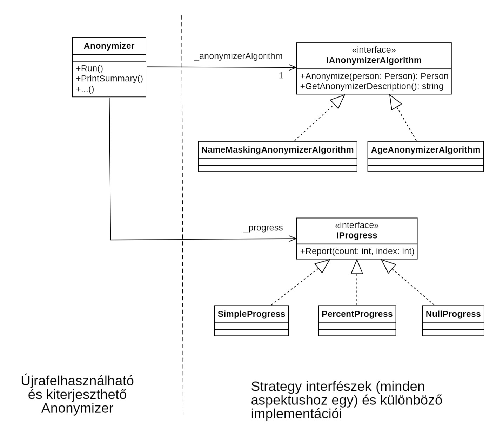

# 6. Design patterns (extensibility)

## The aim of the laboratory

The goals of this laboratory (based on a more complex, real-life example):

- Practicing some basic design principles that support extensibility, reusability, code clarity, and maintainability: SRP, OPEN-CLOSED, DRY, KISS, etc.
- Applying design patterns most closely related to extensibility (Template Method, Strategy, Dependency Injection).
- Practicing and combining additional techniques that support extensibility and reusability (e.g. delegate/lambda expressions) with design patterns.
- Practicing code refactoring.

Related lectures:

- Design patterns: patterns related to extensibility (introduction, Template Method, Strategy), as well as the “pattern” of Dependency Injection.

## Prerequisites

Tools required for completing the laboratory:

- Visual Studio 2022

!!! tip "Laboratory on Linux or macOS"
    The material for this laboratory is primarily intended for Windows and Visual Studio, but it can also be completed on other operating systems with different development tools (e.g., VS Code, Rider, Visual Studio for Mac), or even with a simple text editor and CLI tools. This is made possible by the fact that the examples are presented in the context of a simple Console application (no Windows-specific elements), and the .NET 8 SDK is supported on Linux and macOS. [Hello World on Linux](https://learn.microsoft.com/en-us/dotnet/core/tutorials/with-visual-studio-code).

### Theoretical background and approach *

When developing more complex applications, we face numerous design decisions where we must choose from various options. If we do not consider maintainability and extensibility during these decisions, development can quickly become a nightmare. Client requests for changes and enhancements often require large-scale code rewrites/modifications, which can introduce new bugs and require significant effort for retesting the codebase.

Our goal is to implement such change and extension requirements by extending the code at a few well-defined points — without significantly modifying existing code. The keyword is: **extension** instead of **modification**. Relatedly, if certain logic is extensible, it will also be more general, and can be reused more easily in multiple contexts. In the long run, this leads to faster progress, shorter code, and avoids code duplication (which also improves maintainability).

**Design patterns** provide proven solutions to common design problems: they help make our code more extensible, maintainable, and as reusable as possible. This laboratory focuses on those patterns, design principles, and programming tools that address the above issues. However, we should avoid overengineering: only apply a design pattern if it provides real benefits in a given case. Otherwise, it just adds unnecessary complexity. In this spirit, our goal is not (and often not even possible) to foresee every future extensibility need. The key is to start from a simple solution, recognize issues as they arise, and continuously refactor our code to meet current (functional and non-functional) requirements and improve extensibility and reusability where appropriate.

It’s also worth noting that related design patterns and language tools can greatly assist in making our code **unit testable**: in many companies, it's a (justified) basic expectation during software development that developers write unit tests with high code coverage. However, achieving this is practically impossible if the units/classes in our code are too tightly coupled.

## Task 0 – Getting familiar with the assignment and the starter application

Clone the starting application repository for Lab 6 from the following [repository](https://github.com/bmeviauab00/lab-patterns-extensibility-kiindulo):

- Open a command prompt
- Navigate to any folder, for example: `c:\work\NEPTUN`
- Run the following command: `git clone https://github.com/bmeviauab00/lab-patterns-extensibility-kiindulo.git`
- Open the _Lab-Patterns-Extensibility.sln_ solution in Visual Studio.

### Task description

During this lab, we will work on a console-based data processing (more precisely, anonymizing) application, making it extensible in different ways using various techniques, in response to continuously evolving requirements. As part of the first task, we’ll also get familiar with the concept of anonymization.

The input of the application is a CSV text file, where each line contains data related to a particular person. Open the *us-500.csv* file in the *Data* folder of the filesystem (double-click it or open with Notepad). You will see the data of individuals listed in quotes and separated by commas (note: these are not real individuals). Let’s look at the first line:
  
```
"James","Rhymes","Benton, John B Jr","6649 N Blue Gum St","New Orleans ","Orleans","LA","70116","504-621-8927","504-845-1427","30","65","Heart-related","jRhymes@gmail.com"
```

The first person in the data row is named James Rhymes and works at the company "Benton, John B Jr". The next few fields represent address-related data. He is 30 years old and weighs 65 kg. The following field describes a more serious illness (in this case, "Heart-related"). The last column contains the person's email address.

??? note "Source and exact format of the data *"
     The data source is: [https://www.briandunning.com/sample-data/](https://www.briandunning.com/sample-data/), with a few extra fields added (age, weight, illness). The field order is: First Name, Last Name, Company, Address, City, County (where applicable), State/Province (where applicable), ZIP/Postal Code, Phone 1, Phone 2, Age, Weight, Illness, Email.

The primary function of the application is to anonymize these records based on the current requirements and write the results to an output CSV text file. The goal of anonymization is to transform the data in such a way that individuals cannot be identified, while still allowing for meaningful reporting. Anonymization is a distinct, serious, and challenging area in data processing. In this lab, our goal is not to develop solutions that are usable in real-world environments or entirely meaningful. The main focus is on applying a data processing algorithm to demonstrate software design patterns. This provides a more engaging context than simple data filtering/sorting/etc., which .NET already supports natively.

!!! note "A few thoughts about anonymization"
    At first glance, anonymization might seem like a simple problem. For example, one might think it's enough to remove or mask people's names, street addresses, phone numbers, and email addresses. For example, for the first row of our input, the output might look like this:

    ```
    "***","***","Benton, John B Jr","***","New Orleans ","Orleans","LA","70116","***","***","30","65","Heart-related","***"
    ```

    But it’s not that simple, especially when dealing with large amounts of data. Imagine a small village where only a few people live. Suppose an anonymized person is 14 years old and weighs 95 kg. This is a rare ‘combination’, there is a good chance that no other person with these parameters lives in the village. If one of his classmates (an eighth grader, he is 14) looks at the ‘anonymised’ data, he will know who he is (there is no other eighth grader in the school who is that overweight), he will identify the person. So, for example, you he/she will know what illness the person has. Lesson: data can be revealing in context.

    So, what’s the solution? We can’t just remove or mask the city, age, or weight because we need them for reporting. A common approach is to generalize the data instead of showing exact values. For example, instead of showing an exact age or weight, we show a range (e.g., 10–20 years, 80–100 kg). This way, individuals cannot be identified. We will also use this technique later on.

### Initial requirements

The initial requirements for the application are:

1. Files received from a specific client (all with the same format) must be converted using the same anonymizing algorithm into the same output format. The anonymization should simply involve "masking" the first and last names.
2. Some data cleaning is needed. There may be unnecessary `_` and `#` characters at the beginning or end of the city field in the input data, and these should be removed (trim operation).
3. After processing each row, the application must print to the console that the row has been processed, and after processing all the data, some summary information should be displayed: how many rows were processed and how many required trimming of the city name.
4. **Key aspect**: The application will be used only for a short period and is not intended to be expanded later.

Note: In order to work with fewer fields in the code and to make the output clearer, a few fields will be omitted during processing.

For example, the expected output for the first row of our input file would be:

```
***; ***; LA; New Orleans; 30; 65; Heart-related
```

## Solution 1 - All-in-one (1-Start/Start)

In the Visual Studio Solution Explorer, we see folders named with numbers 1 through 4. These contain the solutions for each iteration of work. The first solution is located in the "1-Start" folder under the project name "Start". Let’s take a look at the files in the project:

* `Person.cs` - Contains the data of a person that is of interest to us. We read each person’s data into objects of this class.
* `Program.cs` - The main function is implemented here, with all the logic, "separated" by code comments. If the logic becomes more complicated, even after a few days (or hours), we might struggle to understand our own code. Let’s not focus on this solution.

Overall, the solution is very simple since we don’t foresee a long future for the code. However, the “script-like,” “all-in-one” solution that puts everything in one function is still not the best direction. It makes the code **hard to understand** and **difficult to follow**. Let’s not delve into this further.

## Solution 2 (2-OrganizedToFunctions/OrganizedToFunctions-1)

Let’s move on to the solution found in the "2-OrganizedToFunctions" folder, in the project "OrganizedToFunctions-1" in Visual Studio. This solution is much more appealing because we have split the logic into functions. Let’s review the code briefly:

`Anonymizer.cs`

  * The `Run` function is the "backbone" and contains the control logic. It calls the functions responsible for each step.
  * `ReadFromInput`: This function reads the source file, creates a `Person` object for each line, and returns a list of the read `Person` objects.
  * `TrimCityNames`: It performs data cleaning (trimming the city names).
  * `Anonymize`: It’s called for each `Person` object read and is responsible for returning a new `Person` object with anonymized data.
  * `WriteToOutput`: Writes the anonymized `Person` objects to the output file.
  * `PrintSummary`: Prints the summary of the process to the console at the end.

`Program.cs`

  * Creates an `Anonymizer` object and runs it with the `Run` function. Notice that the string used for masking in the anonymization process is provided as a constructor parameter.

Let’s try running it! Set "OrganizedToFunctions-1" as the startup project in Visual Studio (right-click and *Set as Startup Project*), then run it:


The output file can be found in the file manager in the "OrganizedToFunctions-1\bin\Debug\net8.0\" or a similarly named folder as "us-500.processed.txt". Open it and take a look at the data.

### Evaluation of the solution

* The solution is fundamentally well-structured and easy to understand.
* It follows the **==KISS (Keep It Stupid Simple)==** principle, avoiding unnecessary complications. This is good because there are no anticipated future development needs, and there is no need to support different formats, logic, etc.
* However, the solution does not follow one of the most fundamental and well-known design principles, namely the **==Single Responsibility Principle (SRP)==**. This principle expects that each class should have only one responsibility (it should focus on just one thing).
  
    * It’s clear that the `Anonymizer` class has multiple responsibilities: processing input, data cleaning, anonymization, producing output, etc.
    * This problem is not immediately noticeable and doesn’t cause any issues for us because each responsibility is simple and "fits" into a short function. But if any of these responsibilities became more complex, or were implemented in multiple functions, they should definitely be organized into separate classes.

    ??? note "Why is it problematic if a class has multiple responsibilities? *"

        * It becomes harder to understand its operation because it doesn’t focus on a single task.
        * If any responsibility needs to change, the large class handling multiple tasks must be modified and retested.

* Automated integration (input-output) tests can be written for the solution, but "real" unit tests are not feasible.

## Solution 3 (OrganizedToFunctions-2-TwoAlgorithms)

In contrast to the previous "plans", new user requirements have emerged. Our client changed his mind and now requests a different anonymization algorithm for a new data set: the ages of the individuals need to be stored in ranges, so the exact ages of the people should not be revealed. For simplicity, we will not anonymize the names in this case, considering it a "pseudo" anonymization (it can still make sense, but it’s not entirely accurate to call it anonymization).

Our solution, which supports both the old and the new algorithm (but only one at a time), can be found in the Visual Studio project *OrganizedToFunctions-2-TwoAlgorithms*. Let's take a look at the `Anonymizer` class, focusing on the design principles:

* We introduced an `AnonymizerMode` enum type to determine which mode (algorithm) we will use for the `Anonymizer` class.
* The `Anonymizer` class now has two anonymization operations: `Anonymize_MaskName` and `Anonymize_AgeRange`.
* The `Anonymizer` class stores the selected algorithm mode in the `_anonymizerMode` field. Two constructors have been created to set the `_anonymizerMode` based on the chosen mode.
* The `Anonymizer` class checks the value of `_anonymizerMode` in several places (e.g., `Run`, `GetAnonymizerDescription` methods) and branches accordingly.
* In the `GetAnonymizerDescription` method, this check is essential because it is responsible for generating a one-line description of the anonymization algorithm. This description appears in the "summary" at the end of the process. For instance, if we are using the age anonymizer with a 20-year range, this summary will look like:
  
      ```Summary - Anonymizer (Age anonymizer with range size 20): Persons: 500, trimmed: 2```

### Evaluation of the solution

Overall, our solution has **worse code quality** compared to the previous one. Initially, it wasn’t an issue that the anonymization algorithms were not extendable because there was no demand for it. However, once the need to introduce a new algorithm arose, it became a problem that we didn’t make the solution extensible: now, we can expect that more algorithms will be introduced in the future.

Why do we say that our code is not extendable when "only" a new enum value and an extra `if`/`switch` branch should be introduced at some point in the code when a new algorithm should be introduced?

:warning: **Open/Closed Principle**  
The key point is that we consider a class extendable if new behavior (in our case, new algorithms) can be introduced **without modifying** the class itself, simply by **extending** or **adding** to the code. In other words, in this case, we should not need to modify the `Anonymizer` class, which is clearly not the case. This principle is known as the **Open/Closed Principle**: the class should be *Open for Extension, Closed for Modification*. The problem with modifying the code is that we likely introduce new bugs and need to retest the modified code, which can result in significant time/cost investment.

What is the exact goal, and how can we achieve it? There are certain parts of our class that we don’t want to hard-code:

* These are not data, but **==behaviors (code, logic)==**.
* We don't solve these using `if`/`switch` statements: we introduce "extension points" and somehow allow "any" code to run in those places.
* The variable, case-dependent parts of the code should be moved **to other classes** (in a replaceable manner from the perspective of the class)!

!!! note
    No magic here, we’ll use the tools we already know: inheritance with abstract/virtual methods, interfaces, or delegates.

Let’s identify the parts of our class that involve case-dependent, variable logic, and shouldn’t be hard-coded into the `Anonymizer` class:

* One is the anonymization logic: `Anonymize_MaskName`/`Anonymize_AgeRange`
* The other is the `GetAnonymizerDescription`

These need to be decoupled from the class, and we need to make these points extendable. The following diagram illustrates the general goal:

??? note "Illustration of the general solution approach"

    

We’ll look at three specific design patterns/techniques for achieving the above:

* Template Method pattern
* Strategy pattern (with Dependency Injection)
* Delegate (optionally with Lambda expressions)

We have actually used these patterns during our studies before, but now we’ll explore them more deeply and practice applying them in a broader context. We will apply the first two in the lab, and the third will be practiced in a related homework assignment.

## Solution 4 (3-TemplateMethod/TemplateMethod-1)

In this step, we will apply the **Template Method** design pattern to make our solution extendable at the necessary points.

!!! note
    The name of the pattern is "misleading": it has nothing to do with the template methods we learned in C++!

??? info "Template Method-based solution class diagram"
    The following UML class diagram illustrates the Template Method-based solution, focusing on the core concepts:

    

In the pattern, the following principles help separate the "unchanging" and "changing" parts of the code (it's worth understanding these concepts, based on the above class diagram and applying them to our example):

* The "common/unchanging" parts are placed in a base class.
* We introduce extension points in this base class using abstract/virtual methods, which will be called in the extension points.
* The case-dependent implementation of these methods goes into the derived classes.

The "trick" is that when the base class calls these abstract/virtual methods, the case-dependent code in the derived classes gets executed.

Next, we will refactor the previous `enum` and `if`/`switch` based solution to follow the **Template Method** pattern (and there will be no `enum` anymore). We will introduce a base class and two algorithm-dependent derived classes.

Let's proceed with the following steps to refactor the code accordingly. The Visual Studio solution in the "3-TemplateMethod" folder, within the "TemplateMethod-0-Begin" project, contains the previous solution's code (a "copy" of it), which is where we will work:

1. Rename the `Anonymizer` class to `AnonymizerBase` (e.g., right-click the class name in the source file and press ++f2++ to rename).
2. Add two new classes to the project: `NameMaskingAnonymizer` and `AgeAnonymizer` (right-click on the project, select *Add* > *Class*).
3. Derive `NameMaskingAnonymizer` and `AgeAnonymizer` from `AnonymizerBase`.
4. Move the following parts from `AnonymizerBase` to `NameMaskingAnonymizer`:
    1. The `_mask` field.
    2. The constructor with parameters `string inputFileName, string mask`, renaming it to `NameMaskingAnonymizer`, and:
        1. Removing the line `_anonymizerMode = AnonymizerMode.Name;`.
        2. Replacing the `this` constructor call with a `base` constructor call.

            ??? example "Constructor code"

                ```csharp
                public NameMaskingAnonymizer(string inputFileName, string mask): base(inputFileName)
                {
                    _mask = mask;
                }
                ```

5. Move the relevant parts from `AnonymizerBase` to `AgeAnonymizer`:
    1. The `_rangeSize` member variable.
    2. The constructor with parameters `string inputFileName, int rangeSize`, renamed to `AgeAnonymizer`:
        1. Remove the line `_anonymizerMode = AnonymizerMode.Age;`.
        2. Replace the `this` constructor call with a `base` constructor call.

            ??? example "Constructor code"
                ```csharp
                public AgeAnonymizer(string inputFileName, int rangeSize): base(inputFileName)
                {
                    _rangeSize = rangeSize;
                }
                ```

6. In the `AnonymizerBase` class:
    1. Delete the `AnonymizerMode` enum type.
    2. Delete the `_anonymizerMode` member.

Identify the parts of the logic that are case-dependent and should not be hard-coded into the reusable `AnonymizerBase` class:

* One is `Anonymize_MaskName` / `Anonymize_AgeRange`,
* The other is `GetAnonymizerDescription`.

Following the Template Method pattern, introduce abstract (or optionally virtual) methods in the base class for these, and call them from within the base class. The case-specific implementations should be placed in the derived classes using `override`.

1. Mark the `AnonymizerBase` class as abstract (add the `abstract` keyword before `class`).
2. In `AnonymizerBase`, introduce the following abstract method:

    ```csharp
    protected abstract Person Anonymize(Person person);
    ```

    This method will be responsible for performing the anonymization.

3. Move the `Anonymize_MaskName` method to the `NameMaskingAnonymizer` class and modify its signature so that it overrides the abstract `Anonymize` method defined in the base class:

    ```csharp
    protected override Person Anonymize(Person person)
    {
        return new Person(_mask, _mask, person.CompanyName,
           person.Address, person.City, person.State, person.Age, person.Weight, person.Decease);
    }
    ```

    The body of the function only needs to be modified so that it uses the `_mask` member variable instead of the removed `mask` parameter.

4. In a completely analogous way to the previous step, move the `Anonymize_AgeRange` method to the `AgeAnonymizer` class, and modify its signature so that it overrides the `Anonymize` abstract function in the base class:

    ```csharp
    protected override Person Anonymize(Person person)
    {
        ...
    }
    ```

    The body of the function only needs to be modified so that it uses the `_rangeSize` member variable instead of the removed `rangeSize` parameter.

5. In the `Run` function of the `AnonymizerBase` class, we can now replace the `Anonymize` calls in the `if`/`else` expression with a simple call to the abstract function.

    Replace:

    {--

    ```csharp
    Person person;
    if (_anonymizerMode == AnonymizerMode.Name)
        person = Anonymize_MaskName(persons[i], _mask);
    else if (_anonymizerMode == AnonymizerMode.Age)
        person = Anonymize_AgeRange(persons[i], _rangeSize);
    else
        throw new NotSupportedException("The requested anonymization mode is not supported.");
    ```

    --}

    with:

    ```csharp
    var person = Anonymize(persons[i]);
    ```

We have completed one of our extension points. However, there is still one remaining, the `GetAnonymizerDescription`, which is also case-dependent. Its transformation is very similar to the previous series of steps:

1. Copy the `GetAnonymizerDescription` method from the `AnonymizerBase` class to the `NameMaskingAnonymizer`, including the `override` keyword in the signature, keeping only the logic relevant to `NameMaskingAnonymizer` in the method body:

    ```csharp
    protected override string GetAnonymizerDescription()
    {
        return $"NameMasking anonymizer with mask {_mask}";
    }
    ```

2. Copy the `GetAnonymizerDescription` method from `AnonymizerBase` to the `AgeAnonymizer`, including the `override` keyword in the signature, keeping only the logic relevant to `AgeAnonymizer` in the method body:

    ```csharp
    protected override string GetAnonymizerDescription()
    {
        return $"Age anonymizer with range size {_rangeSize}";
    }
    ```

3. The question is what to do with the `GetAnonymizerDescription` method in `AnonymizerBase`. We will make it a virtual method, not abstract, since we can provide a meaningful default behavior here: simply return the class name (which would be "NameMaskingAnonymizer" for the `NameMaskingAnonymizer` class, for example). With this, we also get rid of the rigid `switch` structure:

    ```csharp
    protected virtual string GetAnonymizerDescription()
    {
        return GetType().Name;
    }
    ```

    !!! note "Reflection"
        The `GetType()` method, inherited from the `object` base class, returns a `Type` object for our class. This is part of **reflection**, a topic we will study in more detail in the lecture at the end of the semester.

There is only one thing left: in the `Program.cs` `Main` method, we now try to instantiate the `AnonymizerBase` base class (due to the previous renaming). Instead, we should instantiate one of the two derived classes. For example:

``` csharp
NameMaskingAnonymizer anonymizer = new("us-500.csv", "***");
anonymizer.Run();
```

We are done. Let's test it to better "feel" if the extension points truly work (but if we are short on time during the lab, this is not particularly important, as we've done similar things in previous semesters in C++/Java context):

* In Visual Studio, set the *TemplateMethod-0-Begin* project as the startup project if we haven't already.
* Set a breakpoint on the `var person = Anonymize(persons[i]);` line in the `AnonymizerBase` class.
* When the debugger stops at this point during runtime, press `F11` to step into it.
* You will observe that the `AgeAnonymizer` subclass method is called.

Let's take a look at the solution's class diagram:

??? "Template Method based solution class diagram *"
    

!!! note "The solution of our work can be found in the `3-TemplateMethod/TemplateMethod-1` project, in case you need it."

??? "Why is the pattern called Template Method? *"
    The pattern is named Template Method because, using our application as an example, the `Run` and `PrintSummary` are "template methods" that define a skeleton logic, a framework, in which certain steps are left undefined. We leave the "code" for these steps to abstract/virtual functions, and the derived classes define their implementation.

### Evaluation of the solution

Let's check if the solution meets our goals:

* The `AnonymizerBase` class has become more reusable.
* If we need a new anonymization logic in the future, we simply derive from it. This is an extension, not a modification.
* Accordingly, the OPEN/CLOSED principle is fulfilled, meaning we can customize and extend the logic at the two points defined in the base class without modifying its code.

!!! note "Should every method in our class be extensible?"
    Note that we didn't make every method in `AnonymizerBase` virtual (thus not making the class extensible at every point). We only made them virtual where we believe future logic extension might be necessary.

## Solution 5 (3-TemplateMethod/TemplateMethod-2-Progress)

Let's say a new, relatively simple requirement arises:

* For the `NameMaskingAnonymizer`, we keep the previous simple progress display (after every row, we print out which row we are currently processing),

    ??? note "Simple progress illustration"
        

* However, for the `AgeAnonymizer`, the progress display needs to be different: we need to show, updated after every row, the percentage of processing completed.

    ??? note "Percentage progress illustration"
        
        
        (Since we currently have few data (only 500 rows), we won’t see this as expected at the end of our solution, it will jump to 100% in no time)

The solution is very simple: by applying the Template Method pattern more broadly in the `Run` method, we introduce an extension point for the progress display, and delegate the implementation to a virtual function.

Let's jump straight to the completed solution (*3-TemplateMethod/TemplateMethod-2-Progress* project):

* In the `AnonymizerBase` class, a new `PrintProgress` virtual function (by default, it doesn't print anything)
* In `Run`, a call to this function
* Implementations (override) in `NameMaskingAnonymizer` and `AgeAnonymizer` as needed

Currently, there is no significant learning to be gained from this, but in the next step, there will be.

## Solution 6 (3-TemplateMethod/TemplateMethod-3-ProgressMultiple)

A new - and entirely logical - requirement has emerged: in the future, any anonymization algorithm should be usable with any progress display. Currently, this means four cross-combinations:

| Anonymizer           | Progress          |
| -------------------- | ----------------- |
| Name anonymizer      | Simple progress   |
| Name anonymizer      | Percentage progress|
| Age anonymizer       | Simple progress   |
| Age anonymizer       | Percentage progress|

Let's jump to the completed solution (*3-TemplateMethod/TemplateMethod-3-ProgressMultiple* project). Instead of code, open the `Main.cd` class diagram in the project, and let's review the solution based on that (or we can view the diagram below in the guide).

??? "Template Method-based solution (two aspects) class diagram"
    

It’s noticeable that something is "wrong" here, as we had to create a separate subclass for each cross-combination. To reduce code duplication, additional intermediate classes are also present in the hierarchy. Moreover:

* If a new anonymization algorithm is introduced in the future, we will need to write at least as many new classes as there are progress types supported.
* If a new progress type is introduced in the future, we will need to write at least as many new classes as there are anonymizer types supported.

What caused the problem? The fact that **the behavior of our class needs to be extendable along multiple dimensions/aspects (in our case, anonymization and progress), and these need to be supported in many cross-combinations**. If we had to add more aspects (e.g., reading methods, output generation), the problem would grow exponentially. In such cases, the Template Method design pattern is not applicable.

## Solution 7 (4-Strategy/Strategy-1)

In this step, we will use the **Strategy** design pattern to make our initial solution extendable at the necessary points. The pattern separates the "unchanging/reusable" and "changing" parts based on the following principles:

* The "common/unchanging" parts are placed in a specific class (but this will not be a "base class").
* Unlike Template Method, we will use composition (containment) rather than inheritance: we delegate the implementation of behavior in the extension points to other objects contained as interfaces (rather than abstract/virtual functions).
* We do this for every aspect/dimension of the class behavior that we want to make replaceable/extensible, independently. As we will see, this avoids the combinatorial explosion we experienced in the previous chapter.

This is much simpler in practice than it may seem when described (we have already used it several times in our previous studies). Let's understand it in the context of our example.

Below, let's take a look at the class diagram illustrating the Strategy-based solution (building on the explanation that follows the diagram).

??? info "Strategy-based solution class diagram"
    The following UML class diagram illustrates the Strategy-based solution, focusing on the key aspects:
    

The first step in applying the Strategy pattern is to determine **how many different aspects of the class behavior** we want to make extendable. In our example, at least for now, there are two:

* Behavior related to anonymization, which consists of two operations:
    * Anonymization logic
    * Defining the description of the anonymization logic (producing the description string)
* Progress handling, which consists of one operation:
    * Displaying progress

The hard part is done, from here on we can basically work mechanically following the Strategy pattern:

1. For each of the above aspects, we need to introduce a strategy interface with the operations defined above, and create the corresponding implementations.
2. In the `Anonymizer` class, we need to introduce a strategy interface member variable, and in the extension points, use the currently set strategy implementation objects through these member variables.

These elements are already present in the class diagram above. Now, let's move on to the code. Our starting environment is in the "Strategy-0-Begin" project in the "4-Strategy" folder, let's work in it. This is the same solution that uses enums, which we used as a starting point for the Template Method pattern as well.

### Anonymization strategy

We start with handling the **anonymization strategy/aspect**. Let's introduce the corresponding interface:

1. Create a folder named `AnonymizerAlgorithms` in the project (right-click on the "Strategy-0-Begin" project, then select *Add/New Folder* from the menu). In the following steps, let's place each interface and class into a separate source file, according to its name.
2. Add in this folder an `IAnonymizerAlgorithm` interface with the following code:

    ```csharp title="IAnonymizerAlgorithm.cs"
    public interface IAnonymizerAlgorithm
    {
        Person Anonymize(Person person);
        string GetAnonymizerDescription() => GetType().Name;
    }
    ```

    We can also observe that for the `GetAnonymizerDescription` method, in modern C#, we can provide default implementations for interface methods if we wish.

Now let's implement the **name** anonymization strategy (i.e., a strategy implementation for name anonymization).

1. Create a class `NameMaskingAnonymizerAlgorithm` in the same folder.
2. Move the `_mask` field from the `Anonymizer` class to the `NameMaskingAnonymizerAlgorithm`.
3. Add the following constructor to `NameMaskingAnonymizerAlgorithm`:

    ```csharp
    public NameMaskingAnonymizerAlgorithm(string mask)
    {
        _mask = mask;
    }
    ```

4. Implement the `IAnonymizerAlgorithm` interface. After adding `: IAnonymizerAlgorithm` to the class name, it is advisable to use Visual Studio's code generation feature for the method skeletons: place the cursor on the interface name (click on it in the source code), press 'ctrl' + '.' and from the menu, choose "Implement interface". Note: since there is a default implementation for `GetAnonymizerDescription` in the interface, only the `Anonymize` method will be generated, which is fine for now.
5. Move the body of the `Anonymize_MaskName` method from the `Anonymizer` class to the `Anonymize` method in `NameMaskingAnonymizerAlgorithm`. The only change in the method body is to use the `_mask` field instead of the now non-existent `mask` parameter. Also, delete the `Anonymize_MaskName` method in the `Anonymizer` class.
6. Finally, let's implement the `GetAnonymizerDescription` method of the strategy interface. Copy the `GetAnonymizerDescription` method from the `Anonymizer` class to the `NameMaskingAnonymizerAlgorithm`, and keep only the logic relevant to the name anonymizer, making the method public:

    ```csharp
    public string GetAnonymizerDescription()
    {
        return $"NameMasking anonymizer with mask {_mask}";
    }
    ```

8. ??? example "Our strategy implementation for name anonymization is completed, its full code is the following:"

        ``` csharp title="NameMaskingAnonymizerAlgorithm.cs"
        public class NameMaskingAnonymizerAlgorithm: IAnonymizerAlgorithm
        {
            private readonly string _mask;

            public NameMaskingAnonymizerAlgorithm(string mask)
            {
                _mask = mask;
            }

            public Person Anonymize(Person person)
            {
                return new Person(_mask, _mask, person.CompanyName,
                    person.Address, person.City, person.State, person.Age, person.Weight, person.Decease);
            }

            public string GetAnonymizerDescription()
            {
                return $"NameMasking anonymizer with mask {_mask}";
            }
        }
        ```

In the next step, we will create the implementation of our `IAnonymizerAlgorithm` strategy interface related to **age** anonymization.

1. Add an `AgeAnonymizerAlgorithm` class in the same folder (AnonymizerAlgorithms).
2. Move the relevant `_rangeSize` field from the `Anonymizer` class into `AgeAnonymizerAlgorithm`.
3. Add the following constructor to `AgeAnonymizerAlgorithm`:

    ```csharp
    public AgeAnonymizerAlgorithm(int rangeSize)
    {
        _rangeSize = rangeSize;
    }
    ```

4. Implement the `IAnonymizerAlgorithm` interface. After adding `: IAnonymizerAlgorithm` after the class name, it's again recommended to generate the method skeletons for `Anonymize` using Visual Studio, similar to the previous case.
5. Move the body of the `Anonymize_AgeRange` method from the `Anonymizer` class into the `Anonymize` method of `AgeAnonymizerAlgorithm`. In the method body, simply replace the now-nonexistent `rangeSize` parameter with the `_rangeSize` field. Afterwards, delete the `Anonymize_AgeRange` method from the `Anonymizer` class.

6. Now implement the `GetAnonymizerDescription` method from the strategy interface. Copy the implementation of `GetAnonymizerDescription` from the `Anonymizer` class into `AgeAnonymizerAlgorithm`, but only keep the logic related to age anonymization, and make the method public:

    ```csharp
    public string GetAnonymizerDescription()
    {
        return $"Age anonymizer with range size {_rangeSize}";
    } 
    ```

7. ??? example "Our strategy implementation for age anonymization is completed, its full code is the following:"

        ```csharp title="AgeAnonymizerAlgorithm.cs"
        public class AgeAnonymizerAlgorithm: IAnonymizerAlgorithm
        {
            private readonly int _rangeSize;

            public AgeAnonymizerAlgorithm(int rangeSize)
            {
                _rangeSize = rangeSize;
            }

            public Person Anonymize(Person person)
            {
                // This is whole number integer arithmetic, e.g. for 55 / 20 we get 2
                int rangeIndex = int.Parse(person.Age) / _rangeSize;
                string newAge = $"{rangeIndex * _rangeSize}..   {(rangeIndex + 1) * _rangeSize}";

                return new Person(person.FirstName, person.LastName, person.CompanyName,
                    person.Address, person.City, person.State, newAge,
                    person.Weight, person.Decease);
            }

            public string GetAnonymizerDescription()
            {
                return $"Age anonymizer with range size {_rangeSize}";
            }
        }
        ```


:exclamation: Make sure to note that the interface and its implementations deal exclusively with **anonymization logic** —  no other logic (e.g., progress handling) is included here!

### Progress strategy

In the next step, let’s introduce the interface and implementations related to **progress handling**:

1. Create a folder named `Progresses` in the project. In the next steps, place each interface and class into a separate source file, named accordingly, as usual.

2. Add an `IProgress` interface in this folder with the following code:

    ??? example "Solution"

        ```csharp title="IProgress.cs"
        public interface IProgress
        {
            void Report(int count, int index);
        }
        ```

3. Add the simple progress implementaion of this interface in the same folder. The implementation is "derived" from the `PrintProgress` method in the `Anonymizer` class:

    ??? example "Solution"

        ```csharp title="SimpleProgress.cs"
        public class SimpleProgress : IProgress
        {
            public void Report(int count, int index)
            {
                Console.WriteLine($"{index + 1}. person processed");
            }
        }
        ```

4. Add the percentage-based progress implementation of this interface in the same folder. We won’t go into the details of the code logic. There's no direct equivalent for this in the `Anonymizer` class, as it was only introduced in our template method–based solution (we didn’t inspect that code, but this is essentially its core idea):

    ??? example "Solution"

        ```csharp title="PercentProgress.cs"
        public class PercentProgress : IProgress
        {
            public void Report(int count, int index)
            {
                int percentage = (int)((double)(index + 1) / count * 100);

                Console.Write($"\rProcessing: {percentage} %");

                if (index == count - 1)
                    Console.WriteLine();
            }
        }
        ```

:exclamation: Make sure to note that the interface and its implementations deal exclusively with **progress handling** — no other logic (e.g., anonymization) is included here!

### Applying the strategies

The next important step is to make the anonymizer base class reusable and extensible using the strategies we’ve just introduced. In the `Anonymizer.cs` file:

1. Remove the following:
   * The `AnonymizerMode` enum type.
   * The `_anonymizerMode` field (as well as `_mask` and `_rangeSize`, if they still remain).

2. Introduce strategy interface-type fields:

    ```csharp
    private readonly IProgress _progress;
    private readonly IAnonymizerAlgorithm _anonymizerAlgorithm;
    ```

3. Add the appropriate using directives to the top of the file:

    ```csharp
    using Lab_Extensibility.AnonymizerAlgorithms;
    using Lab_Extensibility.Progresses;
    ```

4. The initial values of `_progress` and `_anonymizerAlgorithm`  introduced in the previous section are null, set these references in the constructor to the implementation that suits our needs. For example:

    ```csharp hl_lines="3-4 9-10"
    public Anonymizer(string inputFileName, string mask) : this(inputFileName)
    {
        _progress = new PercentProgress();
        _anonymizerAlgorithm = new NameMaskingAnonymizerAlgorithm(mask);
    }

    public Anonymizer(string inputFileName, int rangeSize) : this(inputFileName)
    {
        _progress = new PercentProgress();
        _anonymizerAlgorithm = new AgeAnonymizerAlgorithm(rangeSize);
    }
    ```

In the `Anonymizer` class, delegate the currently hardcoded but **anonymization-dependent** logic to the strategy implementation referenced by `_anonymizerAlgorithm`.

1. Delegate the `Anonymize` calls in the `if`/`else` expressions in the `Run` function of the `Anonymizer` class, to the `_anonymizerAlgorithm` object.

    Replace:

    {--

    ``` csharp
    Person person;
    if (_anonymizerMode == AnonymizerMode.Name)
        person = Anonymize_MaskName(persons[i], _mask);
    else if (_anonymizerMode == AnonymizerMode.Age)
        person = Anonymize_AgeRange(persons[i], _rangeSize);
    else
        throw new NotSupportedException("The requested anonymization mode is not supported.");
    ```
    --}

    with:

    ``` csharp
    Person person = _anonymizerAlgorithm.Anonymize(persons[i]);
    ```

2. If we haven't done so already, delete the `Anonymize_MaskName` and `Anonymize_AgeRange` functions, since their code has already been moved into the corresponding strategy implementations, detached from the class.

4. Our `PrintSummary` function currently calls the rigid, `switch`-based `GetAnonymizerDescription`. Replace this `GetAnonymizerDescription` call by delegating it to the `_anonymizerAlgorithm` object. In the `PrintSummary` function (highlighting only the relevant part):

    Instead of:

    {--

    ```csharp
        ... GetAnonymizerDescription() ...
    ```
    
    --}

    Use:

    ```csharp
        ... _anonymizerAlgorithm.GetAnonymizerDescription() ...
    ```

    A few lines below, also delete the `GetAnonymizerDescription` function from the class (its code has already been moved into the appropriate strategy implementations).

The last step is to replace the **progress handling** hard-coded in the `Anonymizer` class:

1. Here, delegate the request to the previously introduced `_progress` object. In the `Run` function, replace one line as follows:

    Instead of:

    {--

    ```csharp
    PrintProgress(i);
    ```
    
    --}

    Use:

    ```csharp
    _progress.Report(persons.Count, i);
    ```

2. Delete the `PrintProgress` function, as its code has already been moved to a suitable strategy implementation, detached from the class.

We are done. The completed solution can be found in the "4-Strategy/Strategy-1" project (if we are stuck somewhere or the code doesn't compile, we can compare it with this).

### Evaluation of the solution

We are finished with the introduction of the strategy pattern. However, in its current form, it is almost never used. Let's check our solution: is it truly reusable, and is it possible to change the anonymizer algorithm or progress handling without modifying the `Anonymizer` class? To do this, we need to examine whether there is any code in the class that is implementation-dependent.

Unfortunately, we can find such code. The constructor is hard-coded to create specific algorithm and progress implementations. We must check this in the code! If we want to change the algorithm or progress mode, we will have to modify the type after the `new` operator in these lines, which means modifying the class itself.

Many — quite justifiably — do not consider this a true strategy-based solution in its current form. We will implement the complete solution in the next step.

## Solution 8 (4-Strategy/Strategy-2-DI)

:warning: **Dependency Injection (DI)**  
The solution is applying **Dependency Injection (DI)**. The idea is that not the class itself instantiates its behavioural dependencies (these are the strategy implementations), but we pass them to it from outside, e.g. in constructor parameters, or even in the form of properties or setter operations. Referenced as interface types, of course!

Let's refactor the `Anonymizer` class accordingly, so that it doesn't instantiate the strategy implementations itself, but instead receives them as constructor parameters:

1. Delete all three constructors.
2. Add the following constructor:

    ``` csharp
    public Anonymizer(string inputFileName, IAnonymizerAlgorithm anonymizerAlgorithm, IProgress progress = null)
    {
        ArgumentException.ThrowIfNullOrEmpty(inputFileName);
        ArgumentNullException.ThrowIfNull(anonymizerAlgorithm);

        _inputFileName = inputFileName;
        _anonymizerAlgorithm = anonymizerAlgorithm;
        _progress = progress;
    }
    ```

    As we can see, providing the `progress` parameter is optional, as the class user may not be interested in any progress information.

3. Since the `_progress` strategy can be null, we need to introduce a null check during its usage. Instead of using the `.` operator, we will use the `?.` operator:

    ``` csharp
    _progress?.Report(persons.Count, i);
    ```

4. Now we are done, the `Anonymizer` class has become completely independent of the strategy implementations. We can use the `Anonymizer` class with any combination of anonymizer algorithms and progress handling (without modifying the class itself). Let's create three `Anonymizer` instances with different combinations in the `Main` method of the `Program.cs` file (make sure to delete the existing code in the `Main` method before):

    ``` csharp
    Anonymizer p1 = new("us-500.csv",
        new NameMaskingAnonymizerAlgorithm("***"),
        new SimpleProgress());
    p1.Run();

    Console.WriteLine("--------------------");

    Anonymizer p2 = new("us-500.csv",
        new NameMaskingAnonymizerAlgorithm("***"),
        new PercentProgress());
    p2.Run();

    Console.WriteLine("--------------------");

    Anonymizer p3 = new("us-500.csv",
        new AgeAnonymizerAlgorithm(20),
        new SimpleProgress());
    p3.Run();
    ```

5. To ensure the code compiles, add the necessary `using` statements at the top of the file:

    ``` csharp
    using Lab_Extensibility.AnonymizerAlgorithms;
    using Lab_Extensibility.Progresses;
    ```

We are done, and the complete solution can be found in the "4-Strategy/Strategy-2-DI" project (if you encounter issues or the code doesn't compile, you can compare it with this project).

!!! Note "Checking the functionality"
    During the laboratory, there might not be time for this, but for anyone unsure about "why the strategy pattern works" and how the behavior will differ for the four cases above: it is recommended to set breakpoints in the `Program.cs` file for the four `Run` method calls and step through the functions in the debugger to verify that the correct strategy implementation is invoked.

An object diagram (`Main.cd`) is included in the project, where the final solution can also be reviewed:

??? note "Strategy-based solution class diagram"
    The following UML class diagram illustrates our strategy-based solution:

    

### Evaluation of the solution

Let's check whether the solution meets our goals:

* The `Anonymizer` class has become more reusable.
* If a new anonymization logic is needed in the future, only a new `IAnonymizerAlgorithm` implementation needs to be introduced. This is an extension, not a modification.
* If a new progress logic is required in the future, only a new `IProgress` implementation needs to be introduced. This is an extension, not a modification.
* Both of the above points adhere to the OPEN/CLOSED principle, meaning that we can customize and extend the logic of `Anonymizer` without modifying its code.
* There is no risk of the combinatorial explosion seen in the Template Method pattern: any `IAnonymizerAlgorithm` implementation can be conveniently used with any `IProgress` implementation, and we do not need to introduce new classes for each combination (this was demonstrated in the `Program.cs` file).

!!! Note "Additional Strategy advantages over Template Method *"
    * The behavior can be changed at runtime. If there is a need to change the anonymization or progress behavior after an `Anonymizer` object has been created, it can easily be done (we could simply introduce `SetAnonymizerAlgorithm` and `SetProgress` methods that would set the strategy used by the class to the implementation passed in as a parameter).
    * Supports unit testing (this is not covered in this laboratory).
