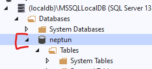

# 7. Data management

## The aim of the laboratory¶

The aim of this laboratory is to get familiar with the ADO.NET programming model and illustrate the most common data management problems and pitfalls through implementing basic CRUD operations.

Related lectures: Data management, ADO.NET basics.

## Prerequisites

Tools required for completing the laboratory:

- Visual Studio 2022  
- Windows 10 or Windows 11 operating system  
- During the laboratory, we will use *SQL Server Object Explorer* in Visual Studio to navigate between database objects and execute queries. This may require the *SQL Server Data Tools* component, which can be most easily installed via the *Individual Components* tab in the Visual Studio Installer, but it is also included in the *Data Storage and Processing* workload.

!!! tip "Laboratory on Linux or Mac"
    The materials are primarily designed for Windows and Visual Studio, but — with some adjustments — they can also be completed on other operating systems, since the .NET SDK is supported on both Linux and Mac. On Linux:

    - Instead of Visual Studio, use a text editor (e.g., VSCode) and CLI tools.
    - SQL Server has a Linux version, and on Mac it can be run in Docker (Docker is likely the most convenient way to run it on Linux as well).
    - For data visualization, the cross-platform *Azure Data Studio* tool can be used.

## Solution

??? "Download the completed solution"
    :exclamation: It is essential to work following the instructor during the lab, it is forbidden (and pointless) to download the final solution in advance. However, during subsequent independent practice, it can be useful to review the final solution, so we make it available.

    The solution is available on GitHub [here](https://github.com/bmeviauab00/lab-adatkezeles-megoldas). The simplest way to download it is by cloning it to your machine via the command line using the `git clone` command:

    `git clone https://github.com/bmeviauab00/lab-adatkezeles-megoldas`

    This requires the Git command-line tool to be installed on your machine. More information is available [here](../../hazi/git-github-github-classroom/index_eng.md#git-telepitese).

## Introduction

??? warning "Note for lab instructors"
    This section does not need to be explained in full detail during the lab, but the key concepts should still be introduced briefly.

### ADO.NET

For low-level database management on the .NET platform, ADO.NET is available. It enables access to relational databases.

When using ADO.NET, two different data access models can be applied:

- Connection-based model
- Connection-less model

By expanding the two blocks below, you can get an overview of the basic principles of each model.

??? abstract "Principles of the connection-based model"
    The essence of this model is that the database connection remains open throughout the process of querying and modifying data, and writing changes back to the database. We can use `DataReader` objects for this solution (see later). The advantage lies in its simplicity (simpler programming model and concurrency handling). The downside is the potential for scalability issues due to the continuously maintained network connection. This means that when many users access the data handler concurrently, many database connections remain open, which can be a costly resource in terms of performance for data-handling systems. Therefore, during development, it's advisable to close database connections as soon as possible.

    Advantages of the model:

    - Simpler concurrency management
    - Always up-to-date data

    Note: These advantages occur when the database handler uses strict locks for data access – we can control this by setting the appropriate transaction isolation level during access. (These techniques are covered in later studies.)

    Disadvantages:

    - Continuous network connection
    - Lack of scalability

??? abstract "Principles of the connection-less model"
    Unlike the connection-based model, this approach does not maintain a database connection while displaying and modifying data in memory. Accordingly, the main steps are: after establishing the connection and retrieving data, we immediately close the connection. The data is then typically displayed, and the user is allowed to make modifications (adding, editing, deleting records as needed). During the save process, we re-establish the database connection, write the changes back to the database, and then close the connection again. Naturally, this model requires us to keep track of data and modifications in memory between querying and writing changes back – when there is no active database connection. In the ADO.NET environment, the use of `DataSet` objects provides a very convenient solution for this.

    Advantages of the model:

    - No need for a continuous network connection
    - Scalability

    Disadvantages:

    - Data may not always be up-to-date
    - Possible conflicts

    Note: There are many ways to keep track of objects and related changes in memory. `DataSet` is just one possible technique. You can also use plain objects or more modern .NET technologies than ADO.NET (e.g., Entity Framework Core) to help manage them.

### The connection-based model

In this lab, we will get to know the connection-based model.

The basic process is as follows:

1. Establishing a connection between the application and the database management system (using a `Connection` object).
2. Assemble the SQL command to be executed (using a `Command` object).
3. Execute the command (using a `Command` object).
4. In case of queries, processing the returned set of records (using a `DataReader` object). Naturally, this is not needed for modification commands.
5. Close of the connection.

As shown above, communication with the database in this model consists of three main components:

- Connection
- Command
- Data Reader

These components are represented as classes. Their database-independent parts are located in the BCL namespace *System.Data.Common*, under the names `DbConnection`, `DbCommand`, and `DbDataReader`. These are abstract classes, and it is the responsibility of the database vendors to implement derived versions that support specific database systems.

All three ADO.NET components support the *Dispose* pattern, so they can (and should) be used within a `using` block whenever possible. The database server is typically located on a different machine than the one running the code (although not in our lab setting :)), so we should treat these as remote network resources.

The version supporting Microsoft SQL Server can be found in the *Microsoft.Data.SqlClient* NuGet package, in the classes prefixed with “Sql” (`SqlConnection`, `SqlCommand`, and `SqlDataReader`).

Other vendors provide their own implementations in separate DLL(s). These components are called *data providers*. Here are a few examples (non-exhaustive list):

- [PostgreSQL](https://www.npgsql.org/)
- [SQLite](https://learn.microsoft.com/en-us/dotnet/standard/data/sqlite/?tabs=netcore-cli)
- [Oracle](https://www.oracle.com/database/technologies/appdev/dotnet/odp.html)

#### Connection

This establishes the connection between our program and the database management system.
To initialize it, a connection string is required, which provides the driver with the necessary information to establish the connection. Its internal format varies by database vendor ([more details](http://www.connectionstrings.com)).

When instantiating a new `Connection`, it does not necessarily create a brand new connection to the database. Drivers usually implement connection pooling — similar to thread pooling — allowing reuse of previously established (but currently unused) connections.

The `Connection` uses particularly costly unmanaged resources, **so it is crucial to ensure it is closed as soon as it is no longer needed** (e.g., by calling `Dispose()`, which is most easily done using a `using` block).

#### Command

This is used to define “commands” for the database management system. These commands must be written in SQL.
A `Command` must be associated with a connection — this is through which the command will be executed. Commands can have different types of results, so we execute them using different methods depending on the expected output:

- **ExecuteReader**: Retrieves a result set
- **ExecuteScalar**: Retrieves a scalar value
- **ExecuteNonQuery**: No return value (e.g., for INSERT, UPDATE, and DELETE), but returns the number of affected records

#### Data Reader

If the command results in a result set, we use this component to read the data. The result set can be viewed as a table, and the `DataReader` navigates through it row by row (only forward!). The cursor stands on one row at a time — after reading the data from the current row, the cursor can be advanced to the next one. We can only read from the current row. Initially, the cursor does not point to the first row, so we must advance it once to start at the first row.

Note: Navigation occurs on the client side in memory and is not related to the server-side cursors supported by some database systems.

## Task 1 – Preparing the database

First, we need a database management system. In real-world environments, this typically means a full-featured database engine running on a dedicated server and managed by database administrators. However, during development and for local testing, it's more convenient to use a developer-focused database engine.

As part of the Visual Studio installation, we get such an engine: **LocalDB**, which is a simplified version of the full SQL Server. Its main characteristics are:

- It can be installed separately, not only with Visual Studio.
- The engine is almost fully compatible with the full-featured Microsoft SQL Server.
- It is typically accessible only from the machine on which it was installed.
- Multiple instances can be created as needed, and these instances are primarily accessible to the operating system user who created them (though an instance can be shared among users if necessary).
- Managing your own instances (creating, deleting, etc.) does not require administrator rights.

??? note "ssqllocaldb command-line tool"
    We won’t need this during the lab, but the `sqllocaldb` command-line tool can be used to manage instances. Below are some commands that can be used after entering `sqllocaldb`:

    | Command         | Description                                                      |
    |-----------------|------------------------------------------------------------------|
    | info            | Lists instances visible to the current user                      |
    | create "locdb"  | Creates a new instance named "locdb"                             |
    | delete "locdb"  | Deletes the instance named "locdb"                               |
    | start "locdb"   | Starts the instance named "locdb"                                |
    | stop "locdb"    | Stops the instance named "locdb"                                 |

The Visual Studio installation includes and launches LocalDB instances, so it’s worth checking which instances Visual Studio sees by default.

1. Launch Visual Studio and from the View menu, select SQL Server Object Explorer (SSOE).
2. Expand the SQL Server node. If you see further nodes beneath it, you’re in luck — expand one of them (this will also start the instance if it’s not already running, so you may need to wait a bit).
3. If nothing appears, open a command prompt and run the `mssqllocaldb info` command to list existing instances. Then right-click the SQL Server node in SSOE, choose *Add SQL Server*, and enter an existing instance, e.g., `(localdb)\MSSQLLocalDB`.
4. In the *Databases* node that appears, select the *New Database* option and enter a database name (in the lab, since several students can use the same operating system user, it is recommended to use your Neptun code as the name).
5. Right-click on the new database node and choose *New Query* to open a new query window.
6. Open or download the [Northwind database initialization script](northwind.sql).
7. Copy the entire script into the query window.
8. Execute the script using the small green arrow (*Execute*). Make sure to **select the correct database (the one created in step 4)** from the dropdown at the top of the query window before executing!
9. Check whether the tables and views have appeared in your database.
10. Explore the main features of SSOE (e.g., viewing table data, checking table schemas, etc.).

!!! note "MSSQL Management Tools"
    In Visual Studio, you can manage databases using either *Server Explorer* or *SQL Server Object Explorer*. The former is a more general-purpose tool (also capable of managing other server resources like Azure servers), while the latter is specifically focused on database management. Both are accessible from the View menu and provide similar database management functionality — in this lab we will use only the *SQL Server Object Explorer*.

    When Visual Studio is not available, you can manage your database using the (free) SQL Server Management Studio or the also free and cross-platform Azure Data Studio.

## Task 2 – Querying with ADO.NET `SqlDataReader`

The task is to create a C# console application that uses the records from the `Shippers` table of the Northwind database.

1. Create a C# console application. Make sure to select the *Console App* project type and **NOT** *Console App (.NET Framework)*:
    - Name the project *AdoExample*
    - Set the Target Framework to *.NET 8*
    - Check the option *Do not use top-level statements*

2. Find the connection string in the SQL Server Object Explorer (SSOE): right-click your database connection (as highlighted in red in the image below) and select Properties.

    

3. Copy the value of the *Connection String* property from the Properties window into a variable in your `Program` class:

    ```csharp
    private const string ConnString = @"Data Source=(localdb)\MSSQLLocalDB;Initial Catalog=neptun;Integrated Security=True;Connect Timeout=30;Encrypt=False;TrustServerCertificate=False;ApplicationIntent=ReadWrite;MultiSubnetFailover=False";
    ```

    !!! tip "SQL Server connection string format"
        In the case of MSSQL, the connection string contains key-value pairs separated by semicolons.
        The `Data Source` key specifies the SQL Server instance name, and the `Initial Catalog` key specifies the database name.
        The `Integrated Security=true` option enables Windows authentication.

    !!! tip "@ string (C# verbatim string)"
        The `@` character is a special verbatim identifier. In this context, it ensures that backslashes (`\`) in the connection string are not interpreted as escape characters.

4. Add the `Microsoft.Data.SqlClient` NuGet package to the project. This can be done in two ways:
  
      - A) In Visual Studio's NuGet Manager:  
        1. Right-click on the project / *Manage NuGet Packages...*, then switch to the *Browse* tab.  
        2. Enter *Microsoft.Data.SqlClient* in the search box.  
        3. In the *Version* field, select version 5.0.1 (we choose this version in the lab because it’s cached on the lab machines; when practicing at home, choose *Latest stable* instead).  
      - B) Paste the following package reference into the project file:

        ```xml
        <ItemGroup>
            <PackageReference Include="Microsoft.Data.SqlClient" Version="5.0.1" />
        </ItemGroup>
        ```

    !!! note "NuGet package manager"  
        NuGet is an online package management system that allows us to reference external dependencies and class libraries in .NET-based projects easily and in versioned form. More details are covered in the first lecture.

5. Write a query function that retrieves all shippers:

    ```cs
    private static void GetShippers()
    {
        using (var conn = new SqlConnection(ConnString))
        using (var command = new SqlCommand("SELECT ShipperID, CompanyName, Phone FROM Shippers", conn))
        {
            conn.Open();
            Console.WriteLine("{0,-10}{1,-20}{2,-20}", "ShipperID", "CompanyName", "Phone");
            Console.WriteLine(new string('-', 60));
            using (SqlDataReader reader = command.ExecuteReader())
            {
                while (reader.Read())
                {
                    Console.WriteLine(
                        $"{reader["ShipperID"],-10}" +
                        $"{reader["CompanyName"],-20}" +
                        $"{reader["Phone"],-20}");
                }
            }
        }
    }
    ```

    The connection-based model process:

    - Initializing connection and command
    - Opening the connection
    - Executing the command
    - Processing the result
    - Closing the connection, cleanup

    !!! tip "Some notes on the code"
        - The `DataReader` is obtained as a result of executing the command, not instantiated directly
        - The connection must be opened before executing the command
        - When instantiating a `DbConnection`, the connection is not opened (no network communication occurs)
        - The `DataReader.Read()` function indicates whether there is more data in the result set
        - The `DataReader` can be indexed by the names of the columns in the result set – the result is of type `object`, so if a more specific type is needed, casting is required
        - The compiler does not interpret the SQL command text (it is just a string), the database interprets it, so errors in SQL result in runtime exceptions
        - Note how many places in the code must be manually changed if the database schema changes, e.g., renaming a column
        - By prefixing strings with `$`, string interpolation can be used, meaning expressions can be embedded directly in the string (C# 6 feature). Using `$@` allows for multi-line string interpolation expressions (line breaks must be placed inside `{}` or else they will appear in the output). Interesting fact: from C# 8 onward, `$` and `@` characters can appear in any order, so both `$@` and `@$` are valid.
        - The `using` keyword can be used as a single-line expression instead of a block statement. In this case, the `using` scope ends at the end of the containing block (in this case, the end of the function). This reduces indentation and braces, but should not be used reflexively, because sometimes it is better to release resources sooner than at the end of the containing block.

        ```cs
        private static void GetShippers()
        {
            using var conn = new SqlConnection(ConnString);
            using var command = new SqlCommand("SELECT ShipperID, CompanyName, Phone FROM Shippers", conn);

            conn.Open();

            Console.WriteLine("{0,-10}{1,-20}{2,-20}","ShipperID", "CompanyName", "Phone");
            Console.WriteLine(new string('-', 60));

            using var reader = command.ExecuteReader();
            while (reader.Read())
            {
                Console.WriteLine(
                    $"{reader["ShipperID"],-10}" +
                    $"{reader["CompanyName"],-20}" +
                    $"{reader["Phone"],-20}");
            }
        }
        ```

        Going forward, we will use this method to save indentation and brackets.

6. Call our new function from the `Main` method.

    ```cs hl_lines="3"
    private static void Main(string[] args)
    {
        GetShippers();
    }
    ```

7. Test the application. Also try it with a broken SQL statement.

## Task 3 – Insertion with SQL Command

1. Write a function that inserts a new shipper into the database:

    ```cs
    private static void InsertShipper(string companyName, string phone)
    {
        using var conn = new SqlConnection(ConnString);
        using var command = new SqlCommand(
            "INSERT INTO Shippers(CompanyName, Phone) VALUES(@name,@phone)", conn);
        command.Parameters.AddWithValue("@name", companyName);
        command.Parameters.AddWithValue("@phone", phone);

        conn.Open();

        int affectedRows = command.ExecuteNonQuery();

        Console.WriteLine($"{affectedRows} rows affected");
    }
    ```

    Here, we need to write SQL that has been constructed using the values of variables received from outside. We could have simply used string concatenation, string interpolation, or `string.Format` to build the string, but this poses a security risk (SQL Injection – see more below) – **NEVER!!! build SQL with string operations**. Instead, write the SQL so that wherever variable values would be inserted, parameter references are used. For SQL Server, the syntax for references is: `@parameterName`.

    To execute the command, we also need to pass the parameter values to the database, because the database will perform the substitution of values into the parameters.

    The output of the insert command is not a result set, so we must run it with the `ExecuteNonQuery` method, which returns the number of rows inserted.

2. Call our new function from the `Main` method.

    ```cs hl_lines="2-3"
    GetShippers();
    InsertShipper("Super Shipper","49-98562");
    GetShippers();
    ```

3. Test the application, check both in the console and in SSOE whether the new row has been inserted. For quick and convenient verification in SSOE, right-click the `Shippers` table and select *View Data* from the context menu.

## Task 4 – Modification with stored procedure

1. Study the code of the `Product_Update` stored procedure in SSOE. To do this, expand the Stored *Procedures* node under *Programmability*, then right-click the `Product_Update` stored procedure and select *View Code*.

    !!! note "Program code in the database"
        Larger data management systems allow us to define program code inside the database itself. These are called stored procedures. The language depends on the data system, but in MSSQL it is T-SQL.

        Nowadays, the practice of placing complex business logic inside the database is increasingly fading out in the industry, because the SQL dialects have a much more limited toolset compared to high-level programming languages (C#, Java). Moreover, the use of stored procedures significantly reduces system testability. Nevertheless, sometimes it may be justified to keep some logic in the database, when we want to take advantage of running program code close to the data, for example, if we don’t want to transmit the data over the network for simple bulk data maintenance.

2. Write a function that calls this stored procedure.

    ```cs
    private static void UpdateProduct(int productID, string productName, decimal price)
    {
        using var conn = new SqlConnection(ConnString);
        using var command = new SqlCommand("Product_Update", conn);

        command.CommandType = CommandType.StoredProcedure;

        command.Parameters.AddWithValue("@ProductID", productID);
        command.Parameters.AddWithValue("@ProductName", productName);
        command.Parameters.AddWithValue("@UnitPrice", price);

        conn.Open();

        int affectedRows = command.ExecuteNonQuery();
        
        Console.WriteLine($"{affectedRows} rows affected");
    }
    ```

    The `Command` should be given the name of the stored procedure, and the command type had to be set accordingly; otherwise, its structure is similar to the previous insert code.

3. Call our new function from the `Main` method, for example with the following parameters:

    ```cs
    UpdateProduct(1, "MyProduct", 50);
    ```

4. Test the application and verify both in the console and in SSOE whether the product with ID 1 has been updated.

## Task 5 - SQL Injection

1. Write the insert function so that it builds the SQL using string interpolation.

    ```cs
    private static void InsertShipper2(string companyName, string phone)
    {
        using var conn = new SqlConnection(ConnString);
        using var command = new SqlCommand(
            $"INSERT INTO Shippers(CompanyName, Phone) VALUES('{companyName}','{phone}')",
            conn);

        conn.Open();

        int affectedRows = command.ExecuteNonQuery();
        Console.WriteLine($"{affectedRows} row(s) inserted");
    }
    ```

2. Call our new function from the `Main` method with a “special” parameter.

    ```cs
    InsertShipper2("Super Shipper", "49-98562'); DELETE FROM Shippers;--");
    ```

    We constructed the second parameter so that it closes the original statement, then allows writing arbitrary **(!!!)** SQL, and finally comments out the rest of the original statement (`--`).

3. Test the application. You should get an error indicating that one of the shippers cannot be deleted due to a foreign key reference.

    So the `DELETE FROM` did run! Let's check with the debugger (e.g., pause at the `conn.Open` statement) to see the final SQL (`command.CommandText`).

    Lessons learned:

    - Concatenate NEVER  SQL programmatically (by any method), because this exposes your code to SQL Injection attacks.
    - Let the database build the final SQL from SQL parameters, because then it is guaranteed that parameter values won’t be interpreted as SQL (even if SQL code is input). Use parameterized SQL or stored procedures.
    - Use database constraints, e.g., to protect against accidental deletions.
    - Configure database users with different permissions; the user specified in your program’s connection string should have only the minimal rights needed for operation. In our case, no user was specified, so we connect as the Windows user.

4. Call the original (i.e., safe, parameterized) insert function with the “special” parameters to see if protection works:

    ```cs
    InsertShipper("Super Shipper", "49-98562'); DELETE FROM Shippers;--");
    InsertShipper("XXX');DELETE FROM Shippers;--", "49-98562");
    ```

    The first one fails size limits, the second runs but only inserts a “weird” named shipper. The parameter value is truly interpreted as a value, not SQL code. Unlike here:

    

## Task 5 - Deletion

1. Write a new function that deletes a given shipper.

    ```cs
    private static void DeleteShipper(int shipperID)
    {
        using var conn = new SqlConnection(ConnString);
        using var command = new SqlCommand("DELETE FROM Shippers WHERE ShipperID = @ShipperID", conn);
        command.Parameters.AddWithValue("@ShipperID", shipperID);

        conn.Open();

        int affectedRows = command.ExecuteNonQuery();

        Console.WriteLine($"{affectedRows} row(s) affected");
    }
    ```

2. Call the new function from the `Main` function, e.g. with parameter 1.
3. Try the application. You will likely get an exception, because there is a reference (foreign key constraint) to the given record.
4. From SSOE, find the ID of a shipper that you added. Pass this ID to the delete function — this one can be deleted because it is not referenced.

!!! tip "Deletion strategies"
    It is clear that deletion is a risky and unpredictable operation due to foreign key constraints. Some approaches to handle deletion:

    - **Disallow deletion**: If the record to be deleted is referenced, the database returns an error (as seen above).
    - **Cascade delete** – a foreign key constraint can be configured so that when the referenced record is deleted, the referencing record is also deleted. This often leads to all foreign key constraints being set this way, so one (accidental) delete could remove the entire database, making the deletion effect hard to predict.
    - **Nullify reference** – a foreign key constraint can be set so that when the referenced record is deleted, the foreign key field in the referencing record is set to `NULL`. This only works if the foreign key column in the model is nullable.
    - **Soft delete** – instead of deleting, set a flag column (e.g. `IsDeleted`). The advantage is that you do not have to handle foreign key constraints, and the deleted data remains available if needed (e.g. for undelete). However, this complicates the logic because you need to handle filtering out deleted records (e.g., not showing them in UI, statistics) or dealing with referencing non-deleted records pointing to deleted ones.

## Outlook

The basic ADO.NET operations shown above are rarely used in this raw form for two main reasons (even though this approach offers the best performance):

- Weak typing: Reading a record's data into a class’s properties is cumbersome, as casting is required, etc.
- SQL embedded as strings: Typing errors in the SQL only appear at runtime.

The first issue can be addressed using various ADO.NET helper libraries, such as:

- [Dapper](https://github.com/DapperLib/Dapper)  
- [PetaPoco](https://github.com/CollaboratingPlatypus/PetaPoco)

These solutions offer more convenience in exchange for a minimal performance loss.

Both problems are addressed by ORMs (Object-Relational Mapping systems), although they come with a higher overhead than the solutions mentioned above. ORMs create a mapping between the database and our object-oriented classes, simplifying database operations using this mapping. Operations written with typed code on our classes are automatically translated into the corresponding database operations. This keeps the in-memory object model in sync with the database. Consequently, ORMs use a connection-less model.

Well-known .NET ORMs:

- ADO.NET DataSet – a first-generation ORM, now rarely used  
- Entity Framework 6.x – the most widely used ORM framework for the (old) .NET Framework  
- [Entity Framework Core](https://learn.microsoft.com/en-us/ef/core/) (EF Core) – the currently preferred ORM for .NET (open source)  
- [NHibernate](https://nhibernate.info/) – the .NET port of Java's Hibernate (open source)

We cover Entity Framework Core in more detail in the *Data-Driven Systems* specialization course and in the elective course *Software Development on the .NET Platform*.