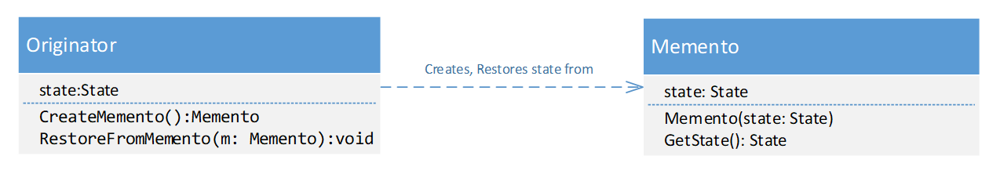

# 7. Tervezési minták

!!! danger "FONTOS"
    **JELEN LABOR LEÍRÁSA MÉG NEM VÉGLEGES**

    **JELEN LABOR LEÍRÁSA MÉG NEM VÉGLEGES**
    
    **JELEN LABOR LEÍRÁSA MÉG NEM VÉGLEGES**

## A gyakorlat célja

A gyakorlat céljai:

- Egy összetettebb példa alapján néhány tervezési minta gyakorlati alkalmazása (elsődlegesen Singleton, Command Processor és Memento).
- A Document-View minta további gyakorlása, illetve annak demonstrálása, hogy a mintának több variánsa létezik.
- Alapszintű betekintést nyerni az újrafelhasználhatóságot támogató osztálykönyvtárak/keretrendszerek fejlesztésének világába.
- Jelentőségüknek megfelelően tovább gyakoroljuk az objektumorientált paradigma legfontosabb koncepcióit (pl. felelősségek különválasztása).

Kapcsolódó előadások:

- Tervezési minták
- Szoftver architektúrák témakörből a Document-View architektúra
- Windows Forms alkalmazások fejlesztése

## Előfeltételek

A gyakorlat elvégzéséhez szükséges eszközök:

- Visual Studio 2022
- Windows 10 vagy Windows 11 operációs rendszer (Linux és macOS nem alkalmas)

## Megoldás

??? "A kész megoldás letöltése"
    :exclamation: Lényeges, hogy a labor során a laborvezetőt követve kell dolgozni, tilos (és értelmetlen) a kész megoldás letöltése. Ugyanakkor az utólagos önálló gyakorlás során hasznos lehet a kész megoldás áttekintése, így ezt elérhetővé tesszük.

    A megoldás GitHubon érhető el [itt](https://github.com/bmeviauab00/lab-designpattern-kiindulo). A legegyszerűbb mód a letöltésére, ha parancssorból a `git clone` utasítással leklónozzuk a gépünkre:

    ```git clone https://github.com/bmeviauab00/lab-designpattern-kiindulo -b megoldas```

    Ehhez telepítve kell legyen a gépre a parancssori git, bővebb információ [itt](../hazi/git-github-github-classroom/#git-telepitese).

## Bevezető

### Elméleti háttér

A komplexebb alkalmazások fejlesztése során számos tervezői döntést kell meghoznunk, melyek során több lehetőség közül is választhatunk. Amennyiben ezen pontokban olyan döntéseket hozunk, melyek nem követik az objektumorientált szemléletmód alapelveit, nem tartjuk szem előtt az alkalmazásunk könnyű karbantarthatóságát, illetve egyszerűen megvalósítható továbbfejlesztési lehetőségét, könnyen hamar rémálommá válhat a fejlesztés. Az egyes hibák javítása folyamatosan új hibákat szül. Ezen felül a megrendelői változtatási és bővítési igények a kód nagymértékű folyamatos átírását igénylik ahelyett, hogy a kód pár jól meghatározott pontjában történő bővítésével - a meglévő kód jelentős módosítása nélkül - el tudnánk ezt érni.
A tervezési minták jól bevált megoldásokat mutatnak bizonyos gyakran előforduló tervezési problémákra: ezen megoldások abban segítenek, hogy kódunk könnyebben bővíthető, karbantartható és minél nagyobb mértékben újrafelhasználható legyen.
Ugyanakkor ne essünk át a ló túloldalára: csak akkor érdemes egy adott tervezési mintát bevetni, ha adott esetben valós előnyt jelent az alkalmazása. Ellenkező esetben csak a megvalósítás komplexitását növeli feleslegesen.

### A feladat ismertetése

A feladatunk egy vektorgrafikus rajzolóprogram kifejlesztése:

- Az alkalmazásban vektorgrafikus alakzatokat lehet létrehozni, úgymint téglalap, ellipszis stb.
- A már létrehozott alakzatokat egy grafikus felületen meg kell jeleníteni (ki kell rajzolni).
- A már létrehozott alakzatok fontosabb paramétereit, úgymint koordináták, befoglaló téglalap meg kell jeleníteni egy listában egy információs panelen.
- Windows Forms technológiára építve dolgozunk.
- Document-View architektúrát követjük, de egyszerre csak egy dokumentum lehet megnyitva (nincsenek dokumentumonként tabfülek vagy ablakok).
- Egy adott pontig előkészített környezetet viszünk tovább. A munka mennyiségének kezelhető szinten tartása végett csak bizonyos pontig visszük tovább a fejlesztést, nem valósítjuk meg a teljes értékű megoldást.
kiemelt háttér jelzi.

## 1. Feladat - A kiindulási környezet megismerése

Klónozzuk le a gyakorlathoz tartozó kiinduló alkalmazás [repositoryját](https://github.com/bmeviauab00/lab-designpattern-kiindulo):

- Nyissunk egy command prompt-ot
- Navigáljunk el egy tetszőleges mappába, például c:\work\NEPTUN
- Adjuk ki a következő parancsot: `git clone https://github.com/bmeviauab00/lab-designpattern-kiindulo`
- Nyissuk meg a _DesignPatternApp.sln_ solutiont Visual Studio-ban.

Futtassuk az alkalmazást, az alábbihoz hasonló felületet látunk (amennyiben a *File/New* menüelemet kiválasztjuk):


Ismerkedjünk meg működésének néhány aspektusával:

- A legtöbb funkció nincs még megvalósítva.
- A *File/New* menüelem valamint a toolbar első gombja egy új dokumentumot hoz létre. Ez már működik, próbáljuk ki.
- Mivel új alakzatot jelen pillanatban még nem tudunk létrehozni, a dokumentum a létrejöttét követően nem üres, tartalmaz némi tesztelést szolgáló adatot (két téglalapot és egy ellipszist).
- Az alakzatok kirajzolása is meg van valósítva. Ezen felül a jobb oldali információs panelen láthatjuk a már létező alakzatok paramétereit.
- Az alakzatok közül egy ki lehet választva: ez piros színnel és szaggatott kék kerettel kerül kirajzolásra, illetve az információs panelen ki is van választva az alakzathoz tartozó sor. Új alakzat kijelölésére az információs panelen a megfelelő sor kiválasztásával van mód. Ezt próbáljuk is ki. Azt tapasztaljuk, hogy változtatáskor a baloldali grafikus felület is frissül, a kiválasztott alakzat színe piros lesz. Hangsúlyozzuk, hogy ez bizony a klasszikus dokumentum-nézet architektúra alapú megközelítés igényét veti fel: a dokumentumunkhoz két nézet kapcsolódik, melyeket konzisztensen kell tartani.
Megjegyzés: a teljes értékű megoldásban a baloldali grafikus nézetben is megvalósíthatnánk az egérkattintásra történő kijelölést. Ez jelentősen komplexebbé tenné a későbbi feladataink megvalósítását, így ezt szándékosan kihagyjuk.

### Megvalósítandó funkciók

A következő funkciókat fogjuk a gyakorlat során megvalósítani:

- Új téglalap és új ellipszis létrehozása véletlen pozícióban. A funkciók az eszközsávon (toolbar)  és a Tools menü alatt is elérhetők.
- Dokumentum tartalmának törlése. Minden alakzatot eltávolít a dokumentumból. File/Clear menüvel elérhető.
- Visszavonás (Undo). Az utolsó parancs visszavonása, akárhány lépésig visszamenően. Visszavonja az utolsó parancsot, legyen az valamilyen új alakzat létrehozása, vagy a dokumentum tartalmának törlése. Az eszközsávon és és az Edit/Undo menüvel is elérhető.

### A solution felépítése

A következő lépésben a kiinduló kódbázissal fogunk megismerkedni. Gyakorlatilag az architektúránk komponens nézetét tekintjük át ebben a lépésben. A Visual Studio Solution Explorer ablakában megfigyelhető, hogy solutionünk két projektet is tartalmaz.

- `AppFx`: Egy osztálykönyvtár (egy DLL a kimenete). Az ebben található osztályok általános dokumentumkezelési és parancskezelési szolgáltatásokat valósítanak meg, melyek akár több alkalmazásban is felhasználhatók. Az osztálykönyvtár bevezetésével az elsődleges célunk tehát az újrafelhasználhatóság elérése.
- `DesignPatternApp`: A futtatható (.exe) alkalmazásunk projektje, mely épít az `AppFx` osztálykönyvtárra.
  
!!! note "Függőség a projektek között"
    Visual Studio projektek között mindig csak egyirányú függőség lehet. Jelen esetben a DesignPatternApp épít az `AppFx` projektre. Ezt a gyakorlatban úgy valósítottuk meg, hogy a DesignPatternApp projektben felvettünk egy referenciát az `AppFx` projektre. Ettől kezdve az DesignPatternApp-ban elérhetők az `AppFx` (publikus) osztályai. Fordítva viszont nem igaz az állítás, és ennek elérésére nincs is mód.

### Document-View architektúra

Az alkalmazásunk a Document-View architektúrára épül, annak némiképpen továbbfejlesztett koncepcióját valósítja meg: ahelyett, hogy a nézeteknek egy `Update` művelete lenne, amelyen keresztül általános változás értesítést kapnak a dokumentumuktól, **a dokumentumok különböző változási eseményeket publikálhatnak: minden nézet arra az eseményre fizet elő, és arról kap értesítést, mely számára érdekes.**

- Az `AppFx` projekt DocView mappájában található egy `Document` osztály és egy `IView` interfész. Nézzük meg őket sorban (nyissuk is meg a forrásfájlt):
    - `Document`: Különböző dokumentum típusok ősosztályaként szolgálhat. Többek között van egy nézet listája.
    (Megjegyzés: mivel alkalmazásunk a Document-View architektúra egy speciális variánsát használja, a nézet listát az ősből el is hagyhattuk volna).
    - `IView`: Különböző nézet implementációk közös interfésze. Nincs `Update` művelet, helyette egy `SetDocumentAndRegisterToDocEvents` műveletet találunk (ebben kell a nézetnek a dokumentum megfelelő eseményeire beregisztrálnia).

A következőkben a `DesignPatternApp` projekt kapcsolódó osztályait tekintjük át:

- `DrawingDocument` osztály
    - Egy `shapes` nevű listában tárolja az alakzatokat.
    - A `selectedShape` az aktuálisan kiválasztott alakzatra mutat.
    - A `dokumentum` adatai a `Shapes`, `SelectedShape` és `SelectedShapeIndex` tulajdonságokon keresztül érhetők el a külvilág (pl. nézetek) számára.
    - A korábban ismertetett koncepciónknak megfelelően a dokumentumunk két eseményt is publikál, melyek C# eseményként vannak megvalósítva:
        - `ShapesChanged`: azt jelzi, hogy az alakzatok listája megváltozott, pl. új alakzattal bővült, vagy kikerült egy alakzat a listából, vagy akár egy alakzat adatai változtak meg a listában.
        - `SelectionChanged`: azt jelzi, hogy egy korábbitól eltérő alakzat került kiválasztásra (mely piros színnel jelenik meg rajzoláskor).
    - A `CreateRect` és `CreateEllipse` műveletek létrehoznak egy megfelelő alakzatot, amit a dokumentum el is tárol (és természetesen el is süti a `ShapesChanged` eseményt).

- `ViewBase` osztály
    - A nézeteink közös ősosztálya, a kódduplikáció elkerülésére vezettük be. Implementálja az `IView` interfészt.
    - `UserControl`-ból származik (hasonló koncepciót már láttunk a megelőző gyakorlat `FontEditor` példájában).
    - A `document` tagváltozóban tárolja a nézetet.
    - A dokumentum megfelelő eseményeire való fel/leiratkozáshoz bevezeti a `RegisterToDocEvents` és `UnRegisterToDocEvents` virtuális műveleteket, a leszármazottakban igény szerint kell implementálni.
- `GraphicsView` osztály
    - Az alkalmazásunk baloldali, grafikus nézetének implementációja.
    - A `ViewBase`-ből származik, így közvetve ezen osztályunk is egy `UserControl`.
    - A `RegisterToDocEvents` műveletében a dokumentum mindkét eseményére (`ShapesChanged` és `SelectionChanged`) előfizet, ugyanazt a `DocumentOnShapesChanged` eseménykezelő függvényt regisztrálja be. Az eseménykezelőben egy egyszerű `Invalidate` hívást találnunk, mely kikényszeríti a nézetünk újrarajzolását.
    - Az `OnPaint` megvalósításának alapelve: minden alakzatra meghívjuk a `Draw` művelet, mely gondoskodik a tényleges megjelenítésről.
- `InfoPanel` osztály
    - Az alkalmazásunk jobboldali információs panel nézetének implementációja.
    - Szintén a `ViewBase`-ből származik, így közvetve ezen osztályunk is egy UserControl.
    - Az információk megjelenítésére egy `ListBox` vezérlőt használ.
    - A `RegisterToDocEvents` műveletében ő is feliratkozik a dokumentum mindkét eseményére:
        - Amikor a dokumentum ShapesChanged eseménye sül el, az InfoPanel `Document_ShapesChanged` művelete hívódik meg: ebben frissíti a listbox tartalmát a dokumentum aktuális állapotának megfelelően.
        - Amikor a dokumentum SelectionChanged eseménye sül el, a `Document_SelectionChanged` hívódik: ebben a listbox megfelelő elemét állítjuk be kiválasztottnak.
    - Amikor a felhasználó egy új elemet választ ki a listboxban, a `listBox_SelectedIndexChanged` eseménykezelő hívódik: ebben az `App.Instance.SetSelectedShape()` hívással az aktuális dokumentumunkban állítjuk át a kiválasztott alakzatot a listbox felhasználó által kiválasztott sorának megfelelően.
- `Shape`, `Rect`, `Ellipse` osztályok
    - A `Shape` a közös ős, az egyes alakzatok ennek leszármazottai.
    - A gyakorlat során ezek kódjára éppen csak nézzünk rá, ezek implementációs részletei számunkra most kevésbé izgalmasak.
    Megjegyzés: Az egyik feladat megvalósítása során másolatot készítünk majd az alakzatokról. Annak érdekében, hogy az alakzatot és a másolatait össze tudjuk „találtatni”, az egyes alakzatokhoz egy számazonosítót rendelünk (`Id` tag), mely az alakzat és másolatai esetében ugyanazt az értéket veszi fel.
- `App` osztály
    - Az alkalmazásunk „root” osztálya, magát az alkalmazást reprezentálja. Szerepe hasonló, mint az előző gyakorlat `FontEditor` példájában.
    - Megvalósítása a `Singleton` tervezési minta fontosabb elveit követi: egy példány létezhet belőle, mely egy statikus `Instance` nevű tulajdonságon keresztül érhető el, a konstruktora pedig védett.
    - Mivel alkalmazásunkban egyszerre egy dokumentum lehet megnyitva (ún. SDI, Single Document Interface application), egy jelentős egyszerűsítéssel élhettünk: a dokumentumunkból és mindkét nézet típusunkból egy-egy objektumra van csak szükség. Ezekre az `App` osztályunkban el is tárolunk egy-egy hivatkozást az alábbi tagváltozókban:
    ```csharp
        private DrawingDocument document;
        private GraphicsView graphicsView;
        private InfoPanel infoPanel;
    ```
    - Az `Initialize` műveletben levő `CommandBindingManager` hívásokra később térünk vissza.

### Command Binding

A komplex felhasználó felülettel rendelkező alkalmazások esetén gyakran előfordul, hogy ugyanazt a parancsot különböző felhasználói felületelemekhez is hozzá szeretnénk kötni. Például *New/Open/Close/Cut/Copy/stb*. parancsok a legtöbb alkalmazásban egyaránt elérhetők menüből és eszközsávról is. Vagyis a parancs és a kiváltó felületelemek között egy-több kapcsolat van.  Ilyen esetben egy adott parancs vonatkozásában a következőket kell megvalósítani:

- **Parancs futtatása**. Akármelyik felületelemet is aktiválja a felhasználó, a parancshoz tartozó ugyanazon „eseménykezelő” kódot kell futtatni. Ez a gyakorlatban egy adott függvény meghívását jelenti.
- **Felületelemek állapotkezelése**. Adott parancs vonatkozásában valamennyi felületelem állapotát konzisztensen kell tartani. Vagyis ha pl. letiltjuk az Undo menüt, mert nincs visszavonható művelet, akkor a visszavonásra szolgáló Undo toolbar gombot is le kell tiltani. Hasonlóképpen, ha egy menüelemet el akarunk rejteni, akkor a kapcsolódó toolbar gombot is rejteni kell. De még felületelemek kijelöltségi állapotát is akarhatjuk szabályozni, erre is él a szabályunk.

Nézzünk erre példákat az alkalmazásunkban:

1. Indítsuk el az alkalmazást. Figyeljük meg, hogy a *File* menü alatt a *Save/Save As/Close* menüelemek és az ezeknek megfelelő toolbar gombok (a Close a harmadik gomb a toolbaron) is le vannak tiltva: amíg nem hoztunk létre vagy töltöttünk be dokumentumot, ezen parancsok futtatásának nincs értelme.
2. Hozzunk létre egy új dokumentumot (*File/New* menü). Ekkor valamennyi, az előző pontban említett felületelem konzisztens módon engedélyezett lesz.
3. Ha bezárjuk a dokumentumot (*File/Close* menü), ismét valamennyi felületelem tiltott lesz.

Egy komplex alkalmazásban a fenti problémakör egyszerű kezelésére célszerű egy központi megoldást bevezetni. Ezt számos módon lehet implementálni, a legtöbb környezet **Command Binding** néven hivatkozik a koncepcióra. Sajnos az elnevezés tekintetében nincs egységesség: van olyan technológia, mely Command néven nevesíti ezt a technikát. Mi Command minta alatt – a tervezési minták klasszikus nevezéktanát követve – mást fogunk érteni, egy későbbi feladatban térünk majd rá.

A Command Binding minta alapelvei:

- Minden felhasználói parancshoz egy központi (`CommandBinding`) objektumot hozunk létre.
- Ehhez hozzákötjük a parancs aktiválásakor futtatandó eseménykezelőt.
- Hozzákötjük valamennyi aktiváló felületelemet (menü, toolbar gomb stb.)
- Segédműveleteket vezetünk be a parancsok tiltására/engedélyezésére/elrejtésére/megjelenítésére.
- A parancsokat a könnyű azonosítás érdekében valamilyen egyszerű módon, tipikusan stringgel azonosítjuk.

A solutionünk `AppFx` projektjében találunk támogatást a Command Binding megvalósítására (`CommandBinding` mappa). A megvalósítás részletei számunkra teljesen érdektelenek, gyakorlaton ne is nézzük a kódját, inkább a felhasználásának módját tekintsük át röviden DesignPatternApp projektünkben:

- Nézzük meg a `CommandName` osztályt: minden parancshoz egy string nevet vezettünk be, mely a parancsot azonosítja (pl. "Open", "Undo" stb.).
- Inicializálás: a `CommandBinding` objektumokat a `MainForm` osztály `initCommandBindings` műveletben hozzuk létre és kötjük hozzá az egyes menüelemekhez/toolbar gombokhoz. Elég, ha itt egy példát megnézünk a sok előfordulás közül.
- Ezt követően adott parancshoz tartozó felületelemek állapotai a `CommandBindingManager` osztály állapotállító segédfüggvényeivel bármikor kényelmesen állíthatók (pl. `EnableCommandBinding` tiltáshoz/engedélyezéshez). Nézzük meg, hogyan történik ez a *Save/Save As/Close* parancsok vonatkozásában:
    - Amikor az alkalmazás elindul, a parancsokat az `App` osztály Initialize műveletében tiltjuk (a false második paraméter jelzi, hogy tiltani akarjuk a vezérlőt):
    ```csharp
    CommandBindingManager.Instance.EnableCommandBinding(
        CommandName.CloseDocument, false);
    CommandBindingManager.Instance.EnableCommandBinding(
        CommandName.SaveDocument, false);
    CommandBindingManager.Instance.EnableCommandBinding(
        CommandName.SaveAsDocument, false);
    ```
    - A parancsok engedélyezésére az `App.NewDocument`-ben látunk példát. Ez a művelet egy parancs eseménykezelője, a többi eseménykezelővel együtt az `App.CommandHandlers.cs` fájlban található (az *App* osztály „partial”, több fájlban van megírva).
    ```csharp
    CommandBindingManager.Instance.EnableCommandBinding(
        CommandName.CloseDocument, true);
    CommandBindingManager.Instance.EnableCommandBinding(
        CommandName.SaveDocument, true);
    CommandBindingManager.Instance.EnableCommandBinding(
        CommandName.SaveAsDocument, true);
    ```

A további feladatok megvalósítása során is a `CommandBindingManager` osztályunkat fogjuk használni a parancsok tiltásához és engedélyezéséhez.

## 2. Feladat - Command Processor minta

A feladat során a **Command**, pontosabban annak továbbfejlesztett változata, a **Command Processor** tervezési minta megvalósítását fogjuk gyakorolni.
Mindkét minta elméleti hátterét a kapcsolódó előadás ismerteti részletesen, UML diagramokkal illusztrálva. A gyakorlat során, és így jelen útmutatóban is csak az elméleti háttér legfontosabb elemeire térünk ki. Lényeges, hogy a mintát ne keverjük a már korábban ismertetett **Command Binding** mintával, mert attól eltérő problémára mutat megoldást.

### A Command Processor minta koncepciója

**A minta alapelve az, hogy minden felhasználói kérést egy külön parancs (Command) objektumként zár egységbe.** Ezen túlmenően a végrehajtott parancs objektumok eltárolásra kerülnek, ami **lehetővé teszi a korábban végrehajtott parancsok visszavonását**.
A következőkben áttekintjük a minta működését. Első lépésben még nem valósítjuk meg, csak az alapelveire koncentrálunk (bár hogy könnyebben megérthető legyen, a mintát az alkalmazásunkra vetítve mutatjuk be). Következzen egy ábra, majd a hozzá kapcsolódó gondolatok. 


- Bevezetünk egy `Command` ősosztályt vagy interfészt, melynek van egy `Execute` és egy Un`Execute` absztrakt művelete (vagy nevezhetjük `Do` és `Undo`-nak is őket, ha úgy tartja kedvünk).
- Az egyes felhasználói parancsokhoz bevezetünk egy Command leszármazott osztályt.
    - Első körben a New Rect és New Ellipse parancsokra vonatkozóan kívánunk Undo támogatást bevezetni, így ezekhez vezetünk majd rövidesen be egy-egy új osztályt, pl. `NewRectCommand` és `NewEllipseCommand` néven.
    - Ezen osztályokban a parancsspecifikusan megírjuk az `Execute` műveletet (pl. a `NewRectCommand`.`Execute`-ban felveszünk a dokumentumunkban egy új téglalapot), az `Unexecute`-ban pedig visszacsináljuk a művelet hatását. 
    - A `Command` leszármazott osztályok sokszor nem maguk valósítják meg funkciójukat, hanem delegálják azt egy vagy több másik osztálynak. Ezt az osztályt az UML diagramon Receiver néven tüntettük fel. A gyakorlatban nem így szoktuk hívni. Alkalmazásunkban a Command-ok tipikusan az `App` osztályba hívnak tovább, vagyis esetünkben az `App` felel meg legtöbb esetben az ábrán szereplő Receiver osztálynak.
- Bevezetünk egy központi CommandProcessor osztályt két művelettel:
    - `ExecuteCommand`: végrehajtja a paraméterül kapott parancsot (meghívja az `Execute` műveletét), majd eltárolja egy belső stack gyűjteményben.
    - `UnExecuteLastCommand`: kiveszi az utoljára végrehajtott parancsot a command stack-ből, és meghívja annak `UnExecute` műveletét. Ezzel gyakorlatilag a parancs visszavonás funkcióját (Undo) valósítja meg.

Lényeges, hogy a **Command Binding mintával ellentétben itt a parancsok minden egyes futtatásához új Command objektumot hozunk létre**, vagyis ha pl. háromszor „futtatjuk" a `NewRectCommand` parancsot, akkor három `NewRectCommand` objektumot hozunk ehhez létre. Ennek oka az, hogy a `CommandProcessor` command stack-jében három parancsobjektumot kell eltárolni (hiszen ezeket egymástól függetlenül akarjuk visszavonni Undo esetén).

### A Command Processor minta megvalósítása alkalmazásunkban

Kövessük az alábbi lépéseket:

1. Az `AppFx` projekt Command mappájában már létezik egy absztrakt `Command` osztály, így ezzel nincs teendőnk.
2. A `Command` mappában vegyük fel a parancsok menedzseléséért felelős az általános `CommandProcessor` osztályt:
```csharp
public class CommandProcessor
{
    Stack<Command> commands = new Stack<Command>();

    public void ExecuteCommand(Command cmd)
    {
        cmd.Execute();
        commands.Push(cmd);
    }

    public void UnExecuteLastCommand()
    {
        // Ha üres, nem csinálunk semmit
        if (!commands.Any())
            return;

        Command lastCommand = commands.Pop();
        lastCommand.UnExecute();
    }

    public void Clear()
    {
      commands.Clear();
    }

    public bool HasAny { get { return commands.Any(); } }
}
```
A megvalósítás során a .NET beépített `Stack<T>` osztályát használjuk a command stack megvalósítására. A metódusok implementációja egyszerű, a korábban ismertetett logikát követi.
3. Integráljuk be a `CommandProcessor` osztályt az alkalmazásunkba. Vegyünk fel egy tagváltozót az `App` osztályba:
```csharp
readonly CommandProcessor commandProcessor = new CommandProcessor();
```
Annak érdekében, hogy ez forduljon, a forrásfájlban az `AppFx.Command` névteret „using-olni” kell.
4. Az `App.CommandHandlers.cs`-be `CloseDocument` végére vegyük fel ezt a sort:
```csharp
commandProcessor.Clear();
```
Ennek az a szerepe, hogy amikor bezárjuk a dokumentumot, kipucoljuk az undo sort, hiszen a benne levő elemek egy már bezárt, nem létező dokumentumra vonatkoznak.
5. Amikor egy parancsot futtatunk vagy visszavonunk, az Undo menüt és toolbar gombot is megfelelően tiltani vagy engedélyezni kell: ha van legalább egy command a command stack-en, akkor engedélyezzük, egyébként tiltjuk. Vezessünk be egy-egy segédfüggvényt az App osztályba a parancsok futtatásához és visszavonásához, melyek a korábban ismertetett CommandBindingManager osztályunk segítségével gondoskodnak az Undo tiltásáról/engedélyezéséről is:
```csharp
void executeCommand(Command cmd)
{
    commandProcessor.ExecuteCommand(cmd);
    CommandBindingManager.Instance.EnableCommandBinding(
                    CommandName.Undo, commandProcessor.HasAny);
}

```
```csharp
void unexecuteLastCommand()
{
    commandProcessor.UnExecuteLastCommand();
    CommandBindingManager.Instance.EnableCommandBinding(
                    CommandName.Undo, commandProcessor.HasAny);
}
```
Az `unexecuteLastCommand` műveletet akkor kell meghívni, amikor a felhasználó az Undo funkciót aktiválja. Az `App.CommandHandlers.cs` fájlban levő UndoLast metódus egy `CommandBinding` segítségével már hozzá van kötve a felületelemekhez (Undo menü és toolbar gomb), így aktiválásukkor meg is hívódik. Már csak az a dolgunk, hogy átírjuk az `UndoLast` törzsét:
```csharp
public void UndoLast()
{
    unexecuteLastCommand();
}
```
6. A következő lépésekben Command leszármazott osztályokat hozunk létre az egyes alkalmazásspecifikus parancsokhoz. A `DesignPatternApp` projektben vegyünk fel egy `Commands` nevű mappát (jobb katt a projekten, Add/New Folder menü), ebbe fogjuk az ide tartozó osztályokat összegyűjteni.
7. Ebbe a `Commands` mappába vegyünk fel egy `NewRectCommand` osztályt a „New Rect” funkció megvalósításához, a következő kóddal:
```csharp
using AppFx.Command;
…

class NewRectCommand : Command
{
    private int shapeId;

    public override void Execute()
    {
        shapeId = App.Instance.CreateRandomRect().Id;
    }

    public override void UnExecute()
    {
        App.Instance.RemoveShape(shapeId);
    }
}
```
Az `Execute` művelet meghívja az `App` singleton `CreateRandomRect` műveletét, amely felvesz egy új `Rectangle` objektumot a dokumentumban, véletlenszerűen generált befoglaló téglalapban, és visszatér vele. Az újonnan létrehozott `Rect` objektumra a `NewRectCommand` eltárolja az alakzat azonosítóját a `shapeId` tagváltozóban. (Jelen pillatanban egy referencia tárolása is elég lenne, de mikor később a **Memento** megvalósítása során másolatot készítünk az alakzat objektumokról, a referencia használata már nem jelentene megoldást.)
Az `UnExecute` műveletben az App singleton `RemoveShape` műveletének segítségével eltávolítjuk a parancs által létrehozott alakzatot, így visszavonjuk annak hatását (nézzük meg a kódban, hogyan van megvalósítva).
8. Vegyünk fel a `Commands` mappába egy `NewEllipseCommand` osztályt, és implementáljuk a `NewRectCommand`-hoz hasonló elveknek megfelelően:
```csharp
using AppFx.Command;

class NewEllipseCommand : Command
{
    private int shapeId;

    public override void Execute()
    {
        shapeId = App.Instance.CreateRandomEllipse().Id;
    }

    public override void UnExecute()
    {
        App.Instance.RemoveShape(shapeId);
    }
}
``` 
9. A `NewRectCommand` és `NewEllipseCommand` osztályainkat még nem használjuk sehol, most ezek bevetése következik. Amikor a felhasználó akár menüből, akár toolbarról aktiválja a New Rect funkciót, létre kell hozzunk egy NewRectCommand objektumot, és futtatni kell segédműveleteink felhasználásával. Keressük meg az `App.CommandHandlers.cs` fájlban a `NewRect` metódust. Ez egy `CommandBinding` segítségével már rá van kötve a megfelelő menüre/toolbar gombra, csak a törzsében levő `showNotImplemented()` hívást kell lecserélni:
```csharp
using DesignPatternApp.Commands;
…
public void NewRect()
{
    executeCommand( new NewRectCommand() );
}
```
Ehhez hasonlóan alakítsuk át a `NewRect` mellett található `NewEllipse` műveletet is:
```csharp
public void NewEllipse()
{
    executeCommand( new NewEllipseCommand() );
}
```
10. Mostantól tudunk új alakzatokat létrehozni, így új dokumentum létrehozásakor tesztadatok automatikus felvételére nincs szükség: az App.NewDocument műveletben kommentezzük ki az `addTestData` hívását.

Elkészültünk, teszteljük a megoldásunkat:

1. Futtassuk az alkalmazást, és hozzunk létre egy dokumentumot.
2. Figyeljük meg, hogy az Undo parancs (toolbar és menü is) tiltva van.
3. A *New rect* paranccsal hozzunk létre egy új téglalapot. A téglalap megjelenik, és az Undo parancs engedélyezett lesz.
4. Hozzunk létre néhány további alakzatot, téglalapot és ellipszist vegyesen.
5. Az *Undo* funkció használatával vonjuk vissza a műveleteket mindaddig, amíg nem marad alakzat: ekkor az Undo parancs letiltásra kerül.

Amennyiben a gyakorlat során jól állunk idővel, a kódot lépésenként futtatva is nézzük vissza megoldásunk működését:

1. Tegyünk egy töréspontot az `App.CommandHandlers.cs`-ben található `NewRect` és `UndoLast` műveletek törzsébe (mindkét művelet egysoros).
2. Indítsuk el debug módban az alkalmazást (++f5++).
3. Hozzunk létre egy dokumentumot, majd egy téglalapot. A `NewRect` kódjából kiindulva az ++f11++ billentyűvel az `executeCommand` és a `CommandProcessor` műveleteibe belelépve „értelmezzük” megoldásunkat.
4. Ezt követően vonjuk vissza az utolsó műveletet. Ekkor az `UndoLast` műveletből kiindulva lépkedjünk végig a kódunkon.

## 3- Feladat – Memento minta

A feladatban a **Memento** minta megvalósítását gyakoroljuk. A minta teljes elméleti háttere – UML diagramokkal illusztrálva - előadáson kerül ismertetésre, itt a minta legfontosabb elemeire koncentrálunk.

### A Memento minta koncepciója

Előző feladatunkban a *New rect* és *New ellips*e parancsok visszavonását könnyen meg tudtuk valósítani: mindössze el kellett távolítani a parancs által létrehozott alakzatot a dokumentum alakzatlistájából. A command objektumainkban ehhez elég volt egy azonosítót eltárolni az újonnan létrehozott alakzatra.

Az alkalmazások többségénél azonban számos olyan parancs felbukkanhat, mely a dokumentum állapotát jelentős mértékben befolyásolja. Ilyenkor a parancsnak a végrehajtás előtt a dokumentum állapotának jelentős részéhez, vagy akár a teljes állapotához is hozzá kell férnie, hogy eltudja azt menteni az UnExecute megvalósításához. Ez úgy lehetséges, ha a dokumentum teljes állapotát publikussá tesszük. Ez viszont nem szerencsés, mert ellentmond az egységbezárás elvének. Nem szeretnénk a teljes állapotot – ráadásul módosításra vonatkozóan is – hozzáférhetővé tenni a külvilág számára, csak a visszavonás kedvéért.  Erre a problémára nyújt megoldást a **Memento** tervezési minta.

Alapelve egy mondatban: **dokumentumunk állapotát egy ún. Memento objektumba csomagoljuk be, hogy az később a visszavonás során visszaállítható legyen**.

Következzen egy ábra, majd a hozzá kapcsolódó gondolatok.



Alapelve részletesebben:
- Az `Originator` azon osztály, melynek az állapotához hozzá szeretnénk férni. Esetünkben ez a `DrawingDocument` osztály tölti be az `Originator` szerepét. Az állapotot összefogóan az ábra a `state:State` taggal jelöli. Esetünkben ez a `shapes` lista, valamint a `selectedShape` tag lesz.  A következő lépésektől a mintát az alkalmazásunkra vetítjük.
- A dokumentumunk állapotát (esetünkben ez a `shapes` lista, valamit a `selectedShape` tag) **NEM** tesszük publikussá.
- A dokumentumunkban bevezetünk egy `CreateMemento` műveletet, mely egy ún. `Memento` objektumot hoz létre. A `Memento` tagváltozóiban a dokumentum állapotának pillanatnyi képét tartalmazza (vagyis tulajdonképpen egy csomagoló objektum a dokumentum aktuális állapotához).
- A dokumentum állapotának visszaállítására bevezetünk a dokumentumban egy `SetMemento` műveletet, mely paraméterként egy `Memento` objektumot kap. A dokumentum ebben a műveletben visszaállítja saját állapotát a paraméterként kapott `Memento` objektum alapján.

### A Memento minta megvalósítása alkalmazásunkban

Alkalmazásunkban a *Clear* funkciót valósítjuk meg a Memento mintára építve. A *Clear* parancs törli a dokumentumból az összes alakzatot. Annak érdekéken, hogy ez visszavonható legyen, a dokumentumunk teljes állapotát el kell menteni a parancs végrehajtása előtt. Ehhez a `DrawingDocument` osztályunk állapotát jelentő shapes tagot NEM fogjuk publikussá tenni. Még közvetve, property-n/műveleten keresztül sem tesszük módosíthatóvá!

!!! Warning
    Amennyiben kevés idő maradt gyakorlaton, nyissuk meg a kész megoldást, és abban mutassuk be a megvalósítás részleteit!

- A dokumentum állapotát tároló Memento osztályt egy a `DrawingDocument`-be beágyazott osztályként valósítjuk meg, ezzel is hangsúlyozva, hogy `Memento` osztályunk nagyon szorosan kapcsolódik a dokumentumhoz.
Forráskód szintjén viszont igyekszünk leválasztani, így a DrawingDocument osztályt partial class-ra alakítva külön fájlban dolgozunk.
    - Alakítsuk a `DrawingDocument`-et partial class-á:
    ```csharp
    public partial class DrawingDocument
    ```
    - Vegyünk fel egy `DrawingDocument.Memento.cs` fájlt a `DesignPatternApp` projektbe (jobb katt a projekten, *Add/New* Item, és a megjelenő ablakban a *Code File*-t válasszuk ki).
    - Illesszük be az alábbi kódrészletet a fájlba:

        ??? abstract "DrawingDocument.Memento.cs"
            ```csharp
            using System.Collections.Generic;

            namespace DesignPatternApp
            {
                public partial class DrawingDocument
                {
                    public class Memento
                    {
                        private List<Shape> shapes = new List<Shape>();
                        private Shape selectedShape;

                        public Memento(List<Shape> shapes, Shape selectedShape)
                        {
                            // Deep copyra van szükségünk!
                            foreach (Shape shape in shapes)
                                this.shapes.Add(shape.CreateCopy());

                            // Be kell állítsuk selectedShape-nek. Az új Shape listában kell a megfelelõ
                            // elemre hivatkoznia, nem az eredetiben. Be kell állítsuk.
                            this.selectedShape = null;
                            for (int i = 0; i < shapes.Count; ++i)
                                if (shapes[i] == selectedShape)
                                {
                                    this.selectedShape = this.shapes[i];
                                    break;
                                }
                        }

                        public void GetState(out List<Shape> shapes, out Shape selectedShape)
                        {
                            shapes = this.shapes;
                            selectedShape = this.selectedShape;
                        }
                    }

                }
            }
            ```

- A `Memento` osztályunk legfontosabb aspektusai:
    - Pontosan olyan tagváltozói vannak, mint a dokumentum osztályunknak: így tudja annak teljes állapotát eltárolni.
    - Konstruktorában a dokumentum állapotváltozóit várja (`shapes` és `selectedShape`). Lényeges, hogy a `shapes` listáról deep-copy másolatot készít: ha csak referenciákat tárolna a dokumentumban levő objektumokra, akkor a dokumentum változásával a memento objektumunk állapota is változna. Nekünk viszont az aktuális állapot megőrzése a célunk.
    - A `GetState`-ben két out paraméterben visszaadja az elmentett állapotot. Az *Undo* művelet során fogjuk ezt használni.
- Emeljük be az alábbi kódrészletet a `DrawingDocument.cs` fájlba a `DrawingDocument` osztályba:

    ??? abstract "DrawingDocument.cs fájlba"
        ```csharp
        public Memento CreateMemento()
        {
            return new Memento(shapes, selectedShape);
        }

        public void RestoreFromMemento(Memento m)
        {
            m.GetState(out shapes, out selectedShape);
            fireShapesChanged();
            fireSelectionChanged();
        }
        ```
    A `CreateMemento` művelet a mintának megfelelően legyárt egy `Memento` objektumot a dokumentum állapotáról. A `RestoreFromMemento` pedig a paraméterül kapott `Memento` objektum alapján visszaállítja a dokumentum állapotát.

Ezzel a Memento támogatás beépítésével végeztünk. Ugyanakkor jelen pillanatban egyetlen parancsunk sem használja ezt a szolgáltatást.  Mint korábban említettük, a *Clear* funkciót valósítjuk meg a Memento mintára építve.

- Vegyünk fel egy `ClearCommand` osztályt a `DesignPatternApp` projekt `Commands` mappájában.
- Emeljük be az alábbi kódrészletet az új `ClearCommand.cs` fájlba:

    ??? abstract "ClearCommand.cs"
        ```csharp
        class ClearCommand: Command
        {
            DrawingDocument.Memento memento = null;

            public override void Execute()
            {
                if (App.Instance.Document == null)
                    return;

                memento = App.Instance.Document.CreateMemento();
                App.Instance.Document.Clear();
            }

            public override void UnExecute()
            {
                if (App.Instance.Document == null)
                    return;

                App.Instance.Document.RestoreFromMemento(memento);
            }
        }
        ```

- Vegyük fel a fájl elejére ez alábbi sort:
```csharp
using AppFx.Command;
```
- Az `App.CommandHandlers.cs` fájlban a `ClearDocument` műveletet írjuk át, hogy most már az újonnan létrehozott `ClearCommand` parancsunkat „futtassa.”:
```csharp
public void ClearDocument()
{
    executeCommand(new ClearCommand());
}
```

Teszteljük megoldásunkat:

- Futtassuk az alkalmazást
- Hozzunk létre pár alakzatot
- A File/Clear menüből futtassuk a *Clear* parancsot: az alakzataink eltűnnek.
- Az *Undo* paranccsal vonjuk vissza a parancsot: az alakzatok újra megjelennek.

Lépésenként futtatva is teszteljük a megoldást:

- Tegyünk egy töréspontot a `ClearCommand.Execute` művelet első sorára.
- Indítsuk ez az alkalmazást, hozzunk létre pár alakzatot, majd a *File/Clear* menüből futtassuk a *Clear* parancsot.
- Mikor a kódunk megáll a töréspontnál, lépkedjük el a `CreateMemento` hívásáig, és lépjünk is át rajta. A `CreateMemento` által visszaadott memento objektum belső állapotát nézzük meg vagy a Watch ablakban, vagy tooltipben ráállva. Azt látjuk, hogy valóban „tartalmazza” a dokumentum pillanatnyi állapotát a shapes és `selectedShape` tagváltozójában. A `ClearCommand` ezt el is tárolja a tagváltozójában, amit az `UnExecute` műveletben használ fel a dokumentum állapotának visszaállítására.

Példánkban a Memento minta arra épít, hogy a dokumentum teljes állapotáról másolatot készítünk. Sok alkalmazás, illetve nagyméretű dokumentum esetében ennek nagyon nagy lehet a memóriaigénye. Milyen megoldásokban gondolkozhatunk a probléma elkerülésére?

- A kisebb változások hatását inkább „inverz” művelettel próbáljuk visszacsinálni. Ezt alkalmaztuk pl. a *New rect* parancs esetében.
- A Memento-ba nem mentjük bele a teljes állapotot, hanem csak módosult állapotot. Sajnos ez nem mindig tehető meg, valamint nehezebben karbantartható megoldást eredményez.
- Korlátozzuk a visszavonható lépések számát.
